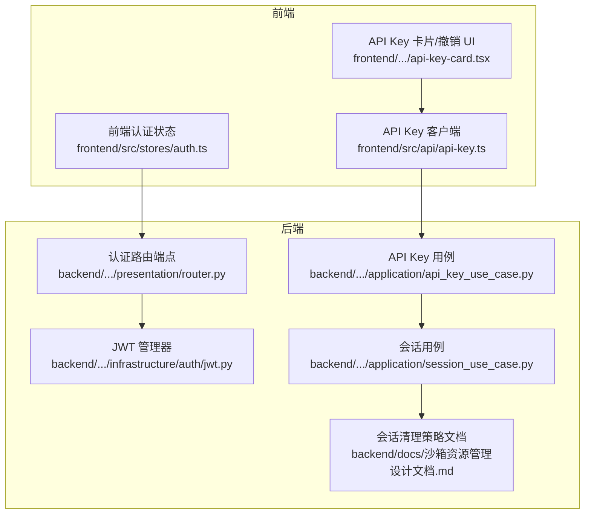
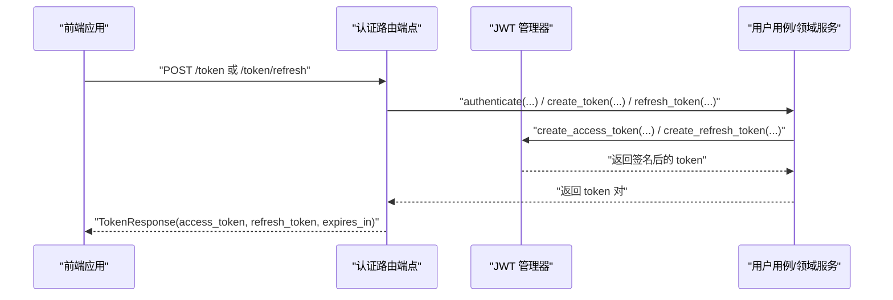
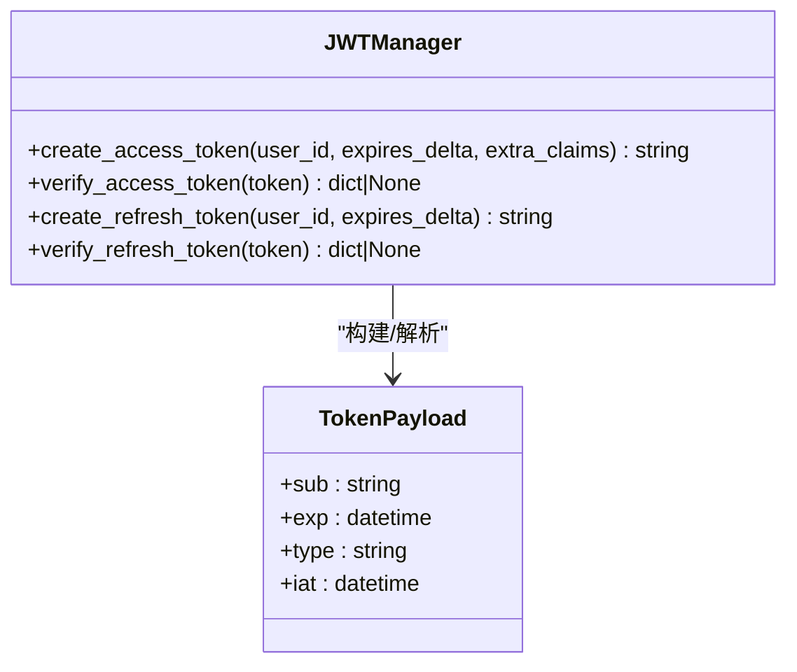
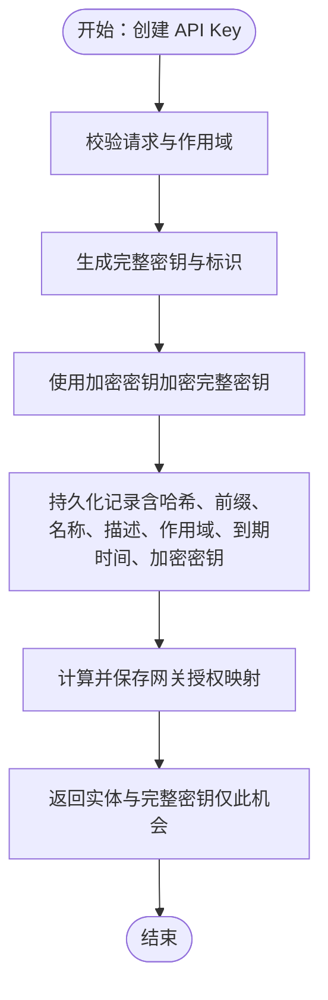
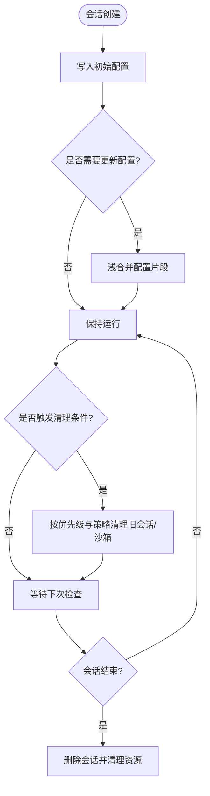
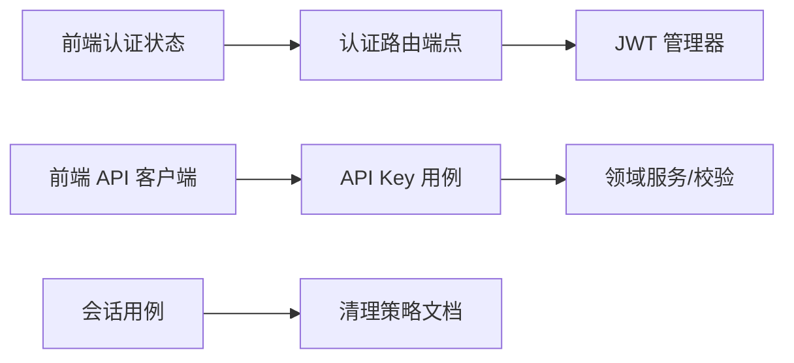

# 会话与令牌管理

<cite>
**本文引用的文件**
- [backend\domains\identity\infrastructure\auth\jwt.py](file://backend/domains/identity/infrastructure/auth/jwt.py)
- [backend\domains\identity\presentation\router.py](file://backend/domains/identity/presentation/router.py)
- [backend\domains\identity\application\api_key_use_case.py](file://backend/domains/identity/application/api_key_use_case.py)
- [backend\domains\session\application\session_use_case.py](file://backend/domains/session/application/session_use_case.py)
- [backend\docs\沙箱资源管理设计文档.md](file://backend/docs/沙箱资源管理设计文档.md)
- [frontend\src\stores\auth.ts](file://frontend/src/stores/auth.ts)
- [frontend\src\api\api-key.ts](file://frontend/src/api/api-key.ts)
- [frontend\src\pages\settings\components\api-key-card.tsx](file://frontend/src/pages/settings/components/api-key-card.tsx)
- [backend\tests\unit\application\test_api_key_use_case.py](file://backend/tests/unit/application/test_api_key_use_case.py)
- [backend\tests\unit\core\auth\test_api_key_service.py](file://backend/tests/unit/core/auth/test_api_key_service.py)
</cite>

## 目录
1. [引言](#引言)
2. [项目结构](#项目结构)
3. [核心组件](#核心组件)
4. [架构总览](#架构总览)
5. [详细组件分析](#详细组件分析)
6. [依赖关系分析](#依赖关系分析)
7. [性能考量](#性能考量)
8. [故障排查指南](#故障排查指南)
9. [结论](#结论)
10. [附录](#附录)

## 引言
本文件面向开发者与运维工程师，系统化梳理 AI Agent 项目的会话与令牌管理方案，覆盖以下主题：
- JWT 令牌的生成、验证与刷新机制（结构、签名算法、有效期）
- API 密钥的创建、加密存储、轮换与撤销流程
- 会话生命周期管理（创建、状态维护、自动清理）
- 令牌安全存储策略（客户端与服务器端）
- 权限控制与作用域管理
- 会话劫持防护与令牌泄露检测思路
- 多设备登录与并发会话策略
- 最佳实践与常见问题处理
- 安全审计与异常行为检测建议

## 项目结构
围绕会话与令牌管理的关键目录与文件：
- 后端认证与令牌
  - JWT 管理器与路由端点：[backend\domains\identity\infrastructure\auth\jwt.py](file://backend/domains/identity/infrastructure/auth/jwt.py)，[backend\domains\identity\presentation\router.py](file://backend/domains/identity/presentation/router.py)
- 后端 API Key 管理
  - 用例与领域服务：[backend\domains\identity\application\api_key_use_case.py](file://backend/domains/identity/application/api_key_use_case.py)
- 后端会话管理
  - 会话用例与清理策略：[backend\domains\session\application\session_use_case.py](file://backend/domains/session/application/session_use_case.py)，[backend\docs\沙箱资源管理设计文档.md](file://backend/docs/沙箱资源管理设计文档.md)
- 前端状态与 API
  - 认证状态存储与持久化：[frontend\src\stores\auth.ts](file://frontend/src/stores/auth.ts)
  - API Key 管理 API 客户端：[frontend\src\api\api-key.ts](file://frontend/src/api/api-key.ts)，[frontend\src\pages\settings\components\api-key-card.tsx](file://frontend/src/pages/settings/components/api-key-card.tsx)
- 测试与验证
  - API Key 创建与作用域校验测试：[backend\tests\unit\application\test_api_key_use_case.py](file://backend/tests/unit/application/test_api_key_use_case.py)，[backend\tests\unit\core\auth\test_api_key_service.py](file://backend/tests/unit/core/auth/test_api_key_service.py)

图表来源
- [backend\domains\identity\presentation\router.py:100-143](file://backend/domains/identity/presentation/router.py#L100-L143)
- [backend\domains\identity\infrastructure\auth\jwt.py:35-217](file://backend/domains/identity/infrastructure/auth/jwt.py#L35-L217)
- [backend\domains\identity\application\api_key_use_case.py:82-240](file://backend/domains/identity/application/api_key_use_case.py#L82-L240)
- [backend\domains\session\application\session_use_case.py:234-269](file://backend/domains/session/application/session_use_case.py#L234-L269)
- [backend\docs\沙箱资源管理设计文档.md:240-298](file://backend/docs/沙箱资源管理设计文档.md#L240-L298)
- [frontend\src\stores\auth.ts:1-56](file://frontend/src/stores/auth.ts#L1-L56)
- [frontend\src\api\api-key.ts:1-59](file://frontend/src/api/api-key.ts#L1-L59)
- [frontend\src\pages\settings\components\api-key-card.tsx:152-179](file://frontend/src/pages/settings/components/api-key-card.tsx#L152-L179)

章节来源
- [backend\domains\identity\presentation\router.py:100-143](file://backend/domains/identity/presentation/router.py#L100-L143)
- [backend\domains\identity\infrastructure\auth\jwt.py:35-217](file://backend/domains/identity/infrastructure/auth/jwt.py#L35-L217)
- [backend\domains\identity\application\api_key_use_case.py:82-240](file://backend/domains/identity/application/api_key_use_case.py#L82-L240)
- [backend\domains\session\application\session_use_case.py:234-269](file://backend/domains/session/application/session_use_case.py#L234-L269)
- [backend\docs\沙箱资源管理设计文档.md:240-298](file://backend/docs/沙箱资源管理设计文档.md#L240-L298)
- [frontend\src\stores\auth.ts:1-56](file://frontend/src/stores/auth.ts#L1-L56)
- [frontend\src\api\api-key.ts:1-59](file://frontend/src/api/api-key.ts#L1-L59)
- [frontend\src\pages\settings\components\api-key-card.tsx:152-179](file://frontend/src/pages/settings/components/api-key-card.tsx#L152-L179)

## 核心组件
- JWT 管理器与路由端点
  - 提供访问令牌与刷新令牌的生成、验证与刷新能力，并在认证路由中暴露登录与刷新端点。
- API Key 用例
  - 负责 API Key 的创建、加密存储、作用域校验、到期与撤销管理，并支持网关授权映射。
- 会话用例与清理策略
  - 支持会话配置片段合并、删除与关联沙箱清理；结合文档中的会话清理策略实现自动淘汰与定期巡检。
- 前端认证状态与 API Key 客户端
  - 使用持久化状态管理 JWT 与刷新令牌；提供 API Key 列表、创建与解密展示等前端接口。

章节来源
- [backend\domains\identity\infrastructure\auth\jwt.py:35-217](file://backend/domains/identity/infrastructure/auth/jwt.py#L35-L217)
- [backend\domains\identity\presentation\router.py:100-143](file://backend/domains/identity/presentation/router.py#L100-L143)
- [backend\domains\identity\application\api_key_use_case.py:82-240](file://backend/domains/identity/application/api_key_use_case.py#L82-L240)
- [backend\domains\session\application\session_use_case.py:234-269](file://backend/domains/session/application/session_use_case.py#L234-L269)
- [frontend\src\stores\auth.ts:1-56](file://frontend/src/stores/auth.ts#L1-L56)
- [frontend\src\api\api-key.ts:1-59](file://frontend/src/api/api-key.ts#L1-L59)

## 架构总览
整体交互从前端发起登录/刷新请求到后端认证路由，后端通过 JWT 管理器签发令牌对；API Key 作为独立的长期凭据用于服务端到服务端调用；会话用例负责会话生命周期与资源清理。

图表来源
- [backend\domains\identity\presentation\router.py:100-143](file://backend/domains/identity/presentation/router.py#L100-L143)
- [backend\domains\identity\infrastructure\auth\jwt.py:35-217](file://backend/domains/identity/infrastructure/auth/jwt.py#L35-L217)

## 详细组件分析

### JWT 令牌管理
- 令牌结构与载荷
  - 载荷包含用户标识、类型（access/refresh）、签发时间与过期时间等关键字段，便于后端快速解析与校验。
- 签名算法与有效期
  - 使用标准 JWT 库进行签名与验证；过期时间通过配置与增量参数控制，刷新流程在路由端点中实现。
- 生成与验证流程
  - 登录成功后生成访问令牌与刷新令牌对；访问令牌过期后使用刷新令牌换取新的令牌对，避免用户感知中断。
- 错误处理
  - 对过期与无效令牌进行捕获与日志记录，保证系统稳健性。

图表来源
- [backend\domains\identity\infrastructure\auth\jwt.py:26-52](file://backend/domains/identity/infrastructure/auth/jwt.py#L26-L52)
- [backend\domains\identity\infrastructure\auth\jwt.py:35-167](file://backend/domains/identity/infrastructure/auth/jwt.py#L35-L167)

章节来源
- [backend\domains\identity\infrastructure\auth\jwt.py:35-217](file://backend/domains/identity/infrastructure/auth/jwt.py#L35-L217)
- [backend\domains\identity\presentation\router.py:100-143](file://backend/domains/identity/presentation/router.py#L100-L143)

### API 密钥管理
- 创建与加密存储
  - 创建时生成完整密钥与唯一标识，使用配置的加密密钥对完整密钥进行加密存储，仅在创建时返回完整密钥给调用方。
- 作用域与到期管理
  - 支持自定义作用域集合与最大有效期约束；更新时可延长到期时间、调整激活状态与撤销状态。
- 网关授权映射
  - 支持将 API Key 作用域映射到网关授权，确保下游调用具备最小权限。
- 前端交互
  - 提供列表、创建、解密展示等 API 客户端；UI 中支持撤销操作与二次确认。

图表来源
- [backend\domains\identity\application\api_key_use_case.py:82-120](file://backend/domains/identity/application/api_key_use_case.py#L82-L120)
- [frontend\src\api\api-key.ts:1-59](file://frontend/src/api/api-key.ts#L1-L59)
- [frontend\src\pages\settings\components\api-key-card.tsx:152-179](file://frontend/src/pages/settings/components/api-key-card.tsx#L152-L179)

章节来源
- [backend\domains\identity\application\api_key_use_case.py:82-240](file://backend/domains/identity/application/api_key_use_case.py#L82-L240)
- [frontend\src\api\api-key.ts:1-59](file://frontend/src/api/api-key.ts#L1-L59)
- [frontend\src\pages\settings\components\api-key-card.tsx:152-179](file://frontend/src/pages/settings/components/api-key-card.tsx#L152-L179)
- [backend\tests\unit\application\test_api_key_use_case.py:49-87](file://backend/tests/unit/application/test_api_key_use_case.py#L49-L87)
- [backend\tests\unit\core\auth\test_api_key_service.py:135-169](file://backend/tests/unit/core/auth/test_api_key_service.py#L135-L169)

### 会话生命周期管理
- 会话配置合并与删除
  - 支持浅合并写入会话配置片段；删除会话时可联动清理关联沙箱资源。
- 自动清理策略
  - 文档定义了基于用户与全局的 LRU 淘汰策略、清理优先级与定期巡检循环，保障资源占用可控。

图表来源
- [backend\domains\session\application\session_use_case.py:234-269](file://backend/domains/session/application/session_use_case.py#L234-L269)
- [backend\docs\沙箱资源管理设计文档.md:240-298](file://backend/docs/沙箱资源管理设计文档.md#L240-L298)

章节来源
- [backend\domains\session\application\session_use_case.py:234-269](file://backend/domains/session/application/session_use_case.py#L234-L269)
- [backend\docs\沙箱资源管理设计文档.md:240-298](file://backend/docs/沙箱资源管理设计文档.md#L240-L298)

### 前端认证状态与令牌存储
- 状态管理
  - 使用持久化状态存储访问令牌与刷新令牌，支持登出时统一清除。
- 与 API 客户端解耦
  - API 客户端通过状态获取令牌，避免直接操作浏览器存储，降低耦合度。
- SSO 模式提示
  - 文档注释指出在 SSO 模式下由网关注入身份，前端无需本地 token。

章节来源
- [frontend\src\stores\auth.ts:1-56](file://frontend/src/stores/auth.ts#L1-L56)

## 依赖关系分析
- 认证端点依赖 JWT 管理器生成/验证令牌
- API Key 用例依赖领域服务进行作用域与到期校验
- 会话用例依赖清理策略文档中的淘汰与巡检逻辑
- 前端通过 API 客户端与后端交互，状态通过持久化存储管理

图表来源
- [backend\domains\identity\presentation\router.py:100-143](file://backend/domains/identity/presentation/router.py#L100-L143)
- [backend\domains\identity\infrastructure\auth\jwt.py:35-217](file://backend/domains/identity/infrastructure/auth/jwt.py#L35-L217)
- [backend\domains\identity\application\api_key_use_case.py:82-240](file://backend/domains/identity/application/api_key_use_case.py#L82-L240)
- [backend\domains\session\application\session_use_case.py:234-269](file://backend/domains/session/application/session_use_case.py#L234-L269)
- [frontend\src\stores\auth.ts:1-56](file://frontend/src/stores/auth.ts#L1-L56)
- [frontend\src\api\api-key.ts:1-59](file://frontend/src/api/api-key.ts#L1-L59)

章节来源
- [backend\domains\identity\presentation\router.py:100-143](file://backend/domains/identity/presentation/router.py#L100-L143)
- [backend\domains\identity\infrastructure\auth\jwt.py:35-217](file://backend/domains/identity/infrastructure/auth/jwt.py#L35-L217)
- [backend\domains\identity\application\api_key_use_case.py:82-240](file://backend/domains/identity/application/api_key_use_case.py#L82-L240)
- [backend\domains\session\application\session_use_case.py:234-269](file://backend/domains/session/application/session_use_case.py#L234-L269)
- [frontend\src\stores\auth.ts:1-56](file://frontend/src/stores/auth.ts#L1-L56)
- [frontend\src\api\api-key.ts:1-59](file://frontend/src/api/api-key.ts#L1-L59)

## 性能考量
- 令牌签发与验证
  - 使用标准 JWT 库，注意在高并发场景下对密钥轮换与缓存策略进行评估，避免频繁重签导致的 CPU 压力。
- API Key 查询与加密
  - 加密与解密操作应尽量异步化与批量化，避免阻塞请求路径；对解密展示接口增加访问频率限制。
- 会话清理
  - 定期巡检与 LRU 淘汰需配合数据库索引优化，减少扫描成本；清理任务应设置合理的并发上限与退避策略。

## 故障排查指南
- 令牌相关
  - 访问令牌过期：前端收到 401 时清除访问令牌，保留刷新令牌并调用刷新端点；若刷新失败则引导重新登录。
  - 无效令牌：检查签名密钥一致性与时间同步，确认未被篡改。
- API Key 相关
  - 创建后无法解密：确认加密密钥已正确配置且与创建时一致；检查数据库中加密字段完整性。
  - 更新失败：检查撤销状态与到期状态约束，避免对已撤销或已过期的密钥进行启用或延长。
- 会话相关
  - 会话删除失败：检查会话是否存在与权限；关注沙箱清理异常日志并进行人工干预。

章节来源
- [backend\domains\identity\presentation\router.py:100-143](file://backend/domains/identity/presentation/router.py#L100-L143)
- [backend\domains\identity\application\api_key_use_case.py:202-240](file://backend/domains/identity/application/api_key_use_case.py#L202-L240)
- [backend\domains\session\application\session_use_case.py:241-269](file://backend/domains/session/application/session_use_case.py#L241-L269)

## 结论
本项目在后端实现了完善的 JWT 令牌管理与认证路由，在前端提供了持久化的认证状态与 API Key 管理能力，并通过会话用例与清理策略文档保障资源的可持续使用。建议在生产环境中进一步完善令牌泄露检测、多设备并发策略与安全审计机制，以提升整体安全性与可观测性。

## 附录
- 最佳实践
  - 令牌
    - 使用短有效期访问令牌与较长有效期刷新令牌；在刷新失败时及时回收刷新令牌。
    - 采用强随机密钥与定期轮换，确保签名与加密密钥安全。
  - API Key
    - 严格最小权限作用域；到期时间不超过一年；启用撤销与使用统计。
    - 对解密展示接口增加速率限制与访问审计。
  - 会话
    - 基于用户与全局的 LRU 策略定期清理；为不同状态设置差异化清理优先级。
    - 对会话沙箱资源清理失败进行告警与重试。
- 常见问题
  - 刷新失败：检查刷新令牌有效性与服务端时间同步；必要时强制重新登录。
  - 密钥不可用：核对加密密钥配置与数据库中加密字段；避免跨环境混用。
  - 会话资源泄漏：检查清理策略执行情况与数据库索引；对异常会话进行人工清理。