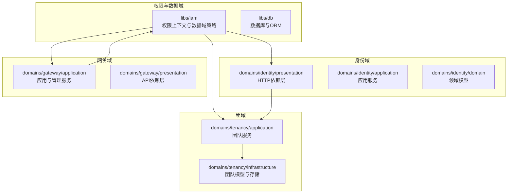
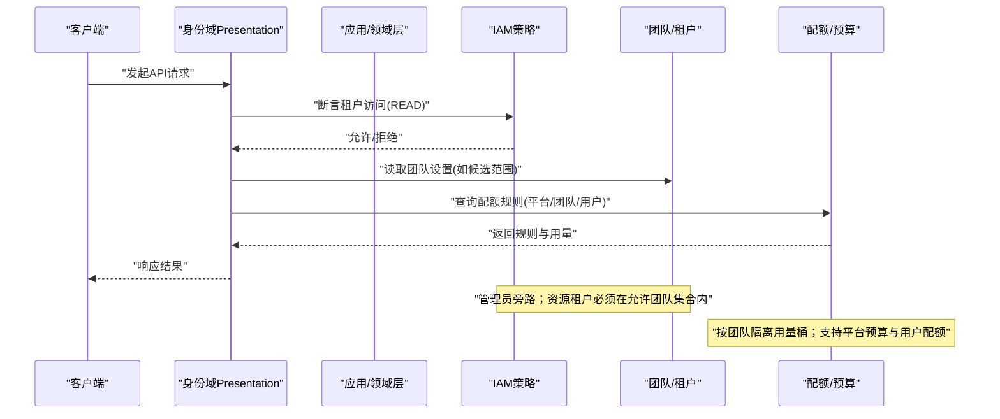
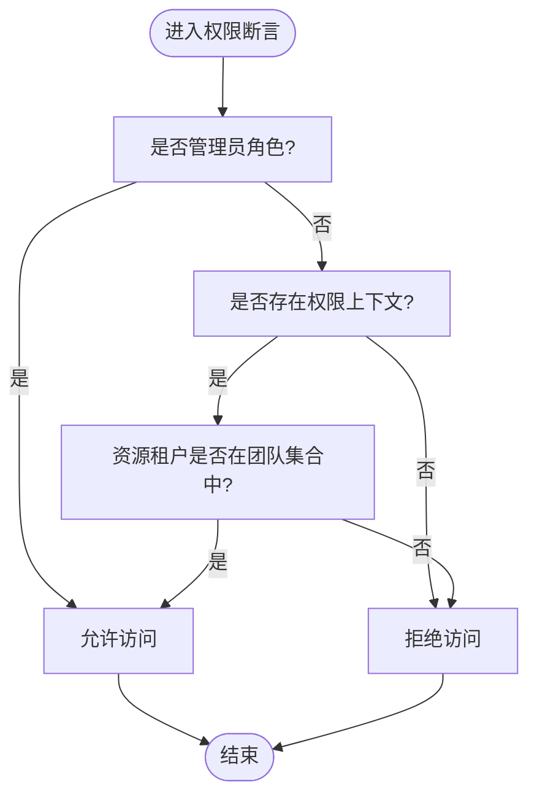
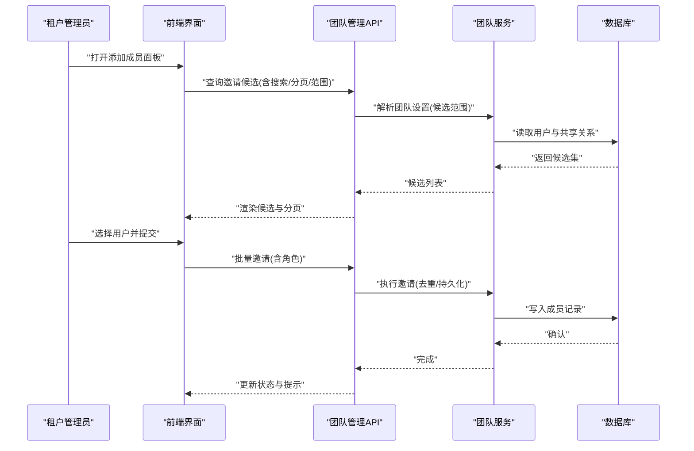
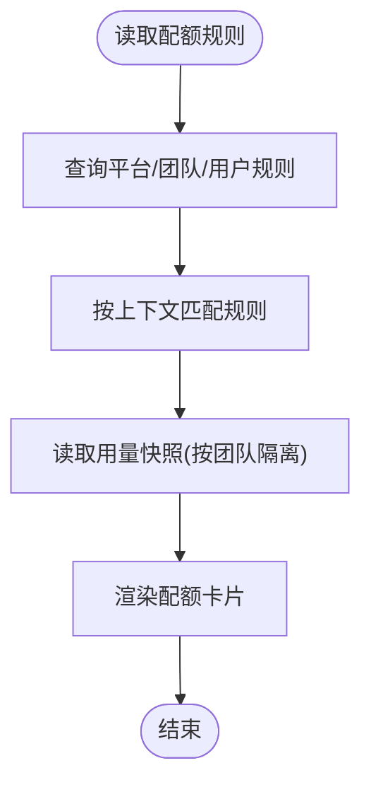
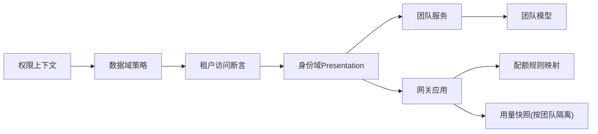

# 多租户权限

<cite>
**本文引用的文件**
- [data_scope_policy.py](file://backend/libs/iam/data_scope_policy.py)
- [tenant_access_assertions.py](file://backend/libs/iam/tenant_access_assertions.py)
- [deps.py](file://backend/domains/identity/presentation/deps.py)
- [permission_context.py](file://backend/libs/iam/permission_context.py)
- [team.py](file://backend/domains/tenancy/infrastructure/models/team.py)
- [team_service.py](file://backend/domains/tenancy/application/team_service.py)
- [quota_rule_read_mappers.py](file://backend/domains/gateway/application/management/quota_rule_read_mappers.py)
- [budget_usage_snapshot_tenant.py](file://backend/tests/unit/gateway/test_quota_usage_snapshot_tenant.py)
- [test_gateway_management_api.py](file://backend/tests/integration/api/test_gateway_management_api.py)
- [add-team-members-sheet.tsx](file://frontend/src/features/gateway-teams/add-team-members-sheet.tsx)
- [budget-usage-card.tsx](file://frontend/src/features/gateway-budget/budget-usage-card.tsx)
- [test_data_scope_equivalence.py](file://backend/tests/unit/libs/db/test_data_scope_equivalence.py)
- [test_permission_checks.py](file://backend/tests/unit/identity/presentation/test_permission_checks.py)
- [test_gateway_quota_rules_api.py](file://backend/tests/integration/api/test_gateway_quota_rules_api.py)
</cite>

## 目录
1. [引言](#引言)
2. [项目结构](#项目结构)
3. [核心组件](#核心组件)
4. [架构总览](#架构总览)
5. [详细组件分析](#详细组件分析)
6. [依赖关系分析](#依赖关系分析)
7. [性能考量](#性能考量)
8. [故障排查指南](#故障排查指南)
9. [结论](#结论)
10. [附录](#附录)

## 引言
本文件面向平台管理员与租户管理员，系统化阐述 AI Agent 项目的多租户权限体系。重点覆盖以下方面：
- 租户边界与资源命名空间：以“团队”作为租户实体，资源归属通过租户 ID 实现强隔离。
- 权限隔离与访问控制：基于权限上下文与数据域策略，确保资源可见性与操作权限严格受控。
- 团队管理：团队创建、成员邀请与角色分配的流程与边界。
- 租户级资源访问控制：数据隔离、配置管理与 API 访问权限。
- 跨租户资源共享与权限传递：候选范围策略与共享团队机制。
- 权限继承与合并：平台层、团队层、用户层规则的叠加与优先级。
- 配额管理与预算控制：平台预算、用户配额与用量快照的租户隔离。
- 权限审计与合规：通过规则列表与用量查询实现可追溯性。
- 最佳实践与常见冲突解决：统一的权限模型与前端交互约束。

## 项目结构
后端采用分层架构，IAM（身份与权限）能力位于 libs/iam 下，权限断言与策略在 IAM 层实现，供 presentation、application、domain 层复用。团队与租户概念由 tenancy 域承载，网关与配额相关逻辑位于 gateway 域。

图示来源
- [data_scope_policy.py:42-52](file://backend/libs/iam/data_scope_policy.py#L42-L52)
- [deps.py:158-164](file://backend/domains/identity/presentation/deps.py#L158-L164)
- [team.py](file://backend/domains/tenancy/infrastructure/models/team.py)
- [team_service.py](file://backend/domains/tenancy/application/team_service.py)

章节来源
- [data_scope_policy.py:42-52](file://backend/libs/iam/data_scope_policy.py#L42-L52)
- [deps.py:158-164](file://backend/domains/identity/presentation/deps.py#L158-L164)
- [team.py](file://backend/domains/tenancy/infrastructure/models/team.py)
- [team_service.py](file://backend/domains/tenancy/application/team_service.py)

## 核心组件
- 权限上下文与数据域策略
  - 权限上下文：封装当前用户的角色、所属团队集合等信息，是所有权限判断的基础。
  - 数据域策略：以“资源所属租户是否在上下文允许的团队集合内”为核心判定条件，并对管理员角色进行旁路放行。
- 租户访问断言
  - 在应用/领域层直接调用的断言函数，用于强制校验资源访问权，失败抛出权限异常。
- 团队与租户模型
  - 团队即租户，团队模型承载团队元数据与设置，如邀请候选范围等。
- 配额与预算映射
  - 将平台预算映射为配额规则读模型，区分目标类型（租户、用户、密钥等），并确定规则层别（平台层）。

章节来源
- [permission_context.py](file://backend/libs/iam/permission_context.py)
- [data_scope_policy.py:42-52](file://backend/libs/iam/data_scope_policy.py#L42-L52)
- [tenant_access_assertions.py:22-50](file://backend/libs/iam/tenant_access_assertions.py#L22-L50)
- [team.py](file://backend/domains/tenancy/infrastructure/models/team.py)
- [quota_rule_read_mappers.py:26-48](file://backend/domains/gateway/application/management/quota_rule_read_mappers.py#L26-L48)

## 架构总览
下图展示从 HTTP 请求到权限断言与团队/配额规则的交互路径，体现“租户边界 + 数据域策略 + 配额规则”的整体控制链。

图示来源
- [deps.py:158-164](file://backend/domains/identity/presentation/deps.py#L158-L164)
- [tenant_access_assertions.py:22-50](file://backend/libs/iam/tenant_access_assertions.py#L22-L50)
- [data_scope_policy.py:42-52](file://backend/libs/iam/data_scope_policy.py#L42-L52)
- [team_service.py](file://backend/domains/tenancy/application/team_service.py)
- [quota_rule_read_mappers.py:26-48](file://backend/domains/gateway/application/management/quota_rule_read_mappers.py#L26-L48)

## 详细组件分析

### 组件A：租户边界与数据域策略
- 租户边界
  - 资源归属通过资源对象的租户 ID 字段标识；HTTP 层与应用层均以该 ID 进行访问控制。
  - 权限上下文中的团队集合决定资源可见性；资源租户不在允许集合时拒绝访问。
- 数据域策略
  - 策略函数以“资源租户 ∈ 当前上下文团队集合”为核心判定；管理员恒允许。
  - 未携带租户 ID 的资源一律拒绝访问。
- 断言函数
  - 应用/领域层直接调用断言函数，失败抛出权限异常，避免在表现层重复校验。

图示来源
- [data_scope_policy.py:42-52](file://backend/libs/iam/data_scope_policy.py#L42-L52)
- [tenant_access_assertions.py:22-50](file://backend/libs/iam/tenant_access_assertions.py#L22-L50)

章节来源
- [data_scope_policy.py:42-52](file://backend/libs/iam/data_scope_policy.py#L42-L52)
- [tenant_access_assertions.py:22-50](file://backend/libs/iam/tenant_access_assertions.py#L22-L50)
- [test_data_scope_equivalence.py:33-52](file://backend/tests/unit/libs/db/test_data_scope_equivalence.py#L33-L52)
- [test_permission_checks.py:35-91](file://backend/tests/unit/identity/presentation/test_permission_checks.py#L35-L91)

### 组件B：团队管理与成员邀请
- 团队创建与成员邀请
  - 团队服务负责团队创建与成员添加；前端提供邀请候选查询与批量邀请交互。
  - 邀请候选范围可通过团队设置进行控制，支持“仅团队成员”或“共享团队”两种模式。
- 候选范围策略
  - “共享团队”模式下，候选来源扩展至与目标团队存在共享关系的其他团队成员。
  - 已为团队成员的用户不会出现在候选列表中，避免重复邀请。
- 前端交互
  - 添加成员表单支持搜索、分页、角色选择与进度反馈；根据团队设置动态调整候选范围。

图示来源
- [test_gateway_management_api.py:377-418](file://backend/tests/integration/api/test_gateway_management_api.py#L377-L418)
- [add-team-members-sheet.tsx:83-88](file://frontend/src/features/gateway-teams/add-team-members-sheet.tsx#L83-L88)

章节来源
- [test_gateway_management_api.py:328-434](file://backend/tests/integration/api/test_gateway_management_api.py#L328-L434)
- [add-team-members-sheet.tsx:45-136](file://frontend/src/features/gateway-teams/add-team-members-sheet.tsx#L45-L136)

### 组件C：租户级资源访问控制
- 数据隔离
  - 所有资源均需明确归属租户；HTTP 层与应用层通过断言函数强制校验资源租户是否在当前上下文允许集合内。
- 配置管理
  - 团队设置影响成员邀请候选范围等行为；变更需具备相应角色权限。
- API 访问权限
  - API 层在路由处理前执行租户访问断言；非管理员且不在允许集合内的请求被拒绝。

章节来源
- [deps.py:158-164](file://backend/domains/identity/presentation/deps.py#L158-L164)
- [test_permission_checks.py:35-91](file://backend/tests/unit/identity/presentation/test_permission_checks.py#L35-L91)

### 组件D：跨租户资源共享与权限传递
- 公开资源与私有资源
  - 对于公开资源，跳过租户检查；对于私有资源，委托租户访问断言。
- 共享团队机制
  - 通过团队设置控制候选范围，使不同团队成员在特定场景下具备共享可见性。
- 权限传递
  - 权限不跨租户自动传递；若需要跨租户协作，应通过团队设置与成员邀请建立共享关系。

章节来源
- [tenant_access_assertions.py:53-62](file://backend/libs/iam/tenant_access_assertions.py#L53-L62)
- [test_gateway_management_api.py:377-418](file://backend/tests/integration/api/test_gateway_management_api.py#L377-L418)

### 组件E：权限继承与权限合并
- 权限继承
  - 管理员角色在数据域策略中旁路所有租户检查；普通用户仅能访问其所属团队集合内的资源。
- 权限合并
  - 权限上下文中维护团队集合，资源可见性由“资源租户 ∈ 团队集合”决定；不存在“或”式合并，仅以集合包含关系为准。
- 规则层别
  - 平台预算映射为平台层规则，团队/用户/密钥目标分别映射为团队层/用户层规则，形成多层叠加。

章节来源
- [data_scope_policy.py:42-52](file://backend/libs/iam/data_scope_policy.py#L42-L52)
- [quota_rule_read_mappers.py:26-48](file://backend/domains/gateway/application/management/quota_rule_read_mappers.py#L26-L48)

### 组件F：租户级配额管理与预算控制
- 规则来源
  - 平台预算、上游厂商额度与下游权益共同构成配额规则；平台层规则优先于团队/用户层规则。
- 用量隔离
  - 用量快照按团队隔离的租户段进行读取，确保跨团队用量互不影响。
- 前端展示
  - 配额卡片根据上下文匹配规则并展示限额与用量，无规则时提示联系管理员。

图示来源
- [test_gateway_quota_rules_api.py:20-46](file://backend/tests/integration/api/test_gateway_quota_rules_api.py#L20-L46)
- [budget_usage_snapshot_tenant.py:52-74](file://backend/tests/unit/gateway/test_quota_usage_snapshot_tenant.py#L52-L74)
- [budget-usage-card.tsx:76-122](file://frontend/src/features/gateway-budget/budget-usage-card.tsx#L76-L122)

章节来源
- [quota_rule_read_mappers.py:26-48](file://backend/domains/gateway/application/management/quota_rule_read_mappers.py#L26-L48)
- [budget_usage_snapshot_tenant.py:52-74](file://backend/tests/unit/gateway/test_quota_usage_snapshot_tenant.py#L52-L74)
- [test_gateway_quota_rules_api.py:1-46](file://backend/tests/integration/api/test_gateway_quota_rules_api.py#L1-L46)
- [budget-usage-card.tsx:76-122](file://frontend/src/features/gateway-budget/budget-usage-card.tsx#L76-L122)

### 组件G：租户迁移与权限继承
- 迁移场景
  - 资源迁移需同步更新资源的租户 ID；迁移前后均需通过权限断言验证访问权。
- 权限继承
  - 迁移不改变现有权限模型；新租户需重新建立成员关系与团队设置，以确保访问控制生效。
- 建议流程
  - 迁移前备份资源与成员关系；迁移后验证权限断言与配额规则一致性。

章节来源
- [data_scope_policy.py:42-52](file://backend/libs/iam/data_scope_policy.py#L42-L52)
- [team_service.py](file://backend/domains/tenancy/application/team_service.py)

## 依赖关系分析
- 权限上下文与策略
  - 权限断言依赖权限上下文；数据域策略依赖资源租户 ID 与上下文团队集合。
- 团队与租户
  - 团队服务提供团队设置与成员管理；团队设置影响成员邀请候选范围。
- 配额与预算
  - 预算模型映射为配额规则；用量快照按团队隔离读取。

图示来源
- [permission_context.py](file://backend/libs/iam/permission_context.py)
- [data_scope_policy.py:42-52](file://backend/libs/iam/data_scope_policy.py#L42-L52)
- [tenant_access_assertions.py:22-50](file://backend/libs/iam/tenant_access_assertions.py#L22-L50)
- [team_service.py](file://backend/domains/tenancy/application/team_service.py)
- [team.py](file://backend/domains/tenancy/infrastructure/models/team.py)
- [quota_rule_read_mappers.py:26-48](file://backend/domains/gateway/application/management/quota_rule_read_mappers.py#L26-L48)
- [budget_usage_snapshot_tenant.py:52-74](file://backend/tests/unit/gateway/test_quota_usage_snapshot_tenant.py#L52-L74)

章节来源
- [permission_context.py](file://backend/libs/iam/permission_context.py)
- [data_scope_policy.py:42-52](file://backend/libs/iam/data_scope_policy.py#L42-L52)
- [tenant_access_assertions.py:22-50](file://backend/libs/iam/tenant_access_assertions.py#L22-L50)
- [team_service.py](file://backend/domains/tenancy/application/team_service.py)
- [team.py](file://backend/domains/tenancy/infrastructure/models/team.py)
- [quota_rule_read_mappers.py:26-48](file://backend/domains/gateway/application/management/quota_rule_read_mappers.py#L26-L48)
- [budget_usage_snapshot_tenant.py:52-74](file://backend/tests/unit/gateway/test_quota_usage_snapshot_tenant.py#L52-L74)

## 性能考量
- 权限断言复杂度
  - 数据域策略为集合包含判断，时间复杂度 O(1)，空间复杂度 O(n)（n 为团队集合大小）。
- 用量快照
  - 按团队隔离的租户段读取，避免跨团队扫描；批量查询可减少网络往返。
- 建议
  - 控制团队集合规模；合理拆分团队以降低权限判断成本；缓存常用规则与候选集。

## 故障排查指南
- 常见问题
  - 无法访问资源：检查当前用户是否属于资源租户所在团队集合；确认权限上下文是否正确设置。
  - 成员邀请无候选：检查团队设置的候选范围；确认目标用户是否已是成员。
  - 配额显示为空：确认平台预算与团队/用户规则是否已配置；检查上下文匹配逻辑。
- 定位步骤
  - 启用权限断言日志；核对权限上下文与团队集合；验证资源租户 ID。
  - 使用集成测试与单元测试覆盖点定位问题（如候选范围、权限断言等）。

章节来源
- [test_data_scope_equivalence.py:55-81](file://backend/tests/unit/libs/db/test_data_scope_equivalence.py#L55-L81)
- [test_permission_checks.py:35-91](file://backend/tests/unit/identity/presentation/test_permission_checks.py#L35-L91)
- [test_gateway_management_api.py:377-418](file://backend/tests/integration/api/test_gateway_management_api.py#L377-L418)

## 结论
本项目通过“团队即租户 + 权限上下文 + 数据域策略”的组合，实现了清晰的多租户权限隔离与访问控制。团队管理、成员邀请、配额预算与用量快照等能力在前后端均有明确边界与约束。遵循本文最佳实践与排障建议，可有效保障平台与租户的权限安全与合规。

## 附录
- 最佳实践
  - 明确资源归属租户 ID；管理员旁路仅用于运维场景；严格控制团队集合规模。
  - 使用“共享团队”模式谨慎开放候选范围；定期审计团队成员与配额规则。
  - 前端交互与后端规则保持一致，避免 UI 误导导致的权限误解。
- 常见冲突与解决
  - 资源越权访问：核查权限上下文与团队集合；确保断言函数被调用。
  - 邀请候选缺失：检查团队设置与去重逻辑；确认用户状态。
  - 配额不生效：核对规则层别与上下文匹配；确认用量快照租户段正确。