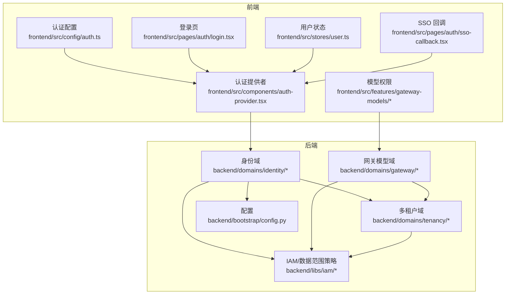
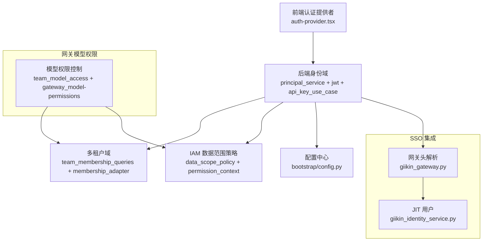
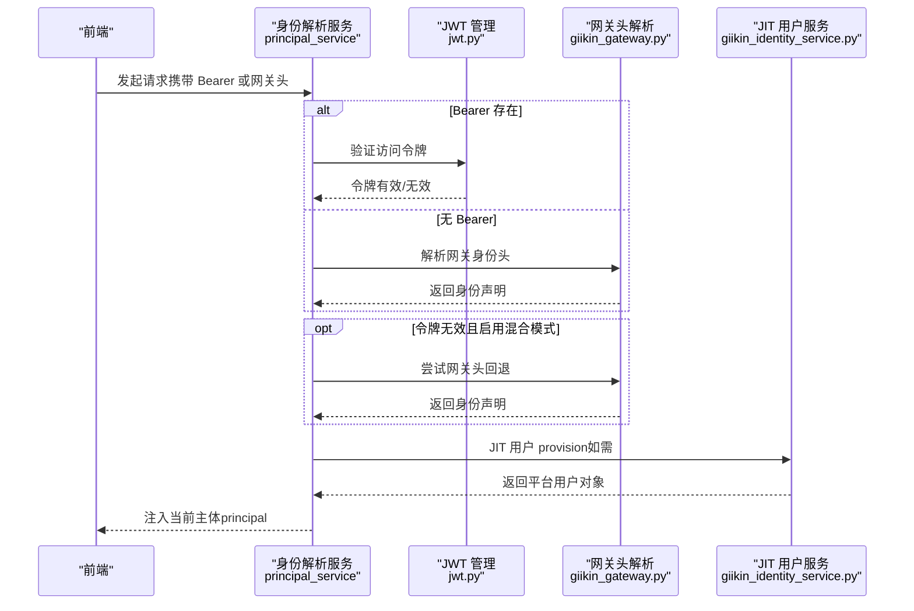
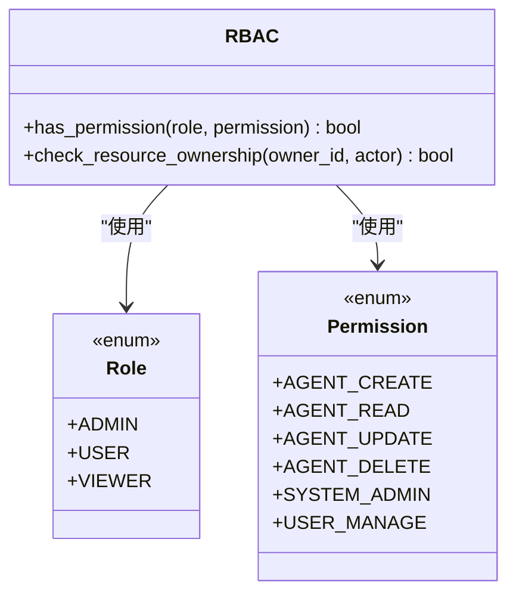
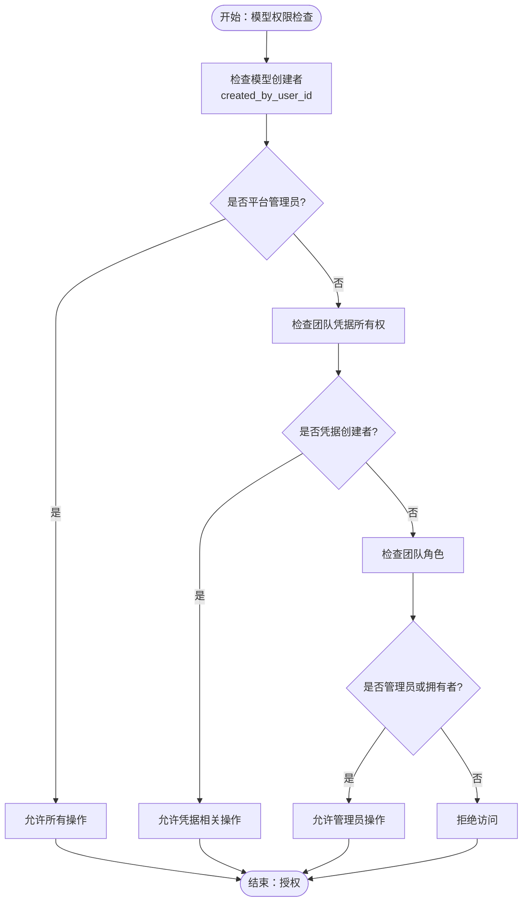
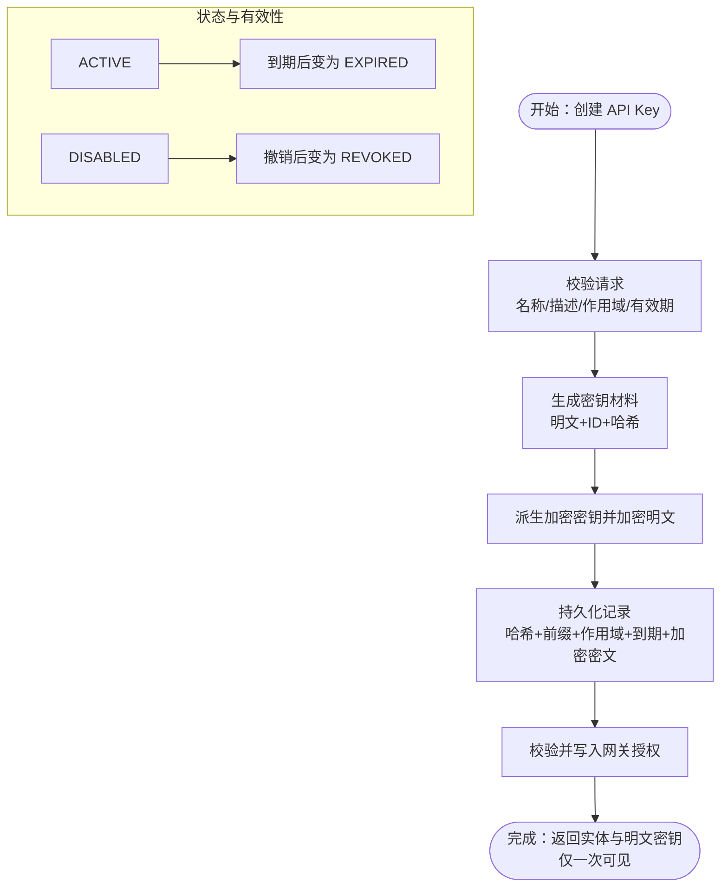
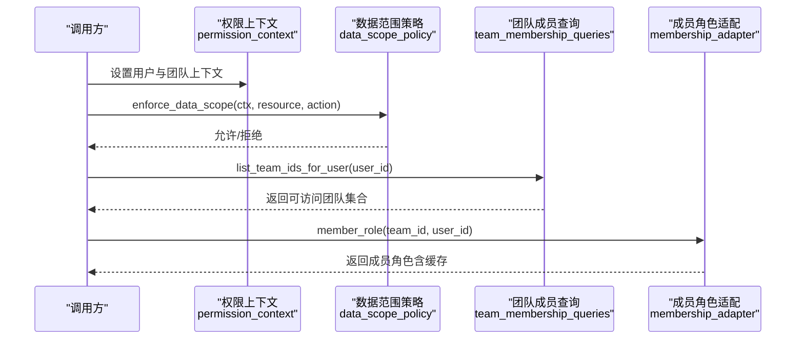
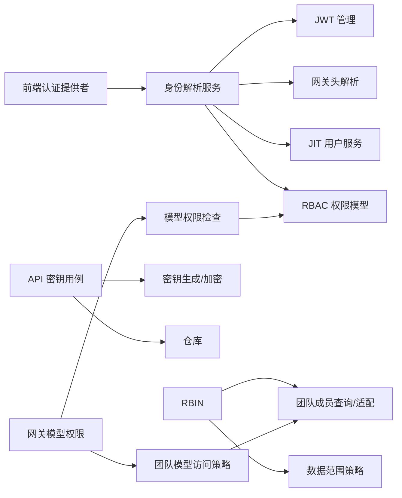

# 安全与权限

<cite>
**本文引用的文件**
- [backend/domains/identity/domain/rbac.py](file://backend/domains/identity/domain/rbac.py)
- [backend/domains/identity/infrastructure/auth/jwt.py](file://backend/domains/identity/infrastructure/auth/jwt.py)
- [backend/domains/identity/application/api_key_use_case.py](file://backend/domains/identity/application/api_key_use_case.py)
- [backend/docs/AUTHENTICATION.md](file://backend/docs/AUTHENTICATION.md)
- [backend/docs/项目权限规则.md](file://backend/docs/项目权限规则.md)
- [backend/docs/SSO.md](file://backend/docs/SSO.md)
- [backend/domains/identity/infrastructure/auth/__init__.py](file://backend/domains/identity/infrastructure/auth/__init__.py)
- [backend/tests/unit/core/auth/test_rbac.py](file://backend/tests/unit/core/auth/test_rbac.py)
- [backend/tests/unit/core/auth/test_api_key_service.py](file://backend/tests/unit/core/auth/test_api_key_service.py)
- [backend/tests/unit/application/test_api_key_use_case.py](file://backend/tests/unit/application/test_api_key_use_case.py)
- [backend/tests/unit/identity/domain/test_api_key_entity_status.py](file://backend/tests/unit/identity/domain/test_api_key_entity_status.py)
- [backend/tests/unit/identity/application/test_token_degradation.py](file://backend/tests/unit/identity/application/test_token_degradation.py)
- [backend/domains/tenancy/application/team_membership_queries.py](file://backend/domains/tenancy/application/team_membership_queries.py)
- [backend/domains/tenancy/infrastructure/membership_adapter.py](file://backend/domains/tenancy/infrastructure/membership_adapter.py)
- [backend/tests/unit/tenancy/test_team_role_policy.py](file://backend/tests/unit/tenancy/test_team_role_policy.py)
- [backend/tests/unit/libs/db/test_data_scope_equivalence.py](file://backend/tests/unit/libs/db/test_data_scope_equivalence.py)
- [backend/domains/identity/presentation/deps.py](file://backend/domains/identity/presentation/deps.py)
- [backend/domains/identity/presentation/schemas.py](file://backend/domains/identity/presentation/schemas.py)
- [backend/libs/exceptions.py](file://backend/libs/exceptions.py)
- [backend/bootstrap/config.py](file://backend/bootstrap/config.py)
- [backend/domains/identity/application/principal_service.py](file://backend/domains/identity/application/principal_service.py)
- [backend/domains/identity/infrastructure/auth/giikin_gateway.py](file://backend/domains/identity/infrastructure/auth/giikin_gateway.py)
- [backend/domains/identity/application/giikin_identity_service.py](file://backend/domains/identity/application/giikin_identity_service.py)
- [backend/domains/identity/domain/api_key_types.py](file://backend/domains/identity/domain/api_key_types.py)
- [backend/domains/identity/infrastructure/auth/password.py](file://backend/domains/identity/infrastructure/auth/password.py)
- [backend/libs/crypto.py](file://backend/libs/crypto.py)
- [backend/utils/crypto.py](file://backend/utils/crypto.py)
- [backend/libs/iam/data_scope_policy.py](file://backend/libs/iam/data_scope_policy.py)
- [backend/libs/iam/permission_context.py](file://backend/libs/iam/permission_context.py)
- [backend/docs/AI_GATEWAY_DOMAIN_ARCHITECTURE.md](file://backend/docs/AI_GATEWAY_DOMAIN_ARCHITECTURE.md)
- [backend/frontend/src/components/auth-provider.tsx](file://backend/frontend/src/components/auth-provider.tsx)
- [backend/frontend/src/config/auth.ts](file://backend/frontend/src/config/auth.ts)
- [backend/frontend/src/pages/auth/login.tsx](file://backend/frontend/src/pages/auth/login.tsx)
- [backend/frontend/src/stores/user.ts](file://backend/frontend/src/stores/user.ts)
- [backend/frontend/src/pages/auth/sso-callback.tsx](file://backend/frontend/src/pages/auth/sso-callback.tsx)
- [backend/frontend/src/features/gateway-models/list/capabilities.ts](file://backend/frontend/src/features/gateway-models/list/capabilities.ts)
- [backend/frontend/src/features/gateway-models/gateway-model-permissions.ts](file://backend/frontend/src/features/gateway-models/gateway-model-permissions.ts)
- [backend/domains/gateway/domain/policies/team_model_access.py](file://backend/domains/gateway/domain/policies/team_model_access.py)
- [backend/domains/gateway/infrastructure/models/gateway_model.py](file://backend/domains/gateway/infrastructure/models/gateway_model.py)
- [backend/tests/unit/gateway/domain/test_team_model_access.py](file://backend/tests/unit/gateway/domain/test_team_model_access.py)
- [backend/tests/unit/gateway/test_system_visibility_policy.py](file://backend/tests/unit/gateway/test_system_visibility_policy.py)
- [backend/domains/gateway/presentation/routers/system_visibility.py](file://backend/domains/gateway/presentation/routers/system_visibility.py)
</cite>

## 更新摘要
**所做更改**
- 新增模型创建者权限控制章节，详细说明用户拥有者系统的实现
- 扩展RBAC权限模型部分，增加创建者权限控制逻辑
- 更新团队模型访问控制策略，包含新的所有权检查机制
- 新增前端模型权限检查功能，支持创建者权限验证
- 更新权限控制逻辑，强化用户拥有者系统

## 目录
1. [简介](#简介)
2. [项目结构](#项目结构)
3. [核心组件](#核心组件)
4. [架构总览](#架构总览)
5. [详细组件分析](#详细组件分析)
6. [依赖关系分析](#依赖关系分析)
7. [性能考量](#性能考量)
8. [故障排查指南](#故障排查指南)
9. [结论](#结论)
10. [附录](#附录)

## 简介
本文件面向安全工程师与开发者，系统化梳理 AI Agent 项目的"身份认证、API 密钥管理、SSO 集成、RBAC 权限模型、多租户权限隔离、API 安全策略、数据安全与隐私保护、会话与令牌管理、安全配置最佳实践、安全监控与事件响应、合规与审计"等主题。文档以仓库中的实际实现为依据，结合单元测试与架构文档，提供可落地的安全指导与实施建议。

**更新** 本次更新重点反映了新增的模型创建者权限控制功能，扩展了RBAC权限模型以支持用户拥有者系统，增强了权限控制逻辑。

## 项目结构
围绕"安全与权限"的关键目录与文件分布如下：
- 身份与权限域：backend/domains/identity/*
- 多租户域：backend/domains/tenancy/*
- IAM 与数据范围策略：backend/libs/iam/*
- 网关模型域：backend/domains/gateway/*
- 配置与启动：backend/bootstrap/config.py
- 前端认证组件与路由：backend/frontend/src/components/auth-provider.tsx 等
- 架构与策略文档：backend/docs/*.md

**图表来源**
- [backend/domains/identity/infrastructure/auth/__init__.py](file://backend/domains/identity/infrastructure/auth/__init__.py)
- [backend/domains/tenancy/application/team_membership_queries.py](file://backend/domains/tenancy/application/team_membership_queries.py)
- [backend/libs/iam/data_scope_policy.py](file://backend/libs/iam/data_scope_policy.py)
- [backend/bootstrap/config.py](file://backend/bootstrap/config.py)
- [backend/frontend/src/components/auth-provider.tsx](file://backend/frontend/src/components/auth-provider.tsx)
- [backend/frontend/src/features/gateway-models/gateway-model-permissions.ts](file://backend/frontend/src/features/gateway-models/gateway-model-permissions.ts)
- [backend/frontend/src/config/auth.ts](file://backend/frontend/src/config/auth.ts)
- [backend/frontend/src/pages/auth/login.tsx](file://backend/frontend/src/pages/auth/login.tsx)
- [backend/frontend/src/stores/user.ts](file://backend/frontend/src/stores/user.ts)
- [backend/frontend/src/pages/auth/sso-callback.tsx](file://backend/frontend/src/pages/auth/sso-callback.tsx)

**章节来源**
- [backend/domains/identity/infrastructure/auth/__init__.py](file://backend/domains/identity/infrastructure/auth/__init__.py)
- [backend/bootstrap/config.py](file://backend/bootstrap/config.py)

## 核心组件
- RBAC 权限模型：角色、权限、资源归属校验、权限判定
- JWT 令牌体系：访问令牌与刷新令牌生成、验证、过期与刷新
- API 密钥管理：密钥生成、加密存储、作用域与有效期、状态与撤销
- 多租户权限隔离：团队成员角色、数据范围策略、租户访问控制
- **新增** 模型创建者权限控制：用户拥有者系统，支持资源创建者权限验证
- SSO 集成：混合认证模式、网关头解析、JIT 用户 provision
- 数据安全与隐私：PII 守卫、密钥加密、访问审计
- 前端认证流程：认证提供者、登录页、回调页、登出

**章节来源**
- [backend/domains/identity/domain/rbac.py](file://backend/domains/identity/domain/rbac.py)
- [backend/domains/identity/infrastructure/auth/jwt.py](file://backend/domains/identity/infrastructure/auth/jwt.py)
- [backend/domains/identity/application/api_key_use_case.py](file://backend/domains/identity/application/api_key_use_case.py)
- [backend/docs/项目权限规则.md](file://backend/docs/项目权限规则.md)
- [backend/docs/SSO.md](file://backend/docs/SSO.md)

## 架构总览
整体安全架构由"前端认证提供者 + 后端身份域 + 多租户域 + 网关模型域 + IAM 数据范围策略 + 配置中心"构成，支持本地认证、SSO 与混合模式，并通过 JWT 与 API Key 提供多层级访问控制。

**图表来源**
- [backend/domains/identity/application/principal_service.py](file://backend/domains/identity/application/principal_service.py)
- [backend/domains/identity/infrastructure/auth/giikin_gateway.py](file://backend/domains/identity/infrastructure/auth/giikin_gateway.py)
- [backend/domains/identity/application/giikin_identity_service.py](file://backend/domains/identity/application/giikin_identity_service.py)
- [backend/domains/tenancy/application/team_membership_queries.py](file://backend/domains/tenancy/application/team_membership_queries.py)
- [backend/domains/tenancy/infrastructure/membership_adapter.py](file://backend/domains/tenancy/infrastructure/membership_adapter.py)
- [backend/libs/iam/data_scope_policy.py](file://backend/libs/iam/data_scope_policy.py)
- [backend/libs/iam/permission_context.py](file://backend/libs/iam/permission_context.py)
- [backend/bootstrap/config.py](file://backend/bootstrap/config.py)
- [backend/frontend/src/features/gateway-models/gateway-model-permissions.ts](file://backend/frontend/src/features/gateway-models/gateway-model-permissions.ts)
- [backend/domains/gateway/domain/policies/team_model_access.py](file://backend/domains/gateway/domain/policies/team_model_access.py)

## 详细组件分析

### 身份认证与会话管理
- 认证模式与降级：支持纯 SSO、本地认证与混合模式；当 Bearer 无效时可回退到网关 Header 进行身份解析。
- JWT 管理：提供访问令牌与刷新令牌的生成、验证与过期控制；令牌载荷包含用户标识、类型与签发时间等。
- 密码处理：密码哈希与校验工具，确保本地账户安全。
- 前端集成：认证提供者、登录页、SSO 回调页与用户状态管理协同工作。

**图表来源**
- [backend/tests/unit/identity/application/test_token_degradation.py](file://backend/tests/unit/identity/application/test_token_degradation.py)
- [backend/domains/identity/application/principal_service.py](file://backend/domains/identity/application/principal_service.py)
- [backend/domains/identity/infrastructure/auth/jwt.py](file://backend/domains/identity/infrastructure/auth/jwt.py)
- [backend/domains/identity/infrastructure/auth/giikin_gateway.py](file://backend/domains/identity/infrastructure/auth/giikin_gateway.py)
- [backend/domains/identity/application/giikin_identity_service.py](file://backend/domains/identity/application/giikin_identity_service.py)

**章节来源**
- [backend/docs/SSO.md](file://backend/docs/SSO.md)
- [backend/domains/identity/infrastructure/auth/jwt.py](file://backend/domains/identity/infrastructure/auth/jwt.py)
- [backend/domains/identity/infrastructure/auth/password.py](file://backend/domains/identity/infrastructure/auth/password.py)
- [backend/frontend/src/components/auth-provider.tsx](file://backend/frontend/src/components/auth-provider.tsx)
- [backend/frontend/src/pages/auth/login.tsx](file://backend/frontend/src/pages/auth/login.tsx)
- [backend/frontend/src/pages/auth/sso-callback.tsx](file://backend/frontend/src/pages/auth/sso-callback.tsx)
- [backend/frontend/src/stores/user.ts](file://backend/frontend/src/stores/user.ts)
- [backend/frontend/src/config/auth.ts](file://backend/frontend/src/config/auth.ts)

### RBAC 权限模型
- 角色与权限：内置管理员、普通用户、只读用户等角色；权限涵盖代理、用户、系统管理等维度。
- 资源归属校验：支持资源所有权检查，防止越权访问。
- **更新** 创建者权限控制：新增 check_resource_ownership 函数，支持用户拥有者系统，管理员可访问所有资源，其他用户只能访问自己的资源。
- 权限判定：has_permission 提供统一的权限判断入口。
- 单元测试覆盖：管理员拥有全部权限，普通用户具备有限权限，只读用户仅具备读权限。

**图表来源**
- [backend/domains/identity/domain/rbac.py](file://backend/domains/identity/domain/rbac.py)
- [backend/tests/unit/core/auth/test_rbac.py](file://backend/tests/unit/core/auth/test_rbac.py)

**章节来源**
- [backend/domains/identity/domain/rbac.py](file://backend/domains/identity/domain/rbac.py)
- [backend/tests/unit/core/auth/test_rbac.py](file://backend/tests/unit/core/auth/test_rbac.py)
- [backend/docs/项目权限规则.md](file://backend/docs/项目权限规则.md)

### 模型创建者权限控制
**新增** 本节详细介绍新增的模型创建者权限控制系统，这是本次更新的核心内容。

- 用户拥有者系统：通过 created_by_user_id 字段跟踪资源创建者，实现精确的所有权控制。
- 团队模型访问策略：支持团队凭据绑定的模型创建、更新、删除权限控制。
- 前端权限验证：提供 actorCreatedModel 和 actorOwnsTeamModel 函数，支持创建者权限检查。
- 权限继承与回退：支持传统共享凭据与新创建者权限系统的兼容。
- 安全边界：确保只有模型创建者或具有相应管理员权限的用户才能执行敏感操作。

**图表来源**
- [backend/domains/gateway/domain/policies/team_model_access.py](file://backend/domains/gateway/domain/policies/team_model_access.py)
- [backend/frontend/src/features/gateway-models/gateway-model-permissions.ts](file://backend/frontend/src/features/gateway-models/gateway-model-permissions.ts)

**章节来源**
- [backend/domains/gateway/domain/policies/team_model_access.py](file://backend/domains/gateway/domain/policies/team_model_access.py)
- [backend/tests/unit/gateway/domain/test_team_model_access.py](file://backend/tests/unit/gateway/domain/test_team_model_access.py)
- [backend/frontend/src/features/gateway-models/gateway-model-permissions.ts](file://backend/frontend/src/features/gateway-models/gateway-model-permissions.ts)
- [backend/frontend/src/features/gateway-models/list/capabilities.ts](file://backend/frontend/src/features/gateway-models/list/capabilities.ts)

### API 密钥管理
- 生命周期：创建、加密存储、到期、禁用、撤销、状态推导。
- 作用域与网关授权：支持按作用域限制 API Key 能力，并可授予网关访问授权。
- 加密与派生：基于应用密钥派生加密密钥，确保密钥明文仅在创建时可见。
- 单元测试：覆盖加密/解密往返、派生一致性、到期天数计算与实体状态推导。

**图表来源**
- [backend/domains/identity/application/api_key_use_case.py](file://backend/domains/identity/application/api_key_use_case.py)
- [backend/tests/unit/core/auth/test_api_key_service.py](file://backend/tests/unit/core/auth/test_api_key_service.py)
- [backend/tests/unit/application/test_api_key_use_case.py](file://backend/tests/unit/application/test_api_key_use_case.py)
- [backend/tests/unit/identity/domain/test_api_key_entity_status.py](file://backend/tests/unit/identity/domain/test_api_key_entity_status.py)
- [backend/domains/identity/domain/api_key_types.py](file://backend/domains/identity/domain/api_key_types.py)

**章节来源**
- [backend/domains/identity/application/api_key_use_case.py](file://backend/domains/identity/application/api_key_use_case.py)
- [backend/tests/unit/core/auth/test_api_key_service.py](file://backend/tests/unit/core/auth/test_api_key_service.py)
- [backend/tests/unit/application/test_api_key_use_case.py](file://backend/tests/unit/application/test_api_key_use_case.py)
- [backend/tests/unit/identity/domain/test_api_key_entity_status.py](file://backend/tests/unit/identity/domain/test_api_key_entity_status.py)

### 多租户权限隔离与团队管理
- 团队成员角色：支持 OWNER、ADMIN、MEMBER 等角色；平台管理员在无团队成员身份时可获得 ADMIN 效果。
- 数据范围策略：通过 enforce_data_scope 与 check_tenant_access 保持行为一致，确保读写均受租户约束。
- 成员查询与适配：提供用户可访问团队 ID 查询与成员角色缓存适配，降低数据库压力。
- 管理面 RBAC：凭据与模型的细粒度授权，强调"创建者私有"与"平台 admin 无旁路"。

**图表来源**
- [backend/tests/unit/libs/db/test_data_scope_equivalence.py](file://backend/tests/unit/libs/db/test_data_scope_equivalence.py)
- [backend/domains/tenancy/application/team_membership_queries.py](file://backend/domains/tenancy/application/team_membership_queries.py)
- [backend/domains/tenancy/infrastructure/membership_adapter.py](file://backend/domains/tenancy/infrastructure/membership_adapter.py)
- [backend/libs/iam/data_scope_policy.py](file://backend/libs/iam/data_scope_policy.py)
- [backend/libs/iam/permission_context.py](file://backend/libs/iam/permission_context.py)
- [backend/tests/unit/tenancy/test_team_role_policy.py](file://backend/tests/unit/tenancy/test_team_role_policy.py)
- [backend/docs/AI_GATEWAY_DOMAIN_ARCHITECTURE.md](file://backend/docs/AI_GATEWAY_DOMAIN_ARCHITECTURE.md)

**章节来源**
- [backend/tests/unit/libs/db/test_data_scope_equivalence.py](file://backend/tests/unit/libs/db/test_data_scope_equivalence.py)
- [backend/domains/tenancy/application/team_membership_queries.py](file://backend/domains/tenancy/application/team_membership_queries.py)
- [backend/domains/tenancy/infrastructure/membership_adapter.py](file://backend/domains/tenancy/infrastructure/membership_adapter.py)
- [backend/tests/unit/tenancy/test_team_role_policy.py](file://backend/tests/unit/tenancy/test_team_role_policy.py)
- [backend/docs/AI_GATEWAY_DOMAIN_ARCHITECTURE.md](file://backend/docs/AI_GATEWAY_DOMAIN_ARCHITECTURE.md)

### API 安全策略与请求验证
- 参数过滤与最小暴露：凭据列表在 metadata 模式下不返回敏感字段；凭据详情与 reveal 严格限制至创建者与特定管理员。
- 写操作断言：凭据创建对团队成员开放，修改/删除/探测/批量导入模型需创建者或特定管理员。
- 代理面与管理面分离：注册表范围路由与管理面 UI/API 的变更边界清晰，避免代理面绕过管理面授权。
- 前端能力对齐：根据 canContribute/canWrite 控制 UI 能力，减少误操作与越权风险。
- **更新** 创建者权限验证：前端 capabilities.ts 文件新增创建者权限检查，确保只有模型创建者才能执行特定操作。

**章节来源**
- [backend/docs/AI_GATEWAY_DOMAIN_ARCHITECTURE.md](file://backend/docs/AI_GATEWAY_DOMAIN_ARCHITECTURE.md)
- [backend/frontend/src/features/gateway-models/list/capabilities.ts](file://backend/frontend/src/features/gateway-models/list/capabilities.ts)

### 数据安全与隐私保护
- PII 守卫：凭据列表与详情默认最小暴露，敏感字段仅在必要场景返回。
- 密钥加密：API Key 明文仅在创建时可见，后续通过加密存储；密钥派生与加解密采用安全算法。
- 访问审计：通过权限上下文与数据范围策略记录访问轨迹，便于审计与追溯。
- **更新** 创建者数据保护：新增 created_by_user_id 字段用于追踪资源创建者，增强数据溯源能力。

**章节来源**
- [backend/tests/unit/core/auth/test_api_key_service.py](file://backend/tests/unit/core/auth/test_api_key_service.py)
- [backend/libs/crypto.py](file://backend/libs/crypto.py)
- [backend/utils/crypto.py](file://backend/utils/crypto.py)
- [backend/libs/iam/data_scope_policy.py](file://backend/libs/iam/data_scope_policy.py)

### 会话管理与令牌系统
- JWT 生命周期：访问令牌与刷新令牌分离，支持过期与刷新；令牌类型区分 access/refresh。
- 令牌降级与回退：混合模式下，Bearer 无效时自动回退到网关 Header；失败时可切换到本地认证。
- 前端状态同步：认证提供者与用户状态管理配合，确保会话状态与 UI 一致。

**章节来源**
- [backend/domains/identity/infrastructure/auth/jwt.py](file://backend/domains/identity/infrastructure/auth/jwt.py)
- [backend/tests/unit/identity/application/test_token_degradation.py](file://backend/tests/unit/identity/application/test_token_degradation.py)
- [backend/frontend/src/components/auth-provider.tsx](file://backend/frontend/src/components/auth-provider.tsx)
- [backend/frontend/src/stores/user.ts](file://backend/frontend/src/stores/user.ts)

### 安全配置最佳实践
- 认证模式配置：通过配置项控制是否启用 SSO、混合认证与注册开关。
- 密钥加密配置：API Key 加密依赖应用密钥派生，需妥善保管与轮换。
- 权限上下文设置：在进入业务逻辑前设置权限上下文，确保数据范围策略生效。
- **更新** 创建者权限配置：新增 created_by_user_id 字段配置，确保资源所有权追踪的准确性。

**章节来源**
- [backend/bootstrap/config.py](file://backend/bootstrap/config.py)
- [backend/domains/identity/application/api_key_use_case.py](file://backend/domains/identity/application/api_key_use_case.py)
- [backend/domains/identity/presentation/deps.py](file://backend/domains/identity/presentation/deps.py)
- [backend/domains/identity/presentation/schemas.py](file://backend/domains/identity/presentation/schemas.py)

### 安全监控与事件响应
- 权限拒绝捕获：统一异常类型用于权限拒绝，便于集中处理与告警。
- 数据范围一致性：单元测试确保 enforce_data_scope 与 check_tenant_access 行为一致，降低策略漂移风险。
- SSO 事件链路：前端回调页与后端身份解析服务形成闭环，便于追踪认证事件。
- **更新** 创建者权限监控：新增模型创建者权限相关的监控指标，跟踪权限使用情况。

**章节来源**
- [backend/libs/exceptions.py](file://backend/libs/exceptions.py)
- [backend/tests/unit/libs/db/test_data_scope_equivalence.py](file://backend/tests/unit/libs/db/test_data_scope_equivalence.py)
- [backend/frontend/src/pages/auth/sso-callback.tsx](file://backend/frontend/src/pages/auth/sso-callback.tsx)
- [backend/domains/identity/application/principal_service.py](file://backend/domains/identity/application/principal_service.py)

### 合规与审计
- 管理面 RBAC 与数据最小暴露：凭据与模型的读写边界清晰，满足合规最小权限原则。
- 审计追踪：通过权限上下文与数据范围策略记录访问与变更，支持审计与取证。
- **更新** 创建者审计：新增 created_by_user_id 字段的审计追踪，确保资源所有权变更的可追溯性。

**章节来源**
- [backend/docs/AI_GATEWAY_DOMAIN_ARCHITECTURE.md](file://backend/docs/AI_GATEWAY_DOMAIN_ARCHITECTURE.md)
- [backend/libs/iam/data_scope_policy.py](file://backend/libs/iam/data_scope_policy.py)

## 依赖关系分析
- 身份域依赖多租户域与 IAM 策略，提供统一的权限判定与令牌管理。
- 前端认证提供者依赖后端身份解析服务，形成端到端认证闭环。
- API 密钥使用用例依赖领域服务与仓库，贯穿创建、加密与授权流程。
- **更新** 网关模型域新增团队模型访问控制策略，与多租户域和IAM策略协同工作。

**图表来源**
- [backend/domains/identity/application/principal_service.py](file://backend/domains/identity/application/principal_service.py)
- [backend/domains/identity/infrastructure/auth/jwt.py](file://backend/domains/identity/infrastructure/auth/jwt.py)
- [backend/domains/identity/infrastructure/auth/giikin_gateway.py](file://backend/domains/identity/infrastructure/auth/giikin_gateway.py)
- [backend/domains/identity/application/giikin_identity_service.py](file://backend/domains/identity/application/giikin_identity_service.py)
- [backend/domains/identity/domain/rbac.py](file://backend/domains/identity/domain/rbac.py)
- [backend/libs/iam/data_scope_policy.py](file://backend/libs/iam/data_scope_policy.py)
- [backend/domains/tenancy/application/team_membership_queries.py](file://backend/domains/tenancy/application/team_membership_queries.py)
- [backend/domains/tenancy/infrastructure/membership_adapter.py](file://backend/domains/tenancy/infrastructure/membership_adapter.py)
- [backend/domains/identity/application/api_key_use_case.py](file://backend/domains/identity/application/api_key_use_case.py)
- [backend/domains/gateway/domain/policies/team_model_access.py](file://backend/domains/gateway/domain/policies/team_model_access.py)
- [backend/frontend/src/features/gateway-models/gateway-model-permissions.ts](file://backend/frontend/src/features/gateway-models/gateway-model-permissions.ts)

**章节来源**
- [backend/domains/identity/infrastructure/auth/__init__.py](file://backend/domains/identity/infrastructure/auth/__init__.py)
- [backend/domains/tenancy/application/team_membership_queries.py](file://backend/domains/tenancy/application/team_membership_queries.py)
- [backend/domains/tenancy/infrastructure/membership_adapter.py](file://backend/domains/tenancy/infrastructure/membership_adapter.py)
- [backend/libs/iam/data_scope_policy.py](file://backend/libs/iam/data_scope_policy.py)

## 性能考量
- 成员角色缓存：通过适配器缓存成员角色，降低频繁查询带来的数据库压力。
- 最小暴露原则：凭据列表在 metadata 模式下不返回敏感字段，减少网络与序列化开销。
- 权限上下文复用：统一设置权限上下文，避免重复计算团队集合与角色映射。
- **更新** 创建者权限缓存：新增模型创建者权限检查的缓存机制，减少重复的权限验证开销。

**章节来源**
- [backend/domains/tenancy/infrastructure/membership_adapter.py](file://backend/domains/tenancy/infrastructure/membership_adapter.py)
- [backend/docs/AI_GATEWAY_DOMAIN_ARCHITECTURE.md](file://backend/docs/AI_GATEWAY_DOMAIN_ARCHITECTURE.md)

## 故障排查指南
- 令牌降级问题：确认混合认证配置与网关头解析是否正常；检查 Bearer 是否过期或格式错误。
- 权限拒绝：核对当前用户角色与团队成员身份；检查权限上下文是否正确设置。
- API 密钥异常：确认加密密钥是否配置；检查密钥状态（禁用/撤销/过期）与作用域授权。
- SSO 回调：检查前端回调页与后端身份解析服务日志，定位认证链路问题。
- **更新** 创建者权限问题：检查 created_by_user_id 字段是否正确设置；验证 actorCreatedModel 函数的权限检查逻辑。

**章节来源**
- [backend/tests/unit/identity/application/test_token_degradation.py](file://backend/tests/unit/identity/application/test_token_degradation.py)
- [backend/libs/exceptions.py](file://backend/libs/exceptions.py)
- [backend/domains/identity/application/api_key_use_case.py](file://backend/domains/identity/application/api_key_use_case.py)
- [backend/frontend/src/pages/auth/sso-callback.tsx](file://backend/frontend/src/pages/auth/sso-callback.tsx)

## 结论
本项目通过"RBAC 权限模型 + JWT 令牌 + API 密钥 + 多租户数据范围策略 + SSO 集成 + 模型创建者权限控制"的组合，构建了可扩展、可审计、可降级的安全体系。新增的用户拥有者系统进一步强化了资源所有权控制，确保只有模型创建者或具有相应权限的用户才能执行敏感操作。建议在生产环境中强化密钥轮换、完善监控告警、持续进行权限最小化与数据最小暴露实践，并定期进行安全评估与渗透测试。

## 附录
- 认证与 SSO 文档：[AUTHENTICATION.md](file://backend/docs/AUTHENTICATION.md)、[SSO.md](file://backend/docs/SSO.md)
- 权限规则文档：[项目权限规则.md](file://backend/docs/项目权限规则.md)
- 前端认证组件：[auth-provider.tsx](file://backend/frontend/src/components/auth-provider.tsx)、[auth.ts](file://backend/frontend/src/config/auth.ts)、[login.tsx](file://backend/frontend/src/pages/auth/login.tsx)、[user.ts](file://backend/frontend/src/stores/user.ts)、[sso-callback.tsx](file://backend/frontend/src/pages/auth/sso-callback.tsx)
- **新增** 网关模型权限组件：[capabilities.ts](file://backend/frontend/src/features/gateway-models/list/capabilities.ts)、[gateway-model-permissions.ts](file://backend/frontend/src/features/gateway-models/gateway-model-permissions.ts)
- **新增** 团队模型访问策略：[team_model_access.py](file://backend/domains/gateway/domain/policies/team_model_access.py)