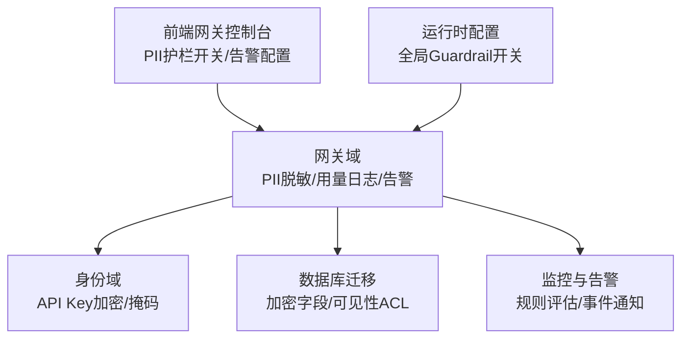
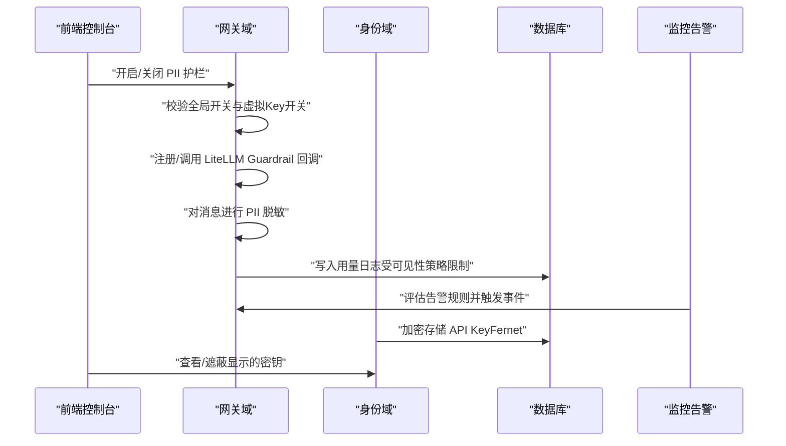
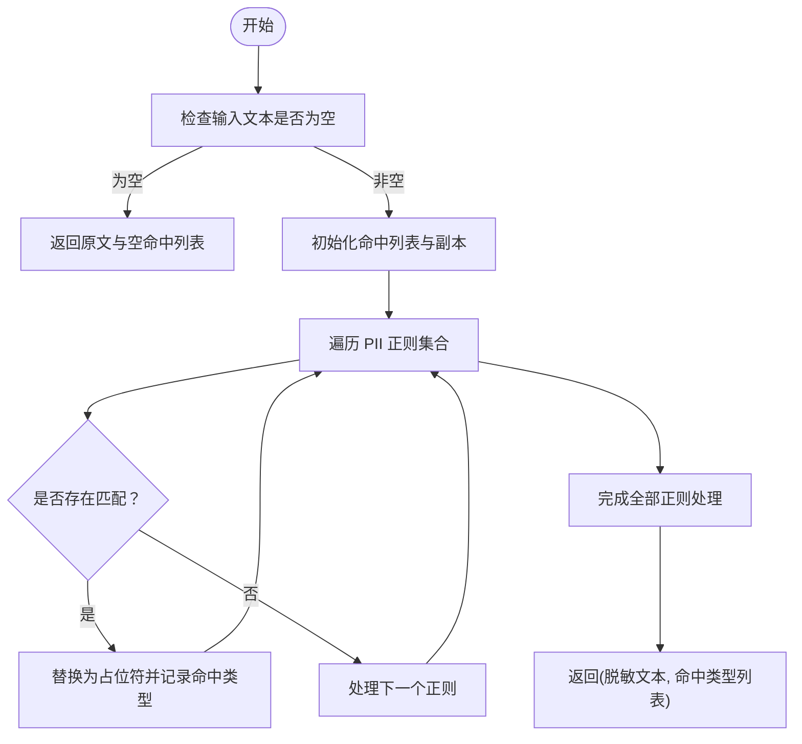
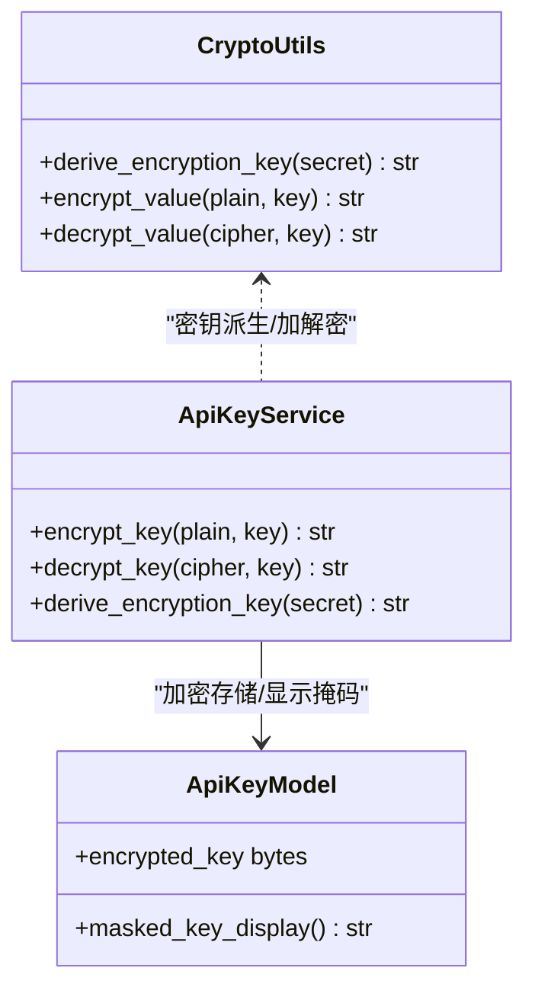
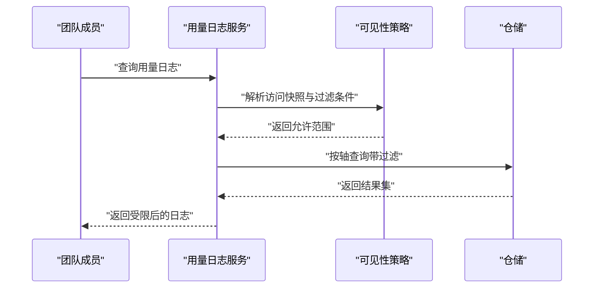
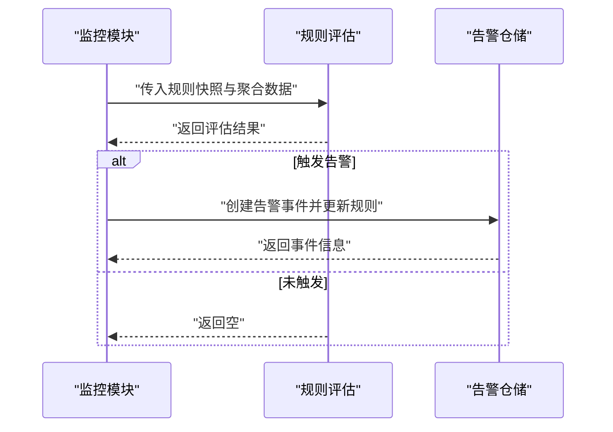
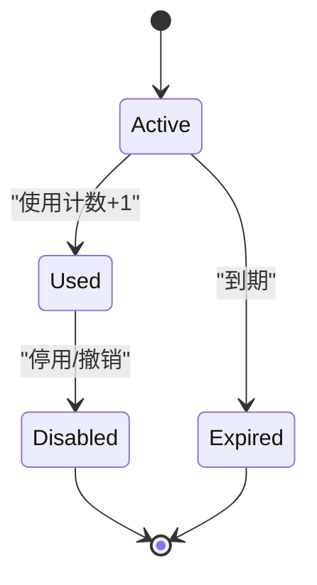
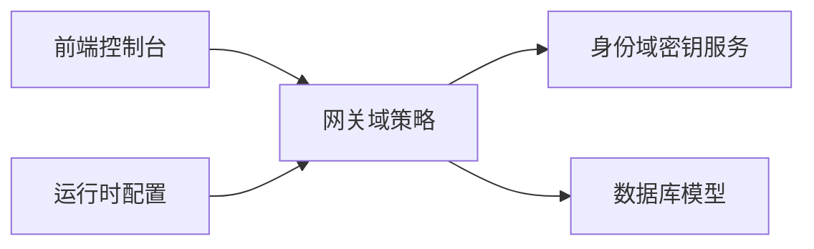

# 数据安全与隐私

<cite>
**本文引用的文件**
- [grant-policy-fields.tsx](file://frontend/src/features/api-key-gateway/grant-policy-fields.tsx)
- [test_pii_guardrail.py](file://backend/tests/unit/gateway/test_pii_guardrail.py)
- [guardrail_policy.py](file://backend/domains/gateway/domain/guardrail_policy.py)
- [pii_redaction_policy.py](file://backend/domains/gateway/domain/pii_redaction_policy.py)
- [pii_guardrail.py](file://backend/domains/gateway/infrastructure/guardrails/pii_guardrail.py)
- [__init__.py](file://backend/domains/gateway/infrastructure/guardrails/__init__.py)
- [test_gateway_management_api.py](file://backend/tests/integration/api/test_gateway_management_api.py)
- [usage_log_visibility.py](file://backend/domains/gateway/domain/policies/usage_log_visibility.py)
- [usage_log_reads.py](file://backend/domains/gateway/application/management/usage_log_reads.py)
- [crypto.py](file://backend/libs/crypto.py)
- [api_key_service.py](file://backend/domains/identity/domain/services/api_key_service.py)
- [20260128_add_encrypted_key.down.sql](file://backend/alembic/sql/20260128_add_encrypted_key.down.sql)
- [20260508_add_gateway_tables.py](file://backend/alembic/versions/20260508_add_gateway_tables.py)
- [20260603_system_visibility_acl.py](file://backend/alembic/versions/20260603_system_visibility_acl.py)
- [alerts.tsx](file://frontend/src/pages/gateway/alerts.tsx)
- [alert_repository.py](file://backend/domains/gateway/infrastructure/repositories/alert_repository.py)
- [alerts.py](file://backend/domains/gateway/presentation/routers/alerts.py)
- [alert_evaluation.py](file://backend/domains/gateway/domain/policies/alert_evaluation.py)
- [internal_bridge.py](file://backend/domains/gateway/application/internal_bridge.py)
- [credential_read_mappers.py](file://backend/domains/gateway/application/management/credential_read_mappers.py)
- [credential_upstream_catalog.py](file://backend/domains/gateway/application/management/credential_upstream_catalog.py)
- [credential_display.py](file://backend/domains/gateway/domain/credential_display.py)
- [virtual_key_service.py](file://backend/domains/gateway/domain/virtual_key_service.py)
- [virtual_key.py](file://backend/domains/gateway/infrastructure/models/virtual_key.py)
- [router_singleton.py](file://backend/domains/gateway/infrastructure/router_singleton.py)
- [_common.py](file://backend/domains/gateway/presentation/routers/_common.py)
- [api_key_router.py](file://backend/domains/identity/presentation/api_key_router.py)
- [api_key_types.py](file://backend/domains/identity/domain/api_key_types.py)
- [api_key.py](file://backend/domains/identity/infrastructure/models/api_key.py)
- [api_key_repository.py](file://backend/domains/identity/infrastructure/repositories/api_key_repository.py)
- [config.py](file://backend/bootstrap/config.py)
- [features.py](file://backend/domains/gateway/presentation/routers/features.py)
</cite>

## 目录
1. [引言](#引言)
2. [项目结构](#项目结构)
3. [核心组件](#核心组件)
4. [架构总览](#架构总览)
5. [详细组件分析](#详细组件分析)
6. [依赖关系分析](#依赖关系分析)
7. [性能考量](#性能考量)
8. [故障排查指南](#故障排查指南)
9. [结论](#结论)
10. [附录](#附录)

## 引言
本文件面向数据保护官与安全工程师，系统化梳理 AI Agent 项目的“数据安全与隐私”体系，覆盖 PII 识别与脱敏、数据加密策略、访问审计与异常检测、数据生命周期管理、数据分类与标记、隐私合规（GDPR/CCPA）、数据共享与导出控制、安全配置最佳实践以及数据泄露应急响应预案，并辅以可视化图示帮助快速定位实现位置与职责边界。

## 项目结构
本项目采用前后端分离与多域分层架构，安全能力主要分布在以下区域：
- 前端网关控制台：PII 脱敏护栏开关展示与告警规则配置
- 网关域（Gateway Domain）：PII 脱敏策略、用量日志访问策略、告警规则与评估
- 身份域（Identity Domain）：API Key 加密存储与显示掩码
- 基础设施与迁移：加密字段与可见性 ACL 的数据库模型演进
- 配置与运行时：全局 Guardrail 开关与运行时回调注册

**图表来源**
- [grant-policy-fields.tsx:115-130](file://frontend/src/features/api-key-gateway/grant-policy-fields.tsx#L115-L130)
- [alerts.tsx:229-268](file://frontend/src/pages/gateway/alerts.tsx#L229-L268)
- [guardrail_policy.py:8-27](file://backend/domains/gateway/domain/guardrail_policy.py#L8-L27)
- [usage_log_visibility.py:42-94](file://backend/domains/gateway/domain/policies/usage_log_visibility.py#L42-L94)
- [alert_evaluation.py:70-107](file://backend/domains/gateway/domain/policies/alert_evaluation.py#L70-L107)
- [crypto.py:16-54](file://backend/libs/crypto.py#L16-L54)
- [config.py:380-380](file://backend/bootstrap/config.py#L380-L380)

**章节来源**
- [grant-policy-fields.tsx:115-130](file://frontend/src/features/api-key-gateway/grant-policy-fields.tsx#L115-L130)
- [alerts.tsx:229-268](file://frontend/src/pages/gateway/alerts.tsx#L229-L268)
- [guardrail_policy.py:8-27](file://backend/domains/gateway/domain/guardrail_policy.py#L8-L27)
- [usage_log_visibility.py:42-94](file://backend/domains/gateway/domain/policies/usage_log_visibility.py#L42-L94)
- [alert_evaluation.py:70-107](file://backend/domains/gateway/domain/policies/alert_evaluation.py#L70-L107)
- [crypto.py:16-54](file://backend/libs/crypto.py#L16-L54)
- [config.py:380-380](file://backend/bootstrap/config.py#L380-L380)

## 核心组件
- PII 识别与自动脱敏：基于正则的 PII 规则与 LiteLLM Guardrail 回调集成，支持手机号、邮箱、身份证、银行卡、IPv4 等模式识别与占位替换。
- 数据加密与密钥管理：基于 Fernet 的对称加密，密钥派生自应用密钥，API Key 与敏感配置安全存储，支持加密/解密与显示掩码。
- 访问审计与可见性控制：用量日志按角色维度进行聚合与明细访问控制，平台管理员与团队成员权限隔离。
- 异常检测与告警：基于指标（错误率、请求速率、延迟 P95、预算占用）的规则评估与事件通知。
- 生命周期管理：虚拟 Key 与凭据的创建、激活/停用、过期时间、使用计数与最后使用时间等状态管理。
- 数据分类与标记：通过可见性字段与访问策略对系统/租户资源进行分类与最小授权控制。

**章节来源**
- [pii_redaction_policy.py:10-40](file://backend/domains/gateway/domain/pii_redaction_policy.py#L10-L40)
- [guardrail_policy.py:8-27](file://backend/domains/gateway/domain/guardrail_policy.py#L8-L27)
- [crypto.py:16-54](file://backend/libs/crypto.py#L16-L54)
- [api_key_service.py:51-86](file://backend/domains/identity/domain/services/api_key_service.py#L51-L86)
- [usage_log_visibility.py:42-94](file://backend/domains/gateway/domain/policies/usage_log_visibility.py#L42-L94)
- [alert_evaluation.py:70-107](file://backend/domains/gateway/domain/policies/alert_evaluation.py#L70-L107)
- [20260508_add_gateway_tables.py:179-217](file://backend/alembic/versions/20260508_add_gateway_tables.py#L179-L217)
- [20260603_system_visibility_acl.py:20-52](file://backend/alembic/versions/20260603_system_visibility_acl.py#L20-L52)

## 架构总览
下图展示 PII 脱敏、加密与日志访问的关键交互路径：

**图表来源**
- [guardrail_policy.py:8-27](file://backend/domains/gateway/domain/guardrail_policy.py#L8-L27)
- [pii_guardrail.py:78-100](file://backend/domains/gateway/infrastructure/guardrails/pii_guardrail.py#L78-L100)
- [usage_log_visibility.py:42-94](file://backend/domains/gateway/domain/policies/usage_log_visibility.py#L42-L94)
- [alert_evaluation.py:70-107](file://backend/domains/gateway/domain/policies/alert_evaluation.py#L70-L107)
- [crypto.py:16-54](file://backend/libs/crypto.py#L16-L54)

## 详细组件分析

### PII 识别与自动脱敏
- 规则定义：集中于 PII 正则集合与占位符映射，覆盖手机号、邮箱、身份证、银行卡、IPv4 等。
- 脱敏流程：对输入文本进行多轮匹配与替换，返回脱敏文本与命中类别列表。
- 运行时策略：全局 Guardrail 开关与虚拟 Key 维度开关共同决定是否启用脱敏。
- 测试覆盖：单元测试验证各类 PII 模式的识别与占位替换。

**图表来源**
- [pii_redaction_policy.py:31-40](file://backend/domains/gateway/domain/pii_redaction_policy.py#L31-L40)

**章节来源**
- [pii_redaction_policy.py:10-40](file://backend/domains/gateway/domain/pii_redaction_policy.py#L10-L40)
- [guardrail_policy.py:8-27](file://backend/domains/gateway/domain/guardrail_policy.py#L8-L27)
- [test_pii_guardrail.py:14-45](file://backend/tests/unit/gateway/test_pii_guardrail.py#L14-L45)
- [pii_guardrail.py:78-100](file://backend/domains/gateway/infrastructure/guardrails/pii_guardrail.py#L78-L100)
- [__init__.py:1-7](file://backend/domains/gateway/infrastructure/guardrails/__init__.py#L1-L7)

### 数据加密策略与密钥管理
- 加密算法：采用 Fernet 对称加密，保证机密性与完整性。
- 密钥派生：基于应用密钥（settings.secret_key）经 SHA-256 派生固定长度密钥。
- 存储与使用：API Key 与敏感配置以加密形式存储；前端仅显示掩码，真实值在服务端安全处理。
- 回滚与运维：提供回滚脚本移除加密列，便于生产运维场景下的可控变更。

**图表来源**
- [crypto.py:16-54](file://backend/libs/crypto.py#L16-L54)
- [api_key_service.py:51-86](file://backend/domains/identity/domain/services/api_key_service.py#L51-L86)
- [api_key.py:129-129](file://backend/domains/identity/infrastructure/models/api_key.py#L129-L129)

**章节来源**
- [crypto.py:16-54](file://backend/libs/crypto.py#L16-L54)
- [api_key_service.py:51-86](file://backend/domains/identity/domain/services/api_key_service.py#L51-L86)
- [api_key.py:129-129](file://backend/domains/identity/infrastructure/models/api_key.py#L129-L129)
- [20260128_add_encrypted_key.down.sql:1-13](file://backend/alembic/sql/20260128_add_encrypted_key.down.sql#L1-L13)

### 访问审计与日志可见性
- 聚合维度：支持平台、工作区、用户等多维聚合统计。
- 可见性策略：平台管理员可跨租户查看；团队成员仅可见自身或其拥有虚拟 Key 的记录；详情过滤确保最小披露。
- 详情获取：根据聚合维度与上下文解析访问轴，必要时进行二次过滤。

**图表来源**
- [usage_log_visibility.py:42-94](file://backend/domains/gateway/domain/policies/usage_log_visibility.py#L42-L94)
- [usage_log_reads.py:98-132](file://backend/domains/gateway/application/management/usage_log_reads.py#L98-L132)

**章节来源**
- [usage_log_visibility.py:42-94](file://backend/domains/gateway/domain/policies/usage_log_visibility.py#L42-L94)
- [usage_log_reads.py:98-132](file://backend/domains/gateway/application/management/usage_log_reads.py#L98-L132)

### 异常检测与告警
- 规则定义：前端支持配置错误率、预算占用、延迟 P95、请求速率等指标阈值与窗口。
- 规则评估：按指标分支计算并判定是否触发告警。
- 事件记录：触发后持久化告警事件并更新规则最近触发时间，支持通知渠道。

**图表来源**
- [alerts.tsx:229-268](file://frontend/src/pages/gateway/alerts.tsx#L229-L268)
- [alert_evaluation.py:70-107](file://backend/domains/gateway/domain/policies/alert_evaluation.py#L70-L107)
- [alert_repository.py:233-256](file://backend/domains/gateway/infrastructure/repositories/alert_repository.py#L233-L256)
- [alerts.py:62-90](file://backend/domains/gateway/presentation/routers/alerts.py#L62-L90)

**章节来源**
- [alerts.tsx:229-268](file://frontend/src/pages/gateway/alerts.tsx#L229-L268)
- [alert_evaluation.py:70-107](file://backend/domains/gateway/domain/policies/alert_evaluation.py#L70-L107)
- [alert_repository.py:233-256](file://backend/domains/gateway/infrastructure/repositories/alert_repository.py#L233-L256)
- [alerts.py:62-90](file://backend/domains/gateway/presentation/routers/alerts.py#L62-L90)

### 数据生命周期管理
- 创建：虚拟 Key 与凭据创建时初始化状态、限额与时间戳。
- 存储：敏感字段加密存储，非敏感字段按需保留。
- 使用：记录使用计数与最后使用时间，支持限额与过期控制。
- 销毁：支持停用、撤销与过期清理，配合可见性策略限制历史访问。

**图表来源**
- [20260508_add_gateway_tables.py:179-217](file://backend/alembic/versions/20260508_add_gateway_tables.py#L179-L217)

**章节来源**
- [20260508_add_gateway_tables.py:179-217](file://backend/alembic/versions/20260508_add_gateway_tables.py#L179-L217)

### 数据分类与标记
- 可见性字段：系统凭据与模型引入 visibility 字段，默认公开/继承策略。
- 授权表：新增系统网关授权表，支持基于角色的最小授权。
- 策略联动：可见性与授权共同决定资源的可访问范围。

**章节来源**
- [20260603_system_visibility_acl.py:20-52](file://backend/alembic/versions/20260603_system_visibility_acl.py#L20-L52)

### 隐私合规要求（GDPR/CCPA）
- 最小数据原则：通过 PII 脱敏与日志可见性策略减少暴露面。
- 用户权利支持：用量日志详情过滤与成员可见性策略，保障用户请求的最小披露。
- 数据主体访问与删除：结合生命周期管理与可见性策略，支持对用户相关数据的访问与删除请求落地。
- 审计与追溯：完整日志与告警事件记录，满足监管要求的可追溯性。

**章节来源**
- [usage_log_visibility.py:42-94](file://backend/domains/gateway/domain/policies/usage_log_visibility.py#L42-L94)
- [alert_repository.py:233-256](file://backend/domains/gateway/infrastructure/repositories/alert_repository.py#L233-L256)

### 数据共享与导出控制
- 展示掩码：前端仅显示掩码化的密钥与敏感信息，真实值在服务端处理。
- 下游探针：凭据解密仅限特定上游目录与探针流程，避免广泛暴露。
- 访问控制：虚拟 Key 与凭据的使用范围受 Guardrail 与可见性策略双重约束。

**章节来源**
- [credential_display.py:7-7](file://backend/domains/gateway/domain/credential_display.py#L7-L7)
- [credential_upstream_catalog.py:90-96](file://backend/domains/gateway/application/management/credential_upstream_catalog.py#L90-L96)
- [credential_read_mappers.py:45-45](file://backend/domains/gateway/application/management/credential_read_mappers.py#L45-L45)
- [virtual_key_service.py:79-79](file://backend/domains/gateway/domain/virtual_key_service.py#L79-L79)
- [virtual_key.py:127-127](file://backend/domains/gateway/infrastructure/models/virtual_key.py#L127-L127)

## 依赖关系分析
- 前端与后端：前端负责开关展示与规则配置，后端负责策略校验、脱敏与日志可见性。
- 网关域与身份域：网关域调用身份域的服务进行密钥派生与加解密，确保密钥管理一致性。
- 运行时配置：全局 Guardrail 开关影响 LiteLLM 回调注册与虚拟 Key 的启用策略。

**图表来源**
- [config.py:380-380](file://backend/bootstrap/config.py#L380-L380)
- [features.py:15-15](file://backend/domains/gateway/presentation/routers/features.py#L15-L15)
- [guardrail_policy.py:8-27](file://backend/domains/gateway/domain/guardrail_policy.py#L8-L27)
- [api_key_service.py:51-86](file://backend/domains/identity/domain/services/api_key_service.py#L51-L86)

**章节来源**
- [config.py:380-380](file://backend/bootstrap/config.py#L380-L380)
- [features.py:15-15](file://backend/domains/gateway/presentation/routers/features.py#L15-L15)
- [guardrail_policy.py:8-27](file://backend/domains/gateway/domain/guardrail_policy.py#L8-L27)
- [api_key_service.py:51-86](file://backend/domains/identity/domain/services/api_key_service.py#L51-L86)

## 性能考量
- 脱敏正则：多轮匹配与替换，建议在批量处理时合并文本，减少重复编译与多次扫描。
- 日志查询：按聚合轴与过滤条件精确查询，避免全表扫描；索引与分区策略有助于提升大表查询效率。
- 加密成本：Fernet 解密为轻量 CPU 操作，建议在必要时才进行解密，其余场景使用掩码与摘要。
- 告警评估：指标聚合应批量化处理，避免频繁 I/O；冷却时间与去抖动策略降低噪声。

## 故障排查指南
- PII 护栏未生效
  - 检查全局开关与虚拟 Key 维度开关是否同时开启。
  - 确认运行时是否注册了 Guardrail 回调。
  - 参考集成测试用例验证行为。
- 加密/解密失败
  - 确认密钥派生一致且未被更改。
  - 检查密文格式与密钥长度。
- 日志可见性异常
  - 核对访问快照与成员角色，确认是否触发详情过滤。
  - 检查聚合维度与过滤参数。
- 告警未触发
  - 检查规则阈值、窗口与指标类型。
  - 查看事件表与规则最近触发时间。

**章节来源**
- [guardrail_policy.py:17-27](file://backend/domains/gateway/domain/guardrail_policy.py#L17-L27)
- [test_gateway_management_api.py:3877-3908](file://backend/tests/integration/api/test_gateway_management_api.py#L3877-L3908)
- [crypto.py:44-54](file://backend/libs/crypto.py#L44-L54)
- [usage_log_visibility.py:42-94](file://backend/domains/gateway/domain/policies/usage_log_visibility.py#L42-L94)
- [alert_evaluation.py:70-107](file://backend/domains/gateway/domain/policies/alert_evaluation.py#L70-L107)

## 结论
本项目通过“规则驱动的 PII 脱敏 + Fernet 加密 + 可见性策略 + 告警规则”的组合，构建了覆盖数据全生命周期的安全体系。建议在生产环境中持续完善密钥轮换、审计日志留存与合规检查流程，并定期演练数据泄露应急响应预案。

## 附录

### 数据安全配置最佳实践
- 密钥管理
  - 使用强随机密钥作为应用密钥，定期轮换。
  - 严格限制密钥派生与加解密权限，避免硬编码。
- PII 脱敏
  - 在入口与出口均执行脱敏，确保日志与对外接口不泄露原始 PII。
  - 定期审查正则覆盖范围，补充新出现的模式。
- 访问控制
  - 默认最小权限，平台管理员与租户成员权限分离。
  - 对敏感操作增加二次确认与审计记录。
- 告警与监控
  - 设定多指标阈值与冷却时间，减少误报。
  - 建立通知通道与升级机制，确保及时处置。

### 数据泄露应急响应预案
- 快速评估
  - 确定受影响数据范围（日志、密钥、用户数据）。
  - 判断泄露渠道（API、日志、导出）。
- 阻断与修复
  - 立即撤销相关密钥与凭据，轮换应用密钥。
  - 关闭相关虚拟 Key 的 Guardrail 开关，阻断进一步暴露。
- 通知与补救
  - 按法规要求通知受影响方与监管机构。
  - 提供数据删除与更正渠道，协助用户维权。
- 复盘与改进
  - 分析根因，完善策略与流程。
  - 加强培训与演练，提升整体安全水平。