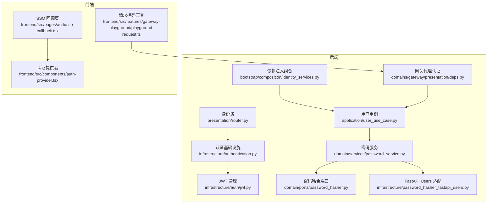
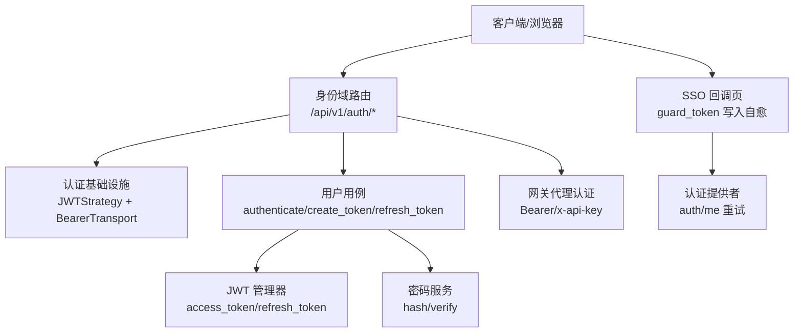
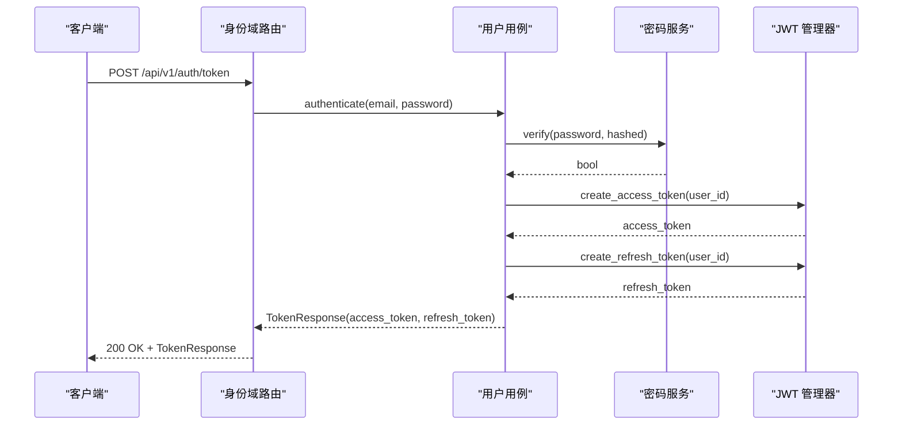
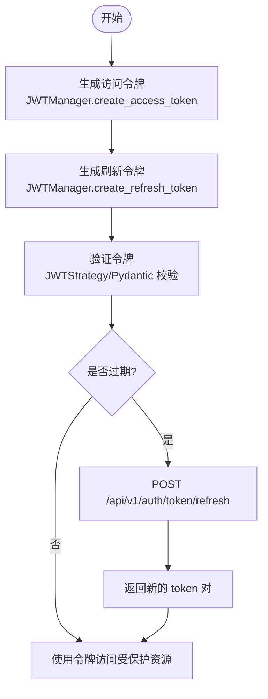
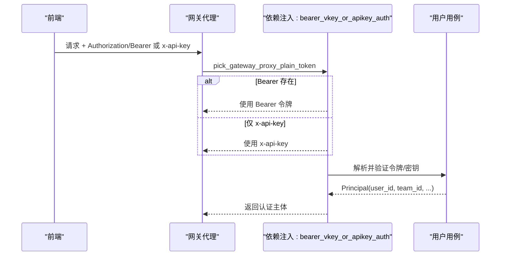
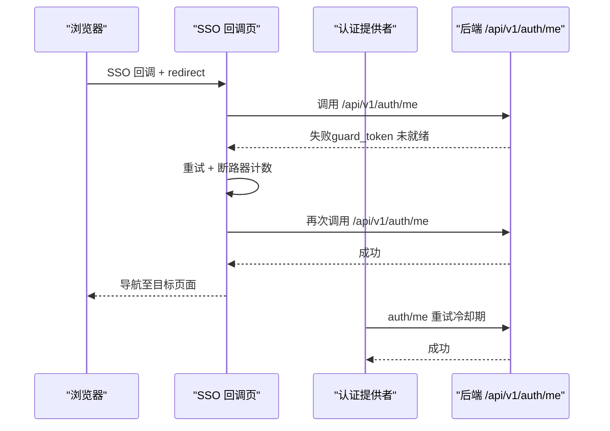
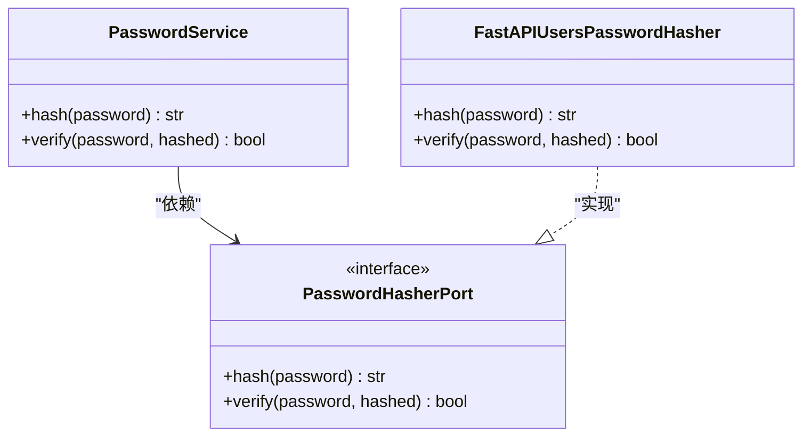
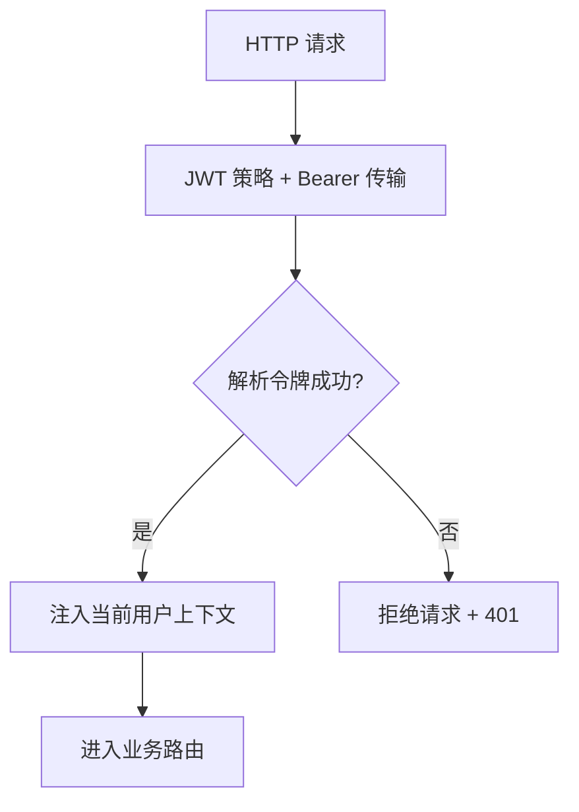
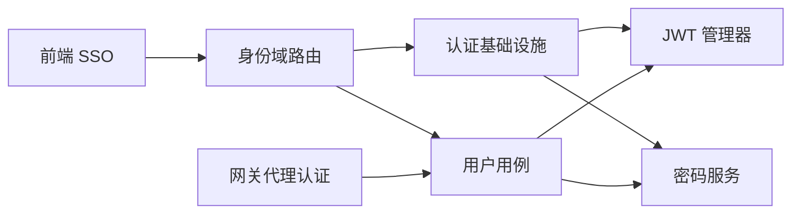

# 身份认证系统

<cite>
**本文引用的文件**
- [backend/domains/identity/presentation/router.py](file://backend/domains/identity/presentation/router.py)
- [backend/domains/identity/infrastructure/authentication.py](file://backend/domains/identity/infrastructure/authentication.py)
- [backend/domains/identity/infrastructure/auth/jwt.py](file://backend/domains/identity/infrastructure/auth/jwt.py)
- [backend/domains/identity/domain/services/password_service.py](file://backend/domains/identity/domain/services/password_service.py)
- [backend/domains/identity/domain/ports/password_hasher.py](file://backend/domains/identity/domain/ports/password_hasher.py)
- [backend/domains/identity/infrastructure/password_hasher_fastapi_users.py](file://backend/domains/identity/infrastructure/password_hasher_fastapi_users.py)
- [backend/domains/identity/application/user_use_case.py](file://backend/domains/identity/application/user_use_case.py)
- [backend/bootstrap/composition/identity_services.py](file://backend/bootstrap/composition/identity_services.py)
- [backend/domains/gateway/presentation/deps.py](file://backend/domains/gateway/presentation/deps.py)
- [backend/tests/unit/gateway/test_gateway_proxy_auth_headers.py](file://backend/tests/unit/gateway/test_gateway_proxy_auth_headers.py)
- [frontend/src/pages/auth/sso-callback.tsx](file://frontend/src/pages/auth/sso-callback.tsx)
- [frontend/src/components/auth-provider.tsx](file://frontend/src/components/auth-provider.tsx)
- [frontend/src/features/gateway-playground/playground-request.ts](file://frontend/src/features/gateway-playground/playground-request.ts)
- [backend/docs/AUTHENTICATION.md](file://backend/docs/AUTHENTICATION.md)
- [backend/config/app.toml](file://backend/config/app.toml)
- [backend/config/environments/local-dev.toml](file://backend/config/environments/local-dev.toml)
- [backend/config/environments/docker-dev.toml](file://backend/config/environments/docker-dev.toml)
- [backend/config/environments/docker-prod.toml](file://backend/config/environments/docker-prod.toml)
- [deploy/higress/giikin-auth-bridge-wasmplugin.yaml](file://deploy/higress/giikin-auth-bridge-wasmplugin.yaml)
- [deploy/k8s/patch-sso-secret.json](file://deploy/k8s/patch-sso-secret.json)
- [deploy/nginx/ai-agent.bare-metal.conf.example](file://deploy/nginx/ai-agent.bare-metal.conf.example)
</cite>

## 目录
1. [简介](#简介)
2. [项目结构](#项目结构)
3. [核心组件](#核心组件)
4. [架构总览](#架构总览)
5. [详细组件分析](#详细组件分析)
6. [依赖关系分析](#依赖关系分析)
7. [性能考虑](#性能考虑)
8. [故障排除指南](#故障排除指南)
9. [结论](#结论)
10. [附录](#附录)

## 简介
本文件为 AI Agent 项目的身份认证系统技术文档，覆盖以下主题：
- 用户认证流程：用户名/密码认证、API 密钥认证、SSO 单点登录集成
- JWT 令牌生成、验证与刷新机制：令牌生命周期管理与安全存储
- 用户注册流程、密码哈希策略与账户激活机制
- 认证中间件工作原理：请求拦截、令牌解析与用户上下文注入
- 会话管理机制：会话创建、维护与销毁
- 认证错误处理与安全日志记录
- 认证配置最佳实践与常见问题解决方案
- 提供具体代码示例与配置模板，便于开发者正确实现与集成

## 项目结构
认证系统主要分布在后端 Identity 领域与前端认证页面中，并与网关代理层协同完成 API 密钥认证。

**图表来源**
- [backend/domains/identity/presentation/router.py:1-143](file://backend/domains/identity/presentation/router.py#L1-L143)
- [backend/domains/identity/infrastructure/authentication.py:1-53](file://backend/domains/identity/infrastructure/authentication.py#L1-L53)
- [backend/domains/identity/infrastructure/auth/jwt.py:1-59](file://backend/domains/identity/infrastructure/auth/jwt.py#L1-L59)
- [backend/domains/identity/domain/services/password_service.py:1-31](file://backend/domains/identity/domain/services/password_service.py#L1-L31)
- [backend/domains/identity/domain/ports/password_hasher.py:1-14](file://backend/domains/identity/domain/ports/password_hasher.py#L1-L14)
- [backend/domains/identity/infrastructure/password_hasher_fastapi_users.py:1-26](file://backend/domains/identity/infrastructure/password_hasher_fastapi_users.py#L1-L26)
- [backend/domains/identity/application/user_use_case.py](file://backend/domains/identity/application/user_use_case.py)
- [backend/bootstrap/composition/identity_services.py](file://backend/bootstrap/composition/identity_services.py)
- [backend/domains/gateway/presentation/deps.py:195-229](file://backend/domains/gateway/presentation/deps.py#L195-L229)
- [frontend/src/pages/auth/sso-callback.tsx:37-128](file://frontend/src/pages/auth/sso-callback.tsx#L37-L128)
- [frontend/src/components/auth-provider.tsx:107-146](file://frontend/src/components/auth-provider.tsx#L107-L146)
- [frontend/src/features/gateway-playground/playground-request.ts:136-151](file://frontend/src/features/gateway-playground/playground-request.ts#L136-L151)

**章节来源**
- [backend/domains/identity/presentation/router.py:1-143](file://backend/domains/identity/presentation/router.py#L1-L143)
- [backend/domains/identity/infrastructure/authentication.py:1-53](file://backend/domains/identity/infrastructure/authentication.py#L1-L53)
- [backend/domains/identity/infrastructure/auth/jwt.py:1-59](file://backend/domains/identity/infrastructure/auth/jwt.py#L1-L59)
- [backend/domains/identity/domain/services/password_service.py:1-31](file://backend/domains/identity/domain/services/password_service.py#L1-L31)
- [backend/domains/identity/domain/ports/password_hasher.py:1-14](file://backend/domains/identity/domain/ports/password_hasher.py#L1-L14)
- [backend/domains/identity/infrastructure/password_hasher_fastapi_users.py:1-26](file://backend/domains/identity/infrastructure/password_hasher_fastapi_users.py#L1-L26)
- [backend/domains/identity/application/user_use_case.py](file://backend/domains/identity/application/user_use_case.py)
- [backend/bootstrap/composition/identity_services.py](file://backend/bootstrap/composition/identity_services.py)
- [backend/domains/gateway/presentation/deps.py:195-229](file://backend/domains/gateway/presentation/deps.py#L195-L229)
- [frontend/src/pages/auth/sso-callback.tsx:37-128](file://frontend/src/pages/auth/sso-callback.tsx#L37-L128)
- [frontend/src/components/auth-provider.tsx:107-146](file://frontend/src/components/auth-provider.tsx#L107-L146)
- [frontend/src/features/gateway-playground/playground-request.ts:136-151](file://frontend/src/features/gateway-playground/playground-request.ts#L136-L151)

## 核心组件
- 身份域路由与端点：提供 JWT 登录、注册、当前用户查询以及增强版 token 对获取与刷新等接口。
- 认证基础设施：基于 FastAPI Users 的 JWT 策略与 Bearer 传输，内置密码哈希与校验。
- JWT 管理器：封装访问令牌与刷新令牌的生成、载荷结构与验证。
- 密码服务与哈希端口：抽象出密码哈希与验证的领域服务，适配 FastAPI Users 的 PasswordHelper。
- 用户用例：协调认证、令牌生成与刷新、用户上下文构建。
- 网关代理认证：同时支持 Bearer 令牌与 x-api-key，优先 Bearer，兼容 vkey 格式。
- 前端 SSO 集成：回调页与认证提供者对 SSO 后 guard_token 写入延迟进行自愈重试。
- 安全日志与错误处理：统一的日志记录与异常抛出，便于审计与排障。

**章节来源**
- [backend/domains/identity/presentation/router.py:35-143](file://backend/domains/identity/presentation/router.py#L35-L143)
- [backend/domains/identity/infrastructure/authentication.py:1-53](file://backend/domains/identity/infrastructure/authentication.py#L1-L53)
- [backend/domains/identity/infrastructure/auth/jwt.py:1-59](file://backend/domains/identity/infrastructure/auth/jwt.py#L1-L59)
- [backend/domains/identity/domain/services/password_service.py:1-31](file://backend/domains/identity/domain/services/password_service.py#L1-L31)
- [backend/domains/identity/application/user_use_case.py](file://backend/domains/identity/application/user_use_case.py)
- [backend/domains/gateway/presentation/deps.py:195-229](file://backend/domains/gateway/presentation/deps.py#L195-L229)
- [frontend/src/pages/auth/sso-callback.tsx:37-128](file://frontend/src/pages/auth/sso-callback.tsx#L37-L128)
- [frontend/src/components/auth-provider.tsx:107-146](file://frontend/src/components/auth-provider.tsx#L107-L146)

## 架构总览
认证系统采用分层架构，后端以 FastAPI Users 为基础，结合自定义 JWT 管理器与密码服务，提供标准的 JWT 认证能力；同时在网关层支持 API 密钥认证；前端通过 SSO 回调页与认证提供者实现单点登录集成与自愈重试。

**图表来源**
- [backend/domains/identity/presentation/router.py:35-143](file://backend/domains/identity/presentation/router.py#L35-L143)
- [backend/domains/identity/infrastructure/authentication.py:44-53](file://backend/domains/identity/infrastructure/authentication.py#L44-L53)
- [backend/domains/identity/application/user_use_case.py](file://backend/domains/identity/application/user_use_case.py)
- [backend/domains/identity/infrastructure/auth/jwt.py:35-59](file://backend/domains/identity/infrastructure/auth/jwt.py#L35-L59)
- [backend/domains/identity/domain/services/password_service.py:19-31](file://backend/domains/identity/domain/services/password_service.py#L19-L31)
- [backend/domains/gateway/presentation/deps.py:195-229](file://backend/domains/gateway/presentation/deps.py#L195-L229)
- [frontend/src/pages/auth/sso-callback.tsx:80-128](file://frontend/src/pages/auth/sso-callback.tsx#L80-L128)
- [frontend/src/components/auth-provider.tsx:107-146](file://frontend/src/components/auth-provider.tsx#L107-L146)

## 详细组件分析

### 用户名/密码认证与注册
- 登录与注册端点由 FastAPI Users 路由提供，支持动态开关注册能力。
- 用户登录成功后，系统生成完整的 token 对（access_token + refresh_token），并返回给前端。
- 注册流程通过 FastAPI Users 注册路由完成，密码经由密码服务进行哈希处理。

**图表来源**
- [backend/domains/identity/presentation/router.py:105-122](file://backend/domains/identity/presentation/router.py#L105-L122)
- [backend/domains/identity/application/user_use_case.py](file://backend/domains/identity/application/user_use_case.py)
- [backend/domains/identity/domain/services/password_service.py:24-31](file://backend/domains/identity/domain/services/password_service.py#L24-L31)
- [backend/domains/identity/infrastructure/auth/jwt.py:35-59](file://backend/domains/identity/infrastructure/auth/jwt.py#L35-L59)

**章节来源**
- [backend/domains/identity/presentation/router.py:35-46](file://backend/domains/identity/presentation/router.py#L35-L46)
- [backend/domains/identity/presentation/router.py:105-122](file://backend/domains/identity/presentation/router.py#L105-L122)
- [backend/domains/identity/domain/services/password_service.py:1-31](file://backend/domains/identity/domain/services/password_service.py#L1-L31)

### JWT 令牌生成、验证与刷新
- 访问令牌与刷新令牌均通过 JWT 管理器生成，载荷包含用户标识、类型与过期时间等字段。
- JWT 策略由认证基础设施提供，使用应用配置中的密钥与过期时长。
- 刷新端点接收 refresh_token 并返回新的 token 对，实现静默续期。

**图表来源**
- [backend/domains/identity/infrastructure/auth/jwt.py:35-59](file://backend/domains/identity/infrastructure/auth/jwt.py#L35-L59)
- [backend/domains/identity/infrastructure/authentication.py:44-49](file://backend/domains/identity/infrastructure/authentication.py#L44-L49)
- [backend/domains/identity/presentation/router.py:125-143](file://backend/domains/identity/presentation/router.py#L125-L143)

**章节来源**
- [backend/domains/identity/infrastructure/auth/jwt.py:1-59](file://backend/domains/identity/infrastructure/auth/jwt.py#L1-L59)
- [backend/domains/identity/infrastructure/authentication.py:1-53](file://backend/domains/identity/infrastructure/authentication.py#L1-L53)
- [backend/domains/identity/presentation/router.py:125-143](file://backend/domains/identity/presentation/router.py#L125-L143)

### API 密钥认证与网关代理
- 网关代理同时支持 Bearer 令牌与 x-api-key，优先从 Authorization: Bearer 中提取令牌，若缺失则回退到 x-api-key。
- 支持 vkey 格式的虚拟密钥解析，并校验团队头一致性。
- 前端在网关请求中对 Authorization 与 x-api-key 进行脱敏显示，防止敏感信息泄露。

**图表来源**
- [backend/domains/gateway/presentation/deps.py:195-229](file://backend/domains/gateway/presentation/deps.py#L195-L229)
- [backend/tests/unit/gateway/test_gateway_proxy_auth_headers.py:1-28](file://backend/tests/unit/gateway/test_gateway_proxy_auth_headers.py#L1-L28)
- [frontend/src/features/gateway-playground/playground-request.ts:136-151](file://frontend/src/features/gateway-playground/playground-request.ts#L136-L151)

**章节来源**
- [backend/domains/gateway/presentation/deps.py:195-229](file://backend/domains/gateway/presentation/deps.py#L195-L229)
- [backend/tests/unit/gateway/test_gateway_proxy_auth_headers.py:1-28](file://backend/tests/unit/gateway/test_gateway_proxy_auth_headers.py#L1-L28)
- [frontend/src/features/gateway-playground/playground-request.ts:136-151](file://frontend/src/features/gateway-playground/playground-request.ts#L136-L151)

### SSO 单点登录集成
- SSO 回调页在 guard_token 写入存在短延迟时，执行多次重试以获取当前用户信息，确保认证上下文可用。
- 认证提供者在 SSO 模式下，针对 Cookie 尚未就绪的情况进行冷却期重试，提升用户体验。
- 若连续尝试失败，断路器触发并提示管理员检查 SSO 桥接配置。

**图表来源**
- [frontend/src/pages/auth/sso-callback.tsx:80-128](file://frontend/src/pages/auth/sso-callback.tsx#L80-L128)
- [frontend/src/components/auth-provider.tsx:107-146](file://frontend/src/components/auth-provider.tsx#L107-L146)

**章节来源**
- [frontend/src/pages/auth/sso-callback.tsx:37-128](file://frontend/src/pages/auth/sso-callback.tsx#L37-L128)
- [frontend/src/components/auth-provider.tsx:107-146](file://frontend/src/components/auth-provider.tsx#L107-L146)

### 密码哈希策略与账户激活
- 密码哈希与验证通过密码服务完成，底层适配 FastAPI Users 的 PasswordHelper，保证与 FastAPI Users 生态一致。
- 账户激活机制通过 FastAPI Users 注册流程实现，默认允许注册时即完成激活（可通过配置关闭）。

**图表来源**
- [backend/domains/identity/domain/services/password_service.py:19-31](file://backend/domains/identity/domain/services/password_service.py#L19-L31)
- [backend/domains/identity/domain/ports/password_hasher.py:8-14](file://backend/domains/identity/domain/ports/password_hasher.py#L8-L14)
- [backend/domains/identity/infrastructure/password_hasher_fastapi_users.py:10-20](file://backend/domains/identity/infrastructure/password_hasher_fastapi_users.py#L10-L20)

**章节来源**
- [backend/domains/identity/domain/services/password_service.py:1-31](file://backend/domains/identity/domain/services/password_service.py#L1-L31)
- [backend/domains/identity/domain/ports/password_hasher.py:1-14](file://backend/domains/identity/domain/ports/password_hasher.py#L1-L14)
- [backend/domains/identity/infrastructure/password_hasher_fastapi_users.py:1-26](file://backend/domains/identity/infrastructure/password_hasher_fastapi_users.py#L1-L26)

### 认证中间件与请求拦截
- FastAPI Users 的 JWT 策略与 Bearer 传输负责请求拦截与令牌解析，自动注入当前活跃用户上下文。
- 网关代理层通过依赖注入函数解析 Bearer 与 x-api-key，优先 Bearer，兼容 vkey 格式并校验团队一致性。

**图表来源**
- [backend/domains/identity/infrastructure/authentication.py:44-53](file://backend/domains/identity/infrastructure/authentication.py#L44-L53)
- [backend/domains/gateway/presentation/deps.py:195-229](file://backend/domains/gateway/presentation/deps.py#L195-L229)

**章节来源**
- [backend/domains/identity/infrastructure/authentication.py:1-53](file://backend/domains/identity/infrastructure/authentication.py#L1-L53)
- [backend/domains/gateway/presentation/deps.py:195-229](file://backend/domains/gateway/presentation/deps.py#L195-L229)

### 会话管理机制
- 会话创建：用户登录成功后，系统返回 access_token 与 refresh_token，前端负责安全存储。
- 会话维护：access_token 过期后，使用 refresh_token 调用刷新端点获取新 token 对。
- 会话销毁：JWT 登录端点由 FastAPI Users 提供，支持注销流程（如需要可扩展）。

**章节来源**
- [backend/domains/identity/presentation/router.py:35-46](file://backend/domains/identity/presentation/router.py#L35-L46)
- [backend/domains/identity/presentation/router.py:125-143](file://backend/domains/identity/presentation/router.py#L125-L143)

### 认证错误处理与安全日志记录
- 统一日志记录：认证相关操作记录 INFO 级别日志，便于审计与排障。
- 异常处理：网关代理认证在缺少必要令牌时抛出认证异常，前端回调页与认证提供者具备重试与断路器机制。

**章节来源**
- [backend/domains/identity/presentation/router.py:48-54](file://backend/domains/identity/presentation/router.py#L48-L54)
- [backend/tests/unit/gateway/test_gateway_proxy_auth_headers.py:26-28](file://backend/tests/unit/gateway/test_gateway_proxy_auth_headers.py#L26-L28)
- [frontend/src/pages/auth/sso-callback.tsx:118-128](file://frontend/src/pages/auth/sso-callback.tsx#L118-L128)

## 依赖关系分析

**图表来源**
- [backend/domains/identity/presentation/router.py:1-143](file://backend/domains/identity/presentation/router.py#L1-L143)
- [backend/domains/identity/infrastructure/authentication.py:1-53](file://backend/domains/identity/infrastructure/authentication.py#L1-L53)
- [backend/domains/identity/infrastructure/auth/jwt.py:1-59](file://backend/domains/identity/infrastructure/auth/jwt.py#L1-L59)
- [backend/domains/identity/domain/services/password_service.py:1-31](file://backend/domains/identity/domain/services/password_service.py#L1-L31)
- [backend/domains/gateway/presentation/deps.py:195-229](file://backend/domains/gateway/presentation/deps.py#L195-L229)

**章节来源**
- [backend/domains/identity/presentation/router.py:1-143](file://backend/domains/identity/presentation/router.py#L1-L143)
- [backend/domains/identity/infrastructure/authentication.py:1-53](file://backend/domains/identity/infrastructure/authentication.py#L1-L53)
- [backend/domains/identity/infrastructure/auth/jwt.py:1-59](file://backend/domains/identity/infrastructure/auth/jwt.py#L1-L59)
- [backend/domains/identity/domain/services/password_service.py:1-31](file://backend/domains/identity/domain/services/password_service.py#L1-L31)
- [backend/domains/gateway/presentation/deps.py:195-229](file://backend/domains/gateway/presentation/deps.py#L195-L229)

## 性能考虑
- 令牌过期时间与刷新策略：合理设置 access_token 与 refresh_token 的有效期，减少频繁刷新带来的开销。
- 密码哈希成本：使用默认的 bcrypt 上下文即可满足安全与性能平衡。
- 网关代理认证缓存：在网关层对已解析的令牌或密钥进行短期缓存，降低重复解析成本。
- 前端重试策略：SSO 回调页与认证提供者的重试次数与间隔应适度，避免对后端造成压力。

## 故障排除指南
- SSO 回调后无法获取当前用户
  - 现象：连续多次尝试后提示 guard_token 未正确设置。
  - 排查：检查 HiGress Wasm 插件与 SSO 桥接配置，确认 Cookie 写入时机。
  - 参考：[SSO 回调页错误提示:118-128](file://frontend/src/pages/auth/sso-callback.tsx#L118-L128)
- 缺少认证令牌导致 401
  - 现象：网关代理认证抛出认证异常。
  - 排查：确认请求头中包含 Authorization: Bearer 或 x-api-key，且格式正确。
  - 参考：[网关代理认证单元测试:26-28](file://backend/tests/unit/gateway/test_gateway_proxy_auth_headers.py#L26-L28)
- 前端令牌脱敏显示
  - 现象：Authorization 与 x-api-key 在调试界面中被脱敏。
  - 处理：这是预期行为，用于保护敏感信息。
  - 参考：[前端请求脱敏工具:136-151](file://frontend/src/features/gateway-playground/playground-request.ts#L136-L151)

**章节来源**
- [frontend/src/pages/auth/sso-callback.tsx:118-128](file://frontend/src/pages/auth/sso-callback.tsx#L118-L128)
- [backend/tests/unit/gateway/test_gateway_proxy_auth_headers.py:26-28](file://backend/tests/unit/gateway/test_gateway_proxy_auth_headers.py#L26-L28)
- [frontend/src/features/gateway-playground/playground-request.ts:136-151](file://frontend/src/features/gateway-playground/playground-request.ts#L136-L151)

## 结论
本认证系统以 FastAPI Users 为核心，结合自定义 JWT 管理器与密码服务，提供了完善的用户名/密码认证、API 密钥认证与 SSO 集成能力。通过清晰的分层设计与安全日志记录，系统在保障安全性的同时兼顾了易用性与可维护性。建议在生产环境中严格遵循配置最佳实践，并持续监控认证相关指标与日志。

## 附录

### 配置模板与最佳实践
- 应用配置
  - 示例文件位置：[app.toml](file://backend/config/app.toml)
  - 环境配置示例：[local-dev.toml](file://backend/config/environments/local-dev.toml)、[docker-dev.toml](file://backend/config/environments/docker-dev.toml)、[docker-prod.toml](file://backend/config/environments/docker-prod.toml)
- SSO 集成
  - HiGress 插件配置：[giikin-auth-bridge-wasmplugin.yaml](file://deploy/higress/giikin-auth-bridge-wasmplugin.yaml)
  - Kubernetes Secret 补丁：[patch-sso-secret.json](file://deploy/k8s/patch-sso-secret.json)
  - Nginx 示例配置：[ai-agent.bare-metal.conf.example](file://deploy/nginx/ai-agent.bare-metal.conf.example)
- 认证文档
  - 项目内认证说明：[AUTHENTICATION.md](file://backend/docs/AUTHENTICATION.md)

**章节来源**
- [backend/config/app.toml](file://backend/config/app.toml)
- [backend/config/environments/local-dev.toml](file://backend/config/environments/local-dev.toml)
- [backend/config/environments/docker-dev.toml](file://backend/config/environments/docker-dev.toml)
- [backend/config/environments/docker-prod.toml](file://backend/config/environments/docker-prod.toml)
- [deploy/higress/giikin-auth-bridge-wasmplugin.yaml](file://deploy/higress/giikin-auth-bridge-wasmplugin.yaml)
- [deploy/k8s/patch-sso-secret.json](file://deploy/k8s/patch-sso-secret.json)
- [deploy/nginx/ai-agent.bare-metal.conf.example](file://deploy/nginx/ai-agent.bare-metal.conf.example)
- [backend/docs/AUTHENTICATION.md](file://backend/docs/AUTHENTICATION.md)