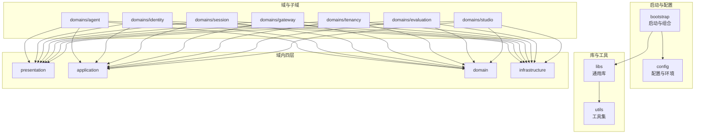
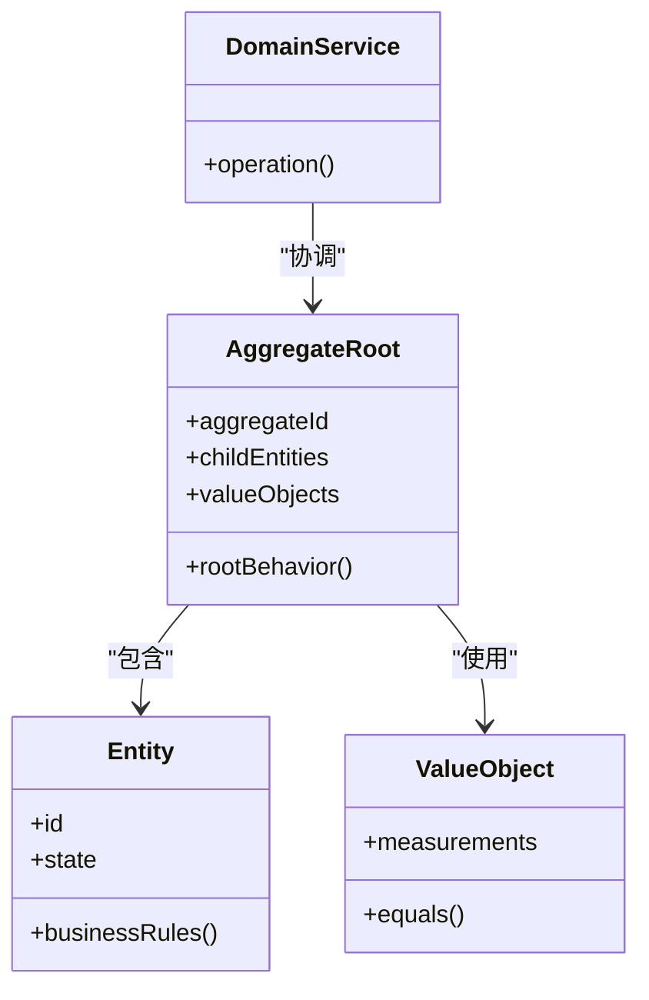
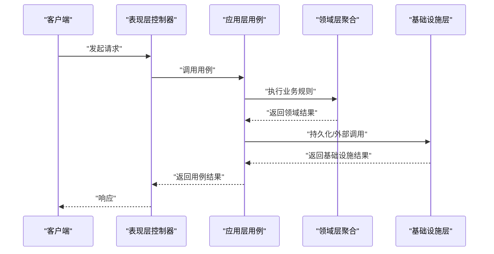
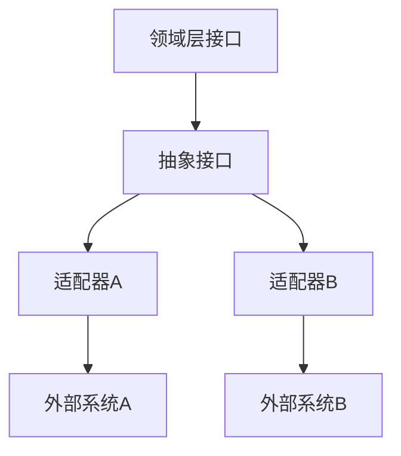
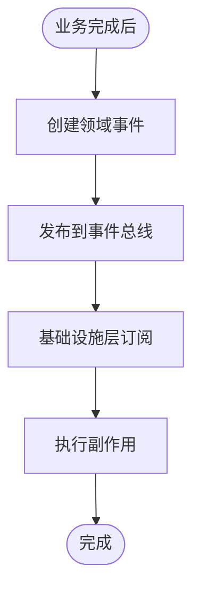
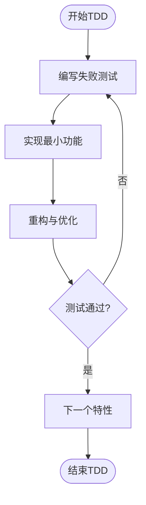
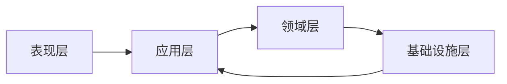

# DDD架构规范

<cite>
**本文引用的文件**
- [backend/pyproject.toml](file://backend/pyproject.toml)
- [backend/docs/ARCHITECTURE.md](file://backend/docs/ARCHITECTURE.md)
- [backend/docs/AGENT_ARCHITECTURE_DESIGN.md](file://backend/docs/AGENT_ARCHITECTURE_DESIGN.md)
- [backend/docs/LANGGRAPH_ARCHITECTURE_RATIONALE.md](file://backend/docs/LANGGRAPH_ARCHITECTURE_RATIONALE.md)
- [backend/bootstrap/main.py](file://backend/bootstrap/main.py)
- [backend/bootstrap/composition/identity_services.py](file://backend/bootstrap/composition/identity_services.py)
- [backend/bootstrap/config.py](file://backend/bootstrap/config.py)
- [backend/bootstrap/config_loader.py](file://backend/bootstrap/config_loader.py)
- [backend/config/app.toml](file://backend/config/app.toml)
- [backend/config/execution.toml](file://backend/config/execution.toml)
- [backend/config/mcp.toml](file://backend/config/mcp.toml)
- [backend/config/tools.toml](file://backend/config/tools.toml)
- [backend/libs/__init__.py](file://backend/libs/__init__.py)
- [backend/libs/db/__init__.py](file://backend/libs/db/__init__.py)
- [backend/libs/exceptions/__init__.py](file://backend/libs/exceptions/__init__.py)
- [backend/libs/gateway/__init__.py](file://backend/libs/gateway/__init__.py)
- [backend/libs/llm/__init__.py](file://backend/libs/llm/__init__.py)
- [backend/libs/middleware/__init__.py](file://backend/libs/middleware/__init__.py)
- [backend/libs/observability/__init__.py](file://backend/libs/observability/__init__.py)
- [backend/libs/storage/__init__.py](file://backend/libs/storage/__init__.py)
- [backend/libs/types/__init__.py](file://backend/libs/types/__init__.py)
- [backend/domains/agent/application/__init__.py](file://backend/domains/agent/application/__init__.py)
- [backend/domains/agent/domain/__init__.py](file://backend/domains/agent/domain/__init__.py)
- [backend/domains/agent/infrastructure/__init__.py](file://backend/domains/agent/infrastructure/__init__.py)
- [backend/domains/agent/presentation/__init__.py](file://backend/domains/agent/presentation/__init__.py)
- [backend/domains/identity/application/__init__.py](file://backend/domains/identity/application/__init__.py)
- [backend/domains/identity/domain/__init__.py](file://backend/domains/identity/domain/__init__.py)
- [backend/domains/identity/infrastructure/__init__.py](file://backend/domains/identity/infrastructure/__init__.py)
- [backend/domains/identity/presentation/__init__.py](file://backend/domains/identity/presentation/__init__.py)
- [backend/domains/session/application/__init__.py](file://backend/domains/session/application/__init__.py)
- [backend/domains/session/domain/__init__.py](file://backend/domains/session/domain/__init__.py)
- [backend/domains/session/infrastructure/__init__.py](file://backend/domains/session/infrastructure/__init__.py)
- [backend/domains/session/presentation/__init__.py](file://backend/domains/session/presentation/__init__.py)
- [backend/domains/gateway/application/__init__.py](file://backend/domains/gateway/application/__init__.py)
- [backend/domains/gateway/domain/__init__.py](file://backend/domains/gateway/domain/__init__.py)
- [backend/domains/gateway/infrastructure/__init__.py](file://backend/domains/gateway/infrastructure/__init__.py)
- [backend/domains/gateway/presentation/__init__.py](file://backend/domains/gateway/presentation/__init__.py)
- [backend/domains/tenancy/application/__init__.py](file://backend/domains/tenancy/application/__init__.py)
- [backend/domains/tenancy/domain/__init__.py](file://backend/domains/tenancy/domain/__init__.py)
- [backend/domains/tenancy/infrastructure/__init__.py](file://backend/domains/tenancy/infrastructure/__init__.py)
- [backend/domains/tenancy/presentation/__init__.py](file://backend/domains/tenancy/presentation/__init__.py)
- [backend/tests/architecture/test_agent_no_gateway_domain_import.py](file://backend/tests/architecture/test_agent_no_gateway_domain_import.py)
- [backend/tests/architecture/test_domain_no_sqlalchemy.py](file://backend/tests/architecture/test_domain_no_sqlalchemy.py)
- [backend/tests/architecture/test_presentation_no_infrastructure.py](file://backend/tests/architecture/test_presentation_no_infrastructure.py)
- [backend/utils/logging.py](file://backend/utils/logging.py)
- [backend/utils/cache.py](file://backend/utils/cache.py)
- [backend/utils/crypto.py](file://backend/utils/crypto.py)
- [backend/utils/tokens.py](file://backend/utils/tokens.py)
- [backend/utils/serialization.py](file://backend/utils/serialization.py)
- [backend/agents/example-agent/agent.toml](file://backend/agents/example-agent/agent.toml)
</cite>

## 目录
1. [引言](#引言)
2. [项目结构](#项目结构)
3. [核心组件](#核心组件)
4. [架构总览](#架构总览)
5. [详细组件分析](#详细组件分析)
6. [依赖分析](#依赖分析)
7. [性能考虑](#性能考虑)
8. [故障排除指南](#故障排除指南)
9. [结论](#结论)
10. [附录](#附录)

## 引言
本规范面向AI Agent项目的领域驱动设计（DDD）实施，明确四层架构（表现层、应用层、领域层、基础设施层）的职责边界、依赖方向与交互约束；定义领域模型（实体、值对象、聚合根、领域服务）的设计原则与使用规范；阐明应用层用例编排、事务边界与错误处理策略；说明基础设施层适配器抽象、依赖注入与外部集成；给出模块依赖关系与循环依赖规避策略；解释领域事件的设计与发布机制；提供代码组织原则、命名约定与测试策略（含TDD实践）。

## 项目结构
后端采用多域分层的Python项目布局，以domains为根目录组织各业务域，每个域内按四层划分：presentation（表现）、application（应用）、domain（领域）、infrastructure（基础设施）。配置通过独立的配置模块与配置加载器集中管理，启动入口负责组合服务与运行时环境初始化。

图表来源
- [backend/bootstrap/main.py](file://backend/bootstrap/main.py)
- [backend/bootstrap/config.py](file://backend/bootstrap/config.py)
- [backend/bootstrap/config_loader.py](file://backend/bootstrap/config_loader.py)
- [backend/config/app.toml](file://backend/config/app.toml)
- [backend/libs/__init__.py](file://backend/libs/__init__.py)
- [backend/utils/logging.py](file://backend/utils/logging.py)
- [backend/domains/agent/presentation/__init__.py](file://backend/domains/agent/presentation/__init__.py)
- [backend/domains/agent/application/__init__.py](file://backend/domains/agent/application/__init__.py)
- [backend/domains/agent/domain/__init__.py](file://backend/domains/agent/domain/__init__.py)
- [backend/domains/agent/infrastructure/__init__.py](file://backend/domains/agent/infrastructure/__init__.py)

章节来源
- [backend/docs/ARCHITECTURE.md](file://backend/docs/ARCHITECTURE.md)
- [backend/bootstrap/main.py](file://backend/bootstrap/main.py)
- [backend/bootstrap/config.py](file://backend/bootstrap/config.py)
- [backend/bootstrap/config_loader.py](file://backend/bootstrap/config_loader.py)
- [backend/config/app.toml](file://backend/config/app.toml)

## 核心组件
- 启动与组合
  - 启动入口负责读取配置、初始化日志、构建依赖注入容器与运行时上下文，并挂载各域的服务。
  - 组合器负责将基础设施适配器与应用服务进行绑定，确保依赖注入的正确装配。
- 配置与环境
  - 应用配置、执行配置、MCP配置、工具配置等分别集中于独立的配置文件，通过配置加载器统一解析与合并。
- 通用库与工具
  - libs提供数据库、异常、网关、LLM、中间件、可观测性、存储、类型等横切能力；utils提供缓存、加密、令牌、序列化等支撑工具。
- 域与子域
  - agent、identity、session、gateway、tenancy、evaluation、studio等域均遵循四层结构，彼此通过应用层契约解耦。

章节来源
- [backend/bootstrap/main.py](file://backend/bootstrap/main.py)
- [backend/bootstrap/composition/identity_services.py](file://backend/bootstrap/composition/identity_services.py)
- [backend/bootstrap/config.py](file://backend/bootstrap/config.py)
- [backend/bootstrap/config_loader.py](file://backend/bootstrap/config_loader.py)
- [backend/config/app.toml](file://backend/config/app.toml)
- [backend/config/execution.toml](file://backend/config/execution.toml)
- [backend/config/mcp.toml](file://backend/config/mcp.toml)
- [backend/config/tools.toml](file://backend/config/tools.toml)
- [backend/libs/__init__.py](file://backend/libs/__init__.py)
- [backend/libs/db/__init__.py](file://backend/libs/db/__init__.py)
- [backend/libs/exceptions/__init__.py](file://backend/libs/exceptions/__init__.py)
- [backend/libs/gateway/__init__.py](file://backend/libs/gateway/__init__.py)
- [backend/libs/llm/__init__.py](file://backend/libs/llm/__init__.py)
- [backend/libs/middleware/__init__.py](file://backend/libs/middleware/__init__.py)
- [backend/libs/observability/__init__.py](file://backend/libs/observability/__init__.py)
- [backend/libs/storage/__init__.py](file://backend/libs/storage/__init__.py)
- [backend/libs/types/__init__.py](file://backend/libs/types/__init__.py)
- [backend/utils/logging.py](file://backend/utils/logging.py)
- [backend/utils/cache.py](file://backend/utils/cache.py)
- [backend/utils/crypto.py](file://backend/utils/crypto.py)
- [backend/utils/tokens.py](file://backend/utils/tokens.py)
- [backend/utils/serialization.py](file://backend/utils/serialization.py)

## 架构总览
四层架构职责与依赖方向如下：
- 表现层（Presentation）
  - 负责HTTP/WS接口、命令行、外部系统适配器的输入输出；不包含业务逻辑，仅编排应用层用例。
- 应用层（Application）
  - 负责用例编排、事务边界管理、跨聚合协调、错误处理与安全控制；对外暴露稳定的用例接口。
- 领域层（Domain）
  - 负责核心业务规则、不变量、状态变更与领域模型；保持对基础设施与表现层的无感知。
- 基础设施层（Infrastructure）
  - 负责持久化、消息队列、外部API、网络客户端、调度器等技术细节；向上提供抽象接口。

图表来源
- [backend/docs/ARCHITECTURE.md](file://backend/docs/ARCHITECTURE.md)
- [backend/domains/agent/presentation/__init__.py](file://backend/domains/agent/presentation/__init__.py)
- [backend/domains/agent/application/__init__.py](file://backend/domains/agent/application/__init__.py)
- [backend/domains/agent/domain/__init__.py](file://backend/domains/agent/domain/__init__.py)
- [backend/domains/agent/infrastructure/__init__.py](file://backend/domains/agent/infrastructure/__init__.py)

## 详细组件分析

### 领域模型设计原则
- 实体（Entity）
  - 具有唯一标识且可变状态的对象；在聚合内部维护一致性与不变量。
- 值对象（Value Object）
  - 无标识、不可变或可变但无状态标识的对象；用于表达领域中的度量与描述。
- 聚合根（Aggregate Root）
  - 聚合边界内的协调者，负责维护聚合内的一致性与业务规则；对外暴露受控的修改接口。
- 领域服务（Domain Service）
  - 无状态、无标识的业务操作封装；通常用于跨多个实体或值对象的复杂业务逻辑。

图表来源
- [backend/domains/agent/domain/__init__.py](file://backend/domains/agent/domain/__init__.py)
- [backend/domains/identity/domain/__init__.py](file://backend/domains/identity/domain/__init__.py)
- [backend/domains/session/domain/__init__.py](file://backend/domains/session/domain/__init__.py)
- [backend/domains/gateway/domain/__init__.py](file://backend/domains/gateway/domain/__init__.py)
- [backend/domains/tenancy/domain/__init__.py](file://backend/domains/tenancy/domain/__init__.py)

章节来源
- [backend/domains/agent/domain/__init__.py](file://backend/domains/agent/domain/__init__.py)
- [backend/domains/identity/domain/__init__.py](file://backend/domains/identity/domain/__init__.py)
- [backend/domains/session/domain/__init__.py](file://backend/domains/session/domain/__init__.py)
- [backend/domains/gateway/domain/__init__.py](file://backend/domains/gateway/domain/__init__.py)
- [backend/domains/tenancy/domain/__init__.py](file://backend/domains/tenancy/domain/__init__.py)

### 应用层用例编排规范
- 用例边界
  - 每个用例聚焦单一业务目标，输入输出清晰，事务边界明确；跨聚合的协调通过应用服务完成。
- 事务管理
  - 在应用层开启/提交/回滚事务，确保业务一致性；避免在领域层内直接处理事务。
- 错误处理
  - 将业务异常转换为应用层可识别的错误码与消息，向上抛出或返回标准化响应；记录可观测性日志。
- 安全与鉴权
  - 在应用层进行权限校验与上下文注入，避免在表现层处理敏感逻辑。

图表来源
- [backend/domains/agent/application/__init__.py](file://backend/domains/agent/application/__init__.py)
- [backend/domains/identity/application/__init__.py](file://backend/domains/identity/application/__init__.py)
- [backend/domains/session/application/__init__.py](file://backend/domains/session/application/__init__.py)
- [backend/domains/gateway/application/__init__.py](file://backend/domains/gateway/application/__init__.py)
- [backend/domains/tenancy/application/__init__.py](file://backend/domains/tenancy/application/__init__.py)

章节来源
- [backend/domains/agent/application/__init__.py](file://backend/domains/agent/application/__init__.py)
- [backend/domains/identity/application/__init__.py](file://backend/domains/identity/application/__init__.py)
- [backend/domains/session/application/__init__.py](file://backend/domains/session/application/__init__.py)
- [backend/domains/gateway/application/__init__.py](file://backend/domains/gateway/application/__init__.py)
- [backend/domains/tenancy/application/__init__.py](file://backend/domains/tenancy/application/__init__.py)

### 基础设施层抽象规范
- 适配器模式
  - 将外部系统（数据库、消息队列、第三方API）封装为抽象接口，由基础设施层实现具体适配器。
- 依赖注入
  - 通过组合器与配置加载器注入服务实例，确保上层只依赖抽象接口。
- 外部集成
  - 通过libs中的网关、LLM、存储等模块对接外部能力，保持领域层无感知。

图表来源
- [backend/libs/gateway/__init__.py](file://backend/libs/gateway/__init__.py)
- [backend/libs/llm/__init__.py](file://backend/libs/llm/__init__.py)
- [backend/libs/storage/__init__.py](file://backend/libs/storage/__init__.py)
- [backend/domains/agent/infrastructure/__init__.py](file://backend/domains/agent/infrastructure/__init__.py)
- [backend/domains/gateway/infrastructure/__init__.py](file://backend/domains/gateway/infrastructure/__init__.py)

章节来源
- [backend/libs/gateway/__init__.py](file://backend/libs/gateway/__init__.py)
- [backend/libs/llm/__init__.py](file://backend/libs/llm/__init__.py)
- [backend/libs/storage/__init__.py](file://backend/libs/storage/__init__.py)
- [backend/domains/agent/infrastructure/__init__.py](file://backend/domains/agent/infrastructure/__init__.py)
- [backend/domains/gateway/infrastructure/__init__.py](file://backend/domains/gateway/infrastructure/__init__.py)

### 领域事件设计与发布机制
- 设计原则
  - 领域事件应反映已发生的业务事实，事件名采用过去时态，事件负载最小化且可追踪。
- 发布策略
  - 在应用层聚合根或领域服务中触发事件，通过事件总线或消息通道异步发布，避免阻塞主业务流程。
- 订阅与处理
  - 基础设施层订阅事件并执行副作用（如通知、审计、指标上报），确保幂等与重试机制。

图表来源
- [backend/domains/agent/domain/__init__.py](file://backend/domains/agent/domain/__init__.py)
- [backend/domains/gateway/domain/__init__.py](file://backend/domains/gateway/domain/__init__.py)
- [backend/utils/logging.py](file://backend/utils/logging.py)

章节来源
- [backend/domains/agent/domain/__init__.py](file://backend/domains/agent/domain/__init__.py)
- [backend/domains/gateway/domain/__init__.py](file://backend/domains/gateway/domain/__init__.py)
- [backend/utils/logging.py](file://backend/utils/logging.py)

### 代码组织原则与命名约定
- 包与模块
  - 每个域下按四层划分包，避免跨层依赖；应用层与表现层仅依赖领域层接口。
- 文件命名
  - 使用小写与下划线，避免混用驼峰；聚合根类名使用单数，集合使用复数。
- 导入规范
  - 上层导入下层接口，禁止反向导入；通过组合器集中注入依赖。

章节来源
- [backend/docs/ARCHITECTURE.md](file://backend/docs/ARCHITECTURE.md)
- [backend/domains/agent/presentation/__init__.py](file://backend/domains/agent/presentation/__init__.py)
- [backend/domains/agent/application/__init__.py](file://backend/domains/agent/application/__init__.py)
- [backend/domains/agent/domain/__init__.py](file://backend/domains/agent/domain/__init__.py)
- [backend/domains/agent/infrastructure/__init__.py](file://backend/domains/agent/infrastructure/__init__.py)

### 测试策略与TDD实践
- 单元测试
  - 针对领域模型与应用用例编写单元测试，使用Mock隔离外部依赖，验证不变量与边界条件。
- 集成测试
  - 验证应用层与基础设施层协作，覆盖事务边界与错误路径。
- 架构测试
  - 通过架构约束测试保证层间依赖方向与循环依赖规避。
- TDD流程
  - 先写失败的测试，再实现最小可行代码，最后重构优化。

图表来源
- [backend/tests/architecture/test_agent_no_gateway_domain_import.py](file://backend/tests/architecture/test_agent_no_gateway_domain_import.py)
- [backend/tests/architecture/test_domain_no_sqlalchemy.py](file://backend/tests/architecture/test_domain_no_sqlalchemy.py)
- [backend/tests/architecture/test_presentation_no_infrastructure.py](file://backend/tests/architecture/test_presentation_no_infrastructure.py)

章节来源
- [backend/tests/architecture/test_agent_no_gateway_domain_import.py](file://backend/tests/architecture/test_agent_no_gateway_domain_import.py)
- [backend/tests/architecture/test_domain_no_sqlalchemy.py](file://backend/tests/architecture/test_domain_no_sqlalchemy.py)
- [backend/tests/architecture/test_presentation_no_infrastructure.py](file://backend/tests/architecture/test_presentation_no_infrastructure.py)

## 依赖分析
- 层间依赖方向
  - 表现层 → 应用层 → 领域层 → 基础设施层；基础设施层可回调应用层（如事件回调）。
- 循环依赖规避
  - 通过抽象接口与组合器解耦；禁止同层之间直接相互导入。
- 域间依赖
  - 域间通信通过应用层契约与事件总线，避免直接导入其他域的实现。

图表来源
- [backend/docs/ARCHITECTURE.md](file://backend/docs/ARCHITECTURE.md)
- [backend/domains/agent/presentation/__init__.py](file://backend/domains/agent/presentation/__init__.py)
- [backend/domains/agent/application/__init__.py](file://backend/domains/agent/application/__init__.py)
- [backend/domains/agent/domain/__init__.py](file://backend/domains/agent/domain/__init__.py)
- [backend/domains/agent/infrastructure/__init__.py](file://backend/domains/agent/infrastructure/__init__.py)

章节来源
- [backend/docs/ARCHITECTURE.md](file://backend/docs/ARCHITECTURE.md)
- [backend/domains/agent/presentation/__init__.py](file://backend/domains/agent/presentation/__init__.py)
- [backend/domains/agent/application/__init__.py](file://backend/domains/agent/application/__init__.py)
- [backend/domains/agent/domain/__init__.py](file://backend/domains/agent/domain/__init__.py)
- [backend/domains/agent/infrastructure/__init__.py](file://backend/domains/agent/infrastructure/__init__.py)

## 性能考虑
- 事务边界
  - 将高频读取与低频写入分离，减少长事务持有时间；批量写入与异步处理结合。
- 缓存策略
  - 利用缓存减少重复计算与外部调用；注意缓存失效与一致性。
- 观测性
  - 通过日志、指标与追踪监控关键路径延迟与错误率，定位瓶颈。

## 故障排除指南
- 配置问题
  - 检查配置文件是否正确加载与合并；确认环境变量覆盖顺序。
- 依赖注入
  - 排查组合器中服务注册顺序与作用域；确保抽象接口被正确实现。
- 事务与并发
  - 检查事务边界与锁粒度；避免死锁与长时间占用。
- 日志与追踪
  - 通过统一日志与追踪ID定位问题链路；关注错误堆栈与上下文信息。

章节来源
- [backend/bootstrap/config_loader.py](file://backend/bootstrap/config_loader.py)
- [backend/bootstrap/composition/identity_services.py](file://backend/bootstrap/composition/identity_services.py)
- [backend/utils/logging.py](file://backend/utils/logging.py)

## 结论
本规范明确了AI Agent项目在DDD指导下的分层职责、领域模型设计、用例编排、基础设施抽象与事件机制。通过严格的层间依赖约束、架构测试与TDD实践，确保系统具备高内聚、低耦合、可演进与可测试的特性。建议在后续迭代中持续完善事件总线、可观测性与自动化测试覆盖率，以支撑复杂业务场景的快速交付。

## 附录
- 示例Agent配置
  - 参考示例Agent配置文件，了解Agent运行参数与工具配置方式。

章节来源
- [backend/agents/example-agent/agent.toml](file://backend/agents/example-agent/agent.toml)