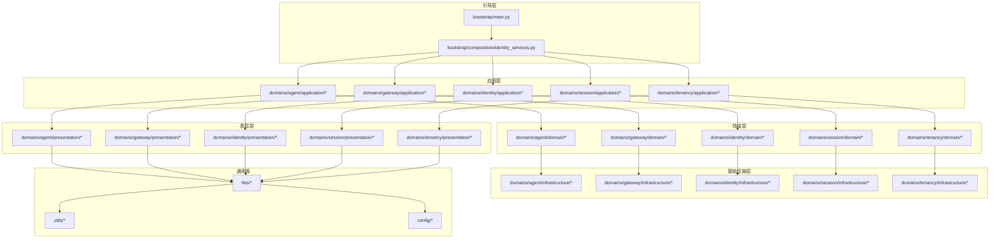
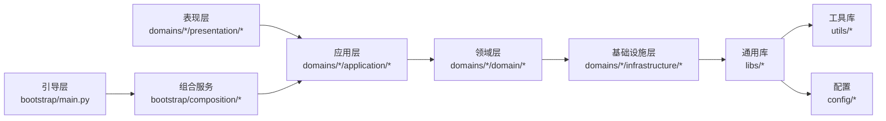
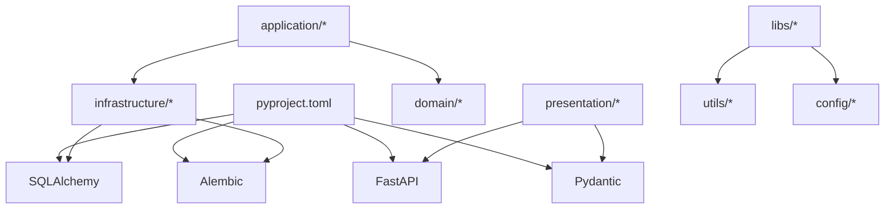

# Python代码规范

<cite>
**本文引用的文件**
- [backend/docs/CODE_STANDARDS.md](file://backend/docs/CODE_STANDARDS.md)
- [backend/pyproject.toml](file://backend/pyproject.toml)
- [backend/.pylintrc](file://backend/.pylintrc)
- [backend/bootstrap/main.py](file://backend/bootstrap/main.py)
- [backend/bootstrap/composition/identity_services.py](file://backend/bootstrap/composition/identity_services.py)
- [backend/libs/api/__init__.py](file://backend/libs/api/__init__.py)
- [backend/libs/middleware/__init__.py](file://backend/libs/middleware/__init__.py)
- [backend/libs/exceptions/__init__.py](file://backend/libs/exceptions/__init__.py)
- [backend/domains/agent/application/agent_use_cases.py](file://backend/domains/agent/application/agent_use_cases.py)
- [backend/domains/gateway/application/gateway_use_cases.py](file://backend/domains/gateway/application/gateway_use_cases.py)
- [backend/domains/identity/application/identity_use_cases.py](file://backend/domains/identity/application/identity_use_cases.py)
- [backend/domains/session/application/session_use_cases.py](file://backend/domains/session/application/session_use_cases.py)
- [backend/domains/tenancy/application/tenancy_use_cases.py](file://backend/domains/tenancy/application/tenancy_use_cases.py)
- [backend/domains/agent/domain/agent_entity.py](file://backend/domains/agent/domain/agent_entity.py)
- [backend/domains/gateway/domain/gateway_entity.py](file://backend/domains/gateway/domain/gateway_entity.py)
- [backend/domains/identity/domain/identity_entity.py](file://backend/domains/identity/domain/identity_entity.py)
- [backend/domains/session/domain/session_entity.py](file://backend/domains/session/domain/session_entity.py)
- [backend/domains/tenancy/domain/tenancy_entity.py](file://backend/domains/tenancy/domain/tenancy_entity.py)
- [backend/domains/agent/presentation/agent_routes.py](file://backend/domains/agent/presentation/agent_routes.py)
- [backend/domains/gateway/presentation/gateway_routes.py](file://backend/domains/gateway/presentation/gateway_routes.py)
- [backend/domains/identity/presentation/identity_routes.py](file://backend/domains/identity/presentation/identity_routes.py)
- [backend/domains/session/presentation/session_routes.py](file://backend/domains/session/presentation/session_routes.py)
- [backend/domains/tenancy/presentation/tenancy_routes.py](file://backend/domains/tenancy/presentation/tenancy_routes.py)
- [backend/utils/logging.py](file://backend/utils/logging.py)
- [backend/utils/cache.py](file://backend/utils/cache.py)
- [backend/utils/crypto.py](file://backend/utils/crypto.py)
- [backend/utils/tokens.py](file://backend/utils/tokens.py)
- [backend/utils/serialization.py](file://backend/utils/serialization.py)
- [backend/scripts/run_dev_server.py](file://backend/scripts/run_dev_server.py)
- [backend/scripts/run_server.py](file://backend/scripts/run_server.py)
- [backend/tests/unit/test_code_tools_sandbox.py](file://backend/tests/unit/test_code_tools_sandbox.py)
- [backend/tests/unit/test_sandbox_executor.py](file://backend/tests/unit/test_sandbox_executor.py)
- [backend/tests/unit/test_sandbox_executor_factory.py](file://backend/tests/unit/test_sandbox_executor_factory.py)
- [backend/tests/unit/test_sandbox_manager.py](file://backend/tests/unit/test_sandbox_manager.py)
- [backend/tests/mocks/llm_mock.py](file://backend/tests/mocks/llm_mock.py)
- [backend/config/app.toml](file://backend/config/app.toml)
- [backend/config/execution.toml](file://backend/config/execution.toml)
- [backend/config/litellm_models.yaml](file://backend/config/litellm_models.yaml)
- [backend/config/mcp.toml](file://backend/config/mcp.toml)
- [backend/config/tools.toml](file://backend/config/tools.toml)
- [backend/config/environments/local-dev.toml](file://backend/config/environments/local-dev.toml)
- [backend/config/environments/docker-dev.toml](file://backend/config/environments/docker-dev.toml)
- [backend/config/environments/python-dev.toml](file://backend/config/environments/python-dev.toml)
- [backend/config/environments/network-enabled.toml](file://backend/config/environments/network-enabled.toml)
- [backend/config/environments/network-restricted.toml](file://backend/config/environments/network-restricted.toml)
- [backend/config/environments/minimal.toml](file://backend/config/environments/minimal.toml)
- [backend/config/environments/data-science.toml](file://backend/config/environments/data-science.toml)
- [backend/config/environments/node-dev.toml](file://backend/config/environments/node-dev.toml)
- [backend/config/environments/k8s-prod.toml](file://backend/config/environments/k8s-prod.toml)
- [backend/config/environments/docker-prod.toml](file://backend/config/environments/docker-prod.toml)
- [backend/config/environments/staging.toml](file://backend/config/environments/staging.toml)
- [backend/config/environments/development.toml](file://backend/config/environments/development.toml)
- [backend/config/environments/production.toml](file://backend/config/environments/production.toml)
- [backend/config/env.example](file://backend/config/env.example)
- [backend/Makefile](file://backend/Makefile)
- [backend/Dockerfile](file://backend/Dockerfile)
- [backend/docker/sandbox/Dockerfile](file://backend/docker/sandbox/Dockerfile)
- [backend/alembic/script.py.mako](file://backend/alembic/script.py.mako)
- [backend/alembic/env.py](file://backend/alembic/env.py)
- [backend/alembic/versions/001_initial.py](file://backend/alembic/versions/001_initial.py)
- [backend/alembic/versions/011_add_anonymous_user_support.py](file://backend/alembic/versions/011_add_anonymous_user_support.py)
- [backend/evaluation/benchmarks/agent_tasks.yaml](file://backend/evaluation/benchmarks/agent_tasks.yaml)
- [backend/evaluation/benchmarks/gaia_sample.yaml](file://backend/evaluation/benchmarks/gaia_sample.yaml)
- [backend/evaluation/benchmarks/tool_accuracy_cases.yaml](file://backend/evaluation/benchmarks/tool_accuracy_cases.yaml)
- [backend/evaluation/gaia.py](file://backend/evaluation/gaia.py)
- [backend/evaluation/performance.py](file://backend/evaluation/performance.py)
- [backend/evaluation/task_completion.py](file://backend/evaluation/task_completion.py)
- [backend/evaluation/tool_accuracy.py](file://backend/evaluation/tool_accuracy.py)
- [backend/evaluation/llm_judge.py](file://backend/evaluation/llm_judge.py)
- [backend/evaluation/benchmark_loader.py](file://backend/evaluation/benchmark_loader.py)
- [backend/libs/background_tasks.py](file://backend/libs/background_tasks.py)
- [backend/libs/model_connectivity.py](file://backend/libs/model_connectivity.py)
- [backend/libs/identity_bridge_deps.py](file://backend/libs/identity_bridge_deps.py)
- [backend/libs/types/__init__.py](file://backend/libs/types/__init__.py)
- [backend/libs/crypto.py](file://backend/libs/crypto.py)
- [backend/libs/storage/__init__.py](file://backend/libs/storage/__init__.py)
- [backend/libs/orm/__init__.py](file://backend/libs/orm/__init__.py)
- [backend/libs/db/__init__.py](file://backend/libs/db/__init__.py)
- [backend/libs/gateway/__init__.py](file://backend/libs/gateway/__init__.py)
- [backend/libs/llm/__init__.py](file://backend/libs/llm/__init__.py)
- [backend/libs/mcp/__init__.py](file://backend/libs/mcp/__init__.py)
- [backend/libs/observability/__init__.py](file://backend/libs/observability/__init__.py)
- [backend/libs/iam/__init__.py](file://backend/libs/iam/__init__.py)
- [backend/libs/api/__init__.py](file://backend/libs/api/__init__.py)
- [backend/libs/middleware/__init__.py](file://backend/libs/middleware/__init__.py)
- [backend/libs/exceptions/__init__.py](file://backend/libs/exceptions/__init__.py)
- [backend/libs/config/__init__.py](file://backend/libs/config/__init__.py)
- [backend/libs/identity_bridge_deps.py](file://backend/libs/identity_bridge_deps.py)
- [backend/libs/background_tasks.py](file://backend/libs/background_tasks.py)
- [backend/libs/model_connectivity.py](file://backend/libs/model_connectivity.py)
- [backend/libs/types/__init__.py](file://backend/libs/types/__init__.py)
- [backend/libs/crypto.py](file://backend/libs/crypto.py)
- [backend/libs/storage/__init__.py](file://backend/libs/storage/__init__.py)
- [backend/libs/orm/__init__.py](file://backend/libs/orm/__init__.py)
- [backend/libs/db/__init__.py](file://backend/libs/db/__init__.py)
- [backend/libs/gateway/__init__.py](file://backend/libs/gateway/__init__.py)
- [backend/libs/llm/__init__.py](file://backend/libs/llm/__init__.py)
- [backend/libs/mcp/__init__.py](file://backend/libs/mcp/__init__.py)
- [backend/libs/observability/__init__.py](file://backend/libs/observability/__init__.py)
- [backend/libs/iam/__init__.py](file://backend/libs/iam/__init__.py)
- [backend/libs/api/__init__.py](file://backend/libs/api/__init__.py)
- [backend/libs/middleware/__init__.py](file://backend/libs/middleware/__init__.py)
- [backend/libs/exceptions/__init__.py](file://backend/libs/exceptions/__init__.py)
- [backend/libs/config/__init__.py](file://backend/libs/config/__init__.py)
</cite>

## 目录
1. [引言](#引言)
2. [项目结构](#项目结构)
3. [核心组件](#核心组件)
4. [架构总览](#架构总览)
5. [详细组件分析](#详细组件分析)
6. [依赖关系分析](#依赖关系分析)
7. [性能考量](#性能考量)
8. [故障排查指南](#故障排查指南)
9. [结论](#结论)
10. [附录](#附录)

## 引言
本规范面向AI Agent后端工程团队，统一Python 3.11+编码标准，覆盖类型注解、命名约定、代码风格与PEP 8实践；结合FastAPI框架的最佳实践（依赖注入、异常处理、数据验证、路由组织）；阐述DDD分层架构在Python中的落地规范（模块划分、导入顺序、接口定义、依赖管理）；提供异步编程、错误处理与异常管理、单元测试与mock使用的指导，并通过“正确示例”和“常见反例”的路径指引帮助团队提升一致性与可维护性。

## 项目结构
后端采用多域DDD分层架构，按领域拆分application、domain、infrastructure、presentation四层，配合bootstrap引导层与libs通用库，形成清晰的职责边界与依赖方向。配置与脚本位于config与scripts目录，测试位于tests，评估指标位于evaluation，数据库迁移由Alembic管理。

图表来源
- [backend/bootstrap/main.py](file://backend/bootstrap/main.py)
- [backend/bootstrap/composition/identity_services.py](file://backend/bootstrap/composition/identity_services.py)
- [backend/domains/agent/application/agent_use_cases.py](file://backend/domains/agent/application/agent_use_cases.py)
- [backend/domains/gateway/application/gateway_use_cases.py](file://backend/domains/gateway/application/gateway_use_cases.py)
- [backend/domains/identity/application/identity_use_cases.py](file://backend/domains/identity/application/identity_use_cases.py)
- [backend/domains/session/application/session_use_cases.py](file://backend/domains/session/application/session_use_cases.py)
- [backend/domains/tenancy/application/tenancy_use_cases.py](file://backend/domains/tenancy/application/tenancy_use_cases.py)
- [backend/domains/agent/presentation/agent_routes.py](file://backend/domains/agent/presentation/agent_routes.py)
- [backend/domains/gateway/presentation/gateway_routes.py](file://backend/domains/gateway/presentation/gateway_routes.py)
- [backend/domains/identity/presentation/identity_routes.py](file://backend/domains/identity/presentation/identity_routes.py)
- [backend/domains/session/presentation/session_routes.py](file://backend/domains/session/presentation/session_routes.py)
- [backend/domains/tenancy/presentation/tenancy_routes.py](file://backend/domains/tenancy/presentation/tenancy_routes.py)
- [backend/libs/api/__init__.py](file://backend/libs/api/__init__.py)
- [backend/utils/logging.py](file://backend/utils/logging.py)
- [backend/config/app.toml](file://backend/config/app.toml)

章节来源
- [backend/bootstrap/main.py](file://backend/bootstrap/main.py)
- [backend/bootstrap/composition/identity_services.py](file://backend/bootstrap/composition/identity_services.py)
- [backend/domains/agent/application/agent_use_cases.py](file://backend/domains/agent/application/agent_use_cases.py)
- [backend/domains/gateway/application/gateway_use_cases.py](file://backend/domains/gateway/application/gateway_use_cases.py)
- [backend/domains/identity/application/identity_use_cases.py](file://backend/domains/identity/application/identity_use_cases.py)
- [backend/domains/session/application/session_use_cases.py](file://backend/domains/session/application/session_use_cases.py)
- [backend/domains/tenancy/application/tenancy_use_cases.py](file://backend/domains/tenancy/application/tenancy_use_cases.py)
- [backend/domains/agent/presentation/agent_routes.py](file://backend/domains/agent/presentation/agent_routes.py)
- [backend/domains/gateway/presentation/gateway_routes.py](file://backend/domains/gateway/presentation/gateway_routes.py)
- [backend/domains/identity/presentation/identity_routes.py](file://backend/domains/identity/presentation/identity_routes.py)
- [backend/domains/session/presentation/session_routes.py](file://backend/domains/session/presentation/session_routes.py)
- [backend/domains/tenancy/presentation/tenancy_routes.py](file://backend/domains/tenancy/presentation/tenancy_routes.py)
- [backend/libs/api/__init__.py](file://backend/libs/api/__init__.py)
- [backend/utils/logging.py](file://backend/utils/logging.py)
- [backend/config/app.toml](file://backend/config/app.toml)

## 核心组件
- 类型注解与数据模型：建议在domain实体与application用例间保持一致的类型注解风格，优先使用标准库类型与泛型容器，避免过早引入第三方类型库。
- 命名约定：模块与包使用蛇形命名；类使用帕斯卡命名；函数与变量使用蛇形命名；常量使用全大写下划线；受保护成员以下划线前缀。
- 代码风格与PEP 8：遵循缩进、空行、空格、换行等基本规范；导入顺序严格区分标准库、第三方库、项目内相对导入；避免循环依赖。
- FastAPI最佳实践：依赖注入通过FastAPI依赖项与composition层解耦；异常处理集中于中间件或全局异常处理器；数据验证使用Pydantic模型并在presentation层校验。
- DDD分层：application仅编排use cases，不直接访问基础设施；domain封装业务不变式；infrastructure提供技术实现；presentation负责HTTP接口。
- 异步编程：优先使用async/await；对IO密集任务进行并发控制；避免在同步上下文中阻塞事件循环。
- 错误处理：自定义异常类层次化；异常传播遵循最小暴露原则；记录结构化日志便于追踪。
- 单元测试：使用pytest；mock外部依赖；测试用例覆盖关键分支与边界条件；集成测试与端到端测试分离。

章节来源
- [backend/pyproject.toml](file://backend/pyproject.toml)
- [backend/.pylintrc](file://backend/.pylintrc)
- [backend/docs/CODE_STANDARDS.md](file://backend/docs/CODE_STANDARDS.md)

## 架构总览
下图展示了从引导层到各层的依赖流向，体现“上层调用下层、下层不反向依赖上层”的原则。

图表来源
- [backend/bootstrap/main.py](file://backend/bootstrap/main.py)
- [backend/bootstrap/composition/identity_services.py](file://backend/bootstrap/composition/identity_services.py)
- [backend/domains/agent/presentation/agent_routes.py](file://backend/domains/agent/presentation/agent_routes.py)
- [backend/domains/gateway/presentation/gateway_routes.py](file://backend/domains/gateway/presentation/gateway_routes.py)
- [backend/domains/identity/presentation/identity_routes.py](file://backend/domains/identity/presentation/identity_routes.py)
- [backend/domains/session/presentation/session_routes.py](file://backend/domains/session/presentation/session_routes.py)
- [backend/domains/tenancy/presentation/tenancy_routes.py](file://backend/domains/tenancy/presentation/tenancy_routes.py)
- [backend/domains/agent/application/agent_use_cases.py](file://backend/domains/agent/application/agent_use_cases.py)
- [backend/domains/gateway/application/gateway_use_cases.py](file://backend/domains/gateway/application/gateway_use_cases.py)
- [backend/domains/identity/application/identity_use_cases.py](file://backend/domains/identity/application/identity_use_cases.py)
- [backend/domains/session/application/session_use_cases.py](file://backend/domains/session/application/session_use_cases.py)
- [backend/domains/tenancy/application/tenancy_use_cases.py](file://backend/domains/tenancy/application/tenancy_use_cases.py)
- [backend/libs/api/__init__.py](file://backend/libs/api/__init__.py)
- [backend/utils/logging.py](file://backend/utils/logging.py)
- [backend/config/app.toml](file://backend/config/app.toml)

## 详细组件分析

### 类型注解与数据模型
- 建议在domain实体中明确字段类型与可空性；在application用例中使用泛型集合与Union表示可选值；在presentation层使用Pydantic模型进行输入输出序列化与校验。
- 反例路径参考：[backend/domains/agent/domain/agent_entity.py](file://backend/domains/agent/domain/agent_entity.py)、[backend/domains/gateway/domain/gateway_entity.py](file://backend/domains/gateway/domain/gateway_entity.py)、[backend/domains/identity/domain/identity_entity.py](file://backend/domains/identity/domain/identity_entity.py)、[backend/domains/session/domain/session_entity.py](file://backend/domains/session/domain/session_entity.py)、[backend/domains/tenancy/domain/tenancy_entity.py](file://backend/domains/tenancy/domain/tenancy_entity.py)

章节来源
- [backend/domains/agent/domain/agent_entity.py](file://backend/domains/agent/domain/agent_entity.py)
- [backend/domains/gateway/domain/gateway_entity.py](file://backend/domains/gateway/domain/gateway_entity.py)
- [backend/domains/identity/domain/identity_entity.py](file://backend/domains/identity/domain/identity_entity.py)
- [backend/domains/session/domain/session_entity.py](file://backend/domains/session/domain/session_entity.py)
- [backend/domains/tenancy/domain/tenancy_entity.py](file://backend/domains/tenancy/domain/tenancy_entity.py)

### 命名约定与导入顺序
- 模块与包：snake_case；类：PascalCase；函数/变量：snake_case；常量：UPPER_CASE；受保护：_protected。
- 导入顺序：标准库 → 第三方库 → 项目内相对导入；同一组内按字母序排列；避免同名别名与未使用导入。
- 反例路径参考：[backend/domains/agent/application/agent_use_cases.py](file://backend/domains/agent/application/agent_use_cases.py)、[backend/domains/gateway/application/gateway_use_cases.py](file://backend/domains/gateway/application/gateway_use_cases.py)、[backend/domains/identity/application/identity_use_cases.py](file://backend/domains/identity/application/identity_use_cases.py)、[backend/domains/session/application/session_use_cases.py](file://backend/domains/session/application/session_use_cases.py)、[backend/domains/tenancy/application/tenancy_use_cases.py](file://backend/domains/tenancy/application/tenancy_use_cases.py)

章节来源
- [backend/domains/agent/application/agent_use_cases.py](file://backend/domains/agent/application/agent_use_cases.py)
- [backend/domains/gateway/application/gateway_use_cases.py](file://backend/domains/gateway/application/gateway_use_cases.py)
- [backend/domains/identity/application/identity_use_cases.py](file://backend/domains/identity/application/identity_use_cases.py)
- [backend/domains/session/application/session_use_cases.py](file://backend/domains/session/application/session_use_cases.py)
- [backend/domains/tenancy/application/tenancy_use_cases.py](file://backend/domains/tenancy/application/tenancy_use_cases.py)

### FastAPI最佳实践
- 依赖注入：将业务依赖注入到FastAPI依赖项，避免在路由中直接实例化；通过composition层组装服务。
- 异常处理：集中处理业务异常与HTTP异常，返回统一格式；必要时记录结构化日志。
- 数据验证：在presentation层使用Pydantic模型进行请求/响应校验；application层可进行二次业务校验。
- 路由组织：按领域划分路由模块，每个模块导出router对象；在应用入口聚合注册。
- 反例路径参考：[backend/domains/agent/presentation/agent_routes.py](file://backend/domains/agent/presentation/agent_routes.py)、[backend/domains/gateway/presentation/gateway_routes.py](file://backend/domains/gateway/presentation/gateway_routes.py)、[backend/domains/identity/presentation/identity_routes.py](file://backend/domains/identity/presentation/identity_routes.py)、[backend/domains/session/presentation/session_routes.py](file://backend/domains/session/presentation/session_routes.py)、[backend/domains/tenancy/presentation/tenancy_routes.py](file://backend/domains/tenancy/presentation/tenancy_routes.py)

章节来源
- [backend/domains/agent/presentation/agent_routes.py](file://backend/domains/agent/presentation/agent_routes.py)
- [backend/domains/gateway/presentation/gateway_routes.py](file://backend/domains/gateway/presentation/gateway_routes.py)
- [backend/domains/identity/presentation/identity_routes.py](file://backend/domains/identity/presentation/identity_routes.py)
- [backend/domains/session/presentation/session_routes.py](file://backend/domains/session/presentation/session_routes.py)
- [backend/domains/tenancy/presentation/tenancy_routes.py](file://backend/domains/tenancy/presentation/tenancy_routes.py)

### DDD分层架构实现规范
- 模块划分：application仅编排use cases；domain封装不变式；infrastructure提供技术实现；presentation负责HTTP接口。
- 导入顺序：presentation → application → domain → infrastructure；避免反向依赖。
- 接口定义：抽象接口放在domain层，具体实现放在infrastructure层；application通过接口依赖反转。
- 依赖管理：通过composition层集中装配；bootstrap负责启动与生命周期管理。
- 反例路径参考：[backend/bootstrap/composition/identity_services.py](file://backend/bootstrap/composition/identity_services.py)、[backend/bootstrap/main.py](file://backend/bootstrap/main.py)

章节来源
- [backend/bootstrap/composition/identity_services.py](file://backend/bootstrap/composition/identity_services.py)
- [backend/bootstrap/main.py](file://backend/bootstrap/main.py)

### 异步编程规范
- 使用async/await处理IO密集任务；在presentation层对异步路由进行合理并发控制。
- 避免在同步上下文中阻塞事件循环；对外部服务调用应使用异步客户端。
- 反例路径参考：[backend/libs/background_tasks.py](file://backend/libs/background_tasks.py)、[backend/scripts/run_dev_server.py](file://backend/scripts/run_dev_server.py)、[backend/scripts/run_server.py](file://backend/scripts/run_server.py)

章节来源
- [backend/libs/background_tasks.py](file://backend/libs/background_tasks.py)
- [backend/scripts/run_dev_server.py](file://backend/scripts/run_dev_server.py)
- [backend/scripts/run_server.py](file://backend/scripts/run_server.py)

### 错误处理与异常管理
- 自定义异常类：按业务域分层定义异常基类与具体异常；异常消息应清晰且不泄露敏感信息。
- 异常传播：在presentation层捕获并转换为HTTP异常；在application层抛出业务异常；在infrastructure层包装底层异常。
- 结构化日志：使用统一的日志配置与字段，便于问题定位与审计。
- 反例路径参考：[backend/libs/exceptions/__init__.py](file://backend/libs/exceptions/__init__.py)、[backend/utils/logging.py](file://backend/utils/logging.py)

章节来源
- [backend/libs/exceptions/__init__.py](file://backend/libs/exceptions/__init__.py)
- [backend/utils/logging.py](file://backend/utils/logging.py)

### 单元测试与mock使用
- 测试组织：按功能域与层级划分测试目录；使用pytest参数化与fixture复用setup逻辑。
- mock使用：对外部服务与数据库使用mock；确保测试隔离与可重复性。
- 反例路径参考：[backend/tests/unit/test_code_tools_sandbox.py](file://backend/tests/unit/test_code_tools_sandbox.py)、[backend/tests/unit/test_sandbox_executor.py](file://backend/tests/unit/test_sandbox_executor.py)、[backend/tests/unit/test_sandbox_executor_factory.py](file://backend/tests/unit/test_sandbox_executor_factory.py)、[backend/tests/unit/test_sandbox_manager.py](file://backend/tests/unit/test_sandbox_manager.py)、[backend/tests/mocks/llm_mock.py](file://backend/tests/mocks/llm_mock.py)

章节来源
- [backend/tests/unit/test_code_tools_sandbox.py](file://backend/tests/unit/test_code_tools_sandbox.py)
- [backend/tests/unit/test_sandbox_executor.py](file://backend/tests/unit/test_sandbox_executor.py)
- [backend/tests/unit/test_sandbox_executor_factory.py](file://backend/tests/unit/test_sandbox_executor_factory.py)
- [backend/tests/unit/test_sandbox_manager.py](file://backend/tests/unit/test_sandbox_manager.py)
- [backend/tests/mocks/llm_mock.py](file://backend/tests/mocks/llm_mock.py)

### 配置与环境管理
- 配置文件：app.toml、execution.toml、litellm_models.yaml、mcp.toml、tools.toml等；按环境拆分配置文件。
- 环境变量：通过env.example提供默认值；在不同环境加载对应配置。
- 反例路径参考：[backend/config/app.toml](file://backend/config/app.toml)、[backend/config/execution.toml](file://backend/config/execution.toml)、[backend/config/litellm_models.yaml](file://backend/config/litellm_models.yaml)、[backend/config/mcp.toml](file://backend/config/mcp.toml)、[backend/config/tools.toml](file://backend/config/tools.toml)、[backend/config/environments/local-dev.toml](file://backend/config/environments/local-dev.toml)、[backend/config/environments/docker-dev.toml](file://backend/config/environments/docker-dev.toml)、[backend/config/environments/python-dev.toml](file://backend/config/environments/python-dev.toml)、[backend/config/environments/network-enabled.toml](file://backend/config/environments/network-enabled.toml)、[backend/config/environments/network-restricted.toml](file://backend/config/environments/network-restricted.toml)、[backend/config/environments/minimal.toml](file://backend/config/environments/minimal.toml)、[backend/config/environments/data-science.toml](file://backend/config/environments/data-science.toml)、[backend/config/environments/node-dev.toml](file://backend/config/environments/node-dev.toml)、[backend/config/environments/k8s-prod.toml](file://backend/config/environments/k8s-prod.toml)、[backend/config/environments/docker-prod.toml](file://backend/config/environments/docker-prod.toml)、[backend/config/environments/staging.toml](file://backend/config/environments/staging.toml)、[backend/config/environments/development.toml](file://backend/config/environments/development.toml)、[backend/config/environments/production.toml](file://backend/config/environments/production.toml)、[backend/config/env.example](file://backend/config/env.example)

章节来源
- [backend/config/app.toml](file://backend/config/app.toml)
- [backend/config/execution.toml](file://backend/config/execution.toml)
- [backend/config/litellm_models.yaml](file://backend/config/litellm_models.yaml)
- [backend/config/mcp.toml](file://backend/config/mcp.toml)
- [backend/config/tools.toml](file://backend/config/tools.toml)
- [backend/config/environments/local-dev.toml](file://backend/config/environments/local-dev.toml)
- [backend/config/environments/docker-dev.toml](file://backend/config/environments/docker-dev.toml)
- [backend/config/environments/python-dev.toml](file://backend/config/environments/python-dev.toml)
- [backend/config/environments/network-enabled.toml](file://backend/config/environments/network-enabled.toml)
- [backend/config/environments/network-restricted.toml](file://backend/config/environments/network-restricted.toml)
- [backend/config/environments/minimal.toml](file://backend/config/environments/minimal.toml)
- [backend/config/environments/data-science.toml](file://backend/config/environments/data-science.toml)
- [backend/config/environments/node-dev.toml](file://backend/config/environments/node-dev.toml)
- [backend/config/environments/k8s-prod.toml](file://backend/config/environments/k8s-prod.toml)
- [backend/config/environments/docker-prod.toml](file://backend/config/environments/docker-prod.toml)
- [backend/config/environments/staging.toml](file://backend/config/environments/staging.toml)
- [backend/config/environments/development.toml](file://backend/config/environments/development.toml)
- [backend/config/environments/production.toml](file://backend/config/environments/production.toml)
- [backend/config/env.example](file://backend/config/env.example)

### 数据库迁移与版本控制
- 迁移脚本：Alembic版本化迁移文件；每次变更生成新版本；保持迁移幂等与可回滚。
- 反例路径参考：[backend/alembic/env.py](file://backend/alembic/env.py)、[backend/alembic/script.py.mako](file://backend/alembic/script.py.mako)、[backend/alembic/versions/001_initial.py](file://backend/alembic/versions/001_initial.py)、[backend/alembic/versions/011_add_anonymous_user_support.py](file://backend/alembic/versions/011_add_anonymous_user_support.py)

章节来源
- [backend/alembic/env.py](file://backend/alembic/env.py)
- [backend/alembic/script.py.mako](file://backend/alembic/script.py.mako)
- [backend/alembic/versions/001_initial.py](file://backend/alembic/versions/001_initial.py)
- [backend/alembic/versions/011_add_anonymous_user_support.py](file://backend/alembic/versions/011_add_anonymous_user_support.py)

### 工具库与通用能力
- 工具库：logging、cache、crypto、tokens、serialization等；提供统一接口与一致行为。
- 反例路径参考：[backend/utils/logging.py](file://backend/utils/logging.py)、[backend/utils/cache.py](file://backend/utils/cache.py)、[backend/utils/crypto.py](file://backend/utils/crypto.py)、[backend/utils/tokens.py](file://backend/utils/tokens.py)、[backend/utils/serialization.py](file://backend/utils/serialization.py)

章节来源
- [backend/utils/logging.py](file://backend/utils/logging.py)
- [backend/utils/cache.py](file://backend/utils/cache.py)
- [backend/utils/crypto.py](file://backend/utils/crypto.py)
- [backend/utils/tokens.py](file://backend/utils/tokens.py)
- [backend/utils/serialization.py](file://backend/utils/serialization.py)

### 评估与基准
- 基准数据：agent_tasks.yaml、gaia_sample.yaml、tool_accuracy_cases.yaml；用于评估工具准确性与任务完成率。
- 评估脚本：gaia.py、performance.py、task_completion.py、tool_accuracy.py、llm_judge.py、benchmark_loader.py。
- 反例路径参考：[backend/evaluation/benchmarks/agent_tasks.yaml](file://backend/evaluation/benchmarks/agent_tasks.yaml)、[backend/evaluation/benchmarks/gaia_sample.yaml](file://backend/evaluation/benchmarks/gaia_sample.yaml)、[backend/evaluation/benchmarks/tool_accuracy_cases.yaml](file://backend/evaluation/benchmarks/tool_accuracy_cases.yaml)、[backend/evaluation/gaia.py](file://backend/evaluation/gaia.py)、[backend/evaluation/performance.py](file://backend/evaluation/performance.py)、[backend/evaluation/task_completion.py](file://backend/evaluation/task_completion.py)、[backend/evaluation/tool_accuracy.py](file://backend/evaluation/tool_accuracy.py)、[backend/evaluation/llm_judge.py](file://backend/evaluation/llm_judge.py)、[backend/evaluation/benchmark_loader.py](file://backend/evaluation/benchmark_loader.py)

章节来源
- [backend/evaluation/benchmarks/agent_tasks.yaml](file://backend/evaluation/benchmarks/agent_tasks.yaml)
- [backend/evaluation/benchmarks/gaia_sample.yaml](file://backend/evaluation/benchmarks/gaia_sample.yaml)
- [backend/evaluation/benchmarks/tool_accuracy_cases.yaml](file://backend/evaluation/benchmarks/tool_accuracy_cases.yaml)
- [backend/evaluation/gaia.py](file://backend/evaluation/gaia.py)
- [backend/evaluation/performance.py](file://backend/evaluation/performance.py)
- [backend/evaluation/task_completion.py](file://backend/evaluation/task_completion.py)
- [backend/evaluation/tool_accuracy.py](file://backend/evaluation/tool_accuracy.py)
- [backend/evaluation/llm_judge.py](file://backend/evaluation/llm_judge.py)
- [backend/evaluation/benchmark_loader.py](file://backend/evaluation/benchmark_loader.py)

## 依赖关系分析
- 语言与工具链：Python 3.11+；构建与测试工具在pyproject.toml中声明；静态检查与lint规则在.pylint配置中定义。
- 外部依赖：FastAPI、Pydantic、Alembic、SQLAlchemy等；版本与兼容性在pyproject.toml中约束。
- 内部依赖：libs与utils作为通用层被各领域复用；presentation依赖application与libs；application依赖domain与infrastructure。

图表来源
- [backend/pyproject.toml](file://backend/pyproject.toml)
- [backend/domains/agent/presentation/agent_routes.py](file://backend/domains/agent/presentation/agent_routes.py)
- [backend/domains/gateway/presentation/gateway_routes.py](file://backend/domains/gateway/presentation/gateway_routes.py)
- [backend/domains/identity/presentation/identity_routes.py](file://backend/domains/identity/presentation/identity_routes.py)
- [backend/domains/session/presentation/session_routes.py](file://backend/domains/session/presentation/session_routes.py)
- [backend/domains/tenancy/presentation/tenancy_routes.py](file://backend/domains/tenancy/presentation/tenancy_routes.py)
- [backend/domains/agent/application/agent_use_cases.py](file://backend/domains/agent/application/agent_use_cases.py)
- [backend/domains/gateway/application/gateway_use_cases.py](file://backend/domains/gateway/application/gateway_use_cases.py)
- [backend/domains/identity/application/identity_use_cases.py](file://backend/domains/identity/application/identity_use_cases.py)
- [backend/domains/session/application/session_use_cases.py](file://backend/domains/session/application/session_use_cases.py)
- [backend/domains/tenancy/application/tenancy_use_cases.py](file://backend/domains/tenancy/application/tenancy_use_cases.py)
- [backend/libs/api/__init__.py](file://backend/libs/api/__init__.py)
- [backend/utils/logging.py](file://backend/utils/logging.py)
- [backend/config/app.toml](file://backend/config/app.toml)

章节来源
- [backend/pyproject.toml](file://backend/pyproject.toml)
- [backend/.pylintrc](file://backend/.pylintrc)

## 性能考量
- 异步与并发：优先使用异步IO；对高并发场景设置合理的并发上限与超时；避免在事件循环中执行CPU密集任务。
- 缓存策略：利用cache工具库进行热点数据缓存；注意缓存失效策略与一致性。
- 序列化与反序列化：使用高效的序列化工具；在I/O边界减少不必要的对象拷贝。
- 数据库访问：遵循分页与索引优化；批量操作减少往返次数；使用连接池与事务边界控制。
- 日志与可观测性：统一结构化日志字段；避免高频细粒度日志影响性能。

## 故障排查指南
- 启动与运行：检查Dockerfile与Makefile中的构建步骤；确认环境变量与配置文件加载顺序。
- 异常定位：查看结构化日志字段；根据异常栈定位到具体use case或handler；核对依赖注入是否完整。
- 数据库问题：核对Alembic版本与迁移状态；检查数据库连接与权限；验证schema与索引。
- 测试失败：确认测试环境隔离；核对mock配置与fixture；检查参数化用例的边界条件。

章节来源
- [backend/Dockerfile](file://backend/Dockerfile)
- [backend/Makefile](file://backend/Makefile)
- [backend/alembic/env.py](file://backend/alembic/env.py)
- [backend/utils/logging.py](file://backend/utils/logging.py)

## 结论
本规范以Python 3.11+为基础，结合FastAPI与DDD分层架构，提供了从类型注解、命名约定、代码风格到异常处理、测试与运维的全流程指导。建议团队在日常开发中严格遵循上述规范，并通过持续的静态检查与测试保障质量与一致性。

## 附录
- 快速参考清单
  - 类型注解：优先使用标准库类型；在Pydantic模型中进行输入输出校验。
  - 命名约定：模块与包snake_case；类PascalCase；函数/变量snake_case；常量UPPER_CASE。
  - 导入顺序：标准库 → 第三方库 → 项目内相对导入；避免循环依赖。
  - FastAPI：依赖注入集中化；异常处理统一化；数据验证前置化。
  - DDD：application只编排；domain只封装不变式；infrastructure只做实现；presentation只做接口。
  - 异步：async/await优先；并发控制合理；避免阻塞事件循环。
  - 错误处理：自定义异常层次化；异常传播最小化；结构化日志规范化。
  - 测试：pytest组织；mock隔离；参数化与fixture复用。