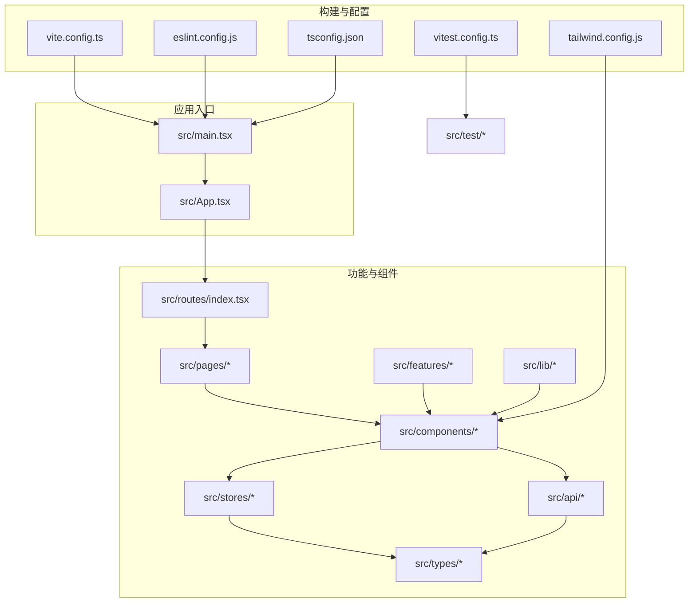
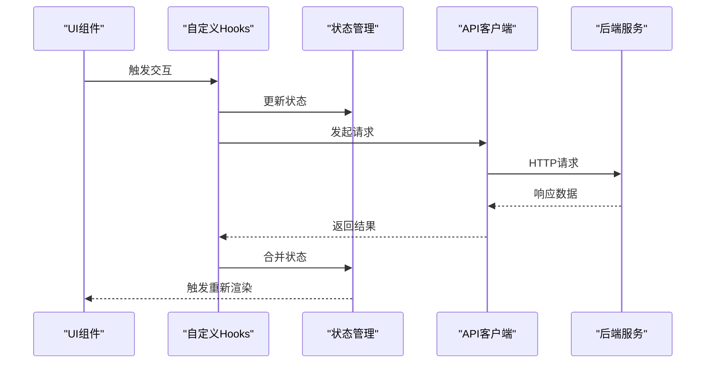
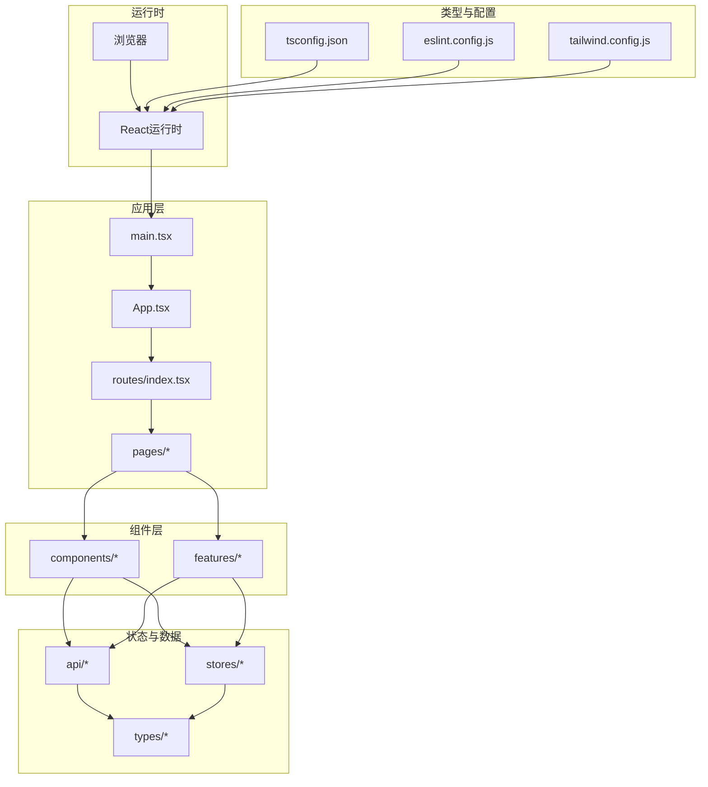
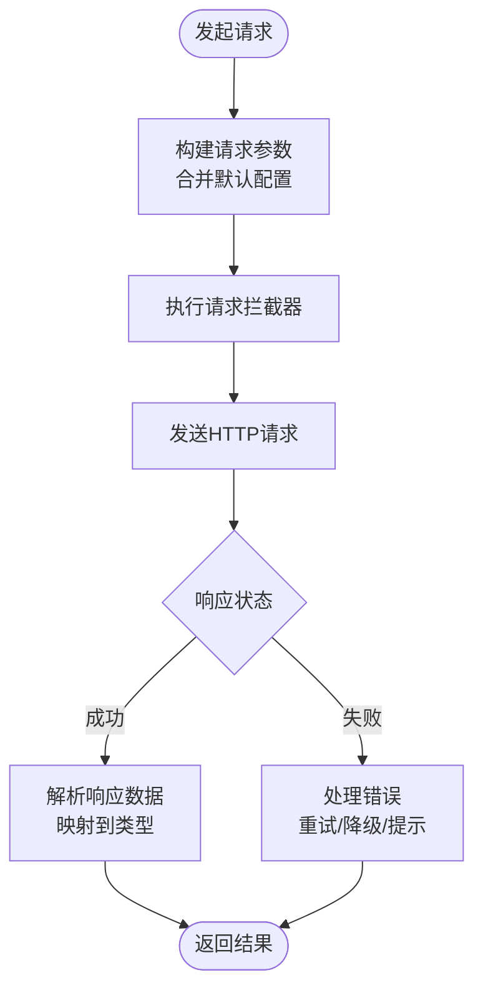
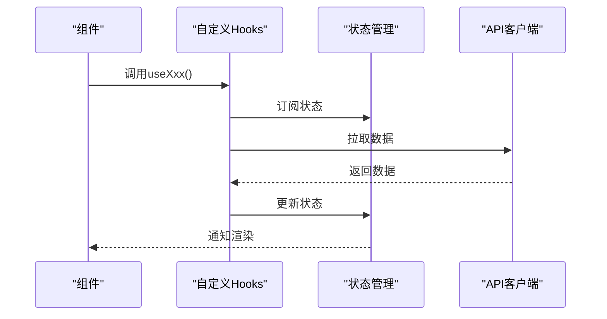
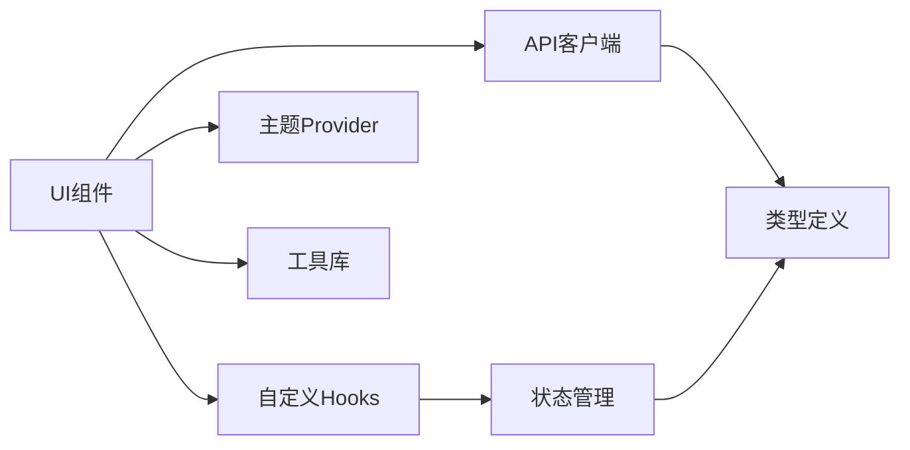

# TypeScript代码规范

<cite>
**本文引用的文件**
- [eslint.config.js](file://frontend/eslint.config.js)
- [vite.config.ts](file://frontend/vite.config.ts)
- [tsconfig.json](file://frontend/tsconfig.json)
- [tsconfig.node.json](file://frontend/tsconfig.node.json)
- [tailwind.config.js](file://frontend/tailwind.config.js)
- [vitest.config.ts](file://frontend/vitest.config.ts)
- [package.json](file://frontend/package.json)
- [src/main.tsx](file://frontend/src/main.tsx)
- [src/App.tsx](file://frontend/src/App.tsx)
- [src/components/ui/button.tsx](file://frontend/src/components/ui/button.tsx)
- [src/components/chat/message.tsx](file://frontend/src/components/chat/message.tsx)
- [src/hooks/use-chat.ts](file://frontend/src/hooks/use-chat.ts)
- [src/stores/chat-store.ts](file://frontend/src/stores/chat-store.ts)
- [src/api/client.ts](file://frontend/src/api/client.ts)
- [src/types/chat.ts](file://frontend/src/types/chat.ts)
- [src/routes/index.tsx](file://frontend/src/routes/index.tsx)
- [src/features/gateway-models/models-list.tsx](file://frontend/src/features/gateway-models/models-list.tsx)
- [src/lib/utils.ts](file://frontend/src/lib/utils.ts)
- [src/constants/listing-studio.ts](file://frontend/src/constants/listing-studio.ts)
- [src/config/auth.ts](file://frontend/src/config/auth.ts)
- [src/components/theme-provider.tsx](file://frontend/src/components/theme-provider.tsx)
- [src/components/layout/header.tsx](file://frontend/src/components/layout/header.tsx)
- [src/components/auth-provider.tsx](file://frontend/src/components/auth-provider.tsx)
- [src/pages/dashboard.tsx](file://frontend/src/pages/dashboard.tsx)
- [src/test/example.test.tsx](file://frontend/src/test/example.test.tsx)
- [frontend/docs/CODE_STANDARDS.md](file://frontend/docs/CODE_STANDARDS.md)
- [frontend/docs/DESIGN_SYSTEM.md](file://frontend/docs/DESIGN_SYSTEM.md)
- [frontend/docs/DEVELOPMENT.md](file://frontend/docs/DEVELOPMENT.md)
</cite>

## 目录
1. [简介](#简介)
2. [项目结构](#项目结构)
3. [核心组件](#核心组件)
4. [架构总览](#架构总览)
5. [详细组件分析](#详细组件分析)
6. [依赖关系分析](#依赖关系分析)
7. [性能考虑](#性能考虑)
8. [故障排除指南](#故障排除指南)
9. [结论](#结论)
10. [附录](#附录)

## 简介
本规范文档面向AI Agent项目的前端团队，旨在统一TypeScript编码风格、React组件开发规范、前端架构设计、UI组件开发规范、测试规范以及构建配置与打包优化。文档基于仓库中现有的配置文件与代码实践进行总结，并提供可操作的最佳实践建议与常见反例说明。

## 项目结构
前端采用Vite + React + TypeScript + TailwindCSS技术栈，目录组织遵循功能域驱动（Feature-based）与分层（Layer-based）相结合的方式：
- 配置与构建：vite.config.ts、tsconfig.json、eslint.config.js、tailwind.config.js、vitest.config.ts
- 应用入口：src/main.tsx、src/App.tsx
- 组件与页面：src/components、src/pages、src/routes
- 功能域：src/features（如gateway-models等）
- 类型定义：src/types
- API客户端：src/api
- 状态管理：src/stores
- 工具库：src/lib
- 常量与配置：src/constants、src/config
- 测试：src/test

**图表来源**
- [vite.config.ts:1-200](file://frontend/vite.config.ts#L1-L200)
- [tsconfig.json:1-200](file://frontend/tsconfig.json#L1-L200)
- [eslint.config.js:1-200](file://frontend/eslint.config.js#L1-L200)
- [tailwind.config.js:1-200](file://frontend/tailwind.config.js#L1-L200)
- [vitest.config.ts:1-200](file://frontend/vitest.config.ts#L1-L200)
- [src/main.tsx:1-100](file://frontend/src/main.tsx#L1-L100)
- [src/App.tsx:1-100](file://frontend/src/App.tsx#L1-L100)
- [src/routes/index.tsx:1-100](file://frontend/src/routes/index.tsx#L1-L100)

**章节来源**
- [vite.config.ts:1-200](file://frontend/vite.config.ts#L1-L200)
- [tsconfig.json:1-200](file://frontend/tsconfig.json#L1-L200)
- [eslint.config.js:1-200](file://frontend/eslint.config.js#L1-L200)
- [tailwind.config.js:1-200](file://frontend/tailwind.config.js#L1-L200)
- [vitest.config.ts:1-200](file://frontend/vitest.config.ts#L1-L200)
- [src/main.tsx:1-100](file://frontend/src/main.tsx#L1-L100)
- [src/App.tsx:1-100](file://frontend/src/App.tsx#L1-L100)

## 核心组件
本节聚焦TypeScript编码标准、React组件开发规范、前端架构规范、UI组件开发规范、测试规范与构建配置。

### TypeScript编码标准
- 接口与类型声明
  - 使用接口描述对象契约，优先使用只读属性以提升不可变性；对可选属性明确标注并提供默认值或校验逻辑。
  - 对复杂嵌套数据使用类型别名与条件类型组合，避免any与unknown滥用。
  - 在API响应与本地状态间建立一一对应的类型映射，确保前后端契约一致。
- 泛型使用
  - 在通用工具函数与API客户端中广泛使用泛型约束，保证类型安全与复用性。
  - 对React组件的Props与Hook返回值使用泛型，减少重复实现。
- 模块导入导出
  - 统一使用ES模块语法，按功能域分组导入，避免循环依赖。
  - 导出命名导出与默认导出保持清晰边界，避免同名冲突。
- 类型推断与显式声明
  - 在复杂表达式中优先显式声明关键变量类型，提升可读性与可维护性。
  - 利用工具类型（Partial、Pick、Omit、Record等）简化类型声明。

**章节来源**
- [src/types/chat.ts:1-200](file://frontend/src/types/chat.ts#L1-L200)
- [src/api/client.ts:1-200](file://frontend/src/api/client.ts#L1-L200)
- [src/lib/utils.ts:1-200](file://frontend/src/lib/utils.ts#L1-L200)

### React组件开发规范
- 函数组件与Hooks
  - 优先使用函数组件与Hooks，避免类组件；合理拆分自定义Hooks，关注单一职责。
  - 在自定义Hooks中统一处理副作用、缓存与错误边界，确保可测试性与可复用性。
- Props类型定义
  - 所有Props必须显式声明类型，必要时使用工具类型构造只读、可选或必填集合。
  - 对回调Props提供明确的参数与返回值类型，避免隐式any。
- 状态管理最佳实践
  - 将全局状态与局部状态分离，优先使用轻量状态管理（如Zustand）或React Query。
  - 对复杂状态使用原子化更新策略，避免深层对象拷贝带来的性能问题。
- 组件组织
  - 功能域组件集中存放于features目录，共享组件置于components目录，页面级组件位于pages目录。
  - 组件命名采用帕斯卡命名法，文件名与组件名一致，便于IDE识别与Tree-shaking。

**章节来源**
- [src/hooks/use-chat.ts:1-200](file://frontend/src/hooks/use-chat.ts#L1-L200)
- [src/stores/chat-store.ts:1-200](file://frontend/src/stores/chat-store.ts#L1-L200)
- [src/components/chat/message.tsx:1-200](file://frontend/src/components/chat/message.tsx#L1-L200)
- [src/features/gateway-models/models-list.tsx:1-200](file://frontend/src/features/gateway-models/models-list.tsx#L1-L200)

### 前端架构规范
- 组件组织
  - 采用“页面-功能域-共享组件”三层结构，页面负责路由与布局，功能域封装业务能力，共享组件提供UI复用。
- 路由配置
  - 使用React Router进行路由管理，支持懒加载与Suspense占位，提升首屏性能。
- 状态管理
  - 全局状态使用Zustand或React Query，本地状态使用useState/useReducer，避免过度抽象。
- API客户端设计
  - API客户端统一在src/api下管理，支持拦截器、重试、超时与错误处理，请求参数与响应类型严格对齐。

**图表来源**
- [src/hooks/use-chat.ts:1-200](file://frontend/src/hooks/use-chat.ts#L1-L200)
- [src/stores/chat-store.ts:1-200](file://frontend/src/stores/chat-store.ts#L1-L200)
- [src/api/client.ts:1-200](file://frontend/src/api/client.ts#L1-L200)

**章节来源**
- [src/routes/index.tsx:1-200](file://frontend/src/routes/index.tsx#L1-L200)
- [src/pages/dashboard.tsx:1-200](file://frontend/src/pages/dashboard.tsx#L1-L200)
- [src/stores/chat-store.ts:1-200](file://frontend/src/stores/chat-store.ts#L1-L200)
- [src/api/client.ts:1-200](file://frontend/src/api/client.ts#L1-L200)

### UI组件开发规范
- 设计原则
  - 以用户为中心，遵循可访问性（WCAG）与一致性原则；组件具备明确的语义与键盘导航支持。
- 样式组织
  - 使用TailwindCSS进行原子化样式管理，避免全局样式污染；通过variants与插件扩展主题能力。
- 主题系统
  - 支持明暗主题切换，主题变量集中管理，组件内部不直接硬编码颜色值。
- 组件设计
  - 输入与输出清晰，Props最小化；提供默认值与错误边界；支持className透传与样式覆盖。

**章节来源**
- [src/components/theme-provider.tsx:1-200](file://frontend/src/components/theme-provider.tsx#L1-L200)
- [src/components/ui/button.tsx:1-200](file://frontend/src/components/ui/button.tsx#L1-L200)
- [tailwind.config.js:1-200](file://frontend/tailwind.config.js#L1-L200)
- [frontend/docs/DESIGN_SYSTEM.md:1-200](file://frontend/docs/DESIGN_SYSTEM.md#L1-L200)

### 前端测试规范与组件测试最佳实践
- 单元测试
  - 使用Vitest进行单元测试，组件测试采用React Testing Library，确保可测试性与可维护性。
- 集成测试
  - 对关键流程（如聊天、认证）编写集成测试，模拟API与状态变化。
- 测试覆盖率
  - 保持核心模块高覆盖率，对边界条件与异常路径进行重点覆盖。
- 最佳实践
  - 使用工厂模式生成测试数据；对异步逻辑使用waitFor；避免测试间的耦合。

**章节来源**
- [vitest.config.ts:1-200](file://frontend/vitest.config.ts#L1-L200)
- [src/test/example.test.tsx:1-200](file://frontend/src/test/example.test.tsx#L1-L200)

### 构建配置与打包优化规范
- Vite配置
  - 启用按需编译与Tree-shaking，合理配置别名与插件链；生产环境启用压缩与资源内联策略。
- TypeScript配置
  - 严格模式开启，禁止隐式any；路径映射与模块解析策略统一；类型检查与构建分离。
- 代码质量检查
  - ESLint规则与Prettier格式化统一，提交前执行静态检查与格式化；CI中强制执行。
- 打包优化
  - 分包策略按功能域拆分，动态导入非关键模块；图片与字体资源优化；缓存策略与CDN配置。

**章节来源**
- [vite.config.ts:1-200](file://frontend/vite.config.ts#L1-L200)
- [tsconfig.json:1-200](file://frontend/tsconfig.json#L1-L200)
- [eslint.config.js:1-200](file://frontend/eslint.config.js#L1-L200)
- [package.json:1-200](file://frontend/package.json#L1-L200)

## 架构总览
整体架构围绕“类型安全 + 组件化 + 状态管理 + API客户端 + 主题系统”的核心要素展开，通过严格的配置与规范确保可维护性与可扩展性。

**图表来源**
- [tsconfig.json:1-200](file://frontend/tsconfig.json#L1-L200)
- [eslint.config.js:1-200](file://frontend/eslint.config.js#L1-L200)
- [tailwind.config.js:1-200](file://frontend/tailwind.config.js#L1-L200)
- [src/main.tsx:1-100](file://frontend/src/main.tsx#L1-L100)
- [src/App.tsx:1-100](file://frontend/src/App.tsx#L1-L100)
- [src/routes/index.tsx:1-100](file://frontend/src/routes/index.tsx#L1-L100)
- [src/api/client.ts:1-200](file://frontend/src/api/client.ts#L1-L200)
- [src/stores/chat-store.ts:1-200](file://frontend/src/stores/chat-store.ts#L1-L200)
- [src/types/chat.ts:1-200](file://frontend/src/types/chat.ts#L1-L200)

## 详细组件分析

### API客户端设计
- 设计要点
  - 统一请求与响应类型，支持拦截器、重试与错误处理；提供基础URL与认证头注入。
  - 对分页、列表与详情接口分别抽象，确保调用方无需关心细节。
- 错误处理
  - 明确区分网络错误、业务错误与未捕获异常，提供统一的错误提示与日志上报。
- 性能优化
  - 缓存策略与去重请求，避免重复加载；对长列表采用虚拟滚动与懒加载。

**图表来源**
- [src/api/client.ts:1-200](file://frontend/src/api/client.ts#L1-L200)

**章节来源**
- [src/api/client.ts:1-200](file://frontend/src/api/client.ts#L1-L200)

### 自定义Hooks与状态管理
- Hooks设计
  - 将副作用、缓存与错误处理封装在Hooks中，暴露简洁的useXxx接口；支持依赖变更与重试。
- 状态模型
  - 使用原子化状态与不可变更新策略，避免深层拷贝；对复杂状态使用selector优化订阅粒度。
- 可测试性
  - Hooks通过参数注入与工厂函数解耦，便于单元测试与模拟。

**图表来源**
- [src/hooks/use-chat.ts:1-200](file://frontend/src/hooks/use-chat.ts#L1-L200)
- [src/stores/chat-store.ts:1-200](file://frontend/src/stores/chat-store.ts#L1-L200)
- [src/api/client.ts:1-200](file://frontend/src/api/client.ts#L1-L200)

**章节来源**
- [src/hooks/use-chat.ts:1-200](file://frontend/src/hooks/use-chat.ts#L1-L200)
- [src/stores/chat-store.ts:1-200](file://frontend/src/stores/chat-store.ts#L1-L200)

### UI组件与主题系统
- 组件设计
  - 以设计系统为依据，统一尺寸、颜色与动效；支持主题切换与无障碍属性。
- 主题系统
  - 通过Provider注入主题上下文，组件内部仅消费变量，避免硬编码。
- 样式组织
  - Tailwind原子化样式与组件样式分离，必要时使用CSS模块或styled方案。

**章节来源**
- [src/components/theme-provider.tsx:1-200](file://frontend/src/components/theme-provider.tsx#L1-L200)
- [src/components/ui/button.tsx:1-200](file://frontend/src/components/ui/button.tsx#L1-L200)
- [frontend/docs/DESIGN_SYSTEM.md:1-200](file://frontend/docs/DESIGN_SYSTEM.md#L1-L200)

### 路由与页面组织
- 路由设计
  - 页面路由与功能域路由分离，支持懒加载与Suspense占位；路由参数与查询串类型化。
- 页面组织
  - 页面组件负责布局与容器，具体功能拆分为子组件与Hooks；避免页面过重。

**章节来源**
- [src/routes/index.tsx:1-200](file://frontend/src/routes/index.tsx#L1-L200)
- [src/pages/dashboard.tsx:1-200](file://frontend/src/pages/dashboard.tsx#L1-L200)

## 依赖关系分析
- 内聚性与耦合性
  - 组件与功能域之间通过类型与API进行松耦合；状态管理与UI通过单向数据流连接。
- 外部依赖
  - React、React Router、Zustand/React Query、TailwindCSS、ESLint、Vite等为核心依赖。
- 循环依赖规避
  - 通过类型声明前置与模块拆分避免循环导入；对共享常量与工具集中管理。

**图表来源**
- [src/components/ui/button.tsx:1-200](file://frontend/src/components/ui/button.tsx#L1-L200)
- [src/hooks/use-chat.ts:1-200](file://frontend/src/hooks/use-chat.ts#L1-L200)
- [src/stores/chat-store.ts:1-200](file://frontend/src/stores/chat-store.ts#L1-L200)
- [src/api/client.ts:1-200](file://frontend/src/api/client.ts#L1-L200)
- [src/types/chat.ts:1-200](file://frontend/src/types/chat.ts#L1-L200)
- [src/lib/utils.ts:1-200](file://frontend/src/lib/utils.ts#L1-L200)

**章节来源**
- [src/lib/utils.ts:1-200](file://frontend/src/lib/utils.ts#L1-L200)
- [src/components/ui/button.tsx:1-200](file://frontend/src/components/ui/button.tsx#L1-L200)

## 性能考虑
- 渲染性能
  - 使用React.memo与useMemo/useCallback避免不必要的重渲染；对长列表采用虚拟化。
- 网络性能
  - 请求去重与缓存策略、分页懒加载、图片与字体资源优化。
- 构建性能
  - 合理的分包与动态导入、Tree-shaking与压缩配置；CI中并行化测试与检查。

## 故障排除指南
- 类型错误
  - 使用TS严格模式定位问题；对any类型进行替换与细化；补充缺失的类型注解。
- ESLint错误
  - 遵循规则配置，必要时使用// @ts-expect-error注释并提供理由；修复格式化问题。
- 运行时错误
  - 检查API响应与状态更新逻辑；添加错误边界与降级策略；记录日志便于追踪。

**章节来源**
- [eslint.config.js:1-200](file://frontend/eslint.config.js#L1-L200)
- [tsconfig.json:1-200](file://frontend/tsconfig.json#L1-L200)

## 结论
本规范文档从TypeScript编码、React组件、架构设计、UI组件、测试与构建六个维度提供了统一标准与最佳实践。建议团队在日常开发中严格遵循，持续改进以提升代码质量与开发效率。

## 附录
- 相关文档
  - [frontend/docs/CODE_STANDARDS.md:1-200](file://frontend/docs/CODE_STANDARDS.md#L1-L200)
  - [frontend/docs/DESIGN_SYSTEM.md:1-200](file://frontend/docs/DESIGN_SYSTEM.md#L1-L200)
  - [frontend/docs/DEVELOPMENT.md:1-200](file://frontend/docs/DEVELOPMENT.md#L1-L200)