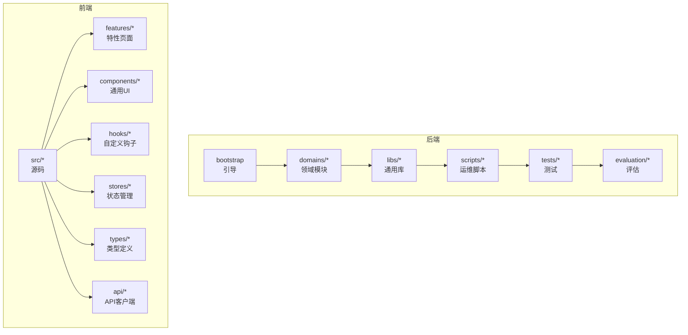
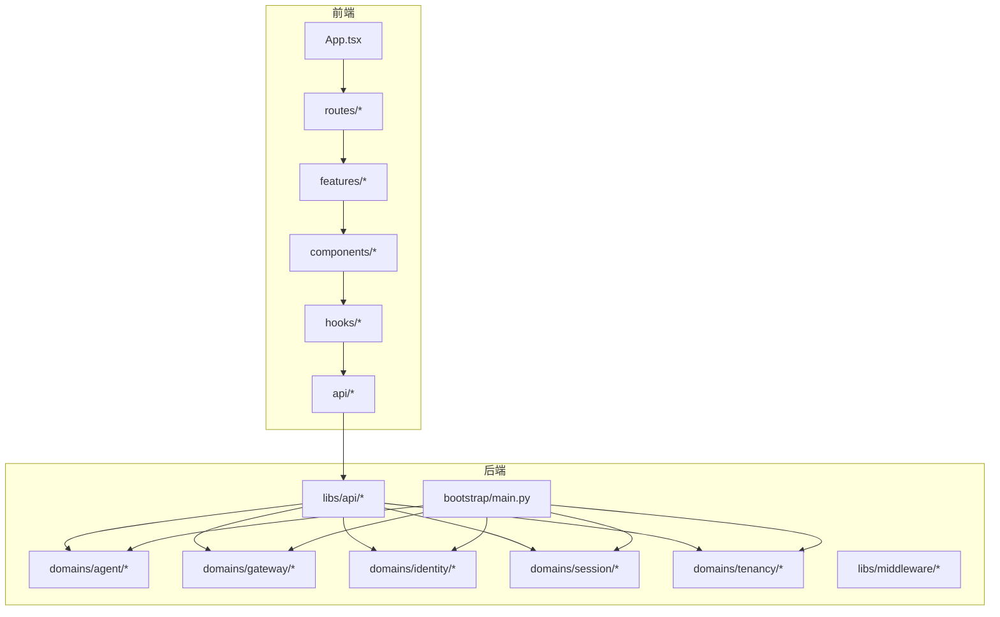
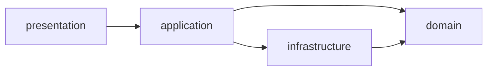
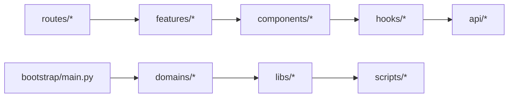

# 代码规范

<cite>
**本文引用的文件**
- [后端代码规范](file://backend/docs/CODE_STANDARDS.md)
- [前端代码规范](file://frontend/docs/CODE_STANDARDS.md)
- [ESLint 配置](file://frontend/eslint.config.js)
- [Prettier 配置](file://frontend/.prettierrc)
- [Tailwind 配置](file://frontend/tailwind.config.js)
- [TypeScript 配置](file://frontend/tsconfig.json)
- [Vite 配置](file://frontend/vite.config.ts)
- [后端架构文档](file://backend/docs/ARCHITECTURE.md)
- [领域驱动设计（DDD）分层架构](file://backend/docs/AGENT_ARCHITECTURE_DESIGN.md)
- [LangGraph 架构理由](file://backend/docs/LANGGRAPH_ARCHITECTURE_RATIONALE.md)
- [后端开发指南](file://backend/docs/DEVELOPMENT.md)
- [前端开发指南](file://frontend/docs/DEVELOPMENT.md)
- [设计系统文档](file://frontend/docs/DESIGN_SYSTEM.md)
- [API 响应格式](file://docs/API_RESPONSE.md)
- [分页规范](file://docs/PAGINATION.md)
- [后端配置示例](file://backend/config/app.toml)
- [后端执行配置](file://backend/config/execution.toml)
- [后端 MCP 配置](file://backend/config/mcp.toml)
- [后端工具配置](file://backend/config/tools.toml)
- [后端环境配置示例](file://backend/config/env.example)
- [后端 Alembic 版本脚本](file://backend/alembic/versions/001_initial.py)
- [后端 Alembic SQL 脚本](file://backend/alembic/sql/001_initial.up.sql)
- [后端引导入口](file://backend/bootstrap/main.py)
- [后端引导配置加载器](file://backend/bootstrap/config_loader.py)
- [后端引导事件循环](file://backend/bootstrap/event_loop.py)
- [后端域：Agent 应用层](file://backend/domains/agent/application/)
- [后端域：Gateway 应用层](file://backend/domains/gateway/application/)
- [后端域：Identity 应用层](file://backend/domains/identity/application/)
- [后端域：Session 应用层](file://backend/domains/session/application/)
- [后端域：Tenancy 应用层](file://backend/domains/tenancy/application/)
- [后端域：Evaluation 应用层](file://backend/domains/evaluation/application/)
- [后端库：API](file://backend/libs/api/)
- [后端库：中间件](file://backend/libs/middleware/)
- [后端库：类型](file://backend/libs/types/)
- [后端库：加密](file://backend/libs/crypto.py)
- [后端库：身份桥接依赖](file://backend/libs/identity_bridge_deps.py)
- [后端库：模型连通性](file://backend/libs/model_connectivity.py)
- [后端脚本：运行开发服务器](file://backend/scripts/run_dev_server.py)
- [后端脚本：运行服务器](file://backend/scripts/run_server.py)
- [前端页面路由](file://frontend/src/routes/)
- [前端聊天组件](file://frontend/src/components/chat/)
- [前端通用UI组件](file://frontend/src/components/ui/)
- [前端聊天钩子](file://frontend/src/hooks/use-chat.ts)
- [前端聊天API客户端](file://frontend/src/api/chat.ts)
- [前端会话API客户端](file://frontend/src/api/session.ts)
- [前端工具API客户端](file://frontend/src/api/tools.ts)
- [前端MCP API客户端](file://frontend/src/api/mcp.ts)
- [前端用户API客户端](file://frontend/src/api/user.ts)
- [前端系统API客户端](file://frontend/src/api/system.ts)
- [前端路径API客户端](file://frontend/src/api/paths.ts)
- [前端内存API客户端](file://frontend/src/api/memory.ts)
- [前端视频任务API客户端](file://frontend/src/api/videoTask.ts)
- [前端网关API客户端](file://frontend/src/api/gateway/)
- [前端类型定义](file://frontend/src/types/)
- [前端应用入口](file://frontend/src/App.tsx)
- [前端主入口](file://frontend/src/main.tsx)
- [前端主题提供者](file://frontend/src/components/theme-provider.tsx)
- [前端认证提供者](file://frontend/src/components/auth-provider.tsx)
- [前端模型选择器](file://frontend/src/components/model-selector.tsx)
- [前端分页控件](file://frontend/src/components/pagination-controls.tsx)
- [前端确认对话框](file://frontend/src/components/confirm-alert-dialog.tsx)
- [前端存储仓库](file://frontend/src/stores/)
- [前端特征功能：网关凭据](file://frontend/src/features/gateway-credentials/)
- [前端特征功能：网关模型](file://frontend/src/features/gateway-models/)
- [前端特征功能：网关预算](file://frontend/src/features/gateway-budget/)
- [前端特征功能：网关团队](file://frontend/src/features/gateway-teams/)
- [前端特征功能：网关使用](file://frontend/src/features/gateway-usage/)
- [前端特征功能：网关定价](file://frontend/src/features/gateway-pricing/)
- [前端特征功能：网关共享](file://frontend/src/features/gateway-shared/)
- [前端特征功能：网关钥匙](file://frontend/src/features/gateway-keys/)
- [前端特征功能：网关演练场](file://frontend/src/features/gateway-playground/)
- [前端特征功能：网关指南](file://frontend/src/features/gateway-guide/)
- [前端特征功能：管理员用户](file://frontend/src/features/admin-users/)
- [前端特征功能：API密钥网关](file://frontend/src/features/api-key-gateway/)
- [前端特征功能：网关列表](file://frontend/src/features/listing-studio/)
- [后端测试：架构约束](file://backend/tests/architecture/)
- [后端测试：集成API](file://backend/tests/integration/api/)
- [后端测试：单元测试](file://backend/tests/unit/)
- [前端测试：单元测试](file://frontend/src/test/)
- [后端评估基准](file://backend/evaluation/)
- [后端评估指标](file://backend/evaluation/performance.py)
- [后端评估工具准确率](file://backend/evaluation/tool_accuracy.py)
- [后端评估LLM评测](file://backend/evaluation/llm_judge.py)
- [后端评估任务完成度](file://backend/evaluation/task_completion.py)
- [后端评估加载器](file://backend/evaluation/benchmark_loader.py)
- [后端评估基准数据](file://backend/evaluation/benchmarks/)
</cite>

## 目录
1. [引言](#引言)
2. [项目结构](#项目结构)
3. [核心组件](#核心组件)
4. [架构总览](#架构总览)
5. [详细组件分析](#详细组件分析)
6. [依赖分析](#依赖分析)
7. [性能考虑](#性能考虑)
8. [故障排查指南](#故障排查指南)
9. [结论](#结论)
10. [附录](#附录)

## 引言
本文件旨在为AI Agent项目提供统一、可执行的代码规范，覆盖Python与TypeScript两大语言栈，涵盖类型注解、命名约定、代码风格、最佳实践、错误处理、异步与并发、API设计与路由组织，并结合DDD分层架构的模块划分与依赖关系进行系统化说明。文档同时提供正反例指引与可视化图示，帮助不同经验水平的开发者快速上手并保持高质量交付。

## 项目结构
项目采用前后端分离架构，后端以Python为主，遵循DDD分层；前端以TypeScript/Vue生态为主，强调组件化与类型安全。整体目录组织如下：
- 后端：bootstrap（引导）、domains（领域模块）、libs（通用库）、scripts（运维脚本）、tests（测试）、evaluation（评估）
- 前端：src（源码）、docs（前端规范与设计）、public（静态资源）、features（特性化页面）、components（通用UI）、hooks（自定义钩子）、stores（状态管理）、types（类型定义）、api（API客户端）

**章节来源**
- [后端架构文档](file://backend/docs/ARCHITECTURE.md)
- [后端开发指南](file://backend/docs/DEVELOPMENT.md)
- [前端开发指南](file://frontend/docs/DEVELOPMENT.md)

## 核心组件
本节聚焦于Python与TypeScript的关键规范与最佳实践，确保跨语言一致性与可维护性。

- Python类型注解与风格
  - 使用类型注解明确函数签名、类属性与返回值，优先使用标准库类型提示与泛型容器。
  - 遵循PEP 8风格，使用4空格缩进、单行空行分隔逻辑块、双空行分隔顶层函数与类。
  - 文档字符串使用三重引号，描述参数、返回值、异常与副作用。
  - 错误处理：抛出具体异常类型，避免裸except，记录上下文信息。
  - 异步与并发：优先使用async/await，避免阻塞操作；并发控制通过信号量或队列限制。
  - DDD分层：application负责业务用例；domain封装不变式；infrastructure提供基础设施能力；presentation暴露API/CLI。

- TypeScript类型注解与风格
  - 使用严格模式与noImplicitAny，接口字段显式声明可选与必选。
  - 组件开发遵循单一职责，Props与状态分离；使用React Hooks管理副作用。
  - 前端架构：页面路由按功能域拆分，组件按可复用性拆分，状态集中管理。
  - API设计：REST风格，统一响应结构，错误码与消息标准化。

**章节来源**
- [后端代码规范](file://backend/docs/CODE_STANDARDS.md)
- [前端代码规范](file://frontend/docs/CODE_STANDARDS.md)
- [后端开发指南](file://backend/docs/DEVELOPMENT.md)
- [前端开发指南](file://frontend/docs/DEVELOPMENT.md)

## 架构总览
后端采用DDD分层架构，前端采用特性化页面与组件化开发。整体交互流程如下：

**图表来源**
- [后端引导入口](file://backend/bootstrap/main.py)
- [后端域：Agent 应用层](file://backend/domains/agent/application/)
- [后端域：Gateway 应用层](file://backend/domains/gateway/application/)
- [后端域：Identity 应用层](file://backend/domains/identity/application/)
- [后端域：Session 应用层](file://backend/domains/session/application/)
- [后端域：Tenancy 应用层](file://backend/domains/tenancy/application/)
- [后端库：API](file://backend/libs/api/)
- [后端库：中间件](file://backend/libs/middleware/)
- [前端应用入口](file://frontend/src/App.tsx)
- [前端页面路由](file://frontend/src/routes/)
- [前端聊天组件](file://frontend/src/components/chat/)
- [前端通用UI组件](file://frontend/src/components/ui/)
- [前端聊天钩子](file://frontend/src/hooks/use-chat.ts)
- [前端聊天API客户端](file://frontend/src/api/chat.ts)

**章节来源**
- [后端架构文档](file://backend/docs/ARCHITECTURE.md)
- [后端开发指南](file://backend/docs/DEVELOPMENT.md)
- [前端开发指南](file://frontend/docs/DEVELOPMENT.md)

## 详细组件分析

### Python 类型注解与命名规范
- 函数与方法
  - 使用明确的参数与返回类型注解；对可变对象使用泛型容器类型。
  - 变量命名采用snake_case，避免缩写，必要时使用前缀区分作用域。
- 类与模块
  - 类名采用PascalCase；模块名采用snake_case；包名简短且语义清晰。
  - 私有成员以下划线前缀，避免在公共接口中暴露内部实现。
- 常量
  - 全局常量使用UPPER_CASE；配置项使用SCREAMING_SNAKE_CASE。
- 文档字符串
  - 使用三重引号，首行简述用途，随后分段描述参数、返回值、异常与示例。

**章节来源**
- [后端代码规范](file://backend/docs/CODE_STANDARDS.md)

### Python 异步与并发控制
- 异步函数
  - 使用async def定义协程；在I/O密集场景优先使用异步调用，避免阻塞事件循环。
  - 对外暴露同步包装器时，确保内部正确await，避免死锁。
- 并发控制
  - 使用信号量限制并发数量；对共享资源加锁保护；避免竞态条件。
  - 对长耗时任务拆分为多个小任务，支持断点续跑与超时控制。

**章节来源**
- [后端代码规范](file://backend/docs/CODE_STANDARDS.md)

### Python 错误处理与异常管理
- 异常层次
  - 自定义异常继承标准异常类，明确异常语义与适用范围。
  - 在业务边界捕获异常并转换为领域异常，保留原始异常链。
- 日志与追踪
  - 记录异常堆栈与上下文信息；对外返回统一错误码与消息。
  - 对敏感信息脱敏，避免日志泄露。

**章节来源**
- [后端代码规范](file://backend/docs/CODE_STANDARDS.md)

### Python DDD 分层架构与模块划分
- application（应用层）
  - 封装业务用例，协调领域对象与基础设施；不包含业务规则。
- domain（领域层）
  - 定义实体、值对象与聚合根，维护不变式；对外暴露受控接口。
- infrastructure（基础设施层）
  - 提供数据库、缓存、外部服务等技术细节；对上层透明。
- presentation（表现层）
  - 提供HTTP/WS接口、命令行等入口；编排应用层用例。
- 依赖方向
  - 仅允许下层向上层暴露接口；禁止上层依赖下层实现。

**图表来源**
- [后端架构文档](file://backend/docs/ARCHITECTURE.md)
- [后端开发指南](file://backend/docs/DEVELOPMENT.md)

**章节来源**
- [后端架构文档](file://backend/docs/ARCHITECTURE.md)
- [后端开发指南](file://backend/docs/DEVELOPMENT.md)

### TypeScript 接口定义与组件开发
- 接口与类型
  - 使用interface定义契约，避免any；对可选字段使用?标记。
  - 对枚举与联合类型进行收敛，减少分支复杂度。
- 组件开发
  - 单一职责：每个组件只负责一个视图或交互片段。
  - Props与状态分离：外部状态由父组件管理，内部状态在组件内收敛。
  - Hooks复用：将副作用逻辑抽象为自定义Hooks，提升可测试性。
- 设计系统
  - 统一颜色、字体、间距与组件样式；通过主题提供者切换明暗模式。

**章节来源**
- [前端代码规范](file://frontend/docs/CODE_STANDARDS.md)
- [设计系统文档](file://frontend/docs/DESIGN_SYSTEM.md)
- [前端主题提供者](file://frontend/src/components/theme-provider.tsx)
- [前端模型选择器](file://frontend/src/components/model-selector.tsx)
- [前端分页控件](file://frontend/src/components/pagination-controls.tsx)
- [前端确认对话框](file://frontend/src/components/confirm-alert-dialog.tsx)

### TypeScript 前端架构规范
- 页面与路由
  - 路由按功能域拆分，页面组件职责单一；嵌套路由清晰表达层级。
- 特性化页面（features）
  - 将复杂页面拆分为多个特性模块，便于独立开发与测试。
- 状态管理
  - 使用集中式状态管理（如Zustand/Redux），避免跨组件重复传参。
- API 客户端
  - 统一封装请求与响应，提供拦截器与错误处理；对分页与过滤参数标准化。

**章节来源**
- [前端开发指南](file://frontend/docs/DEVELOPMENT.md)
- [前端页面路由](file://frontend/src/routes/)
- [前端特征功能：网关凭据](file://frontend/src/features/gateway-credentials/)
- [前端特征功能：网关模型](file://frontend/src/features/gateway-models/)
- [前端特征功能：网关预算](file://frontend/src/features/gateway-budget/)
- [前端特征功能：网关团队](file://frontend/src/features/gateway-teams/)
- [前端特征功能：网关使用](file://frontend/src/features/gateway-usage/)
- [前端特征功能：网关定价](file://frontend/src/features/gateway-pricing/)
- [前端特征功能：网关共享](file://frontend/src/features/gateway-shared/)
- [前端特征功能：网关钥匙](file://frontend/src/features/gateway-keys/)
- [前端特征功能：网关演练场](file://frontend/src/features/gateway-playground/)
- [前端特征功能：网关指南](file://frontend/src/features/gateway-guide/)
- [前端特征功能：管理员用户](file://frontend/src/features/admin-users/)
- [前端特征功能：API密钥网关](file://frontend/src/features/api-key-gateway/)
- [前端特征功能：网关列表](file://frontend/src/features/listing-studio/)

### API 设计原则与路由组织
- REST 风格
  - 使用名词复数作为资源路径；HTTP方法与动作匹配。
  - 统一响应结构：包含状态码、消息与数据体；错误响应包含错误码与定位信息。
- 路由组织
  - 按领域划分路由前缀；对版本化API使用URL版本号或头字段。
  - 对鉴权与权限校验在中间件层统一处理。
- 分页与过滤
  - 使用标准查询参数page/size/sort/filter；对大数据集提供游标分页或offset分页。

**章节来源**
- [API 响应格式](file://docs/API_RESPONSE.md)
- [分页规范](file://docs/PAGINATION.md)
- [后端库：中间件](file://backend/libs/middleware/)
- [后端库：API](file://backend/libs/api/)

### 命名规范（模块、类、函数、变量、常量）
- Python
  - 模块：snake_case，简短且语义明确。
  - 类：PascalCase，体现领域概念。
  - 函数/方法：snake_case，动宾结构。
  - 变量：snake_case，避免缩写。
  - 常量：UPPER_CASE 或 SCREAMING_SNAKE_CASE。
- TypeScript
  - 接口：PascalCase，名词形式。
  - 类型别名：PascalCase，语义明确。
  - 函数/方法：camelCase，动词开头。
  - 变量：camelCase，避免缩写。
  - 常量：UPPER_CASE。

**章节来源**
- [后端代码规范](file://backend/docs/CODE_STANDARDS.md)
- [前端代码规范](file://frontend/docs/CODE_STANDARDS.md)

### 代码风格指南（缩进、空行、注释、文档字符串）
- 缩进与空行
  - Python使用4空格；TypeScript使用2空格（以配合编辑器配置）。
  - 顶层函数与类之间使用双空行；方法之间使用单空行。
- 注释与文档字符串
  - 行内注释简洁明了；函数/类文档字符串三重引号，描述用途、参数、返回与异常。
  - 对复杂算法或业务规则添加注释说明背景与假设。

**章节来源**
- [后端代码规范](file://backend/docs/CODE_STANDARDS.md)
- [前端代码规范](file://frontend/docs/CODE_STANDARDS.md)

### 错误处理与异常管理最佳实践
- Python
  - 明确异常类型与传播路径；在应用层捕获并转换为业务异常。
  - 记录上下文与堆栈，对外返回统一错误码与消息。
- TypeScript
  - 使用Error子类表达不同错误类型；在Hook与组件中统一处理错误状态。
  - 对网络错误与业务错误进行区分，提供用户可读的提示。

**章节来源**
- [后端代码规范](file://backend/docs/CODE_STANDARDS.md)
- [前端代码规范](file://frontend/docs/CODE_STANDARDS.md)

### 异步编程与并发控制规范
- Python
  - 使用async/await；对数据库与外部服务调用采用异步客户端。
  - 并发限制通过信号量或队列；避免全局共享状态。
- TypeScript
  - 使用Promise与async/await；对高频事件去抖/节流。
  - 在组件卸载时取消未完成的请求或订阅。

**章节来源**
- [后端代码规范](file://backend/docs/CODE_STANDARDS.md)
- [前端代码规范](file://frontend/docs/CODE_STANDARDS.md)

### 具体示例与反例对比（路径指引）
- Python
  - 正例：函数签名包含完整类型注解，返回值与异常明确。
  - 反例：缺失类型注解、裸except、混用同步与异步。
- TypeScript
  - 正例：接口字段显式可选/必选，组件Props与状态分离。
  - 反例：使用any、副作用未封装为Hook、未处理错误状态。

**章节来源**
- [后端代码规范](file://backend/docs/CODE_STANDARDS.md)
- [前端代码规范](file://frontend/docs/CODE_STANDARDS.md)

## 依赖分析
- 后端
  - 引导层依赖各领域模块；应用层依赖领域与基础设施；基础设施层依赖外部库。
- 前端
  - 页面路由依赖特性模块；特性模块依赖通用组件与API客户端；API客户端依赖统一拦截器与错误处理。

**图表来源**
- [后端引导入口](file://backend/bootstrap/main.py)
- [后端域：Agent 应用层](file://backend/domains/agent/application/)
- [后端域：Gateway 应用层](file://backend/domains/gateway/application/)
- [后端域：Identity 应用层](file://backend/domains/identity/application/)
- [后端域：Session 应用层](file://backend/domains/session/application/)
- [后端域：Tenancy 应用层](file://backend/domains/tenancy/application/)
- [后端库：API](file://backend/libs/api/)
- [后端库：中间件](file://backend/libs/middleware/)
- [前端页面路由](file://frontend/src/routes/)
- [前端特征功能：网关凭据](file://frontend/src/features/gateway-credentials/)
- [前端通用UI组件](file://frontend/src/components/ui/)
- [前端聊天钩子](file://frontend/src/hooks/use-chat.ts)
- [前端聊天API客户端](file://frontend/src/api/chat.ts)

**章节来源**
- [后端架构文档](file://backend/docs/ARCHITECTURE.md)
- [前端开发指南](file://frontend/docs/DEVELOPMENT.md)

## 性能考虑
- Python
  - 数据库查询批量化；缓存热点数据；避免N+1查询；合理索引与分区。
  - 异步I/O与并发限制；对CPU密集任务使用进程池或外部服务。
- TypeScript
  - 组件渲染优化：memo化、虚拟滚动、懒加载；避免不必要的重渲染。
  - 请求缓存与去重；对高频操作进行节流/防抖。

**章节来源**
- [后端开发指南](file://backend/docs/DEVELOPMENT.md)
- [前端开发指南](file://frontend/docs/DEVELOPMENT.md)

## 故障排查指南
- Python
  - 启动失败：检查引导配置加载与事件循环初始化。
  - 数据库迁移：核对版本脚本与SQL变更，确保索引与约束一致。
  - 测试失败：关注架构约束测试与集成测试，定位导入环与依赖方向问题。
- TypeScript
  - 编译错误：检查TS配置与类型定义；确保接口与实现一致。
  - 运行时错误：启用严格模式与错误边界，捕获并上报异常。

**章节来源**
- [后端引导配置加载器](file://backend/bootstrap/config_loader.py)
- [后端引导事件循环](file://backend/bootstrap/event_loop.py)
- [后端测试：架构约束](file://backend/tests/architecture/)
- [后端测试：集成API](file://backend/tests/integration/api/)
- [TypeScript 配置](file://frontend/tsconfig.json)

## 结论
本规范文档从语言层面、架构层面与工程层面提供了统一的代码质量标准。建议在日常开发中：
- 严格遵循类型注解与命名约定；
- 采用DDD分层与前端特性化架构；
- 规范API设计与路由组织；
- 加强错误处理与性能优化；
- 通过测试与静态分析保障质量。

## 附录
- 配置参考
  - 后端配置示例：app.toml、execution.toml、mcp.toml、tools.toml、env.example
  - 前端配置：eslint.config.js、.prettierrc、tailwind.config.js、tsconfig.json、vite.config.ts
- 数据库迁移
  - Alembic版本脚本与SQL脚本位于alembic/versions与alembic/sql
- 评估体系
  - 评估基准与指标位于evaluation/，包含性能、工具准确率、LLM评测与任务完成度

**章节来源**
- [后端配置示例](file://backend/config/app.toml)
- [后端执行配置](file://backend/config/execution.toml)
- [后端 MCP 配置](file://backend/config/mcp.toml)
- [后端工具配置](file://backend/config/tools.toml)
- [后端环境配置示例](file://backend/config/env.example)
- [ESLint 配置](file://frontend/eslint.config.js)
- [Prettier 配置](file://frontend/.prettierrc)
- [Tailwind 配置](file://frontend/tailwind.config.js)
- [TypeScript 配置](file://frontend/tsconfig.json)
- [Vite 配置](file://frontend/vite.config.ts)
- [后端 Alembic 版本脚本](file://backend/alembic/versions/001_initial.py)
- [后端 Alembic SQL 脚本](file://backend/alembic/sql/001_initial.up.sql)
- [后端评估基准](file://backend/evaluation/)
- [后端评估指标](file://backend/evaluation/performance.py)
- [后端评估工具准确率](file://backend/evaluation/tool_accuracy.py)
- [后端评估LLM评测](file://backend/evaluation/llm_judge.py)
- [后端评估任务完成度](file://backend/evaluation/task_completion.py)
- [后端评估加载器](file://backend/evaluation/benchmark_loader.py)
- [后端评估基准数据](file://backend/evaluation/benchmarks/)