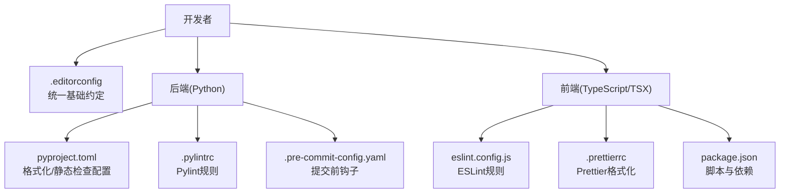
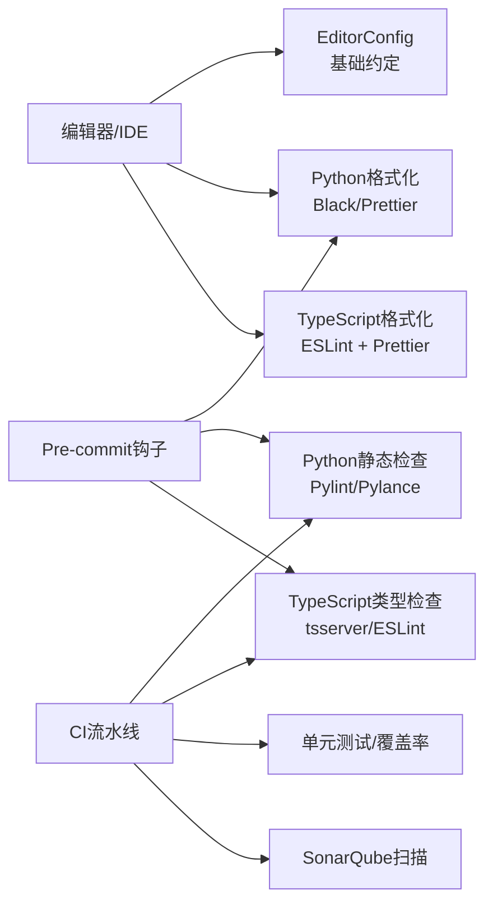
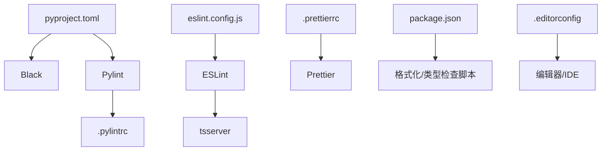

# 代码风格指南

<cite>
**本文引用的文件**
- [backend/docs/CODE_STANDARDS.md](file://backend/docs/CODE_STANDARDS.md)
- [frontend/docs/CODE_STANDARDS.md](file://frontend/docs/CODE_STANDARDS.md)
- [backend/pyproject.toml](file://backend/pyproject.toml)
- [frontend/eslint.config.js](file://frontend/eslint.config.js)
- [frontend/.prettierrc](file://frontend/.prettierrc)
- [backend/.pylintrc](file://backend/.pylintrc)
- [.editorconfig](file://.editorconfig)
- [backend/.pre-commit-config.yaml](file://backend/.pre-commit-config.yaml)
- [backend/Makefile](file://backend/Makefile)
- [frontend/package.json](file://frontend/package.json)
</cite>

## 目录
1. [简介](#简介)
2. [项目结构](#项目结构)
3. [核心组件](#核心组件)
4. [架构总览](#架构总览)
5. [详细组件分析](#详细组件分析)
6. [依赖分析](#依赖分析)
7. [性能考虑](#性能考虑)
8. [故障排查指南](#故障排查指南)
9. [结论](#结论)
10. [附录](#附录)

## 简介
本指南面向AI Agent项目，统一前后端代码风格与质量门禁，覆盖缩进、空行、注释与文档字符串、导入组织、长行换行、特殊符号空格、格式化工具配置及代码审查清单。目标是提升可读性、一致性与可维护性。

## 项目结构
- 后端采用Python生态（FastAPI、Alembic、SQLAlchemy），通过pyproject.toml集中管理格式化与静态检查工具。
- 前端采用TypeScript/React生态，通过ESLint与Prettier统一格式与规则。
- 顶层.editorconfig提供跨编辑器一致的编码约定。
- 仓库包含独立的前后端“代码标准”文档，作为风格基线。

图表来源
- [backend/pyproject.toml](file://backend/pyproject.toml)
- [backend/.pylintrc](file://backend/.pylintrc)
- [backend/.pre-commit-config.yaml](file://backend/.pre-commit-config.yaml)
- [frontend/eslint.config.js](file://frontend/eslint.config.js)
- [frontend/.prettierrc](file://frontend/.prettierrc)
- [.editorconfig](file://.editorconfig)

章节来源
- [backend/docs/CODE_STANDARDS.md](file://backend/docs/CODE_STANDARDS.md)
- [frontend/docs/CODE_STANDARDS.md](file://frontend/docs/CODE_STANDARDS.md)

## 核心组件
- 缩进规范
  - Python：使用4个空格缩进。
  - TypeScript/TSX：使用2个空格缩进。
- 空行使用
  - 函数之间保留一个空行；类内方法之间保留一个空行；模块级分组内保持逻辑清晰，避免过度空行。
- 注释与文档字符串
  - 单行注释以“#”开头，注释内容与“#”之间保留一个空格；多行注释使用三引号字符串或多个“#”行。
  - 函数与类应提供清晰的文档字符串，描述用途、参数、返回值与异常。
- 导入组织
  - Python：标准库、第三方库、本地模块按顺序分组，组间以空行分隔；同一组内按字母序排序。
  - TypeScript：按标准库、外部依赖、内部模块分组，组间空行分隔；同一组内按字母序排序。
- 长行处理与换行
  - 优先使用括号隐式拼接；必要时在运算符后换行并在下一行适当缩进；避免尾随空白。
- 特殊符号空格
  - 运算符两侧、逗号后保留一个空格；括号与操作数之间不加空格；一元运算符与操作数紧邻。
- 自动格式化与校验
  - Python：使用Black/Prettier（由pyproject.toml定义）；静态检查使用Pylance/Pylint；可选pre-commit钩子。
  - TypeScript：使用ESLint + Prettier；构建脚本中集成格式化与类型检查。
- 代码审查清单与质量门禁
  - 提交前必须通过格式化与静态检查；PR需满足覆盖率与复杂度阈值；无阻塞性告警。

章节来源
- [backend/docs/CODE_STANDARDS.md](file://backend/docs/CODE_STANDARDS.md)
- [frontend/docs/CODE_STANDARDS.md](file://frontend/docs/CODE_STANDARDS.md)
- [backend/pyproject.toml](file://backend/pyproject.toml)
- [frontend/eslint.config.js](file://frontend/eslint.config.js)
- [frontend/.prettierrc](file://frontend/.prettierrc)
- [backend/.pylintrc](file://backend/.pylintrc)
- [.editorconfig](file://.editorconfig)

## 架构总览
以下图展示风格与工具在项目中的落地关系：

图表来源
- [backend/pyproject.toml](file://backend/pyproject.toml)
- [backend/.pylintrc](file://backend/.pylintrc)
- [backend/.pre-commit-config.yaml](file://backend/.pre-commit-config.yaml)
- [frontend/eslint.config.js](file://frontend/eslint.config.js)
- [frontend/.prettierrc](file://frontend/.prettierrc)

## 详细组件分析

### Python风格规范
- 缩进与对齐
  - 使用4空格缩进；禁止混用制表符。
- 空行
  - 模块级函数/类之间保留一个空行；类内方法之间保留一个空行；模块级导入后与业务代码间保留一个空行。
- 注释与文档字符串
  - 单行注释以“#”开头，注释内容与“#”之间保留一个空格；多行注释使用三引号字符串或多个“#”行。
  - 函数/类提供清晰的文档字符串，描述用途、参数、返回值与异常。
- 导入组织
  - 标准库、第三方库、本地模块分组，组间空行分隔；同一组内按字母序排序。
- 长行与换行
  - 优先使用括号隐式拼接；必要时在运算符后换行并在下一行适当缩进；避免尾随空白。
- 特殊符号空格
  - 运算符两侧、逗号后保留一个空格；括号与操作数之间不加空格；一元运算符与操作数紧邻。
- 工具与配置
  - 格式化：Black/Prettier（由pyproject.toml定义）。
  - 静态检查：Pylint/Pylance（由pyproject.toml与.pylintrc定义）。
  - 提交前钩子：.pre-commit-config.yaml。
- 示例参考路径
  - [缩进与空行示例参考](file://backend/docs/CODE_STANDARDS.md)
  - [注释与文档字符串示例参考](file://backend/docs/CODE_STANDARDS.md)
  - [导入组织示例参考](file://backend/docs/CODE_STANDARDS.md)
  - [长行与换行示例参考](file://backend/docs/CODE_STANDARDS.md)
  - [特殊符号空格示例参考](file://backend/docs/CODE_STANDARDS.md)

章节来源
- [backend/docs/CODE_STANDARDS.md](file://backend/docs/CODE_STANDARDS.md)
- [backend/pyproject.toml](file://backend/pyproject.toml)
- [backend/.pylintrc](file://backend/.pylintrc)
- [backend/.pre-commit-config.yaml](file://backend/.pre-commit-config.yaml)

### TypeScript/TSX风格规范
- 缩进与对齐
  - 使用2空格缩进；禁止混用制表符。
- 空行
  - 模块级函数/类之间保留一个空行；类内方法之间保留一个空行；模块级导入后与业务代码间保留一个空行。
- 注释与文档字符串
  - 单行注释以“//”开头；多行注释使用“/* ... */”。
  - 函数/类提供清晰的JSDoc风格文档字符串，描述用途、参数、返回值与异常。
- 导入组织
  - 标准库、外部依赖、内部模块分组，组间空行分隔；同一组内按字母序排序。
- 长行与换行
  - 优先使用括号隐式拼接；必要时在运算符后换行并在下一行适当缩进；避免尾随空白。
- 特殊符号空格
  - 运算符两侧、逗号后保留一个空格；括号与操作数之间不加空格；一元运算符与操作数紧邻。
- 工具与配置
  - 格式化：ESLint + Prettier（由eslint.config.js与.prettierrc定义）。
  - 类型检查：tsserver/ESLint（由eslint.config.js定义）。
  - 脚本：package.json中提供格式化与类型检查命令。
- 示例参考路径
  - [缩进与空行示例参考](file://frontend/docs/CODE_STANDARDS.md)
  - [注释与文档字符串示例参考](file://frontend/docs/CODE_STANDARDS.md)
  - [导入组织示例参考](file://frontend/docs/CODE_STANDARDS.md)
  - [长行与换行示例参考](file://frontend/docs/CODE_STANDARDS.md)
  - [特殊符号空格示例参考](file://frontend/docs/CODE_STANDARDS.md)

章节来源
- [frontend/docs/CODE_STANDARDS.md](file://frontend/docs/CODE_STANDARDS.md)
- [frontend/eslint.config.js](file://frontend/eslint.config.js)
- [frontend/.prettierrc](file://frontend/.prettierrc)
- [frontend/package.json](file://frontend/package.json)

### 自动格式化与工具配置
- Python
  - 格式化：Black/Prettier（由pyproject.toml定义）。
  - 静态检查：Pylint/Pylance（由pyproject.toml与.pylintrc定义）。
  - 提交前钩子：.pre-commit-config.yaml。
  - 一键执行：backend/Makefile提供常用命令。
- TypeScript
  - 格式化：ESLint + Prettier（由eslint.config.js与.prettierrc定义）。
  - 类型检查：tsserver/ESLint（由eslint.config.js定义）。
  - 脚本：package.json中提供格式化与类型检查命令。
- 统一约定：.editorconfig确保跨编辑器一致的缩进、换行与字符集设置。

章节来源
- [backend/pyproject.toml](file://backend/pyproject.toml)
- [backend/.pylintrc](file://backend/.pylintrc)
- [backend/.pre-commit-config.yaml](file://backend/.pre-commit-config.yaml)
- [backend/Makefile](file://backend/Makefile)
- [frontend/eslint.config.js](file://frontend/eslint.config.js)
- [frontend/.prettierrc](file://frontend/.prettierrc)
- [frontend/package.json](file://frontend/package.json)
- [.editorconfig](file://.editorconfig)

### 代码审查检查清单与质量门禁
- 必须项
  - 通过格式化与静态检查（Python：Black/Pylint；TypeScript：ESLint + Prettier + tsserver）。
  - 通过单元测试与覆盖率要求。
  - 无阻塞性告警（SonarQube）。
- 可选项
  - 代码复杂度与圈复杂度控制。
  - 文档字符串完整性检查。
- 门禁流程
  - 本地自检（Makefile/脚本）→ 提交前钩子（可选）→ CI流水线 → SonarQube扫描 → 合并评审。

章节来源
- [backend/.pre-commit-config.yaml](file://backend/.pre-commit-config.yaml)
- [backend/Makefile](file://backend/Makefile)
- [frontend/eslint.config.js](file://frontend/eslint.config.js)
- [frontend/.prettierrc](file://frontend/.prettierrc)

## 依赖分析
- 工具链耦合
  - Python：Black/Prettier与pyproject.toml耦合；Pylint与.pylintrc耦合；pre-commit与pyproject.toml耦合。
  - TypeScript：ESLint与.prettierrc耦合；tsserver与eslint.config.js耦合；package.json与脚本耦合。
- 外部依赖
  - EditorConfig提供跨编辑器一致性。
  - CI工具（如SonarQube）作为质量门禁。

图表来源
- [backend/pyproject.toml](file://backend/pyproject.toml)
- [backend/.pylintrc](file://backend/.pylintrc)
- [frontend/eslint.config.js](file://frontend/eslint.config.js)
- [frontend/.prettierrc](file://frontend/.prettierrc)
- [frontend/package.json](file://frontend/package.json)
- [.editorconfig](file://.editorconfig)

章节来源
- [backend/pyproject.toml](file://backend/pyproject.toml)
- [backend/.pylintrc](file://backend/.pylintrc)
- [frontend/eslint.config.js](file://frontend/eslint.config.js)
- [frontend/.prettierrc](file://frontend/.prettierrc)
- [frontend/package.json](file://frontend/package.json)
- [.editorconfig](file://.editorconfig)

## 性能考虑
- 格式化与静态检查的性能
  - 使用增量检查与缓存（如ESLint缓存、Black增量模式）减少CI时间。
  - 将大型文件拆分为更小模块，降低复杂度与检查成本。
- 代码可读性与维护性
  - 严格遵守缩进、空行与注释规范，降低阅读与修改成本。
  - 控制函数长度与嵌套层级，避免深层缩进导致的可读性下降。

## 故障排查指南
- 常见问题
  - 缩进不一致：检查.editorconfig与编辑器设置，确保统一使用空格缩进。
  - 格式化冲突：统一使用Black/ESLint + Prettier，避免多工具混用。
  - 静态检查失败：根据pyproject.toml与eslint.config.js调整规则或修复问题。
- 排查步骤
  - 在本地运行格式化与静态检查命令，定位失败原因。
  - 查看CI日志中的具体错误行号与规则名称。
  - 参考代码标准文档中的示例进行修正。

章节来源
- [.editorconfig](file://.editorconfig)
- [backend/pyproject.toml](file://backend/pyproject.toml)
- [frontend/eslint.config.js](file://frontend/eslint.config.js)
- [frontend/.prettierrc](file://frontend/.prettierrc)

## 结论
通过统一的缩进、空行、注释与导入规范，结合Black/ESLint + Prettier与Pylint/tsserver等工具链，配合EditorConfig与pre-commit钩子，本指南为AI Agent项目提供了可执行、可量化的代码风格标准与质量门禁，有助于提升团队协作效率与代码质量。

## 附录
- 示例参考路径
  - Python风格示例：[backend/docs/CODE_STANDARDS.md](file://backend/docs/CODE_STANDARDS.md)
  - TypeScript风格示例：[frontend/docs/CODE_STANDARDS.md](file://frontend/docs/CODE_STANDARDS.md)
- 工具配置参考路径
  - Python：[backend/pyproject.toml](file://backend/pyproject.toml)，[backend/.pylintrc](file://backend/.pylintrc)，[backend/.pre-commit-config.yaml](file://backend/.pre-commit-config.yaml)，[backend/Makefile](file://backend/Makefile)
  - TypeScript：[frontend/eslint.config.js](file://frontend/eslint.config.js)，[frontend/.prettierrc](file://frontend/.prettierrc)，[frontend/package.json](file://frontend/package.json)
  - 跨编辑器：[.editorconfig](file://.editorconfig)