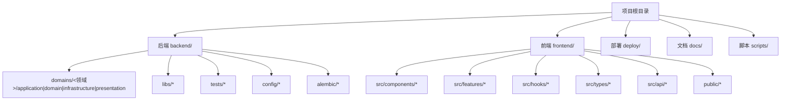
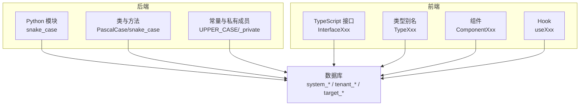
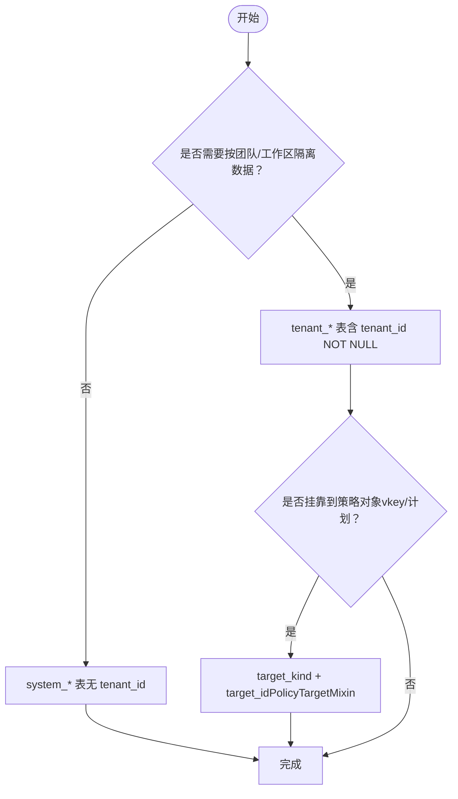
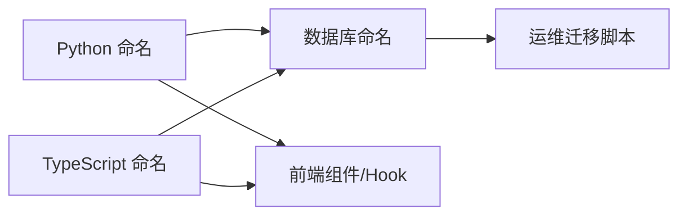

# 命名约定规范

<cite>
**本文引用的文件**
- [结构模板.md](file://.spec-workflow/templates/structure-template.md)
- [数据库参考.md](file://.agents/skills/database-schema/reference.md)
- [数据库技能.md](file://.agents/skills/database-schema/SKILL.md)
- [002 添加性能索引.py](file://backend/alembic/versions/002_add_performance_indexes.py)
- [20260602 删除所有数据库外键.py](file://backend/alembic/versions/20260602_drop_all_db_foreign_keys.py)
- [测试 conftest 分析.md](file://backend/tests/CONFTEST_ANALYSIS.md)
- [结构决策树:22-30](file://.agents/skills/database-schema/reference.md#L22-L30)
- [系统表示例:32-36](file://.agents/skills/database-schema/reference.md#L32-L36)
- [多租户表示例:37-41](file://.agents/skills/database-schema/reference.md#L37-L41)
- [特殊表说明:42-48](file://.agents/skills/database-schema/reference.md#L42-L48)
- [索引命名示例:20-47](file://backend/alembic/versions/002_add_performance_indexes.py#L20-L47)
- [外键移除迁移:22-24](file://backend/alembic/versions/20260602_drop_all_db_foreign_keys.py#L22-L24)
- [测试目录结构建议:63-82](file://backend/tests/CONFTEST_ANALYSIS.md#L63-L82)
</cite>

## 目录
1. [简介](#简介)
2. [项目结构](#项目结构)
3. [核心组件](#核心组件)
4. [架构总览](#架构总览)
5. [详细组件分析](#详细组件分析)
6. [依赖分析](#依赖分析)
7. [性能考虑](#性能考虑)
8. [故障排除指南](#故障排除指南)
9. [结论](#结论)
10. [附录](#附录)

## 简介
本规范旨在统一AI Agent项目的命名风格，覆盖Python模块与包、类、函数、变量、常量、私有成员，以及TypeScript接口、类型别名、组件与Hook的命名约定；同时明确文件与目录命名、测试文件命名、配置文件命名及资源组织方式；并给出数据库表名、字段名与索引的命名规范，以及跨语言一致性原则与代码重构时的迁移指南。

## 项目结构
- 目录组织遵循“按特性/领域分组”的原则，后端采用分层+领域混合的结构，前端采用按功能域分层的结构。
- 测试文件位于 backend/tests 下，按单元/集成/评估等层次划分，并在 tests 根目录放置全局 conftest.py。
- 配置文件采用 TOML/YAML/JSON 等格式，集中于 config/ 与各子目录中，便于环境区分与加载。

**章节来源**
- [.spec-workflow 结构模板:1-51](file://.spec-workflow/templates/structure-template.md#L1-L51)
- [测试目录结构建议:63-82](file://backend/tests/CONFTEST_ANALYSIS.md#L63-L82)

## 核心组件
- Python 标识符命名
  - 模块与包：snake_case（如 agent_service、gateway_api）
  - 类名：PascalCase（如 AgentService、GatewayClient）
  - 函数与方法：snake_case（如 create_session、process_message）
  - 变量：snake_case（如 session_id、message_text）
  - 常量：UPPER_CASE（如 MAX_RETRY、DEFAULT_TIMEOUT）
  - 私有成员：_private（如 _internal_cache、_validate_input）
- TypeScript 标识符命名
  - 接口：InterfaceXxx（如 InterfaceUser、InterfaceSession）
  - 类型别名：TypeXxx（如 TypeUserId、TypeMessageContent）
  - 组件：ComponentXxx（如 ComponentChatBox、ComponentModelSelector）
  - Hook：useXxx（如 useChat、useCopyToClipboard）
- 文件与目录命名
  - 模块/组件：snake_case（如 chat_service.ts、model_selector.ts）
  - 测试文件：以 _test 或 .test 结尾（如 chat_service.test.ts、chat_service_test.py）
  - 配置文件：小写短横线或下划线（如 app.toml、litellm_models.yaml）
  - 资源文件：按用途分目录（如 images/、assets/）

**章节来源**
- [.spec-workflow 结构模板:31-51](file://.spec-workflow/templates/structure-template.md#L31-L51)

## 架构总览
- 命名一致性贯穿前后端：后端服务接口与前端组件/Hook命名保持语义一致，避免同义不同名导致的沟通成本。
- 数据库层采用零外键策略，通过服务层与仓储层保证引用完整性，命名上强调清晰的表前缀与字段语义。

**章节来源**
- [.agents/skills/database-schema/SKILL.md:57-68](file://.agents/skills/database-schema/SKILL.md#L57-L68)
- [.agents/skills/database-schema/reference.md:22-48](file://.agents/skills/database-schema/reference.md#L22-L48)

## 详细组件分析

### Python 命名规范
- 模块与包：使用 snake_case，避免驼峰与短横线混用，保持与操作系统兼容。
- 类：PascalCase，体现领域概念（如 SessionManager、AgentExecutor）。
- 函数/方法：snake_case，动词短语表达意图（如 validate_token、process_batch）。
- 变量：snake_case，简洁明了（如 user_id、is_active）。
- 常量：UPPER_CASE，全局可见且不可变（如 DEFAULT_PAGE_SIZE、MAX_CONNECTIONS）。
- 私有成员：_private，内部实现细节不暴露给外部调用方。

**章节来源**
- [.spec-workflow 结构模板:39-44](file://.spec-workflow/templates/structure-template.md#L39-L44)

### TypeScript 命名规范
- 接口：InterfaceXxx，描述契约与数据结构（如 InterfaceUser、InterfaceChatMessage）。
- 类型别名：TypeXxx，封装复杂类型表达（如 TypeUserId、TypeMessagePayload）。
- 组件：ComponentXxx，React 组件首字母大写（如 ComponentChatInput、ComponentPagination）。
- Hook：useXxx，遵循 React Hooks 命名约定（如 useChat、useTheme）。

**章节来源**
- [.spec-workflow 结构模板:39-44](file://.spec-workflow/templates/structure-template.md#L39-L44)

### 文件与目录命名
- 模块/组件：snake_case（如 chat_service.ts、model_selector.ts）。
- 测试文件：以 _test 或 .test 结尾（如 chat_service.test.ts、chat_service_test.py）。
- 配置文件：小写短横线或下划线（如 app.toml、litellm_models.yaml）。
- 资源文件：images/、assets/ 等按用途分目录存放。

**章节来源**
- [.spec-workflow 结构模板:33-37](file://.spec-workflow/templates/structure-template.md#L33-L37)

### 数据库命名规范
- 表分类与前缀
  - system_*：系统级表，无 tenant_id（如 system_gateway_models、system_provider_credentials）。
  - tenant_*：多租户业务表，包含 tenant_id（如 gateway_models、sessions）。
  - target_*：策略目标表，额外包含 target_kind/target_id（如 policy_target_mixins）。
- 字段命名
  - 使用 snake_case，语义清晰（如 user_id、created_at、updated_at）。
  - 标准列：id、created_at、updated_at 等。
  - 多租户列：tenant_id（NOT NULL，带索引）。
- 索引命名
  - 复合索引：idx_<table>_<col1>[_<colN>]
  - 示例：idx_sessions_user_created、idx_messages_session_created、idx_memories_user_type
  - 部分索引：idx_<table>_active（仅索引活跃数据）
- 迁移文件命名
  - backend/alembic/versions/<YYYYMMDD>_<desc>.py
  - 对应 up/down SQL 文件 stem 必须一致

**图表来源**
- [.agents/skills/database-schema/reference.md:22-30](file://.agents/skills/database-schema/reference.md#L22-L30)

**章节来源**
- [.agents/skills/database-schema/reference.md:5-14](file://.agents/skills/database-schema/reference.md#L5-L14)
- [.agents/skills/database-schema/reference.md:32-48](file://.agents/skills/database-schema/reference.md#L32-L48)
- [索引命名示例:20-47](file://backend/alembic/versions/002_add_performance_indexes.py#L20-L47)

### 跨语言一致性原则
- 同一业务概念在前后端保持一致的语义命名（如会话 session 对应后端 sessions 表与前端 useChat Hook）。
- 接口与类型定义尽量复用，避免重复翻译造成歧义。
- 配置项命名前后端一致，减少映射成本。

**章节来源**
- [.spec-workflow 结构模板:39-44](file://.spec-workflow/templates/structure-template.md#L39-L44)

### 代码重构与命名迁移指南
- 渐进式迁移：先在新代码中应用新命名，再逐步替换旧代码。
- 批量重命名：使用 IDE/工具链进行安全重命名，配合静态检查与测试验证。
- 迁移清单
  - Python：模块/类/函数/变量/常量/私有成员逐项对照更新。
  - TypeScript：接口/类型别名/组件/Hook 逐项对照更新。
  - 数据库：表/字段/索引命名统一，迁移文件命名规范化。
- 回滚策略：保留历史分支与注释，确保可追溯性。

**章节来源**
- [.agents/skills/database-schema/reference.md:5-14](file://.agents/skills/database-schema/reference.md#L5-L14)

## 依赖分析
- 命名约定影响范围广泛：从模块导入到数据库迁移，再到前端组件与Hook，均需遵循统一风格。
- 建议在 CI 中加入命名检查（lint 规则），确保新增与修改代码符合规范。

**章节来源**
- [.agents/skills/database-schema/reference.md:5-14](file://.agents/skills/database-schema/reference.md#L5-L14)

## 性能考虑
- 索引命名与设计：遵循 idx_<table>_<cols> 的约定，确保查询性能与可维护性。
- 零外键策略：通过服务层与仓储层保证一致性，避免外键带来的写入性能与迁移复杂度。

**章节来源**
- [.agents/skills/database-schema/SKILL.md](file://.agents/skills/database-schema/SKILL.md#L68)
- [外键移除迁移:22-24](file://backend/alembic/versions/20260602_drop_all_db_foreign_keys.py#L22-L24)

## 故障排除指南
- 命名冲突
  - 现象：导入失败、IDE 报错、测试无法运行。
  - 处理：统一模块名与文件名，确保 snake_case 与 PascalCase 规则一致。
- 数据库迁移失败
  - 现象：版本号不连续、up/down 文件不匹配。
  - 处理：核对迁移文件命名与 stem 一致性，确保 revision 顺序正确。
- 前后端命名不一致
  - 现象：接口契约与实现名称不一致，导致联调困难。
  - 处理：建立命名对照表，强制在 PR 审查中检查。

**章节来源**
- [测试目录结构建议:63-82](file://backend/tests/CONFTEST_ANALYSIS.md#L63-L82)

## 结论
通过统一的命名约定，可以显著提升代码可读性、降低沟通成本、简化重构与迁移工作。建议在团队内推广并严格执行，结合 CI 检查与定期回顾，持续优化命名实践。

## 附录
- 示例与反例
  - Python：推荐 snake_case 模块名（如 agent_service），反例 camelCase（如 agentService）。
  - TypeScript：推荐 InterfaceUser、TypeUserId、ComponentChatBox、useChat，反例 iUser、IUser、UserInterface。
  - 数据库：推荐 idx_sessions_user_created，反例 session_user_created_idx。
- 最佳实践清单
  - 新增文件/模块先确定命名，再编写代码。
  - PR 审查中增加命名检查项。
  - 在文档中维护命名对照表与变更记录。