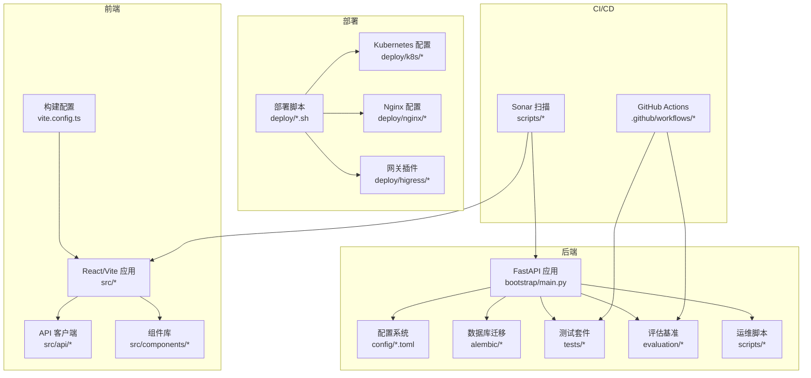
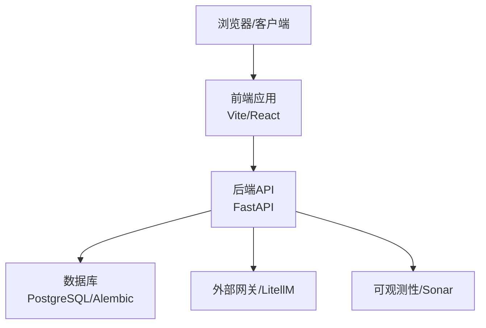
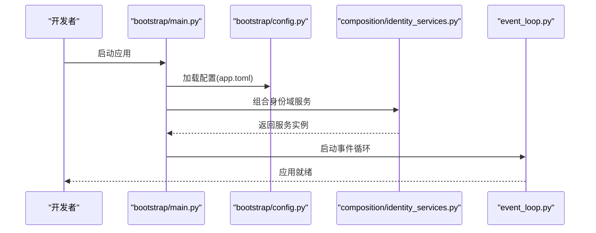
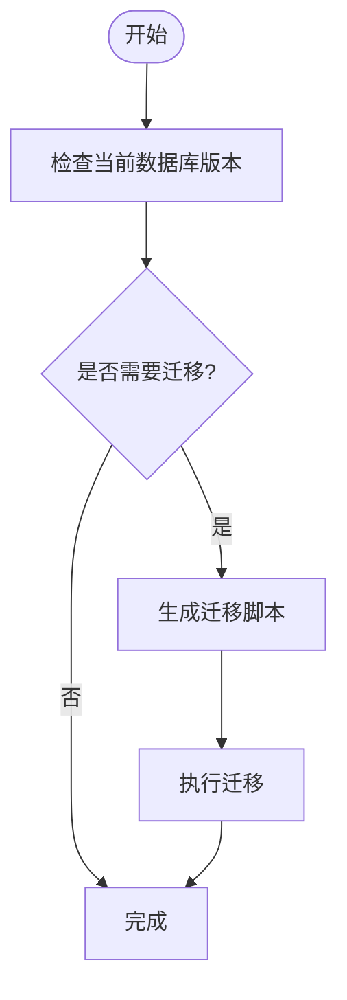
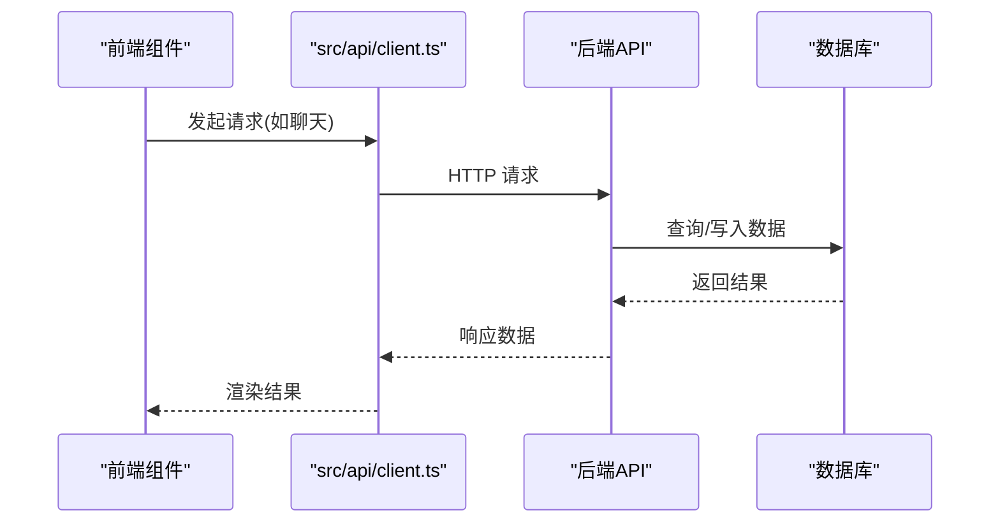
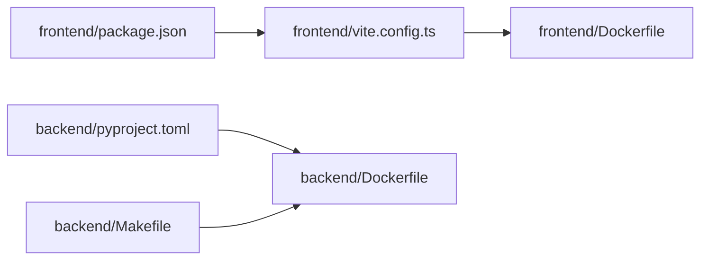
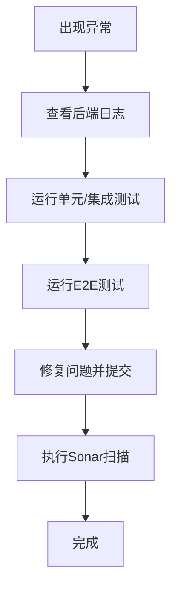
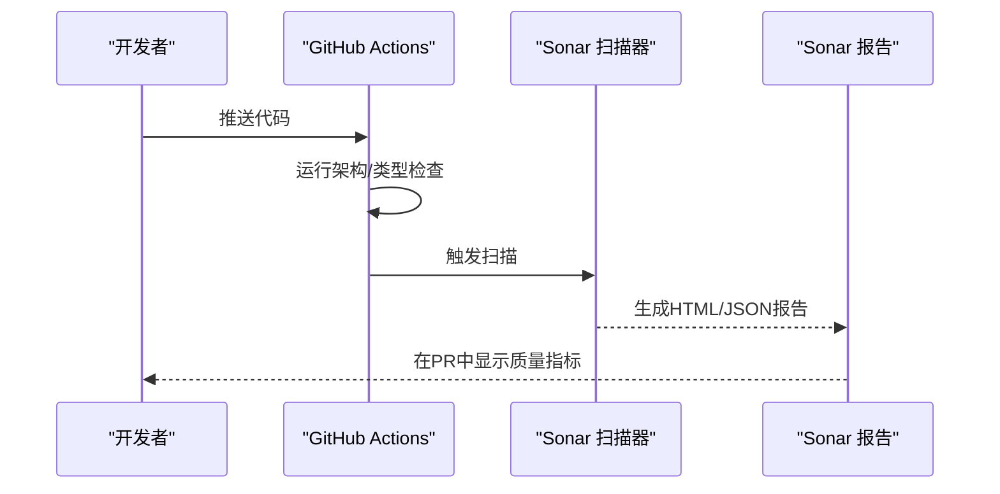

# 开发指南

<cite>
**本文引用的文件**
- [backend/docs/CODE_STANDARDS.md](file://backend/docs/CODE_STANDARDS.md)
- [frontend/docs/CODE_STANDARDS.md](file://frontend/docs/CODE_STANDARDS.md)
- [backend/docs/DEVELOPMENT.md](file://backend/docs/DEVELOPMENT.md)
- [frontend/docs/DEVELOPMENT.md](file://frontend/docs/DEVELOPMENT.md)
- [.github/workflows/backend-architecture.yml](file://.github/workflows/backend-architecture.yml)
- [.github/workflows/typecheck.yml](file://.github/workflows/typecheck.yml)
- [.github/workflows/sonar.yml](file://.github/workflows/sonar.yml)
- [.github/workflows/sonarcloud.yml](file://.github/workflows/sonarcloud.yml)
- [backend/pyproject.toml](file://backend/pyproject.toml)
- [backend/.pylintrc](file://backend/.pylintrc)
- [frontend/package.json](file://frontend/package.json)
- [frontend/eslint.config.js](file://frontend/eslint.config.js)
- [frontend/tailwind.config.js](file://frontend/tailwind.config.js)
- [frontend/tsconfig.json](file://frontend/tsconfig.json)
- [backend/Dockerfile](file://backend/Dockerfile)
- [frontend/Dockerfile](file://frontend/Dockerfile)
- [backend/Makefile](file://backend/Makefile)
- [frontend/vite.config.ts](file://frontend/vite.config.ts)
- [backend/scripts/run_dev_server.py](file://backend/scripts/run_dev_server.py)
- [backend/scripts/run_server.py](file://backend/scripts/run_server.py)
- [backend/alembic/script.py.mako](file://backend/alembic/script.py.mako)
- [backend/alembic/env.py](file://backend/alembic/env.py)
- [backend/alembic/versions/001_initial.py](file://backend/alembic/versions/001_initial.py)
- [backend/alembic/versions/...](file://backend/alembic/versions/... 1 files, 1 dirs not shown)
- [backend/config/app.toml](file://backend/config/app.toml)
- [backend/config/environments/local-dev.toml](file://backend/config/environments/local-dev.toml)
- [backend/config/environments/docker-dev.toml](file://backend/config/environments/docker-dev.toml)
- [backend/config/environments/python-dev.toml](file://backend/config/environments/python-dev.toml)
- [backend/config/mcp.toml](file://backend/config/mcp.toml)
- [backend/config/tools.toml](file://backend/config/tools.toml)
- [backend/bootstrap/main.py](file://backend/bootstrap/main.py)
- [backend/bootstrap/composition/identity_services.py](file://backend/bootstrap/composition/identity_services.py)
- [backend/bootstrap/config.py](file://backend/bootstrap/config.py)
- [backend/bootstrap/event_loop.py](file://backend/bootstrap/event_loop.py)
- [backend/domains/agent/application/agent_service.py](file://backend/domains/agent/application/agent_service.py)
- [backend/domains/gateway/application/gateway_service.py](file://backend/domains/gateway/application/gateway_service.py)
- [backend/libs/api/api_client.py](file://backend/libs/api/api_client.py)
- [backend/utils/logging.py](file://backend/utils/logging.py)
- [frontend/src/api/client.ts](file://frontend/src/api/client.ts)
- [frontend/src/components/chat/chat.tsx](file://frontend/src/components/chat/chat.tsx)
- [frontend/src/hooks/use-chat.ts](file://frontend/src/hooks/use-chat.ts)
- [frontend/src/stores/chat-store.ts](file://frontend/src/stores/chat-store.ts)
- [deploy/deploy.sh](file://deploy/deploy.sh)
- [deploy/remote-deploy.sh](file://deploy/remote-deploy.sh)
- [deploy/k8s/README.md](file://deploy/k8s/README.md)
- [deploy/nginx/README.md](file://deploy/nginx/README.md)
- [deploy/higress/README.md](file://deploy/higress/README.md)
- [docs/DEPLOYMENT.md](file://docs/DEPLOYMENT.md)
- [docs/SONARQUBE.md](file://docs/SONARQUBE.md)
- [docs/系统可测试性与TDD设计.md](file://docs/系统可测试性与TDD设计.md)
- [backend/tests/unit/agent/test_agent_service.py](file://backend/tests/unit/agent/test_agent_service.py)
- [backend/tests/integration/api/test_chat_api_integration.py](file://backend/tests/integration/api/test_chat_api_integration.py)
- [frontend/src/test/chat-component.test.tsx](file://frontend/src/test/chat-component.test.tsx)
- [backend/tests/e2e/test_chat_api_e2e.py](file://backend/tests/e2e/test_chat_api_e2e.py)
- [backend/tests/architecture/test_agent_no_gateway_domain_import.py](file://backend/tests/architecture/test_agent_no_gateway_domain_import.py)
- [backend/evaluation/benchmarks/agent_tasks.yaml](file://backend/evaluation/benchmarks/agent_tasks.yaml)
- [backend/evaluation/benchmarks/tool_accuracy_cases.yaml](file://backend/evaluation/benchmarks/tool_accuracy_cases.yaml)
- [backend/evaluation/performance.py](file://backend/evaluation/performance.py)
- [backend/evaluation/task_completion.py](file://backend/evaluation/task_completion.py)
- [backend/evaluation/tool_accuracy.py](file://backend/evaluation/tool_accuracy.py)
- [backend/evaluation/llm_judge.py](file://backend/evaluation/llm_judge.py)
- [backend/scripts/check_encoding_issues.py](file://backend/scripts/check_encoding_issues.py)
- [backend/scripts/fix_all_encoding_issues.py](file://backend/scripts/fix_all_encoding_issues.py)
- [backend/scripts/run_sonar_scanner.py](file://backend/scripts/run_sonar_scanner.py)
- [scripts/sonar-scan.sh](file://scripts/sonar-scan.sh)
- [scripts/sonarcloud-scan.sh](file://scripts/sonarcloud-scan.sh)
- [backend/sonar-project.properties](file://backend/sonar-project.properties)
- [frontend/sonar-project.properties](file://frontend/sonar-project.properties)
- [backend/sonar-project.properties](file://backend/sonar-project.properties)
- [frontend/sonar-project.properties](file://frontend/sonar-project.properties)
- [backend/.pre-commit-config.yaml](file://backend/.pre-commit-config.yaml)
- [frontend/.prettierrc](file://frontend/.prettierrc)
- [frontend/.editorconfig](file://frontend/.editorconfig)
- [backend/.gitignore](file://backend/.gitignore)
- [frontend/.gitignore](file://frontend/.gitignore)
- [backend/README.md](file://backend/README.md)
- [frontend/README.md](file://frontend/README.md)
- [docs/README.md](file://docs/README.md)
</cite>

## 目录
1. [简介](#简介)
2. [项目结构](#项目结构)
3. [核心组件](#核心组件)
4. [架构总览](#架构总览)
5. [详细组件分析](#详细组件分析)
6. [依赖关系分析](#依赖关系分析)
7. [性能考虑](#性能考虑)
8. [故障排查指南](#故障排查指南)
9. [结论](#结论)
10. [附录](#附录)

## 简介
本开发指南面向新加入的开发者，提供AI Agent项目的完整开发流程与规范说明。内容涵盖代码规范（Python、TypeScript、前端）、Git工作流与分支管理、代码审查标准、开发环境配置与工具使用、CI/CD配置与使用、新功能开发流程、常见问题与调试技巧、开发工具与脚手架使用、文档编写与维护要求等。旨在帮助团队统一开发标准，提升协作效率与代码质量。

## 项目结构
项目采用前后端分离架构，后端基于Python与FastAPI，前端基于TypeScript与React/Vite。根目录包含后端、前端、部署脚本、CI/CD配置、评估与测试、文档等模块。关键子目录与职责如下：
- backend：后端服务、数据库迁移、配置、测试、评估、脚本与工具
- frontend：前端应用、组件、API客户端、样式与构建配置
- deploy：Kubernetes、Nginx、Higress等部署脚本与配置
- .github/workflows：GitHub Actions流水线，覆盖架构检查、类型检查、Sonar扫描等
- docs：项目整体文档与部署、Sonar等说明
- scripts：Sonar扫描脚本与辅助工具

**图表来源**
- [backend/bootstrap/main.py](file://backend/bootstrap/main.py)
- [backend/config/app.toml](file://backend/config/app.toml)
- [backend/alembic/env.py](file://backend/alembic/env.py)
- [frontend/vite.config.ts](file://frontend/vite.config.ts)
- [deploy/deploy.sh](file://deploy/deploy.sh)
- [.github/workflows/backend-architecture.yml](file://.github/workflows/backend-architecture.yml)
- [scripts/sonar-scan.sh](file://scripts/sonar-scan.sh)

**章节来源**
- [backend/README.md](file://backend/README.md)
- [frontend/README.md](file://frontend/README.md)
- [docs/README.md](file://docs/README.md)

## 核心组件
本节概述后端与前端的核心组件及其职责，帮助新开发者快速定位代码位置与职责边界。

- 后端核心
  - 应用启动与依赖注入：bootstrap/main.py负责应用初始化与服务组合
  - 配置系统：config/*.toml提供多环境配置，支持本地、Docker、生产等
  - 数据库迁移：alembic/*管理数据库版本演进
  - 应用层服务：domains/*/application提供业务能力封装
  - API客户端：libs/api/*提供通用HTTP客户端能力
  - 日志与可观测性：utils/logging.py提供日志配置与工具

- 前端核心
  - 应用入口与路由：src/main.tsx、src/App.tsx
  - API客户端：src/api/client.ts封装请求与响应处理
  - 组件与Hooks：src/components/*、src/hooks/*
  - 状态管理：src/stores/*
  - 构建与开发服务器：vite.config.ts、package.json脚本

**章节来源**
- [backend/bootstrap/main.py](file://backend/bootstrap/main.py)
- [backend/config/app.toml](file://backend/config/app.toml)
- [backend/alembic/env.py](file://backend/alembic/env.py)
- [backend/libs/api/api_client.py](file://backend/libs/api/api_client.py)
- [backend/utils/logging.py](file://backend/utils/logging.py)
- [frontend/src/api/client.ts](file://frontend/src/api/client.ts)
- [frontend/src/components/chat/chat.tsx](file://frontend/src/components/chat/chat.tsx)
- [frontend/src/hooks/use-chat.ts](file://frontend/src/hooks/use-chat.ts)
- [frontend/src/stores/chat-store.ts](file://frontend/src/stores/chat-store.ts)
- [frontend/vite.config.ts](file://frontend/vite.config.ts)

## 架构总览
下图展示后端与前端在典型运行时的交互关系，以及与数据库、外部服务、网关与监控系统的连接。

**图表来源**
- [backend/bootstrap/main.py](file://backend/bootstrap/main.py)
- [frontend/src/api/client.ts](file://frontend/src/api/client.ts)
- [backend/alembic/env.py](file://backend/alembic/env.py)
- [backend/config/litellm_models.yaml](file://backend/config/litellm_models.yaml)
- [scripts/sonar-scan.sh](file://scripts/sonar-scan.sh)

**章节来源**
- [backend/docs/ARCHITECTURE.md](file://backend/docs/ARCHITECTURE.md)
- [docs/DEPLOYMENT.md](file://docs/DEPLOYMENT.md)

## 详细组件分析

### 后端应用启动与依赖注入
- 职责：加载配置、注册服务、建立依赖注入容器、启动事件循环
- 关键点：通过bootstrap/composition/identity_services.py组合身份域服务；bootstrap/config.py提供配置装载；bootstrap/event_loop.py驱动异步事件
- 入口：bootstrap/main.py

**图表来源**
- [backend/bootstrap/main.py](file://backend/bootstrap/main.py)
- [backend/bootstrap/config.py](file://backend/bootstrap/config.py)
- [backend/bootstrap/composition/identity_services.py](file://backend/bootstrap/composition/identity_services.py)
- [backend/bootstrap/event_loop.py](file://backend/bootstrap/event_loop.py)

**章节来源**
- [backend/bootstrap/main.py](file://backend/bootstrap/main.py)
- [backend/bootstrap/config.py](file://backend/bootstrap/config.py)
- [backend/bootstrap/composition/identity_services.py](file://backend/bootstrap/composition/identity_services.py)
- [backend/bootstrap/event_loop.py](file://backend/bootstrap/event_loop.py)

### 数据库迁移与版本控制
- 职责：管理数据库模式演进，确保团队间一致的数据库状态
- 关键点：alembic/script.py.mako模板化迁移脚本；env.py配置迁移上下文；versions/*按版本号存放具体迁移
- 示例：001_initial.py创建基础表结构

**图表来源**
- [backend/alembic/script.py.mako](file://backend/alembic/script.py.mako)
- [backend/alembic/env.py](file://backend/alembic/env.py)
- [backend/alembic/versions/001_initial.py](file://backend/alembic/versions/001_initial.py)

**章节来源**
- [backend/alembic/env.py](file://backend/alembic/env.py)
- [backend/alembic/script.py.mako](file://backend/alembic/script.py.mako)
- [backend/alembic/versions/001_initial.py](file://backend/alembic/versions/001_initial.py)

### 配置系统与多环境管理
- 职责：集中管理应用配置，支持本地开发、Docker、生产等多环境
- 关键点：app.toml为主配置；environments/*按环境拆分；支持MCP与工具配置
- 使用建议：新增配置项优先在对应环境文件中定义，避免硬编码

**章节来源**
- [backend/config/app.toml](file://backend/config/app.toml)
- [backend/config/environments/local-dev.toml](file://backend/config/environments/local-dev.toml)
- [backend/config/environments/docker-dev.toml](file://backend/config/environments/docker-dev.toml)
- [backend/config/environments/python-dev.toml](file://backend/config/environments/python-dev.toml)
- [backend/config/mcp.toml](file://backend/config/mcp.toml)
- [backend/config/tools.toml](file://backend/config/tools.toml)

### API客户端与前端通信
- 后端API客户端：libs/api/api_client.py提供统一的HTTP客户端能力
- 前端API客户端：src/api/client.ts封装请求、错误处理与路径常量
- 建议：前后端保持接口契约稳定，变更需同步更新

**图表来源**
- [frontend/src/api/client.ts](file://frontend/src/api/client.ts)
- [backend/libs/api/api_client.py](file://backend/libs/api/api_client.py)

**章节来源**
- [frontend/src/api/client.ts](file://frontend/src/api/client.ts)
- [backend/libs/api/api_client.py](file://backend/libs/api/api_client.py)

### 日志与可观测性
- 后端：utils/logging.py提供日志配置与工具函数
- 前端：可通过浏览器控制台与网络面板进行调试
- CI/CD：结合Sonar扫描与报告，持续监控代码质量

**章节来源**
- [backend/utils/logging.py](file://backend/utils/logging.py)
- [scripts/sonar-scan.sh](file://scripts/sonar-scan.sh)

## 依赖关系分析
- 后端依赖：FastAPI、Alembic、Pydantic、SQLAlchemy等
- 前端依赖：React、Vite、TailwindCSS、ESLint/Prettier等
- 构建与打包：后端使用Makefile与Dockerfile；前端使用Vite与Dockerfile
- 测试与评估：pytest、vitest、自研评估基准

**图表来源**
- [backend/pyproject.toml](file://backend/pyproject.toml)
- [frontend/package.json](file://frontend/package.json)
- [frontend/vite.config.ts](file://frontend/vite.config.ts)
- [backend/Dockerfile](file://backend/Dockerfile)
- [frontend/Dockerfile](file://frontend/Dockerfile)
- [backend/Makefile](file://backend/Makefile)

**章节来源**
- [backend/pyproject.toml](file://backend/pyproject.toml)
- [frontend/package.json](file://frontend/package.json)
- [frontend/vite.config.ts](file://frontend/vite.config.ts)
- [backend/Makefile](file://backend/Makefile)

## 性能考虑
- 后端
  - 数据库索引与查询优化：参考alembic/sql中的索引与SQL优化脚本
  - 异步任务与事件循环：合理使用事件循环与后台任务
  - 缓存与序列化：utils/cache.py与serialization.py提供缓存与序列化工具
- 前端
  - 组件懒加载与状态管理：减少不必要的重渲染
  - 构建优化：Vite配置与Tailwind按需引入
- 评估与监控
  - 性能评估：evaluation/performance.py、task_completion.py、tool_accuracy.py
  - Sonar质量度量：持续扫描与报告

**章节来源**
- [backend/alembic/sql/README.md](file://backend/alembic/sql/README.md)
- [backend/utils/cache.py](file://backend/utils/cache.py)
- [backend/utils/serialization.py](file://backend/utils/serialization.py)
- [frontend/tailwind.config.js](file://frontend/tailwind.config.js)
- [backend/evaluation/performance.py](file://backend/evaluation/performance.py)
- [backend/evaluation/task_completion.py](file://backend/evaluation/task_completion.py)
- [backend/evaluation/tool_accuracy.py](file://backend/evaluation/tool_accuracy.py)
- [scripts/sonar-scan.sh](file://scripts/sonar-scan.sh)

## 故障排查指南
- 常见问题
  - 编码问题：使用scripts/check_encoding_issues.py与fix_all_encoding_issues.py修复
  - Sonar扫描失败：检查sonar-project.properties与扫描脚本
  - 网关模型探测：scripts/probe_dashscope_embedding.py用于探测可用模型
- 调试技巧
  - 后端：查看日志输出，使用run_dev_server.py与run_server.py启动服务
  - 前端：利用浏览器开发者工具与组件测试
  - 集成测试：integration/api/*验证端到端流程
  - E2E测试：tests/e2e/*覆盖关键用户旅程

**图表来源**
- [backend/scripts/check_encoding_issues.py](file://backend/scripts/check_encoding_issues.py)
- [backend/scripts/fix_all_encoding_issues.py](file://backend/scripts/fix_all_encoding_issues.py)
- [backend/scripts/run_sonar_scanner.py](file://backend/scripts/run_sonar_scanner.py)
- [backend/scripts/probe_dashscope_embedding.py](file://backend/scripts/probe_dashscope_embedding.py)
- [backend/scripts/run_dev_server.py](file://backend/scripts/run_dev_server.py)
- [backend/scripts/run_server.py](file://backend/scripts/run_server.py)

**章节来源**
- [backend/scripts/check_encoding_issues.py](file://backend/scripts/check_encoding_issues.py)
- [backend/scripts/fix_all_encoding_issues.py](file://backend/scripts/fix_all_encoding_issues.py)
- [backend/scripts/run_sonar_scanner.py](file://backend/scripts/run_sonar_scanner.py)
- [backend/scripts/probe_dashscope_embedding.py](file://backend/scripts/probe_dashscope_embedding.py)
- [backend/scripts/run_dev_server.py](file://backend/scripts/run_dev_server.py)
- [backend/scripts/run_server.py](file://backend/scripts/run_server.py)
- [backend/tests/e2e/test_chat_api_e2e.py](file://backend/tests/e2e/test_chat_api_e2e.py)
- [backend/tests/integration/api/test_chat_api_integration.py](file://backend/tests/integration/api/test_chat_api_integration.py)
- [frontend/src/test/chat-component.test.tsx](file://frontend/src/test/chat-component.test.tsx)

## 结论
本指南提供了从代码规范、Git工作流、代码审查、开发环境配置、CI/CD到新功能开发流程的完整说明。建议新开发者先通读“开发规范”与“开发流程”，再结合“故障排查指南”与“附录”中的工具与脚本，快速上手项目开发。

## 附录

### A. 代码规范与最佳实践
- Python代码规范
  - 风格与静态检查：pyproject.toml与.pylintrc定义风格与规则
  - 文档与注释：遵循backend/docs/CODE_STANDARDS.md
- TypeScript与前端开发规范
  - ESLint与Prettier：eslint.config.js与.prettierrc
  - TailwindCSS：tailwind.config.js按需配置
  - 组件与Hook：遵循frontend/docs/CODE_STANDARDS.md
- Git工作流与分支管理
  - 分支命名：feature/*、bugfix/*、hotfix/*、release/*
  - 提交规范：Conventional Commits风格
  - 合并流程：Pull Request + 代码审查 + 自动化检查
- 代码审查标准
  - 功能正确性、可读性、性能、安全性、测试覆盖率
  - 参考architecture测试与单元测试样例

**章节来源**
- [backend/docs/CODE_STANDARDS.md](file://backend/docs/CODE_STANDARDS.md)
- [frontend/docs/CODE_STANDARDS.md](file://frontend/docs/CODE_STANDARDS.md)
- [backend/pyproject.toml](file://backend/pyproject.toml)
- [backend/.pylintrc](file://backend/.pylintrc)
- [frontend/eslint.config.js](file://frontend/eslint.config.js)
- [frontend/.prettierrc](file://frontend/.prettierrc)
- [frontend/tailwind.config.js](file://frontend/tailwind.config.js)

### B. 开发环境配置与工具使用
- IDE设置
  - Python：VS Code + Pylance/Pylint；启用格式化与导入排序
  - TypeScript：VS Code + ESLint/Prettier；启用自动修复
- 调试技巧
  - 后端：run_dev_server.py与run_server.py；日志级别调整
  - 前端：Vite开发服务器；组件测试与快照
- 性能分析
  - 后端：数据库慢查询与索引分析
  - 前端：Vite构建分析与浏览器性能面板

**章节来源**
- [backend/scripts/run_dev_server.py](file://backend/scripts/run_dev_server.py)
- [backend/scripts/run_server.py](file://backend/scripts/run_server.py)
- [frontend/vite.config.ts](file://frontend/vite.config.ts)

### C. CI/CD配置与使用
- GitHub Actions
  - backend-architecture.yml：架构约束检查
  - typecheck.yml：类型检查
  - sonar.yml与sonarcloud.yml：Sonar扫描
- Sonar配置
  - backend/sonar-project.properties与frontend/sonar-project.properties
  - scripts/sonar-scan.sh与scripts/sonarcloud-scan.sh

**图表来源**
- [.github/workflows/backend-architecture.yml](file://.github/workflows/backend-architecture.yml)
- [.github/workflows/typecheck.yml](file://.github/workflows/typecheck.yml)
- [.github/workflows/sonar.yml](file://.github/workflows/sonar.yml)
- [.github/workflows/sonarcloud.yml](file://.github/workflows/sonarcloud.yml)
- [backend/sonar-project.properties](file://backend/sonar-project.properties)
- [frontend/sonar-project.properties](file://frontend/sonar-project.properties)
- [scripts/sonar-scan.sh](file://scripts/sonar-scan.sh)
- [scripts/sonarcloud-scan.sh](file://scripts/sonarcloud-scan.sh)

**章节来源**
- [.github/workflows/backend-architecture.yml](file://.github/workflows/backend-architecture.yml)
- [.github/workflows/typecheck.yml](file://.github/workflows/typecheck.yml)
- [.github/workflows/sonar.yml](file://.github/workflows/sonar.yml)
- [.github/workflows/sonarcloud.yml](file://.github/workflows/sonarcloud.yml)
- [backend/sonar-project.properties](file://backend/sonar-project.properties)
- [frontend/sonar-project.properties](file://frontend/sonar-project.properties)
- [scripts/sonar-scan.sh](file://scripts/sonar-scan.sh)
- [scripts/sonarcloud-scan.sh](file://scripts/sonarcloud-scan.sh)

### D. 新功能开发流程
- 需求分析：参考docs/AI-Agent开发需求文档.md
- 设计评审：遵循领域驱动设计与模块边界
- 实现规范：遵循代码规范与测试要求
- 验收与评估：使用evaluation基准与E2E测试

**章节来源**
- [docs/AI-Agent开发需求文档.md](file://docs/AI-Agent开发需求文档.md)
- [docs/系统可测试性与TDD设计.md](file://docs/系统可测试性与TDD设计.md)
- [backend/evaluation/benchmarks/agent_tasks.yaml](file://backend/evaluation/benchmarks/agent_tasks.yaml)
- [backend/evaluation/benchmarks/tool_accuracy_cases.yaml](file://backend/evaluation/benchmarks/tool_accuracy_cases.yaml)

### E. 开发工具与脚手架使用
- 后端
  - Makefile：常用命令封装
  - Dockerfile：容器化打包
  - Alembic：数据库迁移
- 前端
  - Vite：开发与构建
  - Dockerfile：容器化打包
- 部署
  - deploy/*.sh：一键部署脚本
  - deploy/k8s/*、deploy/nginx/*、deploy/higress/*：多环境部署配置

**章节来源**
- [backend/Makefile](file://backend/Makefile)
- [backend/Dockerfile](file://backend/Dockerfile)
- [frontend/Dockerfile](file://frontend/Dockerfile)
- [deploy/deploy.sh](file://deploy/deploy.sh)
- [deploy/remote-deploy.sh](file://deploy/remote-deploy.sh)
- [deploy/k8s/README.md](file://deploy/k8s/README.md)
- [deploy/nginx/README.md](file://deploy/nginx/README.md)
- [deploy/higress/README.md](file://deploy/higress/README.md)

### F. 文档编写与维护要求
- 文档分类：技术文档、部署文档、Sonar说明、开发规范
- 维护策略：随代码变更同步更新，保持一致性
- 参考：docs/README.md、docs/DEPLOYMENT.md、docs/SONARQUBE.md

**章节来源**
- [docs/README.md](file://docs/README.md)
- [docs/DEPLOYMENT.md](file://docs/DEPLOYMENT.md)
- [docs/SONARQUBE.md](file://docs/SONARQUBE.md)