# CI/CD流水线

<cite>
**本文档引用的文件**
- [.github/workflows/backend-architecture.yml](file://.github/workflows/backend-architecture.yml)
- [.github/workflows/sonar.yml](file://.github/workflows/sonar.yml)
- [.github/workflows/sonarcloud.yml](file://.github/workflows/sonarcloud.yml)
- [.github/workflows/typecheck.yml](file://.github/workflows/typecheck.yml)
- [backend/Dockerfile](file://backend/Dockerfile)
- [frontend/Dockerfile](file://frontend/Dockerfile)
- [backend/pyproject.toml](file://backend/pyproject.toml)
- [frontend/package.json](file://frontend/package.json)
- [deploy/deploy.sh](file://deploy/deploy.sh)
- [scripts/run-e2e.ps1](file://scripts/run-e2e.ps1)
- [scripts/sonar-scan.sh](file://scripts/sonar-scan.sh)
- [Makefile](file://Makefile)
- [backend/sonar-project.properties](file://backend/sonar-project.properties)
- [frontend/sonar-project.properties](file://frontend/sonar-project.properties)
- [backend/config/environments/local-dev.toml](file://backend/config/environments/local-dev.toml)
- [backend/config/app.toml](file://backend/config/app.toml)
- [docker-compose.prod.yml](file://docker-compose.prod.yml)
</cite>

## 目录
1. [简介](#简介)
2. [项目结构](#项目结构)
3. [核心组件](#核心组件)
4. [架构总览](#架构总览)
5. [详细组件分析](#详细组件分析)
6. [依赖关系分析](#依赖关系分析)
7. [性能考虑](#性能考虑)
8. [故障排除指南](#故障排除指南)
9. [结论](#结论)
10. [附录](#附录)

## 简介
本指南面向AI Agent项目的持续集成与持续部署（CI/CD），围绕以下主题展开：
- GitHub Actions工作流配置与执行：构建、测试、代码质量检查与质量门禁
- SonarQube/SonarCloud扫描配置与报告解读
- Docker镜像构建与多阶段构建策略
- 环境变量与密钥管理的安全实践
- 自动化测试策略：单元测试、集成测试、端到端测试
- 部署脚本使用与自定义选项
- 故障排除与回滚策略
- 流水线执行状态与性能监控

## 项目结构
本项目采用前后端分离的Monorepo结构，并通过GitHub Actions与Docker Compose实现CI/CD与部署。

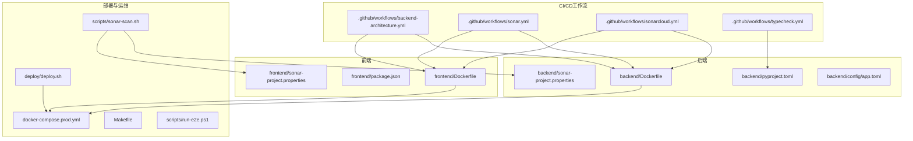

**图表来源**
- [.github/workflows/backend-architecture.yml:1-47](file://.github/workflows/backend-architecture.yml#L1-L47)
- [.github/workflows/sonar.yml:1-135](file://.github/workflows/sonar.yml#L1-L135)
- [.github/workflows/sonarcloud.yml:1-176](file://.github/workflows/sonarcloud.yml#L1-L176)
- [.github/workflows/typecheck.yml:1-41](file://.github/workflows/typecheck.yml#L1-L41)
- [backend/Dockerfile:1-33](file://backend/Dockerfile#L1-L33)
- [frontend/Dockerfile:1-57](file://frontend/Dockerfile#L1-L57)
- [backend/pyproject.toml:1-351](file://backend/pyproject.toml#L1-L351)
- [frontend/package.json:1-104](file://frontend/package.json#L1-L104)
- [deploy/deploy.sh:1-260](file://deploy/deploy.sh#L1-L260)
- [docker-compose.prod.yml:1-136](file://docker-compose.prod.yml#L1-L136)
- [scripts/sonar-scan.sh:1-152](file://scripts/sonar-scan.sh#L1-L152)
- [scripts/run-e2e.ps1:1-87](file://scripts/run-e2e.ps1#L1-L87)

**章节来源**
- [.github/workflows/backend-architecture.yml:1-47](file://.github/workflows/backend-architecture.yml#L1-L47)
- [.github/workflows/sonar.yml:1-135](file://.github/workflows/sonar.yml#L1-L135)
- [.github/workflows/sonarcloud.yml:1-176](file://.github/workflows/sonarcloud.yml#L1-L176)
- [.github/workflows/typecheck.yml:1-41](file://.github/workflows/typecheck.yml#L1-L41)
- [backend/Dockerfile:1-33](file://backend/Dockerfile#L1-L33)
- [frontend/Dockerfile:1-57](file://frontend/Dockerfile#L1-L57)
- [backend/pyproject.toml:1-351](file://backend/pyproject.toml#L1-L351)
- [frontend/package.json:1-104](file://frontend/package.json#L1-L104)
- [deploy/deploy.sh:1-260](file://deploy/deploy.sh#L1-L260)
- [docker-compose.prod.yml:1-136](file://docker-compose.prod.yml#L1-L136)
- [scripts/sonar-scan.sh:1-152](file://scripts/sonar-scan.sh#L1-L152)
- [scripts/run-e2e.ps1:1-87](file://scripts/run-e2e.ps1#L1-L87)

## 核心组件
- GitHub Actions工作流：负责架构守门、类型检查、SonarQube/SonarCloud扫描与质量门禁
- Docker镜像：后端多阶段构建，前端多阶段构建并使用Nginx提供静态资源
- 配置与环境：pyproject.toml与package.json定义测试、类型检查与覆盖率；app.toml集中管理敏感配置
- 部署脚本：一键部署脚本与Makefile命令，支持快速部署、重启、状态查看与日志查看
- 本地扫描脚本：支持本地SonarQube扫描与报告生成

**章节来源**
- [.github/workflows/backend-architecture.yml:15-47](file://.github/workflows/backend-architecture.yml#L15-L47)
- [.github/workflows/sonar.yml:20-135](file://.github/workflows/sonar.yml#L20-L135)
- [.github/workflows/sonarcloud.yml:21-176](file://.github/workflows/sonarcloud.yml#L21-L176)
- [.github/workflows/typecheck.yml:15-41](file://.github/workflows/typecheck.yml#L15-L41)
- [backend/Dockerfile:1-33](file://backend/Dockerfile#L1-L33)
- [frontend/Dockerfile:1-57](file://frontend/Dockerfile#L1-L57)
- [backend/pyproject.toml:124-351](file://backend/pyproject.toml#L124-L351)
- [frontend/package.json:1-104](file://frontend/package.json#L1-L104)
- [deploy/deploy.sh:1-260](file://deploy/deploy.sh#L1-L260)
- [Makefile:1-294](file://Makefile#L1-L294)
- [scripts/sonar-scan.sh:1-152](file://scripts/sonar-scan.sh#L1-L152)

## 架构总览
CI/CD流水线由多个独立但协同的工作流组成，覆盖后端与前端的构建、测试、代码质量与部署。

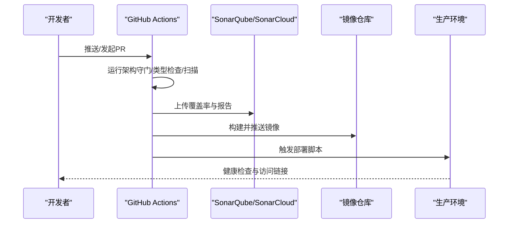

**图表来源**
- [.github/workflows/backend-architecture.yml:14-47](file://.github/workflows/backend-architecture.yml#L14-L47)
- [.github/workflows/sonar.yml:20-135](file://.github/workflows/sonar.yml#L20-L135)
- [.github/workflows/sonarcloud.yml:21-176](file://.github/workflows/sonarcloud.yml#L21-L176)
- [.github/workflows/typecheck.yml:9-41](file://.github/workflows/typecheck.yml#L9-L41)
- [deploy/deploy.sh:217-260](file://deploy/deploy.sh#L217-L260)
- [docker-compose.prod.yml:65-124](file://docker-compose.prod.yml#L65-L124)

## 详细组件分析

### GitHub Actions工作流

#### 架构守门（Backend Architecture）
- 触发条件：针对backend目录与工作流文件的推送与PR
- 步骤：安装uv、Python 3.11、同步依赖，执行架构守门测试集
- 目标：防止反向域依赖与架构违规

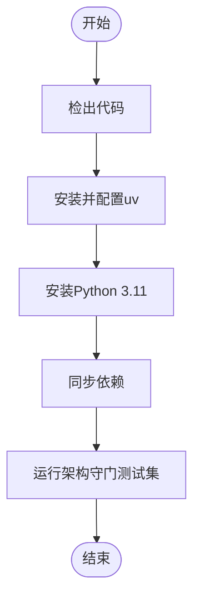

**图表来源**
- [.github/workflows/backend-architecture.yml:22-46](file://.github/workflows/backend-architecture.yml#L22-L46)

**章节来源**
- [.github/workflows/backend-architecture.yml:1-47](file://.github/workflows/backend-architecture.yml#L1-L47)

#### SonarQube扫描（跨平台）
- 后端：Python 3.11、安装依赖、pytest覆盖率与Junit报告、pyright类型检查、SonarQube扫描
- 前端：Node.js 20、npm ci、Vitest覆盖率、ESLint报告、SonarQube扫描
- 质量门禁：分别检查后端与前端的质量门禁结果

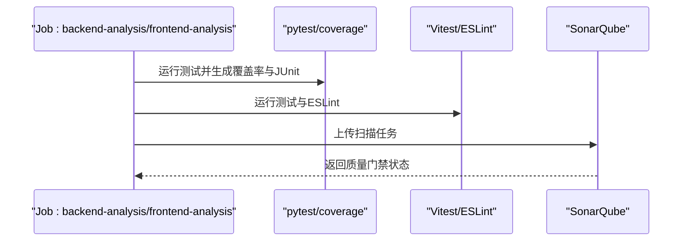

**图表来源**
- [.github/workflows/sonar.yml:24-135](file://.github/workflows/sonar.yml#L24-L135)

**章节来源**
- [.github/workflows/sonar.yml:1-135](file://.github/workflows/sonar.yml#L1-L135)

#### SonarCloud扫描（Monorepo）
- 后端：Python 3.11、安装依赖、pytest覆盖率、SonarCloud扫描（带组织与项目键）
- 前端：Node.js 20、npm ci、Vitest覆盖率、ESLint、SonarCloud扫描
- 全项目：在特定分支上对整个仓库进行扫描，指定sources/tests与覆盖率路径

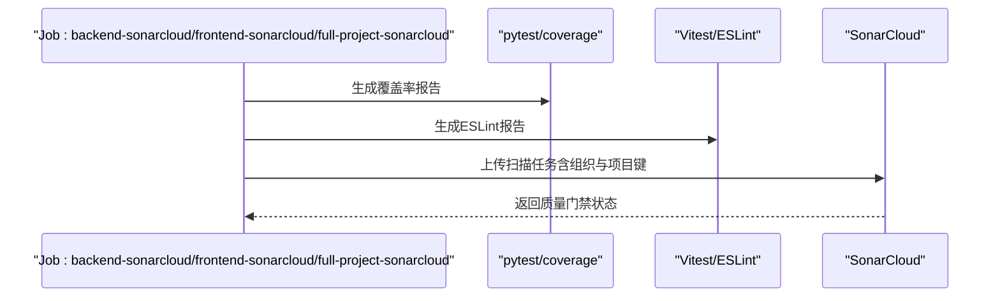

**图表来源**
- [.github/workflows/sonarcloud.yml:25-176](file://.github/workflows/sonarcloud.yml#L25-L176)

**章节来源**
- [.github/workflows/sonarcloud.yml:1-176](file://.github/workflows/sonarcloud.yml#L1-L176)

#### 类型检查（Pyright）
- 使用uv安装Python 3.11与依赖，运行Pyright进行严格类型检查

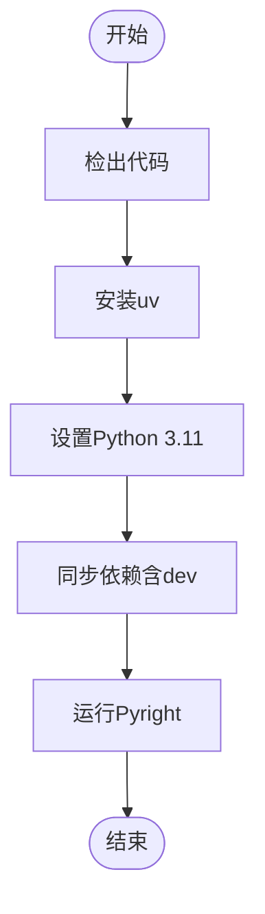

**图表来源**
- [.github/workflows/typecheck.yml:24-41](file://.github/workflows/typecheck.yml#L24-L41)

**章节来源**
- [.github/workflows/typecheck.yml:1-41](file://.github/workflows/typecheck.yml#L1-L41)

### Docker镜像构建与多阶段构建

#### 后端镜像（多阶段）
- 依赖层：使用预构建的依赖镜像，避免重复安装
- 生产层：基于运行时镜像，设置APT镜像、非缓冲IO、用户切换、暴露端口与命令

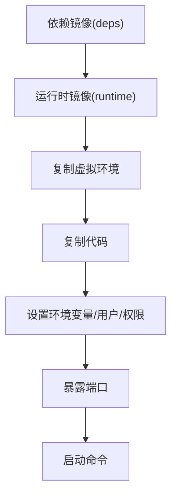

**图表来源**
- [backend/Dockerfile:1-33](file://backend/Dockerfile#L1-L33)

**章节来源**
- [backend/Dockerfile:1-33](file://backend/Dockerfile#L1-L33)

#### 前端镜像（多阶段）
- 依赖层：仅在package.json变化时重建，使用npm缓存挂载
- 开发层：直接运行开发服务器
- 构建层：编译产物，支持构建参数（根路径、认证模式、SSO登录URL）
- 生产层：Nginx提供静态资源

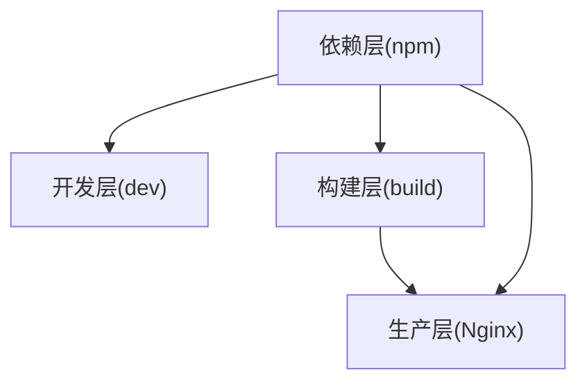

**图表来源**
- [frontend/Dockerfile:10-57](file://frontend/Dockerfile#L10-L57)

**章节来源**
- [frontend/Dockerfile:1-57](file://frontend/Dockerfile#L1-L57)

### 环境变量与密钥管理
- GitHub Actions：通过Secrets注入SONAR_HOST_URL、SONAR_TOKEN、GITHUB_TOKEN
- 本地开发：app.toml集中管理数据库、Redis、向量库、LLM提供商等敏感配置，通过.env加载到环境变量
- 生产部署：docker-compose.prod.yml通过.env.production与backend/.env注入环境变量

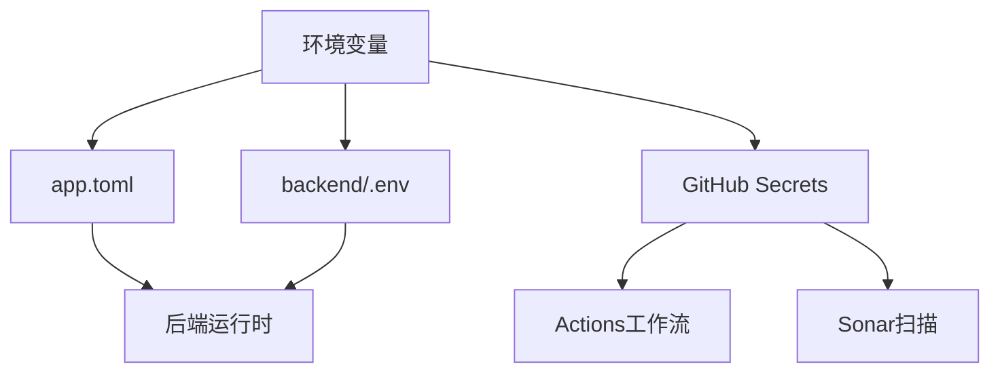

**图表来源**
- [backend/config/app.toml:17-179](file://backend/config/app.toml#L17-L179)
- [backend/config/environments/local-dev.toml:1-46](file://backend/config/environments/local-dev.toml#L1-L46)
- [.github/workflows/sonar.yml:62-64](file://.github/workflows/sonar.yml#L62-L64)
- [docker-compose.prod.yml:77-78](file://docker-compose.prod.yml#L77-L78)

**章节来源**
- [backend/config/app.toml:1-179](file://backend/config/app.toml#L1-L179)
- [backend/config/environments/local-dev.toml:1-46](file://backend/config/environments/local-dev.toml#L1-L46)
- [.github/workflows/sonar.yml:62-64](file://.github/workflows/sonar.yml#L62-L64)
- [docker-compose.prod.yml:77-78](file://docker-compose.prod.yml#L77-L78)

### 自动化测试策略
- 后端：pytest配置、覆盖率阈值、标记（unit/integration/e2e/slow/architecture）、过滤警告
- 前端：Vitest覆盖率、ESLint、格式化检查
- E2E：PowerShell脚本本地启动基础设施与后端，执行pytest e2e测试

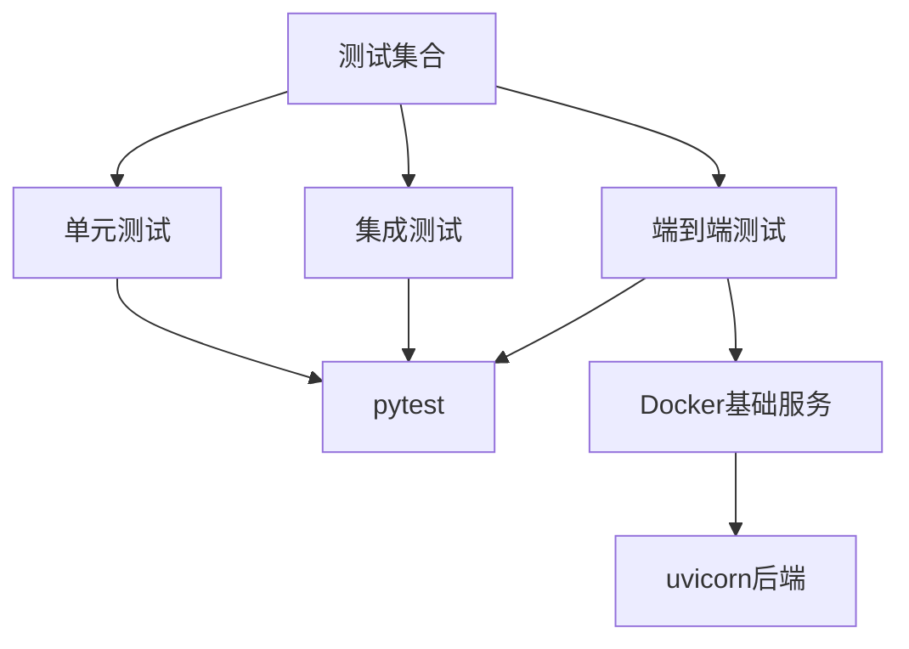

**图表来源**
- [backend/pyproject.toml:264-297](file://backend/pyproject.toml#L264-L297)
- [frontend/package.json:17-23](file://frontend/package.json#L17-L23)
- [scripts/run-e2e.ps1:24-87](file://scripts/run-e2e.ps1#L24-L87)

**章节来源**
- [backend/pyproject.toml:264-297](file://backend/pyproject.toml#L264-L297)
- [frontend/package.json:17-23](file://frontend/package.json#L17-L23)
- [scripts/run-e2e.ps1:1-87](file://scripts/run-e2e.ps1#L1-L87)

### 部署脚本使用指南
- 一键部署：检查前置条件、启动基础设施、构建镜像、运行迁移、启动应用、打印访问链接
- 快速部署：跳过构建，仅重启应用
- 仅重启/状态/日志/停止：便捷运维
- 构建基础镜像：后端基础镜像（python+uv+git）

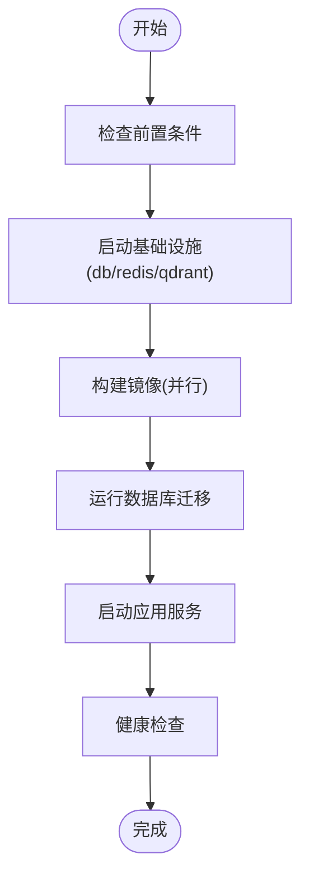

**图表来源**
- [deploy/deploy.sh:217-260](file://deploy/deploy.sh#L217-L260)

**章节来源**
- [deploy/deploy.sh:1-260](file://deploy/deploy.sh#L1-L260)
- [docker-compose.prod.yml:1-136](file://docker-compose.prod.yml#L1-L136)
- [Makefile:265-294](file://Makefile#L265-L294)

### SonarQube/SonarCloud配置与报告解读
- 后端：sonar-project.properties定义项目键、源码与测试目录、Python版本、排除项、覆盖率与JUnit报告路径
- 前端：sonar-project.properties定义TypeScript配置、排除项、覆盖率与ESLint报告路径
- 本地扫描：sonar-scan.sh支持后端/前端/全部扫描，生成覆盖率与ESLint报告并调用sonar-scanner

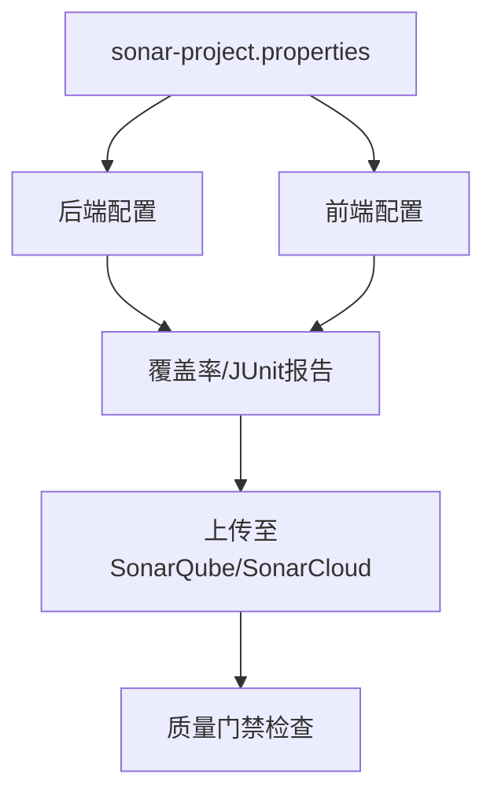

**图表来源**
- [backend/sonar-project.properties:1-82](file://backend/sonar-project.properties#L1-L82)
- [frontend/sonar-project.properties:1-82](file://frontend/sonar-project.properties#L1-L82)
- [scripts/sonar-scan.sh:44-96](file://scripts/sonar-scan.sh#L44-L96)

**章节来源**
- [backend/sonar-project.properties:1-82](file://backend/sonar-project.properties#L1-L82)
- [frontend/sonar-project.properties:1-82](file://frontend/sonar-project.properties#L1-L82)
- [scripts/sonar-scan.sh:1-152](file://scripts/sonar-scan.sh#L1-L152)

## 依赖关系分析

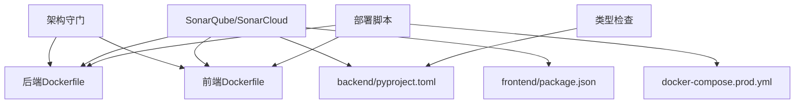

**图表来源**
- [.github/workflows/backend-architecture.yml:15-47](file://.github/workflows/backend-architecture.yml#L15-L47)
- [.github/workflows/sonar.yml:20-135](file://.github/workflows/sonar.yml#L20-L135)
- [.github/workflows/sonarcloud.yml:21-176](file://.github/workflows/sonarcloud.yml#L21-L176)
- [.github/workflows/typecheck.yml:15-41](file://.github/workflows/typecheck.yml#L15-L41)
- [backend/Dockerfile:1-33](file://backend/Dockerfile#L1-L33)
- [frontend/Dockerfile:1-57](file://frontend/Dockerfile#L1-L57)
- [backend/pyproject.toml:124-351](file://backend/pyproject.toml#L124-L351)
- [frontend/package.json:1-104](file://frontend/package.json#L1-L104)
- [deploy/deploy.sh:1-260](file://deploy/deploy.sh#L1-L260)
- [docker-compose.prod.yml:1-136](file://docker-compose.prod.yml#L1-L136)

**章节来源**
- [.github/workflows/backend-architecture.yml:1-47](file://.github/workflows/backend-architecture.yml#L1-L47)
- [.github/workflows/sonar.yml:1-135](file://.github/workflows/sonar.yml#L1-L135)
- [.github/workflows/sonarcloud.yml:1-176](file://.github/workflows/sonarcloud.yml#L1-L176)
- [.github/workflows/typecheck.yml:1-41](file://.github/workflows/typecheck.yml#L1-L41)
- [backend/Dockerfile:1-33](file://backend/Dockerfile#L1-L33)
- [frontend/Dockerfile:1-57](file://frontend/Dockerfile#L1-L57)
- [backend/pyproject.toml:1-351](file://backend/pyproject.toml#L1-L351)
- [frontend/package.json:1-104](file://frontend/package.json#L1-L104)
- [deploy/deploy.sh:1-260](file://deploy/deploy.sh#L1-L260)
- [docker-compose.prod.yml:1-136](file://docker-compose.prod.yml#L1-L136)

## 性能考虑
- 并行构建：部署脚本并行构建后端与前端镜像
- 缓存利用：前端Dockerfile使用npm缓存挂载；后端使用预构建依赖镜像
- 健康检查：生产环境为后端与前端配置健康检查，缩短恢复时间
- 资源限制：Compose文件为各服务设置CPU与内存限制，避免资源争用

**章节来源**
- [deploy/deploy.sh:127-129](file://deploy/deploy.sh#L127-L129)
- [frontend/Dockerfile:17-18](file://frontend/Dockerfile#L17-L18)
- [backend/Dockerfile:8-8](file://backend/Dockerfile#L8-L8)
- [docker-compose.prod.yml:28-97](file://docker-compose.prod.yml#L28-L97)

## 故障排除指南
- Sonar扫描失败
  - 检查环境变量：SONAR_HOST_URL与SONAR_TOKEN是否设置
  - 本地扫描：使用scripts/sonar-scan.sh，确保sonar-scanner已安装
  - 覆盖率路径修正：SonarCloud工作流中对coverage.xml路径进行替换
- 部署失败
  - 检查前置条件：docker与docker compose是否存在
  - 环境文件：确认.env.production与backend/.env是否存在且配置正确
  - 健康检查：查看后端健康端点与日志
- E2E测试超时
  - 确认数据库、Redis、Qdrant已启动并可用
  - 检查后端uvicorn进程与端口占用情况

**章节来源**
- [scripts/sonar-scan.sh:20-42](file://scripts/sonar-scan.sh#L20-L42)
- [deploy/deploy.sh:47-77](file://deploy/deploy.sh#L47-L77)
- [scripts/run-e2e.ps1:24-87](file://scripts/run-e2e.ps1#L24-L87)

## 结论
本CI/CD体系通过GitHub Actions实现架构守门、类型检查与代码质量扫描，并结合Docker多阶段构建与一键部署脚本，形成从开发到生产的完整闭环。配合SonarQube/SonarCloud的质量门禁与覆盖率报告，能够有效保障代码质量与交付效率。建议在实际使用中完善密钥管理与环境隔离，持续优化构建缓存与健康检查策略。

## 附录
- Makefile命令概览：安装依赖、开发服务器、测试、检查、SonarCloud、Docker服务、部署与运维
- 生产环境Compose：定义数据库、Redis、Qdrant与后端、前端服务的镜像、端口映射、健康检查与资源限制

**章节来源**
- [Makefile:1-294](file://Makefile#L1-L294)
- [docker-compose.prod.yml:1-136](file://docker-compose.prod.yml#L1-L136)