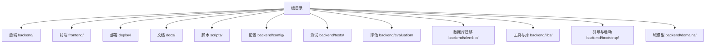
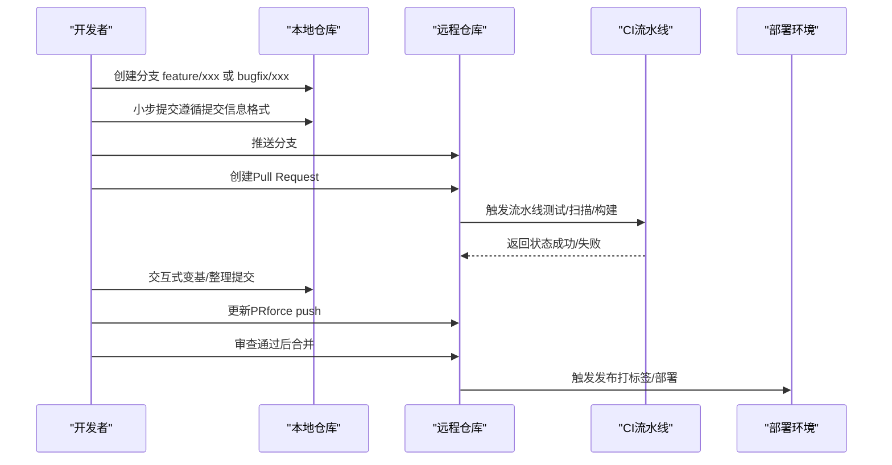
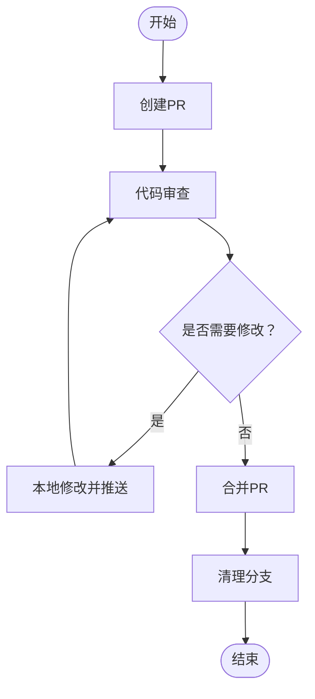
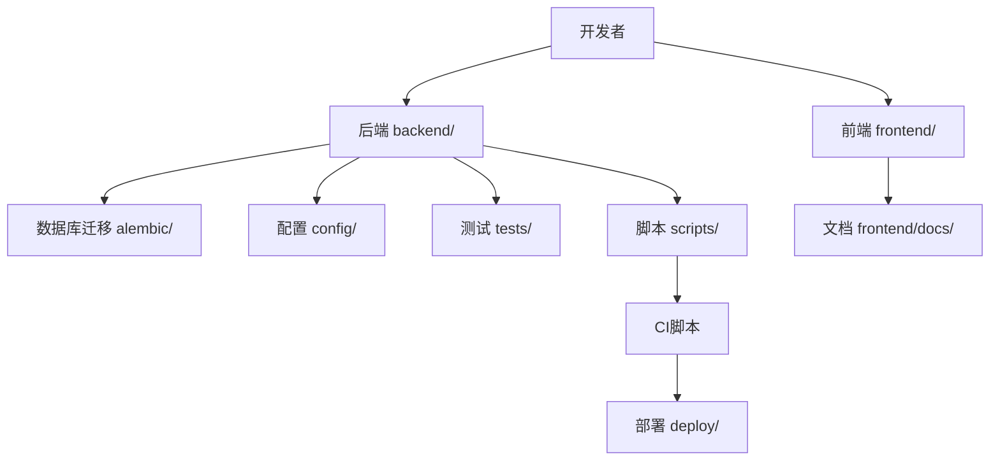

# Git工作流与分支管理

<cite>
**本文引用的文件**
- [backend/README.md](file://backend/README.md)
- [docs/SONARQUBE.md](file://docs/SONARQUBE.md)
- [docs/技术选型报告.md](file://docs/技术选型报告.md)
- [docs/archive/plans/2025-01-28-mcp-tool-management-implementation.md](file://docs/archive/plans/2025-01-28-mcp-tool-management-implementation.md)
- [scripts/sonar-scan.sh](file://scripts/sonar-scan.sh)
- [scripts/sonarcloud-scan.sh](file://scripts/sonarcloud-scan.sh)
- [backend/docker/sandbox/Dockerfile](file://backend/docker/sandbox/Dockerfile)
- [frontend/Dockerfile](file://frontend/Dockerfile)
- [deploy/deploy.sh](file://deploy/deploy.sh)
- [deploy/remote-deploy.sh](file://deploy/remote-deploy.sh)
- [Makefile](file://Makefile)
- [backend/pyproject.toml](file://backend/pyproject.toml)
- [frontend/package.json](file://frontend/package.json)
- [backend/.pre-commit-config.yaml](file://backend/.pre-commit-config.yaml)
- [frontend/eslint.config.js](file://frontend/eslint.config.js)
- [frontend/tailwind.config.js](file://frontend/tailwind.config.js)
- [backend/alembic.ini](file://backend/alembic.ini)
- [backend/alembic/script.py.mako](file://backend/alembic/script.py.mako)
- [backend/alembic/env.py](file://backend/alembic/env.py)
- [backend/alembic/versions/...](file://backend/alembic/versions/README.md)
- [backend/scripts/generate_alembic_sql_files.py](file://backend/scripts/generate_alembic_sql_files.py)
- [backend/scripts/migrate_test_db.py](file://backend/scripts/migrate_test_db.py)
- [backend/scripts/run_dev_server.py](file://backend/scripts/run_dev_server.py)
- [backend/scripts/run_server.py](file://backend/scripts/run_server.py)
- [backend/scripts/run_sonar_scanner.py](file://backend/scripts/run_sonar_scanner.py)
- [backend/scripts/test_gateway_proxy.py](file://backend/scripts/test_gateway_proxy.py)
- [backend/scripts/test_tool_registry.py](file://backend/scripts/test_tool_registry.py)
- [backend/scripts/verify_ops_sql_files.py](file://backend/scripts/verify_ops_sql_files.py)
- [backend/scripts/check_encoding_issues.py](file://backend/scripts/check_encoding_issues.py)
- [backend/scripts/check_sonar_env.py](file://backend/scripts/check_sonar_env.py)
- [backend/scripts/list_configured_models.py](file://backend/scripts/list_configured_models.py)
- [backend/scripts/probe_dashscope_embedding.py](file://backend/scripts/probe_dashscope_embedding.py)
- [backend/scripts/reset_quota.py](file://backend/scripts/reset_quota.py)
- [backend/scripts/set_admin.py](file://backend/scripts/set_admin.py)
- [backend/scripts/seed_gateway_models.py](file://backend/scripts/seed_gateway_models.py)
- [backend/scripts/test_checkpointer.py](file://backend/scripts/test_checkpointer.py)
- [backend/scripts/test_litellm_models.py](file://backend/scripts/test_litellm_models.py)
- [backend/scripts/test_network_config.py](file://backend/scripts/test_network_config.py)
- [backend/scripts/inspect_duplicate_attribution.py](file://backend/scripts/inspect_duplicate_attribution.py)
- [backend/scripts/inspect_gateway_logs.py](file://backend/scripts/inspect_gateway_logs.py)
- [backend/scripts/cleanup_sandbox_containers.py](file://backend/scripts/cleanup_sandbox_containers.py)
- [backend/scripts/fix_all_encoding_issues.py](file://backend/scripts/fix_all_encoding_issues.py)
- [backend/scripts/fix_sessions_table.py](file://backend/scripts/fix_sessions_table.py)
- [backend/scripts/verify_encoding_fix.py](file://backend/scripts/verify_encoding_fix.py)
- [backend/scripts/check_rules.py](file://backend/scripts/check_rules.py)
- [backend/scripts/README.md](file://backend/scripts/README.md)
- [backend/Makefile](file://backend/Makefile)
- [frontend/Makefile](file://frontend/Makefile)
- [backend/Deployment.yaml](file://backend/Deployment.yaml)
- [frontend/Deployment.yaml](file://frontend/Deployment.yaml)
- [docker-compose.yml](file://docker-compose.yml)
- [docker-compose.prod.yml](file://docker-compose.prod.yml)
- [backend/config/app.toml](file://backend/config/app.toml)
- [backend/config/app.development.toml](file://backend/config/app.development.toml)
- [backend/config/app.staging.toml](file://backend/config/app.staging.toml)
- [backend/config/app.production.toml](file://backend/config/app.production.toml)
- [backend/config/environments/local-dev.toml](file://backend/config/environments/local-dev.toml)
- [backend/config/environments/docker-dev.toml](file://backend/config/environments/docker-dev.toml)
- [backend/config/environments/docker-prod.toml](file://backend/config/environments/docker-prod.toml)
- [backend/config/environments/k8s-prod.toml](file://backend/config/environments/k8s-prod.toml)
- [backend/config/environments/network-enabled.toml](file://backend/config/environments/network-enabled.toml)
- [backend/config/environments/network-restricted.toml](file://backend/config/environments/network-restricted.toml)
- [backend/config/environments/node-dev.toml](file://backend/config/environments/node-dev.toml)
- [backend/config/environments/python-dev.toml](file://backend/config/environments/python-dev.toml)
- [backend/config/environments/minimal.toml](file://backend/config/environments/minimal.toml)
- [backend/config/environments/data-science.toml](file://backend/config/environments/data-science.toml)
- [backend/config/litellm_models.yaml](file://backend/config/litellm_models.yaml)
- [backend/config/tools.toml](file://backend/config/tools.toml)
- [backend/config/mcp.toml](file://backend/config/mcp.toml)
- [backend/config/execution.toml](file://backend/config/execution.toml)
- [backend/config/env.example](file://backend/config/env.example)
- [backend/config/README.md](file://backend/config/README.md)
- [backend/docs/DEVELOPMENT.md](file://backend/docs/DEVELOPMENT.md)
- [backend/docs/CODE_STANDARDS.md](file://backend/docs/CODE_STANDARDS.md)
- [backend/docs/CONFIGURATION.md](file://backend/docs/CONFIGURATION.md)
- [backend/docs/ARCHITECTURE.md](file://backend/docs/ARCHITECTURE.md)
- [backend/docs/AUTHENTICATION.md](file://backend/docs/AUTHENTICATION.md)
- [backend/docs/CONTEXT_MANAGEMENT_IMPLEMENTATION.md](file://backend/docs/CONTEXT_MANAGEMENT_IMPLEMENTATION.md)
- [backend/docs/LANGGRAPH_ARCHITECTURE_RATIONALE.md](file://backend/docs/LANGGRAPH_ARCHITECTURE_RATIONALE.md)
- [backend/docs/沙箱资源管理设计文档.md](file://backend/docs/沙箱资源管理设计文档.md)
- [backend/docs/项目权限规则.md](file://backend/docs/项目权限规则.md)
- [backend/docs/gateway/GATEWAY_PRICING_AND_LITELLM_COST.md](file://backend/docs/gateway/GATEWAY_PRICING_AND_LITELLM_COST.md)
- [backend/docs/gateway/LLM_GATEWAY_ARCHITECTURE.md](file://backend/docs/gateway/LLM_GATEWAY_ARCHITECTURE.md)
- [backend/docs/gateway/GATEWAY_DEPLOYMENT_CHECKLIST.md](file://backend/docs/gateway/GATEWAY_DEPLOYMENT_CHECKLIST.md)
- [backend/docs/gateway/GATEWAY_THIRDPARTY_CLIENT_GUIDE.md](file://backend/docs/gateway/GATEWAY_THIRDPARTY_CLIENT_GUIDE.md)
- [backend/docs/mcp/MCP_AUTO_INIT.md](file://backend/docs/mcp/MCP_AUTO_INIT.md)
- [backend/docs/mcp/MCP_QUICKSTART.md](file://backend/docs/mcp/MCP_QUICKSTART.md)
- [backend/docs/mcp/MCP_STATUS_SYSTEM.md](file://backend/docs/mcp/MCP_STATUS_SYSTEM.md)
- [backend/docs/AGENT_ARCHITECTURE_DESIGN.md](file://backend/docs/AGENT_ARCHITECTURE_DESIGN.md)
- [backend/docs/AI_GATEWAY_DOMAIN_ARCHITECTURE.md](file://backend/docs/AI_GATEWAY_DOMAIN_ARCHITECTURE.md)
- [backend/docs/README.md](file://backend/docs/README.md)
- [docs/README.md](file://docs/README.md)
- [frontend/README.md](file://frontend/README.md)
- [backend/utils/logging.py](file://backend/utils/logging.py)
- [backend/utils/crypto.py](file://backend/utils/crypto.py)
- [backend/utils/cache.py](file://backend/utils/cache.py)
- [backend/utils/serialization.py](file://backend/utils/serialization.py)
- [backend/utils/tokens.py](file://backend/utils/tokens.py)
- [backend/libs/api/__init__.py](file://backend/libs/api/__init__.py)
- [backend/libs/config/__init__.py](file://backend/libs/config/__init__.py)
- [backend/libs/db/__init__.py](file://backend/libs/db/__init__.py)
- [backend/libs/exceptions/__init__.py](file://backend/libs/exceptions/__init__.py)
- [backend/libs/gateway/__init__.py](file://backend/libs/gateway/__init__.py)
- [backend/libs/iam/__init__.py](file://backend/libs/iam/__init__.py)
- [backend/libs/llm/__init__.py](file://backend/libs/llm/__init__.py)
- [backend/libs/mcp/__init__.py](file://backend/libs/mcp/__init__.py)
- [backend/libs/middleware/__init__.py](file://backend/libs/middleware/__init__.py)
- [backend/libs/observability/__init__.py](file://backend/libs/observability/__init__.py)
- [backend/libs/orm/__init__.py](file://backend/libs/orm/__init__.py)
- [backend/libs/storage/__init__.py](file://backend/libs/storage/__init__.py)
- [backend/libs/types/__init__.py](file://backend/libs/types/__init__.py)
- [backend/libs/background_tasks.py](file://backend/libs/background_tasks.py)
- [backend/libs/crypto.py](file://backend/libs/crypto.py)
- [backend/libs/identity_bridge_deps.py](file://backend/libs/identity_bridge_deps.py)
- [backend/libs/model_connectivity.py](file://backend/libs/model_connectivity.py)
- [backend/bootstrap/main.py](file://backend/bootstrap/main.py)
- [backend/bootstrap/event_loop.py](file://backend/bootstrap/event_loop.py)
- [backend/bootstrap/config.py](file://backend/bootstrap/config.py)
- [backend/bootstrap/config_loader.py](file://backend/bootstrap/config_loader.py)
- [backend/bootstrap/composition/identity_services.py](file://backend/bootstrap/composition/identity_services.py)
- [backend/domains/agent/application/__init__.py](file://backend/domains/agent/application/__init__.py)
- [backend/domains/identity/application/__init__.py](file://backend/domains/identity/application/__init__.py)
- [backend/domains/session/application/__init__.py](file://backend/domains/session/application/__init__.py)
- [backend/domains/studio/application/__init__.py](file://backend/domains/studio/application/__init__.py)
- [backend/domains/tenancy/application/__init__.py](file://backend/domains/tenancy/application/__init__.py)
- [backend/domains/evaluation/application/__init__.py](file://backend/domains/evaluation/application/__init__.py)
- [backend/tests/conftest.py](file://backend/tests/conftest.py)
- [backend/tests/README.md](file://backend/tests/README.md)
- [backend/tests/CONFTEST_ANALYSIS.md](file://backend/tests/CONFTEST_ANALYSIS.md)
- [backend/tests/unit/__init__.py](file://backend/tests/unit/__init__.y)
- [backend/tests/integration/__init__.py](file://backend/tests/integration/__init__.py)
- [backend/tests/e2e/__init__.py](file://backend/tests/e2e/__init__.py)
- [backend/tests/architecture/__init__.py](file://backend/tests/architecture/__init__.py)
- [backend/tests/helpers/__init__.py](file://backend/tests/helpers/__init__.py)
- [backend/tests/fixtures/__init__.py](file://backend/tests/fixtures/__init__.py)
- [backend/tests/test_tools/__init__.py](file://backend/tests/test_tools/__init__.py)
- [backend/tests/evaluation/__init__.py](file://backend/tests/evaluation/__init__.py)
- [backend/evaluation/README.md](file://backend/evaluation/README.md)
- [backend/evaluation/benchmarks/agent_tasks.yaml](file://backend/evaluation/benchmarks/agent_tasks.yaml)
- [backend/evaluation/benchmarks/gaia_sample.yaml](file://backend/evaluation/benchmarks/gaia_sample.yaml)
- [backend/evaluation/benchmarks/tool_accuracy_cases.yaml](file://backend/evaluation/benchmarks/tool_accuracy_cases.yaml)
- [backend/evaluation/benchmark_loader.py](file://backend/evaluation/benchmark_loader.py)
- [backend/evaluation/gaia.py](file://backend/evaluation/gaia.py)
- [backend/evaluation/llm_judge.py](file://backend/evaluation/llm_judge.py)
- [backend/evaluation/performance.py](file://backend/evaluation/performance.py)
- [backend/evaluation/task_completion.py](file://backend/evaluation/task_completion.py)
- [backend/evaluation/tool_accuracy.py](file://backend/evaluation/tool_accuracy.py)
- [backend/evaluation/tool_accuracy_integration.py](file://backend/evaluation/tool_accuracy_integration.py)
- [backend/evaluation/test_benchmark_loader.py](file://backend/evaluation/test_benchmark_loader.py)
- [backend/evaluation/test_gaia.py](file://backend/evaluation/test_gaia.py)
- [backend/evaluation/test_llm_judge.py](file://backend/evaluation/test_llm_judge.py)
- [backend/evaluation/test_performance.py](file://backend/evaluation/test_performance.py)
- [backend/evaluation/test_task_evaluator.py](file://backend/evaluation/test_task_evaluator.py)
- [backend/evaluation/test_tool_accuracy.py](file://backend/evaluation/test_tool_accuracy.py)
- [backend/evaluation/test_tool_accuracy_integration.py](file://backend/evaluation/test_tool_accuracy_integration.py)
- [backend/evaluation/test_tool_accuracy.py](file://backend/evaluation/test_tool_accuracy.py)
- [backend/evaluation/test_tool_accuracy_integration.py](file://backend/evaluation/test_tool_accuracy_integration.py)
- [backend/evaluation/test_task_evaluator.py](file://backend/evaluation/test_task_evaluator.py)
- [backend/evaluation/test_performance.py](file://backend/evaluation/test_performance.py)
- [backend/evaluation/test_llm_judge.py](file://backend/evaluation/test_llm_judge.py)
- [backend/evaluation/test_gaia.py](file://backend/evaluation/test_gaia.py)
- [backend/evaluation/test_benchmark_loader.py](file://backend/evaluation/test_benchmark_loader.py)
- [backend/evaluation/benchmark_loader.py](file://backend/evaluation/benchmark_loader.py)
- [backend/evaluation/benchmarks/agent_tasks.yaml](file://backend/evaluation/benchmarks/agent_tasks.yaml)
- [backend/evaluation/benchmarks/gaia_sample.yaml](file://backend/evaluation/benchmarks/gaia_sample.yaml)
- [backend/evaluation/benchmarks/tool_accuracy_cases.yaml](file://backend/evaluation/benchmarks/tool_accuracy_cases.yaml)
- [backend/evaluation/README.md](file://backend/evaluation/README.md)
- [backend/evaluation/tool_accuracy.py](file://backend/evaluation/tool_accuracy.py)
- [backend/evaluation/tool_accuracy_integration.py](file://backend/evaluation/tool_accuracy_integration.py)
- [backend/evaluation/performance.py](file://backend/evaluation/performance.py)
- [backend/evaluation/task_completion.py](file://backend/evaluation/task_completion.py)
- [backend/evaluation/llm_judge.py](file://backend/evaluation/llm_judge.py)
- [backend/evaluation/gaia.py](file://backend/evaluation/gaia.py)
- [backend/evaluation/benchmark_loader.py](file://backend/evaluation/benchmark_loader.py)
- [backend/evaluation/README.md](file://backend/evaluation/README.md)
- [backend/evaluation/benchmarks/agent_tasks.yaml](file://backend/evaluation/benchmarks/agent_tasks.yaml)
- [backend/evaluation/benchmarks/gaia_sample.yaml](file://backend/evaluation/benchmarks/gaia_sample.yaml)
- [backend/evaluation/benchmarks/tool_accuracy_cases.yaml](file://backend/evaluation/benchmarks/tool_accuracy_cases.yaml)
- [backend/evaluation/test_benchmark_loader.py](file://backend/evaluation/test_benchmark_loader.py)
- [backend/evaluation/test_gaia.py](file://backend/evaluation/test_gaia.py)
- [backend/evaluation/test_llm_judge.py](file://backend/evaluation/test_llm_judge.py)
- [backend/evaluation/test_performance.py](file://backend/evaluation/test_performance.py)
- [backend/evaluation/test_task_evaluator.py](file://backend/evaluation/test_task_evaluator.py)
- [backend/evaluation/test_tool_accuracy.py](file://backend/evaluation/test_tool_accuracy.py)
- [backend/evaluation/test_tool_accuracy_integration.py](file://backend/evaluation/test_tool_accuracy_integration.py)
- [backend/evaluation/tool_accuracy.py](file://backend/evaluation/tool_accuracy.py)
- [backend/evaluation/tool_accuracy_integration.py](file://backend/evaluation/tool_accuracy_integration.py)
- [backend/evaluation/performance.py](file://backend/evaluation/performance.py)
- [backend/evaluation/task_completion.py](file://backend/evaluation/task_completion.py)
- [backend/evaluation/llm_judge.py](file://backend/evaluation/llm_judge.py)
- [backend/evaluation/gaia.py](file://backend/evaluation/gaia.py)
- [backend/evaluation/benchmark_loader.py](file://backend/evaluation/benchmark_loader.py)
- [backend/evaluation/README.md](file://backend/evaluation/README.md)
- [backend/evaluation/benchmarks/agent_tasks.yaml](file://backend/evaluation/benchmarks/agent_tasks.yaml)
- [backend/evaluation/benchmarks/gaia_sample.yaml](file://backend/evaluation/benchmarks/gaia_sample.yaml)
- [backend/evaluation/benchmarks/tool_accuracy_cases.yaml](file://backend/evaluation/benchmarks/tool_accuracy_cases.yaml)
- [backend/evaluation/test_benchmark_loader.py](file://backend/evaluation/test_benchmark_loader.py)
- [backend/evaluation/test_gaia.py](file://backend/evaluation/test_gaia.py)
- [backend/evaluation/test_llm_judge.py](file://backend/evaluation/test_llm_judge.py)
- [backend/evaluation/test_performance.py](file://backend/evaluation/test_performance.py)
- [backend/evaluation/test_task_evaluator.py](file://backend/evaluation/test_task_evaluator.py)
- [backend/evaluation/test_tool_accuracy.py](file://backend/evaluation/test_tool_accuracy.py)
- [backend/evaluation/test_tool_accuracy_integration.py](file://backend/evaluation/test_tool_accuracy_integration.py)
</cite>

## 目录
1. 引言
2. 项目结构
3. 核心组件
4. 架构总览
5. 详细组件分析
6. 依赖分析
7. 性能考虑
8. 故障排除指南
9. 结论
10. 附录

## 引言
本指南面向AI Agent项目的开发者与团队，提供一套完整的Git工作流与分支管理规范，涵盖分支命名、提交信息格式、Pull Request流程、标签与发布、Git配置最佳实践、常用与高级操作以及远程同步与协作问题处理。内容基于仓库中现有文档与脚本进行提炼与整合，确保可落地、可执行且与现有工程实践一致。

## 项目结构
本项目采用多模块结构，包含后端Python服务、前端React应用、部署与CI脚本、数据库迁移与配置、测试与评估体系等。整体围绕“后端+前端+基础设施+配置+测试”的分层组织，便于在Git上以功能域或主题域进行分支与合并。

图示来源
- [backend/README.md](file://backend/README.md)
- [frontend/README.md](file://frontend/README.md)
- [docs/README.md](file://docs/README.md)

章节来源
- [backend/README.md](file://backend/README.md)
- [frontend/README.md](file://frontend/README.md)
- [docs/README.md](file://docs/README.md)

## 核心组件
- 分支与工作流
  - 基于功能域与任务类型的分支命名：feature/、bugfix/、hotfix/、release/ 等前缀，结合具体主题或任务编号，形成清晰可追溯的分支语义。
  - 提交信息格式：采用类型+范围+描述的标准化格式，配合变更日志与自动化发布工具链。
- 提交与审查
  - 在本地完成小步提交，保持提交粒度与上下文清晰；通过Pull Request进行代码审查与讨论，确保质量门禁。
- 标签与发布
  - 使用语义化版本标签标记发布；结合CI流水线实现自动化构建、测试与部署。
- 配置与工具
  - Git配置（用户名、邮箱、别名、钩子）、预提交钩子、ESLint/Tailwind等工具配置，统一风格与质量。
- 常用与高级操作
  - 变基、交互式变基、cherry-pick、revert、squash等，提升历史整洁与协作效率。
- 远程同步与协作
  - 远程分支同步策略、冲突解决流程、多人协作中的冲突预防与处理。

章节来源
- [backend/README.md](file://backend/README.md)
- [docs/SONARQUBE.md](file://docs/SONARQUBE.md)
- [docs/技术选型报告.md](file://docs/技术选型报告.md)
- [docs/archive/plans/2025-01-28-mcp-tool-management-implementation.md](file://docs/archive/plans/2025-01-28-mcp-tool-management-implementation.md)

## 架构总览
下图展示从本地开发到CI/CD与部署的整体流程，强调分支、PR、标签与发布的关键节点。

图示来源
- [backend/README.md](file://backend/README.md)
- [scripts/sonar-scan.sh](file://scripts/sonar-scan.sh)
- [scripts/sonarcloud-scan.sh](file://scripts/sonarcloud-scan.sh)
- [deploy/deploy.sh](file://deploy/deploy.sh)
- [deploy/remote-deploy.sh](file://deploy/remote-deploy.sh)

## 详细组件分析

### 分支命名规范
- 前缀与语义
  - feature/：新功能开发分支，建议关联需求或任务编号，例如 feature/user-login-flow。
  - bugfix/：Bug修复分支，建议标注问题单号或简要问题描述，例如 bugfix/issue-123-login-crash。
  - hotfix/：紧急线上修复分支，通常从主分支或tag切出，修复后回并至主分支与发布分支。
  - release/：准备发布的分支，用于最后的集成测试与版本微调，例如 release/v1.2.3。
- 命名建议
  - 使用连字符或下划线连接单词，避免空格与特殊字符。
  - 与任务管理系统（Jira/Notion）编号绑定，便于追踪。
  - 与功能域或模块关联，例如 feature/backend/agent-memory。

章节来源
- [docs/技术选型报告.md](file://docs/技术选型报告.md)
- [docs/archive/plans/2025-01-28-mcp-tool-management-implementation.md](file://docs/archive/plans/2025-01-28-mcp-tool-management-implementation.md)

### 提交信息格式
- 标准格式
  - 类型：feat、fix、docs、refactor、test、chore、perf、style、build、ci、revert等。
  - 范围：可选，限定影响范围（如 agent、gateway、mcp、alembic）。
  - 描述：简洁明确地说明变更内容，必要时补充动机与影响。
- 示例路径
  - 提交信息示例可在计划文档中找到，体现标准格式的使用场景。
- 自动化支持
  - 结合变更日志与发布工具，自动提取提交信息生成变更记录。

章节来源
- [backend/README.md](file://backend/README.md)
- [docs/archive/plans/2025-01-28-mcp-tool-management-implementation.md](file://docs/archive/plans/2025-01-28-mcp-tool-management-implementation.md)

### Pull Request 工作流程
- PR创建
  - 基于功能分支创建PR，选择目标分支（通常为develop或main），填写描述与关联任务。
- 代码审查
  - 团队成员进行审查，提出修改意见；作者根据反馈调整提交。
- 合并策略
  - 优先使用squash合并以保持历史整洁；复杂变更可使用rebase合并。
- 冲突解决
  - 在本地先rebase到上游最新分支，解决冲突后再推送更新的PR。

图示来源
- [backend/README.md](file://backend/README.md)

章节来源
- [backend/README.md](file://backend/README.md)

### 标签与版本发布
- 标签策略
  - 使用语义化版本标签（vX.Y.Z），与发布分支或主分支合并点对应。
- 发布流程
  - 打标签后触发CI流水线，构建产物并部署到目标环境；必要时生成发布说明。
- 与CI集成
  - 通过脚本与流水线配置实现自动化扫描、测试与部署。

章节来源
- [scripts/sonar-scan.sh](file://scripts/sonar-scan.sh)
- [scripts/sonarcloud-scan.sh](file://scripts/sonarcloud-scan.sh)
- [deploy/deploy.sh](file://deploy/deploy.sh)
- [deploy/remote-deploy.sh](file://deploy/remote-deploy.sh)

### Git 配置最佳实践
- 用户信息
  - 设置全局用户名与邮箱，确保提交归属清晰。
- 别名配置
  - 常用命令别名：如co切换分支、br显示分支、st查看状态、lg查看日志等。
- 钩子脚本
  - 使用pre-commit钩子在提交前执行静态检查、格式化与简单测试。
- 工具配置
  - ESLint、Tailwind等工具配置文件应纳入版本控制，保证团队一致性。

章节来源
- [backend/.pre-commit-config.yaml](file://backend/.pre-commit-config.yaml)
- [frontend/eslint.config.js](file://frontend/eslint.config.js)
- [frontend/tailwind.config.js](file://frontend/tailwind.config.js)

### 常见 Git 操作与高级技巧
- 变基（rebase）
  - 保持线性历史，适用于功能分支在主干更新后的同步。
- 交互式变基（rebase -i）
  - 整理提交、修改提交信息、合并相邻提交。
- cherry-pick
  - 将特定提交应用到其他分支，常用于hotfix回滚或选择性合并。
- revert
  - 对已合并的提交进行反向提交，避免破坏历史。
- squash
  - 将多个提交压缩为一个，便于PR合并时保持历史整洁。

章节来源
- [backend/README.md](file://backend/README.md)

### 远程分支同步与协作
- 同步策略
  - 定期从主分支拉取最新变更，保持本地分支与上游一致。
- 冲突预防
  - 小步提交、频繁同步、避免大范围独立修改。
- 冲突解决
  - 使用rebase或merge解决冲突后，确保测试通过再推送。

章节来源
- [backend/README.md](file://backend/README.md)

## 依赖分析
- 组件耦合
  - 后端与前端通过API接口耦合；数据库迁移与后端配置耦合；CI脚本与部署脚本耦合。
- 外部依赖
  - CI扫描工具（Sonar）、容器镜像构建、Kubernetes部署等。
- 版本与标签
  - 通过语义化版本标签与CI流水线实现版本发布与回滚。

图示来源
- [backend/alembic/versions/...](file://backend/alembic/versions/README.md)
- [backend/config/...](file://backend/config/README.md)
- [backend/scripts/...](file://backend/scripts/README.md)
- [deploy/deploy.sh](file://deploy/deploy.sh)

章节来源
- [backend/alembic/versions/...](file://backend/alembic/versions/README.md)
- [backend/config/README.md](file://backend/config/README.md)
- [backend/scripts/README.md](file://backend/scripts/README.md)
- [deploy/deploy.sh](file://deploy/deploy.sh)

## 性能考虑
- 提交粒度
  - 小步提交有助于快速定位问题与减少冲突。
- 历史管理
  - 使用交互式变基整理历史，避免冗余提交。
- CI效率
  - 合理拆分测试任务，缩短流水线时间；缓存依赖与构建产物。

## 故障排除指南
- 提交信息不规范
  - 检查提交信息格式是否符合标准；必要时使用reword或rebase -i修正。
- PR冲突频繁
  - 定期同步主分支；减少长周期独立分支；采用更细粒度的功能分支。
- CI失败
  - 查看扫描与测试报告；修复问题后重新触发流水线。
- 标签与发布异常
  - 确认标签命名与语义化版本规范；检查CI发布配置。

章节来源
- [docs/SONARQUBE.md](file://docs/SONARQUBE.md)
- [backend/README.md](file://backend/README.md)

## 结论
本指南提供了AI Agent项目在Git工作流与分支管理上的完整实践路径，覆盖从分支命名、提交信息、PR流程到标签与发布的全生命周期。建议团队在日常协作中严格执行规范，并结合现有脚本与配置工具，持续优化开发体验与交付质量。

## 附录
- 关键文件索引
  - 提交信息与工作流参考：[backend/README.md](file://backend/README.md)
  - Sonar扫描与质量门禁：[scripts/sonar-scan.sh](file://scripts/sonar-scan.sh)、[scripts/sonarcloud-scan.sh](file://scripts/sonarcloud-scan.sh)、[docs/SONARQUBE.md](file://docs/SONARQUBE.md)
  - 部署与编排：[deploy/deploy.sh](file://deploy/deploy.sh)、[deploy/remote-deploy.sh](file://deploy/remote-deploy.sh)、[docker-compose.yml](file://docker-compose.yml)、[docker-compose.prod.yml](file://docker-compose.prod.yml)
  - 配置与工具：[backend/.pre-commit-config.yaml](file://backend/.pre-commit-config.yaml)、[frontend/eslint.config.js](file://frontend/eslint.config.js)、[frontend/tailwind.config.js](file://frontend/tailwind.config.js)
  - 数据库迁移：[backend/alembic/versions/...](file://backend/alembic/versions/README.md)、[backend/alembic/env.py](file://backend/alembic/env.py)、[backend/alembic/script.py.mako](file://backend/alembic/script.py.mako)
  - 脚本与工具：[backend/scripts/...](file://backend/scripts/README.md)、[frontend/Makefile](file://frontend/Makefile)、[backend/Makefile](file://backend/Makefile)
  - 配置文件：[backend/config/...](file://backend/config/README.md)
  - 文档与设计：[backend/docs/...](file://backend/docs/README.md)、[docs/...](file://docs/README.md)