# 代码审查流程

## 目录
1. [引言](#引言)
2. [项目结构](#项目结构)
3. [核心组件](#核心组件)
4. [架构概览](#架构概览)
5. [详细组件分析](#详细组件分析)
6. [依赖分析](#依赖分析)
7. [性能考虑](#性能考虑)
8. [故障排除指南](#故障排除指南)
9. [结论](#结论)
10. [附录](#附录)

## 引言

本指南为AI Agent项目建立了全面的代码审查流程，涵盖了代码风格一致性、性能考虑和安全性检查。该流程基于项目现有的技术栈和工具配置，包括Python后端、TypeScript前端、SonarQube静态分析以及GitHub Actions自动化工作流。

AI Agent是一个基于LangGraph和FastAPI构建的智能代理平台，支持多模态交互、工具调用和会话管理。项目采用分层架构设计，包含后端服务、前端界面、数据库迁移和测试框架。

## 项目结构

项目采用多模块架构，主要分为以下核心部分：

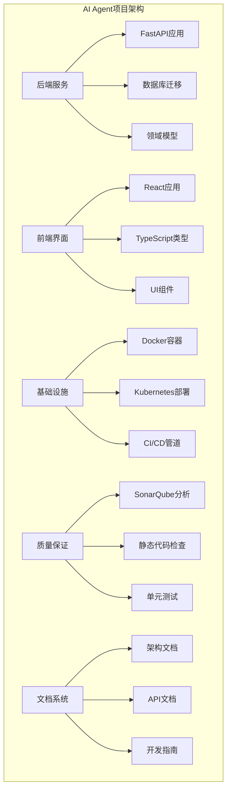

**图表来源**
- [Makefile](file://Makefile)
- [backend/Makefile](file://backend/Makefile)

**章节来源**
- [Makefile:1-50](file://Makefile#L1-L50)
- [backend/Makefile:1-80](file://backend/Makefile#L1-L80)

## 核心组件

### 静态代码分析工具

项目集成了多种静态代码分析工具来确保代码质量：

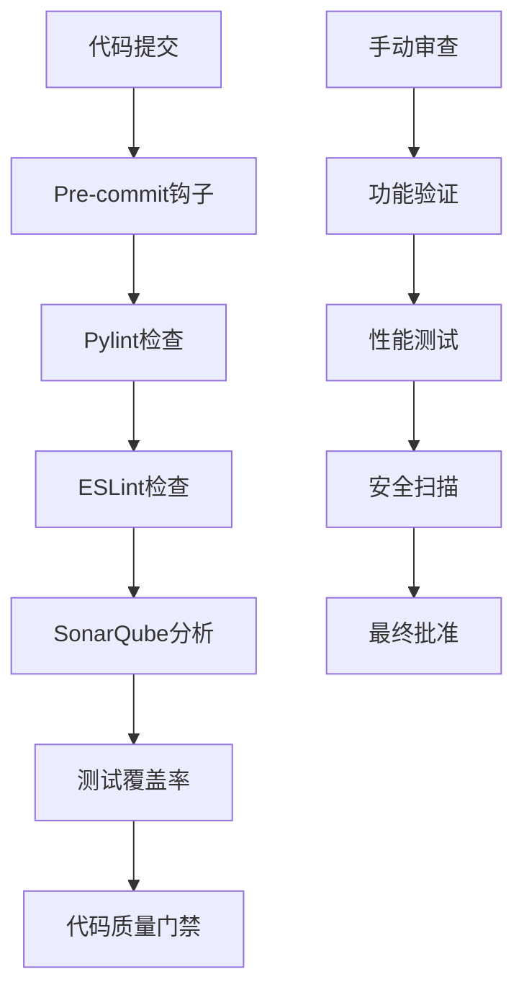

**图表来源**
- [.pre-commit-config.yaml](file://backend/.pre-commit-config.yaml)
- [.pylintrc](file://backend/.pylintrc)
- [eslint.config.js](file://frontend/eslint.config.js)

### 代码质量标准

项目制定了明确的代码质量标准：

**Python后端标准**：
- 使用Pylint进行代码风格检查
- 遵循PEP 8编码规范
- 函数长度不超过50行
- 类复杂度不超过10
- 模块导入顺序规范化

**前端JavaScript/TypeScript标准**：
- ESLint配置基于项目需求定制
- TypeScript严格模式启用
- 组件命名约定统一
- 样式代码分离

**章节来源**
- [.pylintrc](file://backend/.pylintrc)
- [eslint.config.js](file://frontend/eslint.config.js)
- [CODE_STANDARDS.md](file://backend/docs/CODE_STANDARDS.md)

## 架构概览

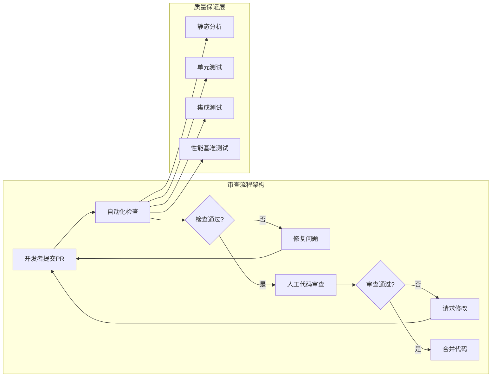

**图表来源**
- [Makefile](file://Makefile)
- [backend/Makefile](file://backend/Makefile)

## 详细组件分析

### 自动化代码检查工具配置

#### Pylint配置分析

项目使用Pylint作为Python代码质量检查工具：

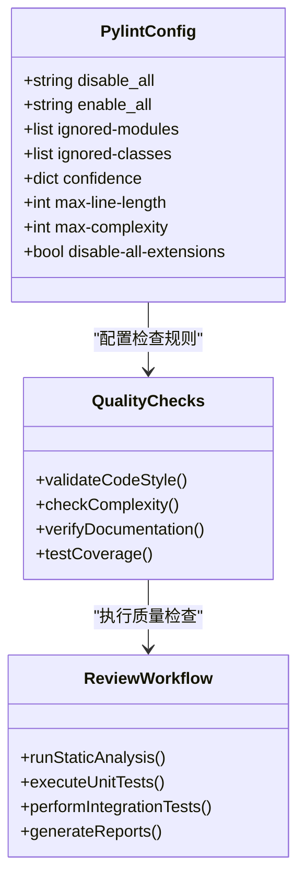

**图表来源**
- [.pylintrc](file://backend/.pylintrc)

#### ESLint配置分析

前端使用ESLint进行代码质量控制：

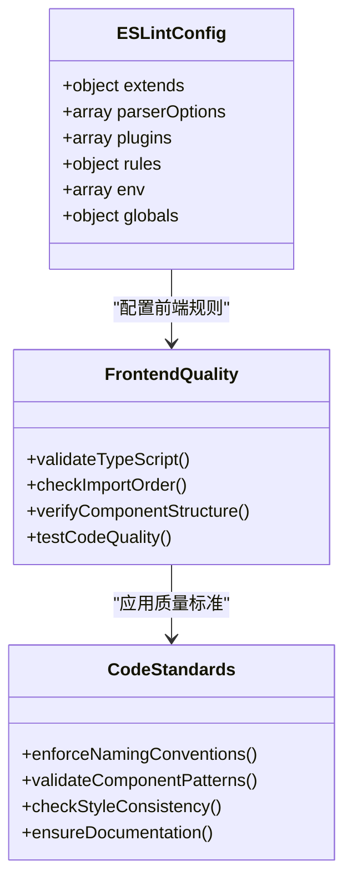

**图表来源**
- [eslint.config.js](file://frontend/eslint.config.js)

**章节来源**
- [.pylintrc](file://backend/.pylintrc)
- [eslint.config.js](file://frontend/eslint.config.js)

### Pull Request模板和必填项

#### PR模板结构

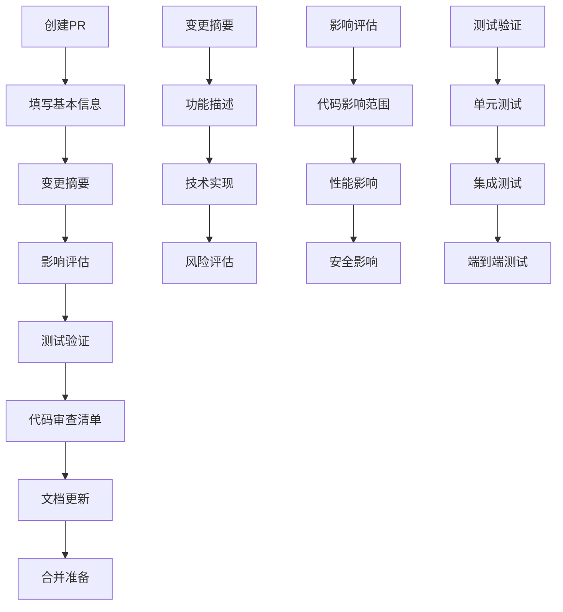

**图表来源**
- [Makefile](file://Makefile)

#### 必填项清单

每个Pull Request必须包含以下信息：

1. **变更摘要**：简要描述变更内容和目的
2. **影响评估**：分析对现有功能的影响程度
3. **测试验证**：列出已执行的测试用例和结果
4. **代码审查清单**：确认已完成的质量检查
5. **文档更新**：说明需要更新的文档内容
6. **回滚计划**：如有必要，提供回滚方案

### 代码审查清单

#### 功能性验证清单

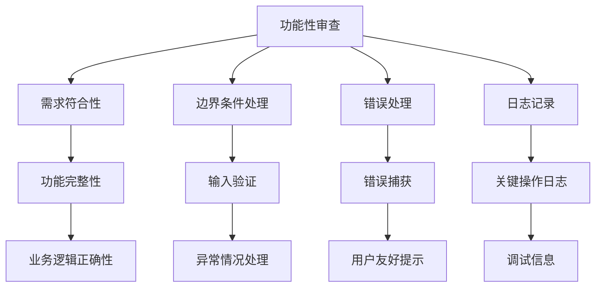

#### 代码质量审查清单

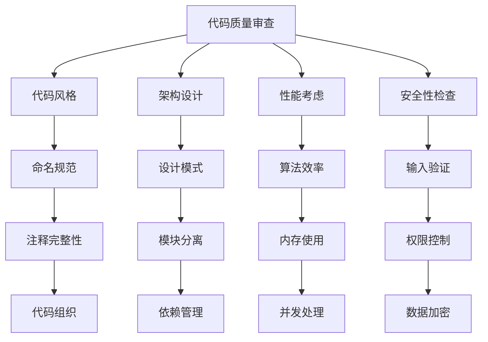

**章节来源**
- [CODE_STANDARDS.md](file://backend/docs/CODE_STANDARDS.md)

### 角色职责和权限

#### 开发者职责

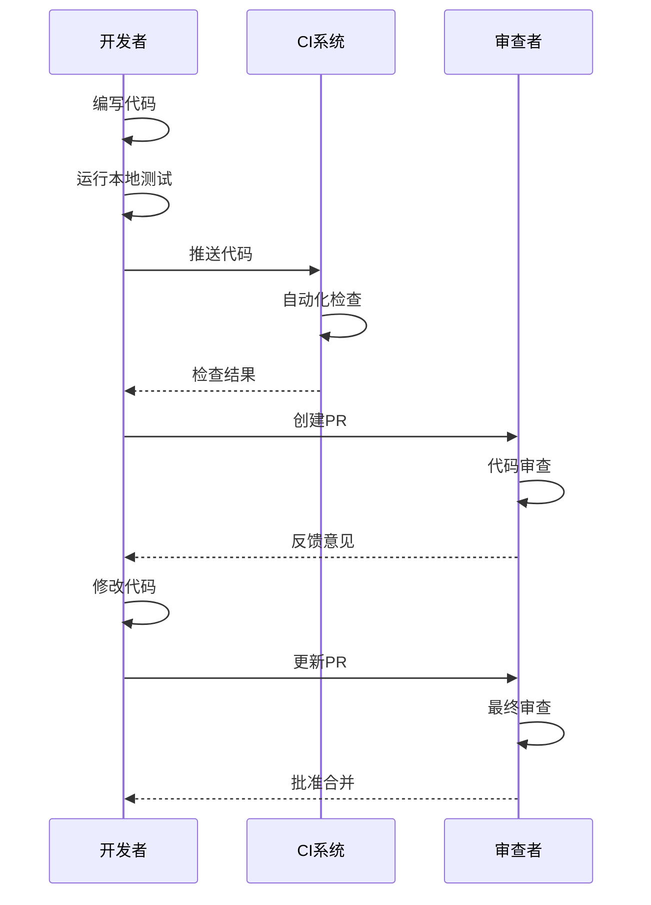

**图表来源**
- [Makefile](file://Makefile)

#### 技术负责人职责

技术负责人负责：
- 审查关键架构变更
- 确保技术债务得到处理
- 验证性能指标
- 指导团队遵循最佳实践

#### 项目经理职责

项目经理负责：
- 跟踪审查进度
- 平衡功能交付和质量
- 协调跨团队审查
- 管理审查优先级

### 审查流程最佳实践

#### 沟通技巧

1. **具体明确**：提供具体的改进建议而非模糊评论
2. **建设性反馈**：专注于代码而非个人
3. **及时响应**：尽快回复审查反馈
4. **保持尊重**：维护良好的团队关系

#### 处理审查反馈

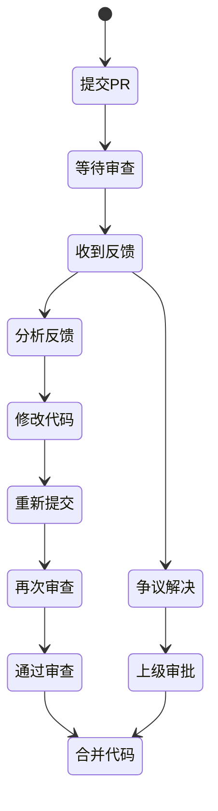

**图表来源**
- [Makefile](file://Makefile)

## 依赖分析

### 工具链依赖关系

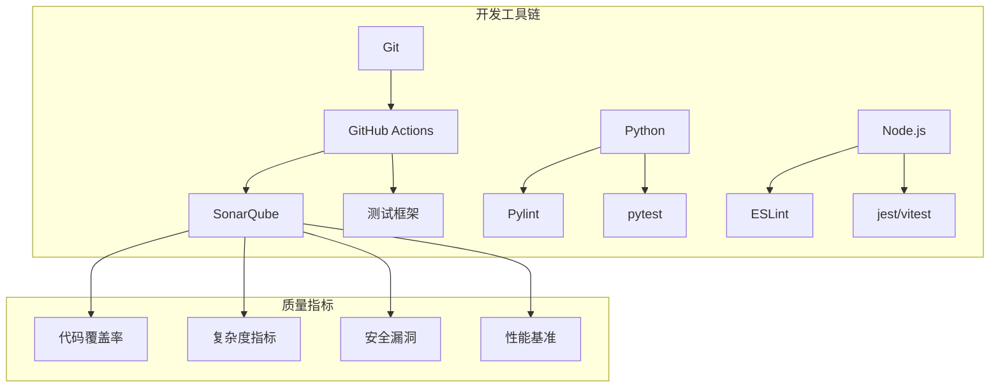

**图表来源**
- [backend/Makefile](file://backend/Makefile)
- [Makefile](file://Makefile)

### 代码审查自动化

项目实现了多层次的自动化代码审查：

1. **Pre-commit钩子**：在本地提交前运行基础检查
2. **CI流水线**：在GitHub Actions中执行完整测试套件
3. **持续分析**：SonarQube持续监控代码质量
4. **性能监控**：自动化的性能基准测试

**章节来源**
- [.pre-commit-config.yaml](file://backend/.pre-commit-config.yaml)
- [backend/Makefile](file://backend/Makefile)

## 性能考虑

### 性能基准测试

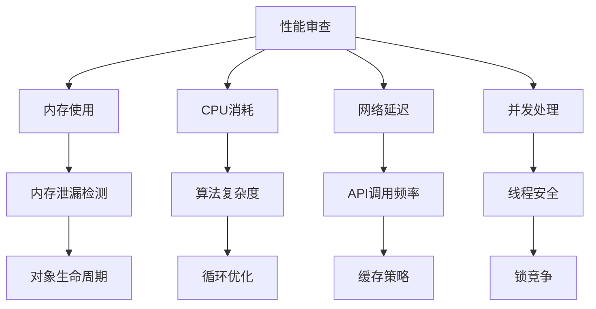

### 性能优化建议

1. **数据库查询优化**：避免N+1查询问题
2. **缓存策略**：合理使用Redis缓存
3. **异步处理**：使用Celery处理耗时任务
4. **资源管理**：及时释放数据库连接和文件句柄

## 故障排除指南

### 常见审查问题

#### 代码质量问题

| 问题类型 | 识别特征 | 解决方案 |
|---------|---------|---------|
| 代码重复 | 相同代码片段出现多次 | 提取为函数或类 |
| 复杂度过高 | 函数或类过于复杂 | 重构为更小的单元 |
| 命名不一致 | 变量和函数命名混乱 | 统一命名约定 |
| 注释缺失 | 关键逻辑缺少注释 | 补充必要的解释性注释 |

#### 审查流程问题

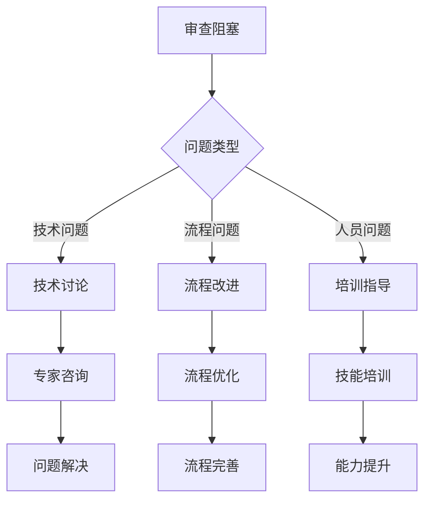

### 审查工具故障排除

1. **SonarQube分析失败**：检查项目配置和网络连接
2. **测试用例失败**：验证测试环境和依赖版本
3. **代码格式错误**：运行格式化工具并更新配置
4. **CI流水线中断**：检查构建日志和环境变量

**章节来源**
- [backend/Makefile](file://backend/Makefile)
- [Makefile](file://Makefile)

## 结论

AI Agent项目的代码审查流程建立在完善的自动化工具链和明确的质量标准之上。通过实施标准化的审查流程、明确的角色分工和持续的质量改进机制，项目能够确保代码质量和开发效率的双重提升。

关键成功因素包括：
- 全面的自动化代码检查工具配置
- 明确的代码质量标准和审查清单
- 清晰的角色职责和权限划分
- 有效的沟通机制和反馈处理流程
- 持续的性能监控和优化

## 附录

### 审查检查表模板

#### 基础检查表
- [ ] 代码风格符合项目标准
- [ ] 函数和类命名规范
- [ ] 注释完整且准确
- [ ] 导入语句有序排列

#### 功能性检查表
- [ ] 所有功能按需求实现
- [ ] 边界条件正确处理
- [ ] 错误处理机制完善
- [ ] 日志记录完整

#### 性能检查表
- [ ] 算法复杂度合理
- [ ] 内存使用优化
- [ ] 数据库查询高效
- [ ] 缓存策略有效

#### 安全检查表
- [ ] 输入验证完整
- [ ] 权限控制正确
- [ ] 敏感数据保护
- [ ] 安全漏洞排查

### 审查反馈模板

```
代码审查反馈

变更主题：[简要描述]
审查日期：[日期]
审查者：[姓名]

发现的问题：
1. [问题1]
   - 位置：[文件路径:行号]
   - 影响：[对功能的影响]
   - 建议：[解决方案]

2. [问题2]
   - 位置：[文件路径:行号]
   - 影响：[对性能的影响]
   - 建议：[优化方案]

总体评价：[积极/中性/消极]
改进建议：[具体的改进建议]
```