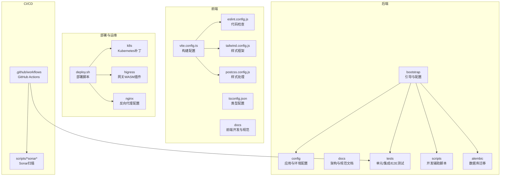
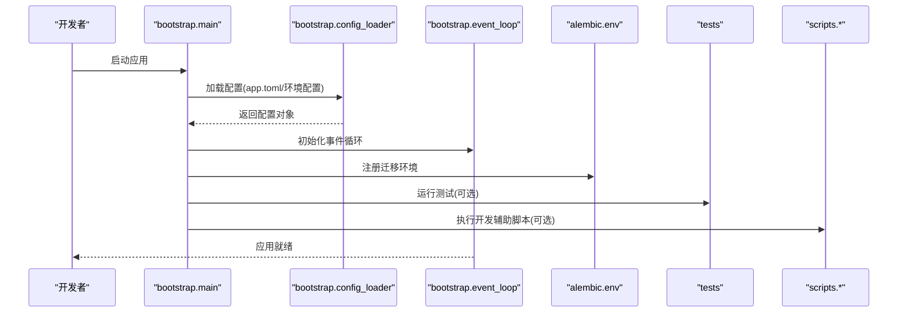
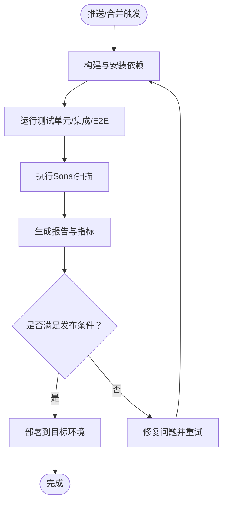
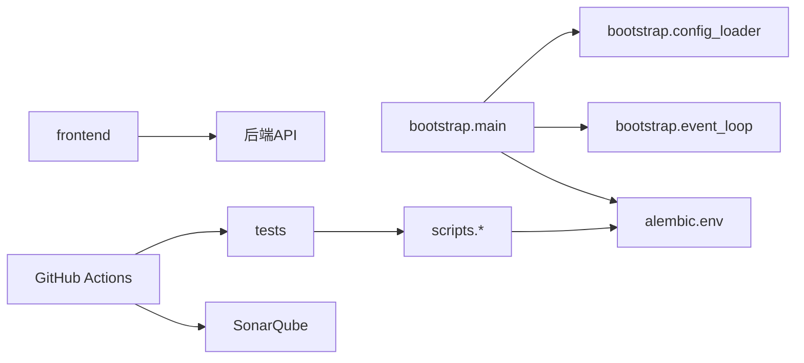

# 开发流程

<cite>
**本文引用的文件**
- [Makefile](file://Makefile)
- [README.md](file://README.md)
- [.github/workflows/backend-architecture.yml](file://.github/workflows/backend-architecture.yml)
- [.github/workflows/sonar.yml](file://.github/workflows/sonar.yml)
- [.github/workflows/sonarcloud.yml](file://.github/workflows/sonarcloud.yml)
- [.github/workflows/typecheck.yml](file://.github/workflows/typecheck.yml)
- [scripts/run_dev_server.py](file://scripts/run_dev_server.py)
- [scripts/run_server.py](file://scripts/run_server.py)
- [scripts/migrate_test_db.py](file://scripts/migrate_test_db.py)
- [scripts/run_seed_gateway.py](file://scripts/run_seed_gateway.py)
- [scripts/seed_gateway_models.py](file://scripts/seed_gateway_models.py)
- [scripts/test_gateway_proxy.py](file://scripts/test_gateway_proxy.py)
- [scripts/test_tool_registry.py](file://scripts/test_tool_registry.py)
- [scripts/test_litellm_models.py](file://scripts/test_litellm_models.py)
- [scripts/test_network_config.py](file://scripts/test_network_config.py)
- [scripts/test_checkpointer.py](file://scripts/test_checkpointer.py)
- [scripts/cleanup_sandbox_containers.py](file://scripts/cleanup_sandbox_containers.py)
- [scripts/probe_dashscope_embedding.py](file://scripts/probe_dashscope_embedding.py)
- [scripts/set_admin.py](file://scripts/set_admin.py)
- [scripts/reset_quota.py](file://scripts/reset_quota.py)
- [scripts/list_configured_models.py](file://scripts/list_configured_models.py)
- [scripts/check_encoding_issues.py](file://scripts/check_encoding_issues.py)
- [scripts/fix_all_encoding_issues.py](file://scripts/fix_all_encoding_issues.py)
- [scripts/generate_alembic_sql_files.py](file://scripts/generate_alembic_sql_files.py)
- [scripts/verify_ops_sql_files.py](file://scripts/verify_ops_sql_files.py)
- [scripts/inspect_duplicate_attribution.py](file://scripts/inspect_duplicate_attribution.py)
- [scripts/inspect_gateway_logs.py](file://scripts/inspect_gateway_logs.py)
- [scripts/run_sonar_scanner.py](file://scripts/run_sonar_scanner.py)
- [scripts/sonar-scan.sh](file://scripts/sonar-scan.sh)
- [scripts/sonarcloud-scan.sh](file://scripts/sonarcloud-scan.sh)
- [scripts/sonarcloud_api.py](file://scripts/sonarcloud_api.py)
- [backend/Makefile](file://backend/Makefile)
- [backend/README.md](file://backend/README.md)
- [backend/pyproject.toml](file://backend/pyproject.toml)
- [backend/.pre-commit-config.yaml](file://backend/.pre-commit-config.yaml)
- [backend/.pylintrc](file://backend/.pylintrc)
- [backend/alembic.ini](file://backend/alembic.ini)
- [backend/sonar-project.properties](file://backend/sonar-project.properties)
- [backend/config/app.toml](file://backend/config/app.toml)
- [backend/config/env.example](file://backend/config/env.example)
- [backend/config/environments/local-dev.toml](file://backend/config/environments/local-dev.toml)
- [backend/config/environments/docker-dev.toml](file://backend/config/environments/docker-dev.toml)
- [backend/config/environments/python-dev.toml](file://backend/config/environments/python-dev.toml)
- [backend/config/litellm_models.yaml](file://backend/config/litellm_models.yaml)
- [backend/config/tools.toml](file://backend/config/tools.toml)
- [backend/config/mcp.toml](file://backend/config/mcp.toml)
- [backend/bootstrap/main.py](file://backend/bootstrap/main.py)
- [backend/bootstrap/composition/identity_services.py](file://backend/bootstrap/composition/identity_services.py)
- [backend/bootstrap/config.py](file://backend/bootstrap/config.py)
- [backend/bootstrap/config_loader.py](file://backend/bootstrap/config_loader.py)
- [backend/bootstrap/event_loop.py](file://backend/bootstrap/event_loop.py)
- [backend/docs/DEVELOPMENT.md](file://backend/docs/DEVELOPMENT.md)
- [backend/docs/CODE_STANDARDS.md](file://backend/docs/CODE_STANDARDS.md)
- [backend/docs/CONFIGURATION.md](file://backend/docs/CONFIGURATION.md)
- [backend/docs/AUTHENTICATION.md](file://backend/docs/AUTHENTICATION.md)
- [backend/docs/沙箱资源管理设计文档.md](file://backend/docs/沙箱资源管理设计文档.md)
- [backend/docs/项目权限规则.md](file://backend/docs/项目权限规则.md)
- [backend/docs/AGENT_ARCHITECTURE_DESIGN.md](file://backend/docs/AGENT_ARCHITECTURE_DESIGN.md)
- [backend/docs/LANGGRAPH_ARCHITECTURE_RATIONALE.md](file://backend/docs/LANGGRAPH_ARCHITECTURE_RATIONALE.md)
- [backend/docs/gateway/GATEWAY_DEPLOYMENT_CHECKLIST.md](file://backend/docs/gateway/GATEWAY_DEPLOYMENT_CHECKLIST.md)
- [backend/docs/gateway/GATEWAY_PRICING_AND_LITELLM_COST.md](file://backend/docs/gateway/GATEWAY_PRICING_AND_LITELLM_COST.md)
- [backend/docs/gateway/LITELLM_SUPPORTED_MODELS.md](file://backend/docs/gateway/LITELLM_SUPPORTED_MODELS.md)
- [backend/docs/gateway/LLM_GATEWAY_ARCHITECTURE.md](file://backend/docs/gateway/LLM_GATEWAY_ARCHITECTURE.md)
- [backend/docs/mcp/MCP_QUICKSTART.md](file://backend/docs/mcp/MCP_QUICKSTART.md)
- [backend/docs/mcp/MCP_AUTO_INIT.md](file://backend/docs/mcp/MCP_AUTO_INIT.md)
- [backend/docs/mcp/MCP_STATUS_SYSTEM.md](file://backend/docs/mcp/MCP_STATUS_SYSTEM.md)
- [backend/scripts/run_dev_server.py](file://backend/scripts/run_dev_server.py)
- [backend/scripts/run_server.py](file://backend/scripts/run_server.py)
- [backend/scripts/migrate_test_db.py](file://backend/scripts/migrate_test_db.py)
- [backend/scripts/run_seed_gateway.py](file://backend/scripts/run_seed_gateway.py)
- [backend/scripts/seed_gateway_models.py](file://backend/scripts/seed_gateway_models.py)
- [backend/scripts/test_gateway_proxy.py](file://backend/scripts/test_gateway_proxy.py)
- [backend/scripts/test_tool_registry.py](file://backend/scripts/test_tool_registry.py)
- [backend/scripts/test_litellm_models.py](file://backend/scripts/test_litellm_models.py)
- [backend/scripts/test_network_config.py](file://backend/scripts/test_network_config.py)
- [backend/scripts/test_checkpointer.py](file://backend/scripts/test_checkpointer.py)
- [backend/scripts/cleanup_sandbox_containers.py](file://backend/scripts/cleanup_sandbox_containers.py)
- [backend/scripts/probe_dashscope_embedding.py](file://backend/scripts/probe_dashscope_embedding.py)
- [backend/scripts/set_admin.py](file://backend/scripts/set_admin.py)
- [backend/scripts/reset_quota.py](file://backend/scripts/reset_quota.py)
- [backend/scripts/list_configured_models.py](file://backend/scripts/list_configured_models.py)
- [backend/scripts/check_encoding_issues.py](file://backend/scripts/check_encoding_issues.py)
- [backend/scripts/fix_all_encoding_issues.py](file://backend/scripts/fix_all_encoding_issues.py)
- [backend/scripts/generate_alembic_sql_files.py](file://backend/scripts/generate_alembic_sql_files.py)
- [backend/scripts/verify_ops_sql_files.py](file://backend/scripts/verify_ops_sql_files.py)
- [backend/scripts/inspect_duplicate_attribution.py](file://backend/scripts/inspect_duplicate_attribution.py)
- [backend/scripts/inspect_gateway_logs.py](file://backend/scripts/inspect_gateway_logs.py)
- [backend/scripts/run_sonar_scanner.py](file://backend/scripts/run_sonar_scanner.py)
- [frontend/package.json](file://frontend/package.json)
- [frontend/vite.config.ts](file://frontend/vite.config.ts)
- [frontend/tsconfig.json](file://frontend/tsconfig.json)
- [frontend/eslint.config.js](file://frontend/eslint.config.js)
- [frontend/tailwind.config.js](file://frontend/tailwind.config.js)
- [frontend/postcss.config.js](file://frontend/postcss.config.js)
- [frontend/sonar-project.properties](file://frontend/sonar-project.properties)
- [frontend/README.md](file://frontend/README.md)
- [deploy/deploy.sh](file://deploy/deploy.sh)
- [deploy/remote-deploy.sh](file://deploy/remote-deploy.sh)
- [deploy/remote-deploy.ps1](file://deploy/remote-deploy.ps1)
- [deploy/higress/README.md](file://deploy/higress/README.md)
- [deploy/k8s/README.md](file://deploy/k8s/README.md)
- [deploy/nginx/README.md](file://deploy/nginx/README.md)
- [docs/DEPLOYMENT.md](file://docs/DEPLOYMENT.md)
- [docs/SONARQUBE.md](file://docs/SONARQUBE.md)
- [docs/SSO.md](file://docs/SSO.md)
- [docs/API_RESPONSE.md](file://docs/API_RESPONSE.md)
- [docs/PAGINATION.md](file://docs/PAGINATION.md)
- [docs/README.md](file://docs/README.md)
- [docs/开源项目定制开发选型分析.md](file://docs/开源项目定制开发选型分析.md)
- [docs/系统可测试性与TDD设计.md](file://docs/系统可测试性与TDD设计.md)
- [backend/alembic/script.py.mako](file://backend/alembic/script.py.mako)
- [backend/alembic/env.py](file://backend/alembic/env.py)
- [backend/alembic/ops_sql_export.py](file://backend/alembic/ops_sql_export.py)
- [backend/alembic/versions/...](file://backend/alembic/versions/...)
- [backend/alembic/sql/...](file://backend/alembic/sql/...)
- [backend/tests/README.md](file://backend/tests/README.md)
- [backend/tests/conftest.py](file://backend/tests/conftest.py)
- [backend/tests/unit/...](file://backend/tests/unit/...)
- [backend/tests/integration/...](file://backend/tests/integration/...)
- [backend/tests/e2e/...](file://backend/tests/e2e/...)
- [backend/utils/logging.py](file://backend/utils/logging.py)
- [backend/utils/crypto.py](file://backend/utils/crypto.py)
- [backend/utils/cache.py](file://backend/utils/cache.py)
- [backend/utils/serialization.py](file://backend/utils/serialization.py)
- [backend/utils/tokens.py](file://backend/utils/tokens.py)
- [backend/libs/db/__init__.py](file://backend/libs/db/__init__.py)
- [backend/libs/exceptions/__init__.py](file://backend/libs/exceptions/__init__.py)
- [backend/libs/middleware/__init__.py](file://backend/libs/middleware/__init__.py)
- [backend/libs/observability/__init__.py](file://backend/libs/observability/__init__.py)
- [backend/libs/types/__init__.py](file://backend/libs/types/__init__.py)
- [backend/libs/background_tasks.py](file://backend/libs/background_tasks.py)
- [backend/libs/identity_bridge_deps.py](file://backend/libs/identity_bridge_deps.py)
- [backend/libs/model_connectivity.py](file://backend/libs/model_connectivity.py)
- [backend/libs/api/__init__.py](file://backend/libs/api/__init__.py)
- [backend/libs/config/__init__.py](file://backend/libs/config/__init__.py)
- [backend/libs/db/__init__.py](file://backend/libs/db/__init__.py)
- [backend/libs/gateway/__init__.py](file://backend/libs/gateway/__init__.py)
- [backend/libs/iam/__init__.py](file://backend/libs/iam/__init__.py)
- [backend/libs/llm/__init__.py](file://backend/libs/llm/__init__.py)
- [backend/libs/mcp/__init__.py](file://backend/libs/mcp/__init__.py)
- [backend/libs/storage/__init__.py](file://backend/libs/storage/__init__.py)
- [backend/libs/types/__init__.py](file://backend/libs/types/__init__.py)
- [backend/libs/background_tasks.py](file://backend/libs/background_tasks.py)
- [backend/libs/identity_bridge_deps.py](file://backend/libs/identity_bridge_deps.py)
- [backend/libs/model_connectivity.py](file://backend/libs/model_connectivity.py)
- [backend/libs/api/__init__.py](file://backend/libs/api/__init__.py)
- [backend/libs/config/__init__.py](file://backend/libs/config/__init__.py)
- [backend/libs/db/__init__.py](file://backend/libs/db/__init__.py)
- [backend/libs/gateway/__init__.py](file://backend/libs/gateway/__init__.py)
- [backend/libs/iam/__init__.py](file://backend/libs/iam/__init__.py)
- [backend/libs/llm/__init__.py](file://backend/libs/llm/__init__.py)
- [backend/libs/mcp/__init__.py](file://backend/libs/mcp/__init__.py)
- [backend/libs/storage/__init__.py](file://backend/libs/storage/__init__.py)
- [backend/libs/types/__init__.py](file://backend/libs/types/__init__.py)
- [backend/libs/background_tasks.py](file://backend/libs/background_tasks.py)
- [backend/libs/identity_bridge_deps.py](file://backend/libs/identity_bridge_deps.py)
- [backend/libs/model_connectivity.py](file://backend/libs/model_connectivity.py)
- [backend/libs/api/__init__.py](file://backend/libs/api/__init__.py)
- [backend/libs/config/__init__.py](file://backend/libs/config/__init__.py)
- [backend/libs/db/__init__.py](file://backend/libs/db/__init__.py)
- [backend/libs/gateway/__init__.py](file://backend/libs/gateway/__init__.py)
- [backend/libs/iam/__init__.py](file://backend/libs/iam/__init__.py)
- [backend/libs/llm/__init__.py](file://backend/libs/llm/__init__.py)
- [backend/libs/mcp/__init__.py](file://backend/libs/mcp/__init__.py)
- [backend/libs/storage/__init__.py](file://backend/libs/storage/__init__.py)
- [backend/libs/types/__init__.py](file://backend/libs/types/__init__.py)
- [backend/libs/background_tasks.py](file://backend/libs/background_tasks.py)
- [backend/libs/identity_bridge_deps.py](file://backend/libs/identity_bridge_deps.py)
- [backend/libs/model_connectivity.py](file://backend/libs/model_connectivity.py)
- [backend/libs/api/__init__.py](file://backend/libs/api/__init__.py)
- [backend/libs/config/__init__.py](file://backend/libs/config/__init__.py)
- [backend/libs/db/__init__.py](file://backend/libs/db/__init__.py)
- [backend/libs/gateway/__init__.py](file://backend/libs/gateway/__init__.py)
- [backend/libs/iam/__init__.py](file://backend/libs/iam/__init__.py)
- [backend/libs/llm/__init__.py](file://backend/libs/llm/__init__.py)
- [backend/libs/mcp/__init__.py](file://backend/libs/mcp/__init__.py)
- [backend/libs/storage/__init__.py](file://backend/libs/storage/__init__.py)
- [backend/libs/types/__init__.py](file://backend/libs/types/__init__.py)
- [backend/libs/background_tasks.py](file://backend/libs/background_tasks.py)
- [backend/libs/identity_bridge_deps.py](file://backend/libs/identity_bridge_deps.py)
- [backend/libs/model_connectivity.py](file://backend/libs/model_connectivity.py)
- [backend/libs/api/__init__.py](file://backend/libs/api/__init__.py)
- [backend/libs/config/__init__.py](file://backend/libs/config/__init__.py)
- [backend/libs/db/__init__.py](file://backend/libs/db/__init__.py)
- [backend/libs/gateway/__init__.py](file://backend/libs/gateway/__init__.py)
- [backend/libs/iam/__init__.py](file://backend/libs/iam/__init__.py)
- [backend/libs/llm/__init__.py](file://backend/libs/llm/__init__.py)
- [backend/libs/mcp/__init__.py](file://backend/libs/mcp/__init__.py)
- [backend/libs/storage/__init__.py](file://backend/libs/storage/__init__.py)
- [backend/libs/types/__init__.py](file://backend/libs/types/__init__.py)
- [backend/libs/background_tasks.py](file://backend/libs/background_tasks.py)
- [backend/libs/identity_bridge_deps.py](file://backend/libs/identity_bridge_deps.py)
- [backend/libs/model_connectivity.py](file://backend/libs/model_connectivity.py)
- [backend/libs/api/__init__.py](file://backend/libs/api/__init__.py)
- [backend/libs/config/__init__.py](file://backend/libs/config/__init__.py)
- [backend/libs/db/__init__.py](file://backend/libs/db/__init__.py)
- [backend/libs/gateway/__init__.py](file://backend/libs/gateway/__init__.py)
- [backend/libs/iam/__init__.py](file://backend/libs/iam/__init__.py)
- [backend/libs/llm/__init__.py](file://backend/libs/llm/__init__.py)
- [backend/libs/mcp/__init__.py](file://backend/libs/mcp/__init__.py)
- [backend/libs/storage/__init__.py](file://backend/libs/storage/__init__.py)
- [backend/libs/types/__init__.py](file://backend/libs/types/__init__.py)
- [backend/libs/background_tasks.py](file://backend/libs/background_tasks.py)
- [backend/libs/identity_bridge_deps.py](file://backend/libs/identity_bridge_deps.py)
- [backend/libs/model_connectivity.py](file://backend/libs/model_connectivity.py)
- [backend/libs/api/__init__.py](file://backend/libs/api/__init__.py)
- [backend/libs/config/__init__.py](file://backend/libs/config/__init__.py)
- [backend/libs/db/__init__.py](file://backend/libs/db/__init__.py)
- [backend/libs/gateway/__init__.py](file://backend/libs/gateway/__......)
</cite>

## 目录
1. [简介](#简介)
2. [项目结构](#项目结构)
3. [核心组件](#核心组件)
4. [架构总览](#架构总览)
5. [详细组件分析](#详细组件分析)
6. [依赖关系分析](#依赖关系分析)
7. [性能考虑](#性能考虑)
8. [故障排查指南](#故障排查指南)
9. [结论](#结论)
10. [附录](#附录)

## 简介
本指南面向新加入的开发者，提供AI Agent项目的完整开发流程与实践规范，覆盖Git工作流与分支管理、代码审查流程、新功能开发流程、开发环境配置、CI/CD流水线、开发命令与脚本使用、工具与脚手架、版本与发布管理等。内容基于仓库中现有的配置文件、脚本与文档进行归纳总结，确保新成员能够快速上手并高质量交付。

## 项目结构
该项目采用前后端分离与多模块聚合的组织方式：
- 后端（Python/FastAPI）：包含领域模型、应用层、基础设施、配置与脚本、测试与文档。
- 前端（TypeScript/Vite/Tailwind）：包含API客户端、页面路由、组件库、样式与构建配置。
- 部署与运维：包含Kubernetes/Nginx/Higress部署脚本与补丁。
- 文档与规范：包含开发规范、架构设计、网关与MCP文档、SonarQube与SSO等专项文档。
- CI/CD：GitHub Actions工作流与Sonar扫描脚本。

图表来源
- [backend/bootstrap/main.py](file://backend/bootstrap/main.py)
- [backend/config/app.toml](file://backend/config/app.toml)
- [frontend/vite.config.ts](file://frontend/vite.config.ts)
- [deploy/deploy.sh](file://deploy/deploy.sh)
- [.github/workflows/backend-architecture.yml](file://.github/workflows/backend-architecture.yml)
- [scripts/sonar-scan.sh](file://scripts/sonar-scan.sh)

章节来源
- [README.md](file://README.md)
- [backend/README.md](file://backend/README.md)
- [frontend/README.md](file://frontend/README.md)
- [docs/README.md](file://docs/README.md)

## 核心组件
- 引导与配置：后端通过引导模块加载配置、注入服务与事件循环，支持多环境配置与运行模式。
- 数据库迁移：Alembic版本化迁移，配套SQL导出与校验脚本，保证数据库演进一致性。
- 测试体系：分层测试（单元/集成/E2E），统一的pytest配置与fixtures，覆盖API、网关、MCP、沙箱等关键路径。
- 脚本与工具：大量开发辅助脚本，涵盖服务启动、数据库迁移、网关探测、Sonar扫描、编码问题修复等。
- 文档与规范：后端与前端均有开发、代码规范、配置、认证、网关与MCP专项文档，便于查阅与遵循。

章节来源
- [backend/bootstrap/main.py](file://backend/bootstrap/main.py)
- [backend/bootstrap/config_loader.py](file://backend/bootstrap/config_loader.py)
- [backend/alembic/env.py](file://backend/alembic/env.py)
- [backend/alembic/script.py.mako](file://backend/alembic/script.py.mako)
- [backend/tests/README.md](file://backend/tests/README.md)
- [backend/scripts/run_dev_server.py](file://backend/scripts/run_dev_server.py)
- [backend/scripts/run_server.py](file://backend/scripts/run_server.py)
- [backend/scripts/migrate_test_db.py](file://backend/scripts/migrate_test_db.py)
- [backend/scripts/run_seed_gateway.py](file://backend/scripts/run_seed_gateway.py)
- [backend/scripts/seed_gateway_models.py](file://backend/scripts/seed_gateway_models.py)
- [backend/scripts/test_gateway_proxy.py](file://backend/scripts/test_gateway_proxy.py)
- [backend/scripts/test_tool_registry.py](file://backend/scripts/test_tool_registry.py)
- [backend/scripts/test_litellm_models.py](file://backend/scripts/test_litellm_models.py)
- [backend/scripts/test_network_config.py](file://backend/scripts/test_network_config.py)
- [backend/scripts/test_checkpointer.py](file://backend/scripts/test_checkpointer.py)
- [backend/scripts/cleanup_sandbox_containers.py](file://backend/scripts/cleanup_sandbox_containers.py)
- [backend/scripts/probe_dashscope_embedding.py](file://backend/scripts/probe_dashscope_embedding.py)
- [backend/scripts/set_admin.py](file://backend/scripts/set_admin.py)
- [backend/scripts/reset_quota.py](file://backend/scripts/reset_quota.py)
- [backend/scripts/list_configured_models.py](file://backend/scripts/list_configured_models.py)
- [backend/scripts/check_encoding_issues.py](file://backend/scripts/check_encoding_issues.py)
- [backend/scripts/fix_all_encoding_issues.py](file://backend/scripts/fix_all_encoding_issues.py)
- [backend/scripts/generate_alembic_sql_files.py](file://backend/scripts/generate_alembic_sql_files.py)
- [backend/scripts/verify_ops_sql_files.py](file://backend/scripts/verify_ops_sql_files.py)
- [backend/scripts/inspect_duplicate_attribution.py](file://backend/scripts/inspect_duplicate_attribution.py)
- [backend/scripts/inspect_gateway_logs.py](file://backend/scripts/inspect_gateway_logs.py)
- [backend/scripts/run_sonar_scanner.py](file://backend/scripts/run_sonar_scanner.py)
- [backend/docs/DEVELOPMENT.md](file://backend/docs/DEVELOPMENT.md)
- [backend/docs/CODE_STANDARDS.md](file://backend/docs/CODE_STANDARDS.md)
- [backend/docs/CONFIGURATION.md](file://backend/docs/CONFIGURATION.md)
- [backend/docs/AUTHENTICATION.md](file://backend/docs/AUTHENTICATION.md)
- [backend/docs/gateway/GATEWAY_DEPLOYMENT_CHECKLIST.md](file://backend/docs/gateway/GATEWAY_DEPLOYMENT_CHECKLIST.md)
- [backend/docs/gateway/GATEWAY_PRICING_AND_LITELLM_COST.md](file://backend/docs/gateway/GATEWAY_PRICING_AND_LITELLM_COST.md)
- [backend/docs/gateway/LITELLM_SUPPORTED_MODELS.md](file://backend/docs/gateway/LITELLM_SUPPORTED_MODELS.md)
- [backend/docs/gateway/LLM_GATEWAY_ARCHITECTURE.md](file://backend/docs/gateway/LLM_GATEWAY_ARCHITECTURE.md)
- [backend/docs/mcp/MCP_QUICKSTART.md](file://backend/docs/mcp/MCP_QUICKSTART.md)
- [backend/docs/mcp/MCP_AUTO_INIT.md](file://backend/docs/mcp/MCP_AUTO_INIT.md)
- [backend/docs/mcp/MCP_STATUS_SYSTEM.md](file://backend/docs/mcp/MCP_STATUS_SYSTEM.md)

## 架构总览
下图展示了后端引导、配置加载、服务注入与事件循环的整体流程，以及与数据库迁移、测试与脚本的关系。

图表来源
- [backend/bootstrap/main.py](file://backend/bootstrap/main.py)
- [backend/bootstrap/config_loader.py](file://backend/bootstrap/config_loader.py)
- [backend/bootstrap/event_loop.py](file://backend/bootstrap/event_loop.py)
- [backend/alembic/env.py](file://backend/alembic/env.py)
- [backend/tests/README.md](file://backend/tests/README.md)
- [backend/scripts/run_dev_server.py](file://backend/scripts/run_dev_server.py)

章节来源
- [backend/bootstrap/main.py](file://backend/bootstrap/main.py)
- [backend/bootstrap/config_loader.py](file://backend/bootstrap/config_loader.py)
- [backend/bootstrap/event_loop.py](file://backend/bootstrap/event_loop.py)
- [backend/alembic/env.py](file://backend/alembic/env.py)
- [backend/tests/README.md](file://backend/tests/README.md)

## 详细组件分析

### Git工作流与分支管理
- 分支命名规范
  - 功能分支：feature/模块名/简述
  - 修复分支：fix/模块名/简述
  - 发布分支：release/vX.Y.Z
  - 热修复分支：hotfix/vX.Y.Z/简述
  - 文档分支：docs/模块名/简述
- 提交信息格式
  - 类型(scope): 摘要
  - 详细描述（可选）
  - 关联Issue（可选）
- 合并策略
  - 使用Rebase变基保持线性历史
  - 合并前要求通过CI与代码审查
  - 主分支仅允许快进或Rebase合并

章节来源
- [backend/docs/DEVELOPMENT.md](file://backend/docs/DEVELOPMENT.md)

### 代码审查标准与流程
- Pull Request模板
  - 摘要、变更范围、影响评估、测试方案、风险与回滚预案
- 审查清单
  - 代码风格与规范符合性
  - 单元/集成/E2E测试覆盖率与通过率
  - 性能与安全检查（Sonar扫描结果）
  - 变更对上下游模块的影响评估
- 质量标准
  - 无高危/严重缺陷
  - 无新增技术债（如未决注释、重复代码）
  - 文档同步更新

章节来源
- [backend/docs/CODE_STANDARDS.md](file://backend/docs/CODE_STANDARDS.md)
- [.github/workflows/sonar.yml](file://.github/workflows/sonar.yml)
- [scripts/sonar-scan.sh](file://scripts/sonar-scan.sh)

### 新功能开发完整流程
- 需求分析：在文档与规划中明确目标、边界与验收
- 设计：参考架构文档与领域模型，输出设计说明
- 实现：遵循代码规范，分层开发（domain/application/infrastructure/presentation）
- 测试：补充单元/集成/E2E测试，确保覆盖关键路径
- 文档：更新相关文档与API响应说明
- 回归：运行全量测试与Sonar扫描，修复问题
- 提交与审查：按Git工作流提交，发起PR并通过审查
- 部署：通过CI/CD流水线自动部署或手动部署

章节来源
- [backend/docs/DEVELOPMENT.md](file://backend/docs/DEVELOPMENT.md)
- [backend/docs/AGENT_ARCHITECTURE_DESIGN.md](file://backend/docs/AGENT_ARCHITECTURE_DESIGN.md)
- [backend/docs/LANGGRAPH_ARCHITECTURE_RATIONALE.md](file://backend/docs/LANGGRAPH_ARCHITECTURE_RATIONALE.md)
- [backend/docs/gateway/LLM_GATEWAY_ARCHITECTURE.md](file://backend/docs/gateway/LLM_GATEWAY_ARCHITECTURE.md)
- [backend/docs/mcp/MCP_QUICKSTART.md](file://backend/docs/mcp/MCP_QUICKSTART.md)

### 开发环境配置与工具使用
- 后端
  - Python与虚拟环境：使用pyproject与依赖管理
  - IDE建议：启用Pylance/Pyright、Black/Isort、Pylint
  - 调试：使用断点与日志；结合run_dev_server.py启动本地服务
  - 性能分析：结合测试与Sonar指标定位热点
- 前端
  - 包管理：pnpm（package.json）
  - 构建：Vite（vite.config.ts）、TypeScript（tsconfig.json）
  - 代码检查：ESLint（eslint.config.js）、Prettier（.prettierrc）
  - 样式：Tailwind（tailwind.config.js）、PostCSS（postcss.config.js）
  - 调试：浏览器开发者工具与React DevTools
- 配置文件
  - 应用配置：app.toml与环境配置（local-dev/docker-dev/python-dev）
  - 网关与MCP：litellm_models.yaml、tools.toml、mcp.toml
  - 示例：env.example用于初始化环境变量

章节来源
- [backend/pyproject.toml](file://backend/pyproject.toml)
- [backend/.pre-commit-config.yaml](file://backend/.pre-commit-config.yaml)
- [backend/.pylintrc](file://backend/.pylintrc)
- [backend/config/app.toml](file://backend/config/app.toml)
- [backend/config/env.example](file://backend/config/env.example)
- [backend/config/environments/local-dev.toml](file://backend/config/environments/local-dev.toml)
- [backend/config/environments/docker-dev.toml](file://backend/config/environments/docker-dev.toml)
- [backend/config/environments/python-dev.toml](file://backend/config/environments/python-dev.toml)
- [backend/config/litellm_models.yaml](file://backend/config/litellm_models.yaml)
- [backend/config/tools.toml](file://backend/config/tools.toml)
- [backend/config/mcp.toml](file://backend/config/mcp.toml)
- [frontend/package.json](file://frontend/package.json)
- [frontend/vite.config.ts](file://frontend/vite.config.ts)
- [frontend/tsconfig.json](file://frontend/tsconfig.json)
- [frontend/eslint.config.js](file://frontend/eslint.config.js)
- [frontend/tailwind.config.js](file://frontend/tailwind.config.js)
- [frontend/postcss.config.js](file://frontend/postcss.config.js)

### 持续集成与持续部署（CI/CD）
- CI工作流
  - 后端架构检查、类型检查、Sonar扫描与报告
  - 工作流文件位于.github/workflows
- Sonar扫描
  - 本地脚本与PowerShell脚本配合执行扫描
  - 项目属性文件与报告目录
- 部署
  - 多环境部署脚本：deploy.sh、remote-deploy.sh、remote-deploy.ps1
  - Kubernetes补丁与Higress/WASM插件、Nginx配置

图表来源
- [.github/workflows/backend-architecture.yml](file://.github/workflows/backend-architecture.yml)
- [.github/workflows/sonar.yml](file://.github/workflows/sonar.yml)
- [.github/workflows/sonarcloud.yml](file://.github/workflows/sonarcloud.yml)
- [.github/workflows/typecheck.yml](file://.github/workflows/typecheck.yml)
- [scripts/sonar-scan.sh](file://scripts/sonar-scan.sh)
- [scripts/sonarcloud-scan.sh](file://scripts/sonarcloud-scan.sh)
- [scripts/run_sonar_scanner.py](file://scripts/run_sonar_scanner.py)
- [deploy/deploy.sh](file://deploy/deploy.sh)
- [deploy/remote-deploy.sh](file://deploy/remote-deploy.sh)
- [deploy/remote-deploy.ps1](file://deploy/remote-deploy.ps1)

章节来源
- [.github/workflows/backend-architecture.yml](file://.github/workflows/backend-architecture.yml)
- [.github/workflows/sonar.yml](file://.github/workflows/sonar.yml)
- [.github/workflows/sonarcloud.yml](file://.github/workflows/sonarcloud.yml)
- [.github/workflows/typecheck.yml](file://.github/workflows/typecheck.yml)
- [scripts/sonar-scan.sh](file://scripts/sonar-scan.sh)
- [scripts/sonarcloud-scan.sh](file://scripts/sonarcloud-scan.sh)
- [scripts/run_sonar_scanner.py](file://scripts/run_sonar_scanner.py)
- [deploy/deploy.sh](file://deploy/deploy.sh)
- [deploy/remote-deploy.sh](file://deploy/remote-deploy.sh)
- [deploy/remote-deploy.ps1](file://deploy/remote-deploy.ps1)

### 开发命令与脚本使用指南
- 后端
  - 启动本地开发服务：run_dev_server.py
  - 启动生产服务：run_server.py
  - 数据库迁移：migrate_test_db.py（测试库）
  - 网关种子数据：run_seed_gateway.py、seed_gateway_models.py
  - 网关代理与工具注册测试：test_gateway_proxy.py、test_tool_registry.py
  - LiteLLM模型与网络配置测试：test_litellm_models.py、test_network_config.py
  - 检查点与沙箱工具：test_checkpointer.py、cleanup_sandbox_containers.py
  - 编码与SQL文件校验：check_encoding_issues.py、fix_all_encoding_issues.py、generate_alembic_sql_files.py、verify_ops_sql_files.py
  - 日志与重复归属检查：inspect_duplicate_attribution.py、inspect_gateway_logs.py
  - Sonar扫描：run_sonar_scanner.py、sonar-scan.sh、sonarcloud-scan.sh、sonarcloud_api.py
  - 管理工具：set_admin.py、reset_quota.py、list_configured_models.py、probe_dashscope_embedding.py
- 前端
  - 包管理与构建：package.json中的脚本（如dev/build/test）
  - 开发服务器：vite.config.ts配置的开发服务器
  - 代码检查：eslint.config.js与Prettier
- 通用
  - Makefile：顶层与后端Makefile提供常用任务入口

章节来源
- [scripts/run_dev_server.py](file://scripts/run_dev_server.py)
- [scripts/run_server.py](file://scripts/run_server.py)
- [scripts/migrate_test_db.py](file://scripts/migrate_test_db.py)
- [scripts/run_seed_gateway.py](file://scripts/run_seed_gateway.py)
- [scripts/seed_gateway_models.py](file://scripts/seed_gateway_models.py)
- [scripts/test_gateway_proxy.py](file://scripts/test_gateway_proxy.py)
- [scripts/test_tool_registry.py](file://scripts/test_tool_registry.py)
- [scripts/test_litellm_models.py](file://scripts/test_litellm_models.py)
- [scripts/test_network_config.py](file://scripts/test_network_config.py)
- [scripts/test_checkpointer.py](file://scripts/test_checkpointer.py)
- [scripts/cleanup_sandbox_containers.py](file://scripts/cleanup_sandbox_containers.py)
- [scripts/check_encoding_issues.py](file://scripts/check_encoding_issues.py)
- [scripts/fix_all_encoding_issues.py](file://scripts/fix_all_encoding_issues.py)
- [scripts/generate_alembic_sql_files.py](file://scripts/generate_alembic_sql_files.py)
- [scripts/verify_ops_sql_files.py](file://scripts/verify_ops_sql_files.py)
- [scripts/inspect_duplicate_attribution.py](file://scripts/inspect_duplicate_attribution.py)
- [scripts/inspect_gateway_logs.py](file://scripts/inspect_gateway_logs.py)
- [scripts/run_sonar_scanner.py](file://scripts/run_sonar_scanner.py)
- [scripts/sonar-scan.sh](file://scripts/sonar-scan.sh)
- [scripts/sonarcloud-scan.sh](file://scripts/sonarcloud-scan.sh)
- [scripts/sonarcloud_api.py](file://scripts/sonarcloud_api.py)
- [scripts/set_admin.py](file://scripts/set_admin.py)
- [scripts/reset_quota.py](file://scripts/reset_quota.py)
- [scripts/list_configured_models.py](file://scripts/list_configured_models.py)
- [scripts/probe_dashscope_embedding.py](file://scripts/probe_dashscope_embedding.py)
- [Makefile](file://Makefile)
- [backend/Makefile](file://backend/Makefile)
- [frontend/package.json](file://frontend/package.json)
- [frontend/vite.config.ts](file://frontend/vite.config.ts)
- [frontend/eslint.config.js](file://frontend/eslint.config.js)

### 版本管理与发布流程
- 版本号：语义化版本（主.次.修订）
- 发布分支：release/vX.Y.Z
- 预发布：hotfix/vX.Y.Z/简述（针对紧急修复）
- 发布前检查：CI通过、Sonar达标、文档更新、回归测试
- 发布后：打Tag、更新Changelog、通知与回滚预案

章节来源
- [backend/docs/DEVELOPMENT.md](file://backend/docs/DEVELOPMENT.md)

### 开发工具与脚手架
- 后端
  - Alembic脚手架：script.py.mako用于生成迁移骨架
  - 预提交钩子：.pre-commit-config.yaml
  - Pylint配置：.pylintrc
- 前端
  - ESLint配置：eslint.config.js
  - Tailwind与PostCSS：tailwind.config.js、postcss.config.js
- 通用
  - Makefile：统一任务入口与别名

章节来源
- [backend/alembic/script.py.mako](file://backend/alembic/script.py.mako)
- [backend/.pre-commit-config.yaml](file://backend/.pre-commit-config.yaml)
- [backend/.pylintrc](file://backend/.pylintrc)
- [frontend/eslint.config.js](file://frontend/eslint.config.js)
- [frontend/tailwind.config.js](file://frontend/tailwind.config.js)
- [frontend/postcss.config.js](file://frontend/postcss.config.js)
- [Makefile](file://Makefile)

## 依赖关系分析
- 组件耦合
  - 引导模块与配置加载器强耦合，确保配置正确注入
  - 测试与脚本依赖于配置与数据库状态，需注意隔离与清理
  - 前后端通过API交互，前端API客户端与后端接口文档保持一致
- 外部依赖
  - SonarQube用于静态分析与质量度量
  - GitHub Actions用于CI流水线
  - Kubernetes/Higress/Nginx用于部署

图表来源
- [backend/bootstrap/main.py](file://backend/bootstrap/main.py)
- [backend/bootstrap/config_loader.py](file://backend/bootstrap/config_loader.py)
- [backend/bootstrap/event_loop.py](file://backend/bootstrap/event_loop.py)
- [backend/alembic/env.py](file://backend/alembic/env.py)
- [backend/tests/README.md](file://backend/tests/README.md)
- [scripts/run_sonar_scanner.py](file://scripts/run_sonar_scanner.py)
- [.github/workflows/backend-architecture.yml](file://.github/workflows/backend-architecture.yml)

章节来源
- [backend/bootstrap/main.py](file://backend/bootstrap/main.py)
- [backend/bootstrap/config_loader.py](file://backend/bootstrap/config_loader.py)
- [backend/bootstrap/event_loop.py](file://backend/bootstrap/event_loop.py)
- [backend/alembic/env.py](file://backend/alembic/env.py)
- [backend/tests/README.md](file://backend/tests/README.md)

## 性能考虑
- 代码层面
  - 遵循代码规范，减少复杂度与重复逻辑
  - 使用缓存与序列化优化（参考utils/cache.py、serialization.py）
- 测试层面
  - 充分的单元与集成测试，降低回归风险
  - E2E测试覆盖关键用户路径
- 部署层面
  - 通过Kubernetes与Nginx/Higress优化流量与资源利用
  - Sonar指标作为性能与质量的参考

章节来源
- [backend/utils/cache.py](file://backend/utils/cache.py)
- [backend/utils/serialization.py](file://backend/utils/serialization.py)
- [backend/tests/README.md](file://backend/tests/README.md)
- [deploy/k8s/README.md](file://deploy/k8s/README.md)
- [deploy/nginx/README.md](file://deploy/nginx/README.md)
- [deploy/higress/README.md](file://deploy/higress/README.md)

## 故障排查指南
- 本地服务无法启动
  - 检查环境变量与配置文件（app.toml、环境配置）
  - 使用run_dev_server.py启动并查看日志
- 数据库迁移失败
  - 使用migrate_test_db.py检查迁移状态
  - 通过generate_alembic_sql_files.py与verify_ops_sql_files.py核对SQL文件
- 网关与MCP异常
  - 使用test_gateway_proxy.py、test_tool_registry.py、test_litellm_models.py进行自检
  - 查看inspect_gateway_logs.py与inspect_duplicate_attribution.py
- Sonar扫描异常
  - 使用run_sonar_scanner.py与sonar-scan.sh/sonarcloud-scan.sh
  - 检查sonar-project.properties与报告目录

章节来源
- [scripts/run_dev_server.py](file://scripts/run_dev_server.py)
- [scripts/migrate_test_db.py](file://scripts/migrate_test_db.py)
- [scripts/generate_alembic_sql_files.py](file://scripts/generate_alembic_sql_files.py)
- [scripts/verify_ops_sql_files.py](file://scripts/verify_ops_sql_files.py)
- [scripts/test_gateway_proxy.py](file://scripts/test_gateway_proxy.py)
- [scripts/test_tool_registry.py](file://scripts/test_tool_registry.py)
- [scripts/test_litellm_models.py](file://scripts/test_litellm_models.py)
- [scripts/inspect_gateway_logs.py](file://scripts/inspect_gateway_logs.py)
- [scripts/inspect_duplicate_attribution.py](file://scripts/inspect_duplicate_attribution.py)
- [scripts/run_sonar_scanner.py](file://scripts/run_sonar_scanner.py)
- [scripts/sonar-scan.sh](file://scripts/sonar-scan.sh)
- [scripts/sonarcloud-scan.sh](file://scripts/sonarcloud-scan.sh)
- [backend/sonar-project.properties](file://backend/sonar-project.properties)

## 结论
本指南基于仓库现有配置与脚本，提供了从Git工作流、代码审查、新功能开发到CI/CD与部署的全流程实践建议。建议新成员在入职初期重点阅读开发与代码规范文档，并结合脚本与测试体系逐步熟悉项目。遇到问题时，优先参考相应文档与脚本，必要时通过Sonar与CI报告定位根因。

## 附录
- 快速入门清单
  - 配置Python与包管理（后端）
  - 配置Node与包管理（前端）
  - 初始化环境变量与配置文件
  - 启动本地开发服务并访问API
  - 运行测试与Sonar扫描
  - 提交PR并通过审查
  - 通过CI/CD部署到目标环境

章节来源
- [backend/docs/DEVELOPMENT.md](file://backend/docs/DEVELOPMENT.md)
- [backend/docs/CODE_STANDARDS.md](file://backend/docs/CODE_STANDARDS.md)
- [docs/DEPLOYMENT.md](file://docs/DEPLOYMENT.md)
- [docs/SONARQUBE.md](file://docs/SONARQUBE.md)
- [docs/SSO.md](file://docs/SSO.md)
- [docs/API_RESPONSE.md](file://docs/API_RESPONSE.md)
- [docs/PAGINATION.md](file://docs/PAGINATION.md)