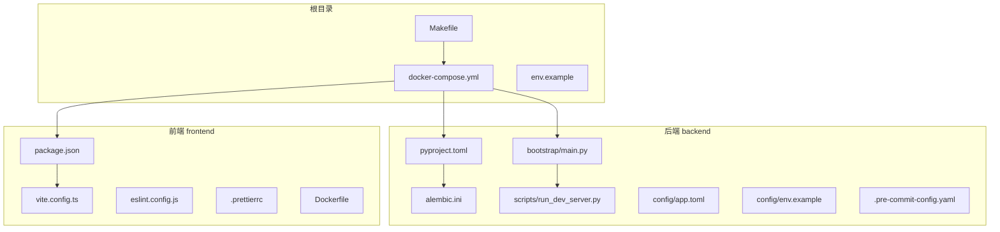
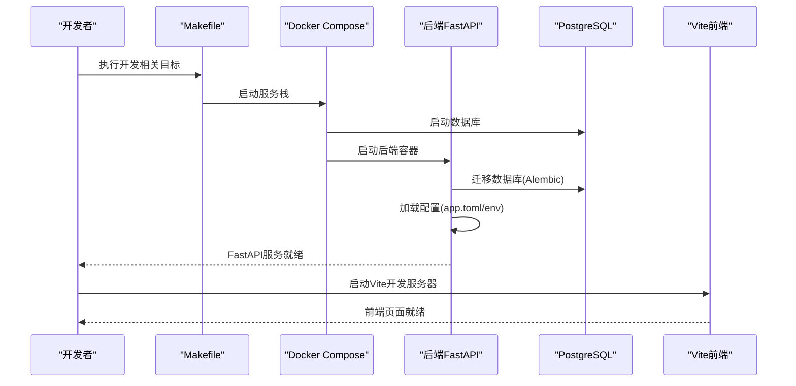
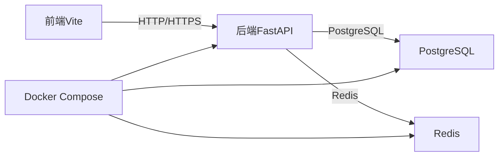

# 开发环境配置

<cite>
**本文档引用的文件**
- [Makefile](file://Makefile)
- [backend/Makefile](file://backend/Makefile)
- [backend/pyproject.toml](file://backend/pyproject.toml)
- [backend/Dockerfile](file://backend/Dockerfile)
- [backend/docker/sandbox/Dockerfile](file://backend/docker/sandbox/Dockerfile)
- [backend/alembic.ini](file://backend/alembic.ini)
- [backend/config/env.example](file://backend/config/env.example)
- [backend/config/environments/local-dev.toml](file://backend/config/environments/local-dev.toml)
- [backend/config/environments/python-dev.toml](file://backend/config/environments/python-dev.toml)
- [backend/config/app.toml](file://backend/config/app.toml)
- [backend/scripts/run_dev_server.py](file://backend/scripts/run_dev_server.py)
- [backend/scripts/run_server.py](file://backend/scripts/run_server.py)
- [backend/bootstrap/main.py](file://backend/bootstrap/main.py)
- [backend/bootstrap/config.py](file://backend/bootstrap/config.py)
- [backend/bootstrap/composition/identity_services.py](file://backend/bootstrap/composition/identity_services.py)
- [backend/libs/config/__init__.py](file://backend/libs/config/__init__.py)
- [backend/.pre-commit-config.yaml](file://backend/.pre-commit-config.yaml)
- [backend/.pylintrc](file://backend/.pylintrc)
- [frontend/package.json](file://frontend/package.json)
- [frontend/vite.config.ts](file://frontend/vite.config.ts)
- [frontend/eslint.config.js](file://frontend/eslint.config.js)
- [frontend/.prettierrc](file://frontend/.prettierrc)
- [frontend/Dockerfile](file://frontend/Dockerfile)
- [docker-compose.yml](file://docker-compose.yml)
- [docker-compose.prod.yml](file://docker-compose.prod.yml)
- [deploy/backend.env.production](file://deploy/backend.env.production)
- [scripts/sonar-scan.sh](file://scripts/sonar-scan.sh)
- [scripts/sonarcloud-scan.sh](file://scripts/sonarcloud-scan.sh)
- [backend/docs/DEVELOPMENT.md](file://backend/docs/DEVELOPMENT.md)
- [frontend/docs/DEVELOPMENT.md](file://frontend/docs/DEVELOPMENT.md)
</cite>

## 目录
1. [简介](#简介)
2. [项目结构](#项目结构)
3. [核心组件](#核心组件)
4. [架构总览](#架构总览)
5. [详细组件分析](#详细组件分析)
6. [依赖关系分析](#依赖关系分析)
7. [性能考虑](#性能考虑)
8. [故障排除指南](#故障排除指南)
9. [结论](#结论)
10. [附录](#附录)

## 简介
本指南面向AI Agent项目的开发者，提供从零到一的本地开发环境搭建与运行方案。内容覆盖Python后端、Node.js前端、数据库初始化与迁移、Docker与Docker Compose容器编排、IDE配置建议（VS Code、PyCharm）、开发服务器启动与调试、环境变量管理（开发/测试/生产）、常用开发命令与Makefile脚本使用，以及pre-commit、ESLint、Prettier等开发工具的安装与配置。

## 项目结构
该项目采用前后端分离架构，后端基于Python（FastAPI）与PostgreSQL，前端基于TypeScript/Vite。根目录提供统一的Makefile与docker-compose编排文件，便于一键启动完整开发栈；后端与前端各自拥有独立的包管理与构建配置。

**图表来源**
- [Makefile:1-200](file://Makefile#L1-L200)
- [docker-compose.yml:1-200](file://docker-compose.yml#L1-L200)
- [backend/bootstrap/main.py:1-100](file://backend/bootstrap/main.py#L1-L100)
- [backend/scripts/run_dev_server.py:1-100](file://backend/scripts/run_dev_server.py#L1-L100)
- [backend/pyproject.toml:1-200](file://backend/pyproject.toml#L1-L200)
- [backend/alembic.ini:1-100](file://backend/alembic.ini#L1-L100)
- [frontend/package.json:1-200](file://frontend/package.json#L1-L200)
- [frontend/vite.config.ts:1-100](file://frontend/vite.config.ts#L1-L100)

**章节来源**
- [Makefile:1-200](file://Makefile#L1-L200)
- [docker-compose.yml:1-200](file://docker-compose.yml#L1-L200)

## 核心组件
- Python后端：FastAPI应用、Alembic数据库迁移、配置加载与环境隔离、预提交钩子与代码规范。
- Node.js前端：Vite开发服务器、TypeScript类型检查、ESLint/Prettier格式化与校验。
- 数据库：PostgreSQL，通过Alembic进行版本化迁移。
- 容器编排：Docker Compose统一管理后端、数据库、Redis等服务。
- 开发脚本：Makefile与后端脚本提供一键启动、迁移、测试等常用操作。

**章节来源**
- [backend/pyproject.toml:1-200](file://backend/pyproject.toml#L1-L200)
- [backend/alembic.ini:1-100](file://backend/alembic.ini#L1-L100)
- [frontend/package.json:1-200](file://frontend/package.json#L1-L200)
- [frontend/vite.config.ts:1-100](file://frontend/vite.config.ts#L1-L100)

## 架构总览
下图展示本地开发环境的典型启动流程：通过Makefile或docker-compose启动后端与数据库容器，后端完成数据库迁移与配置加载后启动FastAPI服务；前端通过Vite启动开发服务器，代理后端API。

**图表来源**
- [Makefile:1-200](file://Makefile#L1-L200)
- [docker-compose.yml:1-200](file://docker-compose.yml#L1-L200)
- [backend/scripts/run_dev_server.py:1-100](file://backend/scripts/run_dev_server.py#L1-L100)
- [backend/alembic.ini:1-100](file://backend/alembic.ini#L1-L100)

## 详细组件分析

### Python后端环境与配置
- Python版本与虚拟环境
  - 使用pyproject.toml声明项目元数据与依赖，建议在本地创建独立虚拟环境以隔离依赖。
- 配置体系
  - 应用配置位于app.toml，环境示例位于env.example；后端支持多环境配置文件（local-dev.toml、python-dev.toml等），用于区分开发与CI环境。
  - 配置加载入口在bootstrap/config.py与bootstrap/main.py中完成，确保启动时正确合并默认值与环境变量。
- 数据库与迁移
  - alembic.ini定义迁移配置；通过脚本run_dev_server.py或命令行执行迁移，确保数据库schema与版本一致。
- 代码质量与预提交
  - .pre-commit-config.yaml定义pre-commit钩子，建议在本地安装并启用，以在提交前自动格式化与静态检查。
  - .pylintrc提供Pylint规则，建议在IDE中集成以获得实时提示。

**章节来源**
- [backend/pyproject.toml:1-200](file://backend/pyproject.toml#L1-L200)
- [backend/config/app.toml:1-200](file://backend/config/app.toml#L1-L200)
- [backend/config/env.example:1-200](file://backend/config/env.example#L1-L200)
- [backend/config/environments/local-dev.toml:1-200](file://backend/config/environments/local-dev.toml#L1-L200)
- [backend/config/environments/python-dev.toml:1-200](file://backend/config/environments/python-dev.toml#L1-L200)
- [backend/bootstrap/config.py:1-100](file://backend/bootstrap/config.py#L1-L100)
- [backend/bootstrap/main.py:1-100](file://backend/bootstrap/main.py#L1-L100)
- [backend/alembic.ini:1-100](file://backend/alembic.ini#L1-L100)
- [backend/scripts/run_dev_server.py:1-100](file://backend/scripts/run_dev_server.py#L1-L100)
- [backend/.pre-commit-config.yaml:1-200](file://backend/.pre-commit-config.yaml#L1-L200)
- [backend/.pylintrc:1-200](file://backend/.pylintrc#L1-L200)

### Node.js前端环境与配置
- 包管理与脚本
  - package.json定义依赖与脚本，建议使用pnpm作为包管理器以提升安装速度与磁盘占用。
- 开发服务器
  - Vite配置位于vite.config.ts，提供热更新与代理能力；开发脚本位于frontend/scripts/dev-server.mjs。
- 代码质量
  - ESLint配置位于eslint.config.js，Prettier配置位于.prettierrc；建议在IDE中启用ESLint与Prettier插件，实现保存即格式化。
- Docker镜像
  - 前端Dockerfile用于构建生产镜像，便于CI/CD部署。

**章节来源**
- [frontend/package.json:1-200](file://frontend/package.json#L1-L200)
- [frontend/vite.config.ts:1-100](file://frontend/vite.config.ts#L1-L100)
- [frontend/eslint.config.js:1-200](file://frontend/eslint.config.js#L1-L200)
- [frontend/.prettierrc:1-200](file://frontend/.prettierrc#L1-L200)
- [frontend/Dockerfile:1-200](file://frontend/Dockerfile#L1-L200)

### 数据库设置与迁移
- PostgreSQL
  - docker-compose.yml中定义数据库服务与卷挂载；首次启动后需执行迁移以创建表结构。
- Alembic迁移
  - 在后端环境中执行迁移命令，确保版本与SQL文件同步；迁移脚本位于backend/alembic/versions。
- 初始化种子
  - 可通过脚本seed_gateway_models.py等进行初始数据填充，便于快速验证网关功能。

**章节来源**
- [docker-compose.yml:1-200](file://docker-compose.yml#L1-L200)
- [backend/alembic.ini:1-100](file://backend/alembic.ini#L1-L100)
- [backend/alembic/versions/001_initial.py:1-200](file://backend/alembic/versions/001_initial.py#L1-L200)
- [backend/scripts/seed_gateway_models.py:1-200](file://backend/scripts/seed_gateway_models.py#L1-L200)

### Docker与Docker Compose
- 服务编排
  - docker-compose.yml定义后端、数据库、Redis等服务；docker-compose.prod.yml用于生产环境编排。
- 镜像构建
  - 后端与前端分别提供Dockerfile，支持多阶段构建与缓存优化。
- Sandbox容器
  - backend/docker/sandbox/Dockerfile用于沙箱资源管理与安全隔离场景。

**章节来源**
- [docker-compose.yml:1-200](file://docker-compose.yml#L1-L200)
- [docker-compose.prod.yml:1-200](file://docker-compose.prod.yml#L1-L200)
- [backend/Dockerfile:1-200](file://backend/Dockerfile#L1-L200)
- [backend/docker/sandbox/Dockerfile:1-200](file://backend/docker/sandbox/Dockerfile#L1-L200)
- [frontend/Dockerfile:1-200](file://frontend/Dockerfile#L1-L200)

### IDE配置建议
- VS Code
  - 推荐插件：Python（含Pylance、Pylint）、ESLint、Prettier、Docker、EditorConfig、PostgreSQL、首行缩进检测。
  - 设置：统一使用.editorconfig与.prettierrc；Python解释器指向本地虚拟环境；启用保存时格式化。
- PyCharm
  - 使用项目解释器指向本地venv；启用Code Quality Tools中的Pylint；配置JavaScript语言版本与ESLint。
- 统一风格
  - 通过pre-commit与ESLint/Prettier在提交前强制统一格式，避免风格分歧。

**章节来源**
- [backend/.pre-commit-config.yaml:1-200](file://backend/.pre-commit-config.yaml#L1-L200)
- [frontend/eslint.config.js:1-200](file://frontend/eslint.config.js#L1-L200)
- [frontend/.prettierrc:1-200](file://frontend/.prettierrc#L1-L200)

### 开发服务器启动与调试
- 后端FastAPI
  - 使用scripts/run_dev_server.py或Makefile目标启动开发服务器，自动加载配置与迁移数据库。
  - 调试建议：在IDE中设置断点，使用FastAPI的reloader模式（开发环境）。
- 前端Vite
  - 使用package.json中的dev脚本启动开发服务器，默认端口可在vite.config.ts中调整。
  - 调试建议：启用浏览器开发者工具，结合Vite HMR进行组件级调试。

**章节来源**
- [backend/scripts/run_dev_server.py:1-100](file://backend/scripts/run_dev_server.py#L1-L100)
- [backend/scripts/run_server.py:1-100](file://backend/scripts/run_server.py#L1-L100)
- [frontend/package.json:1-200](file://frontend/package.json#L1-L200)
- [frontend/vite.config.ts:1-100](file://frontend/vite.config.ts#L1-L100)

### 环境变量配置与管理
- 示例文件
  - env.example与backend/config/env.example提供环境变量模板，包含数据库连接、密钥、第三方服务地址等。
- 多环境差异
  - local-dev.toml与python-dev.toml定义开发环境特有参数；生产环境参考deploy/backend.env.production。
- 加载机制
  - bootstrap/config.py负责解析配置文件与环境变量，确保优先级与默认值正确合并。

**章节来源**
- [env.example:1-200](file://env.example#L1-L200)
- [backend/config/env.example:1-200](file://backend/config/env.example#L1-L200)
- [backend/config/environments/local-dev.toml:1-200](file://backend/config/environments/local-dev.toml#L1-L200)
- [backend/config/environments/python-dev.toml:1-200](file://backend/config/environments/python-dev.toml#L1-L200)
- [deploy/backend.env.production:1-200](file://deploy/backend.env.production#L1-L200)
- [backend/bootstrap/config.py:1-100](file://backend/bootstrap/config.py#L1-L100)

### 常用开发命令与Makefile脚本
- 根Makefile
  - 提供启动、停止、迁移、测试、清理等常用目标，建议优先使用Makefile统一入口。
- 后端Makefile
  - 补充后端特定任务，如数据库迁移、种子数据、覆盖率报告等。
- Sonar扫描
  - scripts/sonar-scan.sh与scripts/sonarcloud-scan.sh提供SonarQube与SonarCloud扫描脚本，便于持续集成。

**章节来源**
- [Makefile:1-200](file://Makefile#L1-L200)
- [backend/Makefile:1-200](file://backend/Makefile#L1-L200)
- [scripts/sonar-scan.sh:1-200](file://scripts/sonar-scan.sh#L1-L200)
- [scripts/sonarcloud-scan.sh:1-200](file://scripts/sonarcloud-scan.sh#L1-L200)

### 开发工具与脚手架
- pre-commit
  - 在.git/hooks目录下安装钩子，自动执行Python与前端格式化、静态检查。
- ESLint与Prettier
  - 前端项目已内置配置，建议在IDE中启用保存时格式化。
- 其他建议
  - 使用husky（已在.husky目录中）配合pre-commit形成提交前检查闭环。

**章节来源**
- [backend/.pre-commit-config.yaml:1-200](file://backend/.pre-commit-config.yaml#L1-L200)
- [frontend/.husky/_:1-200](file://frontend/.husky/_#L1-L200)

## 依赖关系分析
后端与前端通过Docker Compose解耦，但共享相同的网络与卷策略；后端依赖数据库与Redis；前端通过代理访问后端API。

**图表来源**
- [docker-compose.yml:1-200](file://docker-compose.yml#L1-L200)
- [frontend/vite.config.ts:1-100](file://frontend/vite.config.ts#L1-L100)
- [backend/bootstrap/main.py:1-100](file://backend/bootstrap/main.py#L1-L100)

**章节来源**
- [docker-compose.yml:1-200](file://docker-compose.yml#L1-L200)

## 性能考虑
- 依赖安装
  - 建议使用pnpm作为前端包管理器，提升安装速度与磁盘占用。
- 缓存与镜像
  - Docker镜像分层构建，合理利用缓存；生产镜像应精简运行时依赖。
- 数据库索引
  - 迁移脚本中包含性能索引创建，确保查询效率；避免在开发环境滥用复杂索引影响写入性能。
- 开发体验
  - Vite热更新与按需加载提升前端开发效率；后端reloader仅限开发环境使用。

## 故障排除指南
- 数据库无法连接
  - 检查docker-compose.yml中的数据库端口与密码；确认容器已启动且卷挂载正常。
- Alembic迁移失败
  - 查看迁移日志与SQL文件；必要时回滚至上一版本并重新执行。
- 前端代理无效
  - 检查vite.config.ts中的代理配置与后端服务可达性。
- 环境变量未生效
  - 确认env.example已复制为实际使用的.env文件；检查bootstrap/config.py的加载顺序。
- pre-commit失败
  - 修复ESLint/Prettier错误；确保Python格式化与静态检查通过。

**章节来源**
- [docker-compose.yml:1-200](file://docker-compose.yml#L1-L200)
- [backend/alembic.ini:1-100](file://backend/alembic.ini#L1-L100)
- [frontend/vite.config.ts:1-100](file://frontend/vite.config.ts#L1-L100)
- [backend/bootstrap/config.py:1-100](file://backend/bootstrap/config.py#L1-L100)
- [backend/.pre-commit-config.yaml:1-200](file://backend/.pre-commit-config.yaml#L1-L200)

## 结论
通过本指南，您可以在本地快速搭建并运行AI Agent项目的完整开发环境。建议遵循统一的Makefile入口、严格的环境变量管理与代码质量工具链，以确保团队协作的一致性与长期可维护性。

## 附录
- 快速开始步骤
  - 复制env.example为.env并完善环境变量。
  - 执行make dev或docker-compose up启动服务栈。
  - 在后端执行数据库迁移，启动FastAPI开发服务器。
  - 在前端执行npm run dev或pnpm dev启动Vite开发服务器。
- 参考文档
  - 后端开发文档与配置说明位于backend/docs/DEVELOPMENT.md。
  - 前端开发文档与配置说明位于frontend/docs/DEVELOPMENT.md。

**章节来源**
- [backend/docs/DEVELOPMENT.md:1-200](file://backend/docs/DEVELOPMENT.md#L1-L200)
- [frontend/docs/DEVELOPMENT.md:1-200](file://frontend/docs/DEVELOPMENT.md#L1-L200)