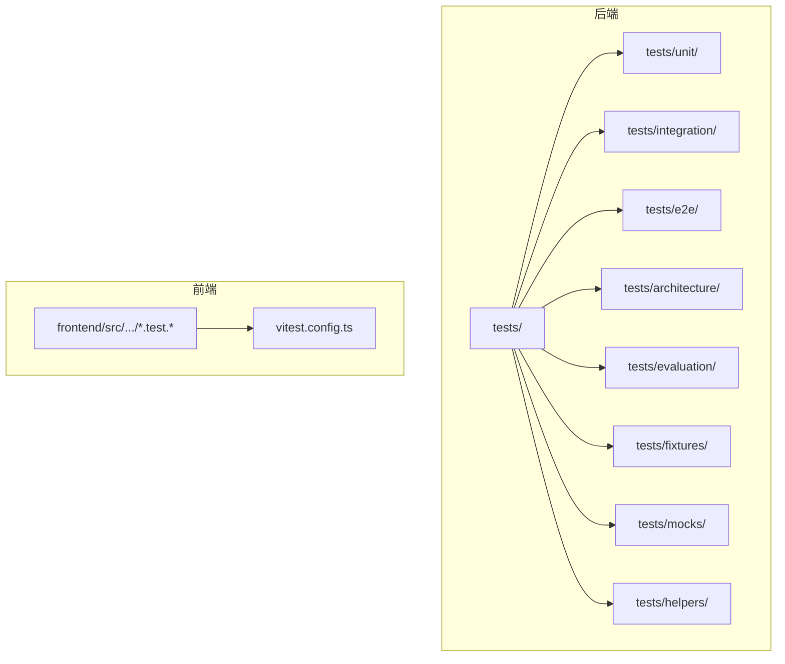
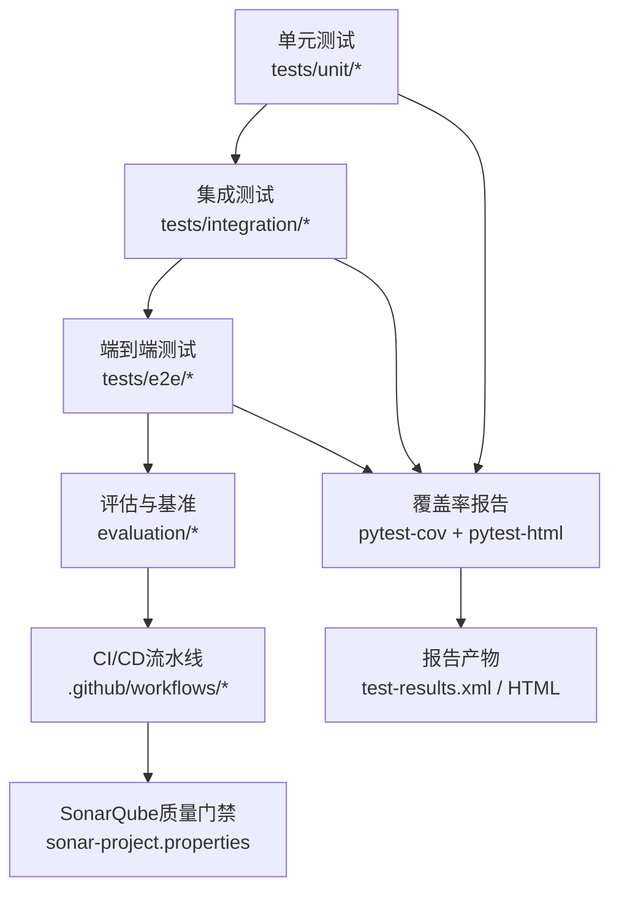
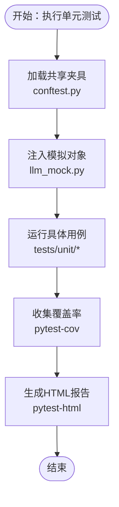
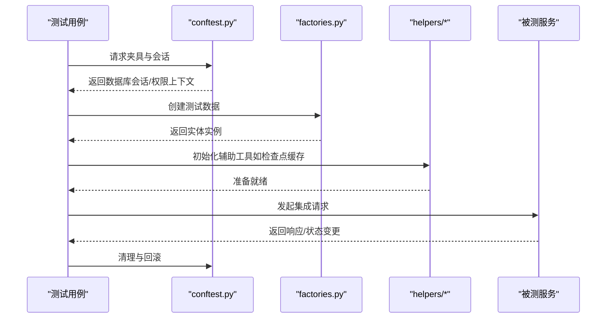
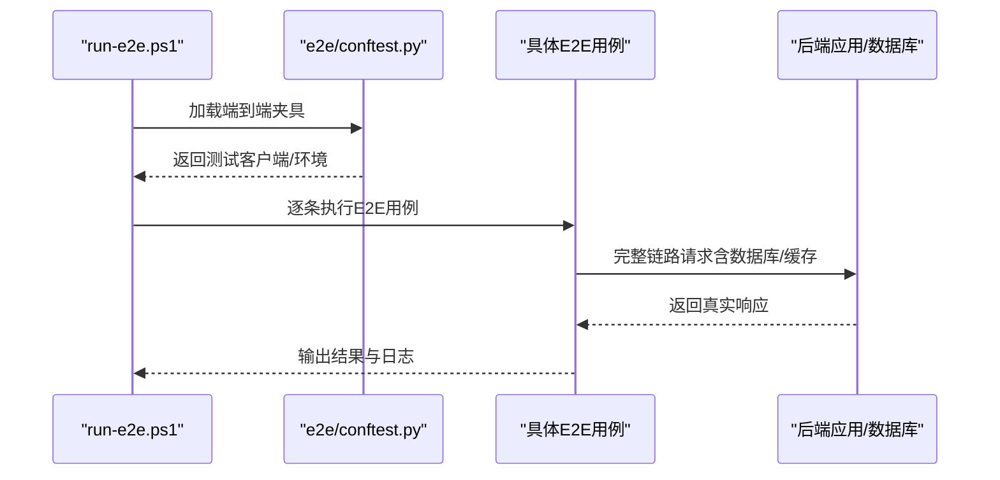
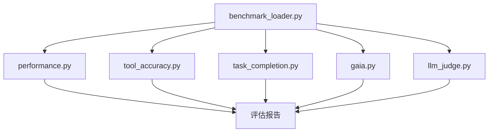
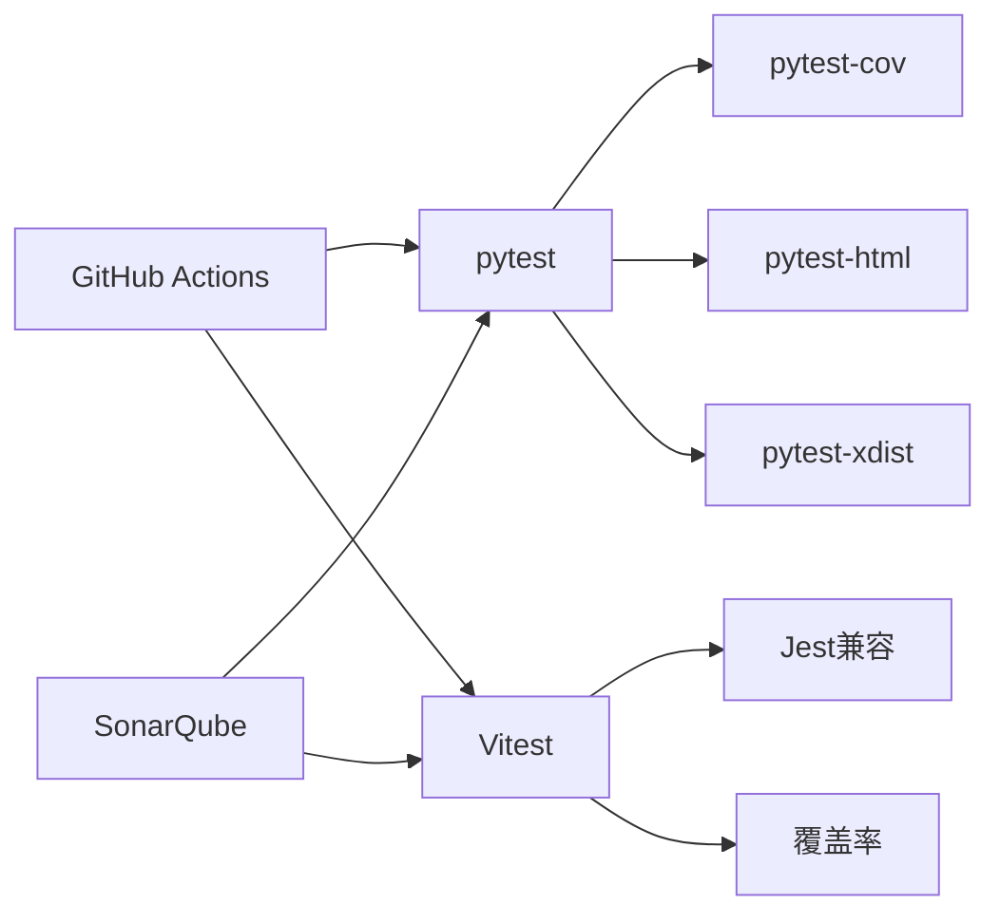

# 测试策略与执行

<cite>
**本文引用的文件**
- [pyproject.toml](file://backend/pyproject.toml)
- [vitest.config.ts](file://frontend/vitest.config.ts)
- [Makefile](file://Makefile)
- [backend/Makefile](file://backend/Makefile)
- [tests/README.md](file://backend/tests/README.md)
- [tests/CONFTEST_ANALYSIS.md](file://backend/tests/CONFTEST_ANALYSIS.md)
- [tests/conftest.py](file://backend/tests/conftest.py)
- [tests/e2e/conftest.py](file://backend/tests/e2e/conftest.py)
- [tests/fixtures/factories.py](file://backend/tests/fixtures/factories.py)
- [tests/mocks/llm_mock.py](file://backend/tests/mocks/llm_mock.py)
- [tests/helpers/in_memory_checkpoint_cache.py](file://backend/tests/helpers/in_memory_checkpoint_cache.py)
- [tests/unit/__init__.py](file://backend/tests/unit/__init__.py)
- [tests/integration/__init__.py](file://backend/tests/integration/__init__.py)
- [tests/e2e/__init__.py](file://backend/tests/e2e/__init__.py)
- [tests/architecture/__init__.py](file://backend/tests/architecture/__init__.py)
- [tests/evaluation/__init__.py](file://backend/tests/evaluation/__init__.py)
- [.github/workflows/backend-architecture.yml](file://.github/workflows/backend-architecture.yml)
- [scripts/run-e2e.ps1](file://scripts/run-e2e.ps1)
- [test.json](file://test.json)
- [test-results.xml](file://backend/test-results.xml)
- [sonar-project.properties](file://backend/sonar-project.properties)
- [sonar-project.properties](file://frontend/sonar-project.properties)
- [evaluation/performance.py](file://backend/evaluation/performance.py)
- [evaluation/benchmark_loader.py](file://backend/evaluation/benchmark_loader.py)
- [evaluation/gaia.py](file://backend/evaluation/gaia.py)
- [evaluation/tool_accuracy.py](file://backend/evaluation/tool_accuracy.py)
- [evaluation/task_completion.py](file://backend/evaluation/task_completion.py)
- [evaluation/llm_judge.py](file://backend/evaluation/llm_judge.py)
</cite>

## 目录
1. [引言](#引言)
2. [项目结构](#项目结构)
3. [核心组件](#核心组件)
4. [架构总览](#架构总览)
5. [详细组件分析](#详细组件分析)
6. [依赖分析](#依赖分析)
7. [性能考虑](#性能考虑)
8. [故障排除指南](#故障排除指南)
9. [结论](#结论)
10. [附录](#附录)

## 引言
本指南面向AI Agent项目的测试策略与执行，围绕测试金字塔（单元测试、集成测试、端到端测试）进行系统化梳理，结合项目现有配置与测试目录结构，明确测试框架选择与配置、测试数据准备与管理、性能与基准测试、覆盖率与报告、CI/CD集成以及最佳实践与排障方法。目标是帮助开发者高效编写、运行与维护高质量的测试代码，并将其稳定地纳入持续交付流程。

## 项目结构
后端采用Python生态，前端采用TypeScript/Vite生态；测试按层次划分在backend/tests下，覆盖unit、integration、e2e、architecture、evaluation等子目录；前端通过Vitest进行单元测试与部分集成测试；CI/CD通过GitHub Actions工作流驱动。

**图表来源**
- [tests/README.md](file://backend/tests/README.md)
- [tests/conftest.py](file://backend/tests/conftest.py)
- [vitest.config.ts](file://frontend/vitest.config.ts)

**章节来源**
- [tests/README.md](file://backend/tests/README.md)
- [tests/CONFTEST_ANALYSIS.md](file://backend/tests/CONFTEST_ANALYSIS.md)

## 核心组件
- 后端测试框架与配置
  - 使用pytest作为主测试框架，支持参数化、夹具、标记与插件扩展。
  - 通过conftest.py统一配置测试环境、数据库连接、会话与权限上下文。
  - 覆盖率与报告：pytest-html、pytest-cov用于生成HTML报告与覆盖率统计；test-results.xml输出JUnit格式供CI消费。
- 前端测试框架与配置
  - 使用Vitest进行单元测试与快照测试，配合JSDOM与ESM支持；vitest.config.ts定义别名、覆盖率与报告。
- 测试数据与模拟
  - fixtures/factories.py提供领域模型工厂，简化测试数据构造。
  - mocks/llm_mock.py提供LLM调用模拟，降低外部依赖耦合。
  - helpers中提供内存检查点缓存等辅助工具，便于隔离状态。
- 评估与基准
  - evaluation模块包含性能、工具准确率、任务完成度、GAIA评测与LLM Judge评测等，支撑端到端质量评估。

**章节来源**
- [pyproject.toml](file://backend/pyproject.toml)
- [tests/conftest.py](file://backend/tests/conftest.py)
- [tests/e2e/conftest.py](file://backend/tests/e2e/conftest.py)
- [tests/fixtures/factories.py](file://backend/tests/fixtures/factories.py)
- [tests/mocks/llm_mock.py](file://backend/tests/mocks/llm_mock.py)
- [tests/helpers/in_memory_checkpoint_cache.py](file://backend/tests/helpers/in_memory_checkpoint_cache.py)
- [evaluation/performance.py](file://backend/evaluation/performance.py)
- [evaluation/benchmark_loader.py](file://backend/evaluation/benchmark_loader.py)
- [evaluation/gaia.py](file://backend/evaluation/gaia.py)
- [evaluation/tool_accuracy.py](file://backend/evaluation/tool_accuracy.py)
- [evaluation/task_completion.py](file://backend/evaluation/task_completion.py)
- [evaluation/llm_judge.py](file://backend/evaluation/llm_judge.py)

## 架构总览
测试体系由“金字塔”分层构成，配合CI/CD流水线与SonarQube质量门禁，形成从局部到全局的质量保障闭环。

**图表来源**
- [tests/README.md](file://backend/tests/README.md)
- [.github/workflows/backend-architecture.yml](file://.github/workflows/backend-architecture.yml)
- [sonar-project.properties](file://backend/sonar-project.properties)
- [test-results.xml](file://backend/test-results.xml)

## 详细组件分析

### 单元测试（tests/unit）
- 组织方式
  - 按领域与应用层细分，如agent、application、domain、gateway、libs等，确保高内聚低耦合。
  - 使用pytest参数化与标记，提升用例复用与分类执行能力。
- 夹具与模拟
  - 在conftest.py中定义共享夹具，如数据库会话、权限上下文、身份桥接等。
  - 对外部服务（如LLM）使用mock对象，保证测试稳定性与可重复性。
- 覆盖率与报告
  - 通过pytest-cov收集覆盖率，pytest-html生成报告，便于定位薄弱模块。

**图表来源**
- [tests/conftest.py](file://backend/tests/conftest.py)
- [tests/mocks/llm_mock.py](file://backend/tests/mocks/llm_mock.py)
- [pyproject.toml](file://backend/pyproject.toml)

**章节来源**
- [tests/unit/__init__.py](file://backend/tests/unit/__init__.py)
- [tests/conftest.py](file://backend/tests/conftest.py)
- [tests/mocks/llm_mock.py](file://backend/tests/mocks/llm_mock.py)

### 集成测试（tests/integration）
- 范围与目标
  - 关注模块间交互、API端点行为、数据库事务与缓存一致性。
  - 通过fixtures/factories.py快速构建测试数据，减少手工准备成本。
- 执行策略
  - 使用独立测试数据库或容器化环境，确保隔离性与可重复性。
  - 结合helpers中的内存检查点缓存，避免跨用例状态污染。

**图表来源**
- [tests/integration/__init__.py](file://backend/tests/integration/__init__.py)
- [tests/fixtures/factories.py](file://backend/tests/fixtures/factories.py)
- [tests/helpers/in_memory_checkpoint_cache.py](file://backend/tests/helpers/in_memory_checkpoint_cache.py)
- [tests/conftest.py](file://backend/tests/conftest.py)

**章节来源**
- [tests/integration/__init__.py](file://backend/tests/integration/__init__.py)
- [tests/fixtures/factories.py](file://backend/tests/fixtures/factories.py)
- [tests/helpers/in_memory_checkpoint_cache.py](file://backend/tests/helpers/in_memory_checkpoint_cache.py)

### 端到端测试（tests/e2e）
- 覆盖场景
  - API路径完整性、聊天流程、执行配置、网关凭据探测、简单记忆功能等。
- 配置与执行
  - e2e/conftest.py提供端到端专用夹具与环境初始化。
  - 提供脚本scripts/run-e2e.ps1用于本地批量执行。

**图表来源**
- [scripts/run-e2e.ps1](file://scripts/run-e2e.ps1)
- [tests/e2e/conftest.py](file://backend/tests/e2e/conftest.py)
- [tests/e2e/test_api_paths_e2e.py](file://backend/tests/e2e/test_api_paths_e2e.py)

**章节来源**
- [tests/e2e/__init__.py](file://backend/tests/e2e/__init__.py)
- [tests/e2e/conftest.py](file://backend/tests/e2e/conftest.py)
- [scripts/run-e2e.ps1](file://scripts/run-e2e.ps1)

### 架构与约束测试（tests/architecture）
- 目标
  - 通过静态约束测试保证模块间导入关系、依赖方向与分层边界符合架构规范。
- 示例
  - 禁止Agent域直接导入网关基础设施，防止反向依赖破坏分层。

**章节来源**
- [tests/architecture/__init__.py](file://backend/tests/architecture/__init__.py)

### 评估与基准（tests/evaluation）
- 组成
  - 性能评测、工具准确率、任务完成度、GAIA评测、LLM Judge评测等。
- 用途
  - 为端到端质量提供量化指标，支撑回归与对比分析。

**图表来源**
- [evaluation/benchmark_loader.py](file://backend/evaluation/benchmark_loader.py)
- [evaluation/performance.py](file://backend/evaluation/performance.py)
- [evaluation/tool_accuracy.py](file://backend/evaluation/tool_accuracy.py)
- [evaluation/task_completion.py](file://backend/evaluation/task_completion.py)
- [evaluation/gaia.py](file://backend/evaluation/gaia.py)
- [evaluation/llm_judge.py](file://backend/evaluation/llm_judge.py)

**章节来源**
- [tests/evaluation/__init__.py](file://backend/tests/evaluation/__init__.py)
- [evaluation/performance.py](file://backend/evaluation/performance.py)
- [evaluation/benchmark_loader.py](file://backend/evaluation/benchmark_loader.py)
- [evaluation/gaia.py](file://backend/evaluation/gaia.py)
- [evaluation/tool_accuracy.py](file://backend/evaluation/tool_accuracy.py)
- [evaluation/task_completion.py](file://backend/evaluation/task_completion.py)
- [evaluation/llm_judge.py](file://backend/evaluation/llm_judge.py)

### 前端测试（Vitest）
- 配置
  - vitest.config.ts定义别名、覆盖率阈值、报告格式与Jest兼容选项。
- 覆盖范围
  - 单元测试与组件测试，结合JSDOM与ESM支持，覆盖API客户端、路由钩子、UI组件等。
- 报告
  - 生成Jest兼容的XML报告，便于CI系统消费。

**章节来源**
- [vitest.config.ts](file://frontend/vitest.config.ts)

## 依赖分析
- 测试框架与工具
  - 后端：pytest为核心，配合pytest-html、pytest-cov、pytest-xdist（并行执行）、pytest-mock（模拟）、pytest-lazy-fixture（延迟夹具）等。
  - 前端：Vitest为主，Jest兼容，支持快照与覆盖率。
- CI/CD与质量门禁
  - GitHub Actions工作流触发后端架构约束测试与类型检查；SonarQube通过sonar-project.properties进行质量门禁。
- 测试数据与模拟
  - 工厂与夹具统一管理测试数据；mock对象隔离外部依赖；helpers提供状态隔离工具。

**图表来源**
- [pyproject.toml](file://backend/pyproject.toml)
- [vitest.config.ts](file://frontend/vitest.config.ts)
- [.github/workflows/backend-architecture.yml](file://.github/workflows/backend-architecture.yml)
- [sonar-project.properties](file://backend/sonar-project.properties)

**章节来源**
- [pyproject.toml](file://backend/pyproject.toml)
- [vitest.config.ts](file://frontend/vitest.config.ts)
- [.github/workflows/backend-architecture.yml](file://.github/workflows/backend-architecture.yml)
- [sonar-project.properties](file://backend/sonar-project.properties)

## 性能考虑
- 单元测试
  - 使用小而快的夹具与内存态模拟，避免I/O与网络调用。
- 集成测试
  - 使用轻量级测试数据库或容器化环境，控制并发与超时。
- 端到端测试
  - 优先选择关键路径与高频场景，拆分用例并启用并行执行（pytest-xdist）。
- 评估与基准
  - 使用evaluation/performance.py与benchmark_loader.py对关键流程进行时间与吞吐测量，定期回归。

**章节来源**
- [evaluation/performance.py](file://backend/evaluation/performance.py)
- [evaluation/benchmark_loader.py](file://backend/evaluation/benchmark_loader.py)

## 故障排除指南
- 常见问题
  - 数据库状态污染：使用fixtures/factories.py与helpers中的检查点缓存，确保每个用例前后清理。
  - 外部依赖不稳定：通过tests/mocks/llm_mock.py替换LLM调用，必要时使用本地代理或限流。
  - 并发与竞态：在conftest.py中设置隔离的测试会话与随机端口，避免端口冲突。
- 排查步骤
  - 逐步缩小范围：先运行单个用例，再扩大到类/模块。
  - 查看报告：pytest-html生成的HTML报告定位失败用例与覆盖率缺口。
  - 日志与回滚：在conftest.py中增加日志记录与自动回滚逻辑。
- 本地执行
  - 使用Makefile与backend/Makefile提供的测试目标，快速执行指定层级的测试。

**章节来源**
- [tests/fixtures/factories.py](file://backend/tests/fixtures/factories.py)
- [tests/helpers/in_memory_checkpoint_cache.py](file://backend/tests/helpers/in_memory_checkpoint_cache.py)
- [tests/mocks/llm_mock.py](file://backend/tests/mocks/llm_mock.py)
- [tests/conftest.py](file://backend/tests/conftest.py)
- [Makefile](file://Makefile)
- [backend/Makefile](file://backend/Makefile)

## 结论
本项目已建立清晰的测试金字塔与多层测试体系，结合pytest与Vitest、工厂与夹具、模拟与辅助工具，形成了可维护、可扩展且可自动化的测试方案。建议持续完善评估与基准模块，强化覆盖率与质量门禁，并在CI/CD中引入更多自动化检查，以进一步提升交付质量与效率。

## 附录
- 测试执行命令与目标
  - 后端：参考backend/Makefile与Makefile中的测试目标，分别执行单元、集成、端到端与评估测试。
  - 前端：通过Vitest配置运行单元与组件测试，生成Jest兼容报告。
- 覆盖率与报告
  - 后端：pytest-cov与pytest-html生成覆盖率与HTML报告；test-results.xml输出JUnit格式。
  - 前端：Vitest生成Jest兼容XML报告，供CI系统消费。
- CI/CD集成
  - GitHub Actions工作流触发后端架构约束与类型检查；SonarQube通过sonar-project.properties进行质量门禁。

**章节来源**
- [Makefile](file://Makefile)
- [backend/Makefile](file://backend/Makefile)
- [test-results.xml](file://backend/test-results.xml)
- [sonar-project.properties](file://backend/sonar-project.properties)
- [sonar-project.properties](file://frontend/sonar-project.properties)