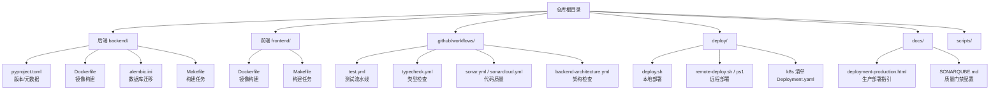
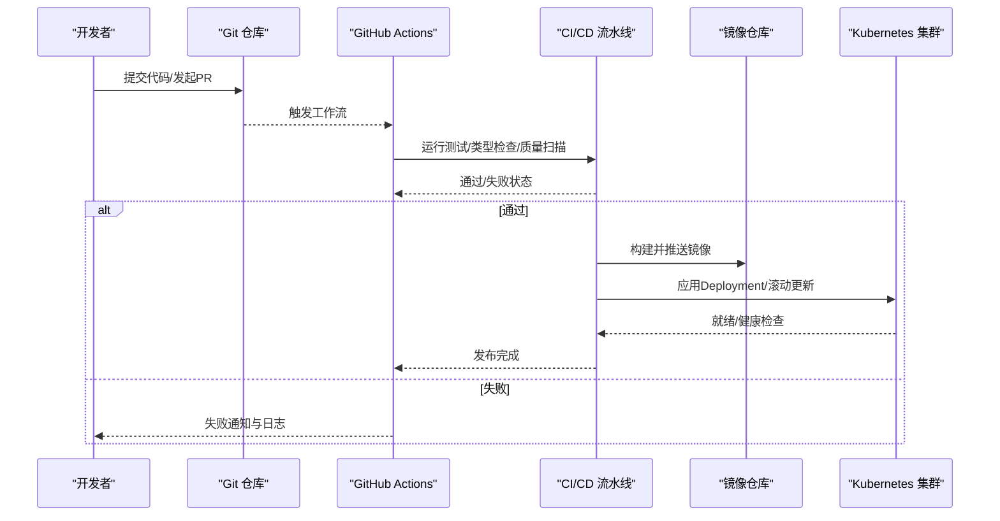
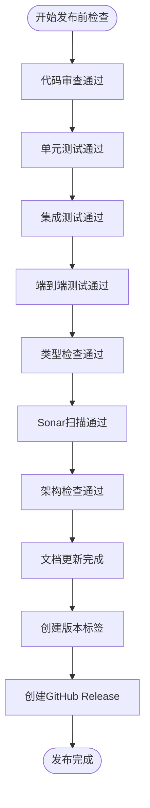
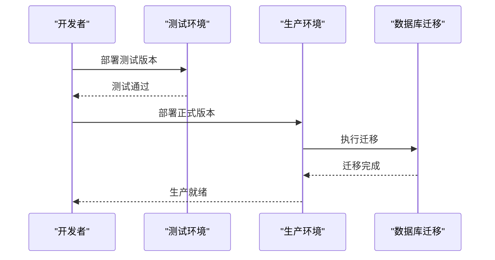

# 版本管理与发布

<cite>
**本文引用的文件**
- [pyproject.toml](file://backend/pyproject.toml)
- [Makefile](file://backend/Makefile)
- [Makefile](file://Makefile)
- [alembic.ini](file://backend/alembic.ini)
- [README.md](file://backend/README.md)
- [Dockerfile](file://backend/Dockerfile)
- [Dockerfile](file://frontend/Dockerfile)
- [Deployment.yaml](file://backend/Deployment.yaml)
- [Deployment.yaml](file://frontend/Deployment.yaml)
- [deploy.sh](file://deploy/deploy.sh)
- [remote-deploy.sh](file://deploy/remote-deploy.sh)
- [remote-deploy.ps1](file://deploy/remote-deploy.ps1)
- [sonarcloud-scan.sh](file://scripts/sonarcloud-scan.sh)
- [SONARQUBE.md](file://docs/SONARQUBE.md)
- [deployment-production.html](file://docs/deployment-production.html)
- [docker-compose.yml](file://docker-compose.yml)
- [docker-compose.prod.yml](file://docker-compose.prod.yml)
- [test.yml](file://.github/workflows/test.yml)
- [typecheck.yml](file://.github/workflows/typecheck.yml)
- [sonar.yml](file://.github/workflows/sonar.yml)
- [sonarcloud.yml](file://.github/workflows/sonarcloud.yml)
- [backend-architecture.yml](file://.github/workflows/backend-architecture.yml)
- [run_sonar_scanner.py](file://backend/scripts/run_sonar_scanner.py)
- [run_sonar_scanner.sh](file://backend/scripts/run_sonar_scanner.sh)
- [run_sonar_scanner.ps1](file://backend/scripts/run_sonar_scanner.ps1)
- [run_dev_server.py](file://backend/scripts/run_dev_server.py)
- [run_server.py](file://backend/scripts/run_server.py)
- [run_e2e.ps1](file://scripts/run-e2e.ps1)
- [sonar-scan.sh](file://scripts/sonar-scan.sh)
- [sonarcloud_api.py](file://scripts/sonarcloud_api.py)
- [run_sonar_scanner.py](file://scripts/run_sonar_scanner.py)
- [run_sonar_scanner.sh](file://scripts/run_sonar_scanner.sh)
- [run_sonar_scanner.ps1](file://scripts/run_sonar_scanner.ps1)
- [run_dev_server.py](file://scripts/run_dev_server.py)
- [run_server.py](file://scripts/run_server.py)
- [run_e2e.ps1](file://scripts/run-e2e.ps1)
- [sonar-scan.sh](file://scripts/sonar-scan.sh)
- [sonarcloud_api.py](file://scripts/sonarcloud_api.py)
</cite>

## 目录
1. [引言](#引言)
2. [项目结构](#项目结构)
3. [核心组件](#核心组件)
4. [架构总览](#架构总览)
5. [详细组件分析](#详细组件分析)
6. [依赖分析](#依赖分析)
7. [性能考虑](#性能考虑)
8. [故障排查指南](#故障排查指南)
9. [结论](#结论)
10. [附录](#附录)

## 引言
本指南面向AI Agent项目的版本管理与发布流程，结合仓库中现有的CI/CD配置、构建与部署脚本、数据库迁移工具以及文档，系统化地给出从版本号规划、标签与发布物管理、质量门禁到多环境发布的完整方案。内容覆盖语义化版本控制、Git/GitHub工作流、测试与静态分析、Kubernetes与容器化部署、回滚与热修复、紧急发布与并行发布、发布后监控与问题跟踪，以及发布文档维护与版本历史记录。

## 项目结构
本项目采用前后端分离与多模块架构：后端Python服务、前端React应用、数据库迁移工具Alembic、容器化与Kubernetes部署清单、以及丰富的GitHub Actions流水线。发布相关的关键位置如下：
- 版本与元数据：后端pyproject.toml
- 构建与打包：后端与前端Dockerfile、Makefile
- 数据库迁移：alembic.ini与迁移脚本
- 部署与运维：Deployment.yaml、deploy.sh、remote-deploy脚本
- CI/CD：多个GitHub Actions工作流
- 质量与扫描：Sonar系列脚本与文档

图表来源
- [pyproject.toml](file://backend/pyproject.toml)
- [Dockerfile](file://backend/Dockerfile)
- [Dockerfile](file://frontend/Dockerfile)
- [alembic.ini](file://backend/alembic.ini)
- [Makefile](file://backend/Makefile)
- [Makefile](file://Makefile)
- [test.yml](file://.github/workflows/test.yml)
- [typecheck.yml](file://.github/workflows/typecheck.yml)
- [sonar.yml](file://.github/workflows/sonar.yml)
- [sonarcloud.yml](file://.github/workflows/sonarcloud.yml)
- [backend-architecture.yml](file://.github/workflows/backend-architecture.yml)
- [deploy.sh](file://deploy/deploy.sh)
- [remote-deploy.sh](file://deploy/remote-deploy.sh)
- [remote-deploy.ps1](file://deploy/remote-deploy.ps1)
- [Deployment.yaml](file://backend/Deployment.yaml)
- [Deployment.yaml](file://frontend/Deployment.yaml)
- [deployment-production.html](file://docs/deployment-production.html)
- [SONARQUBE.md](file://docs/SONARQUBE.md)

章节来源
- [pyproject.toml](file://backend/pyproject.toml)
- [Makefile](file://backend/Makefile)
- [Makefile](file://Makefile)
- [alembic.ini](file://backend/alembic.ini)
- [Dockerfile](file://backend/Dockerfile)
- [Dockerfile](file://frontend/Dockerfile)
- [Deployment.yaml](file://backend/Deployment.yaml)
- [Deployment.yaml](file://frontend/Deployment.yaml)
- [deploy.sh](file://deploy/deploy.sh)
- [remote-deploy.sh](file://deploy/remote-deploy.sh)
- [remote-deploy.ps1](file://deploy/remote-deploy.ps1)
- [deployment-production.html](file://docs/deployment-production.html)
- [SONARQUBE.md](file://docs/SONARQUBE.md)

## 核心组件
- 版本与元数据：后端pyproject.toml用于声明项目版本、依赖与元信息；前端package.json用于前端版本与依赖管理（在当前上下文中未直接列出，但与后端保持一致的版本治理思路）。
- 构建与打包：后端与前端Dockerfile分别定义镜像构建过程；顶层Makefile与后端Makefile提供统一的构建、测试、迁移等任务编排。
- 数据库迁移：alembic.ini与迁移脚本负责数据库结构演进，发布时需确保迁移脚本顺序正确且幂等。
- 部署与运维：Kubernetes Deployment.yaml与deploy.sh/remote-deploy脚本支撑多环境发布与滚动更新。
- CI/CD：test.yml、typecheck.yml、sonar.yml、sonarcloud.yml、backend-architecture.yml构成质量门禁与自动化流水线。
- 质量与扫描：Sonar系列脚本与文档定义质量阈值与门禁策略。

章节来源
- [pyproject.toml](file://backend/pyproject.toml)
- [Makefile](file://backend/Makefile)
- [Makefile](file://Makefile)
- [alembic.ini](file://backend/alembic.ini)
- [Dockerfile](file://backend/Dockerfile)
- [Dockerfile](file://frontend/Dockerfile)
- [Deployment.yaml](file://backend/Deployment.yaml)
- [Deployment.yaml](file://frontend/Deployment.yaml)
- [deploy.sh](file://deploy/deploy.sh)
- [remote-deploy.sh](file://deploy/remote-deploy.sh)
- [remote-deploy.ps1](file://deploy/remote-deploy.ps1)
- [test.yml](file://.github/workflows/test.yml)
- [typecheck.yml](file://.github/workflows/typecheck.yml)
- [sonar.yml](file://.github/workflows/sonar.yml)
- [sonarcloud.yml](file://.github/workflows/sonarcloud.yml)
- [backend-architecture.yml](file://.github/workflows/backend-architecture.yml)
- [SONARQUBE.md](file://docs/SONARQUBE.md)

## 架构总览
下图展示从代码提交到多环境发布的整体流程，涵盖版本号生成、镜像构建、数据库迁移、Kubernetes部署与质量门禁。

图表来源
- [test.yml](file://.github/workflows/test.yml)
- [typecheck.yml](file://.github/workflows/typecheck.yml)
- [sonar.yml](file://.github/workflows/sonar.yml)
- [sonarcloud.yml](file://.github/workflows/sonarcloud.yml)
- [backend-architecture.yml](file://.github/workflows/backend-architecture.yml)
- [Dockerfile](file://backend/Dockerfile)
- [Dockerfile](file://frontend/Dockerfile)
- [Deployment.yaml](file://backend/Deployment.yaml)
- [Deployment.yaml](file://frontend/Deployment.yaml)

## 详细组件分析

### 语义化版本控制与发布时机
- 版本号来源：后端pyproject.toml集中管理项目版本与元数据，建议在此处维护主版本号与变更类型（主/次/补丁），并在发布前统一更新。
- 发布时机：
  - 功能发布：合并至主分支后，打上对应语义化版本标签并创建GitHub Release。
  - 热修复：在稳定分支上进行最小改动，打补丁版本标签并同步至主分支与主分支合并。
  - 预发布：在develop或release-*分支上使用rc或alpha/beta标识，待稳定后合并并打正式版本标签。
- 版本标签规范：
  - 使用语义化版本格式 vX.Y.Z，并在GitHub Release中附带变更摘要与二进制产物。
  - 数据库迁移脚本命名遵循时间戳或序号递增，确保发布时迁移顺序正确。

章节来源
- [pyproject.toml](file://backend/pyproject.toml)

### 版本标签与GitHub Release
- Git标签：在通过所有质量门禁后，使用语义化版本标签推送到远端，作为发布锚点。
- GitHub Release：基于标签创建Release，附带Changelog与构建产物摘要。
- 与CI联动：可在工作流中自动根据标签触发发布制品上传与Release创建（如需扩展）。

章节来源
- [test.yml](file://.github/workflows/test.yml)
- [typecheck.yml](file://.github/workflows/typecheck.yml)
- [sonar.yml](file://.github/workflows/sonar.yml)
- [sonarcloud.yml](file://.github/workflows/sonarcloud.yml)

### 发布前质量检查清单
- 代码审查：PR必须通过代码审查，确保设计与实现符合规范。
- 单元/集成/端到端测试：测试工作流需全部通过，覆盖率达标。
- 类型检查与静态分析：类型检查与Sonar扫描通过，修复阻断问题。
- 架构合规：后端架构检查工作流确保模块边界与依赖关系符合设计。
- 文档更新：更新相关文档（如部署说明、变更日志、质量门禁说明）。

图表来源
- [test.yml](file://.github/workflows/test.yml)
- [typecheck.yml](file://.github/workflows/typecheck.yml)
- [sonar.yml](file://.github/workflows/sonar.yml)
- [sonarcloud.yml](file://.github/workflows/sonarcloud.yml)
- [backend-architecture.yml](file://.github/workflows/backend-architecture.yml)
- [SONARQUBE.md](file://docs/SONARQUBE.md)

章节来源
- [test.yml](file://.github/workflows/test.yml)
- [typecheck.yml](file://.github/workflows/typecheck.yml)
- [sonar.yml](file://.github/workflows/sonar.yml)
- [sonarcloud.yml](file://.github/workflows/sonarcloud.yml)
- [backend-architecture.yml](file://.github/workflows/backend-architecture.yml)
- [SONARQUBE.md](file://docs/SONARQUBE.md)

### 多环境发布策略
- 预发布/测试发布：develop或release-*分支合并后，在测试环境进行全链路验证（含数据库迁移与服务就绪检查）。
- 正式发布：在主分支上打标签并发布，滚动更新至生产环境，执行数据库迁移与健康检查。
- 回滚策略：通过Kubernetes滚动回滚至上一稳定版本镜像；若涉及数据库变更，配合Alembic降级迁移。
- 并行发布：在同一时间仅对单一路径进行发布，避免交叉影响；如需并行，采用独立命名空间或环境隔离。

图表来源
- [alembic.ini](file://backend/alembic.ini)
- [Deployment.yaml](file://backend/Deployment.yaml)
- [Deployment.yaml](file://frontend/Deployment.yaml)
- [deployment-production.html](file://docs/deployment-production.html)

章节来源
- [alembic.ini](file://backend/alembic.ini)
- [Deployment.yaml](file://backend/Deployment.yaml)
- [Deployment.yaml](file://frontend/Deployment.yaml)
- [deployment-production.html](file://docs/deployment-production.html)

### 回滚与热修复
- 回滚流程：
  - 镜像回滚：使用kubectl设置旧版本镜像，等待滚动更新完成。
  - 数据库回滚：若涉及结构变更，使用Alembic降级到上一版本。
- 热修复：
  - 在稳定分支上修复问题，打补丁版本标签并同步至主分支与主分支合并。
  - 快速回归测试与部署，确保不影响线上稳定性。

章节来源
- [alembic.ini](file://backend/alembic.ini)
- [deployment-production.html](file://docs/deployment-production.html)

### 发布脚本使用与自定义
- 本地构建与部署：
  - 后端/前端Dockerfile定义镜像构建；Makefile提供统一任务编排。
  - deploy.sh支持本地一键部署；remote-deploy.sh/ps1支持远程部署。
- 自定义选项：
  - 可通过环境变量或命令行参数传入镜像标签、目标环境、是否跳过测试等。
  - 建议在脚本中增加“dry-run”模式，先验证流程再执行实际操作。

章节来源
- [Makefile](file://backend/Makefile)
- [Makefile](file://Makefile)
- [Dockerfile](file://backend/Dockerfile)
- [Dockerfile](file://frontend/Dockerfile)
- [deploy.sh](file://deploy/deploy.sh)
- [remote-deploy.sh](file://deploy/remote-deploy.sh)
- [remote-deploy.ps1](file://deploy/remote-deploy.ps1)

### 发布后监控与问题跟踪
- 监控与告警：结合Kubernetes指标与应用日志，建立健康检查与异常告警。
- 问题跟踪：通过Issue模板与变更日志记录问题与修复，确保可追溯。
- 质量门禁：SonarCloud持续扫描，质量阈值不达标则阻断发布。

章节来源
- [SONARQUBE.md](file://docs/SONARQUBE.md)
- [sonarcloud-scan.sh](file://scripts/sonarcloud-scan.sh)
- [sonarcloud_api.py](file://scripts/sonarcloud_api.py)

### 紧急发布与并行发布
- 紧急发布：
  - 采用最小改动与快速通道，优先保证功能可用性；发布后尽快回归测试。
  - 严格记录紧急发布原因、影响范围与回退预案。
- 并行发布：
  - 同一时刻仅允许一条发布路径；如确需并行，使用独立命名空间或环境隔离，避免相互干扰。

章节来源
- [test.yml](file://.github/workflows/test.yml)
- [deployment-production.html](file://docs/deployment-production.html)

### 发布文档维护与版本历史
- 发布文档：在docs目录维护部署与质量相关文档，随版本更新。
- 版本历史：在GitHub Releases中记录每次发布的主要变更、已知问题与升级指引。

章节来源
- [deployment-production.html](file://docs/deployment-production.html)
- [SONARQUBE.md](file://docs/SONARQUBE.md)

## 依赖分析
- 组件耦合：
  - CI工作流依赖测试、类型检查与质量扫描；部署依赖镜像构建与Kubernetes清单。
  - 数据库迁移与后端服务紧密耦合，发布时需确保迁移顺序与兼容性。
- 外部依赖：
  - SonarCloud用于质量度量；GitHub Actions用于流水线编排；Kubernetes用于容器编排。

图表来源
- [test.yml](file://.github/workflows/test.yml)
- [typecheck.yml](file://.github/workflows/typecheck.yml)
- [sonar.yml](file://.github/workflows/sonar.yml)
- [sonarcloud.yml](file://.github/workflows/sonarcloud.yml)
- [alembic.ini](file://backend/alembic.ini)
- [Deployment.yaml](file://backend/Deployment.yaml)

章节来源
- [test.yml](file://.github/workflows/test.yml)
- [typecheck.yml](file://.github/workflows/typecheck.yml)
- [sonar.yml](file://.github/workflows/sonar.yml)
- [sonarcloud.yml](file://.github/workflows/sonarcloud.yml)
- [alembic.ini](file://backend/alembic.ini)
- [Deployment.yaml](file://backend/Deployment.yaml)

## 性能考虑
- 构建缓存：利用CI中的缓存策略减少重复安装与编译时间。
- 镜像分层：优化Dockerfile分层，提升增量构建效率。
- 并行任务：在CI中并行执行测试与扫描，缩短总耗时。
- 部署策略：使用滚动更新与就绪探针，降低发布窗口与风险。

## 故障排查指南
- 测试失败：
  - 检查测试日志与覆盖率报告，定位失败用例与覆盖率不足模块。
- Sonar质量门禁：
  - 修复阻断问题（如复杂度、重复代码、安全漏洞），重新扫描直至通过。
- 部署失败：
  - 检查Kubernetes事件与Pod状态，确认镜像拉取、配置与健康检查。
- 数据库迁移失败：
  - 使用Alembic降级到上一版本，修复迁移脚本后重试。

章节来源
- [test.yml](file://.github/workflows/test.yml)
- [sonar.yml](file://.github/workflows/sonar.yml)
- [sonarcloud.yml](file://.github/workflows/sonarcloud.yml)
- [deployment-production.html](file://docs/deployment-production.html)
- [alembic.ini](file://backend/alembic.ini)

## 结论
通过统一的语义化版本控制、严格的发布前质量门禁、容器化与Kubernetes的标准化部署，以及完善的回滚与监控机制，AI Agent项目可以实现高效、可控、可追溯的版本发布与运维。建议在现有基础上进一步完善自动化发布与回滚脚本、增强紧急发布预案与并行发布隔离策略，并持续优化CI性能与质量阈值。

## 附录
- 关键文件索引：
  - 版本与元数据：[pyproject.toml](file://backend/pyproject.toml)
  - 构建与打包：[Dockerfile](file://backend/Dockerfile)、[Dockerfile](file://frontend/Dockerfile)、[Makefile](file://Makefile)、[Makefile](file://backend/Makefile)
  - 数据库迁移：[alembic.ini](file://backend/alembic.ini)
  - 部署与运维：[Deployment.yaml](file://backend/Deployment.yaml)、[Deployment.yaml](file://frontend/Deployment.yaml)、[deploy.sh](file://deploy/deploy.sh)、[remote-deploy.sh](file://deploy/remote-deploy.sh)、[remote-deploy.ps1](file://deploy/remote-deploy.ps1)
  - CI/CD：[test.yml](file://.github/workflows/test.yml)、[typecheck.yml](file://.github/workflows/typecheck.yml)、[sonar.yml](file://.github/workflows/sonar.yml)、[sonarcloud.yml](file://.github/workflows/sonarcloud.yml)、[backend-architecture.yml](file://.github/workflows/backend-architecture.yml)
  - 质量与扫描：[SONARQUBE.md](file://docs/SONARQUBE.md)、[sonarcloud-scan.sh](file://scripts/sonarcloud-scan.sh)、[sonarcloud_api.py](file://scripts/sonarcloud_api.py)