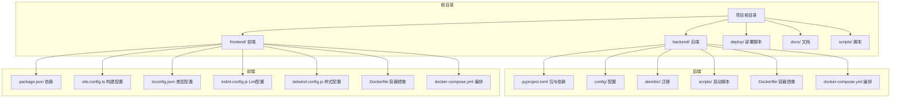
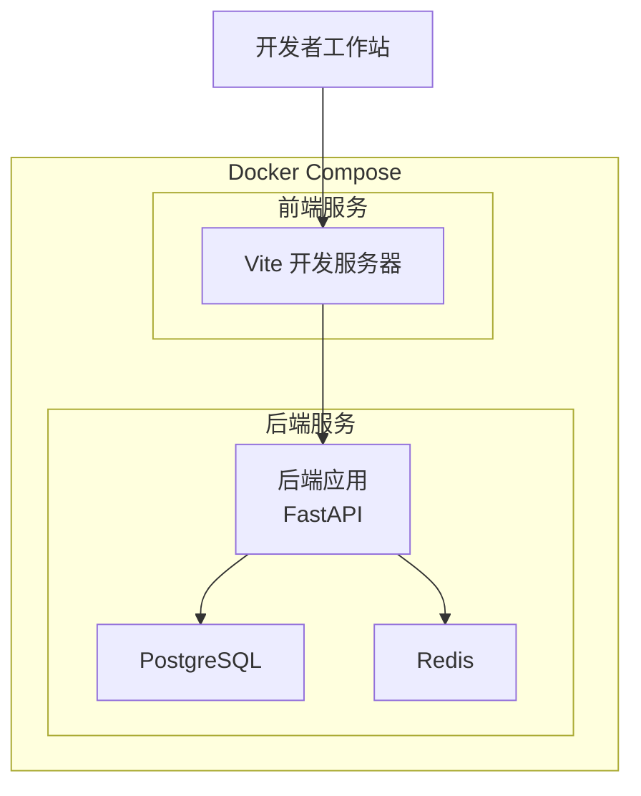
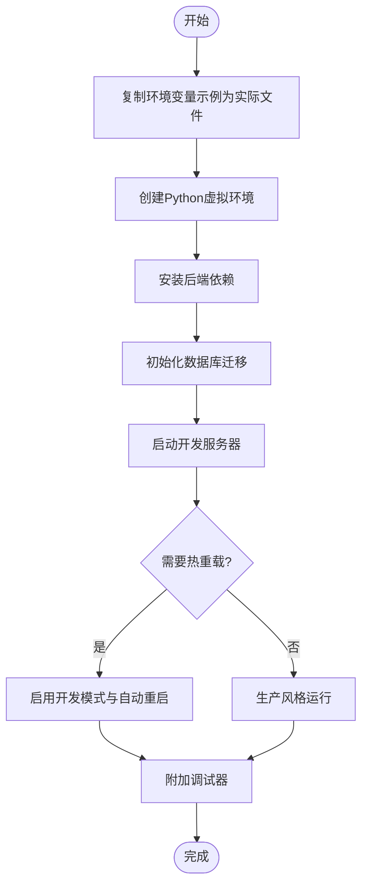
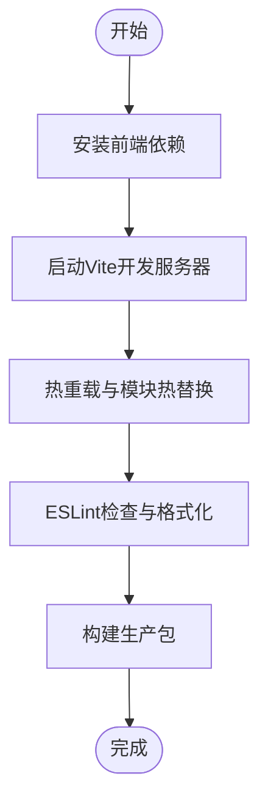
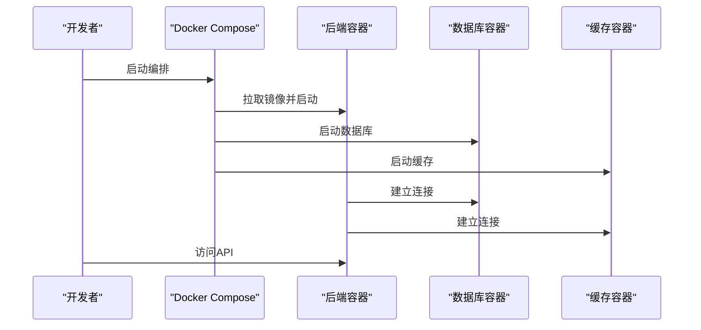
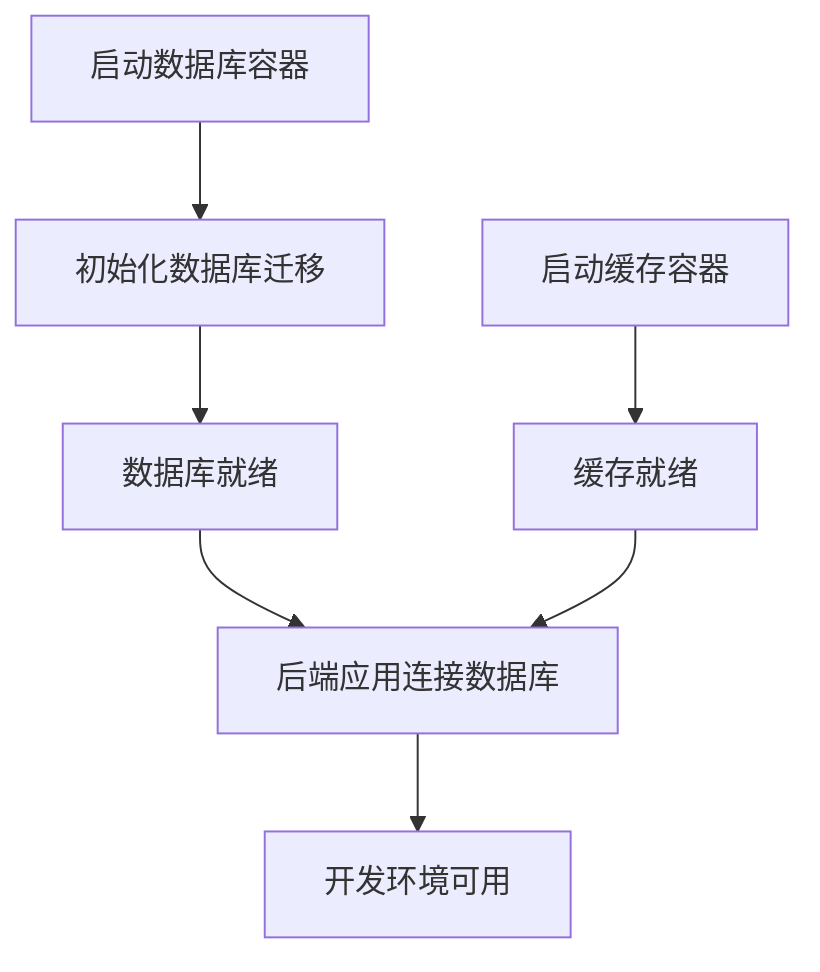
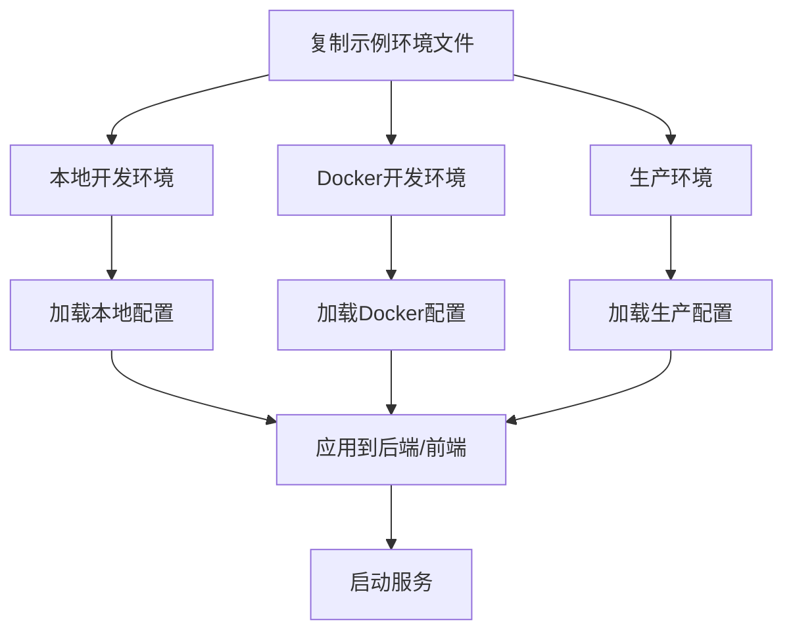
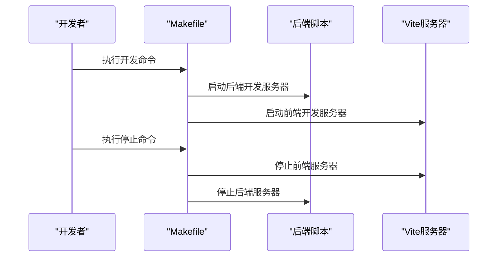
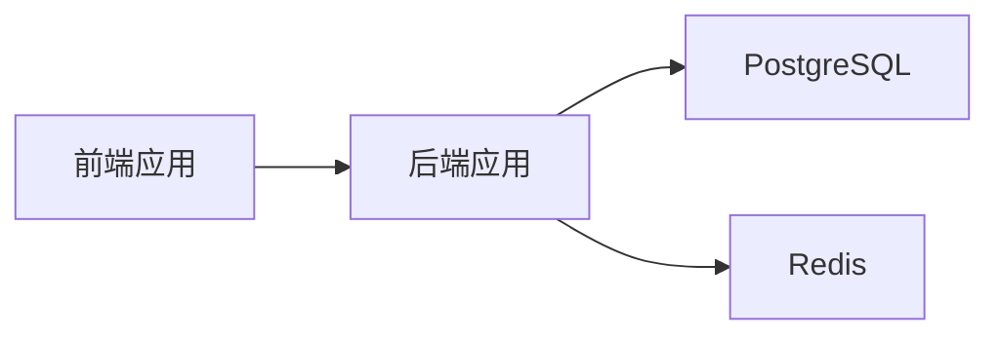

# 开发环境配置

<cite>
**本文引用的文件**
- [env.example](file://env.example)
- [backend/config/env.example](file://backend/config/env.example)
- [backend/pyproject.toml](file://backend/pyproject.toml)
- [backend/Dockerfile](file://backend/Dockerfile)
- [backend/docker/sandbox/Dockerfile](file://backend/docker/sandbox/Dockerfile)
- [docker-compose.yml](file://docker-compose.yml)
- [backend/workspace/docker-compose.yml](file://backend/workspace/docker-compose.yml)
- [backend/config/environments/local-dev.toml](file://backend/config/environments/local-dev.toml)
- [backend/config/environments/docker-dev.toml](file://backend/config/environments/docker-dev.toml)
- [backend/config/app.toml](file://backend/config/app.toml)
- [backend/config/app.development.toml](file://backend/config/app.development.toml)
- [backend/scripts/run_dev_server.py](file://backend/scripts/run_dev_server.py)
- [backend/scripts/run_server.py](file://backend/scripts/run_server.py)
- [Makefile](file://Makefile)
- [backend/Makefile](file://backend/Makefile)
- [frontend/package.json](file://frontend/package.json)
- [frontend/vite.config.ts](file://frontend/vite.config.ts)
- [frontend/tsconfig.json](file://frontend/tsconfig.json)
- [frontend/eslint.config.js](file://frontend/eslint.config.js)
- [frontend/tailwind.config.js](file://frontend/tailwind.config.js)
- [backend/alembic.ini](file://backend/alembic.ini)
- [backend/alembic/script.py.mako](file://backend/alembic/script.py.mako)
- [backend/alembic/env.py](file://backend/alembic/env.py)
- [backend/alembic/versions/001_initial.py](file://backend/alembic/versions/001_initial.py)
- [scripts/sonar-scan.sh](file://scripts/sonar-scan.sh)
- [scripts/sonarcloud-scan.sh](file://scripts/sonarcloud-scan.sh)
- [deploy/backend.env.production](file://deploy/backend.env.production)
- [deploy/deploy.sh](file://deploy/deploy.sh)
- [deploy/remote-deploy.sh](file://deploy/remote-deploy.sh)
- [backend/docs/DEVELOPMENT.md](file://backend/docs/DEVELOPMENT.md)
- [backend/docs/CONFIGURATION.md](file://backend/docs/CONFIGURATION.md)
- [frontend/README.md](file://frontend/README.md)
- [backend/README.md](file://backend/README.md)
</cite>

## 目录
1. [简介](#简介)
2. [项目结构](#项目结构)
3. [核心组件](#核心组件)
4. [架构总览](#架构总览)
5. [详细组件分析](#详细组件分析)
6. [依赖关系分析](#依赖关系分析)
7. [性能考虑](#性能考虑)
8. [故障排查指南](#故障排查指南)
9. [结论](#结论)
10. [附录](#附录)

## 简介
本指南面向新加入AI Agent项目的开发者，提供从零开始的完整开发环境搭建与配置说明。内容覆盖：
- Python后端与虚拟环境配置
- Node.js前端与包管理器配置
- Docker容器化开发环境与服务编排
- 数据库(PostgreSQL)与缓存(Redis)本地初始化
- IDE与编辑器插件推荐及调试配置
- 环境变量的组织与多环境管理
- 开发服务器启动/停止、热重载与调试模式
- 常见问题排查与解决
- 工具链：包管理、构建工具、代码格式化与质量检查

## 项目结构
项目采用前后端分离架构，根目录包含后端、前端、部署脚本与文档；后端使用Python与FastAPI，前端使用TypeScript/Vite；通过Docker Compose进行服务编排。

图表来源
- [backend/pyproject.toml](file://backend/pyproject.toml)
- [backend/Dockerfile](file://backend/Dockerfile)
- [docker-compose.yml](file://docker-compose.yml)
- [frontend/package.json](file://frontend/package.json)
- [frontend/vite.config.ts](file://frontend/vite.config.ts)

章节来源
- [backend/README.md](file://backend/README.md)
- [frontend/README.md](file://frontend/README.md)

## 核心组件
- Python后端：基于FastAPI，使用Alembic迁移数据库，支持多环境配置与Docker容器化。
- 前端：基于Vite+TypeScript，支持热重载与现代化构建流程。
- 数据库与缓存：PostgreSQL用于持久化，Redis用于会话与缓存。
- 开发工具链：Python包管理(pip/poetry)、Node包管理(pnpm)，构建工具(Vite)、代码规范(Lint/Format)。

章节来源
- [backend/pyproject.toml](file://backend/pyproject.toml)
- [frontend/package.json](file://frontend/package.json)
- [backend/alembic.ini](file://backend/alembic.ini)

## 架构总览
开发环境由Docker Compose统一编排，包含后端应用、数据库、缓存与前端开发服务器。后端通过配置文件加载不同环境参数，前端通过Vite提供热重载开发体验。

图表来源
- [docker-compose.yml](file://docker-compose.yml)
- [backend/workspace/docker-compose.yml](file://backend/workspace/docker-compose.yml)

章节来源
- [docker-compose.yml](file://docker-compose.yml)
- [backend/workspace/docker-compose.yml](file://backend/workspace/docker-compose.yml)

## 详细组件分析

### Python后端环境配置
- 版本与包管理
  - 使用Python包管理配置文件定义依赖与脚本入口。
  - 推荐使用虚拟环境隔离依赖，确保与系统Python解耦。
- 依赖安装
  - 通过包管理配置文件安装后端依赖，确保版本一致。
- 环境变量
  - 提供示例环境变量文件，按需复制为实际环境文件。
- 配置文件
  - 多环境配置位于后端配置目录，支持本地开发、Docker开发等场景。
- 数据库迁移
  - 使用Alembic进行数据库版本管理，包含初始迁移与后续升级脚本。

图表来源
- [backend/pyproject.toml](file://backend/pyproject.toml)
- [backend/config/env.example](file://backend/config/env.example)
- [backend/alembic/script.py.mako](file://backend/alembic/script.py.mako)

章节来源
- [backend/pyproject.toml](file://backend/pyproject.toml)
- [backend/config/env.example](file://backend/config/env.example)
- [backend/alembic.ini](file://backend/alembic.ini)
- [backend/alembic/versions/001_initial.py](file://backend/alembic/versions/001_initial.py)

### Node.js前端环境配置
- 包管理器
  - 使用包管理配置文件声明依赖与脚本，建议使用推荐的包管理器以保证一致性。
- 构建与开发
  - Vite作为开发服务器与构建工具，提供热重载与快速打包能力。
- 类型与样式
  - TypeScript配置与Tailwind CSS配置分别控制类型检查与样式体系。
- Lint与格式化
  - ESLint配置用于代码质量与风格约束。

图表来源
- [frontend/package.json](file://frontend/package.json)
- [frontend/vite.config.ts](file://frontend/vite.config.ts)
- [frontend/eslint.config.js](file://frontend/eslint.config.js)
- [frontend/tailwind.config.js](file://frontend/tailwind.config.js)

章节来源
- [frontend/package.json](file://frontend/package.json)
- [frontend/vite.config.ts](file://frontend/vite.config.ts)
- [frontend/tsconfig.json](file://frontend/tsconfig.json)
- [frontend/eslint.config.js](file://frontend/eslint.config.js)
- [frontend/tailwind.config.js](file://frontend/tailwind.config.js)

### Docker容器化开发环境
- 容器镜像
  - 后端与前端均提供Dockerfile，定义基础镜像、工作目录、依赖安装与启动命令。
- 服务编排
  - 使用Compose文件定义后端应用、数据库、缓存等服务及其网络与卷映射。
- 网络与端口
  - 映射必要端口以便前端访问后端API，以及外部调试。
- Sandbox容器
  - 提供沙箱专用容器镜像，用于安全执行工具调用或代码片段。

图表来源
- [backend/Dockerfile](file://backend/Dockerfile)
- [backend/docker/sandbox/Dockerfile](file://backend/docker/sandbox/Dockerfile)
- [docker-compose.yml](file://docker-compose.yml)
- [backend/workspace/docker-compose.yml](file://backend/workspace/docker-compose.yml)

章节来源
- [backend/Dockerfile](file://backend/Dockerfile)
- [backend/docker/sandbox/Dockerfile](file://backend/docker/sandbox/Dockerfile)
- [docker-compose.yml](file://docker-compose.yml)
- [backend/workspace/docker-compose.yml](file://backend/workspace/docker-compose.yml)

### 数据库与缓存服务本地配置
- PostgreSQL
  - 在Compose中定义数据库服务，设置初始化脚本与卷映射，确保数据持久化。
  - 使用Alembic进行迁移，先执行初始迁移再启动应用。
- Redis
  - 在Compose中定义缓存服务，提供会话存储与临时数据缓存。
  - 配置文件中包含缓存相关参数，确保后端正确连接。

图表来源
- [backend/alembic/env.py](file://backend/alembic/env.py)
- [backend/alembic/script.py.mako](file://backend/alembic/script.py.mako)
- [docker-compose.yml](file://docker-compose.yml)

章节来源
- [backend/alembic.ini](file://backend/alembic.ini)
- [backend/alembic/env.py](file://backend/alembic/env.py)
- [docker-compose.yml](file://docker-compose.yml)

### 开发工具与IDE配置
- 推荐编辑器
  - VS Code（配合Python与TypeScript扩展）
- 插件建议
  - Python扩展（如Pylance、Black、isort）、ESLint、Prettier、EditorConfig等
- 调试配置
  - 后端：使用Python调试器附加到FastAPI进程
  - 前端：使用浏览器调试器与Vite开发服务器集成
- 代码规范
  - Python：遵循项目内配置的格式化与静态检查工具
  - JavaScript/TypeScript：ESLint与Prettier统一风格

章节来源
- [backend/pyproject.toml](file://backend/pyproject.toml)
- [frontend/eslint.config.js](file://frontend/eslint.config.js)

### 环境变量的配置与管理
- 示例文件
  - 提供全局与后端的环境变量示例文件，复制为实际使用的环境文件
- 多环境差异
  - 本地开发、Docker开发、生产等环境通过不同配置文件区分
- 关键变量
  - 数据库连接、缓存地址、API密钥、日志级别等

图表来源
- [env.example](file://env.example)
- [backend/config/env.example](file://backend/config/env.example)
- [backend/config/environments/local-dev.toml](file://backend/config/environments/local-dev.toml)
- [backend/config/environments/docker-dev.toml](file://backend/config/environments/docker-dev.toml)
- [deploy/backend.env.production](file://deploy/backend.env.production)

章节来源
- [env.example](file://env.example)
- [backend/config/env.example](file://backend/config/env.example)
- [backend/config/environments/local-dev.toml](file://backend/config/environments/local-dev.toml)
- [backend/config/environments/docker-dev.toml](file://backend/config/environments/docker-dev.toml)
- [deploy/backend.env.production](file://deploy/backend.env.production)

### 开发服务器的启动与停止
- 后端
  - 提供开发与生产启动脚本，支持热重载与调试模式
- 前端
  - 使用Vite开发服务器，支持热重载与代理转发
- 停止命令
  - 通过Compose停止所有服务，或单独停止各容器

图表来源
- [backend/scripts/run_dev_server.py](file://backend/scripts/run_dev_server.py)
- [backend/scripts/run_server.py](file://backend/scripts/run_server.py)
- [frontend/vite.config.ts](file://frontend/vite.config.ts)
- [Makefile](file://Makefile)
- [backend/Makefile](file://backend/Makefile)

章节来源
- [backend/scripts/run_dev_server.py](file://backend/scripts/run_dev_server.py)
- [backend/scripts/run_server.py](file://backend/scripts/run_server.py)
- [frontend/vite.config.ts](file://frontend/vite.config.ts)
- [Makefile](file://Makefile)
- [backend/Makefile](file://backend/Makefile)

## 依赖关系分析
- 后端依赖
  - 通过包管理配置文件集中管理，包含Web框架、数据库ORM、工具库等
- 前端依赖
  - 通过包管理配置文件集中管理，包含构建工具、运行时库、样式与类型定义
- 运行时依赖
  - 数据库与缓存服务通过Compose统一管理，确保版本与端口一致

图表来源
- [backend/pyproject.toml](file://backend/pyproject.toml)
- [frontend/package.json](file://frontend/package.json)
- [docker-compose.yml](file://docker-compose.yml)

章节来源
- [backend/pyproject.toml](file://backend/pyproject.toml)
- [frontend/package.json](file://frontend/package.json)
- [docker-compose.yml](file://docker-compose.yml)

## 性能考虑
- 数据库索引与查询优化
  - 迁移脚本中包含性能索引，建议在开发过程中关注慢查询日志
- 缓存策略
  - 合理使用Redis缓存热点数据，避免频繁访问数据库
- 构建优化
  - 前端使用Vite进行增量构建与模块热替换，提升开发效率
- 容器资源限制
  - 在开发环境中适当调整容器资源上限，避免资源争用

## 故障排查指南
- 数据库连接失败
  - 检查数据库容器是否启动、网络连通性与凭据配置
- 端口冲突
  - 修改Compose中的端口映射，或停止占用端口的服务
- 依赖安装失败
  - 清理缓存并重新安装依赖，确认网络可达
- 热重载不生效
  - 检查Vite配置与浏览器缓存，尝试强制刷新
- Sonar扫描异常
  - 检查扫描脚本与项目属性配置，确保环境变量正确

章节来源
- [scripts/sonar-scan.sh](file://scripts/sonar-scan.sh)
- [scripts/sonarcloud-scan.sh](file://scripts/sonarcloud-scan.sh)
- [backend/docs/DEVELOPMENT.md](file://backend/docs/DEVELOPMENT.md)

## 结论
通过本指南，您可以完成AI Agent项目的本地开发环境搭建，涵盖Python与Node.js环境、Docker容器化、数据库与缓存初始化、开发工具配置、环境变量管理、服务器启停与热重载，以及常见问题排查。建议在团队内统一工具链与配置，确保开发体验一致与高效。

## 附录
- 快速开始命令
  - 复制环境变量示例文件并根据需要修改
  - 安装后端与前端依赖
  - 启动Docker Compose编排服务
  - 分别启动后端与前端开发服务器
- 生产部署参考
  - 参考部署脚本与环境文件，准备生产环境变量与镜像

章节来源
- [deploy/deploy.sh](file://deploy/deploy.sh)
- [deploy/remote-deploy.sh](file://deploy/remote-deploy.sh)
- [backend/docs/DEVELOPMENT.md](file://backend/docs/DEVELOPMENT.md)
- [frontend/README.md](file://frontend/README.md)
- [backend/README.md](file://backend/README.md)