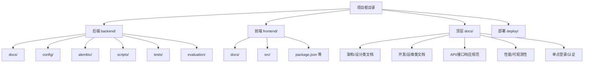
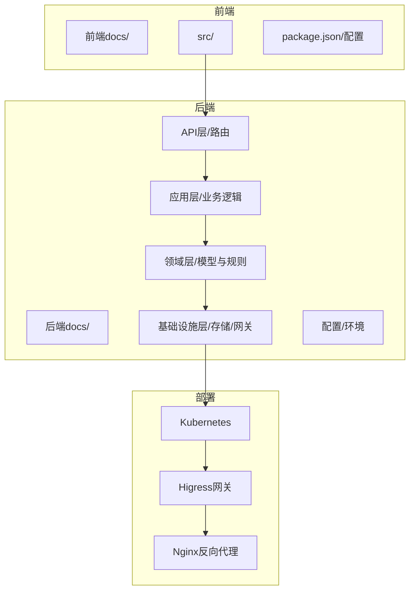
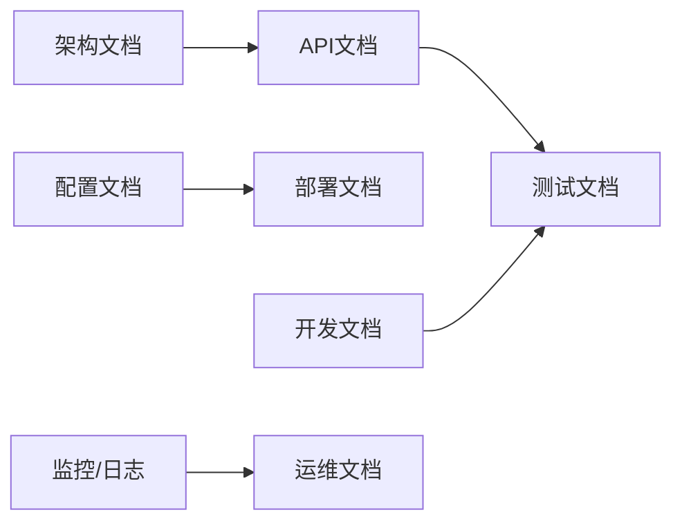

# 文档编写规范

<cite>
**本文引用的文件**
- [AGENTS.md](file://AGENTS.md)
- [CLAUDE.md](file://CLAUDE.md)
- [README.md](file://README.md)
- [.spec-workflow/user-templates/README.md](file://.spec-workflow/user-templates/README.md)
- [backend/docs/ARCHITECTURE.md](file://backend/docs/ARCHITECTURE.md)
- [backend/docs/AGENT_ARCHITECTURE_DESIGN.md](file://backend/docs/AGENT_ARCHITECTURE_DESIGN.md)
- [backend/docs/AI_GATEWAY_DOMAIN_ARCHITECTURE.md](file://backend/docs/AI_GATEWAY_DOMAIN_ARCHITECTURE.md)
- [backend/docs/CODE_STANDARDS.md](file://backend/docs/CODE_STANDARDS.md)
- [backend/docs/CONFIGURATION.md](file://backend/docs/CONFIGURATION.md)
- [backend/docs/CONTEXT_MANAGEMENT_IMPLEMENTATION.md](file://backend/docs/CONTEXT_MANAGEMENT_IMPLEMENTATION.md)
- [backend/docs/LANGGRAPH_ARCHITECTURE_RATIONALE.md](file://backend/docs/LANGGRAPH_ARCHITECTURE_RATIONALE.md)
- [backend/docs/DEVELOPMENT.md](file://backend/docs/DEVELOPMENT.md)
- [backend/docs/AUTHENTICATION.md](file://backend/docs/AUTHENTICATION.md)
- [backend/config/README.md](file://backend/config/README.md)
- [backend/config/NETWORK_CONFIG_GUIDE.md](file://backend/config/NETWORK_CONFIG_GUIDE.md)
- [backend/docker/sandbox/README.md](file://backend/docker/sandbox/README.md)
- [docs/API_RESPONSE.md](file://docs/API_RESPONSE.md)
- [docs/PAGINATION.md](file://docs/PAGINATION.md)
- [docs/DEPLOYMENT.md](file://docs/DEPLOYMENT.md)
- [docs/SONARQUBE.md](file://docs/SONARQUBE.md)
- [docs/logging.md](file://docs/logging.md)
- [frontend/docs/README.md](file://frontend/docs/README.md)
- [frontend/docs/CODE_STANDARDS.md](file://frontend/docs/CODE_STANDARDS.md)
- [frontend/docs/DEVELOPMENT.md](file://frontend/docs/DEVELOPMENT.md)
- [frontend/docs/DESIGN_SYSTEM.md](file://frontend/docs/DESIGN_SYSTEM.md)
- [frontend/docs/UI_OVERLAY.md](file://frontend/docs/UI_OVERLAY.md)
- [backend/scripts/README.md](file://backend/scripts/README.md)
- [backend/tests/README.md](file://backend/tests/README.md)
- [backend/evaluation/README.md](file://backend/evaluation/README.md)
- [deploy/higress/README.md](file://deploy/higress/README.md)
- [deploy/k8s/README.md](file://deploy/k8s/README.md)
- [deploy/nginx/README.md](file://deploy/nginx/README.md)
</cite>

## 目录
1. 引言
2. 项目结构
3. 核心组件
4. 架构总览
5. 详细组件分析
6. 依赖分析
7. 性能考虑
8. 故障排除指南
9. 结论
10. 附录

## 引言
本规范旨在为AI Agent项目的文档编写提供统一标准，覆盖技术文档、API文档、架构文档、用户手册、开发文档等各类文档的结构、语言风格、格式规范与质量要求。同时明确版本管理、更新流程、工具与模板使用方式，以及审核与发布流程，确保文档与代码同步演进、可追溯、可维护。

## 项目结构
项目采用前后端分离与多模块并行的组织方式，文档分布在后端docs、前端docs、顶层docs及各子目录中，形成“领域+主题”的文档布局。建议作者在撰写新文档时遵循“先索引、后细节”的原则，先在顶层或对应模块的README中建立导航，再在子文件中展开细节。

图示来源
- [README.md](file://README.md)
- [backend/docs/README.md](file://backend/docs/README.md)
- [frontend/docs/README.md](file://frontend/docs/README.md)
- [docs/README.md](file://docs/README.md)

章节来源
- [README.md](file://README.md)
- [backend/docs/README.md](file://backend/docs/README.md)
- [frontend/docs/README.md](file://frontend/docs/README.md)
- [docs/README.md](file://docs/README.md)

## 核心组件
- 文档类型与职责
  - 技术文档：面向开发者与架构师，强调设计原理、实现约束与演进路径。
  - API文档：面向集成方与前端，强调接口定义、参数、返回值与示例。
  - 架构文档：面向技术决策者，强调系统边界、数据流、权衡与风险。
  - 用户手册：面向最终用户，强调操作步骤、截图与常见问题。
  - 开发文档：面向贡献者，强调编码规范、测试策略、变更日志与版本说明。
- 文档模板与约定
  - 使用Markdown作为统一格式，标题层级清晰，段落简洁，要点编号化。
  - 统一命名规范：模块名/主题名/子主题名.md；避免空格与特殊字符。
  - 所有图表使用Mermaid（流程图、序列图、类图、状态图）或手绘后转矢量图。
  - 示例代码与配置片段通过“代码片段路径”引用，不直接粘贴内容。
- 版本与发布
  - 采用Git进行版本控制，主分支受保护，变更通过Pull Request合并。
  - 发布前完成自检清单：结构完整、链接有效、图表清晰、术语一致。
  - 变更日志按“时间线+功能/修复/重构”维度记录，便于追踪影响范围。

章节来源
- [backend/docs/CODE_STANDARDS.md](file://backend/docs/CODE_STANDARDS.md)
- [frontend/docs/CODE_STANDARDS.md](file://frontend/docs/CODE_STANDARDS.md)
- [.spec-workflow/user-templates/README.md](file://.spec-workflow/user-templates/README.md)

## 架构总览
以下架构图映射到实际文档与模块，展示系统核心视图与交互关系。

图示来源
- [backend/docs/ARCHITECTURE.md](file://backend/docs/ARCHITECTURE.md)
- [backend/docs/AI_GATEWAY_DOMAIN_ARCHITECTURE.md](file://backend/docs/AI_GATEWAY_DOMAIN_ARCHITECTURE.md)
- [backend/docs/AGENT_ARCHITECTURE_DESIGN.md](file://backend/docs/AGENT_ARCHITECTURE_DESIGN.md)
- [backend/docs/LANGGRAPH_ARCHITECTURE_RATIONALE.md](file://backend/docs/LANGGRAPH_ARCHITECTURE_RATIONALE.md)
- [deploy/k8s/README.md](file://deploy/k8s/README.md)
- [deploy/higress/README.md](file://deploy/higress/README.md)
- [deploy/nginx/README.md](file://deploy/nginx/README.md)

## 详细组件分析

### 技术文档编写规范
- 结构要求
  - 目录：明确章节与子章节，支持跳转与交叉引用。
  - 背景与目标：说明文档背景、读者对象与预期收益。
  - 关键概念：术语表与缩写解释，避免歧义。
  - 设计决策：记录权衡、假设、约束与替代方案。
  - 实施细节：模块职责、接口契约、异常处理与回退策略。
  - 风险与预案：潜在风险、监控指标与应急流程。
- 语言风格
  - 正式但不生硬，使用主动语态；避免模糊表述，优先量化与可验证。
  - 保持一致性：同一术语在全文统一；前后文逻辑连贯。
- 图表与示例
  - 用Mermaid表达流程、时序与类关系；必要时配合手绘草图。
  - 示例以“代码片段路径”引用，避免复制粘贴敏感信息。

章节来源
- [backend/docs/ARCHITECTURE.md](file://backend/docs/ARCHITECTURE.md)
- [backend/docs/AGENT_ARCHITECTURE_DESIGN.md](file://backend/docs/AGENT_ARCHITECTURE_DESIGN.md)
- [backend/docs/AI_GATEWAY_DOMAIN_ARCHITECTURE.md](file://backend/docs/AI_GATEWAY_DOMAIN_ARCHITECTURE.md)
- [backend/docs/LANGGRAPH_ARCHITECTURE_RATIONALE.md](file://backend/docs/LANGGRAPH_ARCHITECTURE_RATIONALE.md)

### API文档编写规范
- 接口描述
  - 方法与路径：明确HTTP方法、路径与版本号。
  - 请求头：鉴权方式、Content-Type、Accept等。
  - 查询参数/路径参数：类型、是否必填、默认值与取值范围。
  - 请求体：JSON Schema或字段说明，含必填项与嵌套结构。
  - 响应码：成功与错误码、典型场景与错误信息结构。
  - 示例：请求与响应示例，指向“代码片段路径”。
- 参数说明
  - 字段命名与类型：与后端模型保持一致。
  - 约束条件：长度、正则、枚举值、时间范围等。
  - 默认值与空值处理：明确空字符串、null与未提供三者的差异。
- 错误处理
  - 统一错误结构：包含错误码、消息、定位信息与辅助信息。
  - 常见错误分类：鉴权失败、参数校验失败、服务内部错误等。
- 示例与测试
  - 提供curl或SDK调用示例，标注鉴权与环境变量。
  - 在测试用例中覆盖正常与异常路径，确保API稳定性。

章节来源
- [docs/API_RESPONSE.md](file://docs/API_RESPONSE.md)
- [backend/docs/AUTHENTICATION.md](file://backend/docs/AUTHENTICATION.md)

### 架构文档编写方法
- 图表绘制
  - 用例图/时序图：展示用户交互与关键流程。
  - 类图/组件图：描述模块间依赖与接口契约。
  - 数据流图：标注数据来源、处理节点与存储位置。
- 流程说明
  - 从入口到出口的完整链路，标注关键决策点与异常路径。
  - 对比不同方案的优劣与适用场景。
- 设计决策记录
  - 记录“为什么选择该方案”，包括性能、扩展性、安全性与成本考量。
  - 保留历史变更与回滚原因，便于未来审计。

章节来源
- [backend/docs/ARCHITECTURE.md](file://backend/docs/ARCHITECTURE.md)
- [backend/docs/AI_GATEWAY_DOMAIN_ARCHITECTURE.md](file://backend/docs/AI_GATEWAY_DOMAIN_ARCHITECTURE.md)
- [backend/docs/AGENT_ARCHITECTURE_DESIGN.md](file://backend/docs/AGENT_ARCHITECTURE_DESIGN.md)
- [backend/docs/LANGGRAPH_ARCHITECTURE_RATIONALE.md](file://backend/docs/LANGGRAPH_ARCHITECTURE_RATIONALE.md)

### 用户手册编写规范
- 操作步骤
  - 分步骤、分屏截图，突出关键操作与确认点。
  - 区分管理员、编辑者与访客角色的操作差异。
- 截图说明
  - 截图需标注高亮区域与说明文字，避免纯图无字。
  - 统一分辨率与标注风格，保证跨设备阅读体验。
- 故障排除
  - 常见问题FAQ：问题现象、可能原因与解决步骤。
  - 日志与诊断：指引查看日志位置与关键字段。
  - 联系支持：提供联系方式与SLA说明。

章节来源
- [docs/logging.md](file://docs/logging.md)
- [backend/docs/DEVELOPMENT.md](file://backend/docs/DEVELOPMENT.md)
- [frontend/docs/DEVELOPMENT.md](file://frontend/docs/DEVELOPMENT.md)

### 开发文档编写标准
- 代码注释
  - 函数/类注释：用途、输入输出、异常与注意事项。
  - 复杂逻辑注释：算法思路、边界条件与性能特征。
  - TODO/FIXME：明确责任人与截止日期。
- 变更日志
  - 时间线：YYYY-MM-DD格式，记录版本号与发布说明。
  - 分类：新增功能、优化改进、修复缺陷、破坏性变更。
  - 影响面：对上游/下游的影响评估与迁移指引。
- 版本说明
  - 语义化版本：MAJOR.MINOR.PATCH，明确升级策略。
  - 兼容性：向后兼容性声明与弃用计划。

章节来源
- [backend/docs/CODE_STANDARDS.md](file://backend/docs/CODE_STANDARDS.md)
- [frontend/docs/CODE_STANDARDS.md](file://frontend/docs/CODE_STANDARDS.md)
- [backend/docs/DEVELOPMENT.md](file://backend/docs/DEVELOPMENT.md)
- [frontend/docs/DEVELOPMENT.md](file://frontend/docs/DEVELOPMENT.md)

### 文档版本管理与更新流程
- 版本管理
  - 使用Git分支策略：main用于稳定发布，develop用于集成，feature/*用于功能开发。
  - 标签管理：按语义化版本打标签，发布前预发布版本标记rc.*。
- 更新流程
  - 提交前检查：结构完整性、链接有效性、图表清晰度、术语一致性。
  - 审核流程：至少一名同行评审，关注逻辑正确性与可读性。
  - 合并与发布：PR合并后自动触发CI检查，通过后发布至文档站点。
- 模板与工具
  - 模板：参考.user-templates中的模板覆盖机制，确保结构一致。
  - 工具：推荐使用Mermaid、Markdown编辑器与静态站点生成器。

章节来源
- [.spec-workflow/user-templates/README.md](file://.spec-workflow/user-templates/README.md)

### 文档工具与模板使用说明
- Markdown格式
  - 标题层级：H1用于文档标题，H2-H4用于章节与子章节。
  - 列表：有序列表用于步骤，无序列表用于要点，避免深层嵌套。
  - 链接：相对路径为主，绝对路径用于外部资源；所有链接需可访问。
- 图表工具
  - Mermaid：流程图、序列图、类图、状态图；确保语法正确与渲染一致。
  - 导出：图表导出为PNG/SVG，嵌入文档时注明来源文件与行号。
- 文档生成器
  - 静态站点：支持目录索引与搜索；确保SEO友好。
  - 自动化：CI中集成链接检查、拼写检查与图表渲染。

章节来源
- [backend/docs/CODE_STANDARDS.md](file://backend/docs/CODE_STANDARDS.md)
- [frontend/docs/DESIGN_SYSTEM.md](file://frontend/docs/DESIGN_SYSTEM.md)

### 文档审核与发布流程
- 审核清单
  - 结构：目录完整、章节连贯、无重复内容。
  - 内容：事实准确、术语一致、示例可运行。
  - 视觉：图表清晰、排版整洁、无错别字。
- 发布流程
  - PR阶段：提交PR并@相关Reviewer；根据反馈修改。
  - CI检查：链接检查、拼写检查、图表渲染与构建验证。
  - 合并与发布：通过后合并至main并打标签，触发发布。

章节来源
- [backend/docs/CODE_STANDARDS.md](file://backend/docs/CODE_STANDARDS.md)
- [frontend/docs/CODE_STANDARDS.md](file://frontend/docs/CODE_STANDARDS.md)

## 依赖分析
- 文档耦合关系
  - 架构文档与API文档强关联：API变更需同步更新架构说明与示例。
  - 配置文档与部署文档强关联：配置变更需同步部署脚本与环境说明。
- 外部依赖
  - 第三方服务：网关、认证、监控与日志服务的集成说明。
  - 工具链：SonarQube、Docker、Kubernetes等工具的使用说明。

图示来源
- [backend/docs/CONFIGURATION.md](file://backend/docs/CONFIGURATION.md)
- [docs/DEPLOYMENT.md](file://docs/DEPLOYMENT.md)
- [docs/SONARQUBE.md](file://docs/SONARQUBE.md)
- [docs/logging.md](file://docs/logging.md)

章节来源
- [backend/docs/CONFIGURATION.md](file://backend/docs/CONFIGURATION.md)
- [docs/DEPLOYMENT.md](file://docs/DEPLOYMENT.md)
- [docs/SONARQUBE.md](file://docs/SONARQUBE.md)
- [docs/logging.md](file://docs/logging.md)

## 性能考虑
- 文档性能
  - 静态化：文档站点静态生成，减少服务器压力。
  - 图表优化：Mermaid图表尽量简化，避免超大复杂图。
  - 资源压缩：图片与SVG压缩，CDN加速。
- 运行时性能
  - API限流与缓存：在API文档中明确限流策略与缓存建议。
  - 监控指标：日志与指标采集，结合SonarQube进行质量度量。

## 故障排除指南
- 常见问题
  - 文档链接失效：定期执行链接检查脚本，修正断链。
  - 图表渲染异常：检查Mermaid语法，确保渲染环境一致。
  - 术语不一致：建立术语表，统一命名与释义。
- 诊断与恢复
  - 日志定位：参考日志文档，定位错误上下文。
  - 回滚策略：版本回退与配置回滚，确保最小化影响。

章节来源
- [docs/logging.md](file://docs/logging.md)
- [docs/SONARQUBE.md](file://docs/SONARQUBE.md)

## 结论
本规范提供了从结构、风格到工具与流程的全栈文档编写指导。建议团队在实践中持续迭代：以现有文档为基准，逐步完善模板与工具链，强化审核与发布流程，确保文档与代码同频演进、高质量交付。

## 附录
- 快速参考
  - 文档类型与职责：技术/API/架构/用户/开发
  - 结构与格式：标题层级、列表、链接、图表
  - 版本与发布：分支策略、标签管理、CI检查
  - 工具与模板：Mermaid、Markdown、静态站点生成器
- 参考文档导航
  - 后端架构与设计：[架构文档](file://backend/docs/ARCHITECTURE.md)，[Agent设计](file://backend/docs/AGENT_ARCHITECTURE_DESIGN.md)，[网关架构](file://backend/docs/AI_GATEWAY_DOMAIN_ARCHITECTURE.md)，[LangGraph理由](file://backend/docs/LANGGRAPH_ARCHITECTURE_RATIONALE.md)
  - 配置与网络：[配置说明](file://backend/docs/CONFIGURATION.md)，[网络配置指南](file://backend/config/NETWORK_CONFIG_GUIDE.md)
  - 开发与测试：[开发指南](file://backend/docs/DEVELOPMENT.md)，[测试说明](file://backend/tests/README.md)，[评估说明](file://backend/evaluation/README.md)
  - 前端开发：[前端文档总览](file://frontend/docs/README.md)，[前端开发规范](file://frontend/docs/CODE_STANDARDS.md)，[UI覆盖层](file://frontend/docs/UI_OVERLAY.md)
  - 部署与运维：[部署说明](file://docs/DEPLOYMENT.md)，[K8s说明](file://deploy/k8s/README.md)，[Higress说明](file://deploy/higress/README.md)，[Nginx说明](file://deploy/nginx/README.md)
  - 沙箱与脚本：[沙箱说明](file://backend/docker/sandbox/README.md)，[脚本说明](file://backend/scripts/README.md)
  - API与分页：[API响应规范](file://docs/API_RESPONSE.md)，[分页规范](file://docs/PAGINATION.md)
  - 单点登录与认证：[认证说明](file://backend/docs/AUTHENTICATION.md)