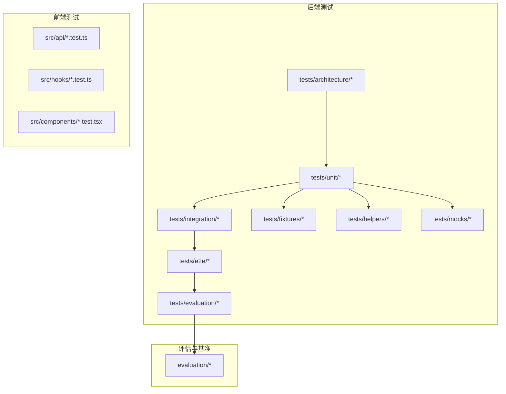
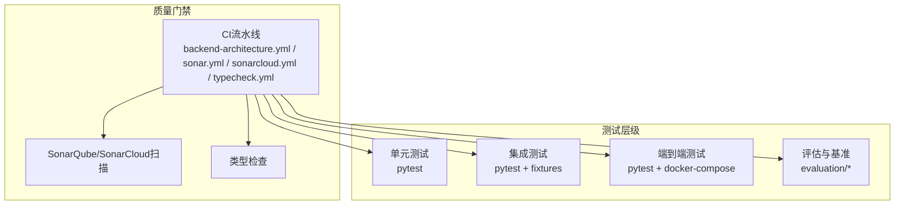
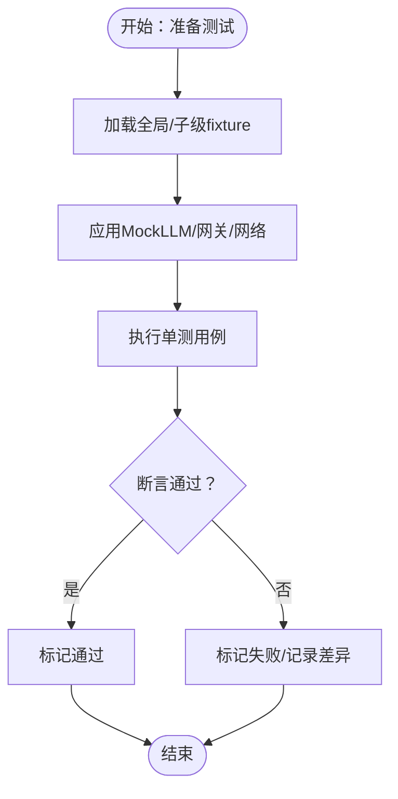
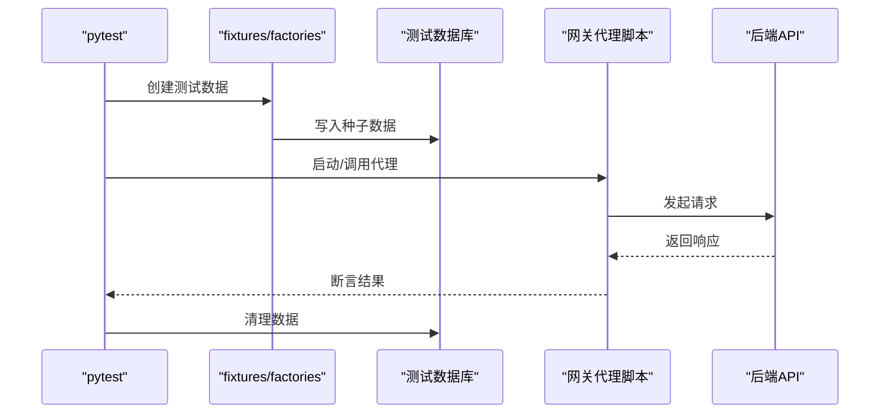
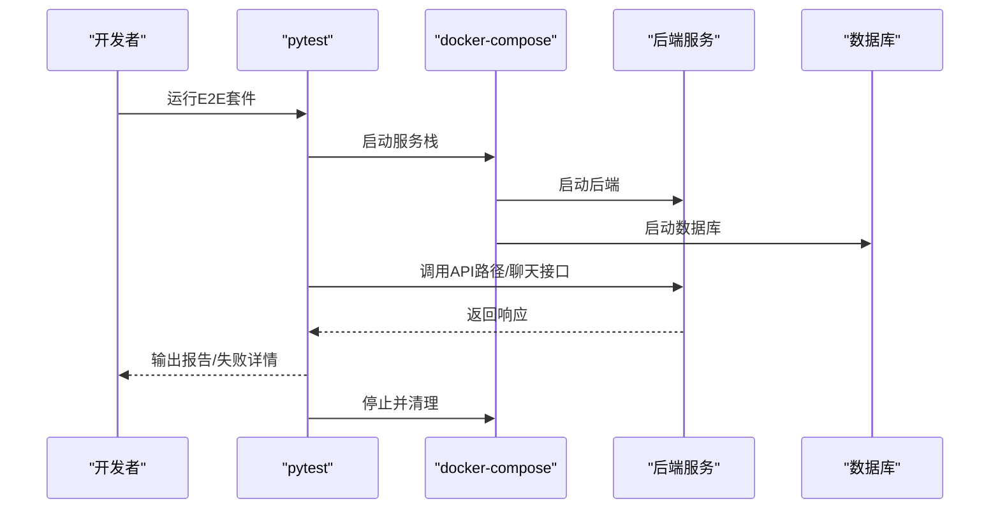
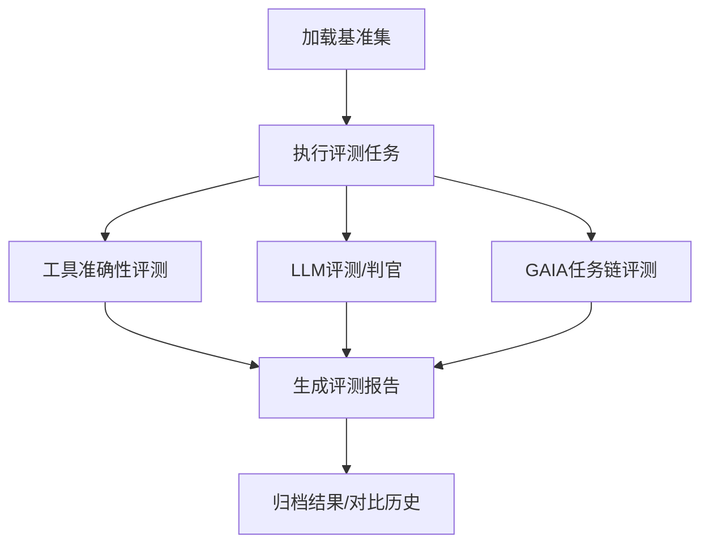
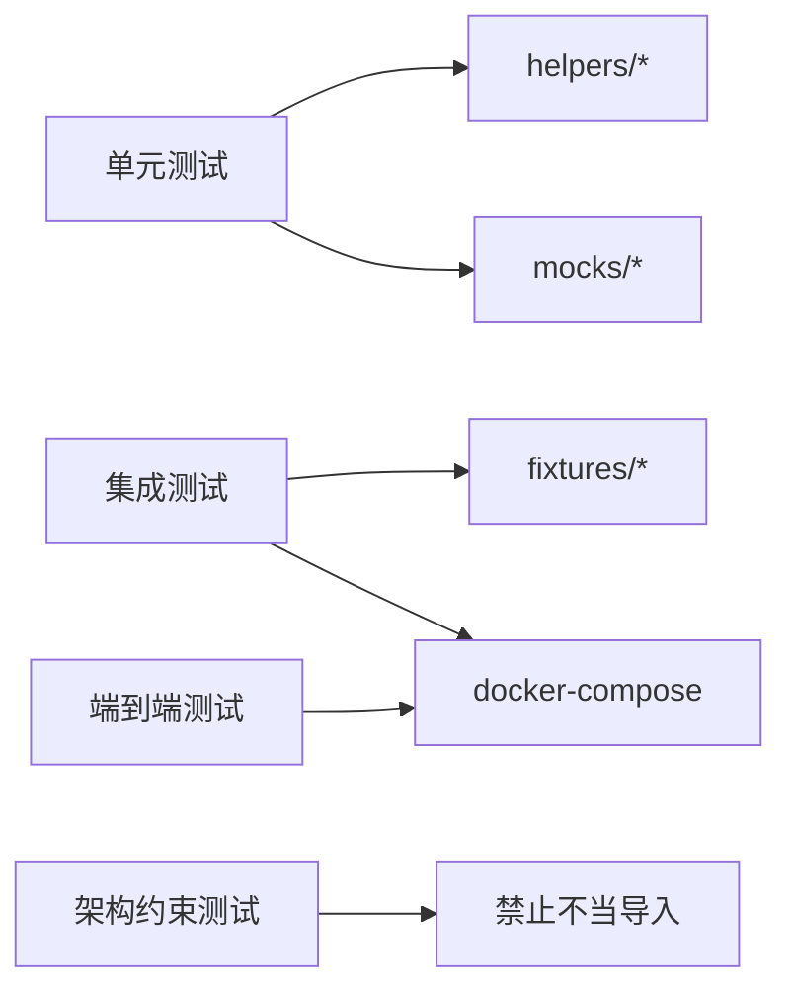

# 测试与开发

<cite>
**本文引用的文件**
- [backend/pyproject.toml](file://backend/pyproject.toml)
- [backend/Makefile](file://backend/Makefile)
- [backend/sonar-project.properties](file://backend/sonar-project.properties)
- [backend/docker-compose.yml](file://backend/docker-compose.yml)
- [backend/docker-compose.sonar.yml](file://backend/docker-compose.sonar.yml)
- [backend/tests/conftest.py](file://backend/tests/conftest.py)
- [backend/tests/e2e/conftest.py](file://backend/tests/e2e/conftest.py)
- [backend/tests/unit/agent/conftest.py](file://backend/tests/unit/agent/conftest.py)
- [backend/tests/mocks/llm_mock.py](file://backend/tests/mocks/llm_mock.py)
- [backend/tests/helpers/in_memory_checkpoint_cache.py](file://backend/tests/helpers/in_memory_checkpoint_cache.py)
- [backend/tests/helpers/permission_context.py](file://backend/tests/helpers/permission_context.py)
- [backend/tests/fixtures/factories.py](file://backend/tests/fixtures/factories.py)
- [backend/tests/unit/test_sandbox_executor.py](file://backend/tests/unit/test_sandbox_executor.py)
- [backend/tests/unit/test_sandbox_executor_factory.py](file://backend/tests/unit/test_sandbox_executor_factory.py)
- [backend/tests/unit/test_sandbox_manager.py](file://backend/tests/unit/test_sandbox_manager.py)
- [backend/tests/integration/test_memory_checkpoint_integration.py](file://backend/tests/integration/test_memory_checkpoint_integration.py)
- [backend/tests/integration/test_simplemem_integration.py](file://backend/tests/integration/test_simplemem_integration.py)
- [backend/tests/e2e/test_api_paths_e2e.py](file://backend/tests/e2e/test_api_paths_e2e.py)
- [backend/tests/e2e/test_chat_api_e2e.py](file://backend/tests/e2e/test_chat_api_e2e.py)
- [backend/tests/architecture/test_agent_no_gateway_domain_import.py](file://backend/tests/architecture/test_agent_no_gateway_domain_import.py)
- [backend/tests/architecture/test_domain_no_sqlalchemy.py](file://backend/tests/architecture/test_domain_no_sqlalchemy.py)
- [backend/tests/evaluation/test_benchmark_loader.py](file://backend/tests/evaluation/test_benchmark_loader.py)
- [backend/tests/evaluation/test_gaia.py](file://backend/tests/evaluation/test_gaia.py)
- [backend/tests/evaluation/test_llm_judge.py](file://backend/tests/evaluation/test_llm_judge.py)
- [backend/tests/evaluation/test_performance.py](file://backend/tests/evaluation/test_performance.py)
- [backend/tests/evaluation/test_tool_accuracy.py](file://backend/tests/evaluation/test_tool_accuracy.py)
- [backend/tests/evaluation/test_tool_accuracy_integration.py](file://backend/tests/evaluation/test_tool_accuracy_integration.py)
- [backend/evaluation/benchmark_loader.py](file://backend/evaluation/benchmark_loader.py)
- [backend/evaluation/gaia.py](file://backend/evaluation/gaia.py)
- [backend/evaluation/llm_judge.py](file://backend/evaluation/llm_judge.py)
- [backend/evaluation/performance.py](file://backend/evaluation/performance.py)
- [backend/evaluation/tool_accuracy.py](file://backend/evaluation/tool_accuracy.py)
- [backend/scripts/run_dev_server.py](file://backend/scripts/run_dev_server.py)
- [backend/scripts/test_gateway_proxy.py](file://backend/scripts/test_gateway_proxy.py)
- [backend/scripts/test_tool_registry.py](file://backend/scripts/test_tool_registry.py)
- [backend/scripts/test_checkpointer.py](file://backend/scripts/test_checkpointer.py)
- [backend/scripts/test_network_config.py](file://backend/scripts/test_network_config.py)
- [backend/scripts/test_litellm_models.py](file://backend/scripts/test_litellm_models.py)
- [backend/scripts/migrate_test_db.py](file://backend/scripts/migrate_test_db.py)
- [backend/scripts/cleanup_sandbox_containers.py](file://backend/scripts/cleanup_sandbox_containers.py)
- [backend/config/app.toml](file://backend/config/app.toml)
- [backend/config/environments/local-dev.toml](file://backend/config/environments/local-dev.toml)
- [backend/config/environments/python-dev.toml](file://backend/config/environments/python-dev.toml)
- [backend/config/environments/network-enabled.toml](file://backend/config/environments/network-enabled.toml)
- [backend/config/environments/network-restricted.toml](file://backend/config/environments/network-restricted.toml)
- [backend/config/environments/docker-dev.toml](file://backend/config/environments/docker-dev.toml)
- [backend/config/environments/k8s-prod.toml](file://backend/config/environments/k8s-prod.toml)
- [backend/config/environments/docker-prod.toml](file://backend/config/environments/docker-prod.toml)
- [backend/config/environments/minimal.toml](file://backend/config/environments/minimal.toml)
- [backend/config/environments/data-science.toml](file://backend/config/environments/data-science.toml)
- [backend/config/environments/node-dev.toml](file://backend/config/environments/node-dev.toml)
- [backend/config/execution.toml](file://backend/config/execution.toml)
- [backend/config/tools.toml](file://backend/config/tools.toml)
- [backend/config/mcp.toml](file://backend/config/mcp.toml)
- [backend/config/litellm_models.yaml](file://backend/config/litellm_models.yaml)
- [backend/docs/DEVELOPMENT.md](file://backend/docs/DEVELOPMENT.md)
- [backend/docs/CODE_STANDARDS.md](file://backend/docs/CODE_STANDARDS.md)
- [backend/docs/CONFIGURATION.md](file://backend/docs/CONFIGURATION.md)
- [backend/docs/ARCHITECTURE.md](file://backend/docs/ARCHITECTURE.md)
- [backend/docs/README.md](file://backend/docs/README.md)
- [frontend/vitest.config.ts](file://frontend/vitest.config.ts)
- [frontend/package.json](file://frontend/package.json)
- [frontend/src/api/client.test.ts](file://frontend/src/api/client.test.ts)
- [frontend/src/api/gateway.test.ts](file://frontend/src/api/gateway.test.ts)
- [frontend/src/api/paths.test.ts](file://frontend/src/api/paths.test.ts)
- [frontend/src/hooks/use-chat.test.ts](file://frontend/src/hooks/use-chat.test.ts)
- [frontend/src/components/confirm-alert-dialog.test.tsx](file://frontend/src/components/confirm-alert-dialog.test.tsx)
- [scripts/sonar-scan.sh](file://scripts/sonar-scan.sh)
- [scripts/sonarcloud-scan.sh](file://scripts/sonarcloud-scan.sh)
- [.github/workflows/backend-architecture.yml](file://.github/workflows/backend-architecture.yml)
- [backend/.github/workflows/sonar.yml](file://backend/.github/workflows/sonar.yml)
- [backend/.github/workflows/sonarcloud.yml](file://backend/.github/workflows/sonarcloud.yml)
- [backend/.github/workflows/typecheck.yml](file://backend/.github/workflows/typecheck.yml)
</cite>

## 目录
1. 引言
2. 项目结构
3. 核心组件
4. 架构总览
5. 详细组件分析
6. 依赖关系分析
7. 性能考虑
8. 故障排查指南
9. 结论
10. 附录

## 引言
本指南面向开发者，系统化梳理AI Agent项目的测试与开发流程，覆盖单元测试、集成测试、端到端测试、性能与基准测试、代码覆盖率、测试数据与环境管理、测试自动化与最佳实践，并结合后端Python与前端TypeScript/Vitest的实际测试结构给出可操作建议。目标是帮助团队建立稳定、可重复、可扩展的质量保障体系。

## 项目结构
后端采用分层领域驱动设计（DDD），测试按“架构约束测试”“单元测试”“集成测试”“端到端测试”“评估与基准测试”分类组织；前端使用Vitest进行单元测试。整体测试布局如下：

图中节点代表测试类别或模块，连线表示从底层到高层的测试层级关系。

章节来源
- [backend/docs/README.md:1-200](file://backend/docs/README.md#L1-L200)
- [backend/docs/DEVELOPMENT.md:1-200](file://backend/docs/DEVELOPMENT.md#L1-L200)

## 核心组件
- 测试框架与运行
  - 后端：pytest（通过pyproject.toml与Makefile配置）；支持并发、标记过滤、覆盖率输出。
  - 前端：Vitest（通过vitest.config.ts与package.json配置）。
- 配置与环境
  - 测试配置集中在tests/conftest.py及各子目录conftest.py，统一注册fixture、标记、插件与全局设置。
  - 环境配置位于config/environments与config/app.toml，便于在不同环境（本地、Docker、K8s、最小化等）下运行测试。
- Mock与辅助
  - tests/mocks提供LLM等外部依赖的Mock；tests/helpers提供内存检查点缓存、权限上下文等通用辅助。
- 评估与基准
  - evaluation模块提供benchmark加载、GAIA评测、LLM评测、性能评测与工具准确率评测，tests/evaluation对应集成验证。

章节来源
- [backend/pyproject.toml:1-200](file://backend/pyproject.toml#L1-L200)
- [backend/Makefile:1-200](file://backend/Makefile#L1-L200)
- [backend/tests/conftest.py:1-200](file://backend/tests/conftest.py#L1-L200)
- [backend/tests/e2e/conftest.py:1-200](file://backend/tests/e2e/conftest.py#L1-L200)
- [backend/tests/unit/agent/conftest.py:1-200](file://backend/tests/unit/agent/conftest.py#L1-L200)
- [backend/tests/mocks/llm_mock.py:1-200](file://backend/tests/mocks/llm_mock.py#L1-L200)
- [backend/tests/helpers/in_memory_checkpoint_cache.py:1-200](file://backend/tests/helpers/in_memory_checkpoint_cache.py#L1-L200)
- [backend/tests/helpers/permission_context.py:1-200](file://backend/tests/helpers/permission_context.py#L1-L200)
- [backend/config/app.toml:1-200](file://backend/config/app.toml#L1-L200)
- [backend/config/environments/local-dev.toml:1-200](file://backend/config/environments/local-dev.toml#L1-L200)
- [backend/config/environments/docker-dev.toml:1-200](file://backend/config/environments/docker-dev.toml#L1-L200)
- [backend/config/environments/k8s-prod.toml:1-200](file://backend/config/environments/k8s-prod.toml#L1-L200)

## 架构总览
测试金字塔与质量门禁如下：

图示说明了从架构约束到评估的完整质量闭环。

章节来源
- [.github/workflows/backend-architecture.yml:1-200](file://.github/workflows/backend-architecture.yml#L1-L200)
- [backend/.github/workflows/sonar.yml:1-200](file://backend/.github/workflows/sonar.yml#L1-L200)
- [backend/.github/workflows/sonarcloud.yml:1-200](file://backend/.github/workflows/sonarcloud.yml#L1-L200)
- [backend/.github/workflows/typecheck.yml:1-200](file://backend/.github/workflows/typecheck.yml#L1-L200)

## 详细组件分析

### 单元测试：组织、用例与Mock
- 组织方式
  - tests/unit按领域/子系统分层，如agent、gateway、domain、libs等，便于按模块隔离与并行执行。
  - 全局conftest.py注册通用fixture（如数据库会话、权限上下文、检查点缓存），子级conftest.py补充特定域的fixture。
- 用例设计
  - 覆盖核心业务逻辑分支、边界条件与异常路径；优先使用参数化与工厂模式生成测试数据。
  - 使用pytest.mark.skipif/xfail等控制用例执行与预期失败场景。
- Mock使用
  - 对外部服务（LLM、网关代理、网络配置）使用tests/mocks/llm_mock.py等进行行为替换，确保测试确定性与速度。
  - 对沙箱执行器与管理器提供独立单元测试，验证隔离与错误处理。
- 示例参考
  - 沙箱执行器与工厂、管理器的单元测试路径见下方“章节来源”。

章节来源
- [backend/tests/conftest.py:1-200](file://backend/tests/conftest.py#L1-L200)
- [backend/tests/unit/agent/conftest.py:1-200](file://backend/tests/unit/agent/conftest.py#L1-L200)
- [backend/tests/mocks/llm_mock.py:1-200](file://backend/tests/mocks/llm_mock.py#L1-L200)
- [backend/tests/unit/test_sandbox_executor.py:1-200](file://backend/tests/unit/test_sandbox_executor.py#L1-L200)
- [backend/tests/unit/test_sandbox_executor_factory.py:1-200](file://backend/tests/unit/test_sandbox_executor_factory.py#L1-L200)
- [backend/tests/unit/test_sandbox_manager.py:1-200](file://backend/tests/unit/test_sandbox_manager.py#L1-L200)

### 集成测试：数据库、外部服务与端到端
- 数据库测试
  - 使用Alembic迁移脚本与测试数据库连接，配合fixtures/factories.py生成种子数据，验证CRUD、索引与事务一致性。
  - 参考内存检查点与SimpleMem集成测试，验证状态持久化与恢复。
- 外部服务模拟
  - 通过scripts/test_gateway_proxy.py、scripts/test_tool_registry.py等脚本对网关代理与工具注册表进行集成验证。
  - 使用network-enabled/network-restricted等环境配置控制网络访问，确保测试在受限/开放环境下的一致性。
- 端到端测试
  - tests/e2e使用docker-compose编排后端服务与数据库，验证API路径与聊天流程的端到端连通性。

章节来源
- [backend/tests/integration/test_memory_checkpoint_integration.py:1-200](file://backend/tests/integration/test_memory_checkpoint_integration.py#L1-L200)
- [backend/tests/integration/test_simplemem_integration.py:1-200](file://backend/tests/integration/test_simplemem_integration.py#L1-L200)
- [backend/scripts/test_gateway_proxy.py:1-200](file://backend/scripts/test_gateway_proxy.py#L1-L200)
- [backend/scripts/test_tool_registry.py:1-200](file://backend/scripts/test_tool_registry.py#L1-L200)
- [backend/config/environments/network-enabled.toml:1-200](file://backend/config/environments/network-enabled.toml#L1-L200)
- [backend/config/environments/network-restricted.toml:1-200](file://backend/config/environments/network-restricted.toml#L1-L200)
- [backend/docker-compose.yml:1-200](file://backend/docker-compose.yml#L1-L200)

### 端到端测试：配置与执行
- 配置
  - tests/e2e/conftest.py统一配置服务启动、数据库初始化、清理流程；docker-compose用于拉起后端与依赖服务。
- 执行
  - 使用pytest标记过滤选择E2E套件；结合环境变量切换本地/容器化执行。
- 关键用例
  - API路径与聊天接口的E2E验证，确保路由、鉴权与消息流转正确。

章节来源
- [backend/tests/e2e/conftest.py:1-200](file://backend/tests/e2e/conftest.py#L1-L200)
- [backend/tests/e2e/test_api_paths_e2e.py:1-200](file://backend/tests/e2e/test_api_paths_e2e.py#L1-L200)
- [backend/tests/e2e/test_chat_api_e2e.py:1-200](file://backend/tests/e2e/test_chat_api_e2e.py#L1-L200)
- [backend/docker-compose.yml:1-200](file://backend/docker-compose.yml#L1-L200)

### 性能测试与基准测试
- 工具与方法
  - evaluation/performance.py提供性能评测入口；可结合pytest-benchmark或自定义计时器统计关键路径耗时。
  - 使用不同模型配置与数据规模对比吞吐与延迟，记录结果并可视化。
- 结果分析
  - 关注P50/P95延迟、错误率、资源占用（CPU/内存/IO）；针对瓶颈优化查询索引、缓存命中与并发策略。
- 与评估模块联动
  - 将性能指标纳入evaluation/benchmark_loader.py加载的基准集，形成持续回归基线。

章节来源
- [backend/evaluation/performance.py:1-200](file://backend/evaluation/performance.py#L1-L200)
- [backend/evaluation/benchmark_loader.py:1-200](file://backend/evaluation/benchmark_loader.py#L1-L200)

### 代码覆盖率测量与提升策略
- 测量
  - 通过pyproject.toml配置pytest-cov输出XML/HTML报告；CI中结合SonarQube/SonarCloud展示覆盖率趋势。
- 提升策略
  - 优先补齐关键路径与异常分支；对高风险模块（网关代理、沙箱执行器、内存检查点）提高覆盖率阈值。
  - 使用参数化用例覆盖边界输入；对异步/并发逻辑增加超时与重试断言。

章节来源
- [backend/pyproject.toml:1-200](file://backend/pyproject.toml#L1-L200)
- [backend/sonar-project.properties:1-200](file://backend/sonar-project.properties#L1-L200)

### 测试数据管理与环境配置
- 测试数据
  - 使用fixtures/factories.py生成可复用的测试实体；对敏感字段进行脱敏或占位。
  - Alembic迁移脚本配合scripts/migrate_test_db.py在测试前/后同步数据库结构。
- 环境配置
  - config/environments提供多环境模板（local-dev、docker-dev、k8s-prod、minimal、data-science、node-dev等），按需启用网络限制、最小化依赖与模型配置。
  - config/app.toml集中管理应用配置，确保测试与生产配置解耦。

章节来源
- [backend/tests/fixtures/factories.py:1-200](file://backend/tests/fixtures/factories.py#L1-L200)
- [backend/scripts/migrate_test_db.py:1-200](file://backend/scripts/migrate_test_db.py#L1-L200)
- [backend/config/environments/local-dev.toml:1-200](file://backend/config/environments/local-dev.toml#L1-L200)
- [backend/config/environments/docker-dev.toml:1-200](file://backend/config/environments/docker-dev.toml#L1-L200)
- [backend/config/environments/k8s-prod.toml:1-200](file://backend/config/environments/k8s-prod.toml#L1-L200)
- [backend/config/environments/minimal.toml:1-200](file://backend/config/environments/minimal.toml#L1-L200)
- [backend/config/environments/data-science.toml:1-200](file://backend/config/environments/data-science.toml#L1-L200)
- [backend/config/environments/node-dev.toml:1-200](file://backend/config/environments/node-dev.toml#L1-L200)
- [backend/config/app.toml:1-200](file://backend/config/app.toml#L1-L200)

### 测试自动化与最佳实践
- 自动化
  - GitHub Actions工作流：backend-architecture.yml（架构约束）、sonar.yml（SonarQube）、sonarcloud.yml（SonarCloud）、typecheck.yml（类型检查）。
  - CI中串联pytest、覆盖率、静态分析与Sonar扫描，失败即阻断。
- 最佳实践
  - 用例命名清晰、断言明确；避免跨用例状态耦合；使用factory/fixture减少重复setup。
  - 对外部依赖全部Mock或容器化；对数据库测试使用事务回滚或专用测试库。
  - 前端测试使用Vitest，覆盖API客户端、Hooks与UI组件的关键交互。

章节来源
- [.github/workflows/backend-architecture.yml:1-200](file://.github/workflows/backend-architecture.yml#L1-L200)
- [backend/.github/workflows/sonar.yml:1-200](file://backend/.github/workflows/sonar.yml#L1-L200)
- [backend/.github/workflows/sonarcloud.yml:1-200](file://backend/.github/workflows/sonarcloud.yml#L1-L200)
- [backend/.github/workflows/typecheck.yml:1-200](file://backend/.github/workflows/typecheck.yml#L1-L200)
- [frontend/vitest.config.ts:1-200](file://frontend/vitest.config.ts#L1-L200)
- [frontend/package.json:1-200](file://frontend/package.json#L1-L200)

### 评估与基准测试（工具准确性、LLM评测）
- 工具准确性
  - tests/evaluation/test_tool_accuracy.py与test_tool_accuracy_integration.py验证工具调用链的正确性与鲁棒性。
- LLM评测
  - tests/evaluation/test_llm_judge.py与evaluation/llm_judge.py结合人工/自动评分，形成评测报告。
- GAIA与任务完成度
  - tests/evaluation/test_gaia.py与evaluation/gaia.py支持复杂任务链路的评测；task_completion.py衡量最终完成率。
- 基准加载
  - evaluation/benchmark_loader.py加载标准基准集，统一评测格式与指标。

章节来源
- [backend/tests/evaluation/test_tool_accuracy.py:1-200](file://backend/tests/evaluation/test_tool_accuracy.py#L1-L200)
- [backend/tests/evaluation/test_tool_accuracy_integration.py:1-200](file://backend/tests/evaluation/test_tool_accuracy_integration.py#L1-L200)
- [backend/tests/evaluation/test_llm_judge.py:1-200](file://backend/tests/evaluation/test_llm_judge.py#L1-L200)
- [backend/tests/evaluation/test_gaia.py:1-200](file://backend/tests/evaluation/test_gaia.py#L1-L200)
- [backend/tests/evaluation/test_benchmark_loader.py:1-200](file://backend/tests/evaluation/test_benchmark_loader.py#L1-L200)
- [backend/evaluation/tool_accuracy.py:1-200](file://backend/evaluation/tool_accuracy.py#L1-L200)
- [backend/evaluation/llm_judge.py:1-200](file://backend/evaluation/llm_judge.py#L1-L200)
- [backend/evaluation/gaia.py:1-200](file://backend/evaluation/gaia.py#L1-L200)
- [backend/evaluation/benchmark_loader.py:1-200](file://backend/evaluation/benchmark_loader.py#L1-L200)

## 依赖关系分析
- 组件耦合
  - 单元测试依赖helpers与mocks；集成测试依赖fixtures与docker-compose；E2E依赖后端服务栈。
- 外部依赖
  - 网关代理、工具注册表、网络配置脚本作为外部服务被测试；通过Mock或容器化隔离。
- 循环依赖规避
  - 架构约束测试（tests/architecture）禁止不合理的跨域导入，降低循环依赖风险。

章节来源
- [backend/tests/architecture/test_agent_no_gateway_domain_import.py:1-200](file://backend/tests/architecture/test_agent_no_gateway_domain_import.py#L1-L200)
- [backend/tests/architecture/test_domain_no_sqlalchemy.py:1-200](file://backend/tests/architecture/test_domain_no_sqlalchemy.py#L1-L200)

## 性能考虑
- 并发与资源
  - pytest并发执行单元测试；E2E与集成测试应串行或分组执行，避免共享资源竞争。
- 缓存与索引
  - 利用evaluation/performance.py识别热点；结合Alembic索引迁移优化查询性能。
- 沙箱与容器
  - scripts/cleanup_sandbox_containers.py定期清理资源，避免测试间污染。

章节来源
- [backend/evaluation/performance.py:1-200](file://backend/evaluation/performance.py#L1-L200)
- [backend/scripts/cleanup_sandbox_containers.py:1-200](file://backend/scripts/cleanup_sandbox_containers.py#L1-L200)

## 故障排查指南
- 常见问题
  - 数据库迁移失败：使用scripts/migrate_test_db.py重建测试库；核对config/environments中的数据库URL。
  - 网络受限导致外部服务不可达：切换至network-enabled环境配置。
  - 覆盖率过低：补充高风险模块用例；使用pytest --cov-report=term-missing定位缺失分支。
- 定位手段
  - 查看pytest输出与日志；结合docker-compose日志与后端服务日志。
  - 使用tests/helpers/permission_context.py与in_memory_checkpoint_cache.py辅助调试状态与权限问题。

章节来源
- [backend/scripts/migrate_test_db.py:1-200](file://backend/scripts/migrate_test_db.py#L1-L200)
- [backend/config/environments/network-enabled.toml:1-200](file://backend/config/environments/network-enabled.toml#L1-L200)
- [backend/tests/helpers/permission_context.py:1-200](file://backend/tests/helpers/permission_context.py#L1-L200)
- [backend/tests/helpers/in_memory_checkpoint_cache.py:1-200](file://backend/tests/helpers/in_memory_checkpoint_cache.py#L1-L200)

## 结论
本指南基于仓库现有测试结构与配置，给出了从单元到端到端、从覆盖率到评估基准的全栈测试策略。建议团队在CI中强制执行架构约束与覆盖率门槛，持续完善评估与基准体系，以保障AI Agent系统的稳定性与可维护性。

## 附录
- 前端测试参考
  - Vitest配置与包管理见frontend/vitest.config.ts与frontend/package.json。
  - API客户端与组件测试样例：frontend/src/api/client.test.ts、frontend/src/api/gateway.test.ts、frontend/src/api/paths.test.ts、frontend/src/hooks/use-chat.test.ts、frontend/src/components/confirm-alert-dialog.test.tsx。

章节来源
- [frontend/vitest.config.ts:1-200](file://frontend/vitest.config.ts#L1-L200)
- [frontend/package.json:1-200](file://frontend/package.json#L1-L200)
- [frontend/src/api/client.test.ts:1-200](file://frontend/src/api/client.test.ts#L1-L200)
- [frontend/src/api/gateway.test.ts:1-200](file://frontend/src/api/gateway.test.ts#L1-L200)
- [frontend/src/api/paths.test.ts:1-200](file://frontend/src/api/paths.test.ts#L1-L200)
- [frontend/src/hooks/use-chat.test.ts:1-200](file://frontend/src/hooks/use-chat.test.ts#L1-L200)
- [frontend/src/components/confirm-alert-dialog.test.tsx:1-200](file://frontend/src/components/confirm-alert-dialog.test.tsx#L1-L200)