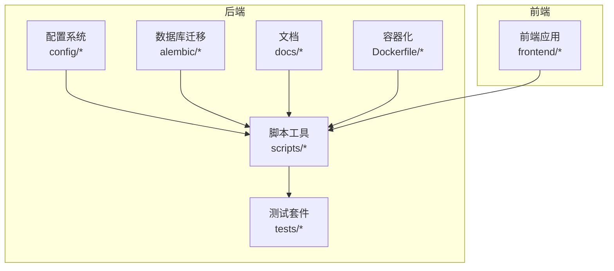
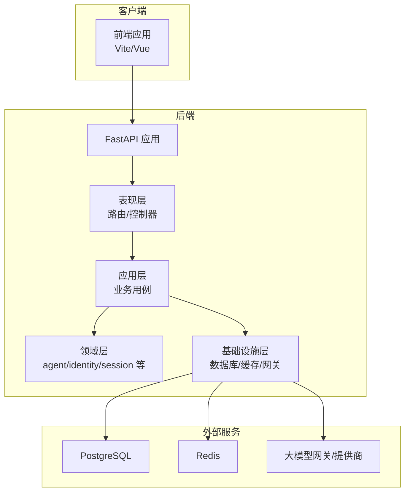
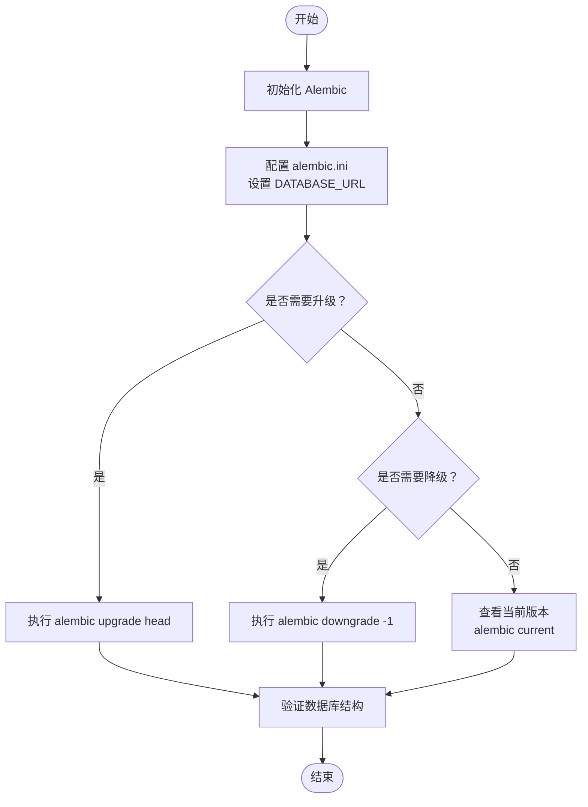
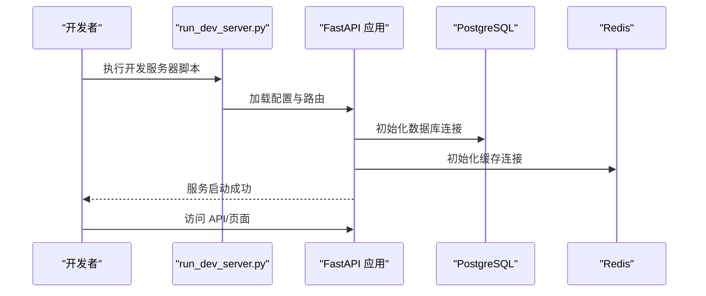
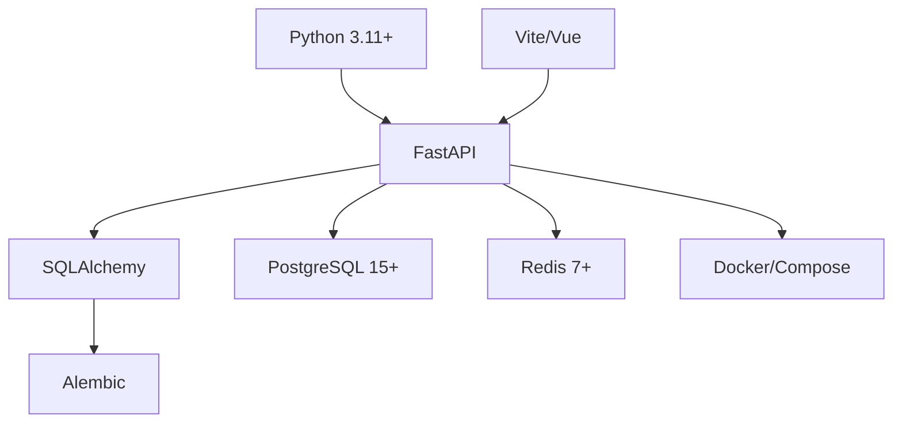

# 快速开始

<cite>
**本文引用的文件**
- [pyproject.toml](file://backend/pyproject.toml)
- [Makefile](file://backend/Makefile)
- [alembic.ini](file://backend/alembic.ini)
- [alembic/env.py](file://backend/alembic/env.py)
- [scripts/run_dev_server.py](file://backend/scripts/run_dev_server.py)
- [scripts/run_server.py](file://backend/scripts/run_server.py)
- [config/app.toml](file://backend/config/app.toml)
- [config/env.example](file://backend/config/env.example)
- [config/environments/local-dev.toml](file://backend/config/environments/local-dev.toml)
- [config/environments/docker-dev.toml](file://backend/config/environments/docker-dev.toml)
- [README.md](file://backend/README.md)
- [docs/DEVELOPMENT.md](file://backend/docs/DEVELOPMENT.md)
- [docs/CONFIGURATION.md](file://backend/docs/CONFIGURATION.md)
- [docs/AUTHENTICATION.md](file://backend/docs/AUTHENTICATION.md)
- [docs/ARCHITECTURE.md](file://backend/docs/ARCHITECTURE.md)
- [docs/AGENT_ARCHITECTURE_DESIGN.md](file://backend/docs/AGENT_ARCHITECTURE_DESIGN.md)
- [docs/LANGGRAPH_ARCHITECTURE_RATIONALE.md](file://backend/docs/LANGGRAPH_ARCHITECTURE_RATIONALE.md)
- [docs/gateway/GATEWAY_PRICING_AND_LITELLM_COST.md](file://backend/docs/gateway/GATEWAY_PRICING_AND_LITELLM_COST.md)
- [docs/mcp/MCP_QUICKSTART.md](file://backend/docs/mcp/MCP_QUICKSTART.md)
- [tests/README.md](file://backend/tests/README.md)
- [tests/conftest.py](file://backend/tests/conftest.py)
- [tests/unit/__init__.py](file://backend/tests/unit/__init__.py)
- [tests/integration/__init__.py](file://backend/tests/integration/__init__.py)
- [tests/e2e/README.md](file://backend/tests/e2e/README.md)
- [deploy/deploy.sh](file://deploy/deploy.sh)
- [deploy/remote-deploy.sh](file://deploy/remote-deploy.sh)
- [docker-compose.yml](file://docker-compose.yml)
- [docker-compose.prod.yml](file://docker-compose.prod.yml)
- [Dockerfile](file://backend/Dockerfile)
- [Dockerfile.base](file://backend/Dockerfile.base)
- [docker/sandbox/Dockerfile](file://backend/docker/sandbox/Dockerfile)
- [docker/sandbox/build.sh](file://backend/docker/sandbox/build.sh)
- [docker/sandbox/build.ps1](file://backend/docker/sandbox/build.ps1)
- [scripts/cleanup_sandbox_containers.py](file://backend/scripts/cleanup_sandbox_containers.py)
- [scripts/test_gateway_proxy.py](file://backend/scripts/test_gateway_proxy.py)
- [scripts/test_network_config.py](file://backend/scripts/test_network_config.py)
- [scripts/list_configured_models.py](file://backend/scripts/list_configured_models.py)
- [scripts/probe_dashscope_embedding.py](file://backend/scripts/probe_dashscope_embedding.py)
- [scripts/set_admin.py](file://backend/scripts/set_admin.py)
- [scripts/reset_quota.py](file://backend/scripts/reset_quota.py)
- [scripts/migrate_test_db.py](file://backend/scripts/migrate_test_db.py)
- [scripts/verify_ops_sql_files.py](file://backend/scripts/verify_ops_sql_files.py)
- [scripts/generate_alembic_sql_files.py](file://backend/scripts/generate_alembic_sql_files.py)
- [scripts/check_sonar_env.py](file://backend/scripts/check_sonar_env.py)
- [scripts/run_sonar_scanner.py](file://backend/scripts/run_sonar_scanner.py)
- [scripts/sonar-scan.sh](file://scripts/sonar-scan.sh)
- [scripts/sonarcloud-scan.sh](file://scripts/sonarcloud-scan.sh)
- [scripts/sonarcloud_api.py](file://scripts/sonarcloud_api.py)
- [scripts/fix_all_encoding_issues.py](file://backend/scripts/fix_all_encoding_issues.py)
- [scripts/check_encoding_issues.py](file://backend/scripts/check_encoding_issues.py)
- [scripts/verify_encoding_fix.py](file://backend/scripts/verify_encoding_fix.py)
- [scripts/inspect_duplicate_attribution.py](file://backend/scripts/inspect_duplicate_attribution.py)
- [scripts/inspect_gateway_logs.py](file://backend/scripts/inspect_gateway_logs.py)
- [scripts/test_checkpointer.py](file://backend/scripts/test_checkpointer.py)
- [scripts/test_tool_registry.py](file://backend/scripts/test_tool_registry.py)
- [scripts/test_litellm_models.py](file://backend/scripts/test_litellm_models.py)
- [scripts/seed_gateway_models.py](file://backend/scripts/seed_gateway_models.py)
- [scripts/run_seed_gateway.py](file://backend/scripts/run_seed_gateway.py)
- [scripts/fix_sessions_table.py](file://backend/scripts/fix_sessions_table.py)
- [scripts/README.md](file://backend/scripts/README.md)
</cite>

## 目录
1. [简介](#简介)
2. [项目结构](#项目结构)
3. [核心组件](#核心组件)
4. [架构总览](#架构总览)
5. [详细组件分析](#详细组件分析)
6. [依赖分析](#依赖分析)
7. [性能考虑](#性能考虑)
8. [故障排除指南](#故障排除指南)
9. [结论](#结论)
10. [附录](#附录)

## 简介
本指南面向首次接触 AI Agent 项目的开发者，帮助你在本地快速搭建开发环境，完成依赖安装、数据库初始化与迁移、环境变量配置、开发服务器启动、测试运行与验证，并提供 Windows 原生开发的注意事项与常见问题排查建议。项目采用 Python 后端（FastAPI）、PostgreSQL 数据库、Redis 缓存、Alembic 迁移、Docker 容器化部署以及前端 Vite/Vue 技术栈。

## 项目结构
后端位于 backend 目录，包含以下关键子模块：
- 配置系统：config 及其 environments 子目录，提供多环境配置与示例
- 数据库迁移：alembic 目录及版本化 SQL 文件
- 脚本工具：scripts 目录提供开发、测试、运维相关脚本
- 文档：docs 目录包含架构、开发、配置、认证等文档
- 测试：tests 盕录按单元/集成/E2E 分层组织
- 部署：deploy 目录提供部署脚本与生产配置
- Docker：根目录与 backend/docker/sandbox 提供容器化构建

**图表来源**
- [Makefile](file://backend/Makefile)
- [pyproject.toml](file://backend/pyproject.toml)
- [alembic.ini](file://backend/alembic.ini)
- [scripts/README.md](file://backend/scripts/README.md)

**章节来源**
- [README.md](file://backend/README.md)
- [docs/DEVELOPMENT.md](file://backend/docs/DEVELOPMENT.md)

## 核心组件
- Python 3.11+：项目使用现代 Python 版本以支持异步与类型提示
- PostgreSQL 15+：作为主数据库，配合 SQLAlchemy ORM 使用
- Redis 7+：用于缓存与会话存储
- uv 包管理器：替代 pip，提供更快的依赖解析与安装
- FastAPI 应用：通过 scripts/run_dev_server.py 或 scripts/run_server.py 启动
- Alembic：数据库版本管理与迁移
- Docker：容器化打包与沙箱隔离

**章节来源**
- [pyproject.toml](file://backend/pyproject.toml)
- [Makefile](file://backend/Makefile)
- [alembic.ini](file://backend/alembic.ini)

## 架构总览
系统采用分层架构与领域驱动设计（DDD），后端分为 domain、application、infrastructure、presentation 四层；同时引入 LangGraph 用于智能体编排。前端通过 API 与后端交互，部署通过 Docker Compose 管理服务编排。

**图表来源**
- [docs/ARCHITECTURE.md](file://backend/docs/ARCHITECTURE.md)
- [docs/AGENT_ARCHITECTURE_DESIGN.md](file://backend/docs/AGENT_ARCHITECTURE_DESIGN.md)
- [docs/LANGGRAPH_ARCHITECTURE_RATIONALE.md](file://backend/docs/LANGGRAPH_ARCHITECTURE_RATIONALE.md)

## 详细组件分析

### 环境要求与安装
- Python 3.11+：确保系统已安装 Python 3.11 或更高版本
- PostgreSQL 15+：安装并启动数据库服务，创建数据库与用户
- Redis 7+：安装并启动 Redis 服务
- uv 工具：安装 uv 以加速依赖安装与虚拟环境管理

**章节来源**
- [pyproject.toml](file://backend/pyproject.toml)
- [Makefile](file://backend/Makefile)

### 依赖安装与虚拟环境
- 推荐使用 uv 创建并激活虚拟环境
- 使用 uv install 安装项目依赖
- 如需开发依赖，可使用 uv add 添加到相应组
- 若使用 Docker 开发，可直接基于 Dockerfile 构建镜像

**章节来源**
- [pyproject.toml](file://backend/pyproject.toml)
- [Makefile](file://backend/Makefile)
- [Dockerfile](file://backend/Dockerfile)
- [Dockerfile.base](file://backend/Dockerfile.base)

### 环境变量配置
- 复制示例环境文件 backend/config/env.example 并重命名为 .env
- 关键配置项包括：
  - 数据库连接：DATABASE_URL
  - Redis 连接：REDIS_URL
  - JWT 密钥：SECRET_KEY
  - 调试开关：DEBUG
  - 网关提供商密钥：LITELLM_SECRET_KEY 等
  - 管理员账户：ADMIN_EMAIL/ADMIN_PASSWORD
- 不同环境可使用 config/environments 下的 .toml 文件覆盖默认值

**章节来源**
- [config/env.example](file://backend/config/env.example)
- [config/app.toml](file://backend/config/app.toml)
- [config/environments/local-dev.toml](file://backend/config/environments/local-dev.toml)
- [config/environments/docker-dev.toml](file://backend/config/environments/docker-dev.toml)
- [docs/CONFIGURATION.md](file://backend/docs/CONFIGURATION.md)

### 数据库初始化与迁移
- 初始化 Alembic：在 backend 目录执行 alembic init
- 配置 alembic.ini 中的 sqlalchemy.url 指向你的 DATABASE_URL
- 执行迁移：
  - 升级：alembic upgrade head
  - 降级：alembic downgrade -1
  - 查看状态：alembic current
- 迁移文件位于 alembic/versions 与 alembic/sql，版本号以时间戳命名，便于追踪变更

**图表来源**
- [alembic.ini](file://backend/alembic.ini)
- [alembic/env.py](file://backend/alembic/env.py)

**章节来源**
- [alembic.ini](file://backend/alembic.ini)
- [alembic/env.py](file://backend/alembic/env.py)
- [scripts/migrate_test_db.py](file://backend/scripts/migrate_test_db.py)
- [scripts/generate_alembic_sql_files.py](file://backend/scripts/generate_alembic_sql_files.py)

### 开发服务器启动
- 普通开发模式：使用 scripts/run_dev_server.py 启动
- 热重载模式：结合 Makefile 中的开发目标或使用 uvicorn --reload 运行
- 生产模式：使用 scripts/run_server.py 启动
- Docker 开发：使用 docker-compose.yml 启动服务栈

**图表来源**
- [scripts/run_dev_server.py](file://backend/scripts/run_dev_server.py)
- [scripts/run_server.py](file://backend/scripts/run_server.py)
- [docker-compose.yml](file://docker-compose.yml)

**章节来源**
- [scripts/run_dev_server.py](file://backend/scripts/run_dev_server.py)
- [scripts/run_server.py](file://backend/scripts/run_server.py)
- [Makefile](file://backend/Makefile)
- [docker-compose.yml](file://docker-compose.yml)

### 测试运行与验证
- 单元测试：pytest tests/unit
- 集成测试：pytest tests/integration
- E2E 测试：pytest tests/e2e
- 综合测试：pytest tests/
- 可使用 scripts/README.md 中的测试辅助脚本进行特定场景验证

**章节来源**
- [tests/README.md](file://backend/tests/README.md)
- [tests/conftest.py](file://backend/tests/conftest.py)
- [tests/unit/__init__.py](file://backend/tests/unit/__init__.py)
- [tests/integration/__init__.py](file://backend/tests/integration/__init__.py)
- [tests/e2e/README.md](file://backend/tests/e2e/README.md)

### Windows 原生开发注意事项
- 使用 PowerShell 或 WSL2：推荐在 WSL2 中运行以获得更接近 Linux 的开发体验
- Docker Desktop：启用 WSL2 后端，避免路径映射与权限问题
- 权限与路径：注意 Windows 与 WSL2 之间的路径差异，避免混合使用导致的权限问题
- 端口冲突：检查本地端口占用，必要时修改配置中的端口
- 环境变量：在 Windows 中使用 powershell 设置环境变量，或在 .env 文件中统一管理

**章节来源**
- [scripts/README.md](file://backend/scripts/README.md)
- [docs/DEVELOPMENT.md](file://backend/docs/DEVELOPMENT.md)

### 部署与运维
- 本地部署：使用 deploy/deploy.sh 或 deploy/remote-deploy.sh
- 生产部署：参考 docker-compose.prod.yml 与部署脚本
- 容器构建：使用 backend/Dockerfile 与 base 镜像
- 沙箱容器：使用 backend/docker/sandbox/Dockerfile 与 build.sh/build.ps1

**章节来源**
- [deploy/deploy.sh](file://deploy/deploy.sh)
- [deploy/remote-deploy.sh](file://deploy/remote-deploy.sh)
- [docker-compose.prod.yml](file://docker-compose.prod.yml)
- [Dockerfile](file://backend/Dockerfile)
- [Dockerfile.base](file://backend/Dockerfile.base)
- [docker/sandbox/Dockerfile](file://backend/docker/sandbox/Dockerfile)
- [docker/sandbox/build.sh](file://backend/docker/sandbox/build.sh)
- [docker/sandbox/build.ps1](file://backend/docker/sandbox/build.ps1)

## 依赖分析
- 语言与框架：Python 3.11+、FastAPI、SQLAlchemy、Alembic
- 数据库：PostgreSQL 15+
- 缓存：Redis 7+
- 容器化：Docker、Docker Compose
- 前端：Vite、Vue（位于 frontend 目录）
- 文档与规范：项目内含大量架构与开发文档

**图表来源**
- [pyproject.toml](file://backend/pyproject.toml)
- [Makefile](file://backend/Makefile)

**章节来源**
- [pyproject.toml](file://backend/pyproject.toml)
- [Makefile](file://backend/Makefile)

## 性能考虑
- 数据库索引与查询优化：根据 alembic/sql 中的索引迁移文件，确保热点表具备合适索引
- 缓存策略：合理使用 Redis 缓存高频数据与会话信息
- 异步处理：利用 FastAPI 的异步能力处理 I/O 密集任务
- 网关调用：通过 litellm 与网关模块优化模型调用与成本控制
- 日志与可观测性：结合 docs/observability 相关实践，建立完善的监控体系

**章节来源**
- [docs/gateway/GATEWAY_PRICING_AND_LITELLM_COST.md](file://backend/docs/gateway/GATEWAY_PRICING_AND_LITELLM_COST.md)
- [scripts/list_configured_models.py](file://backend/scripts/list_configured_models.py)
- [scripts/probe_dashscope_embedding.py](file://backend/scripts/probe_dashscope_embedding.py)

## 故障排除指南
- 数据库连接失败：检查 DATABASE_URL 是否正确，确认 PostgreSQL 已启动且网络可达
- Redis 连接异常：检查 REDIS_URL，确认 Redis 已启动
- Alembic 迁移错误：使用 alembic current 查看当前版本，必要时使用 downgrade 回退后重新 upgrade
- 端口冲突：修改配置中的端口或释放被占用端口
- 权限问题（Windows）：在 WSL2 中运行，避免混合路径与权限问题
- 网络连通性：使用 scripts/test_network_config.py 与 scripts/test_gateway_proxy.py 进行探测
- 清理与修复：使用 scripts/cleanup_sandbox_containers.py 清理容器，使用 scripts/fix_all_encoding_issues.py 修复编码问题

**章节来源**
- [scripts/test_network_config.py](file://backend/scripts/test_network_config.py)
- [scripts/test_gateway_proxy.py](file://backend/scripts/test_gateway_proxy.py)
- [scripts/cleanup_sandbox_containers.py](file://backend/scripts/cleanup_sandbox_containers.py)
- [scripts/fix_all_encoding_issues.py](file://backend/scripts/fix_all_encoding_issues.py)
- [scripts/check_encoding_issues.py](file://backend/scripts/check_encoding_issues.py)
- [scripts/verify_encoding_fix.py](file://backend/scripts/verify_encoding_fix.py)

## 结论
通过本快速开始指南，你可以在本地完成环境准备、依赖安装、数据库迁移、开发服务器启动与测试验证。建议在 WSL2 或 Linux 环境中进行开发以获得最佳体验，并结合项目内的文档与脚本工具提升开发效率与质量。

## 附录
- 配置与认证：参考 docs/CONFIGURATION.md 与 docs/AUTHENTICATION.md
- 网关与模型：参考 docs/gateway/GATEWAY_PRICING_AND_LITELLM_COST.md 与 docs/mcp/MCP_QUICKSTART.md
- 开发规范：参考 docs/CODE_STANDARDS.md 与 docs/DEVELOPMENT.md
- 架构与设计：参考 docs/ARCHITECTURE.md、docs/AGENT_ARCHITECTURE_DESIGN.md、docs/LANGGRAPH_ARCHITECTURE_RATIONALE.md

**章节来源**
- [docs/CONFIGURATION.md](file://backend/docs/CONFIGURATION.md)
- [docs/AUTHENTICATION.md](file://backend/docs/AUTHENTICATION.md)
- [docs/CODE_STANDARDS.md](file://backend/docs/CODE_STANDARDS.md)
- [docs/DEVELOPMENT.md](file://backend/docs/DEVELOPMENT.md)
- [docs/ARCHITECTURE.md](file://backend/docs/ARCHITECTURE.md)
- [docs/AGENT_ARCHITECTURE_DESIGN.md](file://backend/docs/AGENT_ARCHITECTURE_DESIGN.md)
- [docs/LANGGRAPH_ARCHITECTURE_RATIONALE.md](file://backend/docs/LANGGRAPH_ARCHITECTURE_RATIONALE.md)
- [docs/gateway/GATEWAY_PRICING_AND_LITELLM_COST.md](file://backend/docs/gateway/GATEWAY_PRICING_AND_LITELLM_COST.md)
- [docs/mcp/MCP_QUICKSTART.md](file://backend/docs/mcp/MCP_QUICKSTART.md)