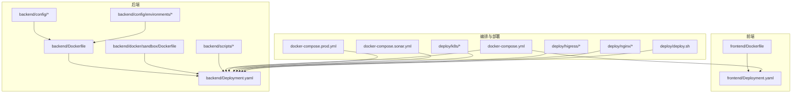
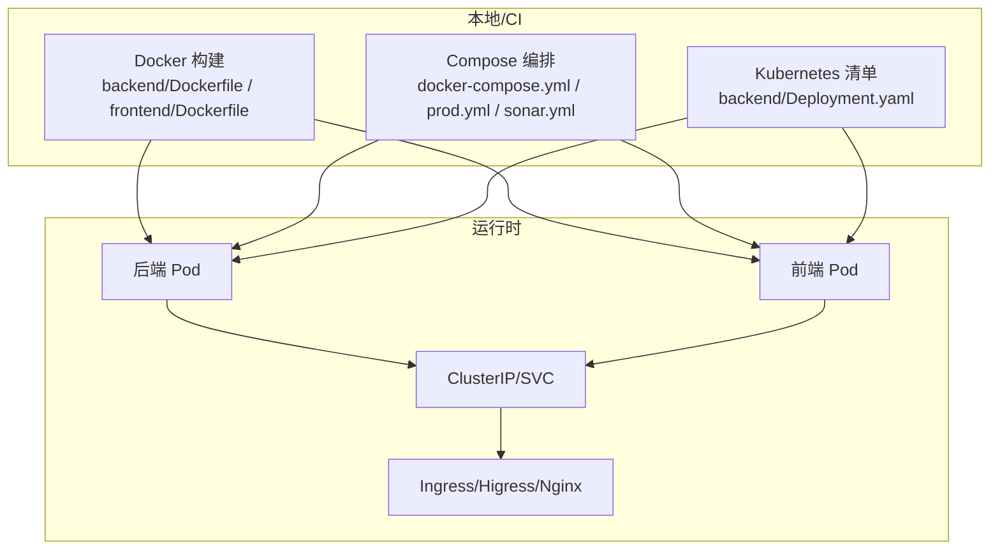
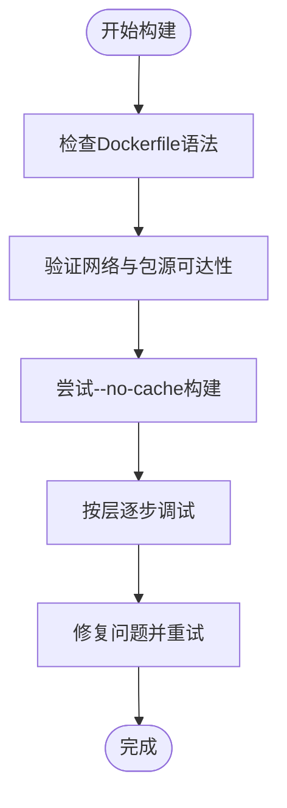
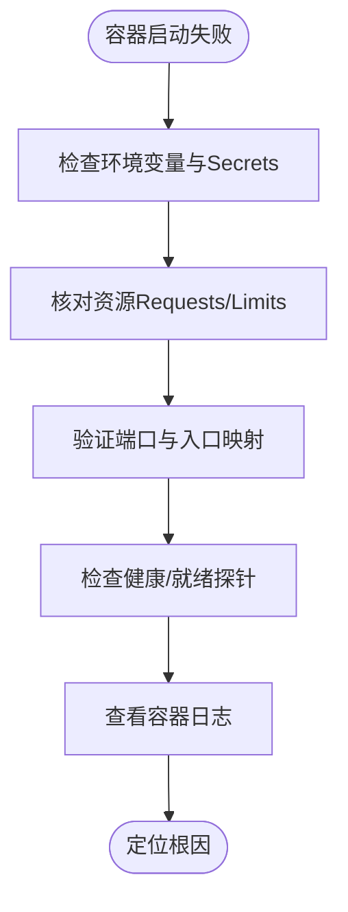
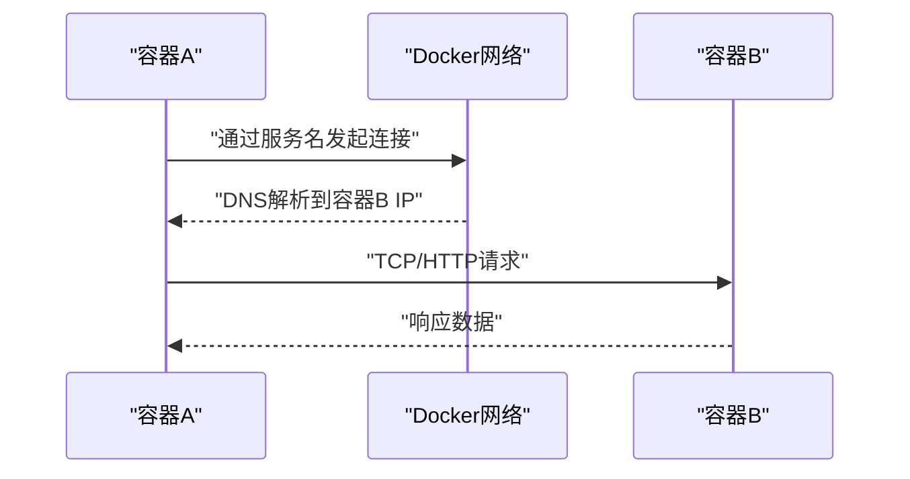
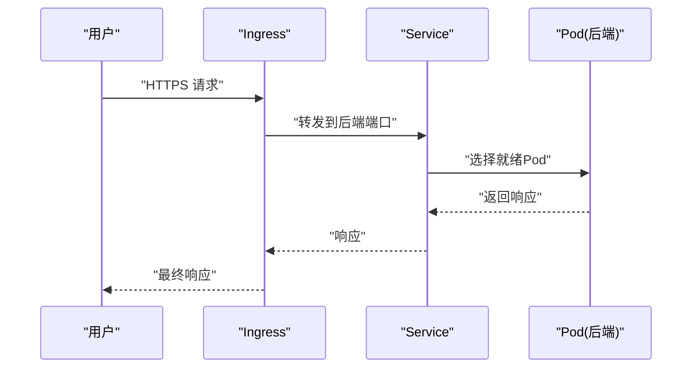
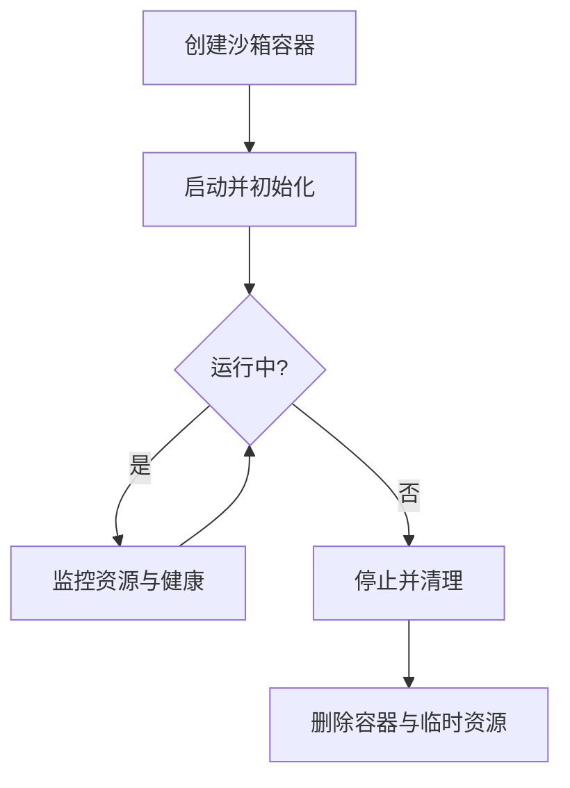
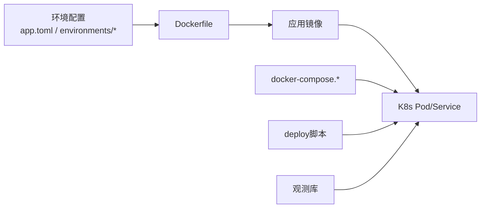

# 容器与Docker问题

<cite>
**本文引用的文件**
- [backend/Dockerfile](file://backend/Dockerfile)
- [backend/docker/sandbox/Dockerfile](file://backend/docker/sandbox/Dockerfile)
- [backend/.dockerignore](file://backend/.dockerignore)
- [backend/scripts/cleanup_sandbox_containers.py](file://backend/scripts/cleanup_sandbox_containers.py)
- [backend/docs/沙箱资源管理设计文档.md](file://backend/docs/沙箱资源管理设计文档.md)
- [backend/scripts/run_dev_server.py](file://backend/scripts/run_dev_server.py)
- [backend/scripts/run_server.py](file://backend/scripts/run_server.py)
- [backend/config/environments/docker-dev.toml](file://backend/config/environments/docker-dev.toml)
- [backend/config/environments/docker-prod.toml](file://backend/config/environments/docker-prod.toml)
- [backend/config/environments/k8s-prod.toml](file://backend/config/environments/k8s-prod.toml)
- [backend/config/app.toml](file://backend/config/app.toml)
- [backend/config/env.example](file://backend/config/env.example)
- [backend/Deployment.yaml](file://backend/Deployment.yaml)
- [deploy/k8s/README.md](file://deploy/k8s/README.md)
- [deploy/higress/ai-agent-ingress.example.yaml](file://deploy/higress/ai-agent-ingress.example.yaml)
- [deploy/nginx/ai-agent.bare-metal.conf.example](file://deploy/nginx/ai-agent.bare-metal.conf.example)
- [deploy/deploy.sh](file://deploy/deploy.sh)
- [deploy/remote-deploy.sh](file://deploy/remote-deploy.sh)
- [deploy/remote-deploy.ps1](file://deploy/remote-deploy.ps1)
- [docker-compose.yml](file://docker-compose.yml)
- [docker-compose.prod.yml](file://docker-compose.prod.yml)
- [docker-compose.sonar.yml](file://docker-compose.sonar.yml)
- [backend/utils/logging.py](file://backend/utils/logging.py)
- [backend/libs/observability](file://backend/libs/observability)
- [backend/scripts/test_network_config.py](file://backend/scripts/test_network_config.py)
- [backend/scripts/test_tool_registry.py](file://backend/scripts/test_tool_registry.py)
- [backend/scripts/probe_dashscope_embedding.py](file://backend/scripts/probe_dashscope_embedding.py)
- [backend/scripts/inspect_gateway_logs.py](file://backend/scripts/inspect_gateway_logs.py)
- [backend/scripts/set_admin.py](file://backend/scripts/set_admin.py)
- [backend/scripts/reset_quota.py](file://backend/scripts/reset_quota.py)
- [backend/scripts/migrate_test_db.py](file://backend/scripts/migrate_test_db.py)
- [backend/scripts/generate_alembic_sql_files.py](file://backend/scripts/generate_alembic_sql_files.py)
- [backend/scripts/check_sonar_env.py](file://backend/scripts/check_sonar_env.py)
- [backend/scripts/check_encoding_issues.py](file://backend/scripts/check_encoding_issues.py)
- [backend/scripts/verify_encoding_fix.py](file://backend/scripts/verify_encoding_fix.py)
- [backend/scripts/fix_all_encoding_issues.py](file://backend/scripts/fix_all_encoding_issues.py)
- [backend/scripts/test_checkpointer.py](file://backend/scripts/test_checkpointer.py)
- [backend/scripts/test_gateway_proxy.py](file://backend/scripts/test_gateway_proxy.py)
- [backend/scripts/test_litellm_models.py](file://backend/scripts/test_litellm_models.py)
- [backend/scripts/list_configured_models.py](file://backend/scripts/list_configured_models.py)
- [backend/scripts/seed_gateway_models.py](file://backend/scripts/seed_gateway_models.py)
- [backend/scripts/run_sonar_scanner.py](file://backend/scripts/run_sonar_scanner.py)
- [backend/scripts/verify_ops_sql_files.py](file://backend/scripts/verify_ops_sql_files.py)
- [backend/scripts/inspect_duplicate_attribution.py](file://backend/scripts/inspect_duplicate_attribution.py)
- [backend/scripts/fix_sessions_table.py](file://backend/scripts/fix_sessions_table.py)
- [backend/scripts/check_rules.py](file://backend/scripts/check_rules.py)
- [backend/scripts/check_encoding_issues.py](file://backend/scripts/check_encoding_issues.py)
- [backend/scripts/verify_encoding_fix.py](file://backend/scripts/verify_encoding_fix.py)
- [backend/scripts/fix_all_encoding_issues.py](file://backend/scripts/fix_all_encoding_issues.py)
- [backend/scripts/test_checkpointer.py](file://backend/scripts/test_checkpointer.py)
- [backend/scripts/test_gateway_proxy.py](file://backend/scripts/test_gateway_proxy.py)
- [backend/scripts/test_litellm_models.py](file://backend/scripts/test_litellm_models.py)
- [backend/scripts/list_configured_models.py](file://backend/scripts/list_configured_models.py)
- [backend/scripts/seed_gateway_models.py](file://backend/scripts/seed_gateway_models.py)
- [backend/scripts/run_sonar_scanner.py](file://backend/scripts/run_sonar_scanner.py)
- [backend/scripts/verify_ops_sql_files.py](file://backend/scripts/verify_ops_sql_files.py)
- [backend/scripts/inspect_duplicate_attribution.py](file://backend/scripts/inspect_duplicate_attribution.py)
- [backend/scripts/fix_sessions_table.py](file://backend/scripts/fix_sessions_table.py)
- [backend/scripts/check_rules.py](file://backend/scripts/check_rules.py)
</cite>

## 目录
1. [简介](#简介)
2. [项目结构](#项目结构)
3. [核心组件](#核心组件)
4. [架构总览](#架构总览)
5. [详细组件分析](#详细组件分析)
6. [依赖关系分析](#依赖关系分析)
7. [性能考量](#性能考量)
8. [故障排查指南](#故障排查指南)
9. [结论](#结论)
10. [附录](#附录)

## 简介
本文件面向AI Agent项目的容器化与Docker/Kubernetes运维场景，聚焦以下关键问题：
- Docker镜像构建问题：语法错误、依赖下载失败、构建缓存问题
- 容器启动失败：镜像完整性、环境变量、资源限制
- Docker网络配置：容器间通信、端口映射、网络隔离
- Kubernetes部署诊断：Pod状态、Service配置、Ingress路由
- 沙箱容器管理：生命周期、资源清理、安全策略
- 资源监控与优化：CPU/内存/磁盘/网络
- 日志收集与分析：聚合、轮转、远端存储
- 安全防护：镜像扫描、运行时保护、访问控制

## 项目结构
本仓库包含后端、前端、部署脚本与Kubernetes示例配置，容器相关的关键位置如下：
- 后端容器化：backend/Dockerfile、backend/docker/sandbox/Dockerfile、backend/.dockerignore、backend/Deployment.yaml
- 前端容器化：frontend/Dockerfile、frontend/Deployment.yaml
- Compose编排：docker-compose.yml、docker-compose.prod.yml、docker-compose.sonar.yml
- 部署脚本：deploy/deploy.sh、deploy/remote-deploy.sh、deploy/remote-deploy.ps1
- Kubernetes示例：deploy/k8s/README.md、deploy/higress/ai-agent-ingress.example.yaml、deploy/nginx/ai-agent.bare-metal.conf.example
- 运行与开发脚本：backend/scripts/run_dev_server.py、backend/scripts/run_server.py
- 配置与环境：backend/config/environments/*.toml、backend/config/app.toml、backend/config/env.example

**图表来源**
- [backend/Dockerfile](file://backend/Dockerfile)
- [backend/docker/sandbox/Dockerfile](file://backend/docker/sandbox/Dockerfile)
- [backend/Deployment.yaml](file://backend/Deployment.yaml)
- [frontend/Dockerfile](file://frontend/Dockerfile)
- [frontend/Deployment.yaml](file://frontend/Deployment.yaml)
- [docker-compose.yml](file://docker-compose.yml)
- [docker-compose.prod.yml](file://docker-compose.prod.yml)
- [docker-compose.sonar.yml](file://docker-compose.sonar.yml)
- [deploy/k8s/README.md](file://deploy/k8s/README.md)
- [deploy/higress/ai-agent-ingress.example.yaml](file://deploy/higress/ai-agent-ingress.example.yaml)
- [deploy/nginx/ai-agent.bare-metal.conf.example](file://deploy/nginx/ai-agent.bare-metal.conf.example)
- [deploy/deploy.sh](file://deploy/deploy.sh)

**章节来源**
- [backend/Dockerfile](file://backend/Dockerfile)
- [backend/docker/sandbox/Dockerfile](file://backend/docker/sandbox/Dockerfile)
- [backend/Deployment.yaml](file://backend/Deployment.yaml)
- [frontend/Dockerfile](file://frontend/Dockerfile)
- [frontend/Deployment.yaml](file://frontend/Deployment.yaml)
- [docker-compose.yml](file://docker-compose.yml)
- [docker-compose.prod.yml](file://docker-compose.prod.yml)
- [docker-compose.sonar.yml](file://docker-compose.sonar.yml)
- [deploy/k8s/README.md](file://deploy/k8s/README.md)
- [deploy/higress/ai-agent-ingress.example.yaml](file://deploy/higress/ai-agent-ingress.example.yaml)
- [deploy/nginx/ai-agent.bare-metal.conf.example](file://deploy/nginx/ai-agent.bare-metal.conf.example)
- [deploy/deploy.sh](file://deploy/deploy.sh)

## 核心组件
- 后端应用容器：基于backend/Dockerfile构建，支持开发与生产环境配置（backend/config/environments/*）
- 沙箱容器：独立的backend/docker/sandbox/Dockerfile，用于受限执行与工具调用
- 前端静态站点容器：基于frontend/Dockerfile构建
- 编排与部署：docker-compose.*系列文件定义服务编排；deploy目录提供部署脚本与Kubernetes/Higress/Nginx示例
- 配置与环境：app.toml与各环境*.toml决定容器内应用行为；env.example提供环境变量模板

**章节来源**
- [backend/Dockerfile](file://backend/Dockerfile)
- [backend/docker/sandbox/Dockerfile](file://backend/docker/sandbox/Dockerfile)
- [backend/config/environments/docker-dev.toml](file://backend/config/environments/docker-dev.toml)
- [backend/config/environments/docker-prod.toml](file://backend/config/environments/docker-prod.toml)
- [backend/config/environments/k8s-prod.toml](file://backend/config/environments/k8s-prod.toml)
- [backend/config/app.toml](file://backend/config/app.toml)
- [backend/config/env.example](file://backend/config/env.example)

## 架构总览
下图展示容器与Kubernetes部署的整体视图，涵盖镜像构建、服务编排、网络与入口路由。

**图表来源**
- [backend/Dockerfile](file://backend/Dockerfile)
- [frontend/Dockerfile](file://frontend/Dockerfile)
- [docker-compose.yml](file://docker-compose.yml)
- [docker-compose.prod.yml](file://docker-compose.prod.yml)
- [backend/Deployment.yaml](file://backend/Deployment.yaml)
- [deploy/higress/ai-agent-ingress.example.yaml](file://deploy/higress/ai-agent-ingress.example.yaml)
- [deploy/nginx/ai-agent.bare-metal.conf.example](file://deploy/nginx/ai-agent.bare-metal.conf.example)

## 详细组件分析

### Dockerfile构建问题诊断
常见症状与定位要点：
- 语法错误：检查FROM、RUN、COPY/ADD、ENV、EXPOSE、CMD/ENTRYPOINT等指令是否正确拼写与顺序
- 依赖下载失败：网络超时、包源不可达、代理设置、镜像源切换
- 构建缓存问题：缓存层未更新导致变更未生效，需逐层验证

建议排查步骤：
1) 逐步注释/拆分RUN命令，确认具体哪一步失败
2) 在失败阶段进入中间镜像，手动验证网络与包源
3) 使用--no-cache构建以排除缓存影响
4) 检查.dockerignore是否误排除了必要文件
5) 对多阶段构建，确认各阶段产物传递与权限

**图表来源**
- [backend/Dockerfile](file://backend/Dockerfile)
- [backend/.dockerignore](file://backend/.dockerignore)

**章节来源**
- [backend/Dockerfile](file://backend/Dockerfile)
- [backend/.dockerignore](file://backend/.dockerignore)

### 容器启动失败排查
- 镜像完整性：校验镜像哈希、层完整性；确保拉取/推送无中断
- 环境变量：核对backend/config/env.example与实际注入值；确认敏感信息通过Secrets管理
- 资源限制：CPU/Memory Requests/Limits与节点可用资源匹配；避免OOM或频繁驱逐
- 健康探针与就绪探针：确保探针路径与返回码符合预期
- 入口与端口：确认容器端口与Service/Ingress映射一致

**图表来源**
- [backend/config/env.example](file://backend/config/env.example)
- [backend/config/environments/docker-dev.toml](file://backend/config/environments/docker-dev.toml)
- [backend/config/environments/docker-prod.toml](file://backend/config/environments/docker-prod.toml)
- [backend/Deployment.yaml](file://backend/Deployment.yaml)

**章节来源**
- [backend/config/env.example](file://backend/config/env.example)
- [backend/config/environments/docker-dev.toml](file://backend/config/environments/docker-dev.toml)
- [backend/config/environments/docker-prod.toml](file://backend/config/environments/docker-prod.toml)
- [backend/Deployment.yaml](file://backend/Deployment.yaml)

### Docker网络配置问题
- 容器间通信：使用自定义网络与服务名解析；避免使用host.docker.internal在Linux
- 端口映射：确认HostPort与ContainerPort一致；避免端口冲突
- 网络隔离：通过NetworkPolicy限制入站/出站；仅暴露必要端口
- DNS与主机名：确保容器内能解析服务名；必要时使用固定网络别名

**图表来源**
- [docker-compose.yml](file://docker-compose.yml)
- [docker-compose.prod.yml](file://docker-compose.prod.yml)
- [backend/scripts/test_network_config.py](file://backend/scripts/test_network_config.py)

**章节来源**
- [docker-compose.yml](file://docker-compose.yml)
- [docker-compose.prod.yml](file://docker-compose.prod.yml)
- [backend/scripts/test_network_config.py](file://backend/scripts/test_network_config.py)

### Kubernetes部署诊断
- Pod状态：Pending/Running/Failed/Unknown；结合事件与日志定位
- Service配置：Selector、端口、协议；确认ClusterIP/SVC可达
- Ingress路由：路径、主机名、证书；Higress/Nginx配置一致性
- 资源与配额：命名空间资源配额、LimitRange与Pod限制
- 滚动更新与回滚：策略参数、就绪探针、副本数

**图表来源**
- [backend/Deployment.yaml](file://backend/Deployment.yaml)
- [deploy/higress/ai-agent-ingress.example.yaml](file://deploy/higress/ai-agent-ingress.example.yaml)
- [deploy/nginx/ai-agent.bare-metal.conf.example](file://deploy/nginx/ai-agent.bare-metal.conf.example)
- [deploy/k8s/README.md](file://deploy/k8s/README.md)

**章节来源**
- [backend/Deployment.yaml](file://backend/Deployment.yaml)
- [deploy/higress/ai-agent-ingress.example.yaml](file://deploy/higress/ai-agent-ingress.example.yaml)
- [deploy/nginx/ai-agent.bare-metal.conf.example](file://deploy/nginx/ai-agent.bare-metal.conf.example)
- [deploy/k8s/README.md](file://deploy/k8s/README.md)

### 沙箱容器管理
- 生命周期：创建、启动、监控、停止、销毁；避免僵尸进程与孤儿进程
- 资源清理：定期清理已退出容器、临时卷与日志；防止磁盘膨胀
- 安全策略：只读根文件系统、最小权限、禁用特权、限制sysctl与capabilities
- 隔离与审计：网络隔离、资源限额、日志审计与告警

**图表来源**
- [backend/docker/sandbox/Dockerfile](file://backend/docker/sandbox/Dockerfile)
- [backend/scripts/cleanup_sandbox_containers.py](file://backend/scripts/cleanup_sandbox_containers.py)
- [backend/docs/沙箱资源管理设计文档.md](file://backend/docs/沙箱资源管理设计文档.md)

**章节来源**
- [backend/docker/sandbox/Dockerfile](file://backend/docker/sandbox/Dockerfile)
- [backend/scripts/cleanup_sandbox_containers.py](file://backend/scripts/cleanup_sandbox_containers.py)
- [backend/docs/沙箱资源管理设计文档.md](file://backend/docs/沙箱资源管理设计文档.md)

### 容器资源监控与优化
- CPU/内存：设置合理的Requests/Limits；使用HPA根据指标自动扩缩容
- 磁盘：清理日志与临时文件；使用只读根文件系统减少写放大
- 网络：限制出口带宽与连接数；启用连接复用
- 观测性：集成Prometheus/Grafana与日志聚合；设置告警阈值

**章节来源**
- [backend/libs/observability](file://backend/libs/observability)
- [backend/utils/logging.py](file://backend/utils/logging.py)

### 容器日志收集与分析
- 日志聚合：集中式日志系统（如ELK/EFK）收集stdout/stderr
- 日志轮转：容器运行时与系统级logrotate；避免单文件过大
- 远程存储：将日志导出到对象存储或SIEM；保留合规周期
- 分析与告警：基于关键词与异常模式触发告警

**章节来源**
- [backend/utils/logging.py](file://backend/utils/logging.py)

### 容器安全防护
- 镜像扫描：CI中集成漏洞扫描；基线镜像定期更新
- 运行时保护：只读根文件系统、drop capabilities、限制syscalls
- 访问控制：RBAC、NetworkPolicy、PodSecurity标准
- 凭据管理：Secrets加密存储、最小权限访问

**章节来源**
- [backend/Dockerfile](file://backend/Dockerfile)
- [backend/Deployment.yaml](file://backend/Deployment.yaml)

## 依赖关系分析
容器构建与运行依赖关系概览：

**图表来源**
- [backend/config/app.toml](file://backend/config/app.toml)
- [backend/config/environments/docker-dev.toml](file://backend/config/environments/docker-dev.toml)
- [backend/Dockerfile](file://backend/Dockerfile)
- [backend/Deployment.yaml](file://backend/Deployment.yaml)
- [docker-compose.yml](file://docker-compose.yml)
- [deploy/deploy.sh](file://deploy/deploy.sh)
- [backend/libs/observability](file://backend/libs/observability)

**章节来源**
- [backend/config/app.toml](file://backend/config/app.toml)
- [backend/config/environments/docker-dev.toml](file://backend/config/environments/docker-dev.toml)
- [backend/Dockerfile](file://backend/Dockerfile)
- [backend/Deployment.yaml](file://backend/Deployment.yaml)
- [docker-compose.yml](file://docker-compose.yml)
- [deploy/deploy.sh](file://deploy/deploy.sh)
- [backend/libs/observability](file://backend/libs/observability)

## 性能考量
- 构建优化：多阶段构建、缓存友好、分层合理；避免大体积依赖
- 运行优化：合理设置资源配额、启用连接池、压缩传输
- 存储优化：精简镜像层数、移除不必要的开发工具与调试包
- 网络优化：内网直连、负载均衡、CDN加速静态资源

## 故障排查指南
- 构建失败
  - 语法错误：检查Dockerfile指令拼写与顺序
  - 依赖下载失败：更换镜像源、配置代理、离线缓存
  - 缓存问题：使用--no-cache或调整缓存层顺序
- 启动失败
  - 环境变量缺失：核对env.example与注入方式
  - 端口冲突：检查HostPort与Service端口映射
  - 探针失败：调整探针路径与超时参数
- 网络不通
  - 服务名解析：确认自定义网络与服务名
  - 端口映射：确保容器端口与Service/Ingress一致
  - 防火墙/策略：检查NetworkPolicy与安全组
- Kubernetes异常
  - Pod Pending：检查资源配额与节点亲和
  - 服务不可达：核对Selector与端口协议
  - Ingress 404/502：检查路径、主机名与后端健康
- 沙箱问题
  - 资源泄漏：定期清理容器与卷
  - 权限不足：最小权限原则与capabilities
- 日志与监控
  - 日志丢失：检查轮转与远端存储
  - 监控盲点：补充关键指标与告警

**章节来源**
- [backend/Dockerfile](file://backend/Dockerfile)
- [backend/.dockerignore](file://backend/.dockerignore)
- [backend/config/env.example](file://backend/config/env.example)
- [backend/Deployment.yaml](file://backend/Deployment.yaml)
- [deploy/higress/ai-agent-ingress.example.yaml](file://deploy/higress/ai-agent-ingress.example.yaml)
- [backend/scripts/cleanup_sandbox_containers.py](file://backend/scripts/cleanup_sandbox_containers.py)
- [backend/utils/logging.py](file://backend/utils/logging.py)

## 结论
通过规范的Dockerfile编写、严格的环境变量与资源管理、完善的网络与Kubernetes配置、以及持续的监控与安全加固，可以显著提升AI Agent项目的容器化稳定性与可维护性。建议在CI中强制执行镜像扫描与构建检查，在生产中启用严格的NetworkPolicy与最小权限模型，并建立标准化的日志与告警体系。

## 附录
- 开发与运行脚本参考
  - 后端开发服务器：backend/scripts/run_dev_server.py
  - 生产服务器：backend/scripts/run_server.py
- 部署与运维脚本
  - 本地部署：deploy/deploy.sh
  - 远程部署（Linux）：deploy/remote-deploy.sh
  - 远程部署（Windows）：deploy/remote-deploy.ps1
- 配置与环境
  - 应用配置：backend/config/app.toml
  - 环境配置：backend/config/environments/*.toml
  - 环境变量模板：backend/config/env.example
- 测试与诊断
  - 网络配置测试：backend/scripts/test_network_config.py
  - 工具注册表测试：backend/scripts/test_tool_registry.py
  - 网关代理测试：backend/scripts/test_gateway_proxy.py
  - 模型清单与探测：backend/scripts/list_configured_models.py、backend/scripts/test_litellm_models.py、backend/scripts/probe_dashscope_embedding.py
  - 网关日志检查：backend/scripts/inspect_gateway_logs.py
  - Sonar环境检查：backend/scripts/check_sonar_env.py
  - SQL文件生成与校验：backend/scripts/generate_alembic_sql_files.py、backend/scripts/verify_ops_sql_files.py
  - 数据修复与迁移：backend/scripts/fix_sessions_table.py、backend/scripts/migrate_test_db.py
  - 权限与配额：backend/scripts/set_admin.py、backend/scripts/reset_quota.py
  - 规则与编码检查：backend/scripts/check_rules.py、backend/scripts/check_encoding_issues.py、backend/scripts/verify_encoding_fix.py、backend/scripts/fix_all_encoding_issues.py
  - 其他辅助：backend/scripts/test_checkpointer.py、backend/scripts/run_sonar_scanner.py

**章节来源**
- [backend/scripts/run_dev_server.py](file://backend/scripts/run_dev_server.py)
- [backend/scripts/run_server.py](file://backend/scripts/run_server.py)
- [deploy/deploy.sh](file://deploy/deploy.sh)
- [deploy/remote-deploy.sh](file://deploy/remote-deploy.sh)
- [deploy/remote-deploy.ps1](file://deploy/remote-deploy.ps1)
- [backend/config/app.toml](file://backend/config/app.toml)
- [backend/config/environments/docker-dev.toml](file://backend/config/environments/docker-dev.toml)
- [backend/config/environments/docker-prod.toml](file://backend/config/environments/docker-prod.toml)
- [backend/config/environments/k8s-prod.toml](file://backend/config/environments/k8s-prod.toml)
- [backend/config/env.example](file://backend/config/env.example)
- [backend/scripts/test_network_config.py](file://backend/scripts/test_network_config.py)
- [backend/scripts/test_tool_registry.py](file://backend/scripts/test_tool_registry.py)
- [backend/scripts/test_gateway_proxy.py](file://backend/scripts/test_gateway_proxy.py)
- [backend/scripts/list_configured_models.py](file://backend/scripts/list_configured_models.py)
- [backend/scripts/test_litellm_models.py](file://backend/scripts/test_litellm_models.py)
- [backend/scripts/probe_dashscope_embedding.py](file://backend/scripts/probe_dashscope_embedding.py)
- [backend/scripts/inspect_gateway_logs.py](file://backend/scripts/inspect_gateway_logs.py)
- [backend/scripts/check_sonar_env.py](file://backend/scripts/check_sonar_env.py)
- [backend/scripts/generate_alembic_sql_files.py](file://backend/scripts/generate_alembic_sql_files.py)
- [backend/scripts/verify_ops_sql_files.py](file://backend/scripts/verify_ops_sql_files.py)
- [backend/scripts/fix_sessions_table.py](file://backend/scripts/fix_sessions_table.py)
- [backend/scripts/migrate_test_db.py](file://backend/scripts/migrate_test_db.py)
- [backend/scripts/set_admin.py](file://backend/scripts/set_admin.py)
- [backend/scripts/reset_quota.py](file://backend/scripts/reset_quota.py)
- [backend/scripts/check_rules.py](file://backend/scripts/check_rules.py)
- [backend/scripts/check_encoding_issues.py](file://backend/scripts/check_encoding_issues.py)
- [backend/scripts/verify_encoding_fix.py](file://backend/scripts/verify_encoding_fix.py)
- [backend/scripts/fix_all_encoding_issues.py](file://backend/scripts/fix_all_encoding_issues.py)
- [backend/scripts/test_checkpointer.py](file://backend/scripts/test_checkpointer.py)
- [backend/scripts/run_sonar_scanner.py](file://backend/scripts/run_sonar_scanner.py)