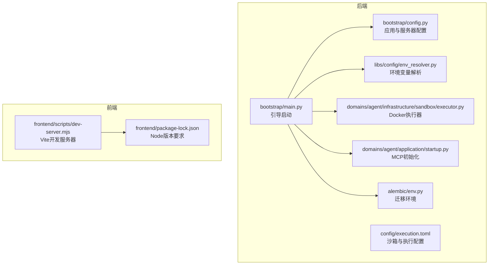
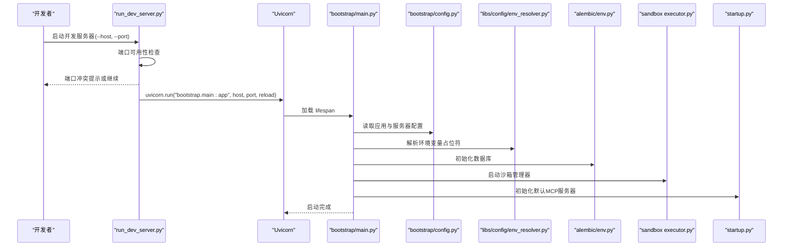
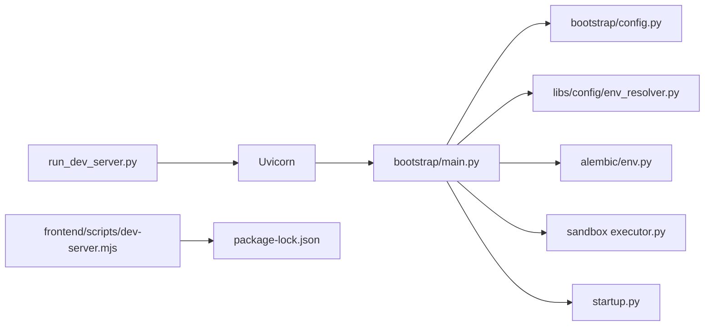

# 常见问题解答

<cite>
**本文引用的文件**
- [backend/bootstrap/config.py](file://backend/bootstrap/config.py)
- [backend/scripts/run_dev_server.py](file://backend/scripts/run_dev_server.py)
- [backend/bootstrap/main.py](file://backend/bootstrap/main.py)
- [backend/libs/config/env_resolver.py](file://backend/libs/config/env_resolver.py)
- [scripts/sonarcloud_api.py](file://scripts/sonarcloud_api.py)
- [backend/config/execution.toml](file://backend/config/execution.toml)
- [backend/docker/sandbox/.dockerignore](file://backend/docker/sandbox/.dockerignore)
- [backend/domains/agent/infrastructure/sandbox/executor.py](file://backend/domains/agent/infrastructure/sandbox/executor.py)
- [backend/domains/agent/application/startup.py](file://backend/domains/agent/application/startup.py)
- [backend/docs/mcp/MCP_AUTO_INIT.md](file://backend/docs/mcp/MCP_AUTO_INIT.md)
- [backend/alembic/env.py](file://backend/alembic/env.py)
- [.understand-anything/.understandignore](file://.understand-anything/.understandignore)
- [backend/Makefile](file://backend/Makefile)
- [frontend/package-lock.json](file://frontend/package-lock.json)
- [frontend/scripts/dev-server.mjs](file://frontend/scripts/dev-server.mjs)
- [backend/domains/gateway/presentation/http_error_map.py](file://backend/domains/gateway/presentation/http_error_map.py)
- [backend/scripts/run_seed_gateway.py](file://backend/scripts/run_seed_gateway.py)
- [backend/config/tools.toml](file://backend/config/tools.toml)
</cite>

## 目录
1. [简介](#简介)
2. [项目结构](#项目结构)
3. [核心组件](#核心组件)
4. [架构总览](#架构总览)
5. [详细组件分析](#详细组件分析)
6. [依赖关系分析](#依赖关系分析)
7. [性能考虑](#性能考虑)
8. [故障排查指南](#故障排查指南)
9. [结论](#结论)
10. [附录](#附录)

## 简介
本FAQ面向首次安装与日常运行AI Agent项目的用户，聚焦安装、配置、运行阶段的典型问题，涵盖Python环境与依赖、端口占用、权限不足、FastAPI服务器启动失败、前端开发服务器问题、Docker容器启动失败、数据库连接问题、MCP工具初始化失败、沙箱执行环境问题以及网关服务异常等。每个问题均提供症状、可能原因与分步解决步骤，帮助快速定位与修复。

## 项目结构
项目采用前后端分离与多模块领域划分的组织方式：
- 后端（Python/FastAPI）位于 backend/，包含引导启动、配置、数据库迁移、沙箱执行、MCP初始化、网关等领域能力。
- 前端（Vite/Vue）位于 frontend/，包含开发服务器脚本与包管理配置。
- 配置与文档位于 backend/config/ 与 docs/，包含执行环境、MCP、网关等说明。
- 部署相关位于 deploy/ 与 docker-compose.yml 等。

**图表来源**
- [backend/bootstrap/main.py:111-153](file://backend/bootstrap/main.py#L111-L153)
- [backend/bootstrap/config.py:44-69](file://backend/bootstrap/config.py#L44-L69)
- [backend/libs/config/env_resolver.py:50-91](file://backend/libs/config/env_resolver.py#L50-L91)
- [backend/config/execution.toml:1-38](file://backend/config/execution.toml#L1-L38)
- [backend/domains/agent/infrastructure/sandbox/executor.py:149-228](file://backend/domains/agent/infrastructure/sandbox/executor.py#L149-L228)
- [backend/domains/agent/application/startup.py:62-98](file://backend/domains/agent/application/startup.py#L62-L98)
- [backend/alembic/env.py:91-131](file://backend/alembic/env.py#L91-L131)
- [frontend/scripts/dev-server.mjs:1-27](file://frontend/scripts/dev-server.mjs#L1-L27)
- [frontend/package-lock.json:11264-11322](file://frontend/package-lock.json#L11264-L11322)

**章节来源**
- [backend/bootstrap/main.py:111-153](file://backend/bootstrap/main.py#L111-L153)
- [backend/bootstrap/config.py:44-69](file://backend/bootstrap/config.py#L44-L69)
- [backend/libs/config/env_resolver.py:50-91](file://backend/libs/config/env_resolver.py#L50-L91)
- [backend/config/execution.toml:1-38](file://backend/config/execution.toml#L1-L38)
- [backend/domains/agent/infrastructure/sandbox/executor.py:149-228](file://backend/domains/agent/infrastructure/sandbox/executor.py#L149-L228)
- [backend/domains/agent/application/startup.py:62-98](file://backend/domains/agent/application/startup.py#L62-L98)
- [backend/alembic/env.py:91-131](file://backend/alembic/env.py#L91-L131)
- [frontend/scripts/dev-server.mjs:1-27](file://frontend/scripts/dev-server.mjs#L1-L27)
- [frontend/package-lock.json:11264-11322](file://frontend/package-lock.json#L11264-L11322)

## 核心组件
- 应用与服务器配置：定义应用名称、环境、调试开关、API前缀、根路径、Cookie安全策略、监听地址、端口、工作进程数与热重载等。
- 环境变量解析：支持在配置中使用 ${VAR} 或 ${VAR:default} 形式的占位符，并对未解析项进行检测。
- 开发服务器：提供端口可用性检查、冲突提示与端口切换建议，支持Windows事件循环选择。
- 沙箱执行：基于Docker的隔离执行，支持资源限制、只读根文件系统、临时目录、网络隔离与卷挂载。
- MCP初始化：应用启动时自动初始化系统级默认MCP服务器，幂等处理。
- 数据库迁移：通过Alembic加载settings中的数据库URL，支持离线迁移与运维SQL导出。
- 前端开发服务器：Vite开发服务器启动脚本，提升HTTP头部大小上限以避免HMR触发431错误。

**章节来源**
- [backend/bootstrap/config.py:44-69](file://backend/bootstrap/config.py#L44-L69)
- [backend/libs/config/env_resolver.py:50-91](file://backend/libs/config/env_resolver.py#L50-L91)
- [backend/scripts/run_dev_server.py:39-91](file://backend/scripts/run_dev_server.py#L39-L91)
- [backend/domains/agent/infrastructure/sandbox/executor.py:149-228](file://backend/domains/agent/infrastructure/sandbox/executor.py#L149-L228)
- [backend/domains/agent/application/startup.py:62-98](file://backend/domains/agent/application/startup.py#L62-L98)
- [backend/alembic/env.py:91-131](file://backend/alembic/env.py#L91-L131)
- [frontend/scripts/dev-server.mjs:1-27](file://frontend/scripts/dev-server.mjs#L1-L27)

## 架构总览
下图展示启动流程与关键组件交互，包括环境变量解析、数据库初始化、沙箱与MCP初始化、网关启动以及开发服务器端口检查。

**图表来源**
- [backend/scripts/run_dev_server.py:64-87](file://backend/scripts/run_dev_server.py#L64-L87)
- [backend/bootstrap/main.py:111-153](file://backend/bootstrap/main.py#L111-L153)
- [backend/bootstrap/config.py:44-69](file://backend/bootstrap/config.py#L44-L69)
- [backend/libs/config/env_resolver.py:50-91](file://backend/libs/config/env_resolver.py#L50-L91)
- [backend/alembic/env.py:91-131](file://backend/alembic/env.py#L91-L131)
- [backend/domains/agent/infrastructure/sandbox/executor.py:149-228](file://backend/domains/agent/infrastructure/sandbox/executor.py#L149-L228)
- [backend/domains/agent/application/startup.py:62-98](file://backend/domains/agent/application/startup.py#L62-L98)

## 详细组件分析

### Python环境与依赖安装问题
- 症状
  - 安装依赖时报错（如uv.lock不匹配、平台不兼容、编译依赖失败）。
  - 运行时导入模块失败或版本冲突。
- 可能原因
  - 未使用统一的包管理器或锁定文件。
  - Python版本与依赖不兼容。
  - 未正确创建/激活虚拟环境。
- 解决步骤
  - 使用统一的包管理与同步流程：参考后端Makefile中的安装与同步目标，确保使用uv进行安装与同步。
  - 清理缓存并重新生成锁文件：使用锁定目标生成/更新锁文件，再执行同步。
  - 确保虚拟环境已创建并激活后再安装依赖。
  - 如需预提交钩子安装失败，检查Git配置并重试。

**章节来源**
- [backend/Makefile:70-101](file://backend/Makefile#L70-L101)

### 端口占用冲突（FastAPI开发服务器）
- 症状
  - 启动开发服务器时报端口已被占用，Windows常见WinError 10013/EADDRINUSE。
- 可能原因
  - 另一个开发服务器实例仍在运行。
  - 端口被系统或其他进程占用。
- 解决步骤
  - 使用端口可用性检查脚本确认占用情况。
  - 通过系统工具查询占用进程并终止，或切换到其他端口。
  - 在Windows上注意事件循环差异，必要时调整运行参数。

**章节来源**
- [backend/scripts/run_dev_server.py:39-91](file://backend/scripts/run_dev_server.py#L39-L91)

### FastAPI服务器启动失败（端口、环境变量、依赖）
- 症状
  - 服务器启动后立即退出或无法访问。
- 可能原因
  - 端口不可用或被占用。
  - 环境变量未正确解析，导致配置缺失。
  - 依赖未安装或版本不匹配。
- 解决步骤
  - 先执行端口检查与切换。
  - 检查环境变量解析，确保占位符被正确替换且无未解析项。
  - 使用Makefile目标安装/同步依赖，保证运行时所需模块齐全。
  - 校验应用配置（主机、端口、根路径、API前缀）是否合理。

**章节来源**
- [backend/scripts/run_dev_server.py:64-87](file://backend/scripts/run_dev_server.py#L64-L87)
- [backend/libs/config/env_resolver.py:50-91](file://backend/libs/config/env_resolver.py#L50-L91)
- [backend/bootstrap/config.py:44-69](file://backend/bootstrap/config.py#L44-L69)
- [backend/Makefile:70-101](file://backend/Makefile#L70-L101)

### 前端开发服务器启动问题（Node.js版本、依赖、热重载）
- 症状
  - 启动失败、HMR触发431错误（请求头过大）、依赖安装失败。
- 可能原因
  - Node.js版本不符合Vite要求。
  - 包依赖未正确安装或版本冲突。
  - 默认HTTP头部大小限制导致HMR失败。
- 解决步骤
  - 检查package-lock.json中的Node版本范围，确保满足Vite要求。
  - 使用包管理器安装依赖，避免混合使用不同工具。
  - 使用提供的开发服务器脚本启动，该脚本已增大HTTP头部大小上限以规避431问题。
  - 若仍出现热重载异常，清理缓存并重新安装依赖。

**章节来源**
- [frontend/package-lock.json:11264-11322](file://frontend/package-lock.json#L11264-L11322)
- [frontend/scripts/dev-server.mjs:1-27](file://frontend/scripts/dev-server.mjs#L1-L27)

### Docker容器启动失败（镜像拉取、卷挂载、网络）
- 症状
  - 容器无法启动、命令执行失败、超时或权限不足。
- 可能原因
  - Docker守护进程未运行或权限不足。
  - 镜像不存在或拉取失败。
  - 卷挂载路径不存在或权限不足。
  - 网络隔离导致无法访问外部资源。
- 解决步骤
  - 确认Docker服务状态与权限，必要时以管理员身份运行。
  - 拉取所需镜像并验证可用性。
  - 检查宿主路径是否存在且可读，修正挂载路径。
  - 根据沙箱配置决定是否启用网络访问与允许的主机列表。
  - 观察容器执行器返回的错误信息，定位具体失败环节。

**章节来源**
- [backend/domains/agent/infrastructure/sandbox/executor.py:149-228](file://backend/domains/agent/infrastructure/sandbox/executor.py#L149-L228)
- [backend/config/execution.toml:17-38](file://backend/config/execution.toml#L17-L38)
- [backend/docker/sandbox/.dockerignore:1-32](file://backend/docker/sandbox/.dockerignore#L1-L32)

### 数据库连接问题（连接字符串、网络、凭据）
- 症状
  - 迁移或启动时报数据库连接失败、认证失败或超时。
- 可能原因
  - 连接字符串格式不正确或缺少必需参数。
  - 目标数据库不可达（网络策略、防火墙、容器网络）。
  - 凭据错误或权限不足。
- 解决步骤
  - 检查数据库URL是否完整且符合预期格式。
  - 确认网络连通性与访问策略，必要时在同网段或容器网络内访问。
  - 校验用户名、密码、数据库名与端口。
  - 使用Alembic离线迁移进行验证，避免线上风险。

**章节来源**
- [backend/alembic/env.py:91-131](file://backend/alembic/env.py#L91-L131)

### MCP工具初始化失败
- 症状
  - 应用启动后MCP服务器未就绪或工具不可用。
- 可能原因
  - 默认MCP服务器初始化失败或数据库中已有但状态异常。
  - 某些服务器需要额外凭据（如GitHub token、PostgreSQL连接串、Slack bot token）。
- 解决步骤
  - 关注启动日志，确认默认服务器初始化完成。
  - 对需要凭据的服务器，按文档补充相应配置。
  - 如需重置或重建，结合数据库与初始化逻辑进行排查。

**章节来源**
- [backend/domains/agent/application/startup.py:62-98](file://backend/domains/agent/application/startup.py#L62-L98)
- [backend/docs/mcp/MCP_AUTO_INIT.md:1-46](file://backend/docs/mcp/MCP_AUTO_INIT.md#L1-L46)

### 沙箱执行环境问题（超时、权限、资源限制）
- 症状
  - 工具执行超时、权限不足、资源受限导致失败。
- 可能原因
  - 超时时间过短或命令本身耗时较长。
  - 只读根文件系统导致写入失败。
  - 网络隔离或允许主机列表不包含目标域名。
  - 资源限制（内存/CPU/磁盘）不足。
- 解决步骤
  - 根据执行配置适当提高超时时间。
  - 在需要写入的场景下，评估是否允许临时目录或调整只读策略。
  - 将目标主机加入允许列表或在非隔离场景下测试。
  - 调整资源限制以满足任务需求。

**章节来源**
- [backend/config/execution.toml:17-38](file://backend/config/execution.toml#L17-L38)
- [backend/domains/agent/infrastructure/sandbox/executor.py:149-228](file://backend/domains/agent/infrastructure/sandbox/executor.py#L149-L228)

### 网关服务异常（模型未找到、权限不足）
- 症状
  - 请求返回404（模型未找到）或权限相关错误。
- 可能原因
  - 模型未注册或未同步至网关目录。
  - 当前用户无访问或编辑权限。
- 解决步骤
  - 使用提供的脚本初始化数据库并同步网关种子。
  - 检查用户权限与模型作用域，确保具备相应能力。
  - 参考异常映射逻辑，定位具体错误类型并针对性修复。

**章节来源**
- [backend/scripts/run_seed_gateway.py:1-24](file://backend/scripts/run_seed_gateway.py#L1-L24)
- [backend/domains/gateway/presentation/http_error_map.py:256-285](file://backend/domains/gateway/presentation/http_error_map.py#L256-L285)

## 依赖关系分析
- 组件耦合
  - 引导启动依赖配置与环境解析，再依次初始化数据库、沙箱与MCP。
  - 前端开发服务器依赖Node版本与Vite二进制。
  - 沙箱执行器依赖Docker与系统权限。
- 外部依赖
  - Python生态：uv、FastAPI、Alembic、Docker。
  - 前端生态：Node.js、Vite、包管理器。
- 循环依赖
  - 未发现明显循环导入；启动流程自顶向下推进。

**图表来源**
- [backend/scripts/run_dev_server.py:64-87](file://backend/scripts/run_dev_server.py#L64-L87)
- [backend/bootstrap/main.py:111-153](file://backend/bootstrap/main.py#L111-L153)
- [backend/bootstrap/config.py:44-69](file://backend/bootstrap/config.py#L44-L69)
- [backend/libs/config/env_resolver.py:50-91](file://backend/libs/config/env_resolver.py#L50-L91)
- [backend/alembic/env.py:91-131](file://backend/alembic/env.py#L91-L131)
- [backend/domains/agent/infrastructure/sandbox/executor.py:149-228](file://backend/domains/agent/infrastructure/sandbox/executor.py#L149-L228)
- [backend/domains/agent/application/startup.py:62-98](file://backend/domains/agent/application/startup.py#L62-L98)
- [frontend/scripts/dev-server.mjs:1-27](file://frontend/scripts/dev-server.mjs#L1-L27)
- [frontend/package-lock.json:11264-11322](file://frontend/package-lock.json#L11264-L11322)

**章节来源**
- [backend/scripts/run_dev_server.py:64-87](file://backend/scripts/run_dev_server.py#L64-L87)
- [backend/bootstrap/main.py:111-153](file://backend/bootstrap/main.py#L111-L153)
- [backend/bootstrap/config.py:44-69](file://backend/bootstrap/config.py#L44-L69)
- [backend/libs/config/env_resolver.py:50-91](file://backend/libs/config/env_resolver.py#L50-L91)
- [backend/alembic/env.py:91-131](file://backend/alembic/env.py#L91-L131)
- [backend/domains/agent/infrastructure/sandbox/executor.py:149-228](file://backend/domains/agent/infrastructure/sandbox/executor.py#L149-L228)
- [backend/domains/agent/application/startup.py:62-98](file://backend/domains/agent/application/startup.py#L62-L98)
- [frontend/scripts/dev-server.mjs:1-27](file://frontend/scripts/dev-server.mjs#L1-L27)
- [frontend/package-lock.json:11264-11322](file://frontend/package-lock.json#L11264-L11322)

## 性能考虑
- 热重载与日志级别：开发时开启热重载，但注意日志级别与排除目录，避免不必要的I/O开销。
- 端口与并发：根据CPU核数与负载调整工作进程数，避免端口争用。
- 沙箱资源：合理设置内存/CPU/磁盘限制，避免过度竞争影响宿主系统。
- 数据库迁移：离线迁移与事务化迁移可减少在线迁移带来的锁表时间。

## 故障排查指南
- 环境变量未解析
  - 症状：配置中出现未解析的占位符或运行时报错。
  - 排查：使用环境变量解析器检测未解析项，补齐缺失的环境变量。
- 端口冲突
  - 症状：启动即失败，提示端口被占用。
  - 排查：使用端口检查脚本，查询占用进程并终止，或更换端口。
- Docker权限与镜像
  - 症状：容器无法运行或命令执行失败。
  - 排查：检查Docker服务状态、镜像可用性与卷挂载路径权限。
- 数据库连接
  - 症状：迁移或启动失败。
  - 排查：校验连接字符串、网络可达性与凭据，使用离线迁移验证。
- MCP初始化
  - 症状：工具不可用或服务器未就绪。
  - 排查：查看启动日志，确认默认服务器初始化完成；为需要凭据的服务器补充配置。
- 网关异常
  - 症状：模型未找到或权限不足。
  - 排查：同步网关种子，检查用户权限与模型作用域。

**章节来源**
- [backend/libs/config/env_resolver.py:50-91](file://backend/libs/config/env_resolver.py#L50-L91)
- [backend/scripts/run_dev_server.py:39-91](file://backend/scripts/run_dev_server.py#L39-L91)
- [backend/domains/agent/infrastructure/sandbox/executor.py:149-228](file://backend/domains/agent/infrastructure/sandbox/executor.py#L149-L228)
- [backend/alembic/env.py:91-131](file://backend/alembic/env.py#L91-L131)
- [backend/domains/agent/application/startup.py:62-98](file://backend/domains/agent/application/startup.py#L62-L98)
- [backend/scripts/run_seed_gateway.py:1-24](file://backend/scripts/run_seed_gateway.py#L1-L24)
- [backend/domains/gateway/presentation/http_error_map.py:256-285](file://backend/domains/gateway/presentation/http_error_map.py#L256-L285)

## 结论
本FAQ围绕安装、配置与运行阶段的关键问题提供了系统化的排查思路与解决步骤。建议在首次部署时遵循统一的包管理与同步流程，严格校验环境变量与端口占用，按需调整沙箱与网关配置，并在出现问题时依据本指南逐项排查。对于复杂问题，可结合日志与异常映射进一步定位。

## 附录
- 环境变量加载辅助脚本可用于从.env文件批量注入环境变量，便于CI与本地一致性。
- .understandignore与.gitignore等忽略文件有助于控制分析范围与敏感信息暴露。

**章节来源**
- [scripts/sonarcloud_api.py:47-78](file://scripts/sonarcloud_api.py#L47-L78)
- [.understand-anything/.understandignore:1-102](file://.understand-anything/.understandignore#L1-L102)