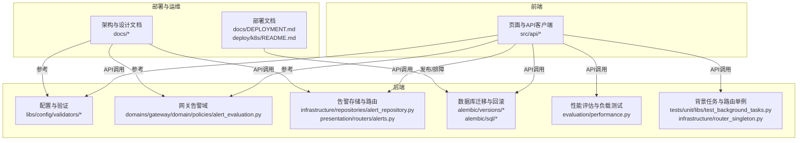
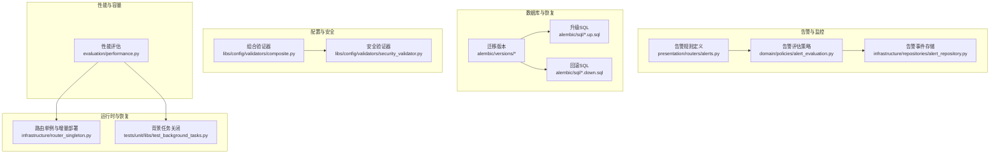
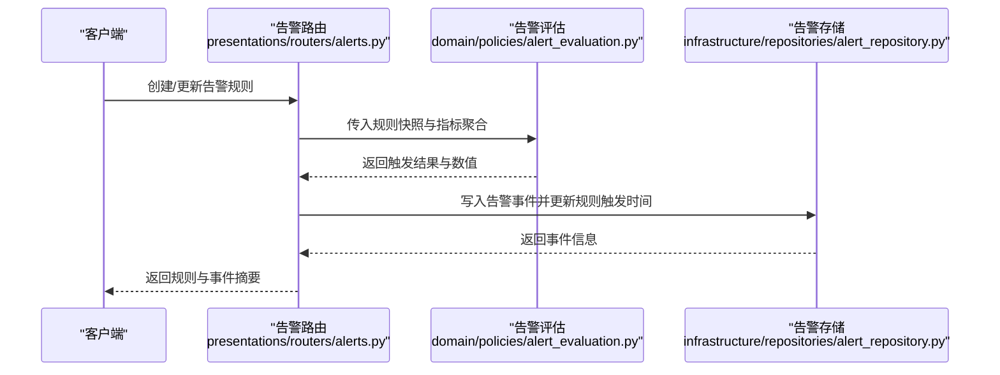
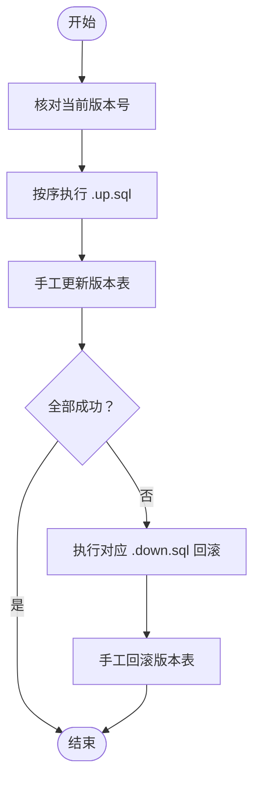
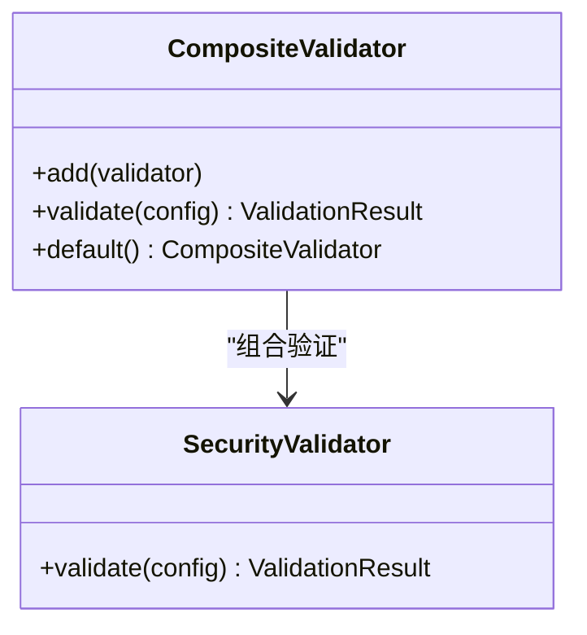
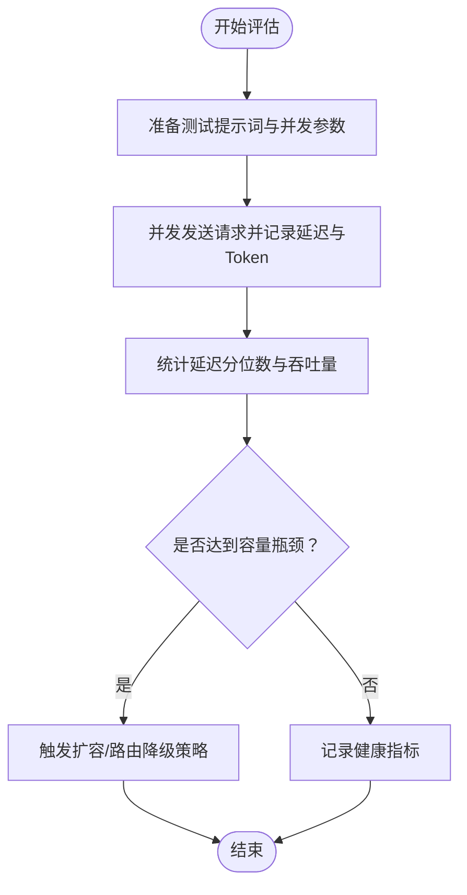
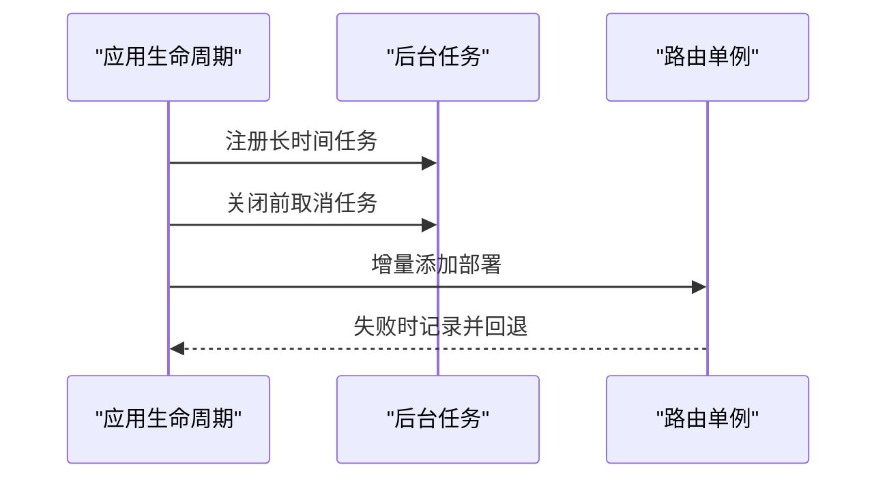
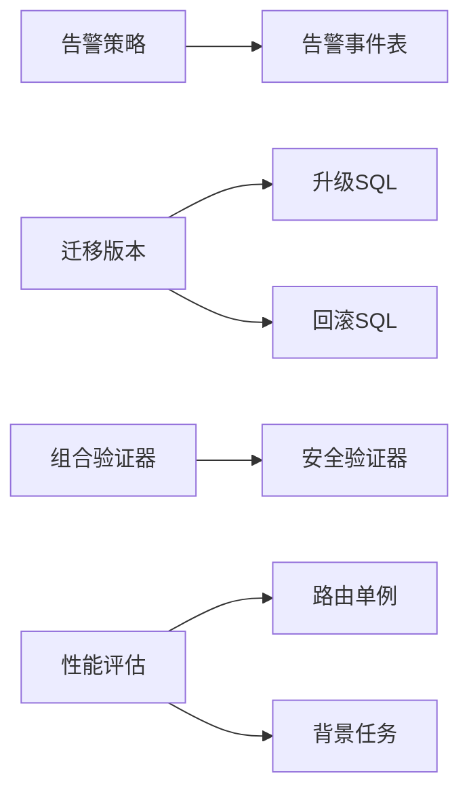

# 应急响应与恢复

<cite>
**本文引用的文件**   
- [backend/alembic/sql/README.md](file://backend/alembic/sql/README.md)
- [backend/alembic/versions/20260508_add_gateway_tables.py](file://backend/alembic/versions/20260508_add_gateway_tables.py)
- [backend/alembic/versions/20260521_tenant_data_scope.py](file://backend/alembic/versions/20260521_tenant_data_scope.py)
- [backend/scripts/generate_alembic_sql_files.py](file://backend/scripts/generate_alembic_sql_files.py)
- [backend/docs/archive/MIGRATION_PLAN_ZERO_REGRESSION.md](file://backend/docs/archive/MIGRATION_PLAN_ZERO_REGRESSION.md)
- [backend/docs/沙箱资源管理设计文档.md](file://backend/docs/沙箱资源管理设计文档.md)
- [backend/libs/config/validators/composite.py](file://backend/libs/config/validators/composite.py)
- [backend/libs/config/validators/security_validator.py](file://backend/libs/config/validators/security_validator.py)
- [backend/tests/unit/core/config/test_validators.py](file://backend/tests/unit/core/config/test_validators.py)
- [backend/evaluation/performance.py](file://backend/evaluation/performance.py)
- [docs/系统可测试性与TDD设计.md](file://docs/系统可测试性与TDD设计.md)
- [backend/domains/gateway/domain/policies/alert_evaluation.py](file://backend/domains/gateway/domain/policies/alert_evaluation.py)
- [backend/domains/gateway/infrastructure/repositories/alert_repository.py](file://backend/domains/gateway/infrastructure/repositories/alert_repository.py)
- [backend/domains/gateway/presentation/routers/alerts.py](file://backend/domains/gateway/presentation/routers/alerts.py)
- [backend/tests/unit/gateway/domain/test_alert_evaluation.py](file://backend/tests/unit/gateway/domain/test_alert_evaluation.py)
- [backend/domains/gateway/infrastructure/router_singleton.py](file://backend/domains/gateway/infrastructure/router_singleton.py)
- [backend/tests/unit/libs/test_background_tasks.py](file://backend/tests/unit/libs/test_background_tasks.py)
- [docs/开源项目定制开发选型分析.md](file://docs/开源项目定制开发选型分析.md)
- [docs/AI-Agent开发需求文档.md](file://docs/AI-Agent开发需求文档.md)
- [deploy/k8s/README.md](file://deploy/k8s/README.md)
- [docs/DEPLOYMENT.md](file://docs/DEPLOYMENT.md)
- [AGENTS.md](file://AGENTS.md)
</cite>

## 目录
1. [引言](#引言)
2. [项目结构](#项目结构)
3. [核心组件](#核心组件)
4. [架构总览](#架构总览)
5. [详细组件分析](#详细组件分析)
6. [依赖分析](#依赖分析)
7. [性能考量](#性能考量)
8. [故障排查指南](#故障排查指南)
9. [结论](#结论)
10. [附录](#附录)

## 引言
本文件面向AI Agent项目，提供一套完整的应急响应与恢复方案，覆盖服务中断、数据丢失、安全事件、性能退化与容量不足、用户数据保护与隐私泄露、监控与告警配置以及应急联系与沟通流程。方案以现有代码库中的告警体系、数据库迁移与回滚机制、配置验证器、性能评估与负载测试能力为基础，结合部署与运维文档，形成可操作的应急处置流程与恢复策略。

## 项目结构
项目采用前后端分离与领域驱动设计（DDD）相结合的组织方式，后端以“domains”划分领域边界，基础设施层负责持久化与外部集成；前端提供可视化与交互界面；部署与运维文档指导生产环境的发布与排障。

图示来源
- [backend/libs/config/validators/composite.py:17-56](file://backend/libs/config/validators/composite.py#L17-L56)
- [backend/domains/gateway/domain/policies/alert_evaluation.py:1-44](file://backend/domains/gateway/domain/policies/alert_evaluation.py#L1-L44)
- [backend/domains/gateway/infrastructure/repositories/alert_repository.py:233-256](file://backend/domains/gateway/infrastructure/repositories/alert_repository.py#L233-L256)
- [backend/domains/gateway/presentation/routers/alerts.py:49-90](file://backend/domains/gateway/presentation/routers/alerts.py#L49-L90)
- [backend/alembic/versions/20260508_add_gateway_tables.py:602-632](file://backend/alembic/versions/20260508_add_gateway_tables.py#L602-L632)
- [backend/evaluation/performance.py:93-195](file://backend/evaluation/performance.py#L93-L195)
- [backend/tests/unit/libs/test_background_tasks.py:49-71](file://backend/tests/unit/libs/test_background_tasks.py#L49-L71)
- [backend/domains/gateway/infrastructure/router_singleton.py:347-661](file://backend/domains/gateway/infrastructure/router_singleton.py#L347-L661)
- [docs/DEPLOYMENT.md](file://docs/DEPLOYMENT.md)
- [deploy/k8s/README.md](file://deploy/k8s/README.md)

章节来源
- [docs/DEPLOYMENT.md](file://docs/DEPLOYMENT.md)
- [deploy/k8s/README.md](file://deploy/k8s/README.md)
- [AGENTS.md:98-101](file://AGENTS.md#L98-L101)

## 核心组件
- 告警与监控：基于网关域的告警规则与评估策略，支持错误率、请求率等指标的阈值触发，并记录事件与通知状态。
- 数据库迁移与回滚：提供升级/回滚SQL文件与版本维护流程，支持生产环境的手工回滚与版本校验。
- 配置验证器：组合安全与沙箱配置验证，识别生产环境的安全风险与配置冲突。
- 性能评估与负载测试：提供延迟、吞吐量、Token速率等指标的评估与负载测试运行器。
- 路由与背景任务：支持增量路由部署与背景任务的有序关闭，保障服务优雅停机与资源回收。
- 部署与运维：提供Kubernetes部署与排障文档，支撑应急场景下的快速恢复与切换。

章节来源
- [backend/domains/gateway/domain/policies/alert_evaluation.py:1-44](file://backend/domains/gateway/domain/policies/alert_evaluation.py#L1-L44)
- [backend/domains/gateway/infrastructure/repositories/alert_repository.py:233-256](file://backend/domains/gateway/infrastructure/repositories/alert_repository.py#L233-L256)
- [backend/alembic/sql/README.md:1-41](file://backend/alembic/sql/README.md#L1-L41)
- [backend/libs/config/validators/composite.py:17-56](file://backend/libs/config/validators/composite.py#L17-L56)
- [backend/evaluation/performance.py:93-195](file://backend/evaluation/performance.py#L93-L195)
- [backend/tests/unit/libs/test_background_tasks.py:49-71](file://backend/tests/unit/libs/test_background_tasks.py#L49-L71)
- [docs/DEPLOYMENT.md](file://docs/DEPLOYMENT.md)

## 架构总览
下图展示应急响应相关的关键组件及其交互关系，包括告警规则定义、评估与事件记录，数据库迁移与回滚，配置验证，性能评估与负载测试，以及路由与背景任务的恢复能力。

图示来源
- [backend/domains/gateway/presentation/routers/alerts.py:49-90](file://backend/domains/gateway/presentation/routers/alerts.py#L49-L90)
- [backend/domains/gateway/domain/policies/alert_evaluation.py:1-44](file://backend/domains/gateway/domain/policies/alert_evaluation.py#L1-L44)
- [backend/domains/gateway/infrastructure/repositories/alert_repository.py:233-256](file://backend/domains/gateway/infrastructure/repositories/alert_repository.py#L233-L256)
- [backend/alembic/versions/20260508_add_gateway_tables.py:602-632](file://backend/alembic/versions/20260508_add_gateway_tables.py#L602-L632)
- [backend/alembic/sql/README.md:1-41](file://backend/alembic/sql/README.md#L1-L41)
- [backend/libs/config/validators/composite.py:17-56](file://backend/libs/config/validators/composite.py#L17-L56)
- [backend/libs/config/validators/security_validator.py:1-47](file://backend/libs/config/validators/security_validator.py#L1-L47)
- [backend/evaluation/performance.py:93-195](file://backend/evaluation/performance.py#L93-L195)
- [backend/domains/gateway/infrastructure/router_singleton.py:347-661](file://backend/domains/gateway/infrastructure/router_singleton.py#L347-L661)
- [backend/tests/unit/libs/test_background_tasks.py:49-71](file://backend/tests/unit/libs/test_background_tasks.py#L49-L71)

## 详细组件分析

### 告警与监控（服务中断与性能退化）
- 规则定义：通过路由接口创建/更新告警规则，支持指标类型、阈值、窗口与通知通道。
- 评估策略：纯函数评估指标（如错误率、请求率），考虑冷却时间避免频繁告警。
- 事件记录：触发后写入告警事件表，标记通知与确认状态，便于审计与恢复验证。

图示来源
- [backend/domains/gateway/presentation/routers/alerts.py:49-90](file://backend/domains/gateway/presentation/routers/alerts.py#L49-L90)
- [backend/domains/gateway/domain/policies/alert_evaluation.py:1-44](file://backend/domains/gateway/domain/policies/alert_evaluation.py#L1-L44)
- [backend/domains/gateway/infrastructure/repositories/alert_repository.py:233-256](file://backend/domains/gateway/infrastructure/repositories/alert_repository.py#L233-L256)

章节来源
- [backend/domains/gateway/presentation/routers/alerts.py:49-90](file://backend/domains/gateway/presentation/routers/alerts.py#L49-L90)
- [backend/domains/gateway/domain/policies/alert_evaluation.py:1-44](file://backend/domains/gateway/domain/policies/alert_evaluation.py#L1-L44)
- [backend/domains/gateway/infrastructure/repositories/alert_repository.py:233-256](file://backend/domains/gateway/infrastructure/repositories/alert_repository.py#L233-L256)
- [backend/tests/unit/gateway/domain/test_alert_evaluation.py:1-67](file://backend/tests/unit/gateway/domain/test_alert_evaluation.py#L1-L67)

### 数据库迁移与回滚（数据丢失与灾难恢复）
- 升级与回滚：生产环境按迁移链顺序执行对应的.up.sql/.down.sql，确保版本号与迁移链一致。
- 版本维护：每步成功后手工更新版本表，含“不可回滚”注释的脚本仅作记录，不直接执行。
- 迁移验证：通过生成SQL文件与版本对比，确保回滚脚本可执行且与升级脚本一一对应。

图示来源
- [backend/alembic/sql/README.md:1-41](file://backend/alembic/sql/README.md#L1-L41)
- [backend/scripts/generate_alembic_sql_files.py:234-269](file://backend/scripts/generate_alembic_sql_files.py#L234-L269)
- [backend/alembic/versions/20260508_add_gateway_tables.py:602-632](file://backend/alembic/versions/20260508_add_gateway_tables.py#L602-L632)
- [backend/alembic/versions/20260521_tenant_data_scope.py:127-160](file://backend/alembic/versions/20260521_tenant_data_scope.py#L127-L160)

章节来源
- [backend/alembic/sql/README.md:1-41](file://backend/alembic/sql/README.md#L1-L41)
- [backend/scripts/generate_alembic_sql_files.py:234-269](file://backend/scripts/generate_alembic_sql_files.py#L234-L269)
- [backend/alembic/versions/20260508_add_gateway_tables.py:602-632](file://backend/alembic/versions/20260508_add_gateway_tables.py#L602-L632)
- [backend/alembic/versions/20260521_tenant_data_scope.py:127-160](file://backend/alembic/versions/20260521_tenant_data_scope.py#L127-L160)

### 配置验证与安全加固（安全事件）
- 组合验证器：聚合多个验证器，统一收集错误与警告，便于一次性发现安全与配置问题。
- 安全验证器：重点检查只读根文件系统、禁止提权、能力集丢弃等生产安全基线。
- 测试覆盖：单元测试验证安全配置的警告与冲突工具配置。

图示来源
- [backend/libs/config/validators/composite.py:17-56](file://backend/libs/config/validators/composite.py#L17-L56)
- [backend/libs/config/validators/security_validator.py:1-47](file://backend/libs/config/validators/security_validator.py#L1-L47)
- [backend/tests/unit/core/config/test_validators.py:106-151](file://backend/tests/unit/core/config/test_validators.py#L106-L151)

章节来源
- [backend/libs/config/validators/composite.py:17-56](file://backend/libs/config/validators/composite.py#L17-L56)
- [backend/libs/config/validators/security_validator.py:1-47](file://backend/libs/config/validators/security_validator.py#L1-L47)
- [backend/tests/unit/core/config/test_validators.py:106-151](file://backend/tests/unit/core/config/test_validators.py#L106-L151)

### 性能评估与容量应急（性能退化与容量不足）
- 指标采集：延迟分位数、吞吐量、Token速率、内存与CPU使用等。
- 负载测试：支持固定时长与目标RPS的并发请求，统计成功率、实际RPS与平均延迟。
- 应急扩容：结合评估结果与路由单例的增量部署能力，动态扩展模型部署或分流至备用模型。

图示来源
- [backend/evaluation/performance.py:93-195](file://backend/evaluation/performance.py#L93-L195)
- [docs/系统可测试性与TDD设计.md:2691-2848](file://docs/系统可测试性与TDD设计.md#L2691-L2848)
- [backend/domains/gateway/infrastructure/router_singleton.py:347-661](file://backend/domains/gateway/infrastructure/router_singleton.py#L347-L661)

章节来源
- [backend/evaluation/performance.py:93-195](file://backend/evaluation/performance.py#L93-L195)
- [docs/系统可测试性与TDD设计.md:2691-2848](file://docs/系统可测试性与TDD设计.md#L2691-L2848)
- [backend/domains/gateway/infrastructure/router_singleton.py:347-661](file://backend/domains/gateway/infrastructure/router_singleton.py#L347-L661)

### 背景任务与路由恢复（服务中断与优雅停机）
- 背景任务：在应用关闭前注册并取消长时间运行的任务，确保资源回收与状态一致。
- 路由单例：支持增量部署模型，失败时可回退至稳定状态，降低影响面。

图示来源
- [backend/tests/unit/libs/test_background_tasks.py:49-71](file://backend/tests/unit/libs/test_background_tasks.py#L49-L71)
- [backend/domains/gateway/infrastructure/router_singleton.py:347-661](file://backend/domains/gateway/infrastructure/router_singleton.py#L347-L661)

章节来源
- [backend/tests/unit/libs/test_background_tasks.py:49-71](file://backend/tests/unit/libs/test_background_tasks.py#L49-L71)
- [backend/domains/gateway/infrastructure/router_singleton.py:347-661](file://backend/domains/gateway/infrastructure/router_singleton.py#L347-L661)

### 用户数据保护与隐私泄露（合规与通知）
- 文档指引：项目文档中包含系统可测试性与TDD设计、开发需求文档等，建议在应急流程中补充数据脱敏、通知与法律合规处理步骤。
- 建议流程：识别受影响数据范围、执行脱敏与删除、触发通知与合规报告、记录处置过程与证据链。

章节来源
- [docs/系统可测试性与TDD设计.md:2850-3175](file://docs/系统可测试性与TDD设计.md#L2850-L3175)
- [docs/AI-Agent开发需求文档.md](file://docs/AI-Agent开发需求文档.md)

## 依赖分析
- 组件耦合：告警域与存储层松耦合，通过纯函数策略与事件表解耦；迁移脚本与版本管理独立于应用运行时。
- 外部依赖：Kubernetes部署与运维文档为生产恢复提供基础；配置验证器依赖执行配置对象。
- 循环依赖：未发现明显循环依赖；验证器组合模式降低模块间紧耦合。

图示来源
- [backend/domains/gateway/domain/policies/alert_evaluation.py:1-44](file://backend/domains/gateway/domain/policies/alert_evaluation.py#L1-L44)
- [backend/domains/gateway/infrastructure/repositories/alert_repository.py:233-256](file://backend/domains/gateway/infrastructure/repositories/alert_repository.py#L233-L256)
- [backend/alembic/versions/20260508_add_gateway_tables.py:602-632](file://backend/alembic/versions/20260508_add_gateway_tables.py#L602-L632)
- [backend/libs/config/validators/composite.py:17-56](file://backend/libs/config/validators/composite.py#L17-L56)
- [backend/libs/config/validators/security_validator.py:1-47](file://backend/libs/config/validators/security_validator.py#L1-L47)
- [backend/evaluation/performance.py:93-195](file://backend/evaluation/performance.py#L93-L195)
- [backend/domains/gateway/infrastructure/router_singleton.py:347-661](file://backend/domains/gateway/infrastructure/router_singleton.py#L347-L661)
- [backend/tests/unit/libs/test_background_tasks.py:49-71](file://backend/tests/unit/libs/test_background_tasks.py#L49-L71)

章节来源
- [backend/domains/gateway/domain/policies/alert_evaluation.py:1-44](file://backend/domains/gateway/domain/policies/alert_evaluation.py#L1-L44)
- [backend/alembic/versions/20260508_add_gateway_tables.py:602-632](file://backend/alembic/versions/20260508_add_gateway_tables.py#L602-L632)
- [backend/libs/config/validators/composite.py:17-56](file://backend/libs/config/validators/composite.py#L17-L56)
- [backend/evaluation/performance.py:93-195](file://backend/evaluation/performance.py#L93-L195)

## 性能考量
- 评估指标：延迟分位数、吞吐量、Token速率、内存与CPU使用，用于识别容量瓶颈与退化趋势。
- 负载测试：支持目标RPS与持续时长的负载测试，输出成功率、实际RPS与平均延迟，辅助扩容决策。
- 路由与模型：通过路由单例的增量部署能力，动态扩展或降级模型，保障SLA。

章节来源
- [backend/evaluation/performance.py:93-195](file://backend/evaluation/performance.py#L93-L195)
- [docs/系统可测试性与TDD设计.md:2691-2848](file://docs/系统可测试性与TDD设计.md#L2691-L2848)
- [backend/domains/gateway/infrastructure/router_singleton.py:347-661](file://backend/domains/gateway/infrastructure/router_singleton.py#L347-L661)

## 故障排查指南
- 告警与事件：检查告警规则与事件表，确认阈值、窗口与通知状态，定位服务中断与性能退化原因。
- 数据库：核对当前版本号与迁移链，按序执行.up.sql并手工更新版本表；对“不可回滚”脚本仅作记录。
- 配置：使用组合验证器扫描执行配置，修复安全基线与工具配置冲突。
- 性能：运行性能评估与负载测试，识别瓶颈并制定扩容/降级策略。
- 路由与任务：验证路由单例的增量部署是否成功，确认背景任务在关闭前被取消。

章节来源
- [backend/domains/gateway/presentation/routers/alerts.py:49-90](file://backend/domains/gateway/presentation/routers/alerts.py#L49-L90)
- [backend/domains/gateway/infrastructure/repositories/alert_repository.py:233-256](file://backend/domains/gateway/infrastructure/repositories/alert_repository.py#L233-L256)
- [backend/alembic/sql/README.md:1-41](file://backend/alembic/sql/README.md#L1-L41)
- [backend/libs/config/validators/composite.py:17-56](file://backend/libs/config/validators/composite.py#L17-L56)
- [backend/evaluation/performance.py:93-195](file://backend/evaluation/performance.py#L93-L195)
- [backend/domains/gateway/infrastructure/router_singleton.py:347-661](file://backend/domains/gateway/infrastructure/router_singleton.py#L347-L661)
- [backend/tests/unit/libs/test_background_tasks.py:49-71](file://backend/tests/unit/libs/test_background_tasks.py#L49-L71)

## 结论
本应急响应与恢复方案以现有告警、迁移回滚、配置验证、性能评估与路由/任务恢复能力为核心，结合部署与运维文档，形成覆盖服务中断、数据丢失、安全事件、性能退化与容量不足、用户数据保护与隐私泄露、监控告警与沟通流程的完整闭环。建议在实际运营中固化流程、定期演练与更新预案，确保快速恢复与业务连续性。

## 附录
- 部署与排障：参考部署文档与Kubernetes说明，确保发布与回滚路径清晰。
- 技术风险与应对：参考技术风险矩阵，提前准备LangGraph升级、性能达标与团队学习等应对策略。

章节来源
- [docs/DEPLOYMENT.md](file://docs/DEPLOYMENT.md)
- [deploy/k8s/README.md](file://deploy/k8s/README.md)
- [docs/开源项目定制开发选型分析.md:659-681](file://docs/开源项目定制开发选型分析.md#L659-L681)
- [AGENTS.md:98-101](file://AGENTS.md#L98-L101)