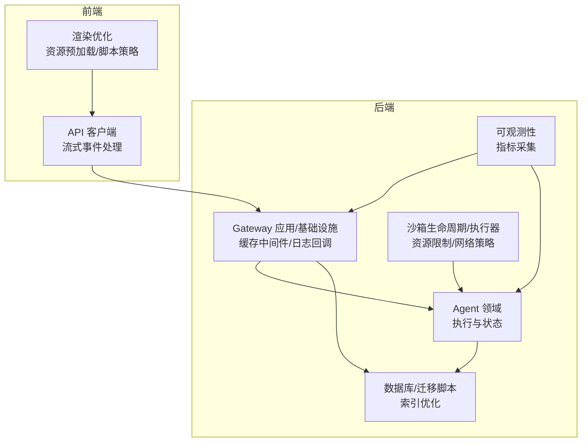
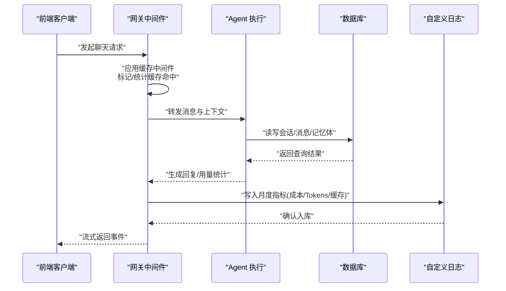
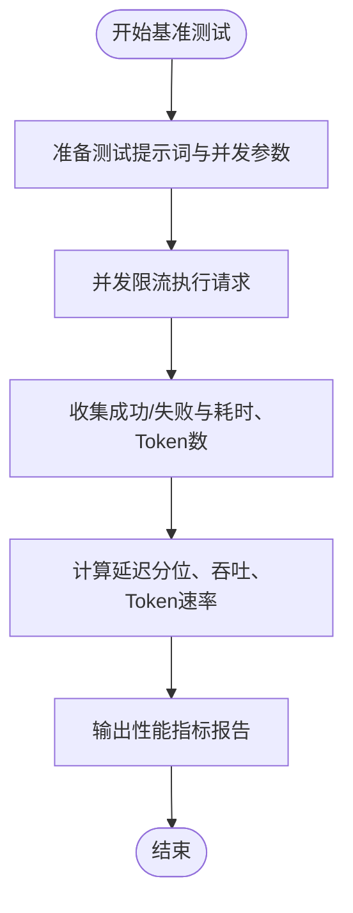
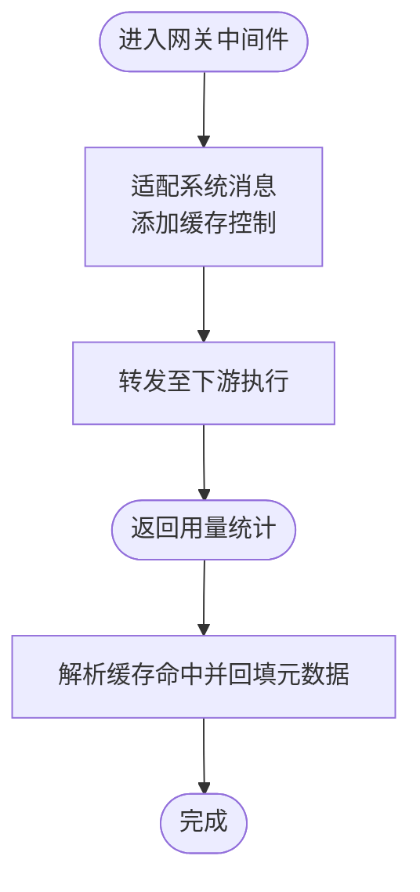
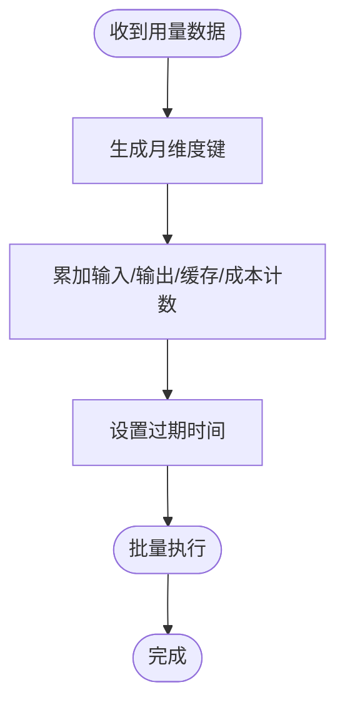
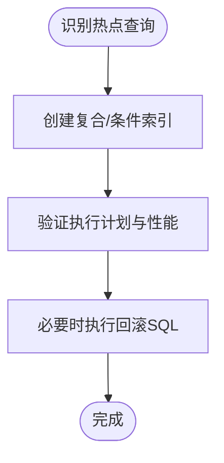
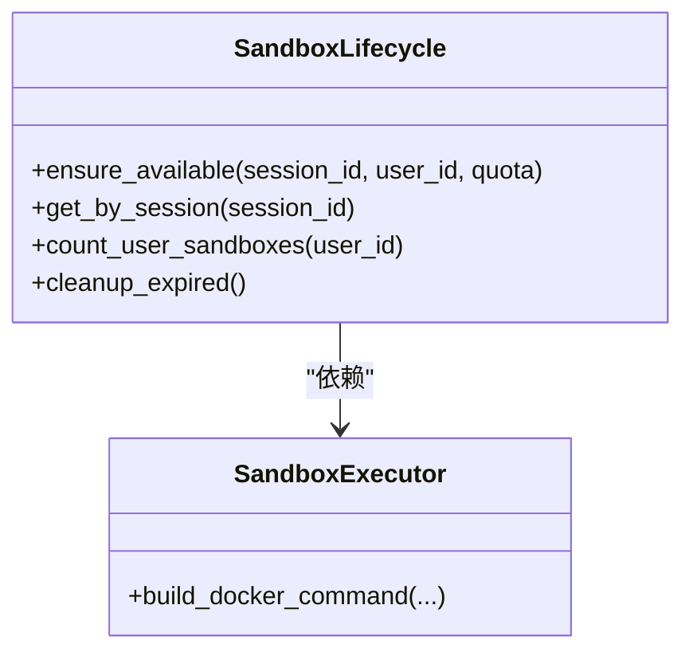
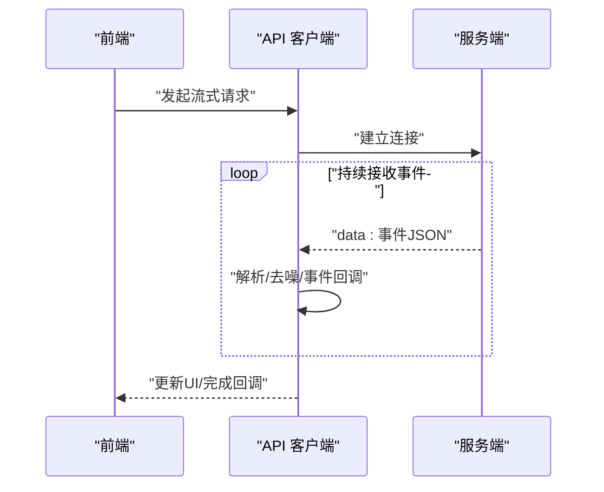
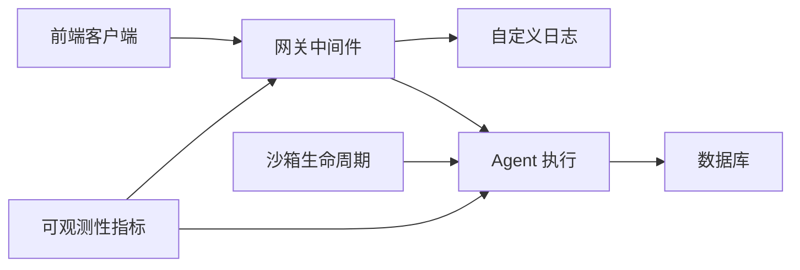

# 性能问题排查

<cite>
**本文引用的文件**
- [evaluation/performance.py](file://backend/evaluation/performance.py)
- [domains/gateway/application/prompt_cache_middleware.py](file://backend/domains/gateway/application/prompt_cache_middleware.py)
- [domains/gateway/infrastructure/callbacks/custom_logger.py](file://backend/domains/gateway/infrastructure/callbacks/custom_logger.py)
- [alembic/versions/002_add_performance_indexes.py](file://backend/alembic/versions/002_add_performance_indexes.py)
- [alembic/versions/20260527_slow_sql_hotpath_indexes.py](file://backend/alembic/versions/20260527_slow_sql_hotpath_indexes.py)
- [alembic/sql/20260527_slow_sql_hotpath_indexes.down.sql](file://backend/alembic/sql/20260527_slow_sql_hotpath_indexes.down.sql)
- [docs/沙箱资源管理设计文档.md](file://backend/docs/沙箱资源管理设计文档.md)
- [tests/unit/test_sandbox_executor.py](file://backend/tests/unit/test_sandbox_executor.py)
- [tests/unit/core/config/test_validators.py](file://backend/tests/unit/core/config/test_validators.py)
- [domains/agent/domain/services/sandbox_lifecycle.py](file://backend/domains/agent/domain/services/sandbox_lifecycle.py)
- [libs/observability/metrics.py](file://backend/libs/observability/metrics.py)
- [src/api/client.ts](file://frontend/src/api/client.ts)
- [.agents/skills/vercel-react-best-practices/rules1/js-request-idle-callback.md](file://.agents/skills/vercel-react-best-practices/rules1/js-request-idle-callback.md)
- [docs/AI_GATEWAY_DOMAIN_ARCHITECTURE.md](file://backend/docs/AI_GATEWAY_DOMAIN_ARCHITECTURE.md)
- [docs/CHAT_MESSAGE_FLOW.md](file://backend/docs/CHAT_MESSAGE_FLOW.md)
- [docs/LANGGRAPH_ARCHITECTURE_RATIONALE.md](file://backend/docs/LANGGRAPH_ARCHITECTURE_RATIONALE.md)
- [docs/GATEWAY_PRICING_AND_LITELLM_COST.md](file://backend/docs/GATEWAY_PRICING_AND_LITELLM_COST.md)
- [config/litellm_models.yaml](file://backend/config/litellm_models.yaml)
- [config/execution.toml](file://backend/config/execution.toml)
</cite>

## 目录
1. [简介](#简介)
2. [项目结构](#项目结构)
3. [核心组件](#核心组件)
4. [架构总览](#架构总览)
5. [详细组件分析](#详细组件分析)
6. [依赖关系分析](#依赖关系分析)
7. [性能考量](#性能考量)
8. [故障排查指南](#故障排查指南)
9. [结论](#结论)
10. [附录](#附录)

## 简介
本文件面向AI Agent项目的性能问题排查与优化，覆盖后端代理执行、网关服务、数据库查询、前端应用以及沙箱执行环境等关键环节。内容基于仓库中现有的性能相关实现与文档，提供可操作的识别方法、诊断流程与优化建议，并结合实际代码位置进行溯源。

## 项目结构
- 后端采用多域划分（Agent、Gateway、Identity等），性能相关能力主要集中在网关中间件、数据库索引迁移脚本、沙箱生命周期与执行器、前端API客户端与渲染优化规则等模块。
- 前端通过流式事件处理与资源预加载API减少阻塞与首屏延迟。
- 沙箱资源管理通过配置文件与单元测试明确容器资源限制与网络策略。

图表来源
- [domains/gateway/application/prompt_cache_middleware.py](file://backend/domains/gateway/application/prompt_cache_middleware.py)
- [domains/gateway/infrastructure/callbacks/custom_logger.py](file://backend/domains/gateway/infrastructure/callbacks/custom_logger.py)
- [domains/agent/domain/services/sandbox_lifecycle.py](file://backend/domains/agent/domain/services/sandbox_lifecycle.py)
- [libs/observability/metrics.py](file://backend/libs/observability/metrics.py)
- [src/api/client.ts](file://frontend/src/api/client.ts)

章节来源
- [docs/CHAT_MESSAGE_FLOW.md](file://backend/docs/CHAT_MESSAGE_FLOW.md)
- [docs/LANGGRAPH_ARCHITECTURE_RATIONALE.md](file://backend/docs/LANGGRAPH_ARCHITECTURE_RATIONALE.md)
- [docs/AI_GATEWAY_DOMAIN_ARCHITECTURE.md](file://backend/docs/AI_GATEWAY_DOMAIN_ARCHITECTURE.md)

## 核心组件
- 性能基准与负载测试：提供延迟、吞吐量、Token速率等指标计算与并发/定时触发的压测框架。
- 网关缓存中间件：对系统消息进行缓存控制标记，统计命中并回填元数据。
- 网关自定义日志：按月维度聚合计费、Token用量、缓存用量等指标，便于成本与性能分析。
- 数据库索引优化：针对会话、消息、记忆体等热点表建立复合索引与条件索引，降低慢查询风险。
- 沙箱生命周期与执行器：定义沙箱状态、配额与回收策略；通过配置项限制内存/CPU/磁盘与网络访问。
- 前端API客户端：支持服务端事件流式传输，提升交互响应与渲染体验。
- 渲染优化规则：资源预加载、脚本defer/async策略，降低主线程阻塞。

章节来源
- [evaluation/performance.py](file://backend/evaluation/performance.py)
- [domains/gateway/application/prompt_cache_middleware.py](file://backend/domains/gateway/application/prompt_cache_middleware.py)
- [domains/gateway/infrastructure/callbacks/custom_logger.py](file://backend/domains/gateway/infrastructure/callbacks/custom_logger.py)
- [alembic/versions/002_add_performance_indexes.py](file://backend/alembic/versions/002_add_performance_indexes.py)
- [alembic/versions/20260527_slow_sql_hotpath_indexes.py](file://backend/alembic/versions/20260527_slow_sql_hotpath_indexes.py)
- [docs/沙箱资源管理设计文档.md](file://backend/docs/沙箱资源管理设计文档.md)
- [tests/unit/test_sandbox_executor.py](file://backend/tests/unit/test_sandbox_executor.py)
- [src/api/client.ts](file://frontend/src/api/client.ts)
- [.agents/skills/vercel-react-best-practices/rules1/js-request-idle-callback.md](file://.agents/skills/vercel-react-best-practices/rules1/js-request-idle-callback.md)

## 架构总览
下图展示从前端到后端的关键路径，包括网关缓存、日志聚合与数据库访问，帮助定位端到端性能瓶颈。

图表来源
- [domains/gateway/application/prompt_cache_middleware.py](file://backend/domains/gateway/application/prompt_cache_middleware.py)
- [domains/gateway/infrastructure/callbacks/custom_logger.py](file://backend/domains/gateway/infrastructure/callbacks/custom_logger.py)
- [src/api/client.ts](file://frontend/src/api/client.ts)

## 详细组件分析

### 组件A：性能基准与负载测试
- 功能要点
  - 支持并发限流的基准测试，统计P50/P90/P99延迟、平均/峰值吞吐、Token速率与平均每次请求Token数。
  - 提供定时触发的负载测试，按目标RPS持续注入请求并汇总结果。
- 适用场景
  - 代理执行链路压测、工具调用耗时回归、消息传递延迟评估。
- 优化建议
  - 结合可观测性指标采集，补充CPU/内存采样；在高并发下观察队列积压与线程池饱和情况。

图表来源
- [evaluation/performance.py](file://backend/evaluation/performance.py)

章节来源
- [evaluation/performance.py](file://backend/evaluation/performance.py)

### 组件B：网关缓存中间件与命中统计
- 功能要点
  - 对系统消息进行缓存控制标记，支持临时缓存策略。
  - 解析用量中的缓存命中信息并回填到元数据，便于后续日志统计。
- 诊断价值
  - 通过日志聚合中的缓存命中比例评估提示复用效果，识别未命中热点与重复构造系统消息的问题。
- 优化建议
  - 控制系统消息长度阈值与缓存点数上限，避免过度缓存导致上下文膨胀。

图表来源
- [domains/gateway/application/prompt_cache_middleware.py](file://backend/domains/gateway/application/prompt_cache_middleware.py)

章节来源
- [domains/gateway/application/prompt_cache_middleware.py](file://backend/domains/gateway/application/prompt_cache_middleware.py)

### 组件C：网关自定义日志与指标聚合
- 功能要点
  - 按月键聚合输入/输出Token、缓存Token、缓存创建Token与成本，设置过期时间。
- 诊断价值
  - 通过成本与Token趋势识别模型切换、用量异常与缓存收益变化。
- 优化建议
  - 结合缓存命中统计与慢查询日志，定位高成本低效调用。

图表来源
- [domains/gateway/infrastructure/callbacks/custom_logger.py](file://backend/domains/gateway/infrastructure/callbacks/custom_logger.py)

章节来源
- [domains/gateway/infrastructure/callbacks/custom_logger.py](file://backend/domains/gateway/infrastructure/callbacks/custom_logger.py)

### 组件D：数据库索引优化与慢查询治理
- 功能要点
  - 为会话、消息、记忆体等热点表建立复合索引与条件索引，优化排序与过滤性能。
  - 提供回滚SQL以手工维护版本号，保障生产变更可控。
- 诊断价值
  - 通过索引覆盖查询减少全表扫描，降低I/O等待与锁竞争。
- 优化建议
  - 结合执行计划与慢查询日志，持续识别新增热点字段并补充索引。

图表来源
- [alembic/versions/002_add_performance_indexes.py](file://backend/alembic/versions/002_add_performance_indexes.py)
- [alembic/versions/20260527_slow_sql_hotpath_indexes.py](file://backend/alembic/versions/20260527_slow_sql_hotpath_indexes.py)
- [alembic/sql/20260527_slow_sql_hotpath_indexes.down.sql](file://backend/alembic/sql/20260527_slow_sql_hotpath_indexes.down.sql)

章节来源
- [alembic/versions/002_add_performance_indexes.py](file://backend/alembic/versions/002_add_performance_indexes.py)
- [alembic/versions/20260527_slow_sql_hotpath_indexes.py](file://backend/alembic/versions/20260527_slow_sql_hotpath_indexes.py)
- [alembic/sql/20260527_slow_sql_hotpath_indexes.down.sql](file://backend/alembic/sql/20260527_slow_sql_hotpath_indexes.down.sql)

### 组件E：沙箱生命周期与执行器
- 功能要点
  - 定义沙箱状态、配额与回收策略；通过配置限制内存/CPU/磁盘与网络访问。
  - 单元测试覆盖Docker命令构建与网络开关行为。
- 诊断价值
  - 通过资源限制与会话策略定位容器启动慢、内存溢出与网络超时等问题。
- 优化建议
  - 合理设置空闲超时与最大会话数，避免资源碎片化；按需开启网络白名单。

图表来源
- [domains/agent/domain/services/sandbox_lifecycle.py](file://backend/domains/agent/domain/services/sandbox_lifecycle.py)
- [tests/unit/test_sandbox_executor.py](file://backend/tests/unit/test_sandbox_executor.py)

章节来源
- [domains/agent/domain/services/sandbox_lifecycle.py](file://backend/domains/agent/domain/services/sandbox_lifecycle.py)
- [tests/unit/test_sandbox_executor.py](file://backend/tests/unit/test_sandbox_executor.py)
- [docs/沙箱资源管理设计文档.md](file://backend/docs/沙箱资源管理设计文档.md)

### 组件F：前端API客户端与渲染优化
- 功能要点
  - 支持服务端事件流式传输，按行解析事件并处理中断与错误。
  - 资源预加载与脚本defer/async策略减少渲染阻塞。
- 诊断价值
  - 通过事件到达时间与渲染帧率评估前端交互延迟与主线程占用。
- 优化建议
  - 对大文本/图片采用懒加载与分片渲染；合理拆分脚本加载时机。

图表来源
- [src/api/client.ts](file://frontend/src/api/client.ts)

章节来源
- [src/api/client.ts](file://frontend/src/api/client.ts)
- [.agents/skills/vercel-react-best-practices/rules1/js-request-idle-callback.md](file://.agents/skills/vercel-react-best-practices/rules1/js-request-idle-callback.md)

## 依赖关系分析
- 网关中间件依赖日志回调进行指标写入；Agent执行依赖数据库读写；前端依赖网关返回的流式事件。
- 沙箱生命周期服务为Agent执行提供隔离与配额保障；前端渲染优化降低主线程压力，间接提升整体响应。

图表来源
- [domains/gateway/application/prompt_cache_middleware.py](file://backend/domains/gateway/application/prompt_cache_middleware.py)
- [domains/gateway/infrastructure/callbacks/custom_logger.py](file://backend/domains/gateway/infrastructure/callbacks/custom_logger.py)
- [domains/agent/domain/services/sandbox_lifecycle.py](file://backend/domains/agent/domain/services/sandbox_lifecycle.py)
- [libs/observability/metrics.py](file://backend/libs/observability/metrics.py)
- [src/api/client.ts](file://frontend/src/api/client.ts)

## 性能考量
- CPU使用率分析
  - 在代理执行与工具调用路径上增加采样点，结合基准测试统计CPU占比与阻塞点。
  - 参考：性能评估器的并发执行与指标计算框架。
- 内存泄漏检测
  - 沙箱执行器与容器命令构建涉及进程/卷管理，应关注异常退出后的资源回收。
  - 参考：Docker执行器命令构建与网络开关测试。
- I/O等待时间监控
  - 数据库查询通过索引优化降低I/O；网关日志聚合采用批量写入与过期策略，避免热点键争用。
  - 参考：慢查询热路径索引与日志聚合逻辑。
- 代理执行性能
  - LangGraph状态管理开销可通过事件流式返回与缓存命中统计辅助定位；消息传递延迟与工具调用耗时可结合前端事件到达时间与后端用量统计分析。
  - 参考：聊天消息流与LangGraph架构文档。
- 网关服务优化
  - LiteLLM调用优化：结合模型定价与成本文档，选择合适路由与缓存策略。
  - 缓存策略：系统消息缓存控制与命中统计。
  - 并发连接管理：结合负载测试与日志聚合，评估并发上限与队列深度。
  - 参考：网关定价与成本文档、缓存中间件、日志回调。
- 数据库查询优化
  - 复合索引与条件索引覆盖高频查询；慢查询日志与执行计划配合定位热点。
  - 参考：索引迁移脚本与回滚SQL。
- 前端性能优化
  - 服务端事件流式处理、资源预加载与脚本加载策略减少阻塞。
  - 参考：前端API客户端与渲染优化规则。
- 沙箱执行环境
  - 容器资源限制、磁盘IO与网络带宽管理通过配置与测试验证。
  - 参考：沙箱资源管理设计文档与执行器测试。

章节来源
- [evaluation/performance.py](file://backend/evaluation/performance.py)
- [tests/unit/test_sandbox_executor.py](file://backend/tests/unit/test_sandbox_executor.py)
- [alembic/versions/20260527_slow_sql_hotpath_indexes.py](file://backend/alembic/versions/20260527_slow_sql_hotpath_indexes.py)
- [domains/gateway/application/prompt_cache_middleware.py](file://backend/domains/gateway/application/prompt_cache_middleware.py)
- [domains/gateway/infrastructure/callbacks/custom_logger.py](file://backend/domains/gateway/infrastructure/callbacks/custom_logger.py)
- [docs/GATEWAY_PRICING_AND_LITELLM_COST.md](file://backend/docs/GATEWAY_PRICING_AND_LITELLM_COST.md)
- [docs/CHAT_MESSAGE_FLOW.md](file://backend/docs/CHAT_MESSAGE_FLOW.md)
- [docs/LANGGRAPH_ARCHITECTURE_RATIONALE.md](file://backend/docs/LANGGRAPH_ARCHITECTURE_RATIONALE.md)
- [src/api/client.ts](file://frontend/src/api/client.ts)
- [.agents/skills/vercel-react-best-practices/rules1/js-request-idle-callback.md](file://.agents/skills/vercel-react-best-practices/rules1/js-request-idle-callback.md)
- [docs/沙箱资源管理设计文档.md](file://backend/docs/沙箱资源管理设计文档.md)

## 故障排查指南
- 代理执行性能问题
  - 识别LangGraph状态管理开销：检查事件流式返回是否及时、缓存命中是否异常。
  - 消息传递延迟：从前端事件到达时间与后端用量统计交叉验证。
  - 工具调用耗时：结合基准测试与日志聚合的成本/Tokens趋势定位异常工具。
- 网关服务性能问题
  - LiteLLM调用优化：参考模型定价与成本文档，调整路由与缓存策略。
  - 缓存策略配置：检查系统消息缓存控制与命中统计。
  - 并发连接管理：通过负载测试与日志聚合评估并发上限。
- 数据库查询性能问题
  - 慢查询分析：结合索引覆盖与执行计划；必要时回滚到上一版本索引。
  - 索引优化：根据热点字段补充复合/条件索引。
  - 连接池配置：结合日志聚合与数据库监控指标评估连接池大小与超时。
- 前端应用性能问题
  - JavaScript执行时间：利用DevTools Timeline与Performance面板定位长任务。
  - DOM操作优化：减少主线程阻塞，采用requestIdleCallback与分片渲染。
  - 网络请求优化：使用资源预加载与脚本加载策略，避免阻塞渲染。
- 沙箱执行环境性能问题
  - 容器资源限制：核对内存/CPU/磁盘限制与会话策略配置。
  - 磁盘IO优化：减少频繁写盘，使用只读根文件系统与最小化文件创建。
  - 网络带宽管理：默认禁用网络，按需开放白名单主机。

章节来源
- [domains/gateway/application/prompt_cache_middleware.py](file://backend/domains/gateway/application/prompt_cache_middleware.py)
- [domains/gateway/infrastructure/callbacks/custom_logger.py](file://backend/domains/gateway/infrastructure/callbacks/custom_logger.py)
- [alembic/versions/002_add_performance_indexes.py](file://backend/alembic/versions/002_add_performance_indexes.py)
- [alembic/versions/20260527_slow_sql_hotpath_indexes.py](file://backend/alembic/versions/20260527_slow_sql_hotpath_indexes.py)
- [src/api/client.ts](file://frontend/src/api/client.ts)
- [.agents/skills/vercel-react-best-practices/rules1/js-request-idle-callback.md](file://.agents/skills/vercel-react-best-practices/rules1/js-request-idle-callback.md)
- [docs/沙箱资源管理设计文档.md](file://backend/docs/沙箱资源管理设计文档.md)

## 结论
本项目在网关缓存、数据库索引、沙箱资源与前端渲染等方面提供了可落地的性能优化抓手。建议以基准/负载测试为起点，结合日志聚合与索引优化持续迭代，同时完善可观测性指标以支撑自动化告警与回归防护。

## 附录
- 性能分析工具使用建议
  - Python：cProfile/Py-Spy采样分析；结合性能评估器输出指标。
  - 前端：Chrome DevTools Performance/Network/Rendering面板；结合资源预加载与脚本策略。
  - 系统监控：容器/主机层面的CPU/内存/I/O与网络带宽监控。
- 基准测试与压力测试实施
  - 使用性能评估器的并发基准与定时负载测试框架，结合日志聚合与数据库监控形成闭环。

章节来源
- [evaluation/performance.py](file://backend/evaluation/performance.py)
- [libs/observability/metrics.py](file://backend/libs/observability/metrics.py)
- [src/api/client.ts](file://frontend/src/api/client.ts)