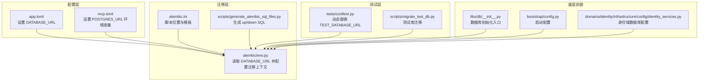
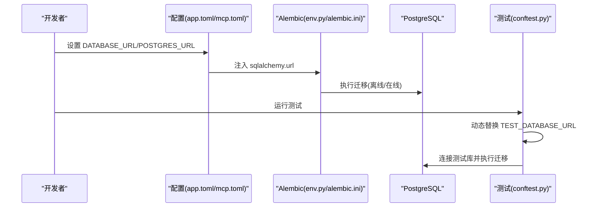
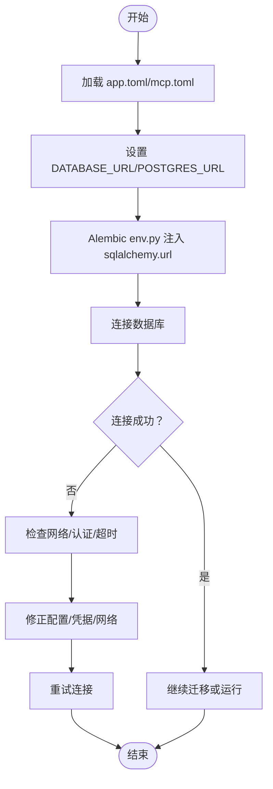
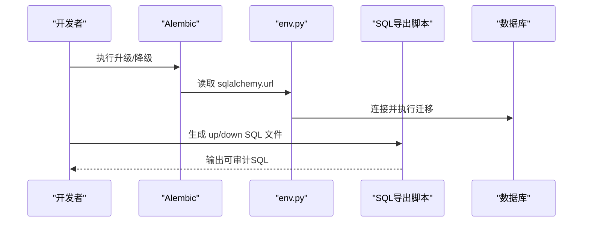
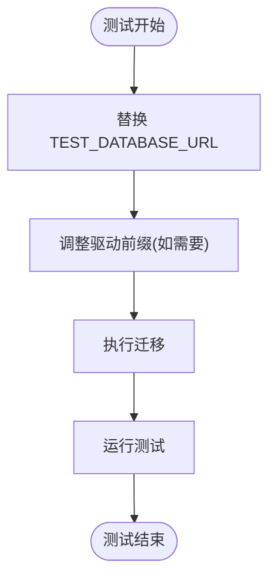
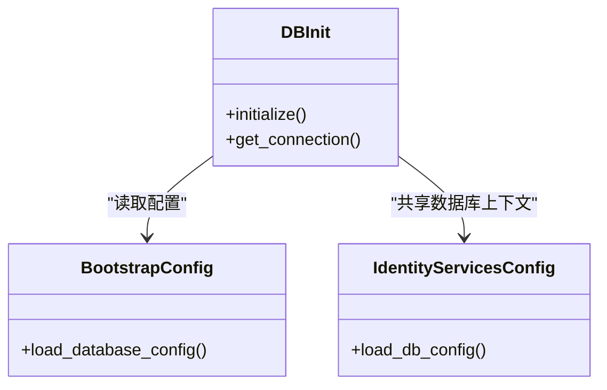
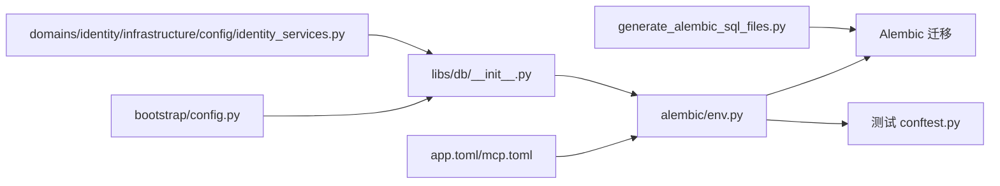

# 数据库问题

<cite>
**本文引用的文件**
- [backend/alembic.ini](file://backend/alembic.ini)
- [backend/alembic/env.py](file://backend/alembic/env.py)
- [backend/config/app.toml](file://backend/config/app.toml)
- [backend/config/mcp.toml](file://backend/config/mcp.toml)
- [backend/scripts/generate_alembic_sql_files.py](file://backend/scripts/generate_alembic_sql_files.py)
- [backend/scripts/migrate_test_db.py](file://backend/scripts/migrate_test_db.py)
- [backend/tests/conftest.py](file://backend/tests/conftest.py)
- [backend/libs/db/__init__.py](file://backend/libs/db/__init__.py)
- [backend/bootstrap/config.py](file://backend/bootstrap/config.py)
- [backend/domains/identity/infrastructure/config/identity_services.py](file://backend/domains/identity/infrastructure/config/identity_services.py)
- [backend/.agents/skills/database-schema/reference.md](file://backend/.agents/skills/database-schema/reference.md)
</cite>

## 目录
1. [简介](#简介)
2. [项目结构](#项目结构)
3. [核心组件](#核心组件)
4. [架构总览](#架构总览)
5. [详细组件分析](#详细组件分析)
6. [依赖关系分析](#依赖关系分析)
7. [性能考量](#性能考量)
8. [故障排查指南](#故障排查指南)
9. [结论](#结论)
10. [附录](#附录)

## 简介
本文件面向AI Agent项目的数据库运维与开发团队，聚焦以下目标：
- 数据库连接问题的诊断与修复：连接字符串格式、网络可达性、认证失败、超时等
- 数据库迁移问题：Alembic迁移失败、版本不匹配、回滚策略
- 数据库性能问题：慢查询、锁等待、索引优化
- 数据编码与字符集：UTF-8、字符集转换、数据清洗
- 备份与恢复：策略、恢复测试、一致性校验
- 监控与告警：连接数、查询性能、存储空间
- PostgreSQL特有问题：WAL、表空间、复制
- 安全防护：访问控制、审计日志、数据加密

## 项目结构
后端采用Python/PostgreSQL技术栈，数据库相关的关键位置如下：
- 配置层：通过环境变量与配置文件注入数据库URL，支持多环境
- 迁移层：Alembic脚本与版本化迁移，配套SQL导出工具
- 测试层：测试数据库URL动态替换，确保隔离与可重复执行
- 底层封装：数据库初始化与连接池配置入口

**图表来源**
- [backend/config/app.toml](file://backend/config/app.toml)
- [backend/config/mcp.toml](file://backend/config/mcp.toml)
- [backend/alembic.ini](file://backend/alembic.ini)
- [backend/alembic/env.py](file://backend/alembic/env.py)
- [backend/scripts/generate_alembic_sql_files.py](file://backend/scripts/generate_alembic_sql_files.py)
- [backend/tests/conftest.py](file://backend/tests/conftest.py)
- [backend/scripts/migrate_test_db.py](file://backend/scripts/migrate_test_db.py)
- [backend/libs/db/__init__.py](file://backend/libs/db/__init__.py)
- [backend/bootstrap/config.py](file://backend/bootstrap/config.py)
- [backend/domains/identity/infrastructure/config/identity_services.py](file://backend/domains/identity/infrastructure/config/identity_services.py)

**章节来源**
- [backend/config/app.toml](file://backend/config/app.toml)
- [backend/config/mcp.toml](file://backend/config/mcp.toml)
- [backend/alembic.ini](file://backend/alembic.ini)
- [backend/alembic/env.py](file://backend/alembic/env.py)
- [backend/scripts/generate_alembic_sql_files.py](file://backend/scripts/generate_alembic_sql_files.py)
- [backend/tests/conftest.py](file://backend/tests/conftest.py)
- [backend/scripts/migrate_test_db.py](file://backend/scripts/migrate_test_db.py)
- [backend/libs/db/__init__.py](file://backend/libs/db/__init__.py)
- [backend/bootstrap/config.py](file://backend/bootstrap/config.py)
- [backend/domains/identity/infrastructure/config/identity_services.py](file://backend/domains/identity/infrastructure/config/identity_services.py)

## 核心组件
- 数据库URL注入与环境配置
  - 应用主配置文件中定义数据库连接串，供迁移与运行时使用
  - MCP模块通过环境变量注入Postgres连接串，确保工具链一致
- Alembic迁移体系
  - 配置文件指定脚本位置与命名模板
  - env.py从配置读取URL并配置离线迁移上下文
  - 提供SQL导出脚本，将迁移脚本转为可审计的SQL文件
- 测试与隔离
  - 测试配置动态替换数据库URL，避免并发与污染
  - 提供测试库迁移脚本，便于快速准备测试环境
- 底层封装
  - 数据库初始化入口、启动配置与身份域服务配置共同构成数据库接入层

**章节来源**
- [backend/config/app.toml](file://backend/config/app.toml)
- [backend/config/mcp.toml](file://backend/config/mcp.toml)
- [backend/alembic.ini](file://backend/alembic.ini)
- [backend/alembic/env.py](file://backend/alembic/env.py)
- [backend/scripts/generate_alembic_sql_files.py](file://backend/scripts/generate_alembic_sql_files.py)
- [backend/tests/conftest.py](file://backend/tests/conftest.py)
- [backend/scripts/migrate_test_db.py](file://backend/scripts/migrate_test_db.py)
- [backend/libs/db/__init__.py](file://backend/libs/db/__init__.py)
- [backend/bootstrap/config.py](file://backend/bootstrap/config.py)
- [backend/domains/identity/infrastructure/config/identity_services.py](file://backend/domains/identity/infrastructure/config/identity_services.py)

## 架构总览
数据库相关流程自上而下贯穿“配置—迁移—运行时—测试”，形成闭环。

**图表来源**
- [backend/config/app.toml](file://backend/config/app.toml)
- [backend/config/mcp.toml](file://backend/config/mcp.toml)
- [backend/alembic/env.py](file://backend/alembic/env.py)
- [backend/alembic.ini](file://backend/alembic.ini)
- [backend/tests/conftest.py](file://backend/tests/conftest.py)

## 详细组件分析

### 组件A：数据库连接与配置
- 连接字符串来源
  - 主配置文件提供默认数据库URL，迁移与运行时均从此处读取
  - MCP模块通过环境变量注入Postgres连接串，保证工具链一致性
- 环境隔离
  - 测试配置动态替换数据库URL，避免跨进程干扰
  - 提供测试库迁移脚本，便于快速准备测试环境
- 安全与合规
  - 文档明确禁止在本地直接对生产数据库执行迁移，防止越权与泄露

**图表来源**
- [backend/config/app.toml](file://backend/config/app.toml)
- [backend/config/mcp.toml](file://backend/config/mcp.toml)
- [backend/alembic/env.py](file://backend/alembic/env.py)

**章节来源**
- [backend/config/app.toml](file://backend/config/app.toml)
- [backend/config/mcp.toml](file://backend/config/mcp.toml)
- [backend/alembic/env.py](file://backend/alembic/env.py)
- [backend/tests/conftest.py](file://backend/tests/conftest.py)
- [backend/.agents/skills/database-schema/reference.md](file://backend/.agents/skills/database-schema/reference.md)

### 组件B：Alembic迁移与版本管理
- 配置与脚本
  - 配置文件指定脚本位置与命名模板，确保迁移文件有序生成
  - env.py从配置读取URL，统一迁移上下文
- SQL导出
  - 提供脚本将迁移版本转为SQL文件，便于审计与回放
- 版本不匹配与回滚
  - 建议先升级到最新版本再进行降级
  - 使用SQL导出文件作为回滚依据，确保可逆操作

**图表来源**
- [backend/alembic.ini](file://backend/alembic.ini)
- [backend/alembic/env.py](file://backend/alembic/env.py)
- [backend/scripts/generate_alembic_sql_files.py](file://backend/scripts/generate_alembic_sql_files.py)

**章节来源**
- [backend/alembic.ini](file://backend/alembic.ini)
- [backend/alembic/env.py](file://backend/alembic/env.py)
- [backend/scripts/generate_alembic_sql_files.py](file://backend/scripts/generate_alembic_sql_files.py)

### 组件C：测试数据库与迁移
- 测试隔离
  - 测试配置动态替换数据库URL，确保每次测试独立且可重复
  - 支持将URL中的驱动前缀调整以适配不同场景
- 测试库迁移
  - 提供脚本用于测试数据库的迁移，便于CI/CD流水线集成

**图表来源**
- [backend/tests/conftest.py](file://backend/tests/conftest.py)
- [backend/scripts/migrate_test_db.py](file://backend/scripts/migrate_test_db.py)

**章节来源**
- [backend/tests/conftest.py](file://backend/tests/conftest.py)
- [backend/scripts/migrate_test_db.py](file://backend/scripts/migrate_test_db.py)

### 组件D：数据库初始化与服务配置
- 初始化入口
  - 数据库初始化入口负责建立连接、创建必要对象
- 启动配置
  - 启动配置集中管理数据库相关参数
- 身份域配置
  - 身份域服务配置体现数据库在用户与权限体系中的作用

**图表来源**
- [backend/libs/db/__init__.py](file://backend/libs/db/__init__.py)
- [backend/bootstrap/config.py](file://backend/bootstrap/config.py)
- [backend/domains/identity/infrastructure/config/identity_services.py](file://backend/domains/identity/infrastructure/config/identity_services.py)

**章节来源**
- [backend/libs/db/__init__.py](file://backend/libs/db/__init__.py)
- [backend/bootstrap/config.py](file://backend/bootstrap/config.py)
- [backend/domains/identity/infrastructure/config/identity_services.py](file://backend/domains/identity/infrastructure/config/identity_services.py)

## 依赖关系分析
- 配置依赖
  - Alembic依赖配置文件提供的数据库URL
  - 测试依赖动态替换后的数据库URL
- 工具依赖
  - SQL导出脚本依赖Alembic版本文件元信息
- 运行时依赖
  - 数据库初始化入口依赖启动配置与服务配置

**图表来源**
- [backend/config/app.toml](file://backend/config/app.toml)
- [backend/config/mcp.toml](file://backend/config/mcp.toml)
- [backend/alembic/env.py](file://backend/alembic/env.py)
- [backend/alembic.ini](file://backend/alembic.ini)
- [backend/scripts/generate_alembic_sql_files.py](file://backend/scripts/generate_alembic_sql_files.py)
- [backend/tests/conftest.py](file://backend/tests/conftest.py)
- [backend/libs/db/__init__.py](file://backend/libs/db/__init__.py)
- [backend/bootstrap/config.py](file://backend/bootstrap/config.py)
- [backend/domains/identity/infrastructure/config/identity_services.py](file://backend/domains/identity/infrastructure/config/identity_services.py)

**章节来源**
- [backend/config/app.toml](file://backend/config/app.toml)
- [backend/config/mcp.toml](file://backend/config/mcp.toml)
- [backend/alembic/env.py](file://backend/alembic/env.py)
- [backend/alembic.ini](file://backend/alembic.ini)
- [backend/scripts/generate_alembic_sql_files.py](file://backend/scripts/generate_alembic_sql_files.py)
- [backend/tests/conftest.py](file://backend/tests/conftest.py)
- [backend/libs/db/__init__.py](file://backend/libs/db/__init__.py)
- [backend/bootstrap/config.py](file://backend/bootstrap/config.py)
- [backend/domains/identity/infrastructure/config/identity_services.py](file://backend/domains/identity/infrastructure/config/identity_services.py)

## 性能考量
- 慢查询分析
  - 结合迁移脚本中的索引变更，评估热点路径的查询计划
  - 使用SQL导出文件复核索引创建与删除语句
- 锁等待检测
  - 在迁移前后对比锁等待指标，关注DDL期间的阻塞
- 索引优化建议
  - 对高频过滤/排序字段建立合适索引
  - 定期审查冗余索引，平衡写入与查询成本

[本节为通用指导，无需特定文件引用]

## 故障排查指南

### 连接问题
- 连接字符串格式
  - 确认URL包含协议、主机、端口、数据库名与认证信息
  - 迁移与运行时使用同一URL来源，避免双源不一致
- 网络可达性
  - 从应用服务器ping/trace数据库实例
  - 检查防火墙与安全组规则
- 认证失败
  - 核对用户名/密码与角色权限
  - 确保SSL/TLS配置与客户端驱动兼容
- 超时问题
  - 调整连接池与查询超时参数
  - 分析慢查询与锁等待，减少长事务

**章节来源**
- [backend/config/app.toml](file://backend/config/app.toml)
- [backend/config/mcp.toml](file://backend/config/mcp.toml)
- [backend/alembic/env.py](file://backend/alembic/env.py)

### 迁移问题
- Alembic迁移失败
  - 使用SQL导出脚本生成up/down SQL，定位失败步骤
  - 先升级到最新版本，再执行降级
- 版本不匹配
  - 对比当前版本与目标版本，确保迁移顺序正确
- 回滚策略
  - 优先使用SQL导出文件进行精确回滚
  - 在测试库先行验证回滚脚本

**章节来源**
- [backend/alembic/env.py](file://backend/alembic/env.py)
- [backend/scripts/generate_alembic_sql_files.py](file://backend/scripts/generate_alembic_sql_files.py)

### 性能问题
- 慢查询分析
  - 对照迁移脚本中的索引变更，评估查询计划
- 锁等待检测
  - 关注DDL期间的阻塞，合理安排维护窗口
- 索引优化
  - 基于热点路径建立索引，定期清理冗余索引

**章节来源**
- [backend/alembic/env.py](file://backend/alembic/env.py)
- [backend/scripts/generate_alembic_sql_files.py](file://backend/scripts/generate_alembic_sql_files.py)

### 编码与字符集
- UTF-8编码
  - 确保数据库、表、列字符集为UTF-8
- 字符集转换
  - 使用SQL导出文件复核转换逻辑，避免数据截断
- 数据清洗
  - 对异常字符进行清洗与归一化处理

**章节来源**
- [backend/alembic/env.py](file://backend/alembic/env.py)

### 备份与恢复
- 备份策略
  - 定期全量+增量备份，保留多版本快照
- 恢复测试
  - 在隔离环境中验证恢复流程与数据完整性
- 一致性校验
  - 比对关键表的数据计数与哈希值

**章节来源**
- [backend/alembic/env.py](file://backend/alembic/env.py)

### 监控与告警
- 连接数监控
  - 监控活跃连接数与峰值，设置阈值告警
- 查询性能监控
  - 跟踪慢查询比例与平均耗时
- 存储空间告警
  - 监控表空间与WAL增长趋势

**章节来源**
- [backend/alembic/env.py](file://backend/alembic/env.py)

### PostgreSQL特有问题
- WAL日志
  - 监控WAL生成速率与归档状态
- 表空间管理
  - 合理分配与扩展表空间，避免碎片化
- 复制配置
  - 校验主从复制延迟与一致性

**章节来源**
- [backend/alembic/env.py](file://backend/alembic/env.py)

### 安全问题
- 访问控制
  - 最小权限原则，分离迁移账号与应用账号
- 审计日志
  - 启用DDL与登录审计，定期审查
- 数据加密
  - 传输层TLS与静态数据加密

**章节来源**
- [backend/.agents/skills/database-schema/reference.md](file://backend/.agents/skills/database-schema/reference.md)

## 结论
通过规范的配置注入、严格的迁移流程、完善的测试隔离与可观测性建设，可以有效降低数据库问题对系统的影响。建议将SQL导出作为迁移审计与回滚的基石，并在生产环境中坚持最小权限与多层防护。

[本节为总结，无需特定文件引用]

## 附录
- 快速检查清单
  - 连接字符串是否完整且与配置一致
  - 网络连通性与防火墙规则
  - 认证凭据与角色权限
  - 迁移版本与SQL导出文件一致性
  - 慢查询与锁等待指标
  - 备份策略与恢复测试结果
  - 监控告警阈值与响应流程
  - PostgreSQL WAL与复制状态

[本节为通用附录，无需特定文件引用]