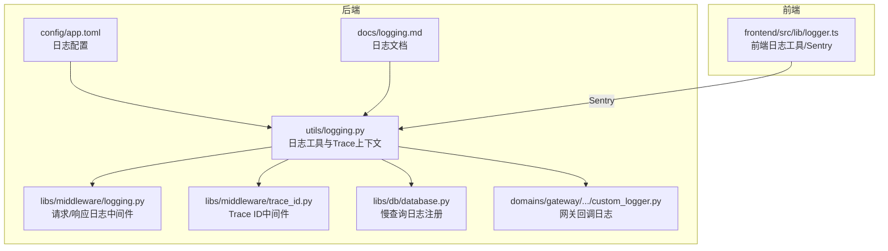
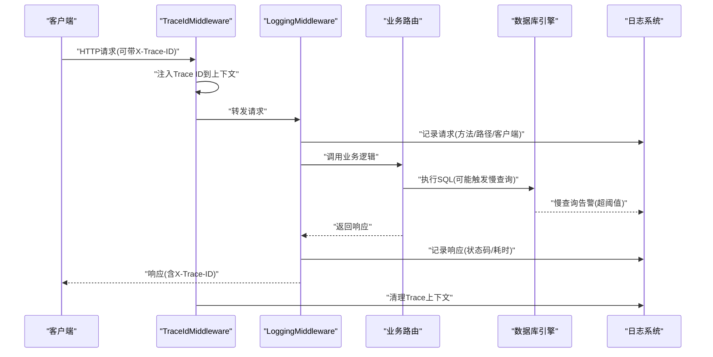
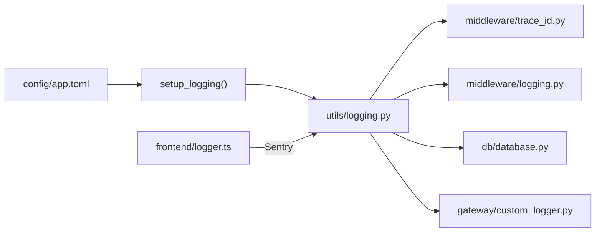

# 日志分析与调试

<cite>
**本文引用的文件**
- [backend/utils/logging.py](file://backend/utils/logging.py)
- [backend/libs/middleware/logging.py](file://backend/libs/middleware/logging.py)
- [backend/libs/middleware/trace_id.py](file://backend/libs/middleware/trace_id.py)
- [backend/libs/db/database.py](file://backend/libs/db/database.py)
- [backend/domains/gateway/infrastructure/callbacks/custom_logger.py](file://backend/domains/gateway/infrastructure/callbacks/custom_logger.py)
- [backend/docs/logging.md](file://backend/docs/logging.md)
- [frontend/src/lib/logger.ts](file://frontend/src/lib/logger.ts)
- [backend/config/app.toml](file://backend/config/app.toml)
- [backend/bootstrap/main.py](file://backend/bootstrap/main.py)
- [backend/scripts/run_server.py](file://backend/scripts/run_server.py)
- [backend/docker-compose.yml](file://backend/docker-compose.yml)
- [backend/Deployment.yaml](file://backend/Deployment.yaml)
- [frontend/Deployment.yaml](file://frontend/Deployment.yaml)
</cite>

## 目录
1. [简介](#简介)
2. [项目结构](#项目结构)
3. [核心组件](#核心组件)
4. [架构总览](#架构总览)
5. [详细组件分析](#详细组件分析)
6. [依赖关系分析](#依赖关系分析)
7. [性能考量](#性能考量)
8. [故障排查指南](#故障排查指南)
9. [结论](#结论)
10. [附录](#附录)

## 简介
本文件面向AI Agent项目的日志分析与调试，系统性阐述后端FastAPI服务、数据库、网关回调以及前端应用的日志体系与最佳实践。内容涵盖日志级别语义、输出格式与轮转策略、请求ID追踪、错误堆栈与性能指标提取、后端中间件与数据库慢查询日志、前端控制台与Sentry集成、日志聚合与搜索、实时监控与告警等。

## 项目结构
- 后端采用分层架构，日志能力分布在工具层(utils)、中间件层(middleware)、基础设施层(db)与领域回调层(gateway callbacks)，并通过统一入口在启动阶段集中配置。
- 前端提供结构化日志工具，支持按环境调整级别、Sentry集成与API调用日志封装。
- 文档与配置文件位于backend/docs与backend/config目录，提供日志配置示例与部署参考。

图表来源
- [backend/utils/logging.py:1-43](file://backend/utils/logging.py#L1-L43)
- [backend/libs/middleware/logging.py:1-58](file://backend/libs/middleware/logging.py#L1-L58)
- [backend/libs/middleware/trace_id.py:1-96](file://backend/libs/middleware/trace_id.py#L1-L96)
- [backend/libs/db/database.py:158-217](file://backend/libs/db/database.py#L158-L217)
- [backend/domains/gateway/infrastructure/callbacks/custom_logger.py:90-129](file://backend/domains/gateway/infrastructure/callbacks/custom_logger.py#L90-L129)
- [backend/config/app.toml](file://backend/config/app.toml)
- [backend/docs/logging.md:76-172](file://backend/docs/logging.md#L76-L172)
- [frontend/src/lib/logger.ts:1-278](file://frontend/src/lib/logger.ts#L1-L278)

章节来源
- [backend/docs/logging.md:76-172](file://backend/docs/logging.md#L76-L172)
- [backend/config/app.toml](file://backend/config/app.toml)

## 核心组件
- 后端日志工具与Trace上下文：提供无依赖的logger获取、启动时集中配置、Trace ID上下文注入与清理。
- FastAPI日志中间件：记录请求与响应，包含方法、路径、客户端、状态码与耗时。
- Trace ID中间件：生成/读取X-Trace-ID，贯穿请求生命周期，便于跨服务日志关联。
- 数据库慢查询日志：基于SQLAlchemy事件监听，对超过阈值的SQL发出告警日志。
- 网关回调日志：封装成功/失败事件持久化，记录错误码与错误信息。
- 前端日志工具：统一结构化日志、按环境级别控制、Sentry集成、API调用封装。

章节来源
- [backend/utils/logging.py:1-43](file://backend/utils/logging.py#L1-L43)
- [backend/libs/middleware/logging.py:1-58](file://backend/libs/middleware/logging.py#L1-L58)
- [backend/libs/middleware/trace_id.py:1-96](file://backend/libs/middleware/trace_id.py#L1-L96)
- [backend/libs/db/database.py:158-217](file://backend/libs/db/database.py#L158-L217)
- [backend/domains/gateway/infrastructure/callbacks/custom_logger.py:90-129](file://backend/domains/gateway/infrastructure/callbacks/custom_logger.py#L90-L129)
- [frontend/src/lib/logger.ts:1-278](file://frontend/src/lib/logger.ts#L1-L278)

## 架构总览
后端日志体系通过启动流程集中初始化，中间件层在请求边界记录请求/响应与Trace ID，数据库层对慢查询进行告警，网关回调层记录请求结果与错误。前端通过统一日志工具输出控制台与Sentry。

图表来源
- [backend/libs/middleware/trace_id.py:46-71](file://backend/libs/middleware/trace_id.py#L46-L71)
- [backend/libs/middleware/logging.py:21-56](file://backend/libs/middleware/logging.py#L21-L56)
- [backend/libs/db/database.py:158-198](file://backend/libs/db/database.py#L158-L198)

## 详细组件分析

### 后端日志工具与Trace上下文
- 能力概览
  - 无依赖获取logger，避免循环导入。
  - 启动时集中配置日志级别、格式与开发/生产差异。
  - Trace ID上下文变量，配合TraceIdMiddleware注入与清理。
- 关键点
  - 环境变量驱动：LOG_LEVEL、APP_ENV。
  - 开发环境默认DEBUG，生产环境默认INFO。
  - JSON/文本两种格式，便于日志系统采集。

章节来源
- [backend/utils/logging.py:25-43](file://backend/utils/logging.py#L25-L43)
- [backend/docs/logging.md:76-96](file://backend/docs/logging.md#L76-L96)

### FastAPI日志中间件
- 能力概览
  - 记录请求：方法、路径、客户端。
  - 记录响应：状态码、耗时(ms)。
  - 使用额外字段扩展，便于检索与聚合。
- 性能
  - 仅在info级别记录，开销极低。

章节来源
- [backend/libs/middleware/logging.py:18-58](file://backend/libs/middleware/logging.py#L18-L58)

### Trace ID中间件
- 能力概览
  - 从请求头读取或生成UUID作为Trace ID。
  - 注入到日志上下文，同时写入request.state。
  - 在响应头回传Trace ID，便于客户端/网关侧关联。
  - 请求结束清理上下文，避免泄漏。
- 关联性
  - 与日志工具结合，使所有日志具备统一请求标识。

章节来源
- [backend/libs/middleware/trace_id.py:20-96](file://backend/libs/middleware/trace_id.py#L20-L96)

### 数据库慢查询日志
- 能力概览
  - 基于SQLAlchemy事件监听before/after执行，计算耗时。
  - 读取配置阈值，超过阈值输出慢查询告警日志。
  - 对SQL进行简短预览，避免日志过大。
- 配置
  - 通过settings.gateway_slow_sql_threshold_ms控制阈值。

章节来源
- [backend/libs/db/database.py:158-217](file://backend/libs/db/database.py#L158-L217)

### 网关回调日志
- 能力概览
  - 成功/失败事件分别记录，失败时提取错误码与错误信息。
  - 异步持久化，确保不影响主业务链路。
- 用途
  - 用于网关请求的计费、SLA与可观测性记录。

章节来源
- [backend/domains/gateway/infrastructure/callbacks/custom_logger.py:90-129](file://backend/domains/gateway/infrastructure/callbacks/custom_logger.py#L90-L129)

### 前端日志工具
- 能力概览
  - 统一日志接口：debug/info/warn/error。
  - 结构化元数据，支持JSON序列化。
  - Sentry集成：自动捕获异常与消息，支持附加元数据。
  - API封装：apiRequest/apiResponse/apiError，便于统一埋点。
  - 环境级别：开发/测试默认DEBUG，生产默认ERROR。
- 输出
  - 控制台输出与Sentry上报。

章节来源
- [frontend/src/lib/logger.ts:1-278](file://frontend/src/lib/logger.ts#L1-L278)
- [backend/docs/logging.md:99-172](file://backend/docs/logging.md#L99-L172)

## 依赖关系分析
- 组件耦合
  - 日志工具被中间件、数据库、网关回调广泛依赖，保持低耦合高内聚。
  - Trace ID中间件依赖日志工具的上下文注入API。
  - 数据库慢查询日志依赖配置与日志工具。
- 启动流程
  - 后端启动时加载配置并调用setup_logging完成全局初始化。
  - 中间件在ASGI应用中顺序生效，保证请求边界日志完整。

图表来源
- [backend/config/app.toml](file://backend/config/app.toml)
- [backend/utils/logging.py:25-43](file://backend/utils/logging.py#L25-L43)
- [backend/libs/middleware/trace_id.py:15-17](file://backend/libs/middleware/trace_id.py#L15-L17)
- [backend/libs/middleware/logging.py:13-15](file://backend/libs/middleware/logging.py#L13-L15)
- [backend/libs/db/database.py:160-166](file://backend/libs/db/database.py#L160-L166)
- [backend/domains/gateway/infrastructure/callbacks/custom_logger.py:90-93](file://backend/domains/gateway/infrastructure/callbacks/custom_logger.py#L90-L93)
- [frontend/src/lib/logger.ts:26-35](file://frontend/src/lib/logger.ts#L26-L35)

章节来源
- [backend/bootstrap/main.py](file://backend/bootstrap/main.py)
- [backend/scripts/run_server.py](file://backend/scripts/run_server.py)

## 性能考量
- 日志级别与格式
  - 生产环境建议使用JSON格式，便于日志系统解析与聚合。
  - 严格控制DEBUG/INFO量级，避免I/O瓶颈。
- 中间件与数据库
  - 日志中间件与慢查询检测均为轻量操作，但应避免在高频路径中过度打印。
- 前端
  - Sentry上报为异步，注意控制元数据大小，避免影响页面性能。

## 故障排查指南

### 日志级别与使用场景
- DEBUG：开发调试、参数与中间状态，生产禁用或限制使用。
- INFO：常规运行信息、请求/响应摘要、慢查询告警。
- WARNING：潜在问题（如慢查询、外部API异常），需要关注。
- ERROR：错误与异常，必须处理与上报。

章节来源
- [backend/docs/logging.md:76-96](file://backend/docs/logging.md#L76-L96)

### 请求ID追踪（Trace ID）
- 客户端/网关侧在请求头携带X-Trace-ID，若缺失由后端生成并回传。
- 所有日志包含同一Trace ID，可在日志系统中按该ID聚合一次请求全链路。
- 建议在API文档中要求客户端/网关传递X-Trace-ID，提升可追溯性。

章节来源
- [backend/libs/middleware/trace_id.py:46-71](file://backend/libs/middleware/trace_id.py#L46-L71)

### 错误堆栈分析
- 后端：异常由全局异常处理器输出RFC 7807，同时在日志中记录堆栈。
- 前端：logger.error自动捕获Error对象的name/message/stack并作为元数据上报Sentry。
- 建议：在日志中保留trace_id与上下文信息，便于快速定位。

章节来源
- [frontend/src/lib/logger.ts:265-278](file://frontend/src/lib/logger.ts#L265-L278)

### 性能指标提取
- 请求耗时：来自日志中间件记录的duration_ms。
- 慢查询：来自数据库慢查询日志的SQL与耗时。
- 建议：在日志系统中建立指标仪表盘，统计P95/P99延迟与慢查询占比。

章节来源
- [backend/libs/middleware/logging.py:40-56](file://backend/libs/middleware/logging.py#L40-L56)
- [backend/libs/db/database.py:180-198](file://backend/libs/db/database.py#L180-L198)

### 后端服务日志分析技巧
- FastAPI中间件日志
  - 关注请求路径与状态码分布，识别异常端点。
  - 结合trace_id进行单请求聚合分析。
- 数据库查询日志
  - 优先处理慢查询告警，结合SQL与参数定位热点。
  - 配合索引与查询优化策略。
- 外部API调用日志
  - 网关回调日志记录成功/失败与错误码，便于SLA与计费核对。

章节来源
- [backend/libs/middleware/logging.py:18-58](file://backend/libs/middleware/logging.py#L18-L58)
- [backend/libs/db/database.py:158-217](file://backend/libs/db/database.py#L158-L217)
- [backend/domains/gateway/infrastructure/callbacks/custom_logger.py:90-129](file://backend/domains/gateway/infrastructure/callbacks/custom_logger.py#L90-L129)

### 前端应用日志收集与分析
- 控制台日志
  - 按环境级别输出，开发默认DEBUG，生产默认ERROR。
- 网络请求日志
  - 使用API封装方法记录请求/响应与耗时，便于前端性能分析。
- 组件状态日志
  - 通过结构化元数据记录关键状态变化，辅助问题复现。

章节来源
- [frontend/src/lib/logger.ts:46-53](file://frontend/src/lib/logger.ts#L46-L53)
- [frontend/src/lib/logger.ts:230-241](file://frontend/src/lib/logger.ts#L230-L241)

### 日志聚合与搜索最佳实践
- 配置
  - 后端：在app.toml中配置日志级别、格式、文件路径、轮转大小与备份数。
  - 前端：通过Sentry SDK接入，自动上报错误与性能事件。
- 过滤
  - 以trace_id为主键过滤单次请求全链路。
  - 以时间范围、状态码、错误码、慢查询阈值进行筛选。
- 可视化
  - 建立仪表盘：请求量、错误率、P95/P99延迟、慢查询数。

章节来源
- [backend/config/app.toml](file://backend/config/app.toml)
- [backend/docs/logging.md:76-172](file://backend/docs/logging.md#L76-L172)
- [frontend/src/lib/logger.ts:26-35](file://frontend/src/lib/logger.ts#L26-L35)

### 实时日志监控与告警
- 建议
  - 将后端JSON日志接入日志系统，设置告警规则（错误率、慢查询占比、延迟突增）。
  - 前端Sentry设置错误阈值告警与用户影响度指标。
  - 结合Trace ID与Span ID构建端到端调用链监控。

章节来源
- [backend/docs/logging.md:149-172](file://backend/docs/logging.md#L149-L172)

## 结论
本项目在后端与前端均提供了完善的日志能力：后端通过中间件、Trace ID、数据库慢查询与网关回调形成闭环；前端通过结构化日志与Sentry实现错误与性能可观测。建议在生产环境中统一使用JSON格式、严格控制日志级别、建立基于Trace ID的全链路关联与告警机制，以提升问题定位效率与系统稳定性。

## 附录

### 后端日志配置要点
- 配置项
  - level：日志级别
  - format：输出格式(json/text)
  - file：日志文件路径
  - max_bytes：单文件大小
  - backup_count：备份数
  - error_file：错误专用文件
- 输出位置
  - 开发：控制台+文件
  - 生产：JSON格式，便于日志系统采集

章节来源
- [backend/docs/logging.md:76-96](file://backend/docs/logging.md#L76-L96)
- [backend/config/app.toml](file://backend/config/app.toml)

### 启动与部署参考
- 启动脚本与入口
  - 后端启动入口与服务器脚本负责加载配置并初始化日志。
- 容器与部署
  - 后端与前端均有Deployment与docker-compose配置，建议在容器标准输出中采集日志并落盘。

章节来源
- [backend/bootstrap/main.py](file://backend/bootstrap/main.py)
- [backend/scripts/run_server.py](file://backend/scripts/run_server.py)
- [backend/docker-compose.yml](file://backend/docker-compose.yml)
- [backend/Deployment.yaml](file://backend/Deployment.yaml)
- [frontend/Deployment.yaml](file://frontend/Deployment.yaml)