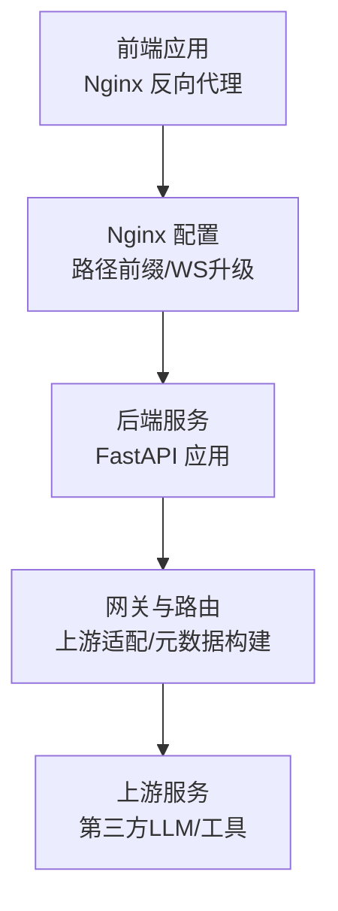
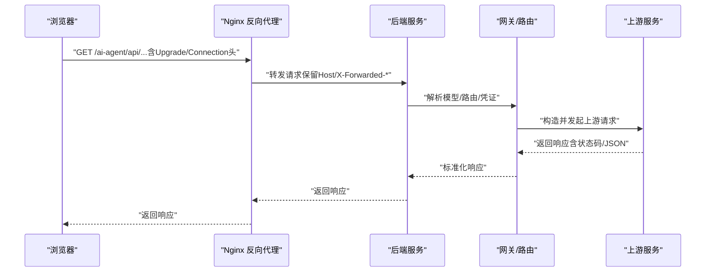
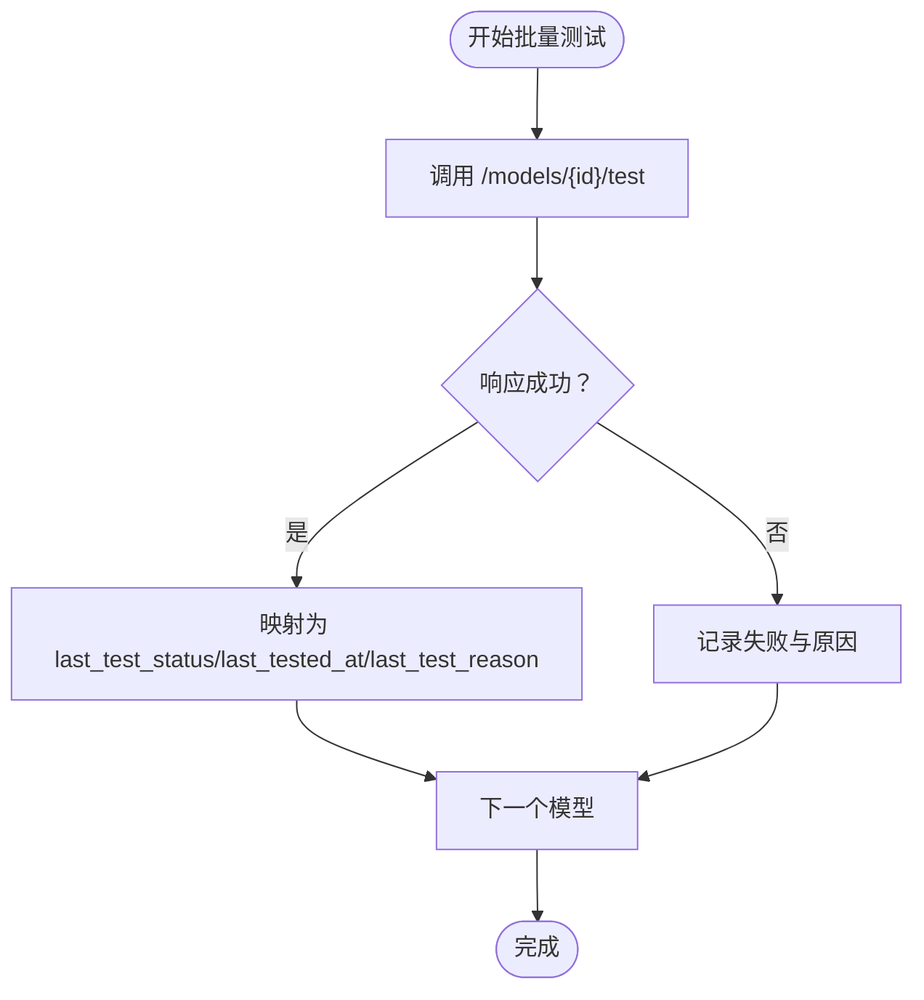
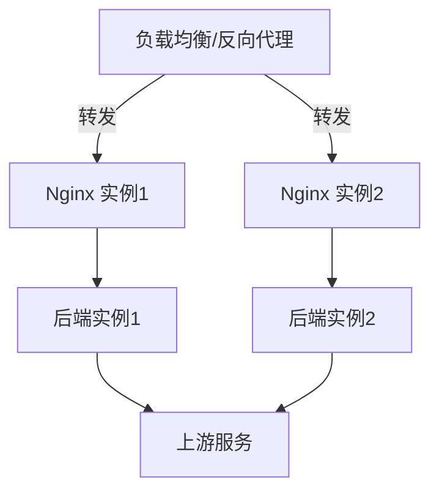

# 网络连接问题

<cite>
**本文引用的文件**
- [test_network_config.py](file://backend/scripts/test_network_config.py)
- [network-enabled.toml](file://backend/config/environments/network-enabled.toml)
- [network-restricted.toml](file://backend/config/environments/network-restricted.toml)
- [nginx.conf](file://frontend/nginx.conf)
- [ai-agent.bare-metal.conf.example](file://deploy/nginx/ai-agent.bare-metal.conf.example)
- [README.md](file://deploy/nginx/README.md)
- [deployment-production.html](file://docs/deployment-production.html)
- [utils.ts](file://frontend/src/features/gateway-models/utils.ts)
- [utils.test.ts](file://frontend/src/features/gateway-models/utils.test.ts)
- [client.test.ts](file://frontend/src/api/client.test.ts)
- [openai_compatible_model_list_adapter.py](file://backend/domains/gateway/infrastructure/upstream/openai_compatible_model_list_adapter.py)
- [proxy_metadata_builder.py](file://backend/domains/gateway/application/proxy_metadata_builder.py)
- [run-nacos-fix.sh](file://deploy/higress/run-nacos-fix.sh)
- [mcpbridge-iam-redis.patch.json](file://deploy/higress/mcpbridge-iam-redis.patch.json)
- [test_litellm_models.py](file://backend/scripts/test_litellm_models.py)
- [test_gateway_proxy.py](file://backend/scripts/test_gateway_proxy.py)
- [test_checkpointer.py](file://backend/scripts/test_checkpointer.py)
- [test_network_config.py](file://backend/scripts/test_network_config.py)
- [test_tool_registry.py](file://backend/scripts/test_tool_registry.py)
- [test_sandbox_executor.py](file://backend/scripts/test_sandbox_executor.py)
- [test_sandbox_executor_factory.py](file://backend/scripts/test_sandbox_executor_factory.py)
- [test_sandbox_manager.py](file://backend/scripts/test_sandbox_manager.py)
- [test_network_config.py](file://backend/scripts/test_network_config.py)
</cite>

## 目录
1. [简介](#简介)
2. [项目结构](#项目结构)
3. [核心组件](#核心组件)
4. [架构总览](#架构总览)
5. [详细组件分析](#详细组件分析)
6. [依赖分析](#依赖分析)
7. [性能考虑](#性能考虑)
8. [故障排查指南](#故障排查指南)
9. [结论](#结论)
10. [附录](#附录)

## 简介
本文件面向AI Agent项目的网络连接问题排查，覆盖API连通性测试、代理配置、防火墙与网络安全、Docker/Kubernetes网络、负载均衡与反向代理、跨网络环境（内网穿透/VPN/云服务）、DNS解析、以及WebSocket连接等场景。文档结合仓库中的配置样例、测试脚本与前端/后端实现，提供可操作的诊断步骤与修复建议。

## 项目结构
- 前端通过Nginx反向代理访问后端API，支持路径前缀与WebSocket升级。
- 后端提供网关与上游模型适配层，具备连通性探测与错误归因能力。
- 部署侧提供Higress与Nginx示例，涵盖裸机与容器化部署场景。
- 提供网络配置测试脚本与批量连通性测试工具，便于快速定位问题。

图表来源
- [nginx.conf:1-29](file://frontend/nginx.conf#L1-L29)
- [ai-agent.bare-metal.conf.example:1-60](file://deploy/nginx/ai-agent.bare-metal.conf.example#L1-L60)
- [proxy_metadata_builder.py:73-109](file://backend/domains/gateway/application/proxy_metadata_builder.py#L73-L109)

章节来源
- [nginx.conf:1-29](file://frontend/nginx.conf#L1-L29)
- [README.md:1-17](file://deploy/nginx/README.md#L1-L17)
- [deployment-production.html:496-534](file://docs/deployment-production.html#L496-L534)

## 核心组件
- Nginx反向代理与路径前缀
  - 前端默认服务前缀“/ai-agent”，需通过rewrite去除前缀再try_files。
  - WebSocket通过Upgrade/Connection头进行升级。
- 后端网关与上游适配
  - 上游兼容适配器对HTTP状态码、JSON格式、错误信息进行标准化处理。
  - 元数据构建器根据模型/路由/凭证生成网关上下文信息。
- 连通性测试与批量探测
  - 前端提供批量连通性测试工具，将API响应映射为列表行的最后测试状态字段。
  - 后端提供网络配置测试脚本，覆盖网络禁用/启用、环境模板、Shell网络等场景。
- 部署与运维脚本
  - Higress补丁脚本与Redis注册表补丁，辅助网关与会话存储的连通性修复。

章节来源
- [nginx.conf:13-29](file://frontend/nginx.conf#L13-L29)
- [openai_compatible_model_list_adapter.py:41-80](file://backend/domains/gateway/infrastructure/upstream/openai_compatible_model_list_adapter.py#L41-L80)
- [proxy_metadata_builder.py:73-109](file://backend/domains/gateway/application/proxy_metadata_builder.py#L73-L109)
- [utils.ts:354-376](file://frontend/src/features/gateway-models/utils.ts#L354-L376)
- [test_network_config.py:199-244](file://backend/scripts/test_network_config.py#L199-L244)
- [run-nacos-fix.sh:1-3](file://deploy/higress/run-nacos-fix.sh#L1-L3)
- [mcpbridge-iam-redis.patch.json:1-12](file://deploy/higress/mcpbridge-iam-redis.patch.json#L1-L12)

## 架构总览
下图展示从浏览器到后端API再到上游服务的典型请求路径，以及WebSocket升级流程。

图表来源
- [nginx.conf:15-29](file://frontend/nginx.conf#L15-L29)
- [proxy_metadata_builder.py:73-109](file://backend/domains/gateway/application/proxy_metadata_builder.py#L73-L109)
- [openai_compatible_model_list_adapter.py:41-80](file://backend/domains/gateway/infrastructure/upstream/openai_compatible_model_list_adapter.py#L41-L80)

## 详细组件分析

### 组件A：API连通性测试与工具
- 批量连通性测试
  - 前端工具接收模型列表，逐项调用后端“/models/{id}/test”接口，并将结果映射为列表行的最后测试状态、时间与原因。
  - 失败与异常均被正确收集，确保批量任务的可观测性。
- 自动化脚本
  - 后端脚本提供网络禁用/启用、环境模板、Shell网络等测试用例，便于在不同网络环境下验证连通性。
- curl与Postman
  - 使用curl测试健康检查端点与特定API路径，携带必要的Header（如X-Forwarded-Proto、X-Real-IP等）以模拟真实代理环境。
  - Postman中设置路径前缀、认证头、WebSocket端点与升级头，复现用户侧问题。

图表来源
- [utils.ts:354-376](file://frontend/src/features/gateway-models/utils.ts#L354-L376)
- [utils.test.ts:338-418](file://frontend/src/features/gateway-models/utils.test.ts#L338-L418)
- [test_network_config.py:199-244](file://backend/scripts/test_network_config.py#L199-L244)

章节来源
- [utils.ts:354-376](file://frontend/src/features/gateway-models/utils.ts#L354-L376)
- [utils.test.ts:338-418](file://frontend/src/features/gateway-models/utils.test.ts#L338-L418)
- [test_network_config.py:199-244](file://backend/scripts/test_network_config.py#L199-L244)

### 组件B：代理配置诊断与修复
- HTTP/HTTPS代理
  - 在容器/本地开发环境中，确认HTTP_PROXY/HTTPS_PROXY与NO_PROXY配置是否覆盖目标域名与端口。
  - 对于Nginx反代，确保X-Forwarded-Proto与X-Forwarded-For正确传递，避免上游误判协议或来源。
- SOCKS代理
  - 若使用SOCKS代理，需验证上游SDK/客户端支持SOCKS且端口可达；同时检查代理链路中的DNS解析行为。
- 环境模板
  - 使用network-enabled与network-restricted模板验证网络策略差异，定位ACL/出站限制导致的问题。

章节来源
- [network-enabled.toml](file://backend/config/environments/network-enabled.toml)
- [network-restricted.toml](file://backend/config/environments/network-restricted.toml)
- [nginx.conf:20-24](file://frontend/nginx.conf#L20-L24)

### 组件C：防火墙与网络安全
- 端口开放检查
  - 确认后端监听端口（如8000）、上游服务端口（如443/8443）与数据库/缓存端口在安全组/防火墙放行。
- ACL规则
  - 检查Kubernetes/Namespace/NetworkPolicy或云厂商安全组，确保Pod间与对外出站流量策略允许AI Agent所需的域名/IP与端口。
- SSL/TLS证书
  - 上游服务证书链必须完整，浏览器/系统信任链需包含中间CA；若自签证书，需将证书加入信任库或在客户端跳过校验（仅限测试）。

章节来源
- [openai_compatible_model_list_adapter.py:41-80](file://backend/domains/gateway/infrastructure/upstream/openai_compatible_model_list_adapter.py#L41-L80)

### 组件D：Docker/Kubernetes网络
- 容器网络模式
  - 使用host网络或bridge网络时，确认容器与宿主机/集群网络连通；必要时固定容器IP或使用服务发现。
- 端口映射
  - 检查docker-compose或Deployment的ports映射，确保外部访问端口与容器内部端口一致。
- 网络隔离
  - 若启用NetworkPolicy，确保Ingress/Egress规则允许到上游与下游组件的流量。

章节来源
- [test_network_config.py:199-244](file://backend/scripts/test_network_config.py#L199-L244)

### 组件E：负载均衡与反向代理
- Nginx配置要点
  - 保持路径前缀一致性（如“/ai-agent”），使用rewrite去除前缀后再try_files。
  - WebSocket升级需转发Upgrade/Connection头，并设置合理的proxy_read_timeout。
- 健康检查与故障转移
  - 配置upstream的keepalive与健康检查（如基于TCP/HTTP），在多实例场景下实现故障转移。
- Higress/网关集成
  - 使用补丁脚本与注册表补丁修复会话存储与回调地址的连通性问题。

图表来源
- [nginx.conf:15-29](file://frontend/nginx.conf#L15-L29)
- [ai-agent.bare-metal.conf.example:498-534](file://deploy/nginx/ai-agent.bare-metal.conf.example#L498-L534)
- [run-nacos-fix.sh:1-3](file://deploy/higress/run-nacos-fix.sh#L1-L3)
- [mcpbridge-iam-redis.patch.json:1-12](file://deploy/higress/mcpbridge-iam-redis.patch.json#L1-L12)

章节来源
- [nginx.conf:1-29](file://frontend/nginx.conf#L1-L29)
- [README.md:1-17](file://deploy/nginx/README.md#L1-L17)
- [deployment-production.html:496-534](file://docs/deployment-production.html#L496-L534)
- [run-nacos-fix.sh:1-3](file://deploy/higress/run-nacos-fix.sh#L1-L3)
- [mcpbridge-iam-redis.patch.json:1-12](file://deploy/higress/mcpbridge-iam-redis.patch.json#L1-L12)

### 组件F：跨网络环境（内网穿透/VPN/云服务）
- 内网穿透
  - 使用ngrok/Cloudflare Tunnel等工具暴露本地后端端口，验证WebSocket与静态资源路径前缀。
- VPN
  - 确保VPN路由表包含上游服务网段；检查DNS解析是否走VPN隧道。
- 云服务集成
  - Kubernetes中配置Service/Ingress，确保ClusterIP/LoadBalancer与云厂商LB连通；检查节点安全组与云防火墙策略。

章节来源
- [test_network_config.py:199-244](file://backend/scripts/test_network_config.py#L199-L244)

### 组件G：DNS解析问题
- 域名解析测试
  - 使用nslookup/dig/host确认域名解析到预期IP；检查上游服务域名变更后的缓存。
- DNS缓存清理
  - 清理系统/路由器/DNS缓存；临时更换上游DNS（如8.8.8.8）验证是否为本地DNS污染。
- DNS服务器配置
  - 在容器/节点上配置resolv.conf或使用Kubernetes的dnsPolicy，确保解析优先级与搜索域正确。

章节来源
- [openai_compatible_model_list_adapter.py:41-80](file://backend/domains/gateway/infrastructure/upstream/openai_compatible_model_list_adapter.py#L41-L80)

### 组件H：WebSocket连接问题
- 握手失败
  - 检查Nginx是否转发Upgrade/Connection头；确认后端路由支持WebSocket端点。
- 心跳检测
  - 在客户端实现ping/pong逻辑，超时则触发重连；后端应处理连接空闲与异常断开。
- 断线重连
  - 指数退避重试，携带会话上下文；必要时切换上游节点或代理。

章节来源
- [nginx.conf:17-21](file://frontend/nginx.conf#L17-L21)

## 依赖分析
- 前端API客户端测试
  - 通过单元测试验证POST/PUT/DELETE请求的发送与响应解析，确保网络层与业务层交互正常。
- 上游适配器
  - 对上游HTTP响应进行状态码与JSON校验，异常时返回标准化错误消息，便于前端/日志定位。

图表来源
- [client.test.ts:151-199](file://frontend/src/api/client.test.ts#L151-L199)
- [openai_compatible_model_list_adapter.py:41-80](file://backend/domains/gateway/infrastructure/upstream/openai_compatible_model_list_adapter.py#L41-L80)

章节来源
- [client.test.ts:151-199](file://frontend/src/api/client.test.ts#L151-L199)
- [openai_compatible_model_list_adapter.py:41-80](file://backend/domains/gateway/infrastructure/upstream/openai_compatible_model_list_adapter.py#L41-L80)

## 性能考虑
- 反向代理缓冲与超时
  - 合理设置proxy_buffering与proxy_read_timeout，避免大文件/长连接阻塞。
- 连接池与Keep-Alive
  - Nginx与上游的keepalive参数提升并发性能，减少握手开销。
- 批量连通性测试并发度
  - 控制并发数量，避免对上游造成瞬时压力；对失败重试采用指数退避。

## 故障排查指南
- API连通性
  - 使用curl或Postman访问健康检查端点与受保护API，比对响应状态码与错误信息。
  - 结合前端批量测试工具查看last_test_status/last_test_reason，定位具体模型或提供商问题。
- 代理与网络
  - 切换HTTP/HTTPS/SOCKS代理，验证上游域名解析与端口可达性；核对环境模板差异。
- 防火墙与证书
  - 检查端口开放与ACL规则；确保证书链完整，必要时更新信任库。
- Docker/K8s
  - 核对端口映射与网络策略；在多副本场景下验证健康检查与故障转移。
- 负载均衡
  - 确认路径前缀rewrite与WebSocket升级头；使用Higress补丁修复会话存储与回调问题。
- 跨网络
  - 内网穿透/VPN/云服务分别验证路由、DNS与安全组；逐步缩小范围定位瓶颈。
- DNS
  - 更换DNS服务器、清理缓存、检查解析结果与TTL。
- WebSocket
  - 核对Upgrade/Connection头与后端路由；实现心跳与重连策略。

章节来源
- [utils.ts:354-376](file://frontend/src/features/gateway-models/utils.ts#L354-L376)
- [test_network_config.py:199-244](file://backend/scripts/test_network_config.py#L199-L244)
- [nginx.conf:15-29](file://frontend/nginx.conf#L15-L29)
- [openai_compatible_model_list_adapter.py:41-80](file://backend/domains/gateway/infrastructure/upstream/openai_compatible_model_list_adapter.py#L41-L80)

## 结论
通过结合前端批量连通性测试、后端网络配置测试脚本、Nginx/Higress反向代理配置与上游适配器的错误归因能力，可以系统性地定位与修复AI Agent项目中的网络连接问题。建议在生产部署前完成路径前缀一致性、WebSocket升级、健康检查与故障转移的端到端验证，并建立持续的连通性监控与告警。

## 附录
- 常用curl命令示例（路径前缀与认证头）
  - 访问健康检查端点：curl -H "X-Forwarded-Proto: https" http://localhost:8000/api/v1/health
  - 访问受保护API：curl -H "X-Forwarded-Proto: https" -H "Authorization: Bearer ..." http://localhost:8000/api/v1/models
- Postman配置要点
  - 路径前缀：/ai-agent/api/...
  - WebSocket端点：ws://host/api/ws
  - 升级头：Upgrade: websocket；Connection: upgrade
- 环境模板
  - network-enabled.toml与network-restricted.toml用于对比不同网络策略下的连通性表现。

章节来源
- [network-enabled.toml](file://backend/config/environments/network-enabled.toml)
- [network-restricted.toml](file://backend/config/environments/network-restricted.toml)
- [nginx.conf:13-29](file://frontend/nginx.conf#L13-L29)