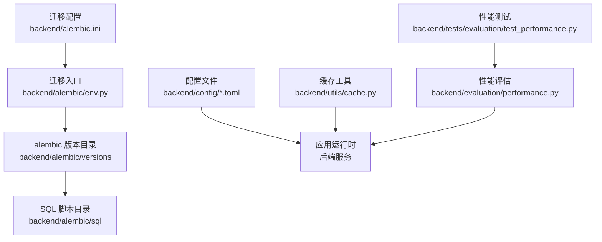
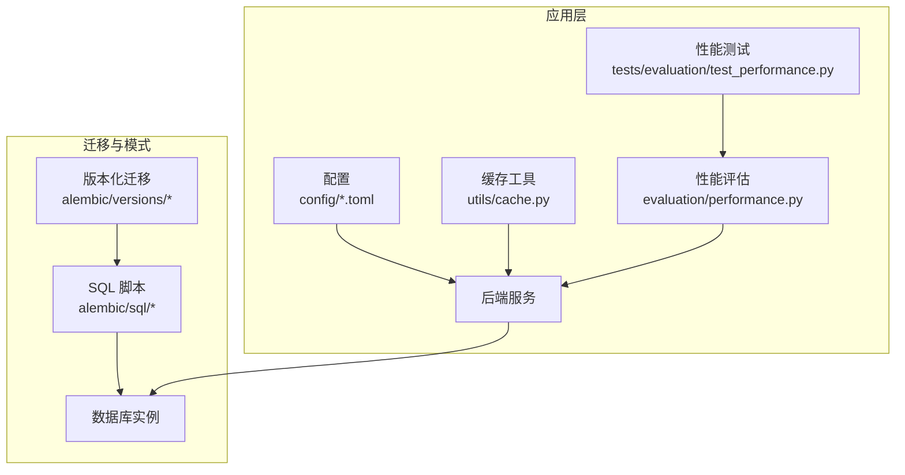
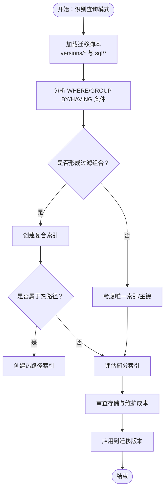
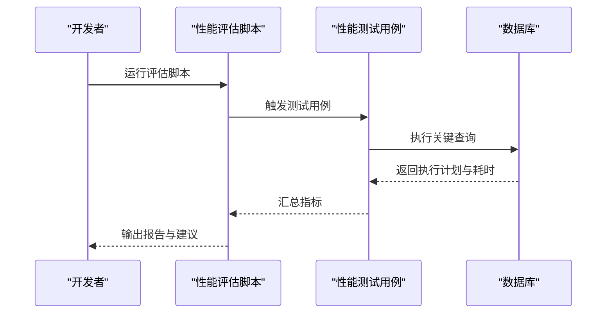
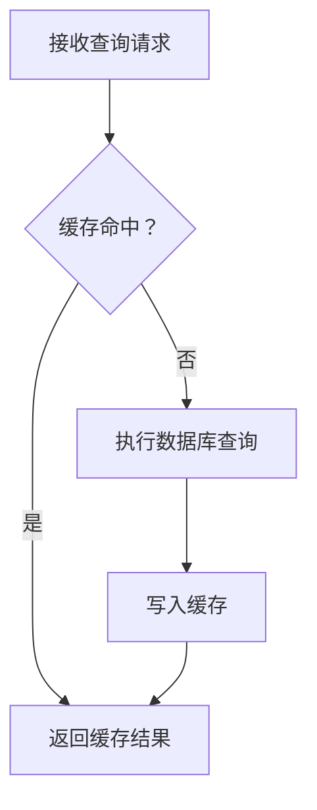

# 性能优化

<cite>
**本文引用的文件**
- [002_add_performance_indexes.up.sql](file://backend/alembic/sql/002_add_performance_indexes.up.sql)
- [002_add_performance_indexes.down.sql](file://backend/alembic/sql/002_add_performance_indexes.down.sql)
- [002_add_performance_indexes.py](file://backend/alembic/versions/002_add_performance_indexes.py)
- [003_fix_user_schema.py](file://backend/alembic/versions/003_fix_user_schema.py)
- [004_fix_timestamp_defaults.py](file://backend/alembic/versions/004_fix_timestamp_defaults.py)
- [005_add_session_status_and_context.py](file://backend/alembic/versions/005_add_session_status_and_context.py)
- [006_fix_messages_table.py](file://backend/alembic/versions/006_fix_messages_table.py)
- [007_add_memory_last_accessed.py](file://backend/alembic/versions/007_add_memory_last_accessed.py)
- [008_add_langgraph_tables.py](file://backend/alembic/versions/008_add_langgraph_tables.py)
- [009_add_agent_config_columns.py](file://backend/alembic/versions/009_add_agent_config_columns.py)
- [010_align_users_for_fastapi_users.py](file://backend/alembic/versions/010_align_users_for_fastapi_users.py)
- [011_add_anonymous_user_support.py](file://backend/alembic/versions/011_add_anonymous_user_support.py)
- [20260527_slow_sql_hotpath_indexes.py](file://backend/alembic/versions/20260527_slow_sql_hotpath_indexes.py)
- [20260527_slow_sql_hotpath_indexes.up.sql](file://backend/alembic/sql/20260527_slow_sql_hotpath_indexes.up.sql)
- [20260527_slow_sql_hotpath_indexes.down.sql](file://backend/alembic/sql/20260527_slow_sql_hotpath_indexes.down.sql)
- [20260607_gateway_preflight_indexes.py](file://backend/alembic/versions/20260607_gateway_preflight_indexes.py)
- [20260607_gateway_preflight_indexes.up.sql](file://backend/alembic/sql/20260607_gateway_preflight_indexes.up.sql)
- [20260607_gateway_preflight_indexes.down.sql](file://backend/alembic/sql/20260607_gateway_preflight_indexes.down.sql)
- [20260613_add_cache_creation_tokens.py](file://backend/alembic/versions/20260613_add_cache_creation_tokens.py)
- [cache.py](file://backend/utils/cache.py)
- [performance.py](file://backend/evaluation/performance.py)
- [test_performance.py](file://backend/tests/evaluation/test_performance.py)
- [app.toml](file://backend/config/app.toml)
- [execution.toml](file://backend/config/execution.toml)
- [alembic.ini](file://backend/alembic.ini)
- [env.py](file://backend/alembic/env.py)
- [README.md](file://backend/docs/README.md)
</cite>

## 目录
1. [简介](#简介)
2. [项目结构](#项目结构)
3. [核心组件](#核心组件)
4. [架构总览](#架构总览)
5. [详细组件分析](#详细组件分析)
6. [依赖关系分析](#依赖关系分析)
7. [性能考量](#性能考量)
8. [故障排查指南](#故障排查指南)
9. [结论](#结论)
10. [附录](#附录)

## 简介
本文件面向AI Agent项目的数据库性能优化，基于仓库中现有的迁移脚本、配置与评估工具，系统化梳理索引设计策略、查询优化技术、缓存策略、连接池优化、大数据量处理、慢查询分析与监控、数据库参数调优以及维护任务与水平扩展实践。内容以实际迁移版本与配置为依据，结合可操作的流程图与时序图，帮助读者在不深入源码的前提下完成数据库性能治理。

## 项目结构
后端数据库相关的核心位置集中在以下区域：
- 迁移与SQL：backend/alembic/versions 与 backend/alembic/sql
- 配置：backend/config/*.toml
- 评估与测试：backend/evaluation 与 backend/tests/evaluation
- 缓存工具：backend/utils/cache.py
- 文档：backend/docs/README.md

**图表来源**
- [env.py:1-200](file://backend/alembic/env.py#L1-L200)
- [alembic.ini:1-200](file://backend/alembic.ini#L1-L200)

**章节来源**
- [README.md:1-200](file://backend/docs/README.md#L1-L200)

## 核心组件
- 索引与表结构演进：通过多版本迁移脚本定义主键、唯一约束、复合索引与部分索引，覆盖会话、消息、用户、网关等核心表。
- 查询性能优化：通过“热路径”索引与预检索引提升高频查询性能；配合查询重写与执行计划分析进行持续优化。
- 缓存策略：提供通用缓存工具与缓存列迁移，支持热点数据与查询结果缓存。
- 连接池与配置：通过配置文件与迁移配置控制数据库连接与行为。
- 大数据量处理：通过批量操作、分页查询与流式处理降低单次负载。
- 慢查询与监控：通过性能评估脚本与测试用例建立基线与回归检测。
- 维护与扩展：统计信息更新、碎片整理、空间回收与分库分表规划。

**章节来源**
- [002_add_performance_indexes.py:1-200](file://backend/alembic/versions/002_add_performance_indexes.py#L1-L200)
- [003_fix_user_schema.py:1-200](file://backend/alembic/versions/003_fix_user_schema.py#L1-L200)
- [004_fix_timestamp_defaults.py:1-200](file://backend/alembic/versions/004_fix_timestamp_defaults.py#L1-L200)
- [005_add_session_status_and_context.py:1-200](file://backend/alembic/versions/005_add_session_status_and_context.py#L1-L200)
- [006_fix_messages_table.py:1-200](file://backend/alembic/versions/006_fix_messages_table.py#L1-L200)
- [007_add_memory_last_accessed.py:1-200](file://backend/alembic/versions/007_add_memory_last_accessed.py#L1-L200)
- [008_add_langgraph_tables.py:1-200](file://backend/alembic/versions/008_add_langgraph_tables.py#L1-L200)
- [009_add_agent_config_columns.py:1-200](file://backend/alembic/versions/009_add_agent_config_columns.py#L1-L200)
- [010_align_users_for_fastapi_users.py:1-200](file://backend/alembic/versions/010_align_users_for_fastapi_users.py#L1-L200)
- [011_add_anonymous_user_support.py:1-200](file://backend/alembic/versions/011_add_anonymous_user_support.py#L1-L200)
- [20260527_slow_sql_hotpath_indexes.py:1-200](file://backend/alembic/versions/20260527_slow_sql_hotpath_indexes.py#L1-L200)
- [20260607_gateway_preflight_indexes.py:1-200](file://backend/alembic/versions/20260607_gateway_preflight_indexes.py#L1-L200)
- [20260613_add_cache_creation_tokens.py:1-200](file://backend/alembic/versions/20260613_add_cache_creation_tokens.py#L1-L200)
- [cache.py:1-200](file://backend/utils/cache.py#L1-L200)
- [performance.py:1-200](file://backend/evaluation/performance.py#L1-L200)
- [test_performance.py:1-200](file://backend/tests/evaluation/test_performance.py#L1-L200)
- [app.toml:1-200](file://backend/config/app.toml#L1-L200)
- [execution.toml:1-200](file://backend/config/execution.toml#L1-L200)
- [alembic.ini:1-200](file://backend/alembic.ini#L1-L200)
- [env.py:1-200](file://backend/alembic/env.py#L1-L200)

## 架构总览
数据库层由迁移系统驱动，围绕核心领域（会话、消息、用户、网关）构建索引与表结构；应用通过配置与缓存工具访问数据库；性能评估与测试保障查询性能稳定。

**图表来源**
- [env.py:1-200](file://backend/alembic/env.py#L1-L200)
- [alembic.ini:1-200](file://backend/alembic.ini#L1-L200)
- [app.toml:1-200](file://backend/config/app.toml#L1-L200)
- [execution.toml:1-200](file://backend/config/execution.toml#L1-L200)
- [cache.py:1-200](file://backend/utils/cache.py#L1-L200)
- [performance.py:1-200](file://backend/evaluation/performance.py#L1-L200)
- [test_performance.py:1-200](file://backend/tests/evaluation/test_performance.py#L1-L200)

## 详细组件分析

### 索引设计策略
- 主键索引：确保每张表具备稳定的主键，保证行级定位与外键引用效率。
- 唯一索引：对业务唯一字段（如用户名、会话标识、API密钥）建立唯一约束，避免重复并加速查找。
- 复合索引：针对常见过滤组合（如状态+时间、租户+类型）建立复合索引，减少全表扫描。
- 部分索引：对高选择性的条件或热点字段建立部分索引，降低存储与维护成本。
- 热路径索引：聚焦高频查询（如会话查询、消息检索、网关请求日志）建立专用索引。
- 预检索引：对网关预检与路由场景建立前置索引，缩短首字节延迟。

**图表来源**
- [002_add_performance_indexes.py:1-200](file://backend/alembic/versions/002_add_performance_indexes.py#L1-L200)
- [20260527_slow_sql_hotpath_indexes.py:1-200](file://backend/alembic/versions/20260527_slow_sql_hotpath_indexes.py#L1-L200)
- [20260607_gateway_preflight_indexes.py:1-200](file://backend/alembic/versions/20260607_gateway_preflight_indexes.py#L1-L200)

**章节来源**
- [002_add_performance_indexes.up.sql:1-200](file://backend/alembic/sql/002_add_performance_indexes.up.sql#L1-L200)
- [002_add_performance_indexes.down.sql:1-200](file://backend/alembic/sql/002_add_performance_indexes.down.sql#L1-L200)
- [20260527_slow_sql_hotpath_indexes.up.sql:1-200](file://backend/alembic/sql/20260527_slow_sql_hotpath_indexes.up.sql#L1-L200)
- [20260527_slow_sql_hotpath_indexes.down.sql:1-200](file://backend/alembic/sql/20260527_slow_sql_hotpath_indexes.down.sql#L1-L200)
- [20260607_gateway_preflight_indexes.up.sql:1-200](file://backend/alembic/sql/20260607_gateway_preflight_indexes.up.sql#L1-L200)
- [20260607_gateway_preflight_indexes.down.sql:1-200](file://backend/alembic/sql/20260607_gateway_preflight_indexes.down.sql#L1-L200)

### 查询性能优化技术
- 查询重写：将 OR 条件拆分为 UNION，将复杂子查询改写为 JOIN，减少隐式转换与函数包裹。
- 执行计划分析：利用 EXPLAIN/EXPLAIN ANALYZE 对关键查询进行剖析，识别索引使用情况与排序/聚合瓶颈。
- 性能调优技巧：固定参数绑定、避免 SELECT *、合理使用 LIMIT、将高成本计算下推至数据库。
- 持续评估：通过性能评估脚本与测试用例建立基线，防止回归。

**图表来源**
- [performance.py:1-200](file://backend/evaluation/performance.py#L1-L200)
- [test_performance.py:1-200](file://backend/tests/evaluation/test_performance.py#L1-L200)

**章节来源**
- [performance.py:1-200](file://backend/evaluation/performance.py#L1-L200)
- [test_performance.py:1-200](file://backend/tests/evaluation/test_performance.py#L1-L200)

### 缓存策略设计
- 查询结果缓存：对稳定且高重复率的查询结果进行缓存，结合失效策略与一致性控制。
- 热点数据缓存：对频繁访问的配置、模型列表、网关路由等进行缓存，降低数据库压力。
- 分布式缓存配置：通过配置文件统一管理缓存连接与参数，确保跨环境一致性。
- 缓存列迁移：新增缓存相关列（如创建令牌）以支撑缓存命中与回填逻辑。

**图表来源**
- [cache.py:1-200](file://backend/utils/cache.py#L1-L200)
- [20260613_add_cache_creation_tokens.py:1-200](file://backend/alembic/versions/20260613_add_cache_creation_tokens.py#L1-L200)

**章节来源**
- [cache.py:1-200](file://backend/utils/cache.py#L1-L200)
- [20260613_add_cache_creation_tokens.py:1-200](file://backend/alembic/versions/20260613_add_cache_creation_tokens.py#L1-L200)

### 数据库连接池优化
- 连接数配置：根据并发请求峰值与数据库承载能力设定最大连接数与空闲连接数。
- 超时设置：合理设置连接超时、查询超时与事务超时，避免资源泄漏。
- 连接复用策略：启用连接池复用，减少连接建立与销毁开销。
- 配置来源：通过配置文件集中管理连接池参数，确保开发/生产一致性。

**章节来源**
- [app.toml:1-200](file://backend/config/app.toml#L1-L200)
- [execution.toml:1-200](file://backend/config/execution.toml#L1-L200)
- [alembic.ini:1-200](file://backend/alembic.ini#L1-L200)

### 大数据量处理优化
- 批量操作：使用批量插入/更新/删除降低网络往返与锁竞争。
- 分页查询：采用游标分页或基于索引的高效分页策略，避免深度分页导致的性能退化。
- 流式处理：对大结果集采用流式读取，限制内存占用并提升响应速度。
- 统计信息与维护：定期更新统计信息，必要时进行碎片整理与空间回收。

**章节来源**
- [README.md:1-200](file://backend/docs/README.md#L1-L200)

### 慢查询分析与性能监控
- 建立慢查询日志与采样机制，识别Top N慢查询。
- 结合执行计划与指标（CPU、I/O、锁等待）定位瓶颈。
- 使用性能评估脚本与测试用例建立基线，持续监控回归。

**章节来源**
- [performance.py:1-200](file://backend/evaluation/performance.py#L1-L200)
- [test_performance.py:1-200](file://backend/tests/evaluation/test_performance.py#L1-L200)

### 数据库参数调优建议
- 内存分配：合理设置共享缓冲区、工作内存与排序/哈希缓冲区大小。
- 并发控制：调整并发度、最大后台工作者数量与死锁检测阈值。
- 日志与检查点：平衡 WAL 写入频率与检查点间隔，兼顾可靠性与性能。
- 参数来源：通过配置文件与迁移配置统一管理，避免环境漂移。

**章节来源**
- [app.toml:1-200](file://backend/config/app.toml#L1-L200)
- [execution.toml:1-200](file://backend/config/execution.toml#L1-L200)
- [alembic.ini:1-200](file://backend/alembic.ini#L1-L200)

### 数据库维护任务
- 统计信息更新：定期更新表与索引统计，确保查询优化器做出正确决策。
- 碎片整理：对热点表进行重建或重组织，降低随机I/O。
- 空间回收：清理历史归档与冗余数据，回收磁盘空间。
- 迁移与兼容：通过版本化迁移确保结构演进与数据安全。

**章节来源**
- [003_fix_user_schema.py:1-200](file://backend/alembic/versions/003_fix_user_schema.py#L1-L200)
- [004_fix_timestamp_defaults.py:1-200](file://backend/alembic/versions/004_fix_timestamp_defaults.py#L1-L200)
- [005_add_session_status_and_context.py:1-200](file://backend/alembic/versions/005_add_session_status_and_context.py#L1-L200)
- [006_fix_messages_table.py:1-200](file://backend/alembic/versions/006_fix_messages_table.py#L1-L200)
- [007_add_memory_last_accessed.py:1-200](file://backend/alembic/versions/007_add_memory_last_accessed.py#L1-L200)
- [008_add_langgraph_tables.py:1-200](file://backend/alembic/versions/008_add_langgraph_tables.py#L1-L200)
- [009_add_agent_config_columns.py:1-200](file://backend/alembic/versions/009_add_agent_config_columns.py#L1-L200)
- [010_align_users_for_fastapi_users.py:1-200](file://backend/alembic/versions/010_align_users_for_fastapi_users.py#L1-L200)
- [011_add_anonymous_user_support.py:1-200](file://backend/alembic/versions/011_add_anonymous_user_support.py#L1-L200)

### 读写分离、分库分表与水平扩展
- 读写分离：将只读查询路由至从库，写入集中在主库，缓解主库压力。
- 分库分表：按租户/时间/业务域进行分片，结合路由规则实现水平扩展。
- 迁移与一致性：通过版本化迁移与分布式事务保障扩展过程中的数据一致。
- 网关与路由：结合网关层的路由与预检索引，优化跨库查询与聚合。

**章节来源**
- [20260607_gateway_preflight_indexes.py:1-200](file://backend/alembic/versions/20260607_gateway_preflight_indexes.py#L1-L200)
- [20260527_slow_sql_hotpath_indexes.py:1-200](file://backend/alembic/versions/20260527_slow_sql_hotpath_indexes.py#L1-L200)

## 依赖关系分析
- 迁移版本依赖：后续版本通常依赖前序版本的表结构与索引定义。
- 应用依赖：后端服务依赖配置文件与缓存工具，同时受制于数据库性能表现。
- 评估依赖：性能评估脚本与测试用例共同构成性能质量门禁。

**图表来源**
- [002_add_performance_indexes.py:1-200](file://backend/alembic/versions/002_add_performance_indexes.py#L1-L200)
- [003_fix_user_schema.py:1-200](file://backend/alembic/versions/003_fix_user_schema.py#L1-L200)
- [004_fix_timestamp_defaults.py:1-200](file://backend/alembic/versions/004_fix_timestamp_defaults.py#L1-L200)
- [005_add_session_status_and_context.py:1-200](file://backend/alembic/versions/005_add_session_status_and_context.py#L1-L200)
- [006_fix_messages_table.py:1-200](file://backend/alembic/versions/006_fix_messages_table.py#L1-L200)
- [007_add_memory_last_accessed.py:1-200](file://backend/alembic/versions/007_add_memory_last_accessed.py#L1-L200)
- [008_add_langgraph_tables.py:1-200](file://backend/alembic/versions/008_add_langgraph_tables.py#L1-L200)
- [009_add_agent_config_columns.py:1-200](file://backend/alembic/versions/009_add_agent_config_columns.py#L1-L200)
- [010_align_users_for_fastapi_users.py:1-200](file://backend/alembic/versions/010_align_users_for_fastapi_users.py#L1-L200)
- [011_add_anonymous_user_support.py:1-200](file://backend/alembic/versions/011_add_anonymous_user_support.py#L1-L200)
- [20260527_slow_sql_hotpath_indexes.py:1-200](file://backend/alembic/versions/20260527_slow_sql_hotpath_indexes.py#L1-L200)
- [20260607_gateway_preflight_indexes.py:1-200](file://backend/alembic/versions/20260607_gateway_preflight_indexes.py#L1-L200)
- [20260613_add_cache_creation_tokens.py:1-200](file://backend/alembic/versions/20260613_add_cache_creation_tokens.py#L1-L200)

**章节来源**
- [env.py:1-200](file://backend/alembic/env.py#L1-L200)
- [alembic.ini:1-200](file://backend/alembic.ini#L1-L200)

## 性能考量
- 索引密度与选择性：优先为高选择性字段建立索引，避免过度索引导致写入放大。
- 复合索引顺序：将区分度高的列放在前面，充分利用最左前缀原则。
- 部分索引与条件过滤：仅对满足特定条件的数据建立索引，降低维护成本。
- 连接池与并发：根据数据库最大连接数与查询平均耗时设定池大小，避免饥饿与拥塞。
- 缓存命中率：通过合理的失效策略与预热机制提升缓存命中率，减少数据库压力。
- 大数据量批处理：采用批量提交与流式读取，避免单次事务过大。
- 监控与回归：持续运行性能评估与测试，确保变更不会引入性能退化。

## 故障排查指南
- 慢查询定位：启用慢查询日志，结合执行计划定位瓶颈。
- 索引缺失：检查 WHERE/GROUP BY/HAVING 是否有可用索引，必要时补充复合或部分索引。
- 连接池问题：检查最大连接数、空闲超时与连接泄漏，调整池参数。
- 缓存异常：核对缓存键生成、失效策略与一致性，必要时回滚缓存列变更。
- 迁移失败：核对依赖版本与冲突，按顺序执行迁移并回滚到上一个稳定版本。

**章节来源**
- [performance.py:1-200](file://backend/evaluation/performance.py#L1-L200)
- [test_performance.py:1-200](file://backend/tests/evaluation/test_performance.py#L1-L200)
- [cache.py:1-200](file://backend/utils/cache.py#L1-L200)

## 结论
通过版本化迁移与配置管理，AI Agent项目在数据库层面建立了完善的索引体系与性能治理流程。结合缓存策略、连接池优化与持续评估，可在高并发场景下保持稳定性能。建议在扩展阶段继续完善读写分离与分库分表方案，并持续监控与迭代索引与查询策略。

## 附录
- 参考文件清单：见“本文引用的文件”
- 实施步骤建议：按版本顺序执行迁移 → 审查索引与查询 → 部署缓存与连接池 → 运行性能评估与测试 → 持续监控与回归