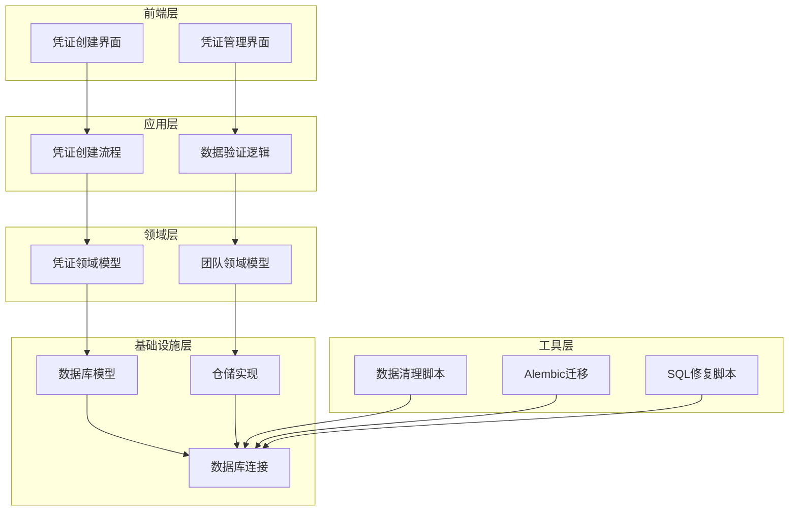
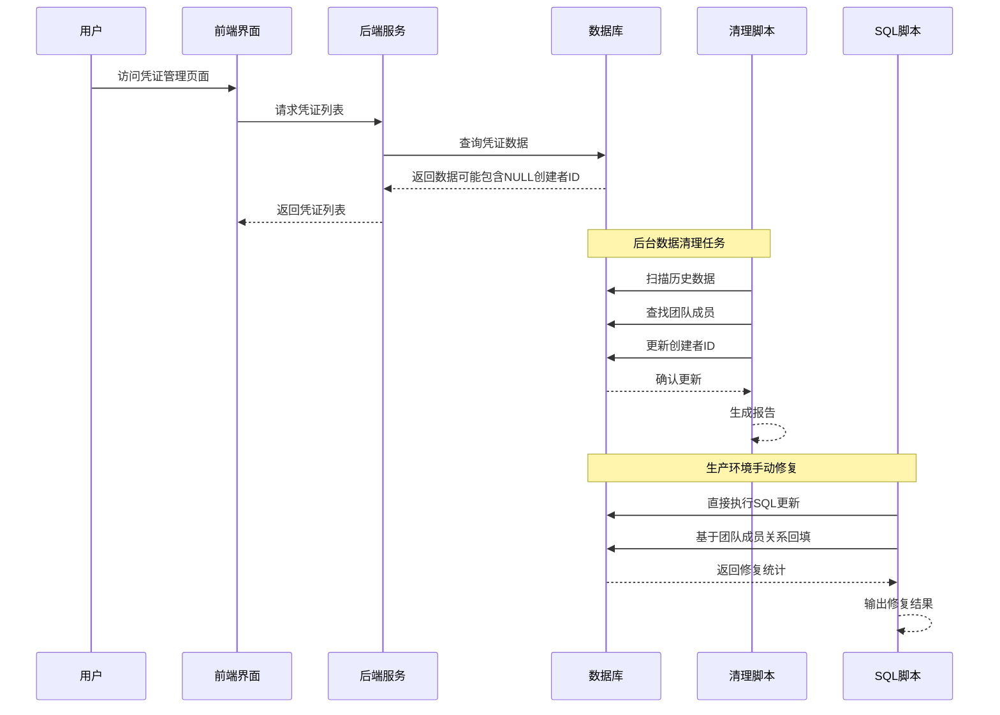
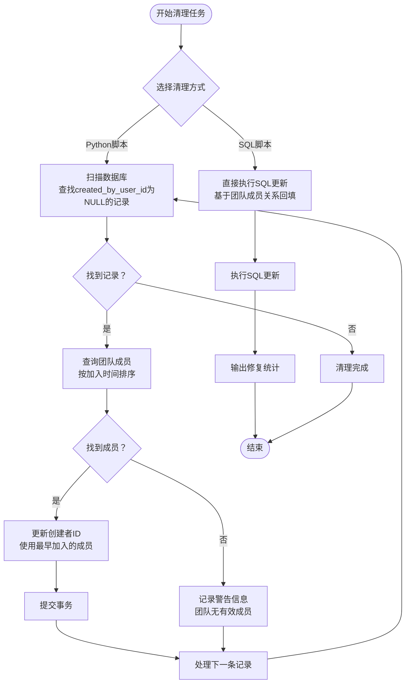
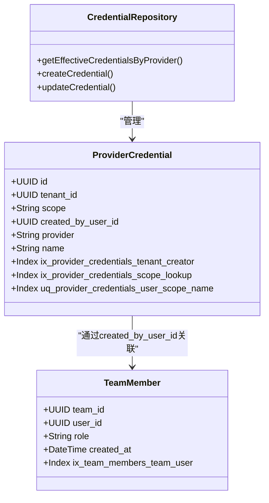
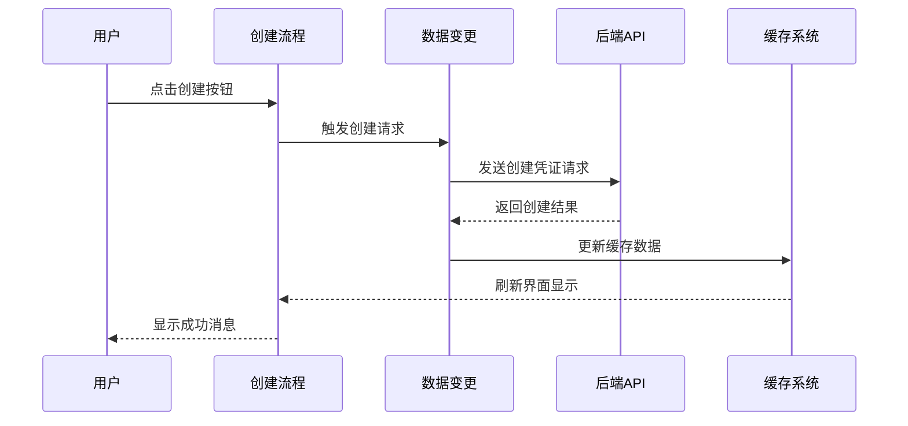
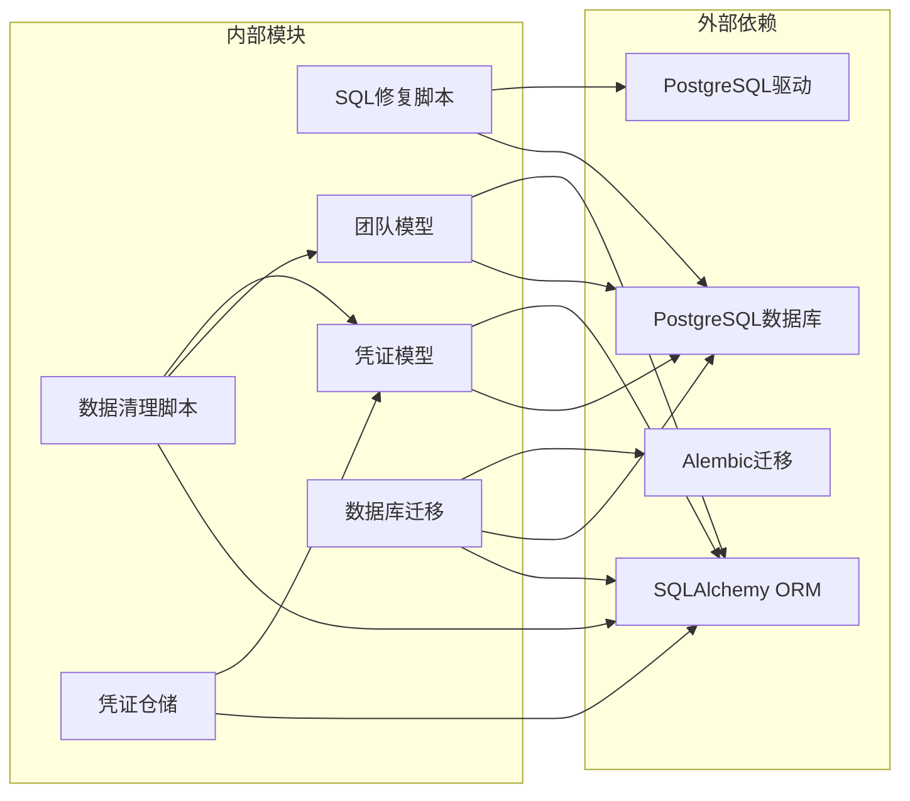

# 凭证创建者ID数据清理

<cite>
**本文档引用的文件**
- [fix_credential_created_by_user_id.py](file://backend/scripts/fix_credential_created_by_user_id.py)
- [20260608_provider_credentials_created_by.py](file://backend/alembic/versions/20260608_provider_credentials_created_by.py)
- [20260608_provider_credentials_created_by.down.sql](file://backend/alembic/sql/20260608_provider_credentials_created_by.down.sql)
- [20260616_fix_credential_created_by_user_id.up.sql](file://backend/alembic/sql/20260616_fix_credential_created_by_user_id.up.sql)
- [20260616_fix_credential_created_by_user_id.down.sql](file://backend/alembic/sql/20260616_fix_credential_created_by_user_id.down.sql)
- [provider_credential.py](file://backend/domains/gateway/infrastructure/models/provider_credential.py)
- [team.py](file://backend/domains/tenancy/infrastructure/models/team.py)
- [credential_repository.py](file://backend/domains/gateway/infrastructure/repositories/credential_repository.py)
- [use-gateway-credential-mutations.ts](file://frontend/src/features/gateway-credentials/hooks/use-gateway-credential-mutations.ts)
- [use-credential-create-flow.tsx](file://frontend/src/features/gateway-credentials/hooks/use-credential-create-flow.tsx)
</cite>

## 更新摘要
**所做更改**
- 新增了20260616_fix_credential_created_by_user_id数据库迁移脚本
- 更新了历史数据清理方案，提供更全面的修复方法
- 增强了保守的回滚策略，避免数据丢失
- 完善了多种修复方法的实现

## 目录
1. [简介](#简介)
2. [项目结构](#项目结构)
3. [核心组件](#核心组件)
4. [架构概览](#架构概览)
5. [详细组件分析](#详细组件分析)
6. [依赖关系分析](#依赖关系分析)
7. [性能考虑](#性能考虑)
8. [故障排除指南](#故障排除指南)
9. [结论](#结论)

## 简介

本文档详细分析了AI代理系统中的凭证创建者ID数据清理功能。该功能旨在解决历史数据中`provider_credentials.created_by_user_id`字段为NULL的问题，通过自动填充创建者信息来确保数据完整性。系统采用渐进式数据迁移策略，既保证现有数据的安全性，又提供完整的回滚机制。

**更新** 新增了20260616_fix_credential_created_by_user_id数据库迁移脚本，提供了更全面的历史数据清理方案。该脚本采用保守的回滚策略，避免在回滚过程中丢失已填充的数据。

该实现涉及后端数据库层、领域模型、仓储模式以及前端用户界面的协同工作，形成了一个完整的数据清理解决方案。通过索引优化和事务处理，确保了大规模数据更新的性能和可靠性。

## 项目结构

系统采用分层架构设计，主要包含以下层次：

**图表来源**
- [fix_credential_created_by_user_id.py:18-68](file://backend/scripts/fix_credential_created_by_user_id.py#L18-L68)
- [provider_credential.py:113-137](file://backend/domains/gateway/infrastructure/models/provider_credential.py#L113-L137)

**章节来源**
- [fix_credential_created_by_user_id.py:1-73](file://backend/scripts/fix_credential_created_by_user_id.py#L1-L73)
- [provider_credential.py:113-137](file://backend/domains/gateway/infrastructure/models/provider_credential.py#L113-L137)

## 核心组件

### 数据清理脚本

数据清理脚本是整个功能的核心执行组件，负责扫描和修复历史数据中的创建者ID缺失问题。

**主要功能特性：**
- 自动检测`created_by_user_id`为NULL的团队凭据记录
- 基于团队成员加入时间确定最早的管理员或成员作为创建者
- 提供详细的进度报告和错误处理机制
- 支持事务性操作确保数据一致性

**数据处理流程：**
1. 查询所有符合条件的历史记录
2. 对每条记录查找对应的团队成员
3. 填充创建者ID并提交事务
4. 生成处理结果报告

**更新** 新增了更完善的错误处理机制，包括团队成员不存在时的警告信息输出。

**章节来源**
- [fix_credential_created_by_user_id.py:18-68](file://backend/scripts/fix_credential_created_by_user_id.py#L18-L68)

### 数据库迁移

Alembic迁移系统提供了结构化的数据库变更管理，包括列添加、索引创建和回滚支持。

**迁移特性：**
- 添加`created_by_user_id`列到`provider_credentials`表
- 创建复合索引以优化查询性能
- 提供安全的回滚机制
- 支持条件索引以提高查询效率

**更新** 新增了20260616_fix_credential_created_by_user_id数据库迁移脚本，提供了更全面的历史数据清理方案。

**章节来源**
- [20260608_provider_credentials_created_by.py:16-32](file://backend/alembic/versions/20260608_provider_credentials_created_by.py#L16-L32)
- [20260608_provider_credentials_created_by.down.sql:1-4](file://backend/alembic/sql/20260608_provider_credentials_created_by.down.sql#L1-L4)

### SQL修复脚本

**新增** 20260616_fix_credential_created_by_user_id SQL脚本提供了直接的数据库级修复能力。

**脚本特性：**
- 直接执行SQL更新操作，无需Python环境
- 基于团队成员关系自动回填创建者ID
- 提供保守的回滚策略，避免数据丢失
- 支持生产环境的手工执行

**修复逻辑：**
- 选择团队中最早加入的管理员或成员作为创建者
- 仅处理`tenant_id`不为空且`scope`为NULL的记录
- 输出修复统计结果

**章节来源**
- [20260616_fix_credential_created_by_user_id.up.sql:10-31](file://backend/alembic/sql/20260616_fix_credential_created_by_user_id.up.sql#L10-L31)
- [20260616_fix_credential_created_by_user_id.down.sql:1-6](file://backend/alembic/sql/20260616_fix_credential_created_by_user_id.down.sql#L1-L6)

### 领域模型

凭证领域模型定义了数据结构和业务规则，包括索引配置和约束条件。

**模型特性：**
- 定义了复合索引以支持高效的查询
- 包含条件索引以优化特定查询场景
- 提供清晰的数据表示和业务语义
- 支持多租户环境下的数据隔离

**章节来源**
- [provider_credential.py:113-137](file://backend/domains/gateway/infrastructure/models/provider_credential.py#L113-L137)

## 架构概览

系统采用分层架构，各层职责明确，协作高效：

**图表来源**
- [fix_credential_created_by_user_id.py:23-68](file://backend/scripts/fix_credential_created_by_user_id.py#L23-L68)
- [20260616_fix_credential_created_by_user_id.up.sql:12-23](file://backend/alembic/sql/20260616_fix_credential_created_by_user_id.up.sql#L12-L23)
- [provider_credential.py:113-137](file://backend/domains/gateway/infrastructure/models/provider_credential.py#L113-L137)

## 详细组件分析

### 数据清理算法

数据清理过程采用了智能的算法来处理历史数据：

**图表来源**
- [fix_credential_created_by_user_id.py:23-68](file://backend/scripts/fix_credential_created_by_user_id.py#L23-L68)
- [20260616_fix_credential_created_by_user_id.up.sql:12-31](file://backend/alembic/sql/20260616_fix_credential_created_by_user_id.up.sql#L12-L31)

### 数据库索引优化

为了支持高效的查询和数据清理操作，系统设计了专门的索引策略：

**图表来源**
- [provider_credential.py:113-137](file://backend/domains/gateway/infrastructure/models/provider_credential.py#L113-L137)
- [credential_repository.py:212-248](file://backend/domains/gateway/infrastructure/repositories/credential_repository.py#L212-L248)

### 前端交互流程

前端界面提供了直观的用户交互体验：

**图表来源**
- [use-gateway-credential-mutations.ts:55-82](file://frontend/src/features/gateway-credentials/hooks/use-gateway-credential-mutations.ts#L55-L82)
- [use-credential-create-flow.tsx:43-57](file://frontend/src/features/gateway-credentials/hooks/use-credential-create-flow.tsx#L43-L57)

**章节来源**
- [use-gateway-credential-mutations.ts:47-82](file://frontend/src/features/gateway-credentials/hooks/use-gateway-credential-mutations.ts#L47-L82)
- [use-credential-create-flow.tsx:43-57](file://frontend/src/features/gateway-credentials/hooks/use-credential-create-flow.tsx#L43-L57)

## 依赖关系分析

系统各组件之间的依赖关系清晰明确：

**图表来源**
- [fix_credential_created_by_user_id.py:13-15](file://backend/scripts/fix_credential_created_by_user_id.py#L13-L15)
- [20260616_fix_credential_created_by_user_id.up.sql:12-23](file://backend/alembic/sql/20260616_fix_credential_created_by_user_id.up.sql#L12-L23)
- [provider_credential.py:113-137](file://backend/domains/gateway/infrastructure/models/provider_credential.py#L113-L137)

**章节来源**
- [fix_credential_created_by_user_id.py:13-15](file://backend/scripts/fix_credential_created_by_user_id.py#L13-L15)
- [provider_credential.py:113-137](file://backend/domains/gateway/infrastructure/models/provider_credential.py#L113-L137)

## 性能考虑

系统在设计时充分考虑了性能优化：

### 查询性能优化
- 复合索引`ix_provider_credentials_tenant_creator`支持高效的团队凭据查询
- 条件索引仅在`tenant_id IS NOT NULL`时生效，减少索引维护开销
- 使用LIMIT 1优化最老成员查找操作

### 数据清理性能
- 异步处理避免阻塞主业务流程
- 分批处理大量数据，减少单次事务锁定时间
- 事务性操作确保数据一致性

### 内存使用优化
- 流式查询处理大量数据记录
- 及时释放数据库连接和资源
- 避免不必要的数据复制

**更新** 新增了SQL脚本的性能考虑，包括直接SQL执行的优势和限制。

## 故障排除指南

### 常见问题及解决方案

**问题1：清理脚本执行失败**
- 检查数据库连接配置
- 验证用户权限是否足够
- 确认目标表是否存在

**问题2：找不到团队成员**
- 验证团队成员表数据完整性
- 检查成员角色字段值
- 确认团队ID匹配正确

**问题3：索引创建失败**
- 检查PostgreSQL版本兼容性
- 验证索引名称唯一性
- 确认表结构符合要求

**问题4：前端界面无响应**
- 检查网络连接状态
- 验证API接口可用性
- 查看浏览器控制台错误信息

**问题5：SQL脚本执行异常**
- 确认PostgreSQL版本支持条件索引
- 检查团队成员关系数据完整性
- 验证SQL语法正确性

**问题6：回滚操作无效**
- 确认使用正确的回滚脚本
- 检查数据库权限设置
- 验证数据备份状态

**章节来源**
- [fix_credential_created_by_user_id.py:64-68](file://backend/scripts/fix_credential_created_by_user_id.py#L64-L68)
- [20260616_fix_credential_created_by_user_id.down.sql:5-6](file://backend/alembic/sql/20260616_fix_credential_created_by_user_id.down.sql#L5-L6)

## 结论

凭证创建者ID数据清理功能展现了现代软件工程的最佳实践：

### 技术成就
- 实现了安全可靠的数据迁移机制
- 提供了完整的回滚支持
- 优化了查询性能和用户体验
- 建立了健壮的错误处理机制
- **新增** 提供了多种修复方法选择

### 架构优势
- 清晰的分层设计便于维护和扩展
- 异步处理提升了系统响应性
- 事务性操作确保数据一致性
- 前后端分离提供了良好的用户体验
- **新增** 支持生产环境的手工执行选项

### 未来改进方向
- 考虑增量式数据清理策略
- 增强监控和告警机制
- 优化大表处理性能
- 扩展支持更多数据类型
- **新增** 完善多环境部署支持

**更新** 该功能的成功实施为类似的数据治理项目提供了宝贵的参考经验，展示了如何在保证数据安全的前提下进行大规模的数据清理和迁移工作。新增的多种修复方法和保守回滚策略进一步增强了系统的可靠性和灵活性。