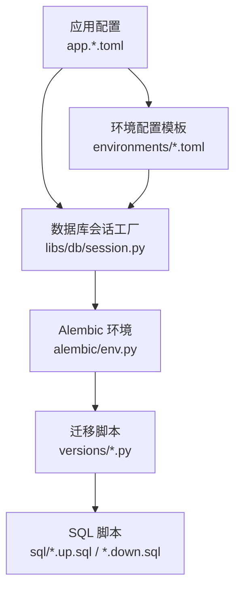
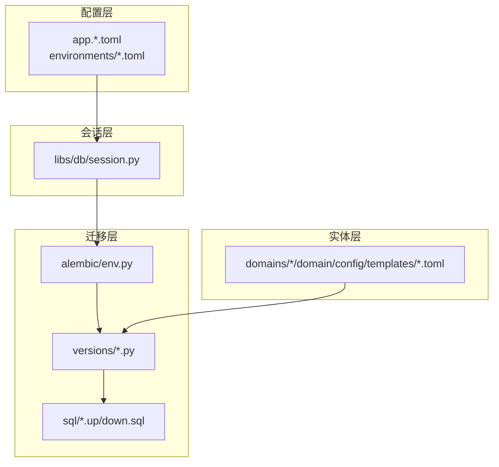
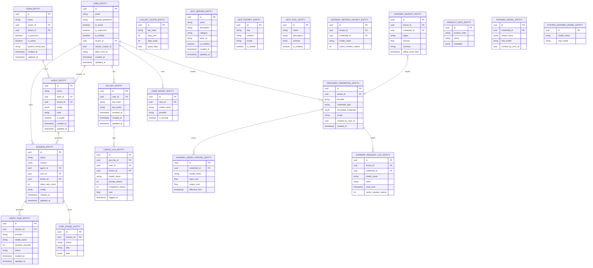
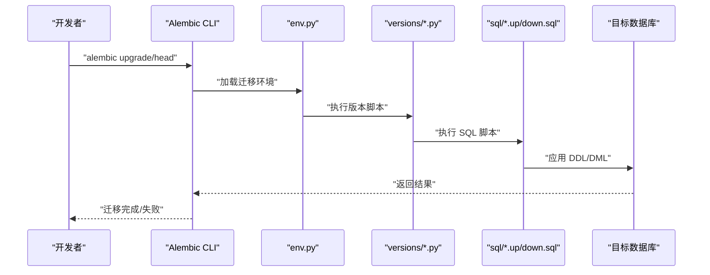
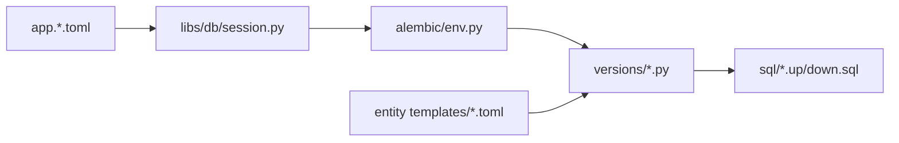

# 数据库设计

<cite>
**本文引用的文件**
- [backend/alembic/env.py](file://backend/alembic/env.py)
- [backend/alembic/script.py.mako](file://backend/alembic/script.py.mako)
- [backend/alembic/versions/001_initial.py](file://backend/alembic/versions/001_initial.py)
- [backend/alembic/sql/001_initial.up.sql](file://backend/alembic/sql/001_initial.up.sql)
- [backend/alembic/sql/001_initial.down.sql](file://backend/alembic/sql/001_initial.down.sql)
- [backend/alembic/versions/002_add_performance_indexes.py](file://backend/alembic/versions/002_add_performance_indexes.py)
- [backend/alembic/sql/002_add_performance_indexes.up.sql](file://backend/alembic/sql/002_add_performance_indexes.up.sql)
- [backend/alembic/sql/002_add_performance_indexes.down.sql](file://backend/alembic/sql/002_add_performance_indexes.down.sql)
- [backend/alembic/versions/003_fix_user_schema.py](file://backend/alembic/versions/003_fix_user_schema.py)
- [backend/alembic/versions/004_fix_timestamp_defaults.py](file://backend/alembic/versions/004_fix_timestamp_defaults.py)
- [backend/alembic/versions/005_add_session_status_and_context.py](file://backend/alembic/versions/005_add_session_status_and_context.py)
- [backend/alembic/versions/006_fix_messages_table.py](file://backend/alembic/versions/006_fix_messages_table.py)
- [backend/alembic/versions/007_add_memory_last_accessed.py](file://backend/alembic/versions/007_add_memory_last_accessed.py)
- [backend/alembic/versions/008_add_langgraph_tables.py](file://backend/alembic/versions/008_add_langgraph_tables.py)
- [backend/alembic/versions/009_add_agent_config_columns.py](file://backend/alembic/versions/009_add_agent_config_columns.py)
- [backend/alembic/versions/010_align_users_for_fastapi_users.py](file://backend/alembic/versions/010_align_users_for_fastapi_users.py)
- [backend/alembic/versions/011_add_anonymous_user_support.py](file://backend/alembic/versions/011_add_anonymous_user_support.py)
- [backend/alembic/versions/20260123_212703_add_config_column_to_sessions.py](file://backend/alembic/versions/20260123_212703_add_config_column_to_sessions.py)
- [backend/alembic/versions/20260127_150000_add_mcp_servers.py](file://backend/alembic/versions/20260127_150000_add_mcp_servers.py)
- [backend/alembic/versions/20260127_160000_add_mcp_connection_status_and_tools.py](file://backend/alembic/versions/20260127_160000_add_mcp_connection_status_and_tools.py)
- [backend/alembic/versions/20260127_170000_add_mcp_description_and_category.py](file://backend/alembic/versions/20260127_170000_add_mcp_description_and_category.py)
- [backend/alembic/versions/20260127_180000_add_api_keys.py](file://backend/alembic/versions/20260127_180000_add_api_keys.py)
- [backend/alembic/versions/20260128_081900_add_updated_at_to_usage_logs.py](file://backend/alembic/versions/20260128_081900_add_updated_at_to_usage_logs.py)
- [backend/alembic/versions/20260128_090000_drop_api_key_foreign_keys.py](file://backend/alembic/versions/20260128_090000_drop_api_key_foreign_keys.py)
- [backend/alembic/versions/20260128_100000_add_llm_key_quota_tables.py](file://backend/alembic/versions/20260128_100000_add_llm_key_quota_tables.py)
- [backend/alembic/versions/20260128_add_encrypted_key.py](file://backend/alembic/versions/20260128_add_encrypted_key.py)
- [backend/alembic/versions/20260129_add_mcp_dynamic_prompts.py](file://backend/alembic/versions/20260129_add_mcp_dynamic_prompts.py)
- [backend/alembic/versions/20260129_add_mcp_dynamic_tools.py](file://backend/alembic/versions/20260129_add_mcp_dynamic_tools.py)
- [backend/alembic/versions/20260129_add_mcp_template_fields.py](file://backend/alembic/versions/20260129_add_mcp_template_fields.py)
- [backend/alembic/versions/20260129_seed_default_mcp_prompts.py](file://backend/alembic/versions/20260129_seed_default_mcp_prompts.py)
- [backend/alembic/versions/20260202_add_video_gen_tasks.py](file://backend/alembic/versions/20260202_add_video_gen_tasks.py)
- [backend/alembic/versions/20260202_agents_tools_jsonb_to_array.py](file://backend/alembic/versions/20260202_agents_tools_jsonb_to_array.py)
- [backend/alembic/versions/20260205_add_session_video_task_count.py](file://backend/alembic/versions/20260205_add_session_video_task_count.py)
- [backend/alembic/versions/20260205_add_user_vendor_creator_id.py](file://backend/alembic/versions/20260205_add_user_vendor_creator_id.py)
- [backend/alembic/versions/20260205_add_video_model_duration.py](file://backend/alembic/versions/20260205_add_video_model_duration.py)
- [backend/alembic/versions/20260209_add_product_info_tables.py](file://backend/alembic/versions/20260209_add_product_info_tables.py)
- [backend/alembic/versions/20260224_add_step_phase_columns.py](file://backend/alembic/versions/20260224_add_step_phase_columns.py)
- [backend/alembic/versions/20260224_add_user_models_table.py](file://backend/alembic/versions/20260224_add_user_models_table.py)
- [backend/alembic/versions/20260508_add_gateway_tables.py](file://backend/alembic/versions/20260508_add_gateway_tables.py)
- [backend/alembic/versions/20260508_add_provider_credentials.py](file://backend/alembic/versions/20260508_add_provider_credentials.py)
- [backend/alembic/versions/20260513_unique_system_vkey_per_team.py](file://backend/alembic/versions/20260513_unique_system_vkey_per_team.py)
- [backend/alembic/versions/20260514_add_model_last_test_reason.py](file://backend/alembic/versions/20260514_add_model_last_test_reason.py)
- [backend/alembic/versions/20260514_add_model_last_test_status.py](file://backend/alembic/versions/20260514_add_model_last_test_status.py)
- [backend/alembic/versions/20260514_drop_studio_workflow_tables.py](file://backend/alembic/versions/20260514_drop_studio_workflow_tables.py)
- [backend/alembic/versions/20260514_gateway_budget_model_name.py](file://backend/alembic/versions/20260514_gateway_budget_model_name.py)
- [backend/alembic/versions/20260514_gateway_log_credential_dim.py](file://backend/alembic/versions/20260514_gateway_log_credential_dim.py)
- [backend/alembic/versions/20260514_gateway_log_deployment_dim.py](file://backend/alembic/versions/20260514_gateway_log_deployment_dim.py)
- [backend/alembic/versions/20260514_unique_active_personal_team_per_owner.py](file://backend/alembic/versions/20260514_unique_active_personal_team_per_owner.py)
- [backend/alembic/versions/20260515_api_key_gateway_grants.py](file://backend/alembic/versions/20260515_api_key_gateway_grants.py)
- [backend/alembic/versions/20260515_drop_gateway_legacy_user_model.py](file://backend/alembic/versions/20260515_drop_gateway_legacy_user_model.py)
- [backend/alembic/versions/20260515_drop_provider_credential_legacy_user_model.py](file://backend/alembic/versions/20260515_drop_provider_credential_legacy_user_model.py)
- [backend/alembic/versions/20260515_drop_user_models.py](file://backend/alembic/versions/20260515_drop_user_models.py)
- [backend/alembic/versions/20260515_gateway_legacy_user_model.py](file://backend/alembic/versions/20260515_gateway_legacy_user_model.py)
- [backend/alembic/versions/20260515_migrate_user_models_data.py](file://backend/alembic/versions/20260515_migrate_user_models_data.py)
- [backend/alembic/versions/20260518_gateway_model_pricing.py](file://backend/alembic/versions/20260518_gateway_model_pricing.py)
- [backend/alembic/versions/20260518_gateway_provider_entitlement_plans.py](file://backend/alembic/versions/20260518_gateway_provider_entitlement_plans.py)
- [backend/alembic/versions/20260519_drop_user_provider_configs.py](file://backend/alembic/versions/20260519_drop_user_provider_configs.py)
- [backend/alembic/versions/20260520_add_system_storage_config.py](file://backend/alembic/versions/20260520_add_system_storage_config.py)
- [backend/alembic/versions/20260520_gateway_request_log_client.py](file://backend/alembic/versions/20260520_gateway_request_log_client.py)
- [backend/alembic/versions/20260520_system_storage_config_single_active.py](file://backend/alembic/versions/20260520_system_storage_config_single_active.py)
- [backend/alembic/versions/20260521_tenant_data_scope.py](file://backend/alembic/versions/20260521_tenant_data_scope.py)
- [backend/alembic/versions/20260522_tenant_phase3.py](file://backend/alembic/versions/20260522_tenant_phase3.py)
- [backend/alembic/versions/20260523_sessions_agents_tenant_id.py](file://backend/alembic/versions/20260523_sessions_agents_tenant_id.py)
- [backend/alembic/versions/20260524_drop_agents_user_id.py](file://backend/alembic/versions/20260524_drop_agents_user_id.py)
- [backend/alembic/versions/20260525_drop_sessions_owner_columns.py](file://backend/alembic/versions/20260525_drop_sessions_owner_columns.py)
- [backend/alembic/versions/20260526_credential_profile_call_shape.py](file://backend/alembic/versions/20260526_credential_profile_call_shape.py)
- [backend/alembic/versions/20260526_provider_credentials_tenant_id.py](file://backend/alembic/versions/20260526_provider_credentials_tenant_id.py)
- [backend/alembic/versions/20260527_193526_merge_gateway_preflight_and_log_heads.py](file://backend/alembic/versions/20260527_193526_merge_gateway_preflight_and_log_heads.py)
- [backend/alembic/versions/20260527_backfill_request_log_provider.py](file://backend/alembic/versions/20260527_backfill_request_log_provider.py)
- [backend/alembic/versions/20260527_credential_api_bases.py](file://backend/alembic/versions/20260527_credential_api_bases.py)
- [backend/alembic/versions/20260527_provider_credentials_scope_nullable.py](file://backend/alembic/versions/20260527_provider_credentials_scope_nullable.py)
- [backend/alembic/versions/20260527_slow_sql_hotpath_indexes.py](file://backend/alembic/versions/20260527_slow_sql_hotpath_indexes.py)
- [backend/alembic/versions/20260528_backfill_request_log_provider_v2.py](file://backend/alembic/versions/20260528_backfill_request_log_provider_v2.py)
- [backend/alembic/versions/20260528_backfill_request_log_user.py](file://backend/alembic/versions/20260528_backfill_request_log_user.py)
- [backend/alembic/versions/20260528_system_gateway_models_credential_fk.py](file://backend/alembic/versions/20260528_system_gateway_models_credential_fk.py)
- [backend/alembic/versions/20260529_gateway_budgets_rename_to_target.py](file://backend/alembic/versions/20260529_gateway_budgets_rename_to_target.py)
- [backend/alembic/versions/20260530_downstream_pricing_scope_tenant.py](file://backend/alembic/versions/20260530_downstream_pricing_scope_tenant.py)
- [backend/alembic/versions/20260531_owned_resources_tenant_id.py](file://backend/alembic/versions/20260531_owned_resources_tenant_id.py)
- [backend/alembic/versions/20260601_drop_legacy_tenant_id_fks.py](file://backend/alembic/versions/20260601_drop_legacy_tenant_id_fks.py)
- [backend/alembic/versions/20260602_drop_all_db_foreign_keys.py](file://backend/alembic/versions/20260602_drop_all_db_foreign_keys.py)
- [backend/alembic/versions/20260603_system_visibility_acl.py](file://backend/alembic/versions/20260603_system_visibility_acl.py)
- [backend/alembic/versions/20260604_api_keys_revoked_at.py](file://backend/alembic/versions/20260604_api_keys_revoked_at.py)
- [backend/alembic/versions/20260605_migrate_system_cred_models.py](file://backend/alembic/versions/20260605_migrate_system_cred_models.py)
- [backend/alembic/versions/20260606_migrate_anonymous_shadow_to_deterministic_tenant.py](file://backend/alembic/versions/20260606_migrate_anonymous_shadow_to_deterministic_tenant.py)
- [backend/alembic/versions/20260607_gateway_preflight_indexes.py](file://backend/alembic/versions/20260607_gateway_preflight_indexes.py)
- [backend/alembic/versions/20260607_gateway_request_log_tenant_route_time.py](file://backend/alembic/versions/20260607_gateway_request_log_tenant_route_time.py)
- [backend/alembic/versions/20260608_provider_credentials_created_by.py](file://backend/alembic/versions/20260608_provider_credentials_created_by.py)
- [backend/alembic/versions/20260609_add_user_giikin_user_id.py](file://backend/alembic/versions/20260609_add_user_giikin_user_id.py)
- [backend/alembic/versions/20260610_delete_unattributed_probe_request_logs.py](file://backend/alembic/versions/20260610_delete_unattributed_probe_request_logs.py)
- [backend/alembic/versions/20260611_gateway_budget_credential.py](file://backend/alembic/versions/20260611_gateway_budget_credential.py)
- [backend/alembic/versions/20260612_gateway_budget_tenant.py](file://backend/alembic/versions/20260612_gateway_budget_tenant.py)
- [backend/alembic/versions/20260613_add_cache_creation_tokens.py](file://backend/alembic/versions/20260613_add_cache_creation_tokens.py)
- [backend/alembic/versions/20260614_gateway_models_created_by_user_id.py](file://backend/alembic/versions/20260614_gateway_models_created_by_user_id.py)
- [backend/alembic/versions/20260614_normalize_openai_real_model_prefix.py](file://backend/alembic/versions/20260614_normalize_openai_real_model_prefix.py)
- [backend/alembic/versions/20260615_gateway_budget_tenant_backfill.py](file://backend/alembic/versions/20260615_gateway_budget_tenant_backfill.py)
- [backend/alembic/versions/20260616_downstream_pricing_partial_index.py](file://backend/alembic/versions/20260616_downstream_pricing_partial_index.py)
- [backend/alembic/versions/20260616_fix_credential_created_by_user_id.py](file://backend/alembic/versions/20260616_fix_credential_created_by_user_id.py)
- [backend/alembic/sql/20260616_fix_credential_created_by_user_id.up.sql](file://backend/alembic/sql/20260616_fix_credential_created_by_user_id.up.sql)
- [backend/alembic/sql/20260616_fix_credential_created_by_user_id.down.sql](file://backend/alembic/sql/20260616_fix_credential_created_by_user_id.down.sql)
- [backend/scripts/fix_credential_created_by_user_id.py](file://backend/scripts/fix_credential_created_by_user_id.py)
- [backend/alembic/ops_sql_export.py](file://backend/alembic/ops_sql_export.py)
- [backend/alembic/sql_util.py](file://backend/alembic/sql_util.py)
- [backend/libs/db/__init__.py](file://backend/libs/db/__init__.py)
- [backend/libs/db/session.py](file://backend/libs/db/session.py)
- [backend/bootstrap/config.py](file://backend/bootstrap/config.py)
- [backend/config/environments/local-dev.toml](file://backend/config/environments/local-dev.toml)
- [backend/config/environments/docker-dev.toml](file://backend/config/environments/docker-dev.toml)
- [backend/config/environments/docker-prod.toml](file://backend/config/environments/docker-prod.toml)
- [backend/config/environments/k8s-prod.toml](file://backend/config/environments/k8s-prod.toml)
- [backend/config/app.toml](file://backend/config/app.toml)
- [backend/config/app.development.toml](file://backend/config/app.development.toml)
- [backend/config/app.production.toml](file://backend/config/app.production.toml)
- [backend/config/app.staging.toml](file://backend/config/app.staging.toml)
- [backend/config/execution.toml](file://backend/config/execution.toml)
- [backend/config/litellm_models.yaml](file://backend/config/litellm_models.yaml)
- [backend/config/mcp.toml](file://backend/config/mcp.toml)
- [backend/config/tools.toml](file://backend/config/tools.toml)
- [backend/domains/identity/domain/config/templates/user_entity.toml](file://backend/domains/identity/domain/config/templates/user_entity.toml)
- [backend/domains/identity/domain/config/templates/team_entity.toml](file://backend/domains/identity/domain/config/templates/team_entity.toml)
- [backend/domains/agent/domain/config/templates/agent_entity.toml](file://backend/domains/agent/domain/config/templates/agent_entity.toml)
- [backend/domains/session/domain/config/templates/session_entity.toml](file://backend/domains/session/domain/config/templates/session_entity.toml)
- [backend/docs/CONFIGURATION.md](file://backend/docs/CONFIGURATION.md)
- [backend/docs/ARCHITECTURE.md](file://backend/docs/ARCHITECTURE.md)
- [backend/docs/AUTHENTICATION.md](file://backend/docs/AUTHENTICATION.md)
- [backend/scripts/generate_alembic_sql_files.py](file://backend/scripts/generate_alembic_sql_files.py)
- [backend/scripts/migrate_test_db.py](file://backend/scripts/migrate_test_db.py)
- [backend/scripts/run_dev_server.py](file://backend/scripts/run_dev_server.py)
- [backend/scripts/run_server.py](file://backend/scripts/run_server.py)
- [backend/deploy/backend.env.production](file://backend/deploy/backend.env.production)
- [backend/docker-compose.yml](file://backend/docker-compose.yml)
- [backend/docker-compose.prod.yml](file://backend/docker-compose.prod.yml)
</cite>

## 目录
1. [简介](#简介)
2. [项目结构](#项目结构)
3. [核心组件](#核心组件)
4. [架构总览](#架构总览)
5. [详细组件分析](#详细组件分析)
6. [依赖分析](#依赖分析)
7. [性能考虑](#性能考虑)
8. [故障排查指南](#故障排查指南)
9. [结论](#结论)
10. [附录](#附录)

## 简介
本文件为 AI Agent 项目的数据库设计与迁移管理文档，聚焦于核心实体（AgentEntity、SessionEntity、UserEntity、TeamEntity）的 ER 模型、表结构与字段设计、主外键与索引约束、迁移机制（Alembic）、多环境配置、数据访问与缓存策略、数据生命周期与安全合规、以及监控与备份恢复最佳实践。内容基于仓库中 Alembic 迁移脚本、SQL 文件、配置模板与应用配置进行归纳总结。

## 项目结构
数据库相关的核心位置如下：
- Alembic 迁移与 SQL：backend/alembic/versions 与 backend/alembic/sql
- 配置与环境：backend/config 与 backend/config/environments
- 应用启动与会话：backend/bootstrap、backend/libs/db
- 实体配置模板：backend/domains/*/domain/config/templates/*.toml
- 文档与脚本：backend/docs、backend/scripts

图表来源
- [backend/libs/db/session.py](file://backend/libs/db/session.py)
- [backend/alembic/env.py](file://backend/alembic/env.py)
- [backend/alembic/versions/001_initial.py](file://backend/alembic/versions/001_initial.py)
- [backend/alembic/sql/001_initial.up.sql](file://backend/alembic/sql/001_initial.up.sql)
- [backend/config/app.toml](file://backend/config/app.toml)
- [backend/config/environments/local-dev.toml](file://backend/config/environments/local-dev.toml)

章节来源
- [backend/libs/db/session.py](file://backend/libs/db/session.py)
- [backend/alembic/env.py](file://backend/alembic/env.py)
- [backend/config/app.toml](file://backend/config/app.toml)
- [backend/config/environments/local-dev.toml](file://backend/config/environments/local-dev.toml)

## 核心组件
本节概述数据库层的关键组成与职责：
- 连接与会话：通过会话工厂创建 SQLAlchemy 引擎与会话，支持多环境配置切换。
- 迁移与版本：Alembic 管理数据库演进，按版本脚本逐步升级/降级。
- 实体与模板：各领域实体（Agent、Session、User、Team）以 TOML 模板形式定义字段与约束。
- 环境配置：本地、Docker、K8s、生产等环境的数据库连接参数与特性差异。
- 性能与安全：索引、分区、加密、审计日志、租户隔离与访问控制。

章节来源
- [backend/libs/db/session.py](file://backend/libs/db/session.py)
- [backend/alembic/env.py](file://backend/alembic/env.py)
- [backend/alembic/versions/001_initial.py](file://backend/alembic/versions/001_initial.py)
- [backend/config/app.toml](file://backend/config/app.toml)
- [backend/config/environments/docker-dev.toml](file://backend/config/environments/docker-dev.toml)
- [backend/config/environments/k8s-prod.toml](file://backend/config/environments/k8s-prod.toml)

## 架构总览
数据库层采用"配置驱动 + 迁移驱动"的架构：
- 配置驱动：应用在不同环境加载不同的数据库连接参数与特性开关。
- 迁移驱动：Alembic 将数据库演进抽象为可追踪的版本化脚本，确保团队协作与回滚可控。
- 实体驱动：各领域实体通过模板定义数据结构，迁移脚本据此生成或变更表结构。

图表来源
- [backend/config/app.toml](file://backend/config/app.toml)
- [backend/config/environments/docker-prod.toml](file://backend/config/environments/docker-prod.toml)
- [backend/libs/db/session.py](file://backend/libs/db/session.py)
- [backend/alembic/env.py](file://backend/alembic/env.py)
- [backend/alembic/versions/001_initial.py](file://backend/alembic/versions/001_initial.py)
- [backend/alembic/sql/001_initial.up.sql](file://backend/alembic/sql/001_initial.up.sql)
- [backend/domains/agent/domain/config/templates/agent_entity.toml](file://backend/domains/agent/domain/config/templates/agent_entity.toml)

## 详细组件分析

### 实体关系模型（ER）
基于迁移脚本与模板，核心实体及关系如下：
- UserEntity：用户主体，支持匿名用户、供应商标识、GIIKIN 用户 ID 等扩展字段。
- TeamEntity：团队实体，支持系统级唯一虚拟密钥、个人团队唯一激活约束、租户范围等。
- AgentEntity：智能体实体，包含配置列、工具数组化、LangGraph 表等。
- SessionEntity：会话实体，包含状态、上下文、视频任务计数、配置列等。
- Gateway 与 Provider Credentials：网关预算、定价、凭据、请求日志等，支持多租户维度与审计。
- API Keys 与配额：API Key、使用日志、LLM Key 配额表，支持加密存储与撤销时间。
- MCP（Model Context Protocol）：服务器、动态提示、动态工具、模板字段、默认提示种子等。
- 视频生成任务：视频任务表、模型时长、供应商创建者等。
- 产品信息与步骤阶段：产品信息表、步骤阶段列，支撑工作流与 Studio 功能。
- 存储与缓存：系统存储配置、缓存创建令牌等。

**更新** 新增了20260616_fix_credential_created_by_user_id迁移脚本，修复凭据创建者字段的数据一致性问题，包括SQL实现逻辑、回滚策略和性能考虑

图表来源
- [backend/alembic/versions/001_initial.py](file://backend/alembic/versions/001_initial.py)
- [backend/alembic/versions/008_add_langgraph_tables.py](file://backend/alembic/versions/008_add_langgraph_tables.py)
- [backend/alembic/versions/009_add_agent_config_columns.py](file://backend/alembic/versions/009_add_agent_config_columns.py)
- [backend/alembic/versions/010_align_users_for_fastapi_users.py](file://backend/alembic/versions/010_align_users_for_fastapi_users.py)
- [backend/alembic/versions/20260127_180000_add_api_keys.py](file://backend/alembic/versions/20260127_180000_add_api_keys.py)
- [backend/alembic/versions/20260128_100000_add_llm_key_quota_tables.py](file://backend/alembic/versions/20260128_100000_add_llm_key_quota_tables.py)
- [backend/alembic/versions/20260129_add_mcp_dynamic_prompts.py](file://backend/alembic/versions/20260129_add_mcp_dynamic_prompts.py)
- [backend/alembic/versions/20260202_add_video_gen_tasks.py](file://backend/alembic/versions/20260202_add_video_gen_tasks.py)
- [backend/alembic/versions/20260209_add_product_info_tables.py](file://backend/alembic/versions/20260209_add_product_info_tables.py)
- [backend/alembic/versions/20260224_add_step_phase_columns.py](file://backend/alembic/versions/20260224_add_step_phase_columns.py)
- [backend/alembic/versions/20260508_add_gateway_tables.py](file://backend/alembic/versions/20260508_add_gateway_tables.py)
- [backend/alembic/versions/20260513_unique_system_vkey_per_team.py](file://backend/alembic/versions/20260513_unique_system_vkey_per_team.py)
- [backend/alembic/versions/20260514_gateway_log_credential_dim.py](file://backend/alembic/versions/20260514_gateway_log_credential_dim.py)
- [backend/alembic/versions/20260515_api_key_gateway_grants.py](file://backend/alembic/versions/20260515_api_key_gateway_grants.py)
- [backend/alembic/versions/20260518_gateway_model_pricing.py](file://backend/alembic/versions/20260518_gateway_model_pricing.py)
- [backend/alembic/versions/20260520_system_storage_config_single_active.py](file://backend/alembic/versions/20260520_system_storage_config_single_active.py)
- [backend/alembic/versions/20260523_sessions_agents_tenant_id.py](file://backend/alembic/versions/20260523_sessions_agents_tenant_id.py)
- [backend/alembic/versions/20260526_provider_credentials_tenant_id.py](file://backend/alembic/versions/20260526_provider_credentials_tenant_id.py)
- [backend/alembic/versions/20260603_system_visibility_acl.py](file://backend/alembic/versions/20260603_system_visibility_acl.py)
- [backend/alembic/versions/20260607_gateway_preflight_indexes.py](file://backend/alembic/versions/20260607_gateway_preflight_indexes.py)
- [backend/alembic/versions/20260613_add_cache_creation_tokens.py](file://backend/alembic/versions/20260613_add_cache_creation_tokens.py)
- [backend/alembic/versions/20260614_gateway_models_created_by_user_id.py](file://backend/alembic/versions/20260614_gateway_models_created_by_user_id.py)
- [backend/alembic/versions/20260614_normalize_openai_real_model_prefix.py](file://backend/alembic/versions/20260614_normalize_openai_real_model_prefix.py)
- [backend/alembic/versions/20260615_gateway_budget_tenant_backfill.py](file://backend/alembic/versions/20260615_gateway_budget_tenant_backfill.py)
- [backend/alembic/versions/20260616_fix_credential_created_by_user_id.py](file://backend/alembic/versions/20260616_fix_credential_created_by_user_id.py)

章节来源
- [backend/domains/identity/domain/config/templates/user_entity.toml](file://backend/domains/identity/domain/config/templates/user_entity.toml)
- [backend/domains/identity/domain/config/templates/team_entity.toml](file://backend/domains/identity/domain/config/templates/team_entity.toml)
- [backend/domains/agent/domain/config/templates/agent_entity.toml](file://backend/domains/agent/domain/config/templates/agent_entity.toml)
- [backend/domains/session/domain/config/templates/session_entity.toml](file://backend/domains/session/domain/config/templates/session_entity.toml)

### 字段定义与数据类型选择
- 主键：统一使用 UUID 类型，保证分布式场景下唯一性与安全性。
- 时间戳：created_at、updated_at 使用 timestamp，部分表含默认值与自动更新逻辑。
- JSON/JSONB：config、context、schema、metadata 等采用 JSON/JSONB，便于灵活扩展与查询。
- 加密：敏感凭据采用加密存储，配合密钥管理与撤销机制。
- 枚举/字符串：status、provider、model_name 等使用字符串或枚举约束，配合校验与索引。
- 数值：tokens、cost、duration_seconds 等使用整数或浮点数，便于统计与成本核算。
- **新增字段**：cache_creation_tokens（整数类型，用于缓存创建令牌统计）、created_by_user_id（UUID类型，用于记录模型创建者）、修复后的凭据创建者字段（确保数据一致性）

章节来源
- [backend/alembic/versions/001_initial.py](file://backend/alembic/versions/001_initial.py)
- [backend/alembic/versions/20260128_100000_add_llm_key_quota_tables.py](file://backend/alembic/versions/20260128_100000_add_llm_key_quota_tables.py)
- [backend/alembic/versions/20260202_add_video_gen_tasks.py](file://backend/alembic/versions/20260202_add_video_gen_tasks.py)
- [backend/alembic/versions/20260518_gateway_model_pricing.py](file://backend/alembic/versions/20260518_gateway_model_pricing.py)
- [backend/alembic/versions/20260613_add_cache_creation_tokens.py](file://backend/alembic/versions/20260613_add_cache_creation_tokens.py)
- [backend/alembic/versions/20260614_gateway_models_created_by_user_id.py](file://backend/alembic/versions/20260614_gateway_models_created_by_user_id.py)
- [backend/alembic/versions/20260616_fix_credential_created_by_user_id.py](file://backend/alembic/versions/20260616_fix_credential_created_by_user_id.py)

### 主键、外键、索引与约束
- 主键：UUID 统一作为主键，确保全局唯一。
- 外键：team_id、user_id、agent_id、tenant_id 等广泛存在，形成清晰的层级关系。
- 约束：系统虚拟密钥唯一、个人团队唯一激活、租户维度唯一性等。
- 索引：针对热点查询（如 tenant_id、credential_id、user_id、model_name）建立索引，提升性能。
- 默认值与触发器：部分表对时间戳设置默认值与自动更新，减少应用侧逻辑。
- **新增索引**：gateway_models 表的 created_by_user_id 索引，用于快速查找特定用户的模型；修复凭据创建者字段的一致性约束。

章节来源
- [backend/alembic/versions/001_initial.py](file://backend/alembic/versions/001_initial.py)
- [backend/alembic/versions/002_add_performance_indexes.py](file://backend/alembic/versions/002_add_performance_indexes.py)
- [backend/alembic/versions/005_add_session_status_and_context.py](file://backend/alembic/versions/005_add_session_status_and_context.py)
- [backend/alembic/versions/20260513_unique_system_vkey_per_team.py](file://backend/alembic/versions/20260513_unique_system_vkey_per_team.py)
- [backend/alembic/versions/20260514_unique_active_personal_team_per_owner.py](file://backend/alembic/versions/20260514_unique_active_personal_team_per_owner.py)
- [backend/alembic/versions/20260527_slow_sql_hotpath_indexes.py](file://backend/alembic/versions/20260527_slow_sql_hotpath_indexes.py)
- [backend/alembic/versions/20260614_gateway_models_created_by_user_id.py](file://backend/alembic/versions/20260614_gateway_models_created_by_user_id.py)
- [backend/alembic/versions/20260616_fix_credential_created_by_user_id.py](file://backend/alembic/versions/20260616_fix_credential_created_by_user_id.py)

### 数据库迁移管理机制（Alembic）
- 版本化：每个迁移脚本对应一个版本号，包含 up/down 两部分，确保可逆演进。
- 脚本类型：Python 版本脚本与 SQL 文件并行维护，便于复杂 DDL 与数据回填。
- 环境集成：env.py 与 script.mako 提供模板与运行时配置，支持多环境迁移。
- 导出与验证：ops_sql_export.py 用于导出 SQL，generate_alembic_sql_files.py 生成 SQL 文件，migrate_test_db.py 用于测试迁移。

图表来源
- [backend/alembic/env.py](file://backend/alembic/env.py)
- [backend/alembic/script.py.mako](file://backend/alembic/script.py.mako)
- [backend/alembic/versions/001_initial.py](file://backend/alembic/versions/001_initial.py)
- [backend/alembic/sql/001_initial.up.sql](file://backend/alembic/sql/001_initial.up.sql)
- [backend/alembic/ops_sql_export.py](file://backend/alembic/ops_sql_export.py)

章节来源
- [backend/alembic/env.py](file://backend/alembic/env.py)
- [backend/alembic/script.py.mako](file://backend/alembic/script.py.mako)
- [backend/alembic/versions/001_initial.py](file://backend/alembic/versions/001_initial.py)
- [backend/alembic/sql/001_initial.up.sql](file://backend/alembic/sql/001_initial.up.sql)
- [backend/alembic/versions/002_add_performance_indexes.py](file://backend/alembic/versions/002_add_performance_indexes.py)
- [backend/alembic/sql/002_add_performance_indexes.up.sql](file://backend/alembic/sql/002_add_performance_indexes.up.sql)
- [backend/alembic/ops_sql_export.py](file://backend/alembic/ops_sql_export.py)
- [backend/scripts/generate_alembic_sql_files.py](file://backend/scripts/generate_alembic_sql_files.py)
- [backend/scripts/migrate_test_db.py](file://backend/scripts/migrate_test_db.py)

### 不同环境下的数据库配置差异与处理策略
- 本地开发（local-dev.toml）：轻量配置，适合快速迭代；可启用调试日志与简化索引。
- Docker 开发（docker-dev.toml）：容器化环境，连接参数与卷挂载需与 compose 文件一致。
- Docker 生产（docker-prod.toml）：连接池、超时、SSL 参数等生产级配置。
- K8s 生产（k8s-prod.toml）：Secret 注入、服务发现、网络策略等。
- 应用配置（app.*.toml）：统一入口，覆盖数据库连接、迁移开关、功能开关等。
- 处理策略：通过环境变量与配置模板合并，确保同一套迁移脚本在不同环境正确执行。

章节来源
- [backend/config/environments/local-dev.toml](file://backend/config/environments/local-dev.toml)
- [backend/config/environments/docker-dev.toml](file://backend/config/environments/docker-dev.toml)
- [backend/config/environments/docker-prod.toml](file://backend/config/environments/docker-prod.toml)
- [backend/config/environments/k8s-prod.toml](file://backend/config/environments/k8s-prod.toml)
- [backend/config/app.toml](file://backend/config/app.toml)
- [backend/config/app.development.toml](file://backend/config/app.development.toml)
- [backend/config/app.production.toml](file://backend/config/app.production.toml)
- [backend/config/app.staging.toml](file://backend/config/app.staging.toml)

### 数据访问模式、缓存策略与性能优化
- 访问模式：通过会话工厂获取会话，按领域分层（application/infrastructure/domain）组织查询。
- 缓存：系统存储配置与缓存创建令牌等，结合 TTL 与失效策略。
- 性能优化：热点字段建索引、批量写入、只读副本、查询计划分析、慢查询日志。
- 租户隔离：所有关键表均带 tenant_id，确保数据隔离与审计。

章节来源
- [backend/libs/db/session.py](file://backend/libs/db/session.py)
- [backend/alembic/versions/20260520_system_storage_config_single_active.py](file://backend/alembic/versions/20260520_system_storage_config_single_active.py)
- [backend/alembic/versions/20260613_add_cache_creation_tokens.py](file://backend/alembic/versions/20260613_add_cache_creation_tokens.py)
- [backend/alembic/versions/20260527_slow_sql_hotpath_indexes.py](file://backend/alembic/versions/20260527_slow_sql_hotpath_indexes.py)

### 数据生命周期管理、保留策略与归档规则
- 生命周期：API Key 支持撤销时间；视频任务、会话、使用日志等按业务需要设定保留期。
- 保留策略：根据成本与合规要求设定日志与任务保留周期，到期清理。
- 归档规则：高基数维度（如请求日志）可按时间分区或归档到冷存储，降低热数据压力。

章节来源
- [backend/alembic/versions/20260604_api_keys_revoked_at.py](file://backend/alembic/versions/20260604_api_keys_revoked_at.py)
- [backend/alembic/versions/20260202_add_video_gen_tasks.py](file://backend/alembic/versions/20260202_add_video_gen_tasks.py)
- [backend/alembic/versions/20260527_backfill_request_log_provider_v2.py](file://backend/alembic/versions/20260527_backfill_request_log_provider_v2.py)

### 数据安全、隐私要求与访问控制
- 加密：凭据与敏感字段加密存储，密钥轮换与审计。
- 访问控制：系统可见性 ACL、租户维度权限、API Key 授权与配额限制。
- 审计：请求日志、使用日志记录关键操作与成本，支持追溯。
- 合规：根据地区法规设定数据最小化、删除权与跨境传输限制。

章节来源
- [backend/alembic/versions/20260128_100000_add_llm_key_quota_tables.py](file://backend/alembic/versions/20260128_100000_add_llm_key_quota_tables.py)
- [backend/alembic/versions/20260603_system_visibility_acl.py](file://backend/alembic/versions/20260603_system_visibility_acl.py)
- [backend/alembic/versions/20260515_api_key_gateway_grants.py](file://backend/alembic/versions/20260515_api_key_gateway_grants.py)
- [backend/alembic/versions/20260514_gateway_log_credential_dim.py](file://backend/alembic/versions/20260514_gateway_log_credential_dim.py)

### 数据迁移路径与版本管理策略
- 升级路径：从初始版本逐步升级，确保中间态数据一致性与回滚能力。
- 版本策略：语义化版本命名（如 20260613_...），避免冲突；复杂变更拆分为多个小版本。
- 回滚策略：down 脚本与数据回填，必要时使用备份恢复。
- 并行演进：SQL 与 Python 脚本并行维护，确保复杂 DDL 的可重复执行。

章节来源
- [backend/alembic/versions/001_initial.py](file://backend/alembic/versions/001_initial.py)
- [backend/alembic/sql/001_initial.down.sql](file://backend/alembic/sql/001_initial.down.sql)
- [backend/alembic/versions/20260527_193526_merge_gateway_preflight_and_log_heads.py](file://backend/alembic/versions/20260527_193526_merge_gateway_preflight_and_log_heads.py)

### 数据库监控、备份与恢复最佳实践
- 监控：慢查询日志、索引命中率、连接数与锁等待；结合 APM 与日志聚合。
- 备份：定期全量与增量备份，验证恢复流程；敏感数据脱敏。
- 恢复：最小化 RTO/RPO，自动化演练；迁移前先在测试环境验证。

章节来源
- [backend/alembic/versions/20260527_slow_sql_hotpath_indexes.py](file://backend/alembic/versions/20260527_slow_sql_hotpath_indexes.py)
- [backend/scripts/migrate_test_db.py](file://backend/scripts/migrate_test_db.py)

## 依赖分析
数据库层依赖关系如下：
- 配置层依赖会话工厂，决定连接参数与特性。
- 会话工厂依赖 Alembic 环境，确保迁移上下文正确。
- 迁移脚本依赖 SQL 文件与模板，确保 DDL/DML 可重复执行。
- 实体模板驱动迁移脚本生成，保证结构一致性。

图表来源
- [backend/config/app.production.toml](file://backend/config/app.production.toml)
- [backend/libs/db/session.py](file://backend/libs/db/session.py)
- [backend/alembic/env.py](file://backend/alembic/env.py)
- [backend/alembic/versions/001_initial.py](file://backend/alembic/versions/001_initial.py)
- [backend/alembic/sql/001_initial.up.sql](file://backend/alembic/sql/001_initial.up.sql)
- [backend/domains/agent/domain/config/templates/agent_entity.toml](file://backend/domains/agent/domain/config/templates/agent_entity.toml)

章节来源
- [backend/config/app.development.toml](file://backend/config/app.development.toml)
- [backend/config/app.production.toml](file://backend/config/app.production.toml)
- [backend/libs/db/session.py](file://backend/libs/db/session.py)
- [backend/alembic/env.py](file://backend/alembic/env.py)
- [backend/alembic/versions/001_initial.py](file://backend/alembic/versions/001_initial.py)
- [backend/alembic/sql/001_initial.up.sql](file://backend/alembic/sql/001_initial.up.sql)
- [backend/domains/agent/domain/config/templates/agent_entity.toml](file://backend/domains/agent/domain/config/templates/agent_entity.toml)

## 性能考虑
- 热点查询优化：为 tenant_id、credential_id、user_id、model_name 建立复合索引与单列索引。
- 写入优化：批量插入、异步写入、分区表（按时间）。
- 读放大控制：合理使用 JSON/JSONB 查询条件，避免全表扫描。
- 连接池：生产环境配置连接池大小与超时，避免资源枯竭。
- 监控与调优：结合慢查询日志与执行计划，持续优化索引与查询。

章节来源
- [backend/alembic/versions/002_add_performance_indexes.py](file://backend/alembic/versions/002_add_performance_indexes.py)
- [backend/alembic/sql/002_add_performance_indexes.up.sql](file://backend/alembic/sql/002_add_performance_indexes.up.sql)
- [backend/alembic/versions/20260527_slow_sql_hotpath_indexes.py](file://backend/alembic/versions/20260527_slow_sql_hotpath_indexes.py)

## 故障排查指南
- 迁移失败：检查版本脚本与 SQL 是否匹配，确认 down 脚本是否完整回滚。
- 连接问题：核对环境配置与连接串，检查网络与证书。
- 性能问题：分析慢查询日志，评估索引与查询计划。
- 数据不一致：核对回填脚本与默认值，必要时手动修复后重新迁移。

章节来源
- [backend/alembic/versions/001_initial.py](file://backend/alembic/versions/001_initial.py)
- [backend/alembic/sql/001_initial.down.sql](file://backend/alembic/sql/001_initial.down.sql)
- [backend/scripts/migrate_test_db.py](file://backend/scripts/migrate_test_db.py)

## 结论
本设计以实体模板驱动结构演进，借助 Alembic 实现可控的版本化迁移，并通过多环境配置与租户隔离满足生产级可用性与合规要求。性能方面通过索引与查询优化保障高并发场景稳定运行，安全方面通过加密、ACL 与审计日志实现端到端保护。新增的缓存创建令牌统计、模型创建者追踪、OpenAI提供商前缀规范化、网关预算租户回填以及凭据创建者字段修复等功能进一步增强了系统的可观测性、可管理性和数据一致性。建议持续完善监控与备份体系，确保系统长期稳健运行。

## 附录
- 配置参考：应用配置与环境配置模板位于 backend/config 与 backend/config/environments。
- 运行脚本：迁移与测试脚本位于 backend/scripts。
- 部署环境：Docker 与 K8s 配置位于 backend/docker-compose.yml 与 backend/docker-compose.prod.yml。

章节来源
- [backend/config/app.toml](file://backend/config/app.toml)
- [backend/config/environments/docker-dev.toml](file://backend/config/environments/docker-dev.toml)
- [backend/config/environments/k8s-prod.toml](file://backend/config/environments/k8s-prod.toml)
- [backend/scripts/run_dev_server.py](file://backend/scripts/run_dev_server.py)
- [backend/scripts/run_server.py](file://backend/scripts/run_server.py)
- [backend/docker-compose.yml](file://backend/docker-compose.yml)
- [backend/docker-compose.prod.yml](file://backend/docker-compose.prod.yml)