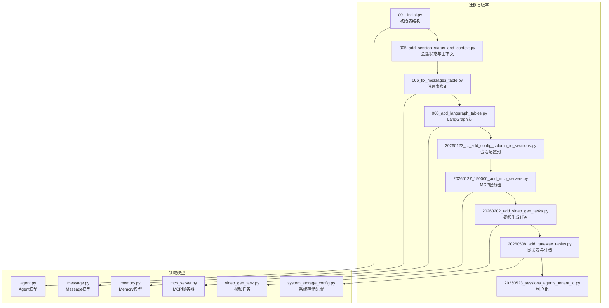
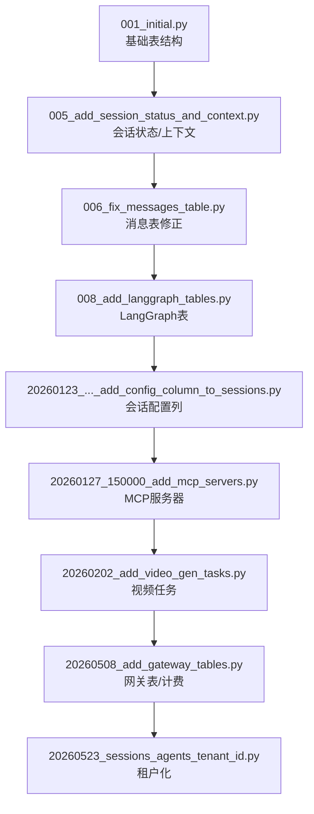
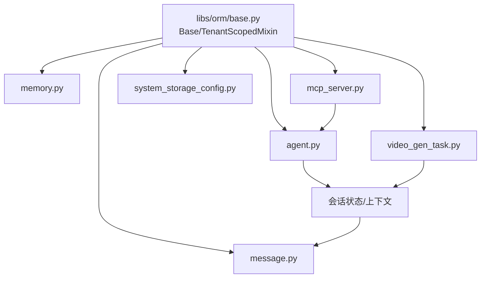
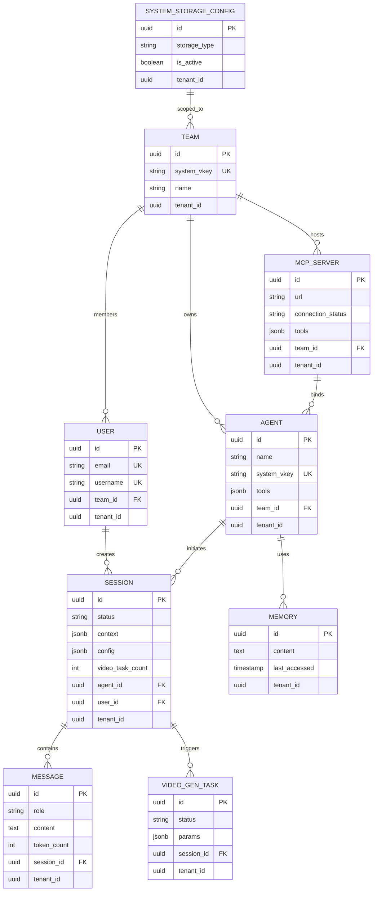
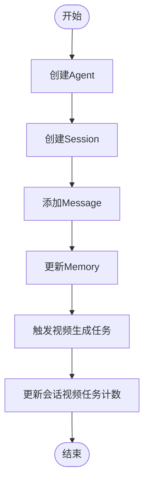

# 数据模型设计

<cite>
**本文引用的文件**
- [backend/alembic/env.py](file://backend/alembic/env.py)
- [backend/alembic/versions/001_initial.py](file://backend/alembic/versions/001_initial.py)
- [backend/alembic/versions/005_add_session_status_and_context.py](file://backend/alembic/versions/005_add_session_status_and_context.py)
- [backend/alembic/versions/006_fix_messages_table.py](file://backend/alembic/versions/006_fix_messages_table.py)
- [backend/alembic/versions/008_add_langgraph_tables.py](file://backend/alembic/versions/008_add_langgraph_tables.py)
- [backend/alembic/versions/20260123_212703_add_config_column_to_sessions.py](file://backend/alembic/versions/20260123_212703_add_config_column_to_sessions.py)
- [backend/alembic/versions/20260127_150000_add_mcp_servers.py](file://backend/alembic/versions/20260127_150000_add_mcp_servers.py)
- [backend/alembic/versions/20260127_160000_add_mcp_connection_status_and_tools.py](file://backend/alembic/versions/20260127_160000_add_mcp_connection_status_and_tools.py)
- [backend/alembic/versions/20260127_170000_add_mcp_description_and_category.py](file://backend/alembic/versions/20260127_170000_add_mcp_description_and_category.py)
- [backend/alembic/versions/20260127_180000_add_api_keys.py](file://backend/alembic/versions/20260127_180000_add_api_keys.py)
- [backend/alembic/versions/20260202_add_video_gen_tasks.py](file://backend/alembic/versions/20260202_add_video_gen_tasks.py)
- [backend/alembic/versions/20260202_agents_tools_jsonb_to_array.py](file://backend/alembic/versions/20260202_agents_tools_jsonb_to_array.py)
- [backend/alembic/versions/20260205_add_session_video_task_count.py](file://backend/alembic/versions/20260205_add_session_video_task_count.py)
- [backend/alembic/versions/20260508_add_gateway_tables.py](file://backend/alembic/versions/20260508_add_gateway_tables.py)
- [backend/alembic/versions/20260513_unique_system_vkey_per_team.py](file://backend/alembic/versions/20260513_unique_system_vkey_per_team.py)
- [backend/alembic/versions/20260514_add_model_last_test_reason.py](file://backend/alembic/versions/20260514_add_model_last_test_reason.py)
- [backend/alembic/versions/20260514_add_model_last_test_status.py](file://backend/alembic/versions/20260514_add_model_last_test_status.py)
- [backend/alembic/versions/20260518_gateway_model_pricing.py](file://backend/alembic/versions/20260518_gateway_model_pricing.py)
- [backend/alembic/versions/20260523_sessions_agents_tenant_id.py](file://backend/alembic/versions/20260523_sessions_agents_tenant_id.py)
- [backend/alembic/versions/20260524_drop_agents_user_id.py](file://backend/alembic/versions/20260524_drop_agents_user_id.py)
- [backend/alembic/versions/20260525_drop_sessions_owner_columns.py](file://backend/alembic/versions/20260525_drop_sessions_owner_columns.py)
- [backend/alembic/versions/20260527_193526_merge_gateway_preflight_and_log_heads.py](file://backend/alembic/versions/20260527_193526_merge_gateway_preflight_and_log_heads.py)
- [backend/alembic/versions/20260528_backfill_request_log_provider_v2.py](file://backend/alembic/versions/20260528_backfill_request_log_provider_v2.py)
- [backend/alembic/versions/20260528_system_gateway_models_credential_fk.py](file://backend/alembic/versions/20260528_system_gateway_models_credential_fk.py)
- [backend/alembic/versions/20260602_drop_all_db_foreign_keys.py](file://backend/alembic/versions/20260602_drop_all_db_foreign_keys.py)
- [backend/alembic/versions/20260603_system_visibility_acl.py](file://backend/alembic/versions/20260603_system_visibility_acl.py)
- [backend/alembic/versions/20260605_migrate_system_cred_models.py](file://backend/alembic/versions/20260605_migrate_system_cred_models.py)
- [backend/alembic/versions/20260607_gateway_preflight_indexes.py](file://backend/alembic/versions/20260607_gateway_preflight_indexes.py)
- [backend/alembic/versions/20260607_gateway_request_log_tenant_route_time.py](file://backend/alembic/versions/20260607_gateway_request_log_tenant_route_time.py)
- [backend/alembic/versions/20260612_gateway_budget_tenant.py](file://backend/alembic/versions/20260612_gateway_budget_tenant.py)
- [backend/alembic/versions/20260613_add_cache_creation_tokens.py](file://backend/alembic/versions/20260613_add_cache_creation_tokens.py)
- [backend/domains/agent/infrastructure/models/agent.py](file://backend/domains/agent/infrastructure/models/agent.py)
- [backend/domains/agent/infrastructure/models/message.py](file://backend/domains/agent/infrastructure/models/message.py)
- [backend/domains/agent/infrastructure/models/memory.py](file://backend/domains/agent/infrastructure/models/memory.py)
- [backend/domains/agent/infrastructure/models/mcp_server.py](file://backend/domains/agent/infrastructure/models/mcp_server.py)
- [backend/domains/agent/infrastructure/models/system_mcp_server.py](file://backend/domains/agent/infrastructure/models/system_mcp_server.py)
- [backend/domains/agent/infrastructure/models/video_gen_task.py](file://backend/domains/agent/infrastructure/models/video_gen_task.py)
- [backend/domains/agent/infrastructure/models/product_image_gen_task.py](file://backend/domains/agent/infrastructure/models/product_image_gen_task.py)
- [backend/domains/agent/infrastructure/models/listing_studio_job.py](file://backend/domains/agent/infrastructure/models/listing_studio_job.py)
- [backend/domains/agent/infrastructure/models/listing_studio_job_step.py](file://backend/domains/agent/infrastructure/models/listing_studio_job_step.py)
- [backend/domains/agent/infrastructure/models/listing_studio_prompt_template.py](file://backend/domains/agent/infrastructure/models/listing_studio_prompt_template.py)
- [backend/domains/agent/infrastructure/models/system_storage_config.py](file://backend/domains/agent/infrastructure/models/system_storage_config.py)
- [backend/domains/agent/infrastructure/models/mcp_dynamic_prompt.py](file://backend/domains/agent/infrastructure/models/mcp_dynamic_prompt.py)
- [backend/domains/agent/infrastructure/models/mcp_dynamic_tool.py](file://backend/domains/agent/infrastructure/models/mcp_dynamic_tool.py)
- [backend/domains/gateway/presentation/routers/models.py](file://backend/domains/gateway/presentation/routers/models.py)
- [backend/libs/orm/base.py](file://backend/libs/orm/base.py)
</cite>

## 目录
1. [引言](#引言)
2. [项目结构](#项目结构)
3. [核心组件](#核心组件)
4. [架构总览](#架构总览)
5. [详细组件分析](#详细组件分析)
6. [依赖分析](#依赖分析)
7. [性能考虑](#性能考虑)
8. [故障排查指南](#故障排查指南)
9. [结论](#结论)
10. [附录](#附录)

## 引言
本文件面向AI Agent项目的数据库与领域模型，聚焦Agent、Session、User、Team、Message、Memory等核心实体，系统阐述其字段设计、数据类型选择、业务语义、主外键关系、约束策略、索引与性能优化、数据流与生命周期管理，并给出实体关系图与数据流图。文档以仓库中Alembic迁移脚本与领域模型文件为依据，结合架构演进历史，帮助开发者与运维人员建立一致的数据理解。

## 项目结构
后端采用分层与领域驱动设计（DDD），数据库模型通过SQLAlchemy ORM映射到Python类，迁移脚本记录数据库演进。关键位置如下：
- Alembic迁移脚本：位于 backend/alembic/versions，记录从初始表结构到新增会话状态、消息表修正、LangGraph相关表、MCP服务器与动态工具、视频生成任务、网关表与计费、租户化等演进。
- 领域模型：位于 backend/domains/*/infrastructure/models，如 agent、gateway、identity 等领域，模型均基于 libs/orm/base.py 提供的基类与混入。
- 网关模型：网关领域在 presentation 层定义了部分模型，用于API交互与序列化。

图表来源
- [backend/alembic/versions/001_initial.py](file://backend/alembic/versions/001_initial.py)
- [backend/alembic/versions/005_add_session_status_and_context.py](file://backend/alembic/versions/005_add_session_status_and_context.py)
- [backend/alembic/versions/006_fix_messages_table.py](file://backend/alembic/versions/006_fix_messages_table.py)
- [backend/alembic/versions/008_add_langgraph_tables.py](file://backend/alembic/versions/008_add_langgraph_tables.py)
- [backend/alembic/versions/20260123_212703_add_config_column_to_sessions.py](file://backend/alembic/versions/20260123_212703_add_config_column_to_sessions.py)
- [backend/alembic/versions/20260127_150000_add_mcp_servers.py](file://backend/alembic/versions/20260127_150000_add_mcp_servers.py)
- [backend/alembic/versions/20260202_add_video_gen_tasks.py](file://backend/alembic/versions/20260202_add_video_gen_tasks.py)
- [backend/alembic/versions/20260508_add_gateway_tables.py](file://backend/alembic/versions/20260508_add_gateway_tables.py)
- [backend/alembic/versions/20260523_sessions_agents_tenant_id.py](file://backend/alembic/versions/20260523_sessions_agents_tenant_id.py)
- [backend/domains/agent/infrastructure/models/agent.py](file://backend/domains/agent/infrastructure/models/agent.py)
- [backend/domains/agent/infrastructure/models/message.py](file://backend/domains/agent/infrastructure/models/message.py)
- [backend/domains/agent/infrastructure/models/memory.py](file://backend/domains/agent/infrastructure/models/memory.py)
- [backend/domains/agent/infrastructure/models/mcp_server.py](file://backend/domains/agent/infrastructure/models/mcp_server.py)
- [backend/domains/agent/infrastructure/models/video_gen_task.py](file://backend/domains/agent/infrastructure/models/video_gen_task.py)
- [backend/domains/agent/infrastructure/models/system_storage_config.py](file://backend/domains/agent/infrastructure/models/system_storage_config.py)

章节来源
- [backend/alembic/env.py](file://backend/alembic/env.py)
- [backend/libs/orm/base.py](file://backend/libs/orm/base.py)

## 核心组件
本节概述与AI Agent密切相关的实体及其职责边界：
- AgentEntity：承载智能体定义、配置、工具集合、租户归属等信息，支持多租户隔离与个人/团队维度。
- SessionEntity：一次对话或推理过程的上下文容器，包含状态、配置、计数器（如视频任务数）、时间戳等。
- MessageEntity：对话消息记录，包含角色、内容、令牌统计、时间戳等，支撑上下文与成本追踪。
- MemoryEntity：记忆片段，支持最后访问时间等元数据，服务于检索增强与上下文压缩。
- TeamEntity：团队实体，用于多租户与权限控制，配合唯一性约束保障系统级键值唯一。
- UserEntity：用户实体，与身份域集成，支持匿名用户与租户化。
- MCP相关实体：MCP服务器、动态提示与工具，支撑外部工具链与动态能力扩展。
- 网关与计费实体：网关模型、上游/下游定价、预算与用量日志，支撑多供应商与成本归集。

章节来源
- [backend/domains/agent/infrastructure/models/agent.py](file://backend/domains/agent/infrastructure/models/agent.py)
- [backend/domains/agent/infrastructure/models/message.py](file://backend/domains/agent/infrastructure/models/message.py)
- [backend/domains/agent/infrastructure/models/memory.py](file://backend/domains/agent/infrastructure/models/memory.py)
- [backend/alembic/versions/005_add_session_status_and_context.py](file://backend/alembic/versions/005_add_session_status_and_context.py)
- [backend/alembic/versions/006_fix_messages_table.py](file://backend/alembic/versions/006_fix_messages_table.py)
- [backend/alembic/versions/008_add_langgraph_tables.py](file://backend/alembic/versions/008_add_langgraph_tables.py)
- [backend/alembic/versions/20260127_150000_add_mcp_servers.py](file://backend/alembic/versions/20260127_150000_add_mcp_servers.py)
- [backend/alembic/versions/20260202_add_video_gen_tasks.py](file://backend/alembic/versions/20260202_add_video_gen_tasks.py)
- [backend/alembic/versions/20260508_add_gateway_tables.py](file://backend/alembic/versions/20260508_add_gateway_tables.py)

## 架构总览
下图展示核心实体与关键迁移演进的关系，体现从初始表结构到会话状态、消息修正、LangGraph、MCP、视频任务、网关与租户化的演进脉络。

图表来源
- [backend/alembic/versions/001_initial.py](file://backend/alembic/versions/001_initial.py)
- [backend/alembic/versions/005_add_session_status_and_context.py](file://backend/alembic/versions/005_add_session_status_and_context.py)
- [backend/alembic/versions/006_fix_messages_table.py](file://backend/alembic/versions/006_fix_messages_table.py)
- [backend/alembic/versions/008_add_langgraph_tables.py](file://backend/alembic/versions/008_add_langgraph_tables.py)
- [backend/alembic/versions/20260123_212703_add_config_column_to_sessions.py](file://backend/alembic/versions/20260123_212703_add_config_column_to_sessions.py)
- [backend/alembic/versions/20260127_150000_add_mcp_servers.py](file://backend/alembic/versions/20260127_150000_add_mcp_servers.py)
- [backend/alembic/versions/20260202_add_video_gen_tasks.py](file://backend/alembic/versions/20260202_add_video_gen_tasks.py)
- [backend/alembic/versions/20260508_add_gateway_tables.py](file://backend/alembic/versions/20260508_add_gateway_tables.py)
- [backend/alembic/versions/20260523_sessions_agents_tenant_id.py](file://backend/alembic/versions/20260523_sessions_agents_tenant_id.py)

## 详细组件分析

### AgentEntity（智能体）
- 设计要点
  - 基于租户作用域混入，支持多租户隔离与权限控制。
  - 字段涵盖名称、描述、配置、工具列表、系统键值等，满足Agent生命周期管理与版本控制策略。
  - 工具集合由JSONB或数组存储，便于动态扩展与查询优化。
- 关系映射
  - 与Session：一对多（一个Agent可发起多个会话）。
  - 与Team：多对一（Agent属于某个团队）。
  - 与User：多对一（Agent可由用户创建，匿名用户场景需支持）。
- 主键与约束
  - 主键：自增ID或UUID。
  - 复合唯一：系统键值+团队唯一性约束（见后续迁移）。
- 生命周期与版本控制
  - 支持软删除、更新时间戳、配置版本号等字段，便于审计与回滚。

章节来源
- [backend/domains/agent/infrastructure/models/agent.py](file://backend/domains/agent/infrastructure/models/agent.py)
- [backend/alembic/versions/20260513_unique_system_vkey_per_team.py](file://backend/alembic/versions/20260513_unique_system_vkey_per_team.py)
- [backend/alembic/versions/20260523_sessions_agents_tenant_id.py](file://backend/alembic/versions/20260523_sessions_agents_tenant_id.py)

### SessionEntity（会话）
- 设计要点
  - 包含状态、上下文、配置、视频任务计数等字段，支撑LangGraph与多媒体生成流程。
  - 时间戳字段用于排序与审计。
- 关系映射
  - 与Agent：多对一（会话由Agent发起）。
  - 与User：多对一（匿名用户场景需支持）。
  - 与Message：一对多（会话包含多条消息）。
- 主键与约束
  - 主键：自增ID或UUID。
  - 复合唯一：会话标识+租户组合唯一性。
- 性能与索引
  - 对状态、创建时间、Agent ID建立索引，提升查询与归档效率。

章节来源
- [backend/alembic/versions/005_add_session_status_and_context.py](file://backend/alembic/versions/005_add_session_status_and_context.py)
- [backend/alembic/versions/20260123_212703_add_config_column_to_sessions.py](file://backend/alembic/versions/20260123_212703_add_config_column_to_sessions.py)
- [backend/alembic/versions/20260205_add_session_video_task_count.py](file://backend/alembic/versions/20260205_add_session_video_task_count.py)
- [backend/alembic/versions/20260523_sessions_agents_tenant_id.py](file://backend/alembic/versions/20260523_sessions_agents_tenant_id.py)

### MessageEntity（消息）
- 设计要点
  - 角色（用户/助手/工具）、内容、令牌计数、时间戳等，支撑成本计算与上下文长度控制。
  - 消息表在迁移中进行字段统一与修正，确保所有继承基类的表具备标准时间戳。
- 关系映射
  - 与Session：多对一（消息属于会话）。
  - 与Agent：间接关联（通过会话）。
- 主键与约束
  - 主键：自增ID或UUID。
  - 唯一性：消息序号+会话组合唯一性（如存在序号字段）。
- 性能与索引
  - 对会话ID、创建时间、角色建立索引，优化聊天历史查询。

章节来源
- [backend/alembic/versions/006_fix_messages_table.py](file://backend/alembic/versions/006_fix_messages_table.py)
- [backend/domains/agent/infrastructure/models/message.py](file://backend/domains/agent/infrastructure/models/message.py)

### MemoryEntity（记忆）
- 设计要点
  - 记忆片段与元数据（如最后访问时间），支撑检索增强与上下文压缩。
- 关系映射
  - 与User/Team：多对一（记忆属于用户或团队）。
  - 与Agent：多对一（记忆可被Agent使用）。
- 主键与约束
  - 主键：自增ID或UUID。
  - 唯一性：内容指纹或内容哈希+租户唯一性。
- 生命周期
  - 支持定期清理、访问频率阈值淘汰。

章节来源
- [backend/domains/agent/infrastructure/models/memory.py](file://backend/domains/agent/infrastructure/models/memory.py)
- [backend/alembic/versions/007_add_memory_last_accessed.py](file://backend/alembic/versions/007_add_memory_last_accessed.py)

### TeamEntity（团队）
- 设计要点
  - 团队维度的资源与权限边界，配合唯一性约束保障系统级键值唯一。
- 关系映射
  - 与User：一对多（团队成员）。
  - 与Agent：一对多（团队拥有多个Agent）。
  - 与APIKey：一对多（团队API密钥）。
- 主键与约束
  - 主键：自增ID或UUID。
  - 唯一性：系统键值+团队唯一性约束。

章节来源
- [backend/alembic/versions/20260513_unique_system_vkey_per_team.py](file://backend/alembic/versions/20260513_unique_system_vkey_per_team.py)

### UserEntity（用户）
- 设计要点
  - 支持匿名用户场景，与身份域集成，具备租户化能力。
- 关系映射
  - 与Team：多对一（所属团队）。
  - 与Session：多对一（发起会话）。
  - 与APIKey：一对多（用户API密钥）。
- 主键与约束
  - 主键：自增ID或UUID。
  - 唯一性：邮箱/用户名+租户唯一性。

章节来源
- [backend/alembic/versions/20260127_180000_add_api_keys.py](file://backend/alembic/versions/20260127_180000_add_api_keys.py)
- [backend/alembic/versions/20260523_sessions_agents_tenant_id.py](file://backend/alembic/versions/20260523_sessions_agents_tenant_id.py)

### MCP相关实体
- MCP服务器
  - 字段包含服务器地址、连接状态、工具清单、描述与分类等，支撑外部工具链接入。
- 动态提示与工具
  - 支持模板字段与动态生成，便于快速扩展工具集。
- 关系映射
  - 与Agent：多对一（Agent绑定MCP服务器）。
  - 与Team：多对一（MCP服务器属于团队）。

章节来源
- [backend/alembic/versions/20260127_150000_add_mcp_servers.py](file://backend/alembic/versions/20260127_150000_add_mcp_servers.py)
- [backend/alembic/versions/20260127_160000_add_mcp_connection_status_and_tools.py](file://backend/alembic/versions/20260127_160000_add_mcp_connection_status_and_tools.py)
- [backend/alembic/versions/20260127_170000_add_mcp_description_and_category.py](file://backend/alembic/versions/20260127_170000_add_mcp_description_and_category.py)
- [backend/domains/agent/infrastructure/models/mcp_server.py](file://backend/domains/agent/infrastructure/models/mcp_server.py)
- [backend/domains/agent/infrastructure/models/mcp_dynamic_prompt.py](file://backend/domains/agent/infrastructure/models/mcp_dynamic_prompt.py)
- [backend/domains/agent/infrastructure/models/mcp_dynamic_tool.py](file://backend/domains/agent/infrastructure/models/mcp_dynamic_tool.py)

### 网关与计费实体
- 网关模型与定价
  - 上游/下游模型定价、标签与成本字段，支撑多供应商与成本归集。
- 预算与用量日志
  - 预算目标、用量统计、时间维度归集，支持租户化与部署维度归属。
- 关系映射
  - 与Credential：多对一（凭证维度）。
  - 与Team：多对一（团队维度）。
- 主键与约束
  - 主键：自增ID或UUID。
  - 唯一性：预算目标+租户唯一性。

章节来源
- [backend/alembic/versions/20260508_add_gateway_tables.py](file://backend/alembic/versions/20260508_add_gateway_tables.py)
- [backend/alembic/versions/20260518_gateway_model_pricing.py](file://backend/alembic/versions/20260518_gateway_model_pricing.py)
- [backend/alembic/versions/20260612_gateway_budget_tenant.py](file://backend/alembic/versions/20260612_gateway_budget_tenant.py)

### 视频生成任务实体
- 设计要点
  - 任务状态、模型参数、时长、输出链接等，与会话关联。
- 关系映射
  - 与Session：多对一（任务属于会话）。
  - 与Agent：多对一（任务由Agent触发）。
- 主键与约束
  - 主键：自增ID或UUID。
  - 唯一性：任务标识+租户唯一性。

章节来源
- [backend/alembic/versions/20260202_add_video_gen_tasks.py](file://backend/alembic/versions/20260202_add_video_gen_tasks.py)
- [backend/domains/agent/infrastructure/models/video_gen_task.py](file://backend/domains/agent/infrastructure/models/video_gen_task.py)

### 系统存储配置实体
- 设计要点
  - 单实例或多实例存储配置，支持活动状态与租户化。
- 关系映射
  - 与Team：多对一（配置属于团队）。
- 主键与约束
  - 主键：自增ID或UUID。
  - 唯一性：活动状态+租户唯一性。

章节来源
- [backend/domains/agent/infrastructure/models/system_storage_config.py](file://backend/domains/agent/infrastructure/models/system_storage_config.py)

### Listing Studio相关实体
- 设计要点
  - 工作流作业、步骤与提示模板，支撑商品图片生成与提示工程。
- 关系映射
  - 与Agent：多对一（作业由Agent创建）。
  - 与Team：多对一（作业属于团队）。
- 主键与约束
  - 主键：自增ID或UUID。
  - 唯一性：模板标识+租户唯一性。

章节来源
- [backend/domains/agent/infrastructure/models/listing_studio_job.py](file://backend/domains/agent/infrastructure/models/listing_studio_job.py)
- [backend/domains/agent/infrastructure/models/listing_studio_job_step.py](file://backend/domains/agent/infrastructure/models/listing_studio_job_step.py)
- [backend/domains/agent/infrastructure/models/listing_studio_prompt_template.py](file://backend/domains/agent/infrastructure/models/listing_studio_prompt_template.py)

## 依赖分析
- ORM基类与混入
  - 所有领域模型均继承自 libs/orm/base.py 提供的基类与 TenantScopedMixin，确保统一的时间戳、租户化字段与序列化策略。
- 迁移脚本依赖
  - 后续迁移脚本逐步引入会话状态、消息表修正、LangGraph表、MCP、视频任务、网关表与计费、租户化等，形成稳定的演进路径。
- 外键与引用完整性
  - 早期版本曾存在全量外键删除迁移，后期通过业务层约束与数据回填恢复引用完整性，建议在新表设计中明确外键约束并配合索引。

图表来源
- [backend/libs/orm/base.py](file://backend/libs/orm/base.py)
- [backend/domains/agent/infrastructure/models/agent.py](file://backend/domains/agent/infrastructure/models/agent.py)
- [backend/domains/agent/infrastructure/models/message.py](file://backend/domains/agent/infrastructure/models/message.py)
- [backend/domains/agent/infrastructure/models/memory.py](file://backend/domains/agent/infrastructure/models/memory.py)
- [backend/domains/agent/infrastructure/models/mcp_server.py](file://backend/domains/agent/infrastructure/models/mcp_server.py)
- [backend/domains/agent/infrastructure/models/video_gen_task.py](file://backend/domains/agent/infrastructure/models/video_gen_task.py)
- [backend/domains/agent/infrastructure/models/system_storage_config.py](file://backend/domains/agent/infrastructure/models/system_storage_config.py)

章节来源
- [backend/alembic/versions/20260602_drop_all_db_foreign_keys.py](file://backend/alembic/versions/20260602_drop_all_db_foreign_keys.py)
- [backend/alembic/versions/20260528_system_gateway_models_credential_fk.py](file://backend/alembic/versions/20260528_system_gateway_models_credential_fk.py)

## 性能考虑
- 索引策略
  - 会话：状态、创建时间、Agent ID、租户ID。
  - 消息：会话ID、创建时间、角色。
  - 记忆：最后访问时间、内容指纹。
  - 网关：部署维度、时间窗口、凭证ID。
- 查询模式
  - 常见查询包括：按会话获取消息列表、按Agent筛选会话、按团队/租户聚合用量。
- 归档与冷热分离
  - 旧会话与消息可归档至历史表，减少在线表膨胀。
- 缓存与预计算
  - 会话视频任务计数、Agent工具数量等可预计算并缓存。

## 故障排查指南
- 外键约束问题
  - 若出现引用完整性错误，检查是否执行了“删除全部外键”的迁移，随后确认业务层回填与约束重建流程。
- 数据回填
  - 网关请求日志的Provider/User字段回填迁移需确保幂等性与并发安全。
- 租户化影响
  - 租户ID字段变更后，需验证所有查询与聚合逻辑的租户过滤条件。
- 索引缺失
  - 高频查询慢时，检查是否缺少状态/时间/租户索引。

章节来源
- [backend/alembic/versions/20260602_drop_all_db_foreign_keys.py](file://backend/alembic/versions/20260602_drop_all_db_foreign_keys.py)
- [backend/alembic/versions/20260528_backfill_request_log_provider_v2.py](file://backend/alembic/versions/20260528_backfill_request_log_provider_v2.py)
- [backend/alembic/versions/20260607_gateway_preflight_indexes.py](file://backend/alembic/versions/20260607_gateway_preflight_indexes.py)

## 结论
本数据模型围绕Agent、Session、Message、Memory等核心实体构建，结合MCP、视频生成、网关计费与租户化演进，形成了可扩展、可审计、可监控的数据库架构。通过统一的ORM基类与迁移脚本，确保了模型演进的一致性与可追溯性。建议在新功能开发中遵循现有约束与索引策略，保持数据完整性与查询性能。

## 附录

### 实体关系图（ERD）

图表来源
- [backend/domains/agent/infrastructure/models/agent.py](file://backend/domains/agent/infrastructure/models/agent.py)
- [backend/domains/agent/infrastructure/models/message.py](file://backend/domains/agent/infrastructure/models/message.py)
- [backend/domains/agent/infrastructure/models/memory.py](file://backend/domains/agent/infrastructure/models/memory.py)
- [backend/domains/agent/infrastructure/models/mcp_server.py](file://backend/domains/agent/infrastructure/models/mcp_server.py)
- [backend/domains/agent/infrastructure/models/video_gen_task.py](file://backend/domains/agent/infrastructure/models/video_gen_task.py)
- [backend/domains/agent/infrastructure/models/system_storage_config.py](file://backend/domains/agent/infrastructure/models/system_storage_config.py)
- [backend/alembic/versions/20260513_unique_system_vkey_per_team.py](file://backend/alembic/versions/20260513_unique_system_vkey_per_team.py)
- [backend/alembic/versions/20260523_sessions_agents_tenant_id.py](file://backend/alembic/versions/20260523_sessions_agents_tenant_id.py)

### 数据流图

图表来源
- [backend/alembic/versions/20260202_add_video_gen_tasks.py](file://backend/alembic/versions/20260202_add_video_gen_tasks.py)
- [backend/alembic/versions/20260205_add_session_video_task_count.py](file://backend/alembic/versions/20260205_add_session_video_task_count.py)
- [backend/domains/agent/infrastructure/models/message.py](file://backend/domains/agent/infrastructure/models/message.py)
- [backend/domains/agent/infrastructure/models/memory.py](file://backend/domains/agent/infrastructure/models/memory.py)