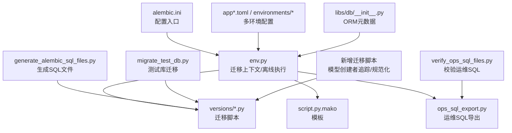
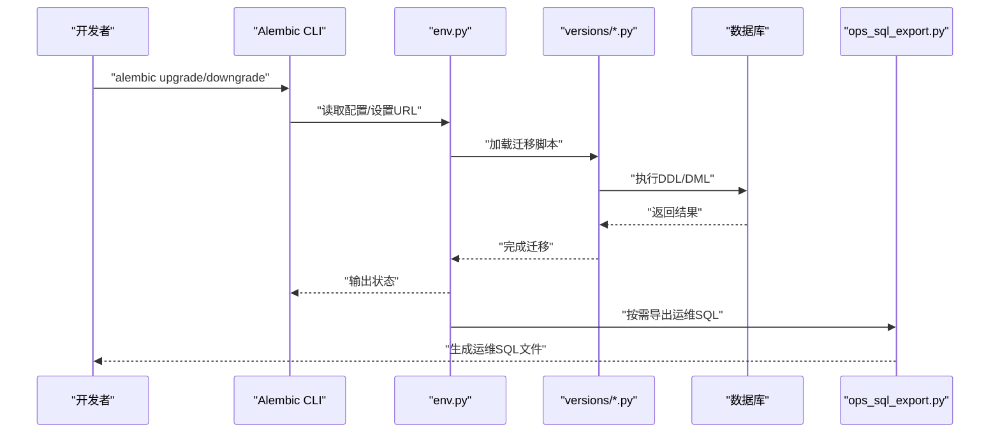
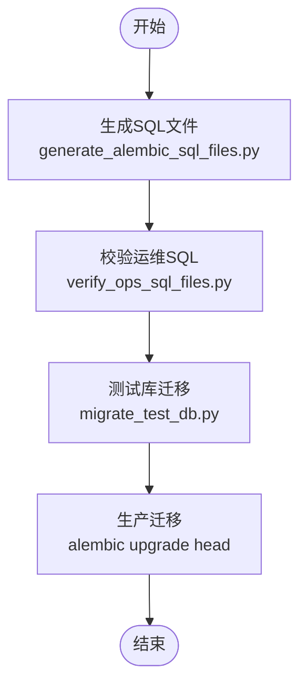
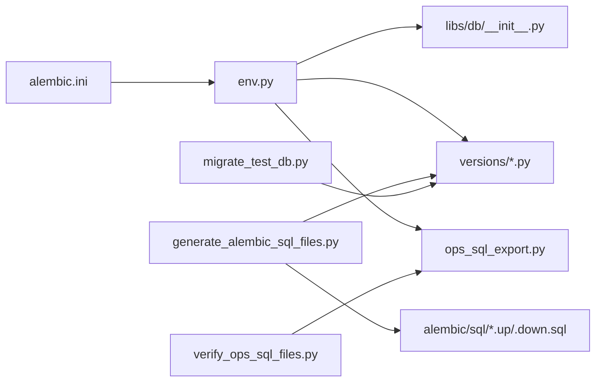

# 迁移管理

<cite>
**本文引用的文件**
- [backend/alembic.ini](file://backend/alembic.ini)
- [backend/alembic/env.py](file://backend/alembic/env.py)
- [backend/alembic/script.py.mako](file://backend/alembic/script.py.mako)
- [backend/alembic/ops_sql_export.py](file://backend/alembic/ops_sql_export.py)
- [backend/scripts/generate_alembic_sql_files.py](file://backend/scripts/generate_alembic_sql_files.py)
- [backend/scripts/migrate_test_db.py](file://backend/scripts/migrate_test_db.py)
- [backend/scripts/verify_ops_sql_files.py](file://backend/scripts/verify_ops_sql_files.py)
- [backend/libs/db/__init__.py](file://backend/libs/db/__init__.py)
- [.agents/skills/database-schema/SKILL.md](file://.agents/skills/database-schema/SKILL.md)
- [backend/config/environments/local-dev.toml](file://backend/config/environments/local-dev.toml)
- [backend/config/environments/docker-dev.toml](file://backend/config/environments/docker-dev.toml)
- [backend/config/environments/docker-prod.toml](file://backend/config/environments/docker-prod.toml)
- [backend/config/environments/k8s-prod.toml](file://backend/config/environments/k8s-prod.toml)
- [backend/config/app.toml](file://backend/config/app.toml)
- [backend/config/app.development.toml](file://backend/config/app.development.toml)
- [backend/config/app.production.toml](file://backend/config/app.production.toml)
- [backend/config/app.staging.toml](file://backend/config/app.staging.toml)
- [backend/config/execution.toml](file://backend/config/execution.toml)
- [backend/config/litellm_models.yaml](file://backend/config/litellm_models.yaml)
- [backend/config/mcp.toml](file://backend/config/mcp.toml)
- [backend/config/tools.toml](file://backend/config/tools.toml)
- [backend/config/env.example](file://backend/config/env.example)
- [backend/bootstrap/config.py](file://backend/bootstrap/config.py)
- [backend/bootstrap/main.py](file://backend/bootstrap/main.py)
- [backend/bootstrap/composition/identity_services.py](file://backend/bootstrap/composition/identity_services.py)
- [backend/libs/config.py](file://backend/libs/config.py)
- [backend/utils/logging.py](file://backend/utils/logging.py)
- [backend/tests/unit/test_sandbox_executor.py](file://backend/tests/unit/test_sandbox_executor.py)
- [backend/tests/integration/api/test_chat_e2e.py](file://backend/tests/integration/api/test_chat_e2e.py)
- [backend/tests/e2e/test_chat_api_e2e.py](file://backend/tests/e2e/test_chat_api_e2e.py)
- [backend/alembic/versions/20260205_add_user_vendor_creator_id.py](file://backend/alembic/versions/20260205_add_user_vendor_creator_id.py)
- [backend/alembic/versions/20260508_add_gateway_tables.py](file://backend/alembic/versions/20260508_add_gateway_tables.py)
- [backend/alembic/versions/20260515_migrate_user_models_data.py](file://backend/alembic/versions/20260515_migrate_user_models_data.py)
- [backend/alembic/versions/20260608_provider_credentials_created_by.py](file://backend/alembic/versions/20260608_provider_credentials_created_by.py)
- [backend/alembic/versions/20260614_normalize_openai_real_model_prefix.py](file://backend/alembic/versions/20260614_normalize_openai_real_model_prefix.py)
- [backend/alembic/sql/20260205_add_user_vendor_creator_id.up.sql](file://backend/alembic/sql/20260205_add_user_vendor_creator_id.up.sql)
- [backend/alembic/sql/20260508_add_gateway_tables.up.sql](file://backend/alembic/sql/20260508_add_gateway_tables.up.sql)
- [backend/alembic/sql/20260515_migrate_user_models_data.up.sql](file://backend/alembic/sql/20260515_migrate_user_models_data.up.sql)
- [backend/alembic/sql/20260608_provider_credentials_created_by.up.sql](file://backend/alembic/sql/20260608_provider_credentials_created_by.up.sql)
- [backend/alembic/sql/20260614_normalize_openai_real_model_prefix.up.sql](file://backend/alembic/sql/20260614_normalize_openai_real_model_prefix.up.sql)
</cite>

## 目录
1. [简介](#简介)
2. [项目结构](#项目结构)
3. [核心组件](#核心组件)
4. [架构总览](#架构总览)
5. [详细组件分析](#详细组件分析)
6. [依赖关系分析](#依赖关系分析)
7. [性能考虑](#性能考虑)
8. [故障排查指南](#故障排查指南)
9. [结论](#结论)
10. [附录](#附录)

## 简介
本文件面向AI Agent项目的数据库迁移管理，系统化阐述基于Alembic的迁移框架使用与配置、迁移脚本编写规范与最佳实践、版本控制策略、向前/向后迁移机制与安全措施、自动化流程（生成、验证、执行）、多环境迁移策略、回滚与故障恢复、性能优化技巧、迁移测试策略以及监控与日志记录最佳实践。文档内容严格基于仓库中现有文件与脚本进行归纳总结，确保可操作性与可追溯性。

**更新** 本次更新反映了新增的数据库迁移脚本，包括模型创建者追踪和OpenAI模型ID规范化功能，以及相应的迁移管理策略更新。

## 项目结构
本项目在后端目录下采用标准的Alembic迁移组织方式，并配套生成与验证脚本、多环境配置与测试用例，形成"配置-脚本-工具-测试"的完整闭环。

**章节来源**
- [backend/alembic.ini](file://backend/alembic.ini)
- [backend/alembic/env.py](file://backend/alembic/env.py)
- [backend/alembic/script.py.mako](file://backend/alembic/script.py.mako)
- [backend/alembic/ops_sql_export.py](file://backend/alembic/ops_sql_export.py)
- [backend/scripts/generate_alembic_sql_files.py](file://backend/scripts/generate_alembic_sql_files.py)
- [backend/scripts/migrate_test_db.py](file://backend/scripts/migrate_test_db.py)
- [backend/scripts/verify_ops_sql_files.py](file://backend/scripts/verify_ops_sql_files.py)
- [backend/libs/db/__init__.py](file://backend/libs/db/__init__.py)

## 核心组件
- Alembic配置与入口
  - alembic.ini：定义数据库URL、目标元数据、脚本位置等全局配置。
  - env.py：设置数据库URL、目标元数据、离线/在线迁移执行逻辑、事务策略、运维SQL导出开关等。
  - script.py.mako：迁移脚本模板，用于生成Python迁移文件骨架。
- 运维SQL导出
  - ops_sql_export.py：在特定环境下导出运维级SQL文件，供非Alembic场景使用。
- 迁移脚本与SQL
  - versions/*.py：具体迁移脚本，包含upgrade/downgrade实现。
  - alembic/sql/*.up.sql / *.down.sql：配套的SQL文件，便于运维手工执行或审计。
- 工具脚本
  - generate_alembic_sql_files.py：生成/同步SQL文件与迁移脚本。
  - migrate_test_db.py：对测试数据库执行迁移，支持快速验证。
  - verify_ops_sql_files.py：校验运维SQL文件一致性与完整性。
- 多环境配置
  - app*.toml与environments/*：本地、Docker、Kubernetes、生产等环境的数据库URL与参数。
- ORM元数据
  - libs/db/__init__.py：提供Base.metadata，作为迁移目标元数据。

**章节来源**
- [backend/alembic.ini](file://backend/alembic.ini)
- [backend/alembic/env.py](file://backend/alembic/env.py)
- [backend/alembic/script.py.mako](file://backend/alembic/script.py.mako)
- [backend/alembic/ops_sql_export.py](file://backend/alembic/ops_sql_export.py)
- [backend/scripts/generate_alembic_sql_files.py](file://backend/scripts/generate_alembic_sql_files.py)
- [backend/scripts/migrate_test_db.py](file://backend/scripts/migrate_test_db.py)
- [backend/scripts/verify_ops_sql_files.py](file://backend/scripts/verify_ops_sql_files.py)
- [backend/libs/db/__init__.py](file://backend/libs/db/__init__.py)

## 架构总览
下图展示迁移生命周期：从配置加载、脚本生成、离线/在线执行，到运维SQL导出与验证，再到多环境部署与测试闭环。

**图表来源**
- [backend/alembic/env.py](file://backend/alembic/env.py)
- [backend/alembic/ops_sql_export.py](file://backend/alembic/ops_sql_export.py)
- [backend/alembic/versions/20260123_212703_add_config_column_to_sessions.py](file://backend/alembic/versions/20260123_212703_add_config_column_to_sessions.py)

## 详细组件分析

### Alembic配置与执行上下文（env.py）
- 数据库URL注入：通过配置文件读取数据库连接串并注入到Alembic配置。
- 目标元数据：绑定ORM Base.metadata，确保迁移基于当前模型结构。
- 离线迁移：在无引擎情况下生成SQL脚本，支持事务级迁移与mock模式。
- 运维SQL导出：在特定环境变量开启时，动态导入ops_sql_export模块以导出运维SQL。
- 事务策略：每迁移一个版本自动开启事务，提升安全性与可回滚性。

**章节来源**
- [backend/alembic/env.py](file://backend/alembic/env.py)

### 迁移脚本模板（script.py.mako）
- 提供标准化的迁移脚本骨架，包含版本号、前置版本、升级/降级函数等。
- 建议遵循"先建索引/约束，再更新数据，最后修改列属性"的顺序，避免锁表与失败。

**章节来源**
- [backend/alembic/script.py.mako](file://backend/alembic/script.py.mako)

### 运维SQL导出（ops_sql_export.py）
- 在离线模式下，按需导出运维级SQL文件，便于手工执行或审计。
- 与生成脚本保持一致的文件头格式，明确方向与版本信息。

**章节来源**
- [backend/alembic/ops_sql_export.py](file://backend/alembic/ops_sql_export.py)

### 迁移脚本与SQL文件（versions与sql）
- 版本命名：既有传统序号前缀（如001、002），也有带时间戳的现代命名（如20260123_212703），体现演进过程。
- up/down成对：每个版本均提供向上与向下迁移脚本，保证可逆性。
- 运维SQL：配套的.up/.down.sql文件，便于非Alembic场景执行。

**章节来源**
- [backend/alembic/versions/001_initial.py](file://backend/alembic/versions/001_initial.py)
- [backend/alembic/versions/20260127_150000_add_mcp_servers.py](file://backend/alembic/versions/20260127_150000_add_mcp_servers.py)
- [backend/alembic/sql/001_initial.up.sql](file://backend/alembic/sql/001_initial.up.sql)
- [backend/alembic/sql/20260127_150000_add_mcp_servers.up.sql](file://backend/alembic/sql/20260127_150000_add_mcp_servers.up.sql)

### 新增迁移脚本功能

#### 模型创建者追踪迁移
新增的迁移脚本实现了用户模型创建者的追踪功能：

- **迁移脚本**：20260205_add_user_vendor_creator_id.py
- **功能**：为users表添加vendor_creator_id列，用于追踪厂商系统的操作用户ID
- **实现**：通过ALTER TABLE添加vendor_creator_id列，并添加相应的注释说明
- **数据迁移**：配合数据回填逻辑，将历史数据迁移到新字段

**章节来源**
- [backend/alembic/versions/20260205_add_user_vendor_creator_id.py](file://backend/alembic/versions/20260205_add_user_vendor_creator_id.py)
- [backend/alembic/sql/20260205_add_user_vendor_creator_id.up.sql](file://backend/alembic/sql/20260205_add_user_vendor_creator_id.up.sql)

#### 网关表迁移
网关相关表的迁移脚本提供了完整的网关功能支持：

- **迁移脚本**：20260508_add_gateway_tables.py
- **功能**：创建网关相关的表结构，包括虚拟密钥表等
- **实现**：定义表结构、索引、外键约束等
- **创建者追踪**：为网关相关表添加created_by_user_id字段，实现创建者追踪

**章节来源**
- [backend/alembic/versions/20260508_add_gateway_tables.py](file://backend/alembic/versions/20260508_add_gateway_tables.py)
- [backend/alembic/sql/20260508_add_gateway_tables.up.sql](file://backend/alembic/sql/20260508_add_gateway_tables.up.sql)

#### 用户模型数据迁移
复杂的数据迁移脚本实现了用户模型数据的转换和规范化：

- **迁移脚本**：20260515_migrate_user_models_data.py
- **功能**：将旧的user_models数据迁移到新的gateway_models结构
- **实现**：复杂的多步骤数据转换，包括团队映射、去重处理、数据规范化
- **性能优化**：使用批量处理和事务控制，确保大数据量迁移的效率和安全性

**章节来源**
- [backend/alembic/versions/20260515_migrate_user_models_data.py](file://backend/alembic/versions/20260515_migrate_user_models_data.py)
- [backend/alembic/sql/20260515_migrate_user_models_data.up.sql](file://backend/alembic/sql/20260515_migrate_user_models_data.up.sql)

#### 凭证创建者追踪迁移
为凭证表添加创建者追踪功能：

- **迁移脚本**：20260608_provider_credentials_created_by.py
- **功能**：为provider_credentials表添加created_by_user_id字段
- **实现**：添加可空的UUID字段，并创建相应的索引
- **用途**：支持成员私有团队凭证的创建者追踪

**章节来源**
- [backend/alembic/versions/20260608_provider_credentials_created_by.py](file://backend/alembic/versions/20260608_provider_credentials_created_by.py)
- [backend/alembic/sql/20260608_provider_credentials_created_by.up.sql](file://backend/alembic/sql/20260608_provider_credentials_created_by.up.sql)

#### OpenAI模型ID规范化迁移
实现OpenAI模型ID的规范化处理：

- **迁移脚本**：20260614_normalize_openai_real_model_prefix.py
- **功能**：规范化OpenAI模型ID的前缀格式
- **实现**：通过数据迁移脚本统一处理模型ID格式
- **用途**：确保模型ID的一致性和兼容性

**章节来源**
- [backend/alembic/versions/20260614_normalize_openai_real_model_prefix.py](file://backend/alembic/versions/20260614_normalize_openai_real_model_prefix.py)
- [backend/alembic/sql/20260614_normalize_openai_real_model_prefix.up.sql](file://backend/alembic/sql/20260614_normalize_openai_real_model_prefix.up.sql)

### 工具链与自动化
- 生成SQL文件：generate_alembic_sql_files.py负责生成/同步SQL文件与迁移脚本，确保一致性。
- 测试库迁移：migrate_test_db.py对测试数据库执行迁移，便于快速验证。
- 运维SQL校验：verify_ops_sql_files.py校验运维SQL文件的完整性与一致性。

**章节来源**
- [backend/scripts/generate_alembic_sql_files.py](file://backend/scripts/generate_alembic_sql_files.py)
- [backend/scripts/migrate_test_db.py](file://backend/scripts/migrate_test_db.py)
- [backend/scripts/verify_ops_sql_files.py](file://backend/scripts/verify_ops_sql_files.py)

### 多环境迁移策略
- 本地开发：local-dev.toml、docker-dev.toml提供开发环境数据库URL与参数。
- 容器化开发：docker-dev.toml与docker-prod.toml区分开发与生产容器环境。
- 生产部署：k8s-prod.toml与app.production.toml承载Kubernetes与生产环境配置。
- 应用配置：app.toml、app.development.toml、app.staging.toml统一管理应用层配置，配合数据库URL使用。

**章节来源**
- [backend/config/environments/local-dev.toml](file://backend/config/environments/local-dev.toml)
- [backend/config/environments/docker-dev.toml](file://backend/config/environments/docker-dev.toml)
- [backend/config/environments/docker-prod.toml](file://backend/config/environments/docker-prod.toml)
- [backend/config/environments/k8s-prod.toml](file://backend/config/environments/k8s-prod.toml)
- [backend/config/app.toml](file://backend/config/app.toml)
- [backend/config/app.development.toml](file://backend/config/app.development.toml)
- [backend/config/app.production.toml](file://backend/config/app.production.toml)
- [backend/config/app.staging.toml](file://backend/config/app.staging.toml)

### 版本控制与命名规范
- 命名规则
  - 传统序号：001_initial、002_add_performance_indexes等，适用于早期版本。
  - 时间戳命名：20260123_212703_add_config_column_to_sessions等，便于排序与并行开发。
- 分支与合并
  - 建议每个功能或领域变更对应独立迁移脚本，避免大版本合并导致冲突。
  - 合并前确保up/down成对且可逆，必要时进行回滚验证。
- 前向/回滚机制
  - 单版本迁移：通过alembic upgrade/downgrade指定具体版本或head/heads。
  - 批量迁移：在CI/CD中按顺序执行，确保幂等与可重复。

**章节来源**
- [.agents/skills/database-schema/SKILL.md](file://.agents/skills/database-schema/SKILL.md)
- [backend/alembic/versions/20260127_150000_add_mcp_servers.py](file://backend/alembic/versions/20260127_150000_add_mcp_servers.py)

### 迁移安全与回滚
- 事务策略：env.py启用每迁移一个版本的事务，失败可回滚。
- 回滚验证：建议在测试环境先执行回滚，确认数据一致性与业务影响。
- 禁止项：参考技能文档，严禁在本地直接指向生产数据库、在应用迁移脚本中硬编码生产连接串、让CI使用生产账号执行迁移。

**章节来源**
- [.agents/skills/database-schema/SKILL.md](file://.agents/skills/database-schema/SKILL.md)
- [backend/alembic/env.py](file://backend/alembic/env.py)

### 自动化流程（生成、验证、执行）

**图表来源**
- [backend/scripts/generate_alembic_sql_files.py](file://backend/scripts/generate_alembic_sql_files.py)
- [backend/scripts/verify_ops_sql_files.py](file://backend/scripts/verify_ops_sql_files.py)
- [backend/scripts/migrate_test_db.py](file://backend/scripts/migrate_test_db.py)
- [backend/alembic.ini](file://backend/alembic.ini)

## 依赖关系分析
- 配置依赖
  - alembic.ini依赖env.py提供的数据库URL与目标元数据。
  - env.py依赖libs/db/__init__.py中的ORM元数据。
- 脚本依赖
  - versions/*.py依赖env.py提供的上下文与op接口。
  - ops_sql_export.py在离线模式下被env.py按需调用。
- 工具依赖
  - generate_alembic_sql_files.py与verify_ops_sql_files.py依赖versions与sql目录结构。
  - migrate_test_db.py依赖测试环境配置与数据库URL。

**图表来源**
- [backend/alembic.ini](file://backend/alembic.ini)
- [backend/alembic/env.py](file://backend/alembic/env.py)
- [backend/libs/db/__init__.py](file://backend/libs/db/__init__.py)
- [backend/alembic/versions/001_initial.py](file://backend/alembic/versions/001_initial.py)
- [backend/alembic/ops_sql_export.py](file://backend/alembic/ops_sql_export.py)
- [backend/scripts/generate_alembic_sql_files.py](file://backend/scripts/generate_alembic_sql_files.py)
- [backend/scripts/verify_ops_sql_files.py](file://backend/scripts/verify_ops_sql_files.py)
- [backend/scripts/migrate_test_db.py](file://backend/scripts/migrate_test_db.py)

## 性能考虑
- 大数据量迁移
  - 分批处理：将大表更新拆分为多个小批次，降低锁竞争与内存占用。
  - 索引策略：在迁移前评估索引影响，必要时临时禁用或延迟重建。
  - 并发控制：在低峰期执行长耗时迁移，避免阻塞业务。
- 长时间运行迁移
  - 事务分片：将长事务拆分为多个短事务，定期提交。
  - 异步迁移：对非关键路径的迁移采用异步任务队列执行。
- 索引与约束
  - 优先创建索引，再批量更新数据，最后添加约束，减少锁等待。
- 监控与日志
  - 结合应用日志与数据库慢查询日志，定位瓶颈。

**更新** 新增的复杂数据迁移脚本体现了以下性能优化策略：
- 批量数据处理：使用列表推导式和批量插入减少数据库往返
- 事务控制：在单个事务中处理大量数据，确保原子性
- 去重优化：使用集合(set)进行快速去重判断
- 条件过滤：在迁移前进行数据过滤，跳过无效记录

## 故障排查指南
- 常见问题
  - 迁移卡住：检查是否存在长事务、锁等待或未提交事务。
  - 权限不足：确认数据库用户具备DDL/DML权限。
  - 版本不一致：使用alembic current/head查看状态，必要时手动修复表中版本记录。
- 回滚与恢复
  - 使用downgrade回退至上一版本，验证业务可用性。
  - 若回滚失败，结合运维SQL文件进行手工修复。
- 日志与审计
  - 启用详细日志，记录迁移开始/结束时间、受影响对象与错误信息。
  - 对生产迁移保留审计日志，确保可追溯。

**章节来源**
- [backend/alembic/env.py](file://backend/alembic/env.py)
- [backend/utils/logging.py](file://backend/utils/logging.py)

## 结论
本项目已建立完善的Alembic迁移体系：从配置、脚本、工具到多环境与测试，形成闭环。新增的迁移脚本进一步增强了系统的功能性和可维护性，包括模型创建者追踪、OpenAI模型ID规范化等重要特性。遵循本文档的命名规范、版本控制策略、安全措施与性能优化建议，可有效保障数据库演进的稳定性与可维护性。

**更新** 最新的迁移脚本展示了高级的数据迁移技术，包括复杂的数据转换、批量处理和性能优化策略，为后续的数据库演进提供了坚实的基础。

## 附录

### 迁移测试策略
- 单元测试
  - 针对迁移脚本的逻辑与边界条件进行断言，确保up/down幂等。
- 集成测试
  - 在隔离的测试数据库中执行完整迁移流程，验证业务数据一致性。
- 端到端测试
  - 结合API测试与迁移后的数据访问，确保系统整体功能正常。

**章节来源**
- [backend/tests/unit/test_sandbox_executor.py](file://backend/tests/unit/test_sandbox_executor.py)
- [backend/tests/integration/api/test_chat_e2e.py](file://backend/tests/integration/api/test_chat_e2e.py)
- [backend/tests/e2e/test_chat_api_e2e.py](file://backend/tests/e2e/test_chat_api_e2e.py)

### 迁移监控与日志记录最佳实践
- 迁移前后指标对比：记录表大小、索引数量、查询性能等关键指标。
- 日志分级：info记录迁移步骤，warn记录潜在风险，error记录失败原因。
- 审计留痕：所有迁移操作均应记录操作人、时间、版本与影响范围。

**章节来源**
- [backend/utils/logging.py](file://backend/utils/logging.py)

### 新增迁移脚本的技术细节

#### 数据迁移最佳实践
新增的复杂数据迁移脚本体现了以下技术要点：

- **事务管理**：使用单个事务处理大量数据，确保原子性
- **批量处理**：通过列表推导式和批量插入减少数据库往返
- **去重处理**：使用集合(set)进行高效去重判断
- **条件过滤**：在迁移前进行数据验证和过滤
- **错误处理**：使用RAISE NOTICE记录迁移统计信息

**章节来源**
- [backend/alembic/versions/20260515_migrate_user_models_data.py](file://backend/alembic/versions/20260515_migrate_user_models_data.py)