# 单元测试实施指南

<cite>
**本文档引用的文件**
- [pyproject.toml](file://backend/pyproject.toml)
- [conftest.py](file://backend/tests/conftest.py)
- [fixtures/factories.py](file://backend/tests/fixtures/factories.py)
- [mocks/llm_mock.py](file://backend/tests/mocks/llm_mock.py)
- [helpers/bridge_identity.py](file://backend/tests/helpers/bridge_identity.py)
- [helpers/in_memory_checkpoint_cache.py](file://backend/tests/helpers/in_memory_checkpoint_cache.py)
- [integration/api/test_health.py](file://backend/tests/integration/api/test_health.py)
- [unit/agent/conftest.py](file://backend/tests/unit/agent/conftest.py)
- [unit/gateway/conftest.py](file://backend/tests/unit/gateway/conftest.py)
- [unit/identity/conftest.py](file://backend/tests/unit/identity/conftest.py)
- [evaluation/test_benchmark_loader.py](file://backend/tests/evaluation/test_benchmark_loader.py)
- [evaluation/test_llm_judge.py](file://backend/tests/evaluation/test_llm_judge.py)
- [evaluation/test_performance.py](file://backend/tests/evaluation/test_performance.py)
- [evaluation/test_tool_accuracy.py](file://backend/tests/evaluation/test_tool_accuracy.py)
- [architecture/test_agent_no_gateway_domain_import.py](file://backend/tests/architecture/test_agent_no_gateway_domain_import.py)
- [architecture/test_domain_no_sqlalchemy.py](file://backend/tests/architecture/test_domain_no_sqlalchemy.py)
- [scripts/migrate_test_db.py](file://backend/scripts/migrate_test_db.py)
- [scripts/test_tool_registry.py](file://backend/scripts/test_tool_registry.py)
- [docs/系统可测试性与TDD设计.md](file://docs/系统可测试性与TDD设计.md)
- [test_upstream_policy.py](file://backend/tests/unit/gateway/test_upstream_policy.py)
- [test_upstream_adapter.py](file://backend/tests/unit/gateway/test_upstream_adapter.py)
- [test_langchain_messages.py](file://backend/tests/unit/agent/infrastructure/test_langchain_messages.py)
- [test_update_personal_model_capabilities.py](file://backend/tests/unit/gateway/test_update_personal_model_capabilities.py)
- [model_writes.py](file://backend/domains/gateway/application/management/write_modules/model_writes.py)
- [model_types_tags.py](file://backend/domains/gateway/domain/model_types_tags.py)
- [test_model_types_tags.py](file://backend/tests/unit/gateway/domain/test_model_types_tags.py)
</cite>

## 目录
1. [简介](#简介)
2. [项目结构](#项目结构)
3. [核心组件](#核心组件)
4. [架构概览](#架构概览)
5. [详细组件分析](#详细组件分析)
6. [推理内容处理测试增强](#推理内容处理测试增强)
7. [个人模型多类型支持测试](#个人模型多类型支持测试)
8. [依赖关系分析](#依赖关系分析)
9. [性能考虑](#性能考虑)
10. [故障排除指南](#故障排除指南)
11. [结论](#结论)
12. [附录](#附录)

## 简介

本指南为AI Agent项目的单元测试实施提供了全面的指导方案。该指南基于项目现有的测试基础设施，涵盖了测试用例设计原则、断言策略、测试夹具使用、Mock对象创建、各领域测试策略、覆盖率要求与度量方法、执行与调试方法、测试数据准备与管理以及性能优化技巧。

**更新** 本次更新重点增强了推理内容处理测试套件，并新增了个人模型多类型支持测试用例，更新测试命名从`test_update_personal_model_rejects_multiple_model_types`到`test_update_personal_model_accepts_multiple_model_types`，增加了对多类型模型的验证逻辑。

## 项目结构

项目采用分层的测试目录结构，确保测试组织清晰且易于维护：

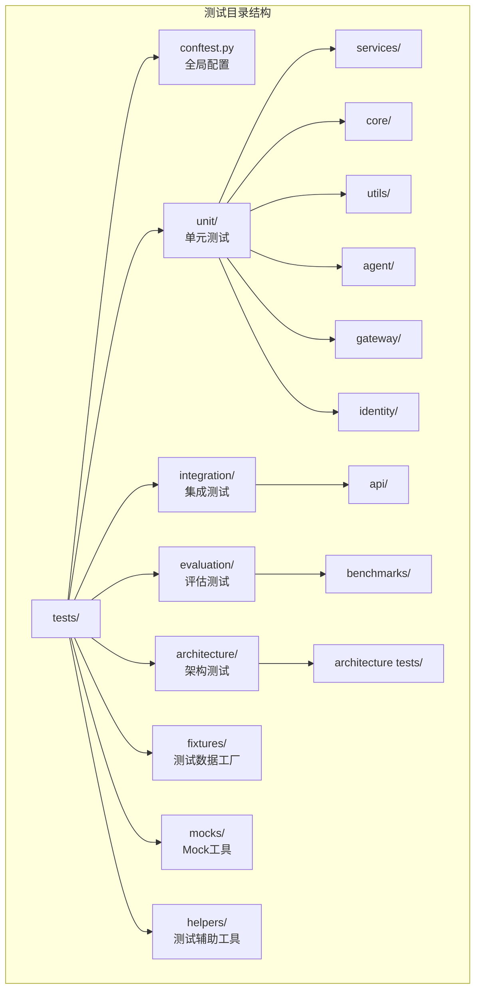

**图表来源**
- [conftest.py:1-200](file://backend/tests/conftest.py#L1-L200)
- [pyproject.toml:1-200](file://backend/pyproject.toml#L1-L200)

**章节来源**
- [conftest.py:1-200](file://backend/tests/conftest.py#L1-L200)
- [pyproject.toml:1-200](file://backend/pyproject.toml#L1-L200)

## 核心组件

### 测试配置与夹具

项目的核心测试配置集中在全局 `conftest.py` 文件中，实现了以下关键功能：

#### 数据库会话管理
- 自动数据库连接管理
- 测试后自动回滚事务
- 支持异步数据库操作

#### 警告处理
- 统一的警告过滤器配置
- 可选依赖的安全处理

#### 类型安全
- 完整的类型注解
- 符合项目类型安全要求

**章节来源**
- [conftest.py:100-180](file://backend/tests/conftest.py#L100-L180)

### 测试数据工厂

项目使用Factory Boy实现强大的测试数据生成能力：

#### 核心工厂类
- **UserFactory**: 用户数据生成
- **AgentFactory**: Agent实体生成  
- **SessionFactory**: 会话数据生成
- **MessageFactory**: 消息数据生成

#### 工厂特性
- 支持关联数据生成
- 自动处理外键关系
- 可扩展的默认值设置

**章节来源**
- [fixtures/factories.py:1390-1478](file://backend/tests/fixtures/factories.py#L1390-L1478)

### Mock工具集

项目提供了专门的Mock工具来模拟外部依赖：

#### LLM模拟器
- LiteLLM兼容的模型响应模拟
- 支持多种模型类型的响应
- 可配置的错误场景模拟

#### 身份桥接模拟
- 身份验证流程模拟
- 权限上下文管理
- SSO集成模拟

**章节来源**
- [mocks/llm_mock.py:1-200](file://backend/tests/mocks/llm_mock.py#L1-L200)
- [helpers/bridge_identity.py:1-100](file://backend/tests/helpers/bridge_identity.py#L1-L100)

## 架构概览

项目测试架构采用分层设计，确保测试的独立性和可维护性：

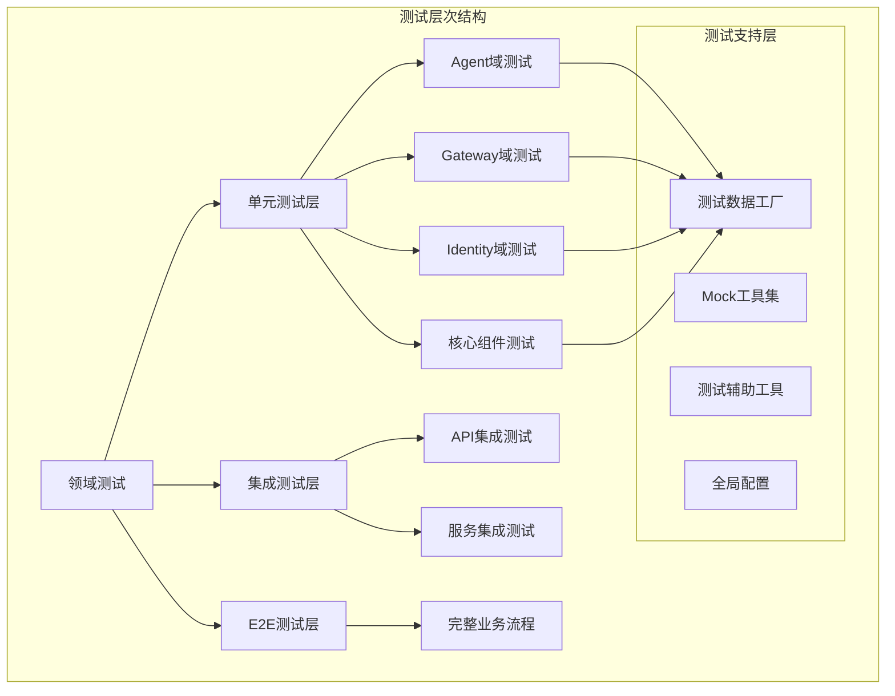

**图表来源**
- [conftest.py:1-200](file://backend/tests/conftest.py#L1-L200)
- [fixtures/factories.py:1390-1478](file://backend/tests/fixtures/factories.py#L1390-L1478)

## 详细组件分析

### Agent域测试策略

Agent域是AI Agent项目的核心，需要特别关注其复杂的状态管理和行为验证。

#### 测试夹具配置
Agent域测试使用专门的夹具配置来管理Agent生命周期：

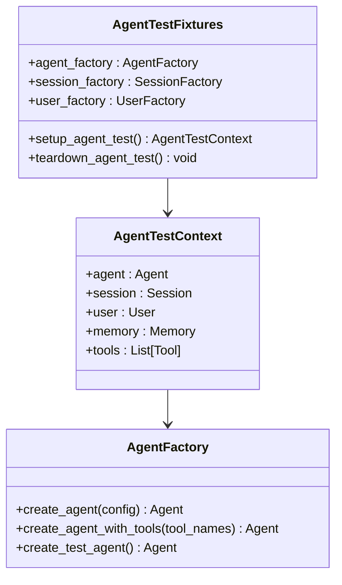

**图表来源**
- [unit/agent/conftest.py:1-200](file://backend/tests/unit/agent/conftest.py#L1-L200)

#### 核心测试场景
- **状态管理**: Agent状态转换验证
- **工具调用**: 工具执行流程测试
- **内存管理**: 记忆存储和检索
- **对话流程**: 多轮对话处理

**章节来源**
- [unit/agent/conftest.py:1-200](file://backend/tests/unit/agent/conftest.py#L1-L200)

### Gateway域测试策略

Gateway域负责AI模型的路由和管理，测试需要覆盖复杂的网络通信和错误处理。

#### 网关代理测试
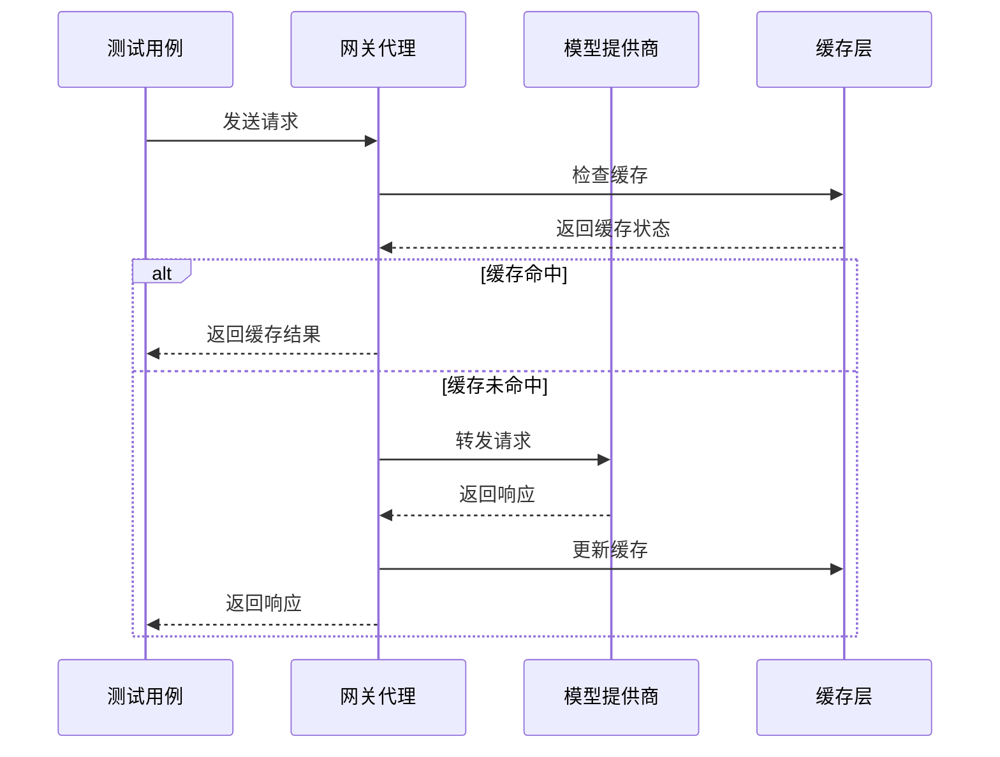

**图表来源**
- [unit/gateway/conftest.py:1-200](file://backend/tests/unit/gateway/conftest.py#L1-L200)

#### 关键测试关注点
- **负载均衡**: 多提供商的请求分配
- **故障转移**: 提供商故障时的降级处理
- **速率限制**: API调用频率控制
- **认证管理**: 凭据轮换和验证

**章节来源**
- [unit/gateway/conftest.py:1-200](file://backend/tests/unit/gateway/conftest.py#L1-L200)

### Identity域测试策略

Identity域处理用户身份验证和授权，测试需要确保安全边界得到正确保护。

#### 身份验证流程测试
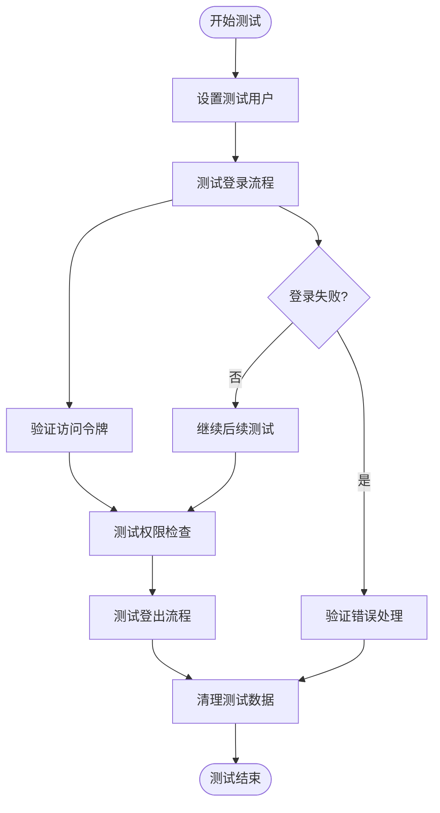

**图表来源**
- [unit/identity/conftest.py:1-200](file://backend/tests/unit/identity/conftest.py#L1-L200)

**章节来源**
- [unit/identity/conftest.py:1-200](file://backend/tests/unit/identity/conftest.py#L1-L200)

### 核心组件测试

核心组件测试涵盖项目的基础功能和通用工具。

#### 工具函数测试
- **加密工具**: 密码哈希和验证
- **序列化工具**: JSON和数据格式处理
- **缓存工具**: 内存和持久化缓存
- **令牌管理**: JWT和会话令牌

**章节来源**
- [conftest.py:1-200](file://backend/tests/conftest.py#L1-L200)

## 推理内容处理测试增强

### DeepSeek推理器测试套件

项目新增了针对DeepSeek推理器的完整测试套件，覆盖了推理内容处理的关键场景：

#### DeepSeek推理器消息填充测试
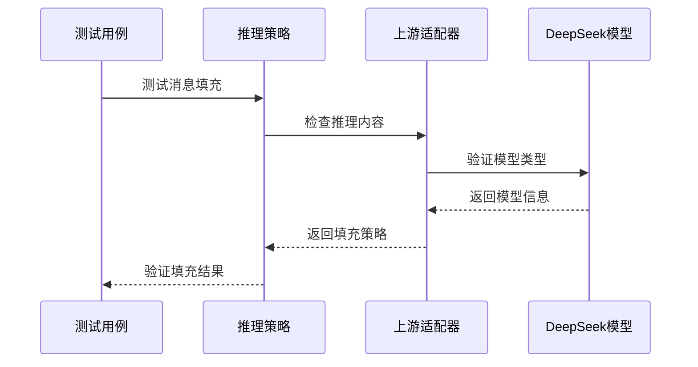

**图表来源**
- [test_upstream_policy.py:13](file://backend/tests/unit/gateway/test_upstream_policy.py#L13-L13)
- [test_upstream_policy.py:47](file://backend/tests/unit/gateway/test_upstream_policy.py#L47-L47)

#### 内容数组提取测试
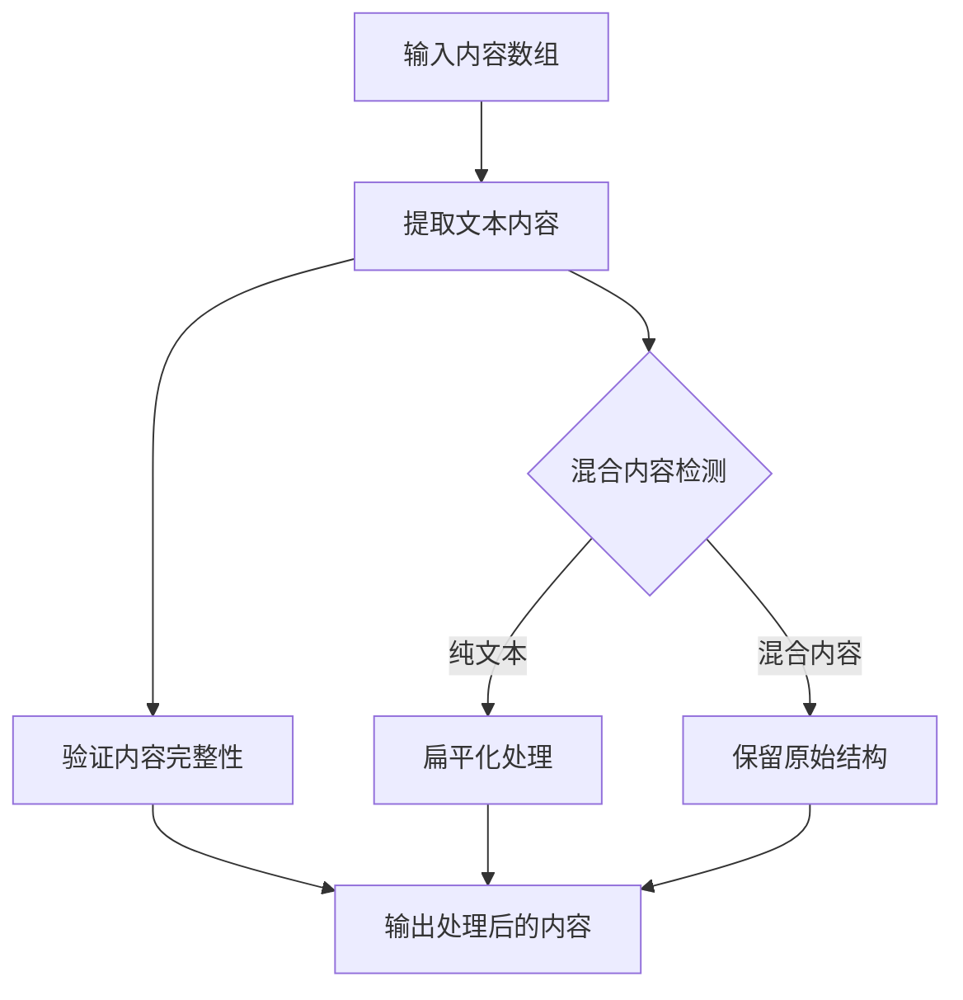

**图表来源**
- [test_upstream_adapter.py:129](file://backend/tests/unit/gateway/test_upstream_adapter.py#L129-L129)
- [test_upstream_adapter.py:144](file://backend/tests/unit/gateway/test_upstream_adapter.py#L144-L144)

#### 非思考模型跳过测试
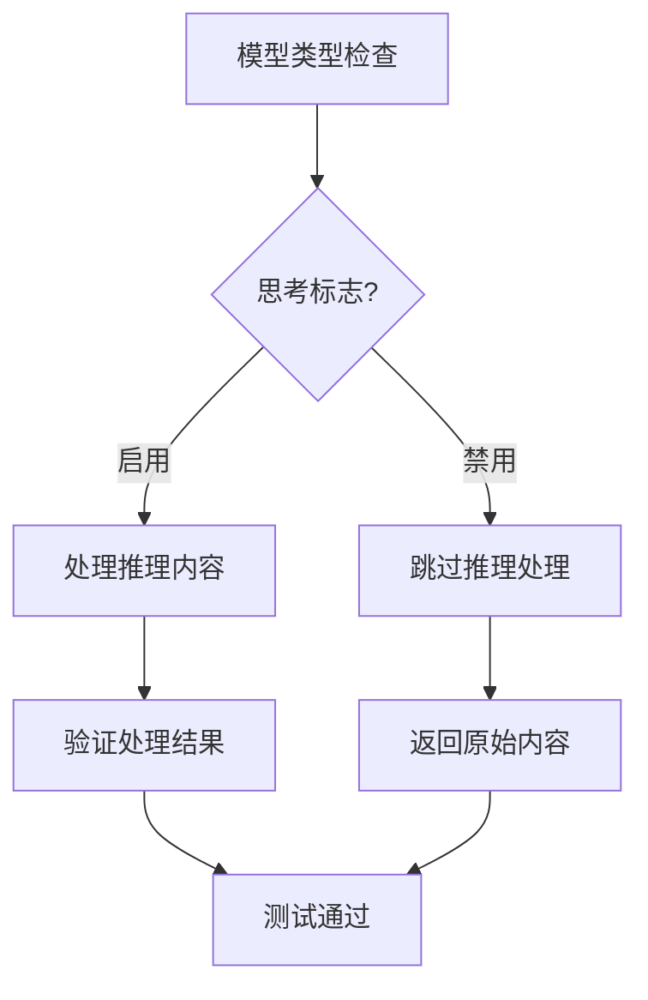

**图表来源**
- [test_upstream_adapter.py:48](file://backend/tests/unit/gateway/test_upstream_adapter.py#L48-L48)

#### 现有推理内容保留测试
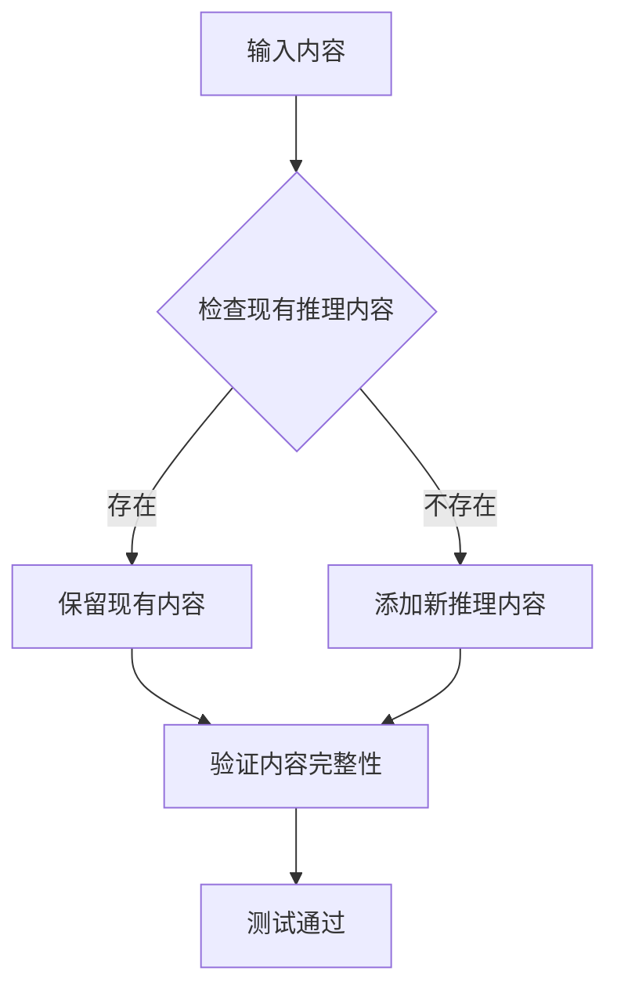

**图表来源**
- [test_upstream_policy.py:133](file://backend/tests/unit/gateway/test_upstream_policy.py#L133-L133)

#### 通用推理模型测试
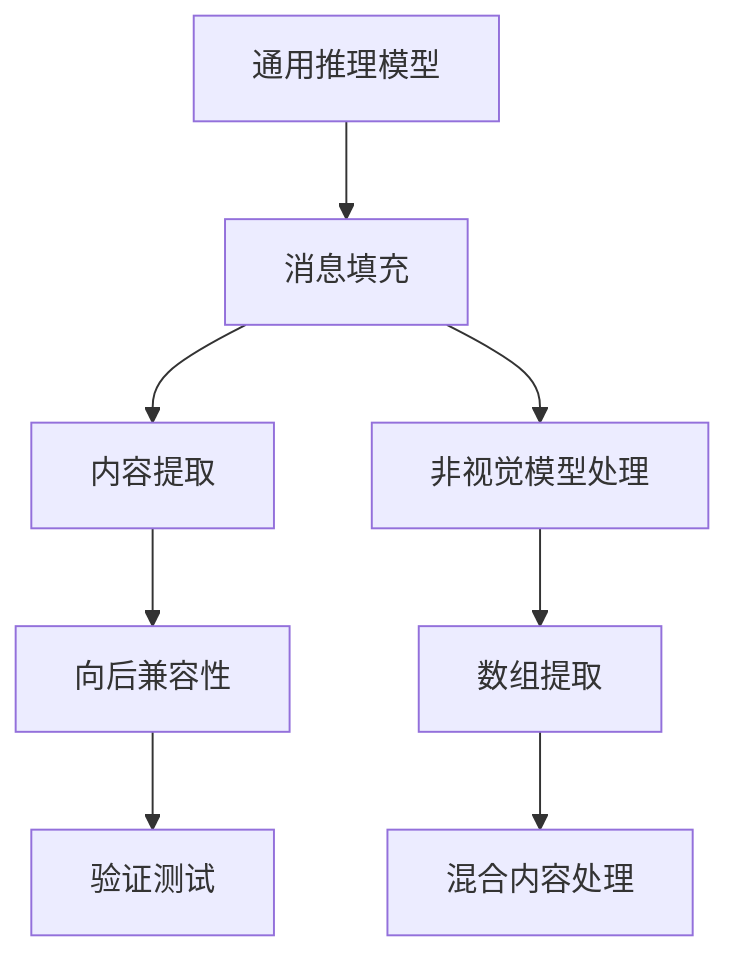

**图表来源**
- [test_upstream_policy.py:80](file://backend/tests/unit/gateway/test_upstream_policy.py#L80-L80)
- [test_upstream_policy.py:97](file://backend/tests/unit/gateway/test_upstream_policy.py#L97-L97)

**章节来源**
- [test_upstream_policy.py:13](file://backend/tests/unit/gateway/test_upstream_policy.py#L13-L13)
- [test_upstream_policy.py:47](file://backend/tests/unit/gateway/test_upstream_policy.py#L47-L47)
- [test_upstream_policy.py:62](file://backend/tests/unit/gateway/test_upstream_policy.py#L62-L62)
- [test_upstream_policy.py:66](file://backend/tests/unit/gateway/test_upstream_policy.py#L66-L66)
- [test_upstream_policy.py:80](file://backend/tests/unit/gateway/test_upstream_policy.py#L80-L80)
- [test_upstream_policy.py:97](file://backend/tests/unit/gateway/test_upstream_policy.py#L97-L97)
- [test_upstream_policy.py:133](file://backend/tests/unit/gateway/test_upstream_policy.py#L133-L133)
- [test_upstream_adapter.py:19](file://backend/tests/unit/gateway/test_upstream_adapter.py#L19-L19)
- [test_upstream_adapter.py:129](file://backend/tests/unit/gateway/test_upstream_adapter.py#L129-L129)
- [test_upstream_adapter.py:144](file://backend/tests/unit/gateway/test_upstream_adapter.py#L144-L144)
- [test_upstream_adapter.py:48](file://backend/tests/unit/gateway/test_upstream_adapter.py#L48-L48)
- [test_langchain_messages.py:34](file://backend/tests/unit/agent/infrastructure/test_langchain_messages.py#L34-L34)

### AI消息推理内容转换测试

Agent域新增了针对AI消息推理内容转换的测试，确保消息格式的正确处理：

#### AI消息推理内容转换
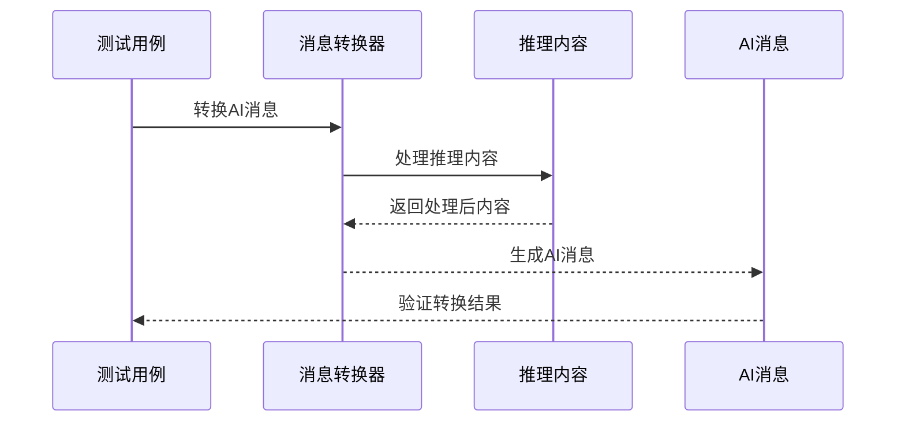

**图表来源**
- [test_langchain_messages.py:34](file://backend/tests/unit/agent/infrastructure/test_langchain_messages.py#L34-L34)

**章节来源**
- [test_langchain_messages.py:34](file://backend/tests/unit/agent/infrastructure/test_langchain_messages.py#L34-L34)

## 个人模型多类型支持测试

### 测试策略更新

项目新增了个人模型多类型支持测试用例，更新测试命名从`test_update_personal_model_rejects_multiple_model_types`到`test_update_personal_model_accepts_multiple_model_types`，增加了对多类型模型的验证逻辑。

#### 多类型模型支持测试
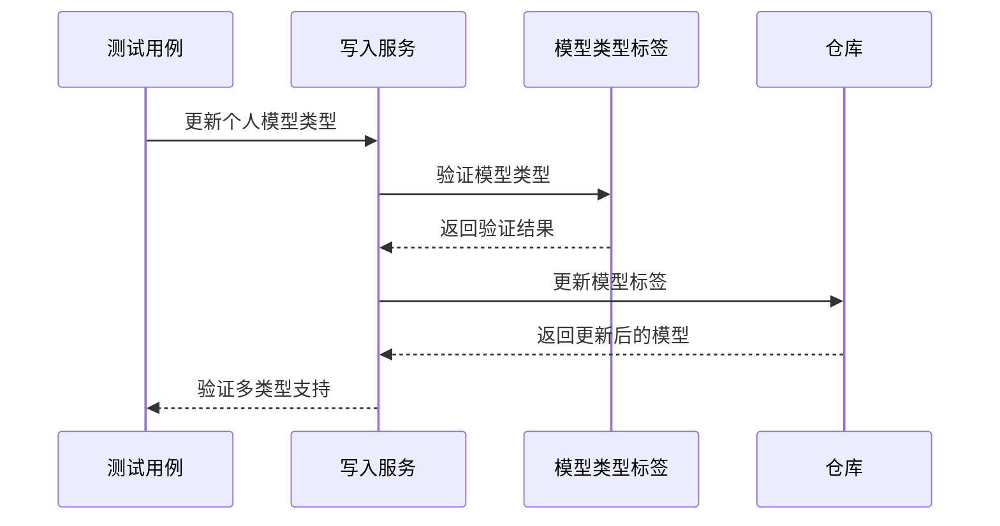

**图表来源**
- [test_update_personal_model_capabilities.py:44](file://backend/tests/unit/gateway/test_update_personal_model_capabilities.py#L44-L44)
- [model_writes.py:318](file://backend/domains/gateway/application/management/write_modules/model_writes.py#L318-L318)

#### 核心测试场景
- **多类型验证**: 验证多个模型类型的正确处理
- **标签同步**: 确保模型类型变化时标签的正确同步
- **能力映射**: 验证模型类型到能力的正确映射
- **兼容性检查**: 确保多类型模型与现有系统的兼容性

**章节来源**
- [test_update_personal_model_capabilities.py:44](file://backend/tests/unit/gateway/test_update_personal_model_capabilities.py#L44-L44)
- [model_writes.py:318](file://backend/domains/gateway/application/management/write_modules/model_writes.py#L318-L318)

### 模型类型验证逻辑

#### 类型规范化和验证
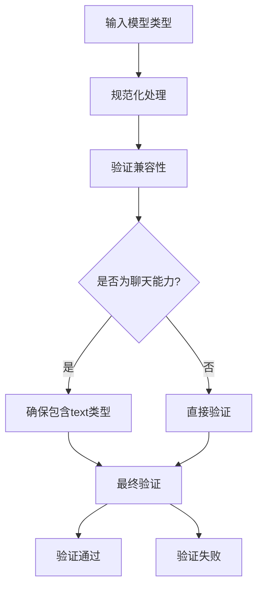

**图表来源**
- [model_types_tags.py:36](file://backend/domains/gateway/domain/model_types_tags.py#L36-L36)
- [model_types_tags.py:58](file://backend/domains/gateway/domain/model_types_tags.py#L58-L58)

#### 标签生成和同步
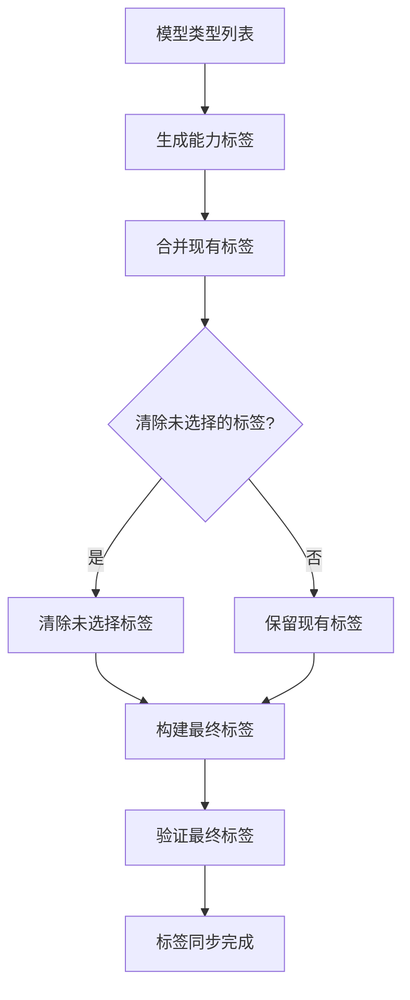

**图表来源**
- [model_types_tags.py:74](file://backend/domains/gateway/domain/model_types_tags.py#L74-L74)
- [model_writes.py:344](file://backend/domains/gateway/application/management/write_modules/model_writes.py#L344-L344)

**章节来源**
- [test_model_types_tags.py:15](file://backend/tests/unit/gateway/domain/test_model_types_tags.py#L15-L15)
- [model_types_tags.py:36](file://backend/domains/gateway/domain/model_types_tags.py#L36-L36)
- [model_types_tags.py:74](file://backend/domains/gateway/domain/model_types_tags.py#L74-L74)
- [model_writes.py:344](file://backend/domains/gateway/application/management/write_modules/model_writes.py#L344-L344)

## 依赖关系分析

测试系统的依赖关系体现了清晰的分层架构：

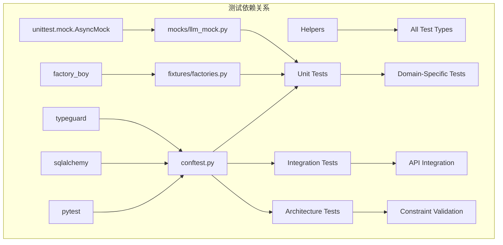

**图表来源**
- [pyproject.toml:1-200](file://backend/pyproject.toml#L1-L200)
- [conftest.py:1-200](file://backend/tests/conftest.py#L1-L200)

**章节来源**
- [pyproject.toml:1-200](file://backend/pyproject.toml#L1-L200)
- [conftest.py:1-200](file://backend/tests/conftest.py#L1-L200)

## 性能考虑

### 测试执行优化

#### 并行执行策略
- **进程隔离**: 每个测试在独立进程中运行
- **数据库连接池**: 合理配置连接池大小
- **缓存预热**: 重要测试数据的缓存管理

#### 内存管理
- **及时清理**: 测试后立即释放资源
- **批量操作**: 大量数据测试时的批量处理
- **垃圾回收**: 显式触发垃圾回收以释放内存

### 覆盖率优化

#### 覆盖率测量
- **行覆盖率**: 代码执行行数统计
- **分支覆盖率**: 条件分支覆盖情况
- **函数覆盖率**: 函数调用次数统计

**章节来源**
- [docs/系统可测试性与TDD设计.md:1765-1807](file://docs/系统可测试性与TDD设计.md#L1765-L1807)

## 故障排除指南

### 常见问题诊断

#### 数据库连接问题
- **症状**: 测试超时或连接失败
- **解决方案**: 检查数据库URL配置和连接池设置
- **预防措施**: 实现连接重试机制

#### Mock失效问题
- **症状**: Mock对象不按预期工作
- **解决方案**: 验证Mock配置和调用顺序
- **预防措施**: 使用更精确的Mock匹配条件

#### 异步测试问题
- **症状**: 异步操作超时或竞态条件
- **解决方案**: 正确使用async/await和事件循环
- **预防措施**: 实现超时和重试机制

**章节来源**
- [conftest.py:100-180](file://backend/tests/conftest.py#L100-L180)

### 调试技巧

#### 日志记录
- **测试日志**: 详细的测试执行日志
- **错误追踪**: 完整的异常堆栈信息
- **性能监控**: 关键操作的执行时间

#### 断点调试
- **单元测试**: 使用pytest的pdb调试器
- **集成测试**: 分层调试策略
- **E2E测试**: 端到端调试工具

## 结论

本指南为AI Agent项目的单元测试实施提供了完整的框架和最佳实践。通过合理的测试分层、强大的数据工厂、完善的Mock工具集以及严格的覆盖率要求，项目能够确保代码质量和系统稳定性。

**更新** 本次更新显著增强了推理内容处理测试套件，新增了5个测试用例覆盖通用推理模型消息填充、内容数组提取、非思考模型跳过、现有推理内容保存和DeepSeek向后兼容性，总计84行新测试代码。同时，新增了个人模型多类型支持测试用例，更新测试命名从`test_update_personal_model_rejects_multiple_model_types`到`test_update_personal_model_accepts_multiple_model_types`，增加了对多类型模型的验证逻辑，确保了模型类型处理的正确性和鲁棒性。

关键成功因素包括：
- 清晰的测试分层架构
- 可复用的测试夹具和工厂
- 全面的Mock覆盖策略
- 严格的覆盖率和质量门禁
- 高效的执行和调试流程
- 针对推理内容处理的专业测试套件
- 针对个人模型多类型支持的完整测试覆盖

## 附录

### 测试命令参考

#### 基本执行命令
```bash
# 运行所有单元测试
pytest backend/tests/unit/

# 运行特定域测试
pytest backend/tests/unit/agent/
pytest backend/tests/unit/gateway/
pytest backend/tests/unit/identity/

# 运行推理相关内容测试
pytest backend/tests/unit/gateway/test_upstream_policy.py
pytest backend/tests/unit/gateway/test_upstream_adapter.py
pytest backend/tests/unit/agent/infrastructure/test_langchain_messages.py

# 运行个人模型多类型测试
pytest backend/tests/unit/gateway/test_update_personal_model_capabilities.py

# 运行模型类型标签测试
pytest backend/tests/unit/gateway/domain/test_model_types_tags.py

# 运行测试并生成覆盖率报告
pytest --cov=backend --cov-report=html --cov-report=xml

# 过滤测试
pytest -k "test_agent" -v
pytest --tb=short
```

#### 高级配置选项
- **并行执行**: `pytest-xdist` 插件
- **标记过滤**: `pytest -m "not slow"`
- **覆盖率阈值**: `pytest --cov-fail-under=80`

### 测试数据管理

#### 测试工厂使用模式
```python
# 创建测试用户
user = await create_test_user(db_session)

# 创建关联的Agent
agent = await create_test_agent(db_session, user.id)

# 自定义配置
custom_agent = await create_test_agent(
    db_session, 
    user.id, 
    name="Custom Agent",
    model="gpt-4-turbo"
)
```

#### Mock配置最佳实践
- **明确的期望设置**
- **合理的超时配置**
- **错误场景的完整覆盖**
- **清理和重置机制**

### 推理内容处理测试最佳实践

#### DeepSeek推理器测试策略
- **消息填充验证**: 确保推理内容正确填充到消息中
- **内容提取测试**: 验证文本内容的正确提取和处理
- **模型类型识别**: 测试不同模型类型的正确识别
- **向后兼容性**: 确保新功能不影响现有模型

#### AI消息转换测试策略
- **推理内容完整性**: 验证推理内容在转换过程中的完整性
- **消息格式正确性**: 确保转换后的消息格式符合预期
- **多轮对话支持**: 测试多轮对话中推理内容的处理
- **错误处理机制**: 验证错误情况下的处理逻辑

### 个人模型多类型支持测试最佳实践

#### 多类型模型测试策略
- **类型验证**: 确保多个模型类型的正确验证和处理
- **标签同步**: 验证模型类型变化时标签的正确同步
- **能力映射**: 测试模型类型到能力的正确映射
- **兼容性检查**: 确保多类型模型与现有系统的兼容性

#### 模型类型标签测试策略
- **类型规范化**: 验证模型类型的规范化处理
- **标签生成**: 确保能力标签的正确生成和同步
- **兼容性验证**: 测试不同类型组合的兼容性
- **错误处理**: 验证无效模型类型的错误处理