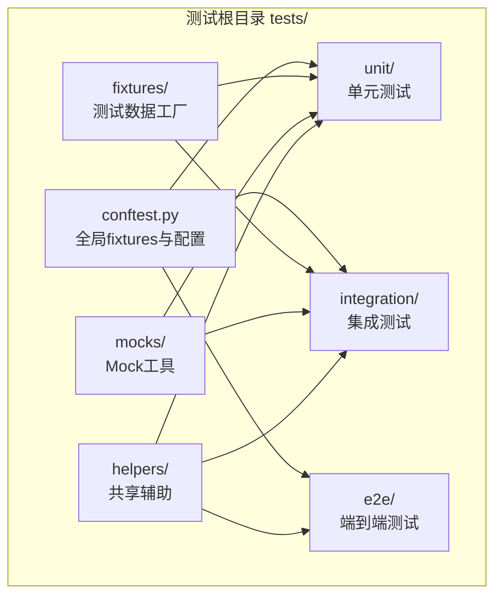
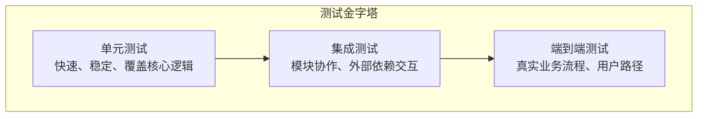
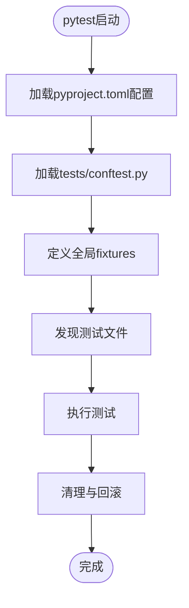
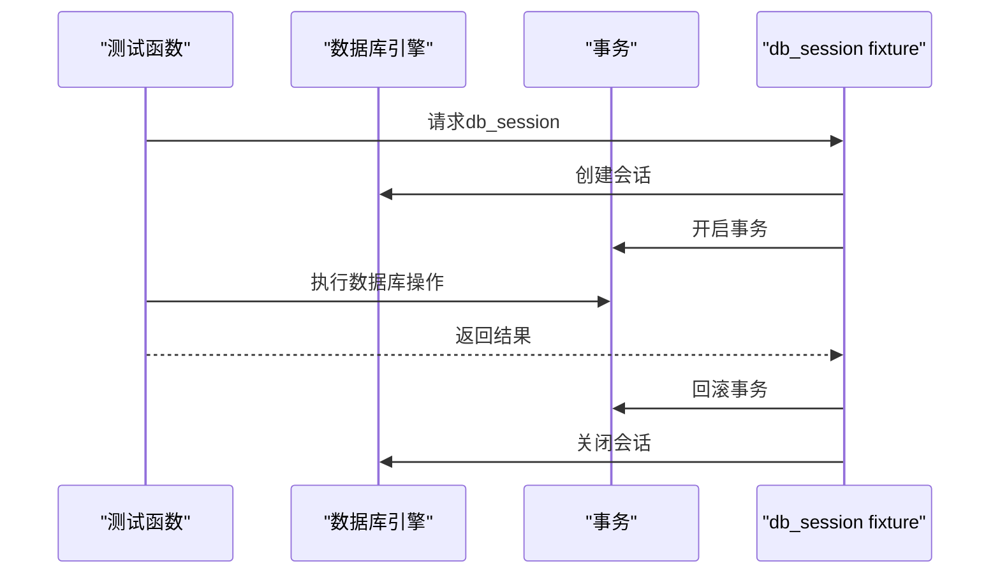
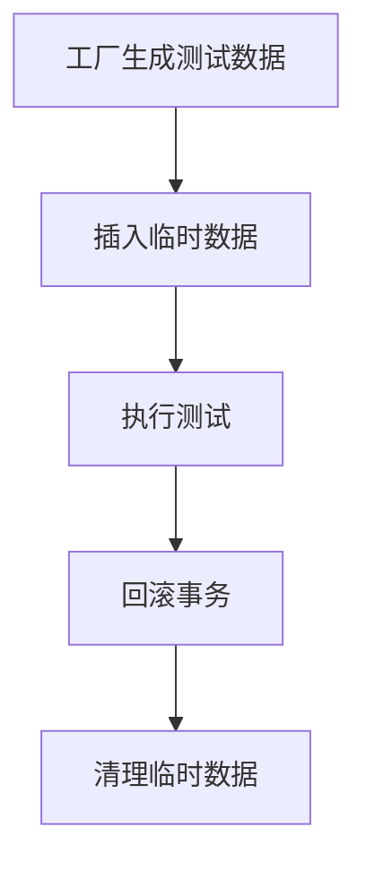
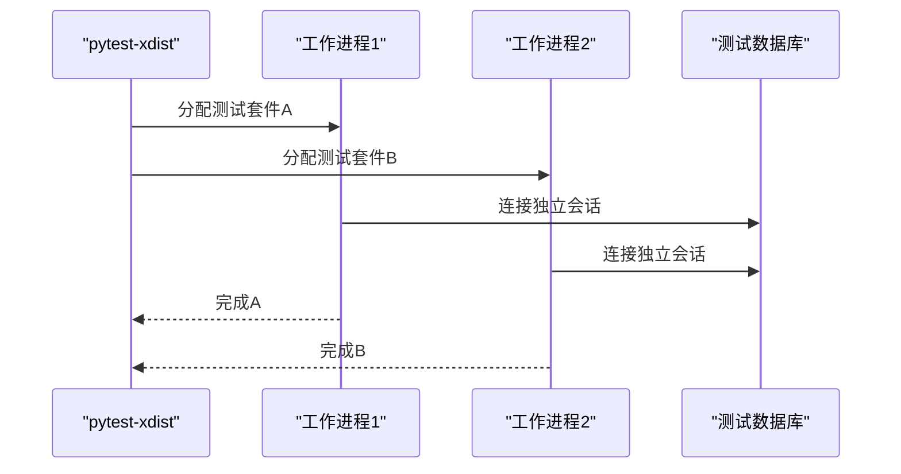
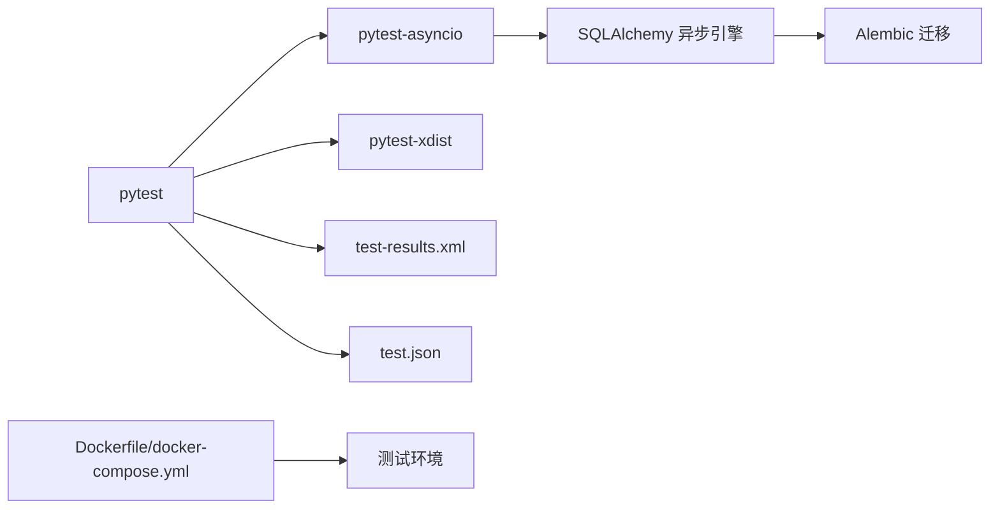

# 测试架构设计

<cite>
**本文引用的文件**
- [系统可测试性与TDD设计.md](file://docs/系统可测试性与TDD设计.md)
- [conftest.py](file://backend/tests/conftest.py)
- [CONFTEST_ANALYSIS.md](file://backend/tests/CONFTEST_ANALYSIS.md)
- [pyproject.toml](file://backend/pyproject.toml)
- [Dockerfile](file://backend/Dockerfile)
- [docker-compose.yml](file://docker-compose.yml)
- [test.json](file://test.json)
- [test-results.xml](file://backend/test-results.xml)
- [alembic.ini](file://backend/alembic.ini)
- [factories.py](file://backend/tests/fixtures/factories.py)
- [llm_mock.py](file://backend/tests/mocks/llm_mock.py)
- [test_api_paths_e2e.py](file://backend/tests/e2e/test_api_paths_e2e.py)
- [test_chat_api_e2e.py](file://backend/tests/e2e/test_chat_api_e2e.py)
- [test_execution_config_e2e.py](file://backend/tests/e2e/test_execution_config_e2e.py)
- [test_gateway_credential_probe_e2e.py](file://backend/tests/e2e/test_gateway_credential_probe_e2e.py)
- [test_simplemem_e2e.py](file://backend/tests/e2e/test_simplemem_e2e.py)
- [test_chat_e2e.py](file://backend/tests/integration/test_chat_e2e.py)
- [test_execution_config_integration.py](file://backend/tests/integration/test_execution_config_integration.py)
- [test_llm_providers.py](file://backend/tests/integration/test_llm_providers.py)
- [test_memory_checkpoint_integration.py](file://backend/tests/integration/test_memory_checkpoint_integration.py)
- [test_simplemem_integration.py](file://backend/tests/integration/test_simplemem_integration.py)
- [test_code_tools_sandbox.py](file://backend/tests/unit/test_code_tools_sandbox.py)
- [test_sandbox_executor.py](file://backend/tests/unit/test_sandbox_executor.py)
- [test_sandbox_executor_factory.py](file://backend/tests/unit/test_sandbox_executor_factory.py)
- [test_sandbox_manager.py](file://backend/tests/unit/test_sandbox_manager.py)
</cite>

## 目录
1. [引言](#引言)
2. [项目结构](#项目结构)
3. [核心组件](#核心组件)
4. [架构总览](#架构总览)
5. [详细组件分析](#详细组件分析)
6. [依赖分析](#依赖分析)
7. [性能考量](#性能考量)
8. [故障排除指南](#故障排除指南)
9. [结论](#结论)
10. [附录](#附录)

## 引言
本文件为AI Agent项目的测试架构设计文档，聚焦测试金字塔的分层结构与实施策略，涵盖单元测试、集成测试与端到端测试的职责划分、组织方式、配置管理、环境隔离、数据管理、并行执行与并发控制、最佳实践与设计原则。文档面向测试工程师与开发者，提供可操作的指导与可视化图示。

## 项目结构
测试目录采用分层组织，遵循pytest约定与项目规范：
- tests/
  - conftest.py：全局fixtures与pytest配置
  - unit/：单元测试（模块级、函数级）
  - integration/：集成测试（API、服务间交互）
  - e2e/：端到端测试（真实流程链路）
  - fixtures/：测试数据工厂
  - mocks/：Mock工具
  - helpers/：跨目录共享的测试辅助

**图表来源**
- [CONFTEST_ANALYSIS.md:84-100](file://backend/tests/CONFTEST_ANALYSIS.md#L84-L100)

**章节来源**
- [CONFTEST_ANALYSIS.md:1-166](file://backend/tests/CONFTEST_ANALYSIS.md#L1-L166)

## 核心组件
- 全局fixtures与配置：通过conftest.py集中管理事件循环、数据库引擎、HTTP客户端、认证头、测试用户等，确保测试隔离与可重复性。
- 测试数据工厂：通过factories.py生成测试实体，支持快速构建复杂对象图。
- Mock工具：通过llm_mock.py等提供外部依赖的可控替身，降低集成成本与不确定性。
- 辅助模块：通过helpers共享通用测试行为（如身份桥接补丁）。

**章节来源**
- [conftest.py:1312-1388](file://backend/tests/conftest.py#L1312-L1388)
- [factories.py](file://backend/tests/fixtures/factories.py)
- [llm_mock.py](file://backend/tests/mocks/llm_mock.py)
- [helpers/__init__.py:1-5](file://backend/tests/helpers/__init__.py#L1-L5)

## 架构总览
测试金字塔由下至上分为三层：
- 单元测试（Unit Tests）：验证最小可测单元，速度快、数量多，覆盖核心算法与工具函数。
- 集成测试（Integration Tests）：验证模块间协作与外部依赖交互，包含API与服务集成。
- 端到端测试（E2E Tests）：模拟真实用户场景，覆盖完整业务流程。

## 详细组件分析

### 测试配置与管理
- pytest配置：通过pyproject.toml启用异步模式与插件，确保协程测试正常运行。
- 全局fixtures：conftest.py提供事件循环、数据库引擎、会话、HTTP客户端、认证头与测试用户等，保障测试隔离与一致性。
- 子目录fixtures：可在unit/integration/e2e各自定义更细粒度的fixtures，按需扩展。

**图表来源**
- [pyproject.toml](file://backend/pyproject.toml)
- [conftest.py:1312-1388](file://backend/tests/conftest.py#L1312-L1388)

**章节来源**
- [pyproject.toml](file://backend/pyproject.toml)
- [conftest.py:1312-1388](file://backend/tests/conftest.py#L1312-L1388)
- [CONFTEST_ANALYSIS.md:106-159](file://backend/tests/CONFTEST_ANALYSIS.md#L106-L159)

### 测试环境隔离与管理
- 数据库隔离：每个测试函数使用独立事务并在结束后回滚，确保无副作用；数据库引擎在会话结束时销毁。
- 配置隔离：通过settings.test_database_url与环境变量切换测试数据库，避免污染生产或开发数据库。
- 容器化支持：Dockerfile与docker-compose.yml提供一致的测试运行环境，便于CI/CD集成。

**图表来源**
- [conftest.py:1340-1351](file://backend/tests/conftest.py#L1340-L1351)

**章节来源**
- [conftest.py:1320-1351](file://backend/tests/conftest.py#L1320-L1351)
- [alembic.ini](file://backend/alembic.ini)

### 测试数据管理
- 工厂模式：通过factories.py生成测试实体，支持批量创建与关联数据，减少重复代码。
- 清理策略：利用事务回滚与drop_all确保测试前后状态一致，避免数据泄漏。
- Mock策略：通过llm_mock.py等提供可控的外部依赖响应，提升测试稳定性与可重复性。

**图表来源**
- [factories.py](file://backend/tests/fixtures/factories.py)
- [llm_mock.py](file://backend/tests/mocks/llm_mock.py)

**章节来源**
- [factories.py](file://backend/tests/fixtures/factories.py)
- [llm_mock.py](file://backend/tests/mocks/llm_mock.py)

### 并行执行与并发控制
- pytest-xdist：可通过命令行参数启用并行执行，提高整体测试吞吐量。
- 并发控制：对共享资源（数据库、缓存、文件系统）进行锁或隔离策略，避免竞态条件。
- 异步测试：通过pyproject.toml启用asyncio模式，配合pytest-asyncio确保协程测试稳定。

**图表来源**
- [pyproject.toml](file://backend/pyproject.toml)

**章节来源**
- [pyproject.toml](file://backend/pyproject.toml)

### 单元测试层
- 覆盖范围：核心算法、工具函数、沙箱执行器、序列化与加密等。
- 示例文件：test_code_tools_sandbox.py、test_sandbox_executor.py、test_sandbox_executor_factory.py、test_sandbox_manager.py。
- 设计原则：单一职责、可替换依赖（Mock）、断言明确、边界条件完备。

**章节来源**
- [test_code_tools_sandbox.py](file://backend/tests/unit/test_code_tools_sandbox.py)
- [test_sandbox_executor.py](file://backend/tests/unit/test_sandbox_executor.py)
- [test_sandbox_executor_factory.py](file://backend/tests/unit/test_sandbox_executor_factory.py)
- [test_sandbox_manager.py](file://backend/tests/unit/test_sandbox_manager.py)

### 集成测试层
- 覆盖范围：API接口、LLM网关、内存检查点、执行配置等模块间协作。
- 示例文件：test_chat_e2e.py、test_execution_config_integration.py、test_llm_providers.py、test_memory_checkpoint_integration.py、test_simplemem_integration.py。
- 设计原则：使用真实或模拟的外部依赖，关注错误处理与边界场景。

**章节来源**
- [test_chat_e2e.py](file://backend/tests/integration/test_chat_e2e.py)
- [test_execution_config_integration.py](file://backend/tests/integration/test_execution_config_integration.py)
- [test_llm_providers.py](file://backend/tests/integration/test_llm_providers.py)
- [test_memory_checkpoint_integration.py](file://backend/tests/integration/test_memory_checkpoint_integration.py)
- [test_simplemem_integration.py](file://backend/tests/integration/test_simplemem_integration.py)

### 端到端测试层
- 覆盖范围：API路径、聊天流程、网关凭据探测、简单记忆等完整业务路径。
- 示例文件：test_api_paths_e2e.py、test_chat_api_e2e.py、test_execution_config_e2e.py、test_gateway_credential_probe_e2e.py、test_simplemem_e2e.py。
- 设计原则：模拟真实用户操作，关注失败重试、超时与降级策略。

**章节来源**
- [test_api_paths_e2e.py](file://backend/tests/e2e/test_api_paths_e2e.py)
- [test_chat_api_e2e.py](file://backend/tests/e2e/test_chat_api_e2e.py)
- [test_execution_config_e2e.py](file://backend/tests/e2e/test_execution_config_e2e.py)
- [test_gateway_credential_probe_e2e.py](file://backend/tests/e2e/test_gateway_credential_probe_e2e.py)
- [test_simplemem_e2e.py](file://backend/tests/e2e/test_simplemem_e2e.py)

## 依赖分析
- 测试框架：pytest为核心，配合pytest-asyncio、pytest-xdist等插件。
- 数据库：SQLAlchemy异步引擎与Alembic迁移脚本，确保schema一致性。
- 配置：pyproject.toml集中管理pytest与异步模式；Dockerfile/docker-compose提供容器化测试环境。
- 输出：test-results.xml与test.json用于CI报告与结果归档。

**图表来源**
- [pyproject.toml](file://backend/pyproject.toml)
- [test-results.xml](file://backend/test-results.xml)
- [test.json](file://test.json)
- [alembic.ini](file://backend/alembic.ini)
- [Dockerfile](file://backend/Dockerfile)
- [docker-compose.yml](file://docker-compose.yml)

**章节来源**
- [pyproject.toml](file://backend/pyproject.toml)
- [test-results.xml](file://backend/test-results.xml)
- [test.json](file://test.json)
- [alembic.ini](file://backend/alembic.ini)
- [Dockerfile](file://backend/Dockerfile)
- [docker-compose.yml](file://docker-compose.yml)

## 性能考量
- 优先编写单元测试，确保高覆盖率与快速反馈。
- 将昂贵的集成测试与E2E测试拆分为独立任务，在CI中并行执行。
- 使用事务回滚与工厂生成数据，避免I/O瓶颈。
- 合理设置pytest并发度，避免过度竞争共享资源。

## 故障排除指南
- 数据库连接问题：确认settings.test_database_url与本地/容器数据库可达；检查Alembic迁移是否成功。
- 异步测试失败：确认pyproject.toml中asyncio_mode配置；避免在同步上下文中调用异步fixture。
- 并行冲突：检查共享资源（数据库、文件、网络）的并发访问，必要时增加隔离或锁。
- CI报告缺失：核对test-results.xml与test.json输出路径与权限。

**章节来源**
- [conftest.py:1320-1351](file://backend/tests/conftest.py#L1320-L1351)
- [pyproject.toml](file://backend/pyproject.toml)
- [alembic.ini](file://backend/alembic.ini)

## 结论
本测试架构以pytest为核心，结合分层测试策略与严格的环境隔离、数据管理与并发控制，形成高效、稳定且可扩展的测试体系。建议持续优化fixtures拆分、完善Mock覆盖与并行执行策略，并在CI中引入分阶段测试流水线以进一步提升效率与可靠性。

## 附录
- 测试文件命名规范：使用test_前缀与下划线分隔，按功能模块组织在unit/integration/e2e子目录。
- 目录布局建议：保持tests/根目录下的conftest.py作为全局入口，各子目录按需补充局部fixtures。
- 最佳实践清单：
  - 优先单元测试，其次集成测试，最后E2E测试
  - 使用事务回滚确保测试隔离
  - 通过factory与mock提升可维护性
  - 在CI中启用并行执行并监控资源争用
  - 定期审查与精简fixtures，避免过度耦合