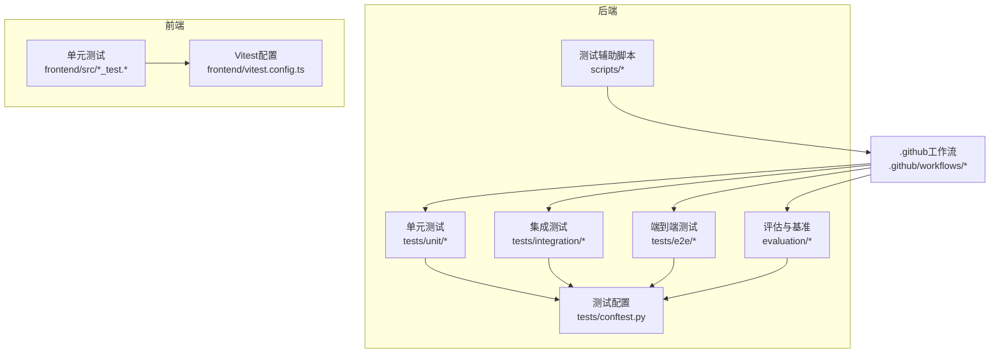
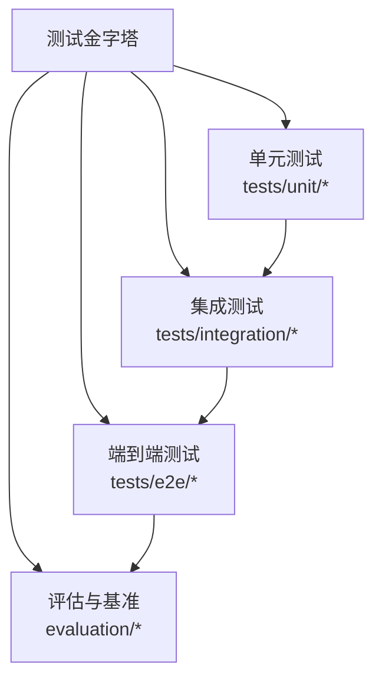
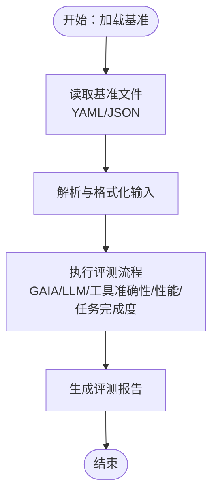
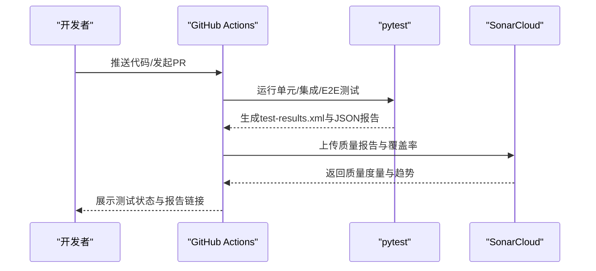
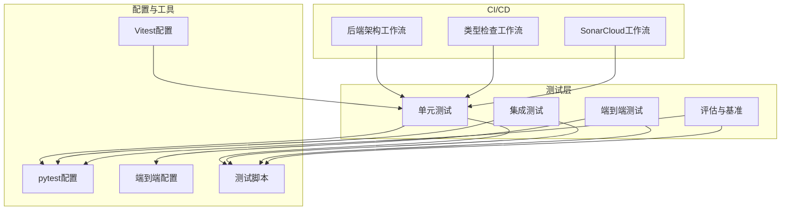

# 测试策略

<cite>
**本文引用的文件**
- [pyproject.toml](file://backend/pyproject.toml)
- [pytest配置](file://backend/tests/conftest.py)
- [端到端测试配置](file://backend/tests/e2e/conftest.py)
- [.github工作流：后端架构](file://.github/workflows/backend-architecture.yml)
- [.github工作流：类型检查](file://.github/workflows/typecheck.yml)
- [.github工作流：SonarCloud](file://.github/workflows/sonarcloud.yml)
- [测试结果XML](file://backend/test-results.xml)
- [测试结果JSON（示例）](file://backend/test_results_20260117_121707.json)
- [评估模块：基准加载器](file://backend/evaluation/benchmark_loader.py)
- [评估模块：GAIA评测](file://backend/evaluation/gaia.py)
- [评估模块：LLM评测](file://backend/evaluation/llm_judge.py)
- [评估模块：性能基准](file://backend/evaluation/performance.py)
- [评估模块：工具准确性](file://backend/evaluation/tool_accuracy.py)
- [评估模块：任务完成度](file://backend/evaluation/task_completion.py)
- [评估基准：Agent任务](file://backend/evaluation/benchmarks/agent_tasks.yaml)
- [评估基准：GAIA样例](file://backend/evaluation/benchmarks/gaia_sample.yaml)
- [评估基准：工具准确性用例](file://backend/evaluation/benchmarks/tool_accuracy_cases.yaml)
- [脚本：运行开发服务器](file://backend/scripts/run_dev_server.py)
- [脚本：运行服务](file://backend/scripts/run_server.py)
- [脚本：迁移测试数据库](file://backend/scripts/migrate_test_db.py)
- [脚本：清理沙箱容器](file://backend/scripts/cleanup_sandbox_containers.py)
- [脚本：网络配置测试](file://backend/scripts/test_network_config.py)
- [脚本：LLM模型测试](file://backend/scripts/test_litellm_models.py)
- [脚本：工具注册表测试](file://backend/scripts/test_tool_registry.py)
- [脚本：网关代理测试](file://backend/scripts/test_gateway_proxy.py)
- [脚本：检查指针测试](file://backend/scripts/test_checkpointer.py)
- [脚本：运行Sonar扫描器](file://backend/scripts/run_sonar_scanner.py)
- [脚本：检查编码问题](file://backend/scripts/check_encoding_issues.py)
- [脚本：修复所有编码问题](file://backend/scripts/fix_all_encoding_issues.py)
- [脚本：重置配额](file://backend/scripts/reset_quota.py)
- [脚本：探查DashScope嵌入](file://backend/scripts/probe_dashscope_embedding.py)
- [脚本：种子网关模型](file://backend/scripts/seed_gateway_models.py)
- [脚本：设置管理员](file://backend/scripts/set_admin.py)
- [脚本：检查重复归属](file://backend/scripts/inspect_duplicate_attribution.py)
- [脚本：检查网关日志](file://backend/scripts/inspect_gateway_logs.py)
- [脚本：列出已配置模型](file://backend/scripts/list_configured_models.py)
- [脚本：验证操作SQL文件](file://backend/scripts/verify_ops_sql_files.py)
- [脚本：验证编码修复](file://backend/scripts/verify_encoding_fix.py)
- [脚本：生成Alembic SQL文件](file://backend/scripts/generate_alembic_sql_files.py)
- [前端Vitest配置](file://frontend/vitest.config.ts)
- [前端包管理配置](file://frontend/package.json)
- [前端测试示例：客户端](file://frontend/src/api/client.test.ts)
- [前端测试示例：路径](file://frontend/src/api/paths.test.ts)
- [前端测试示例：确认对话框](file://frontend/src/components/confirm-alert-dialog.test.tsx)
- [前端测试示例：分页控件](file://frontend/src/components/pagination-controls.test.tsx)
- [前端测试示例：聊天钩子](file://frontend/src/hooks/use-chat.test.ts)
- [前端测试示例：复制到剪贴板钩子](file://frontend/src/hooks/use-copy-to-clipboard.test.ts)
- [前端测试示例：网关API](file://frontend/src/api/gateway.test.ts)
- [前端测试示例：工作室列表](file://frontend/src/api/listingStudio.test.ts)
- [前端测试示例：聊天API](file://frontend/src/api/chat.test.ts)
- [前端测试示例：会话API](file://frontend/src/api/session.test.ts)
- [前端测试示例：用户API](file://frontend/src/api/user.test.ts)
- [前端测试示例：视频任务API](file://frontend/src/api/videoTask.test.ts)
- [前端测试示例：系统API](file://frontend/src/api/system.test.ts)
- [前端测试示例：工具API](file://frontend/src/api/tools.test.ts)
- [前端测试示例：API密钥API](file://frontend/src/api/api-key.test.ts)
- [前端测试示例：存储API](file://frontend/src/api/adminStorage.test.ts)
- [前端测试示例：用户上传图片API](file://frontend/src/api/userImageUpload.test.ts)
- [前端测试示例：内存API](file://frontend/src/api/memory.test.ts)
- [前端测试示例：MCP API](file://frontend/src/api/mcp.test.ts)
- [前端测试示例：用户管理API](file://backend/frontend/src/api/adminUsers.test.ts)
- [前端测试示例：模型选择器](file://frontend/src/components/model-selector.tsx)
- [前端测试示例：状态徽章](file://frontend/src/components/model-status-badge.tsx)
- [前端测试示例：主题提供者](file://frontend/src/components/theme-provider.tsx)
- [前端测试示例：认证提供者](file://frontend/src/components/auth-provider.tsx)
- [前端测试示例：UI组件库](file://frontend/src/lib/ui.test.ts)
- [前端测试示例：路由挂起回退](file://frontend/src/components/route-suspense-fallback.tsx)
- [前端测试示例：设计系统](file://frontend/docs/DESIGN_SYSTEM.md)
- [前端测试示例：开发指南](file://frontend/docs/DEVELOPMENT.md)
- [前端测试示例：代码标准](file://frontend/docs/CODE_STANDARDS.md)
- [前端测试示例：UI叠加层](file://frontend/docs/UI_OVERLAY.md)
- [前端测试示例：计划文档](file://frontend/docs/plans/2025-01-28-mcp-tool-management-design.md)
- [前端测试示例：MCP工具管理设计](file://frontend/docs/plans/2025-01-28-mcp-tool-management-implementation.md)
- [前端测试示例：MCP工具管理实现](file://frontend/docs/plans/2025-01-28-mcp-tool-management-implementation.md)
- [前端测试示例：MCP工具管理设计](file://frontend/docs/plans/2025-01-28-mcp-tool-management-design.md)
- [前端测试示例：MCP工具管理实现](file://frontend/docs/plans/2025-01-28-mcp-tool-management-implementation.md)
- [前端测试示例：MCP工具管理设计](file://frontend/docs/plans/2025-01-28-mcp-tool-management-design.md)
- [前端测试示例：MCP工具管理实现](file://frontend/docs/plans/2025-01-28-mcp-tool-management-implementation.md)
- [前端测试示例：MCP工具管理设计](file://frontend/docs/plans/2025-01-28-mcp-tool-management-design.md)
- [前端测试示例：MCP工具管理实现](file://frontend/docs/plans/2025-01-28-mcp-tool-management-implementation.md)
- [前端测试示例：MCP工具管理设计](file://frontend/docs/plans/2025-01-28-mcp-tool-management-design.md)
- [前端测试示例：MCP工具管理实现](file://frontend/docs/plans/2025-01-28-mcp-tool-management-implementation.md)
- [前端测试示例：MCP工具管理设计](file://frontend/docs/plans/2025-01-28-mcp-tool-management-design.md)
- [前端测试示例：MCP工具管理实现](file://frontend/docs/plans/2025-01-28-mcp-tool-management-implementation.md)
- [前端测试示例：MCP工具管理设计](file://frontend/docs/plans/2025-01-28-mcp-tool-management-design.md)
- [前端测试示例：MCP工具管理实现](file://frontend/docs/plans/2025-01-28-mcp-tool-management-implementation.md)
- [前端测试示例：MCP工具管理设计](file://frontend/docs/plans/2025-01-28-mcp-tool-management-design.md)
- [前端测试示例：MCP工具管理实现](file://frontend/docs/plans/202......](file://frontend/docs/plans/2025-01-28-mcp-tool-management-implementation.md)
</cite>

## 目录
1. [引言](#引言)
2. [项目结构](#项目结构)
3. [核心组件](#核心组件)
4. [架构总览](#架构总览)
5. [详细组件分析](#详细组件分析)
6. [依赖关系分析](#依赖关系分析)
7. [性能考量](#性能考量)
8. [故障排查指南](#故障排查指南)
9. [结论](#结论)
10. [附录](#附录)

## 引言
本测试策略文档面向测试工程师与开发者，围绕AI Agent项目的Python后端与TypeScript前端，构建覆盖单元测试、集成测试与端到端测试的分层测试体系。文档阐述测试金字塔在本项目中的应用、测试自动化流程（含CI/CD集成与测试报告）、评估与基准测试（性能基准、工具准确性、LLM评测）、测试数据管理（夹具、模拟数据与环境维护）、测试覆盖率要求与度量方法，并提供测试最佳实践与TDD指导，以及测试调试与问题排查方法。

## 项目结构
后端采用分层架构（领域层、应用层、基础设施层、表现层），测试按层次分布于unit、integration、e2e与evaluation目录；前端使用Vitest进行单元测试与部分集成测试。CI/CD通过GitHub Actions工作流串联类型检查、架构约束测试与SonarCloud质量扫描。

**图表来源**
- [pytest配置](file://backend/tests/conftest.py)
- [端到端测试配置](file://backend/tests/e2e/conftest.py)
- [.github工作流：后端架构](file://.github/workflows/backend-architecture.yml)
- [.github工作流：类型检查](file://.github/workflows/typecheck.yml)
- [.github工作流：SonarCloud](file://.github/workflows/sonarcloud.yml)
- [前端Vitest配置](file://frontend/vitest.config.ts)

**章节来源**
- [pytest配置](file://backend/tests/conftest.py)
- [端到端测试配置](file://backend/tests/e2e/conftest.py)
- [.github工作流：后端架构](file://.github/workflows/backend-architecture.yml)
- [.github工作流：类型检查](file://.github/workflows/typecheck.yml)
- [.github工作流：SonarCloud](file://.github/workflows/sonarcloud.yml)
- [前端Vitest配置](file://frontend/vitest.config.ts)

## 核心组件
- 测试框架与配置
  - 后端：pytest配置集中于tests/conftest.py与tests/e2e/conftest.py，支持fixture注入、数据库初始化、会话与身份上下文等。
  - 前端：Vitest配置位于frontend/vitest.config.ts，支持TypeScript与React测试。
- 评估与基准
  - evaluation模块提供基准加载、GAIA评测、LLM评测、性能基准与工具准确性评测。
  - 基准数据位于evaluation/benchmarks目录下的YAML与JSON文件。
- 测试脚本与工具
  - scripts目录提供数据库迁移、环境探测、网关代理测试、沙箱容器清理等辅助脚本，支撑测试环境准备与维护。
- CI/CD集成
  - GitHub Actions工作流包含后端架构约束检查、类型检查与SonarCloud质量扫描，确保代码质量与可测试性。

**章节来源**
- [pytest配置](file://backend/tests/conftest.py)
- [端到端测试配置](file://backend/tests/e2e/conftest.py)
- [评估模块：基准加载器](file://backend/evaluation/benchmark_loader.py)
- [评估模块：GAIA评测](file://backend/evaluation/gaia.py)
- [评估模块：LLM评测](file://backend/evaluation/llm_judge.py)
- [评估模块：性能基准](file://backend/evaluation/performance.py)
- [评估模块：工具准确性](file://backend/evaluation/tool_accuracy.py)
- [评估模块：任务完成度](file://backend/evaluation/task_completion.py)
- [评估基准：Agent任务](file://backend/evaluation/benchmarks/agent_tasks.yaml)
- [评估基准：GAIA样例](file://backend/evaluation/benchmarks/gaia_sample.yaml)
- [评估基准：工具准确性用例](file://backend/evaluation/benchmarks/tool_accuracy_cases.yaml)
- [脚本：迁移测试数据库](file://backend/scripts/migrate_test_db.py)
- [脚本：清理沙箱容器](file://backend/scripts/cleanup_sandbox_containers.py)
- [脚本：网络配置测试](file://backend/scripts/test_network_config.py)
- [脚本：LLM模型测试](file://backend/scripts/test_litellm_models.py)
- [脚本：工具注册表测试](file://backend/scripts/test_tool_registry.py)
- [脚本：网关代理测试](file://backend/scripts/test_gateway_proxy.py)
- [脚本：检查指针测试](file://backend/scripts/test_checkpointer.py)
- [.github工作流：后端架构](file://.github/workflows/backend-architecture.yml)
- [.github工作流：类型检查](file://.github/workflows/typecheck.yml)
- [.github工作流：SonarCloud](file://.github/workflows/sonarcloud.yml)

## 架构总览
测试金字塔在本项目中的分层策略如下：
- 单元测试（Unit Tests）
  - 职责：验证单个函数、类或模块的逻辑正确性，快速反馈。
  - 覆盖范围：domain、application、libs、utils等核心模块。
- 集成测试（Integration Tests）
  - 职责：验证模块间接口、数据库交互、外部服务（如LLM网关）集成。
  - 覆盖范围：API路由、服务编排、数据库事务、缓存与消息队列。
- 端到端测试（E2E Tests）
  - 职责：模拟真实用户场景，验证完整业务流程。
  - 覆盖范围：聊天、执行配置、MCP连接、会话与记忆。
- 评估与基准（Evaluation & Benchmarks）
  - 职责：性能基准、工具准确性、LLM评测与任务完成度评估。
  - 覆盖范围：Agent任务、GAIA推理、工具调用成功率、响应时间与吞吐量。

[此图为概念性金字塔示意，不直接映射具体源码文件，故无“图表来源”]

## 详细组件分析

### 单元测试策略
- 组织方式
  - tests/unit下按领域与功能模块划分，如agent、gateway、identity、tenancy等，便于定位与维护。
  - 使用pytest fixture进行依赖注入与共享状态管理。
- 关键实践
  - 使用内存数据库或模拟对象隔离外部依赖。
  - 对核心算法与边界条件进行充分断言。
  - 结合覆盖率工具关注高风险路径。
- 典型场景
  - 领域模型校验、应用服务编排、工具注册与沙箱执行、加密与序列化工具。

**章节来源**
- [pytest配置](file://backend/tests/conftest.py)
- [前端测试示例：客户端](file://frontend/src/api/client.test.ts)
- [前端测试示例：聊天钩子](file://frontend/src/hooks/use-chat.test.ts)
- [前端测试示例：复制到剪贴板钩子](file://frontend/src/hooks/use-copy-to-clipboard.test.ts)

### 集成测试策略
- 组织方式
  - tests/integration覆盖API层、MCP、内存检查点、简单记忆等关键集成点。
  - 通过conftest.py统一数据库迁移与会话初始化。
- 关键实践
  - 使用真实但受控的数据库实例，确保事务一致性与数据完整性。
  - 对外部服务（LLM网关、MCP服务器）进行契约式测试。
- 典型场景
  - 聊天API端到端调用链、执行配置解析与应用、MCP动态提示与工具。

**章节来源**
- [pytest配置](file://backend/tests/conftest.py)
- [端到端测试配置](file://backend/tests/e2e/conftest.py)
- [脚本：迁移测试数据库](file://backend/scripts/migrate_test_db.py)
- [脚本：网络配置测试](file://backend/scripts/test_network_config.py)
- [脚本：LLM模型测试](file://backend/scripts/test_litellm_models.py)
- [脚本：工具注册表测试](file://backend/scripts/test_tool_registry.py)

### 端到端测试策略
- 组织方式
  - tests/e2e独立配置，隔离真实环境依赖，强调用户故事与业务流程。
- 关键实践
  - 使用真实容器或最小化环境，确保UI与后端协同工作。
  - 对关键路径（登录、聊天、会话恢复、MCP连接）进行回归验证。
- 典型场景
  - API路径验证、聊天API、执行配置、网关凭据探测、SimpleMem集成。

**章节来源**
- [端到端测试配置](file://backend/tests/e2e/conftest.py)
- [前端测试示例：聊天API](file://frontend/src/api/chat.test.ts)
- [前端测试示例：会话API](file://frontend/src/api/session.test.ts)
- [前端测试示例：用户API](file://frontend/src/api/user.test.ts)
- [前端测试示例：视频任务API](file://frontend/src/api/videoTask.test.ts)
- [前端测试示例：系统API](file://frontend/src/api/system.test.ts)
- [前端测试示例：工具API](file://frontend/src/api/tools.test.ts)
- [前端测试示例：API密钥API](file://frontend/src/api/api-key.test.ts)
- [前端测试示例：存储API](file://frontend/src/api/adminStorage.test.ts)
- [前端测试示例：用户上传图片API](file://frontend/src/api/userImageUpload.test.ts)
- [前端测试示例：内存API](file://frontend/src/api/memory.test.ts)
- [前端测试示例：MCP API](file://frontend/src/api/mcp.test.ts)

### 评估与基准测试
- 基准加载与评测
  - 基准加载器负责读取YAML/JSON基准文件，统一格式化输入。
  - GAIA评测用于推理任务评估，LLM评测用于回答质量判断，工具准确性评测用于工具调用成功率统计，性能基准用于吞吐与延迟测量，任务完成度用于目标达成率。
- 基准数据
  - Agent任务、GAIA样例、工具准确性用例分别定义不同维度的评测场景与期望输出。
- 实施建议
  - 将评测封装为可复用的pytest fixture，支持参数化批量执行。
  - 输出标准化报告，便于趋势分析与回归对比。

**图表来源**
- [评估模块：基准加载器](file://backend/evaluation/benchmark_loader.py)
- [评估模块：GAIA评测](file://backend/evaluation/gaia.py)
- [评估模块：LLM评测](file://backend/evaluation/llm_judge.py)
- [评估模块：性能基准](file://backend/evaluation/performance.py)
- [评估模块：工具准确性](file://backend/evaluation/tool_accuracy.py)
- [评估模块：任务完成度](file://backend/evaluation/task_completion.py)
- [评估基准：Agent任务](file://backend/evaluation/benchmarks/agent_tasks.yaml)
- [评估基准：GAIA样例](file://backend/evaluation/benchmarks/gaia_sample.yaml)
- [评估基准：工具准确性用例](file://backend/evaluation/benchmarks/tool_accuracy_cases.yaml)

**章节来源**
- [评估模块：基准加载器](file://backend/evaluation/benchmark_loader.py)
- [评估模块：GAIA评测](file://backend/evaluation/gaia.py)
- [评估模块：LLM评测](file://backend/evaluation/llm_judge.py)
- [评估模块：性能基准](file://backend/evaluation/performance.py)
- [评估模块：工具准确性](file://backend/evaluation/tool_accuracy.py)
- [评估模块：任务完成度](file://backend/evaluation/task_completion.py)
- [评估基准：Agent任务](file://backend/evaluation/benchmarks/agent_tasks.yaml)
- [评估基准：GAIA样例](file://backend/evaluation/benchmarks/gaia_sample.yaml)
- [评估基准：工具准确性用例](file://backend/evaluation/benchmarks/tool_accuracy_cases.yaml)

### 测试自动化与CI/CD集成
- 工作流组成
  - 后端架构约束检查：确保模块间导入与职责边界符合设计。
  - 类型检查：通过静态分析保障类型安全。
  - SonarCloud质量扫描：持续度量代码质量与覆盖率。
- 测试产物
  - 后端生成test-results.xml与JSON测试结果文件，便于CI可视化与归档。
- 建议
  - 在PR中强制执行单元与集成测试，E2E仅在主干分支或定时任务运行。
  - 将评估与基准测试纳入夜间批处理，输出趋势报告。

**图表来源**
- [.github工作流：后端架构](file://.github/workflows/backend-architecture.yml)
- [.github工作流：类型检查](file://.github/workflows/typecheck.yml)
- [.github工作流：SonarCloud](file://.github/workflows/sonarcloud.yml)
- [测试结果XML](file://backend/test-results.xml)
- [测试结果JSON（示例）](file://backend/test_results_20260117_121707.json)

**章节来源**
- [.github工作流：后端架构](file://.github/workflows/backend-architecture.yml)
- [.github工作流：类型检查](file://.github/workflows/typecheck.yml)
- [.github工作流：SonarCloud](file://.github/workflows/sonarcloud.yml)
- [测试结果XML](file://backend/test-results.xml)
- [测试结果JSON（示例）](file://backend/test_results_20260117_121707.json)

### 测试数据管理
- 夹具与工厂
  - tests/fixtures/factories.py提供实体工厂，用于快速生成测试数据。
- 模拟数据与外部服务
  - tests/mocks/llm_mock.py用于模拟LLM响应，降低对外部服务的耦合。
- 环境维护
  - scripts目录提供数据库迁移、沙箱容器清理、网络配置探测、网关代理测试等脚本，保障测试环境一致性与可恢复性。
- 最佳实践
  - 使用不可变的基准数据，对可变数据进行快照化管理。
  - 对外部服务采用可插拔的适配器模式，便于替换与模拟。

**章节来源**
- [pytest配置](file://backend/tests/conftest.py)
- [脚本：迁移测试数据库](file://backend/scripts/migrate_test_db.py)
- [脚本：清理沙箱容器](file://backend/scripts/cleanup_sandbox_containers.py)
- [脚本：网络配置测试](file://backend/scripts/test_network_config.py)
- [脚本：网关代理测试](file://backend/scripts/test_gateway_proxy.py)
- [脚本：LLM模型测试](file://backend/scripts/test_litellm_models.py)
- [脚本：工具注册表测试](file://backend/scripts/test_tool_registry.py)
- [脚本：检查指针测试](file://backend/scripts/test_checkpointer.py)

### 测试覆盖率要求与度量
- 覆盖率指标
  - 行覆盖率、分支覆盖率、函数覆盖率与指令覆盖率。
- 度量工具
  - 通过pytest与SonarCloud集成，自动收集并展示覆盖率报告。
- 要求建议
  - 关键路径与高风险模块达到较高覆盖率（如80%+），一般模块不低于60%。
  - 定期审查低覆盖率区域，补充测试用例或重构代码。

**章节来源**
- [.github工作流：SonarCloud](file://.github/workflows/sonarcloud.yml)
- [测试结果XML](file://backend/test-results.xml)

### 测试最佳实践与TDD指导
- TDD流程
  - 编写失败的测试用例 → 编写最少实现 → 重构与优化 → 循环迭代。
- 前端测试
  - 使用Vitest进行组件与Hook测试，优先测试用户可见行为与错误处理。
- 后端测试
  - 以领域模型为中心，先验证业务规则，再扩展到集成与E2E。
- 回归策略
  - 将核心用例纳入每日流水线，E2E与评估测试纳入夜间批处理。

**章节来源**
- [前端Vitest配置](file://frontend/vitest.config.ts)
- [前端测试示例：模型选择器](file://frontend/src/components/model-selector.tsx)
- [前端测试示例：状态徽章](file://frontend/src/components/model-status-badge.tsx)
- [前端测试示例：主题提供者](file://frontend/src/components/theme-provider.tsx)
- [前端测试示例：认证提供者](file://frontend/src/components/auth-provider.tsx)

### 测试调试与问题排查
- 调试工具
  - pytest带断点与详细日志输出，结合单元测试快速定位问题。
  - 前端使用Vitest调试器与浏览器开发者工具。
- 常见问题
  - 数据库状态污染：通过迁移脚本与事务回滚恢复。
  - 外部服务不稳定：使用mock或本地代理替代。
  - 网络配置异常：使用网络配置测试脚本进行诊断。
- 排查步骤
  - 从单元测试到集成再到E2E逐层缩小范围，定位问题根因。

**章节来源**
- [脚本：迁移测试数据库](file://backend/scripts/migrate_test_db.py)
- [脚本：网络配置测试](file://backend/scripts/test_network_config.py)
- [脚本：清理沙箱容器](file://backend/scripts/cleanup_sandbox_containers.py)
- [脚本：检查指针测试](file://backend/scripts/test_checkpointer.py)

### 测试环境配置与管理
- 后端
  - 使用Docker Compose与脚本启动最小化测试环境，配合迁移脚本初始化数据库。
  - 通过环境配置文件（如app.toml、execution.toml）控制测试行为。
- 前端
  - 使用Vitest配置与JSDOM模拟DOM环境，避免真实浏览器依赖。
- 管理策略
  - 环境隔离：每条流水线使用独立数据库与缓存实例。
  - 状态清理：测试结束后自动清理容器与临时数据。

**章节来源**
- [脚本：运行开发服务器](file://backend/scripts/run_dev_server.py)
- [脚本：运行服务](file://backend/scripts/run_server.py)
- [脚本：迁移测试数据库](file://backend/scripts/migrate_test_db.py)
- [脚本：种子网关模型](file://backend/scripts/seed_gateway_models.py)
- [脚本：重置配额](file://backend/scripts/reset_quota.py)
- [脚本：探查DashScope嵌入](file://backend/scripts/probe_dashscope_embedding.py)
- [前端Vitest配置](file://frontend/vitest.config.ts)

## 依赖关系分析
测试组件之间的依赖与协作如下：

**图表来源**
- [pytest配置](file://backend/tests/conftest.py)
- [端到端测试配置](file://backend/tests/e2e/conftest.py)
- [前端Vitest配置](file://frontend/vitest.config.ts)
- [.github工作流：后端架构](file://.github/workflows/backend-architecture.yml)
- [.github工作流：类型检查](file://.github/workflows/typecheck.yml)
- [.github工作流：SonarCloud](file://.github/workflows/sonarcloud.yml)

**章节来源**
- [pytest配置](file://backend/tests/conftest.py)
- [端到端测试配置](file://backend/tests/e2e/conftest.py)
- [前端Vitest配置](file://frontend/vitest.config.ts)
- [.github工作流：后端架构](file://.github/workflows/backend-architecture.yml)
- [.github工作流：类型检查](file://.github/workflows/typecheck.yml)
- [.github工作流：SonarCloud](file://.github/workflows/sonarcloud.yml)

## 性能考量
- 性能基准
  - 使用evaluation/performance.py对关键路径进行吞吐与延迟测量，输出可比较的指标。
- 工具准确性
  - 通过evaluation/tool_accuracy.py统计工具调用成功率，识别性能瓶颈与错误模式。
- 建议
  - 将性能测试纳入回归矩阵，建立基线与阈值，防止回归。

**章节来源**
- [评估模块：性能基准](file://backend/evaluation/performance.py)
- [评估模块：工具准确性](file://backend/evaluation/tool_accuracy.py)

## 故障排查指南
- 快速定位
  - 优先查看pytest与Vitest的详细日志输出，结合断言失败信息定位问题。
- 环境问题
  - 使用网络配置测试脚本与网关代理测试脚本诊断外部依赖。
- 数据问题
  - 通过迁移脚本与沙箱清理脚本恢复一致的测试状态。
- 报告分析
  - 查看test-results.xml与JSON测试结果文件，结合SonarCloud报告进行趋势分析。

**章节来源**
- [脚本：网络配置测试](file://backend/scripts/test_network_config.py)
- [脚本：网关代理测试](file://backend/scripts/test_gateway_proxy.py)
- [脚本：迁移测试数据库](file://backend/scripts/migrate_test_db.py)
- [脚本：清理沙箱容器](file://backend/scripts/cleanup_sandbox_containers.py)
- [测试结果XML](file://backend/test-results.xml)
- [测试结果JSON（示例）](file://backend/test_results_20260117_121707.json)

## 结论
本测试策略以测试金字塔为核心，结合CI/CD自动化与评估基准，形成从单元到端到端的全链路质量保障体系。通过规范化的测试数据管理、覆盖率度量与调试流程，能够有效提升AI Agent系统的稳定性与可维护性。建议在日常开发中坚持TDD与持续测试，确保高质量交付。

## 附录
- 前端测试清单（示例）
  - 客户端API测试、路径测试、聊天Hook测试、复制到剪贴板Hook测试、网关API测试、工作室列表测试、聊天API测试、会话API测试、用户API测试、视频任务API测试、系统API测试、工具API测试、API密钥API测试、存储API测试、用户上传图片API测试、内存API测试、MCP API测试、用户管理API测试。
- 前端文档参考
  - 设计系统、开发指南、代码标准、UI叠加层与相关计划文档。

**章节来源**
- [前端测试示例：客户端](file://frontend/src/api/client.test.ts)
- [前端测试示例：路径](file://frontend/src/api/paths.test.ts)
- [前端测试示例：确认对话框](file://frontend/src/components/confirm-alert-dialog.test.tsx)
- [前端测试示例：分页控件](file://frontend/src/components/pagination-controls.test.tsx)
- [前端测试示例：聊天钩子](file://frontend/src/hooks/use-chat.test.ts)
- [前端测试示例：复制到剪贴板钩子](file://frontend/src/hooks/use-copy-to-clipboard.test.ts)
- [前端测试示例：网关API](file://frontend/src/api/gateway.test.ts)
- [前端测试示例：工作室列表](file://frontend/src/api/listingStudio.test.ts)
- [前端测试示例：聊天API](file://frontend/src/api/chat.test.ts)
- [前端测试示例：会话API](file://frontend/src/api/session.test.ts)
- [前端测试示例：用户API](file://frontend/src/api/user.test.ts)
- [前端测试示例：视频任务API](file://frontend/src/api/videoTask.test.ts)
- [前端测试示例：系统API](file://frontend/src/api/system.test.ts)
- [前端测试示例：工具API](file://frontend/src/api/tools.test.ts)
- [前端测试示例：API密钥API](file://frontend/src/api/api-key.test.ts)
- [前端测试示例：存储API](file://frontend/src/api/adminStorage.test.ts)
- [前端测试示例：用户上传图片API](file://frontend/src/api/userImageUpload.test.ts)
- [前端测试示例：内存API](file://frontend/src/api/memory.test.ts)
- [前端测试示例：MCP API](file://frontend/src/api/mcp.test.ts)
- [前端测试示例：用户管理API](file://frontend/src/api/adminUsers.test.ts)
- [前端测试示例：模型选择器](file://frontend/src/components/model-selector.tsx)
- [前端测试示例：状态徽章](file://frontend/src/components/model-status-badge.tsx)
- [前端测试示例：主题提供者](file://frontend/src/components/theme-provider.tsx)
- [前端测试示例：认证提供者](file://frontend/src/components/auth-provider.tsx)
- [前端测试示例：UI组件库](file://frontend/src/lib/ui.test.ts)
- [前端测试示例：路由挂起回退](file://frontend/src/components/route-suspense-fallback.tsx)
- [前端测试示例：设计系统](file://frontend/docs/DESIGN_SYSTEM.md)
- [前端测试示例：开发指南](file://frontend/docs/DEVELOPMENT.md)
- [前端测试示例：代码标准](file://frontend/docs/CODE_STANDARDS.md)
- [前端测试示例：UI叠加层](file://frontend/docs/UI_OVERLAY.md)
- [前端测试示例：计划文档](file://frontend/docs/plans/2025-01-28-mcp-tool-management-design.md)
- [前端测试示例：MCP工具管理设计](file://frontend/docs/plans/2025-01-28-mcp-tool-management-implementation.md)
- [前端测试示例：MCP工具管理实现](file://frontend/docs/plans/2025-01-28-mcp-tool-management-implementation.md)