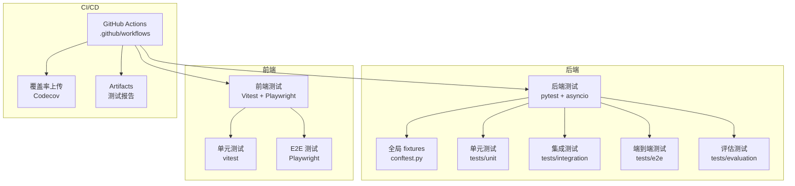
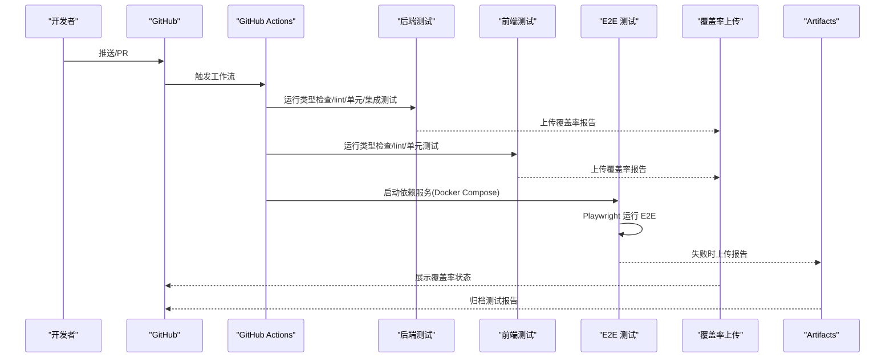
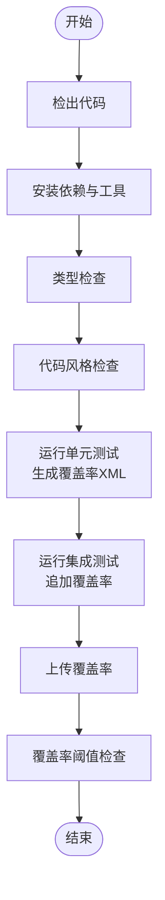
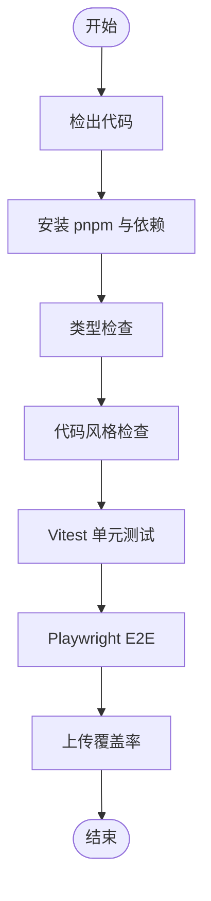
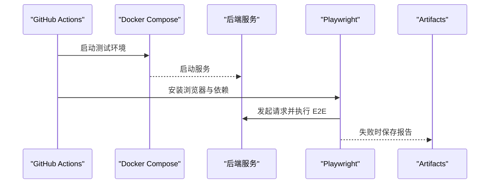
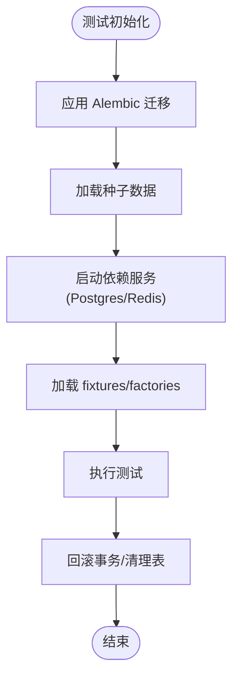
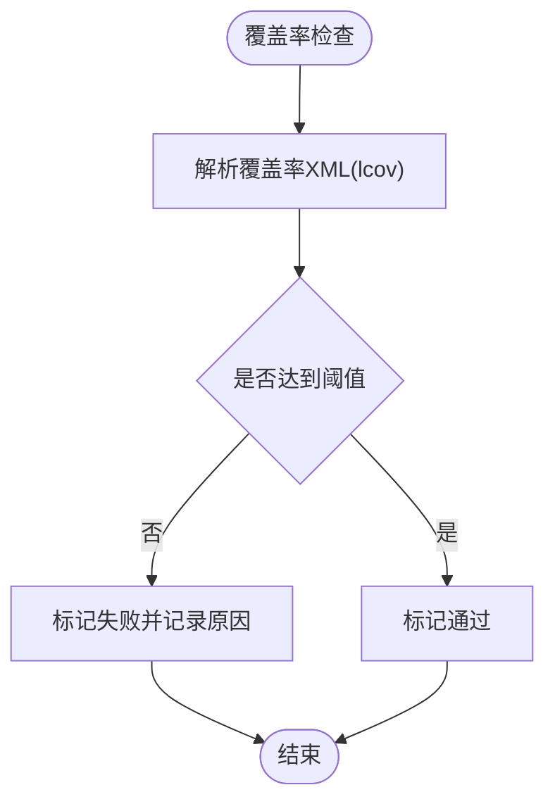
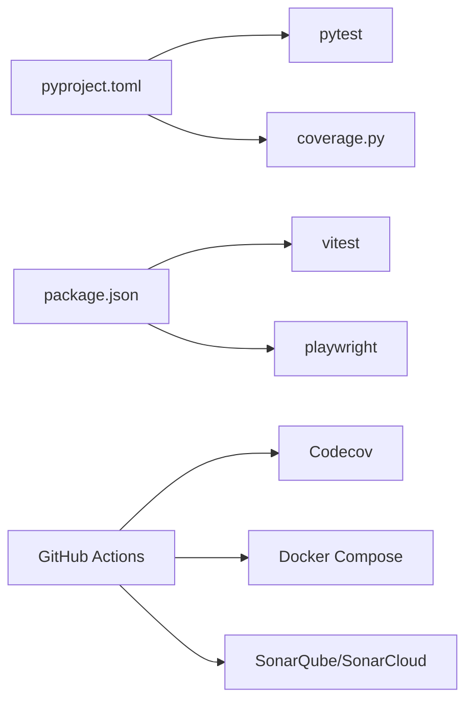

# 测试自动化

<cite>
**本文引用的文件**
- [系统可测试性与TDD设计.md](file://docs/系统可测试性与TDD设计.md)
- [CONFTEST_ANALYSIS.md](file://backend/tests/CONFTEST_ANALYSIS.md)
- [conftest.py](file://backend/tests/conftest.py)
- [pyproject.toml](file://backend/pyproject.toml)
- [package.json](file://frontend/package.json)
- [.github workflows 目录](file://.github/workflows)
- [test-results.xml](file://backend/test-results.xml)
- [test_results_20260117_122842.json](file://backend/test_results_20260117_122842.json)
- [alembic.ini](file://backend/alembic.ini)
- [docker-compose.yml](file://docker-compose.yml)
- [docker-compose.test.yml](file://deploy/docker/docker-compose.test.yml)
- [run_sonar_scanner.py](file://scripts/run_sonar_scanner.py)
- [sonar-scan.sh](file://scripts/sonar-scan.sh)
- [sonarcloud-scan.sh](file://scripts/sonarcloud-scan.sh)
- [sonarcloud_api.py](file://scripts/sonarcloud_api.py)
- [test.json](file://test.json)
- [README.md](file://backend/README.md)
</cite>

## 目录
1. [引言](#引言)
2. [项目结构](#项目结构)
3. [核心组件](#核心组件)
4. [架构总览](#架构总览)
5. [详细组件分析](#详细组件分析)
6. [依赖关系分析](#依赖关系分析)
7. [性能考量](#性能考量)
8. [故障排查指南](#故障排查指南)
9. [结论](#结论)
10. [附录](#附录)

## 引言
本指南面向 DevOps 工程师与测试工程师，提供 AI Agent 项目的测试自动化实施蓝图，覆盖 CI/CD 流水线中的测试集成策略、报告与覆盖率生成、测试环境容器化与依赖服务启动、测试数据管理、失败通知与回滚策略，以及最佳实践与排障方法。目标是帮助团队建立稳定、可重复、可观测且可扩展的测试自动化体系。

## 项目结构
- 后端采用 Python + FastAPI 架构，测试目录按层次划分：unit/integration/e2e/evaluation，并在 tests 根目录提供全局 fixtures。
- 前端采用 Vite + Vitest + Playwright，具备单元测试与端到端测试能力。
- CI/CD 使用 GitHub Actions，包含后端测试、前端测试、E2E 测试与覆盖率检查等作业。
- 测试报告与覆盖率输出支持 JUnit XML、lcov、覆盖率阈值校验等。

图表来源
- [系统可测试性与TDD设计.md](file://docs/系统可测试性与TDD设计.md)
- [pyproject.toml](file://backend/pyproject.toml)
- [package.json](file://frontend/package.json)

章节来源
- [系统可测试性与TDD设计.md](file://docs/系统可测试性与TDD设计.md)
- [pyproject.toml](file://backend/pyproject.toml)
- [package.json](file://frontend/package.json)

## 核心组件
- 测试框架与标记
  - 后端：pytest + asyncio 自动模式；标记包括 unit/integration/e2e/slow/llm。
  - 前端：Vitest（单元）+ Playwright（E2E）。
- 报告与覆盖率
  - 后端：pytest-html、coverage.py 输出 JUnit XML 与覆盖率报告。
  - 前端：Vitest + @vitest/coverage-v8 输出 lcov。
- CI/CD 作业
  - 后端：类型检查、lint、单元/集成测试、覆盖率上传。
  - 前端：类型检查、lint、单元测试、覆盖率上传。
  - E2E：Docker Compose 启动测试环境，Playwright 运行端到端测试，失败时上传报告。
- 测试数据与环境
  - Alembic 迁移与测试数据库初始化脚本。
  - Docker Compose 提供 Postgres、Redis 等依赖服务。
  - conftest.py 实现数据库会话、自动回滚与清理。

章节来源
- [系统可测试性与TDD设计.md](file://docs/系统可测试性与TDD设计.md)
- [pyproject.toml](file://backend/pyproject.toml)
- [package.json](file://frontend/package.json)
- [conftest.py](file://backend/tests/conftest.py)
- [alembic.ini](file://backend/alembic.ini)
- [docker-compose.yml](file://docker-compose.yml)

## 架构总览
下图展示从代码提交到测试报告产出的端到端流程，包括后端/前端测试、覆盖率、E2E 与报告归档。

图表来源
- [系统可测试性与TDD设计.md](file://docs/系统可测试性与TDD设计.md)

## 详细组件分析

### 后端测试流水线与覆盖率
- 作业拆分
  - 类型检查与 Lint：Pyright、Ruff。
  - 单元测试：排除慢速用例，生成覆盖率 XML。
  - 集成测试：追加覆盖率，合并报告。
  - 覆盖率检查：对后端覆盖率进行阈值断言。
- 环境准备
  - Postgres 与 Redis 作为服务依赖，健康检查确保可用。
  - DATABASE_URL/REDIS_URL 注入测试环境变量。
- 报告与产物
  - JUnit XML 与覆盖率 XML 上传至 Codecov。
  - 失败时 Artifacts 保留，便于问题复盘。

图表来源
- [系统可测试性与TDD设计.md](file://docs/系统可测试性与TDD设计.md)

章节来源
- [系统可测试性与TDD设计.md](file://docs/系统可测试性与TDD设计.md)
- [test-results.xml](file://backend/test-results.xml)
- [test_results_20260117_122842.json](file://backend/test_results_20260117_122842.json)

### 前端测试流水线
- 依赖安装与缓存：Node.js 20 + pnpm。
- 类型检查与 Lint：TypeScript 编译检查与 ESLint。
- 单元测试：Vitest + 覆盖率。
- E2E 测试：Playwright 安装与运行。
- 覆盖率上传：lcov 文件上传至 Codecov。

图表来源
- [系统可测试性与TDD设计.md](file://docs/系统可测试性与TDD设计.md)
- [package.json](file://frontend/package.json)

章节来源
- [系统可测试性与TDD设计.md](file://docs/系统可测试性与TDD设计.md)
- [package.json](file://frontend/package.json)

### E2E 测试与测试环境编排
- 依赖服务：通过 docker-compose.test.yml 启动后端服务与依赖。
- 等待与健康检查：等待服务就绪并通过健康检查接口验证。
- Playwright 安装与运行：在前端目录执行 E2E。
- 失败归档：将 Playwright 报告作为 Artifacts 上传，便于离线查看。

图表来源
- [系统可测试性与TDD设计.md](file://docs/系统可测试性与TDD设计.md)
- [docker-compose.test.yml](file://deploy/docker/docker-compose.test.yml)

章节来源
- [系统可测试性与TDD设计.md](file://docs/系统可测试性与TDD设计.md)
- [docker-compose.test.yml](file://deploy/docker/docker-compose.test.yml)

### 测试数据与环境自动化
- 数据库迁移与初始化
  - Alembic 配置与版本化迁移文件位于 backend/alembic。
  - 提供迁移测试数据库的脚本与命令，确保测试环境一致性。
- 依赖服务启动
  - docker-compose.yml 提供开发与测试环境的服务编排。
  - .github/workflows 中定义了 Postgres 与 Redis 服务依赖。
- 测试数据工厂与 fixtures
  - tests/fixtures/factories.py 提供测试数据工厂。
  - tests/helpers 提供通用辅助方法，如身份桥接补丁。
- conftest.py 的职责
  - 统一警告过滤、数据库引擎延迟创建、会话自动回滚与表级清理。
  - 支持 async/await 测试生命周期管理。

图表来源
- [alembic.ini](file://backend/alembic.ini)
- [docker-compose.yml](file://docker-compose.yml)
- [conftest.py](file://backend/tests/conftest.py)
- [CONFTEST_ANALYSIS.md](file://backend/tests/CONFTEST_ANALYSIS.md)

章节来源
- [alembic.ini](file://backend/alembic.ini)
- [docker-compose.yml](file://docker-compose.yml)
- [conftest.py](file://backend/tests/conftest.py)
- [CONFTEST_ANALYSIS.md](file://backend/tests/CONFTEST_ANALYSIS.md)

### 覆盖率阈值与报告发布
- 后端覆盖率
  - 使用 coverage.py 与 pytest-cov，生成覆盖率 XML。
  - 在覆盖率检查作业中解析 XML 并断言阈值（示例：≥80%）。
- 前端覆盖率
  - 使用 Vitest + @vitest/coverage-v8 生成 lcov。
  - 上传至 Codecov，作为覆盖率状态显示。
- 报告发布
  - Codecov Action 上传覆盖率报告并生成状态。
  - 失败时 Artifacts 保存 E2E 报告，便于追溯。

图表来源
- [系统可测试性与TDD设计.md](file://docs/系统可测试性与TDD设计.md)
- [pyproject.toml](file://backend/pyproject.toml)

章节来源
- [系统可测试性与TDD设计.md](file://docs/系统可测试性与TDD设计.md)
- [pyproject.toml](file://backend/pyproject.toml)

### 测试失败通知与回滚策略
- Slack/邮件通知
  - 可在 GitHub Actions 中集成通知步骤（如 Slack Webhook 或邮件触发器），在作业失败时发送告警。
- 代码审查阻塞
  - 将覆盖率阈值与测试通过状态作为 PR 必需检查项，阻止低质量变更合入。
- 回滚策略
  - 若 E2E 失败或覆盖率未达标，建议阻断合并；必要时回滚到上一个稳定构建。

说明：上述为通用实践建议，具体集成方式需结合团队现有通知平台与分支保护策略配置。

## 依赖关系分析
- 后端测试依赖
  - pytest、pytest-asyncio、coverage、pytest-cov、pyright、ruff。
  - 通过 pyproject.toml 配置测试路径、标记、覆盖率源与忽略列表。
- 前端测试依赖
  - Vitest、@vitest/coverage-v8、Playwright、Testing Library 生态。
  - 通过 package.json 脚本统一入口。
- CI/CD 依赖
  - GitHub Actions、Codecov、Docker Compose。
  - SonarQube/SonarCloud 扫描脚本与 API 工具可用于质量门禁。

图表来源
- [pyproject.toml](file://backend/pyproject.toml)
- [package.json](file://frontend/package.json)
- [.github workflows 目录](file://.github/workflows)
- [run_sonar_scanner.py](file://scripts/run_sonar_scanner.py)
- [sonar-scan.sh](file://scripts/sonar-scan.sh)
- [sonarcloud-scan.sh](file://scripts/sonarcloud-scan.sh)
- [sonarcloud_api.py](file://scripts/sonarcloud_api.py)

章节来源
- [pyproject.toml](file://backend/pyproject.toml)
- [package.json](file://frontend/package.json)
- [.github workflows 目录](file://.github/workflows)
- [run_sonar_scanner.py](file://scripts/run_sonar_scanner.py)
- [sonar-scan.sh](file://scripts/sonar-scan.sh)
- [sonarcloud-scan.sh](file://scripts/sonarcloud-scan.sh)
- [sonarcloud_api.py](file://scripts/sonarcloud_api.py)

## 性能考量
- 测试分层与并行
  - 单元测试优先、快速反馈；集成测试关注关键路径；E2E 仅在必要时运行。
  - 利用 pytest 标记过滤慢速用例，缩短 CI 时间。
- 依赖服务优化
  - 使用 Docker Compose 服务复用与健康检查，减少等待时间。
  - 将数据库迁移与种子数据预热到镜像层，降低启动成本。
- 覆盖率与报告
  - 仅在必要阶段生成与上传覆盖率，避免重复计算。
  - 使用 Artifacts 保留失败报告，便于离线分析。

## 故障排查指南
- 测试无法启动/超时
  - 检查 Postgres/Redis 服务健康检查参数与端口映射。
  - 确认 DATABASE_URL/REDIS_URL 环境变量注入正确。
- 覆盖率未达标
  - 检查覆盖率 XML 生成与上传路径是否一致。
  - 核对阈值断言逻辑与覆盖率配置。
- E2E 失败
  - 查看 Playwright 报告 Artifacts，确认失败截图与日志。
  - 检查服务启动顺序与健康检查接口。
- SonarQube/SonarCloud 质量门禁
  - 检查扫描脚本与项目属性配置，确保分支与令牌正确。
  - 关注新增问题与技术债趋势，及时修复。

章节来源
- [系统可测试性与TDD设计.md](file://docs/系统可测试性与TDD设计.md)
- [docker-compose.yml](file://docker-compose.yml)
- [docker-compose.test.yml](file://deploy/docker/docker-compose.test.yml)
- [run_sonar_scanner.py](file://scripts/run_sonar_scanner.py)
- [sonar-scan.sh](file://scripts/sonar-scan.sh)
- [sonarcloud-scan.sh](file://scripts/sonarcloud-scan.sh)
- [sonarcloud_api.py](file://scripts/sonarcloud_api.py)

## 结论
通过分层测试、容器化依赖、自动化覆盖率与报告发布、以及失败通知与阻塞策略，AI Agent 项目可实现高质量、高效率的测试自动化闭环。建议持续优化测试矩阵与并行度，完善质量门禁与回滚策略，保障交付质量与稳定性。

## 附录
- 测试目录结构参考
  - 后端 tests/unit、tests/integration、tests/e2e、tests/evaluation、tests/fixtures、tests/mocks。
  - 前端 src/**.test.* 与 playwright 测试目录。
- 常用命令与脚本
  - 后端：pytest、coverage、pyright、ruff。
  - 前端：vitest、playwright、tsc。
  - Sonar：scripts 下的扫描脚本与 API 工具。

章节来源
- [系统可测试性与TDD设计.md](file://docs/系统可测试性与TDD设计.md)
- [README.md](file://backend/README.md)
- [test.json](file://test.json)