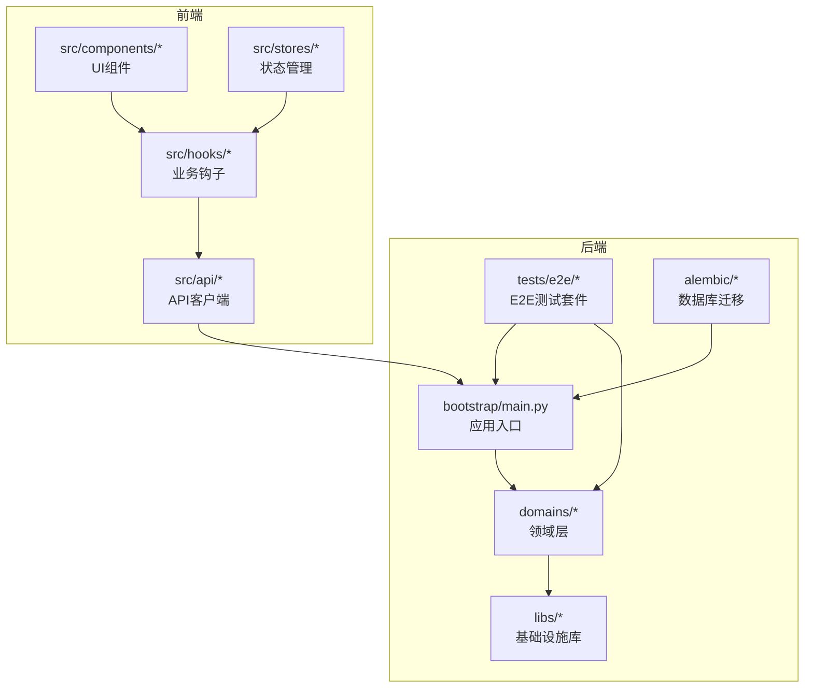
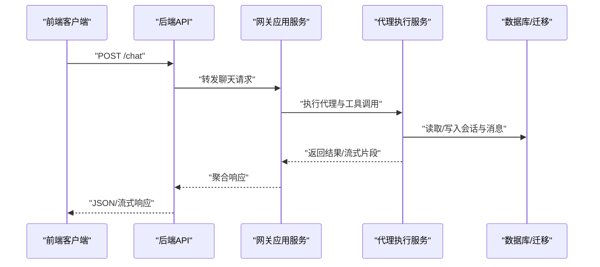
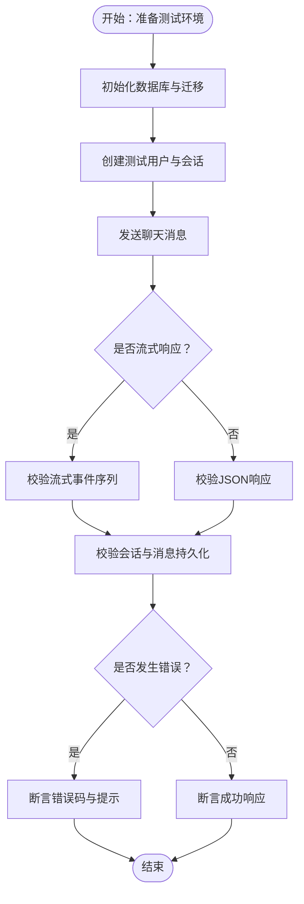
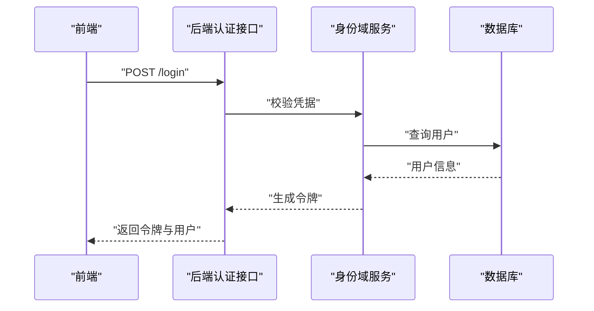
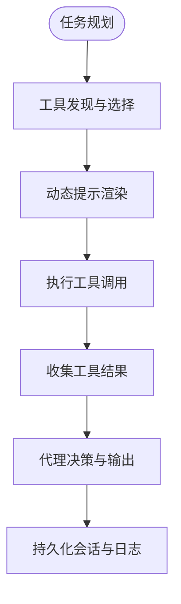
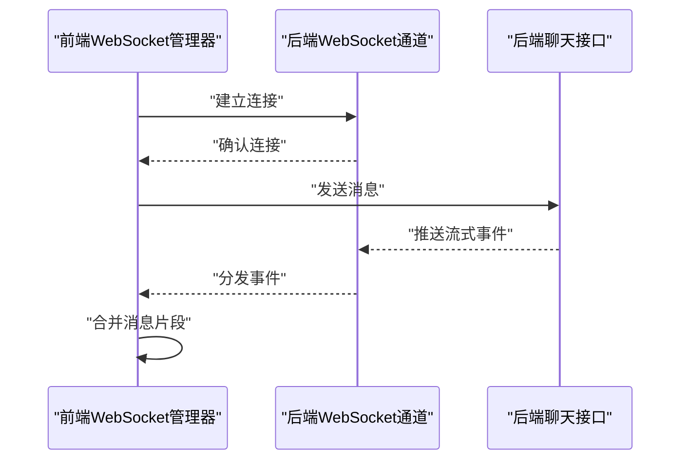
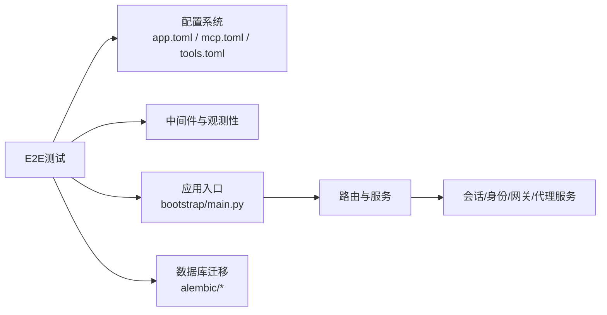

# 端到端测试

<cite>
**本文引用的文件**
- [backend/tests/e2e/test_chat_api_e2e.py](file://backend/tests/e2e/test_chat_api_e2e.py)
- [backend/tests/e2e/test_execution_config_e2e.py](file://backend/tests/e2e/test_execution_config_e2e.py)
- [backend/tests/e2e/conftest.py](file://backend/tests/e2e/conftest.py)
- [backend/tests/e2e/config.py](file://backend/tests/e2e/config.py)
- [backend/tests/conftest.py](file://backend/tests/conftest.py)
- [backend/bootstrap/main.py](file://backend/bootstrap/main.py)
- [backend/bootstrap/composition/identity_services.py](file://backend/bootstrap/composition/identity_services.py)
- [backend/config/environments/local-dev.toml](file://backend/config/environments/local-dev.toml)
- [backend/config/environments/docker-dev.toml](file://backend/config/environments/docker-dev.toml)
- [backend/config/app.toml](file://backend/config/app.toml)
- [backend/config/mcp.toml](file://backend/config/mcp.toml)
- [backend/config/tools.toml](file://backend/config/tools.toml)
- [backend/docs/CHAT_MESSAGE_FLOW.md](file://backend/docs/CHAT_MESSAGE_FLOW.md)
- [backend/docs/AUTHENTICATION.md](file://backend/docs/AUTHENTICATION.md)
- [backend/docs/MCP_QUICKSTART.md](file://backend/docs/MCP_QUICKSTART.md)
- [backend/scripts/run_dev_server.py](file://backend/scripts/run_dev_server.py)
- [backend/scripts/run_server.py](file://backend/scripts/run_server.py)
- [backend/scripts/migrate_test_db.py](file://backend/scripts/migrate_test_db.py)
- [backend/alembic/env.py](file://backend/alembic/env.py)
- [backend/alembic/script.py.mako](file://backend/alembic/script.py.mako)
- [backend/alembic/versions/20260127_150000_add_mcp_servers.py](file://backend/alembic/versions/20260127_150000_add_mcp_servers.py)
- [backend/alembic/versions/20260127_160000_add_mcp_connection_status_and_tools.py](file://backend/alembic/versions/20260127_160000_add_mcp_connection_status_and_tools.py)
- [backend/alembic/versions/20260127_170000_add_mcp_description_and_category.py](file://backend/alembic/versions/20260127_170000_add_mcp_description_and_category.py)
- [backend/alembic/versions/20260127_180000_add_api_keys.py](file://backend/alembic/versions/20260127_180000_add_api_keys.py)
- [backend/alembic/versions/20260128_081900_add_updated_at_to_usage_logs.py](file://backend/alembic/versions/20260128_081900_add_updated_at_to_usage_logs.py)
- [backend/alembic/versions/20260128_090000_drop_api_key_foreign_keys.py](file://backend/alembic/versions/20260128_090000_drop_api_key_foreign_keys.py)
- [backend/alembic/versions/20260128_100000_add_llm_key_quota_tables.py](file://backend/alembic/versions/20260128_100000_add_llm_key_quota_tables.py)
- [backend/alembic/versions/20260128_add_encrypted_key.py](file://backend/alembic/versions/20260128_add_encrypted_key.py)
- [backend/alembic/versions/20260129_add_mcp_dynamic_prompts.py](file://backend/alembic/versions/20260129_add_mcp_dynamic_prompts.py)
- [backend/alembic/versions/20260129_add_mcp_dynamic_tools.py](file://backend/alembic/versions/20260129_add_mcp_dynamic_tools.py)
- [backend/alembic/versions/20260129_add_mcp_template_fields.py](file://backend/alembic/versions/20260129_add_mcp_template_fields.py)
- [backend/alembic/versions/20260129_seed_default_mcp_prompts.py](file://backend/alembic/versions/20260129_seed_default_mcp_prompts.py)
- [backend/alembic/versions/20260202_add_video_gen_tasks.py](file://backend/alembic/versions/20260202_add_video_gen_tasks.py)
- [backend/alembic/versions/20260202_agents_tools_jsonb_to_array.py](file://backend/alembic/versions/20260202_agents_tools_jsonb_to_array.py)
- [backend/alembic/versions/20260205_add_session_video_task_count.py](file://backend/alembic/versions/20260205_add_session_video_task_count.py)
- [backend/alembic/versions/20260205_add_user_vendor_creator_id.py](file://backend/alembic/versions/20260205_add_user_vendor_creator_id.py)
- [backend/alembic/versions/20260205_add_video_model_duration.py](file://backend/alembic/versions/20260205_add_video_model_duration.py)
- [backend/alembic/versions/20260209_add_product_info_tables.py](file://backend/alembic/versions/20260209_add_product_info_tables.py)
- [backend/alembic/versions/20260224_add_step_phase_columns.py](file://backend/alembic/versions/20260224_add_step_phase_columns.py)
- [backend/alembic/versions/20260224_add_user_models_table.py](file://backend/alembic/versions/20260224_add_user_models_table.py)
- [backend/alembic/versions/20260508_add_gateway_tables.py](file://backend/alembic/versions/20260508_add_gateway_tables.py)
- [backend/alembic/versions/20260508_add_provider_credentials.py](file://backend/alembic/versions/20260508_add_provider_credentials.py)
- [backend/alembic/versions/20260513_unique_system_vkey_per_team.py](file://backend/alembic/versions/20260513_unique_system_vkey_per_team.py)
- [backend/alembic/versions/20260514_add_model_last_test_reason.py](file://backend/alembic/versions/20260514_add_model_last_test_reason.py)
- [backend/alembic/versions/20260514_add_model_last_test_status.py](file://backend/alembic/versions/20260514_add_model_last_test_status.py)
- [backend/alembic/versions/20260514_drop_studio_workflow_tables.py](file://backend/alembic/versions/20260514_drop_studio_workflow_tables.py)
- [backend/alembic/versions/20260514_gateway_budget_model_name.py](file://backend/alembic/versions/20260514_gateway_budget_model_name.py)
- [backend/alembic/versions/20260514_gateway_log_credential_dim.py](file://backend/alembic/versions/20260514_gateway_log_credential_dim.py)
- [backend/alembic/versions/20260514_gateway_log_deployment_dim.py](file://backend/alembic/versions/20260514_gateway_log_deployment_dim.py)
- [backend/alembic/versions/20260514_unique_active_personal_team_per_owner.py](file://backend/alembic/versions/20260514_unique_active_personal_team_per_owner.py)
- [backend/alembic/versions/20260515_api_key_gateway_grants.py](file://backend/alembic/versions/20260515_api_key_gateway_grants.py)
- [backend/alembic/versions/20260515_drop_gateway_legacy_user_model.py](file://backend/alembic/versions/20260515_drop_gateway_legacy_user_model.py)
- [backend/alembic/versions/20260515_drop_provider_credential_legacy_user_model.py](file://backend/alembic/versions/20260515_drop_provider_credential_legacy_user_model.py)
- [backend/alembic/versions/20260515_drop_user_models.py](file://backend/alembic/versions/20260515_drop_user_models.py)
- [backend/alembic/versions/20260515_gateway_legacy_user_model.py](file://backend/alembic/versions/20260515_gateway_legacy_user_model.py)
- [backend/alembic/versions/20260515_migrate_user_models_data.py](file://backend/alembic/versions/20260515_migrate_user_models_data.py)
- [backend/alembic/versions/20260518_gateway_model_pricing.py](file://backend/alembic/versions/20260518_gateway_model_pricing.py)
- [backend/alembic/versions/20260518_gateway_provider_entitlement_plans.py](file://backend/alembic/versions/20260518_gateway_provider_entitlement_plans.py)
- [backend/alembic/versions/20260519_drop_user_provider_configs.py](file://backend/alembic/versions/20260519_drop_user_provider_configs.py)
- [backend/alembic/versions/20260520_add_system_storage_config.py](file://backend/alembic/versions/20260520_add_system_storage_config.py)
- [backend/alembic/versions/20260520_gateway_request_log_client.py](file://backend/alembic/versions/20260520_gateway_request_log_client.py)
- [backend/alembic/versions/20260520_system_storage_config_single_active.py](file://backend/alembic/versions/20260520_system_storage_config_single_active.py)
- [backend/alembic/versions/20260521_tenant_data_scope.py](file://backend/alembic/versions/20260521_tenant_data_scope.py)
- [backend/alembic/versions/20260522_tenant_phase3.py](file://backend/alembic/versions/20260522_tenant_phase3.py)
- [backend/alembic/versions/20260523_sessions_agents_tenant_id.py](file://backend/alembic/versions/20260523_sessions_agents_tenant_id.py)
- [backend/alembic/versions/20260524_drop_agents_user_id.py](file://backend/alembic/versions/20260524_drop_agents_user_id.py)
- [backend/alembic/versions/20260525_drop_sessions_owner_columns.py](file://backend/alembic/versions/20260525_drop_sessions_owner_columns.py)
- [backend/alembic/versions/20260526_credential_profile_call_shape.py](file://backend/alembic/versions/20260526_credential_profile_call_shape.py)
- [backend/alembic/versions/20260526_provider_credentials_tenant_id.py](file://backend/alembic/versions/20260526_provider_credentials_tenant_id.py)
- [backend/alembic/versions/20260527_193526_merge_gateway_preflight_and_log_heads.py](file://backend/alembic/versions/20260527_193526_merge_gateway_preflight_and_log_heads.py)
- [backend/alembic/versions/20260527_backfill_request_log_provider.py](file://backend/alembic/versions/20260527_backfill_request_log_provider.py)
- [backend/alembic/versions/20260527_credential_api_bases.py](file://backend/alembic/versions/20260527_credential_api_bases.py)
- [backend/alembic/versions/20260527_provider_credentials_scope_nullable.py](file://backend/alembic/versions/20260527_provider_credentials_scope_nullable.py)
- [backend/alembic/versions/20260527_slow_sql_hotpath_indexes.py](file://backend/alembic/versions/20260527_slow_sql_hotpath_indexes.py)
- [backend/alembic/versions/20260528_backfill_request_log_provider_v2.py](file://backend/alembic/versions/20260528_backfill_request_log_provider_v2.py)
- [backend/alembic/versions/20260528_backfill_request_log_user.py](file://backend/alembic/versions/20260528_backfill_request_log_user.py)
- [backend/alembic/versions/20260528_system_gateway_models_credential_fk.py](file://backend/alembic/versions/20260528_system_gateway_models_credential_fk.py)
- [backend/alembic/versions/20260529_gateway_budgets_rename_to_target.py](file://backend/alembic/versions/20260529_gateway_budgets_rename_to_target.py)
- [backend/alembic/versions/20260530_downstream_pricing_scope_tenant.py](file://backend/alembic/versions/20260530_downstream_pricing_scope_tenant.py)
- [backend/alembic/versions/20260531_owned_resources_tenant_id.py](file://backend/alembic/versions/20260531_owned_resources_tenant_id.py)
- [backend/alembic/versions/20260601_drop_legacy_tenant_id_fks.py](file://backend/alembic/versions/20260601_drop_legacy_tenant_id_fks.py)
- [backend/alembic/versions/20260602_drop_all_db_foreign_keys.py](file://backend/alembic/versions/20260602_drop_all_db_foreign_keys.py)
- [backend/alembic/versions/20260603_system_visibility_acl.py](file://backend/alembic/versions/20260603_system_visibility_acl.py)
- [backend/alembic/versions/20260604_api_keys_revoked_at.py](file://backend/alembic/versions/20260604_api_keys_revoked_at.py)
- [backend/alembic/versions/20260605_migrate_system_cred_models.py](file://backend/alembic/versions/20260605_migrate_system_cred_models.py)
- [backend/alembic/versions/20260606_migrate_anonymous_shadow_to_deterministic_tenant.py](file://backend/alembic/versions/20260606_migrate_anonymous_shadow_to_deterministic_tenant.py)
- [backend/alembic/versions/20260607_gateway_preflight_indexes.py](file://backend/alembic/versions/20260607_gateway_preflight_indexes.py)
- [backend/alembic/versions/20260607_gateway_request_log_tenant_route_time.py](file://backend/alembic/versions/20260607_gateway_request_log_tenant_route_time.py)
- [backend/alembic/versions/20260608_provider_credentials_created_by.py](file://backend/alembic/versions/20260608_provider_credentials_created_by.py)
- [backend/alembic/versions/20260609_add_user_giikin_user_id.py](file://backend/alembic/versions/20260609_add_user_giikin_user_id.py)
- [backend/alembic/versions/20260610_delete_unattributed_probe_request_logs.py](file://backend/alembic/versions/20260610_delete_unattributed_probe_request_logs.py)
- [backend/alembic/versions/20260611_gateway_budget_credential.py](file://backend/alembic/versions/20260611_gateway_budget_credential.py)
- [backend/alembic/versions/20260612_gateway_budget_tenant.py](file://backend/alembic/versions/20260612_gateway_budget_tenant.py)
- [backend/alembic/versions/20260613_add_cache_creation_tokens.py](file://backend/alembic/versions/20260613_add_cache_creation_tokens.py)
- [backend/domains/gateway/presentation/api/chat.py](file://backend/domains/gateway/presentation/api/chat.py)
- [backend/domains/gateway/application/services/chat_service.py](file://backend/domains/gateway/application/services/chat_service.py)
- [backend/domains/agent/application/services/agent_execution_service.py](file://backend/domains/agent/application/services/agent_execution_service.py)
- [backend/domains/session/domain/models/session.py](file://backend/domains/session/domain/models/session.py)
- [backend/domains/identity/domain/models/user.py](file://backend/domains/identity/domain/models/user.py)
- [backend/libs/middleware/__init__.py](file://backend/libs/middleware/__init__.py)
- [backend/libs/observability/__init__.py](file://backend/libs/observability/__init__.py)
- [backend/libs/mcp/__init__.py](file://backend/libs/mcp/__init__.py)
- [backend/libs/gateway/__init__.py](file://backend/libs/gateway/__init__.py)
- [frontend/src/api/chat.ts](file://frontend/src/api/chat.ts)
- [frontend/src/hooks/use-chat.ts](file://frontend/src/hooks/use-chat.ts)
- [frontend/src/config/auth.ts](file://frontend/src/config/auth.ts)
- [frontend/src/components/chat/chat-input.tsx](file://frontend/src/components/chat/chat-input.tsx)
- [frontend/src/components/chat/message-list.tsx](file://frontend/src/components/chat/message-list.tsx)
- [frontend/src/components/chat/streaming-message-handler.tsx](file://frontend/src/components/chat/streaming-message-handler.tsx)
- [frontend/src/components/chat/websocket-manager.tsx](file://frontend/src/components/chat/websocket-manager.tsx)
- [frontend/src/stores/chat-store.ts](file://frontend/src/stores/chat-store.ts)
- [scripts/run-e2e.ps1](file://scripts/run-e2e.ps1)
- [docker-compose.yml](file://docker-compose.yml)
- [backend/Dockerfile](file://backend/Dockerfile)
- [frontend/Dockerfile](file://frontend/Dockerfile)
- [backend/deploy/Deployment.yaml](file://backend/deploy/Deployment.yaml)
- [frontend/Deployment.yaml](file://frontend/Deployment.yaml)
</cite>

## 目录
1. [引言](#引言)
2. [项目结构](#项目结构)
3. [核心组件](#核心组件)
4. [架构总览](#架构总览)
5. [详细组件分析](#详细组件分析)
6. [依赖关系分析](#依赖关系分析)
7. [性能考虑](#性能考虑)
8. [故障排查指南](#故障排查指南)
9. [结论](#结论)
10. [附录](#附录)

## 引言
本指南面向测试工程师，提供AI Agent项目的端到端测试实施方法论与实操步骤。内容覆盖设计理念、测试场景规划（用户旅程与业务流程）、环境搭建与配置、聊天API端到端测试（消息传递、流式响应、错误处理）、认证与会话管理测试、代理执行与工具调用测试（含MCP工具）、前后端集成测试（WebSocket与实时通信），以及性能监控与失败重试策略。所有技术细节均基于仓库中的真实代码与配置文件进行梳理与总结。

## 项目结构
AI Agent采用前后端分离架构，后端以Python/FastAPI为核心，包含领域驱动设计的分层结构；前端使用TypeScript/Vue生态。测试体系分为单元测试、集成测试与端到端测试三层，其中E2E测试位于后端tests/e2e目录，配合pytest与数据库迁移脚本，确保在隔离环境中复现真实业务路径。

图示来源
- [backend/bootstrap/main.py](file://backend/bootstrap/main.py)
- [backend/tests/e2e/conftest.py](file://backend/tests/e2e/conftest.py)
- [backend/domains/gateway/presentation/api/chat.py](file://backend/domains/gateway/presentation/api/chat.py)
- [frontend/src/api/chat.ts](file://frontend/src/api/chat.ts)

章节来源
- [backend/bootstrap/main.py](file://backend/bootstrap/main.py)
- [backend/tests/e2e/conftest.py](file://backend/tests/e2e/conftest.py)
- [frontend/src/api/chat.ts](file://frontend/src/api/chat.ts)

## 核心组件
- 测试运行时与夹具
  - 后端E2E夹具：负责启动应用、加载配置、初始化数据库、注入服务与中间件，确保测试在可控的隔离环境中运行。
  - 前端测试：通过API客户端与UI组件交互，验证聊天、会话、工具调用等端到端流程。
- 应用入口与配置
  - 应用入口负责装配依赖、注册路由与中间件，并根据环境变量选择配置文件。
  - 配置文件涵盖应用、网关、MCP、工具等模块的参数，支撑E2E测试场景。
- 数据模型与迁移
  - 使用Alembic管理数据库版本，E2E测试前通过迁移脚本准备所需表结构与初始数据。
- 观测性与中间件
  - 中间件用于请求追踪、日志与安全控制；观测性库提供指标与链路追踪能力，便于E2E测试期间的问题定位。

章节来源
- [backend/tests/e2e/conftest.py](file://backend/tests/e2e/conftest.py)
- [backend/bootstrap/main.py](file://backend/bootstrap/main.py)
- [backend/config/app.toml](file://backend/config/app.toml)
- [backend/config/mcp.toml](file://backend/config/mcp.toml)
- [backend/config/tools.toml](file://backend/config/tools.toml)
- [backend/alembic/env.py](file://backend/alembic/env.py)
- [backend/libs/middleware/__init__.py](file://backend/libs/middleware/__init__.py)
- [backend/libs/observability/__init__.py](file://backend/libs/observability/__init__.py)

## 架构总览
下图展示E2E测试从发起到返回的典型调用链：前端通过API客户端向后端发起聊天请求，后端经由网关层进入应用服务，触发代理执行与工具调用，最终返回消息或流式响应。此过程贯穿认证、会话管理、MCP工具集成与数据库写入。

图示来源
- [backend/domains/gateway/presentation/api/chat.py](file://backend/domains/gateway/presentation/api/chat.py)
- [backend/domains/gateway/application/services/chat_service.py](file://backend/domains/gateway/application/services/chat_service.py)
- [backend/domains/agent/application/services/agent_execution_service.py](file://backend/domains/agent/application/services/agent_execution_service.py)
- [backend/domains/session/domain/models/session.py](file://backend/domains/session/domain/models/session.py)

## 详细组件分析

### 聊天API端到端测试
目标：验证消息发送、接收与流式响应的正确性，覆盖正常路径与异常路径（网络中断、模型不可用、权限不足）。

- 设计理念
  - 以用户旅程为中心：从输入消息到收到完整回复或流式片段。
  - 分层断言：接口契约、业务语义、性能阈值三层次验证。
- 场景规划
  - 单轮对话：发送一条消息，验证响应格式与上下文延续。
  - 多轮对话：连续消息，验证会话状态与历史消息保留。
  - 流式响应：逐帧校验，确保事件顺序与完整性。
  - 错误处理：模拟上游错误、超时与鉴权失败，验证错误码与提示。
- 实现要点
  - 使用E2E夹具启动后端，准备测试数据库与会话数据。
  - 前端通过API客户端调用后端聊天接口，监听流式事件。
  - 断言包括HTTP状态码、响应体字段、会话记录一致性与流式事件序列。
- 性能关注
  - 记录首字节延迟、吞吐量与错误率，结合观测性指标定位瓶颈。

图示来源
- [backend/tests/e2e/test_chat_api_e2e.py](file://backend/tests/e2e/test_chat_api_e2e.py)
- [backend/tests/e2e/conftest.py](file://backend/tests/e2e/conftest.py)
- [backend/domains/gateway/presentation/api/chat.py](file://backend/domains/gateway/presentation/api/chat.py)
- [backend/domains/session/domain/models/session.py](file://backend/domains/session/domain/models/session.py)

章节来源
- [backend/tests/e2e/test_chat_api_e2e.py](file://backend/tests/e2e/test_chat_api_e2e.py)
- [backend/tests/e2e/conftest.py](file://backend/tests/e2e/conftest.py)
- [backend/domains/gateway/presentation/api/chat.py](file://backend/domains/gateway/presentation/api/chat.py)
- [backend/domains/session/domain/models/session.py](file://backend/domains/session/domain/models/session.py)

### 用户认证与会话管理E2E测试
目标：验证登录流程、会话持久化与权限验证，确保用户身份在端到端流程中稳定传递。

- 登录流程
  - 前端提交凭据，后端返回令牌与用户信息。
  - E2E测试断言：令牌格式、过期策略、刷新机制。
- 会话持久化
  - 通过会话模型验证会话创建、状态更新与历史消息写入。
- 权限验证
  - 不同角色访问受限资源时的行为，确保鉴权中间件生效。
- 集成点
  - 认证文档与中间件配置为测试提供依据与边界条件。

图示来源
- [backend/bootstrap/composition/identity_services.py](file://backend/bootstrap/composition/identity_services.py)
- [backend/docs/AUTHENTICATION.md](file://backend/docs/AUTHENTICATION.md)
- [backend/domains/identity/domain/models/user.py](file://backend/domains/identity/domain/models/user.py)

章节来源
- [backend/bootstrap/composition/identity_services.py](file://backend/bootstrap/composition/identity_services.py)
- [backend/docs/AUTHENTICATION.md](file://backend/docs/AUTHENTICATION.md)
- [backend/domains/identity/domain/models/user.py](file://backend/domains/identity/domain/models/user.py)

### 代理执行与工具调用E2E测试（含MCP）
目标：验证多步骤任务与MCP工具集成，确保代理能够正确解析指令、调用工具并回传结果。

- 设计理念
  - 将复杂任务拆解为多个工具调用步骤，逐步断言中间状态。
  - 对MCP服务器的可用性、工具清单与动态提示进行验证。
- 场景规划
  - 工具发现与选择：验证工具列表与分类。
  - 动态提示与模板：验证提示词模板渲染与字段替换。
  - 执行与回传：验证工具返回值与代理决策链。
- 配置与迁移
  - MCP相关表结构与种子数据通过迁移脚本准备，确保测试一致性。

图示来源
- [backend/docs/MCP_QUICKSTART.md](file://backend/docs/MCP_QUICKSTART.md)
- [backend/config/mcp.toml](file://backend/config/mcp.toml)
- [backend/alembic/versions/20260127_150000_add_mcp_servers.py](file://backend/alembic/versions/20260127_150000_add_mcp_servers.py)
- [backend/alembic/versions/20260127_160000_add_mcp_connection_status_and_tools.py](file://backend/alembic/versions/20260127_160000_add_mcp_connection_status_and_tools.py)
- [backend/alembic/versions/20260127_170000_add_mcp_description_and_category.py](file://backend/alembic/versions/20260127_170000_add_mcp_description_and_category.py)
- [backend/alembic/versions/20260129_seed_default_mcp_prompts.py](file://backend/alembic/versions/20260129_seed_default_mcp_prompts.py)

章节来源
- [backend/docs/MCP_QUICKSTART.md](file://backend/docs/MCP_QUICKSTART.md)
- [backend/config/mcp.toml](file://backend/config/mcp.toml)
- [backend/alembic/versions/20260127_150000_add_mcp_servers.py](file://backend/alembic/versions/20260127_150000_add_mcp_servers.py)
- [backend/alembic/versions/20260127_160000_add_mcp_connection_status_and_tools.py](file://backend/alembic/versions/20260127_160000_add_mcp_connection_status_and_tools.py)
- [backend/alembic/versions/20260127_170000_add_mcp_description_and_category.py](file://backend/alembic/versions/20260127_170000_add_mcp_description_and_category.py)
- [backend/alembic/versions/20260129_seed_default_mcp_prompts.py](file://backend/alembic/versions/20260129_seed_default_mcp_prompts.py)

### 前后端集成测试（WebSocket与实时通信）
目标：验证前端与后端之间的实时通信，包括消息推送、流式事件与断线重连。

- 关键组件
  - WebSocket管理器：封装连接建立、心跳与事件订阅。
  - 流式消息处理器：按事件类型解析与合并消息片段。
  - 聊天存储：维护消息列表与滚动窗口。
- 测试策略
  - 连接建立：断言握手成功与事件订阅。
  - 流式事件：断言事件到达顺序与完整性。
  - 断线与重连：模拟网络抖动，验证自动重连与消息去重。
- 与后端协作
  - 后端提供聊天接口与流式通道，前端通过API客户端与WebSocket协同工作。

图示来源
- [frontend/src/components/chat/websocket-manager.tsx](file://frontend/src/components/chat/websocket-manager.tsx)
- [frontend/src/components/chat/streaming-message-handler.tsx](file://frontend/src/components/chat/streaming-message-handler.tsx)
- [frontend/src/stores/chat-store.ts](file://frontend/src/stores/chat-store.ts)
- [backend/domains/gateway/presentation/api/chat.py](file://backend/domains/gateway/presentation/api/chat.py)

章节来源
- [frontend/src/components/chat/websocket-manager.tsx](file://frontend/src/components/chat/websocket-manager.tsx)
- [frontend/src/components/chat/streaming-message-handler.tsx](file://frontend/src/components/chat/streaming-message-handler.tsx)
- [frontend/src/stores/chat-store.ts](file://frontend/src/stores/chat-store.ts)
- [backend/domains/gateway/presentation/api/chat.py](file://backend/domains/gateway/presentation/api/chat.py)

### 执行配置E2E测试
目标：验证执行配置在不同环境下的加载与生效，确保代理执行参数与工具配置正确传递。

- 关注点
  - 配置文件加载优先级与覆盖逻辑。
  - 环境差异（本地、Docker、生产）对执行行为的影响。
  - 配置变更后的热更新或重启策略。
- 测试方法
  - 切换环境配置，断言关键参数变化。
  - 验证代理执行服务读取到正确的配置并产生预期行为。

章节来源
- [backend/tests/e2e/test_execution_config_e2e.py](file://backend/tests/e2e/test_execution_config_e2e.py)
- [backend/config/environments/local-dev.toml](file://backend/config/environments/local-dev.toml)
- [backend/config/environments/docker-dev.toml](file://backend/config/environments/docker-dev.toml)
- [backend/config/app.toml](file://backend/config/app.toml)

## 依赖关系分析
E2E测试依赖于应用入口、配置系统、数据库迁移与中间件/观测性库。下图展示关键依赖关系：

图示来源
- [backend/tests/e2e/conftest.py](file://backend/tests/e2e/conftest.py)
- [backend/bootstrap/main.py](file://backend/bootstrap/main.py)
- [backend/config/app.toml](file://backend/config/app.toml)
- [backend/config/mcp.toml](file://backend/config/mcp.toml)
- [backend/config/tools.toml](file://backend/config/tools.toml)
- [backend/alembic/env.py](file://backend/alembic/env.py)
- [backend/libs/middleware/__init__.py](file://backend/libs/middleware/__init__.py)
- [backend/libs/observability/__init__.py](file://backend/libs/observability/__init__.py)

章节来源
- [backend/tests/e2e/conftest.py](file://backend/tests/e2e/conftest.py)
- [backend/bootstrap/main.py](file://backend/bootstrap/main.py)
- [backend/config/app.toml](file://backend/config/app.toml)
- [backend/config/mcp.toml](file://backend/config/mcp.toml)
- [backend/config/tools.toml](file://backend/config/tools.toml)
- [backend/alembic/env.py](file://backend/alembic/env.py)
- [backend/libs/middleware/__init__.py](file://backend/libs/middleware/__init__.py)
- [backend/libs/observability/__init__.py](file://backend/libs/observability/__init__.py)

## 性能考虑
- 监控指标
  - 请求延迟、吞吐量、错误率、数据库查询耗时、MCP工具调用耗时。
- 基准与告警
  - 定义端到端响应时间阈值，超过阈值触发告警。
- 资源与并发
  - 控制并发请求数，避免数据库与上游服务过载。
- 缓存与预热
  - 预热常用模型与工具，减少首次调用延迟。
- 日志与追踪
  - 结合中间件与观测性库，确保端到端链路可追踪。

## 故障排查指南
- 常见问题
  - 数据库未迁移：执行迁移脚本，确保表结构与索引存在。
  - 配置不一致：核对环境配置文件，确保参数与期望一致。
  - MCP工具不可用：检查MCP服务器状态与工具清单，验证动态提示与模板。
  - WebSocket断连：检查网络与心跳设置，验证断线重连逻辑。
- 排查步骤
  - 启用详细日志，定位错误发生阶段。
  - 使用最小化场景复现，逐步缩小范围。
  - 对比成功与失败用例的差异点（输入、配置、外部依赖）。
- 重试策略
  - 对瞬时性错误（网络抖动、上游超时）进行指数退避重试。
  - 对幂等操作支持重试，对非幂等操作需谨慎处理。

章节来源
- [backend/scripts/migrate_test_db.py](file://backend/scripts/migrate_test_db.py)
- [backend/alembic/env.py](file://backend/alembic/env.py)
- [backend/docs/MCP_QUICKSTART.md](file://backend/docs/MCP_QUICKSTART.md)
- [frontend/src/components/chat/websocket-manager.tsx](file://frontend/src/components/chat/websocket-manager.tsx)

## 结论
通过以上方法论与实践，E2E测试能够系统性地覆盖用户旅程与业务流程，保障AI Agent在真实环境中的稳定性与可靠性。建议持续完善测试矩阵、引入性能基线与自动化重试，结合观测性能力实现快速定位与修复。

## 附录
- 环境搭建与启动
  - 使用应用入口与配置系统启动后端服务，确保中间件与观测性启用。
  - 通过迁移脚本准备数据库，确保会话、消息与MCP相关表存在。
  - 前端通过API客户端与WebSocket组件接入后端服务。
- 测试执行
  - 使用E2E夹具统一初始化与清理，保证测试隔离性。
  - 结合失败重试与性能监控，提升测试稳定性与可观测性。

章节来源
- [backend/bootstrap/main.py](file://backend/bootstrap/main.py)
- [backend/tests/e2e/conftest.py](file://backend/tests/e2e/conftest.py)
- [backend/scripts/migrate_test_db.py](file://backend/scripts/migrate_test_db.py)
- [backend/alembic/env.py](file://backend/alembic/env.py)
- [frontend/src/api/chat.ts](file://frontend/src/api/chat.ts)
- [frontend/src/components/chat/websocket-manager.tsx](file://frontend/src/components/chat/websocket-manager.tsx)