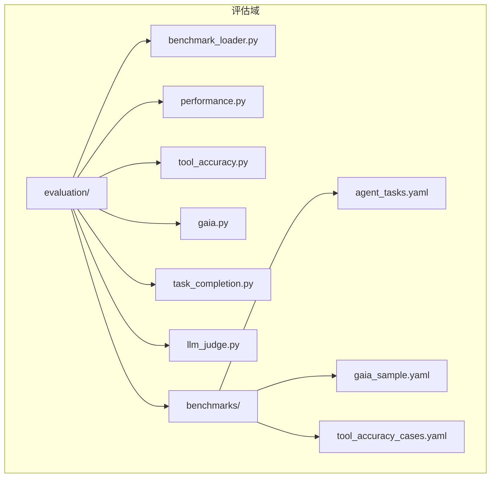
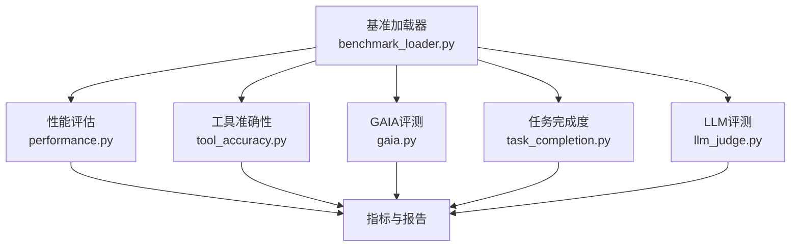
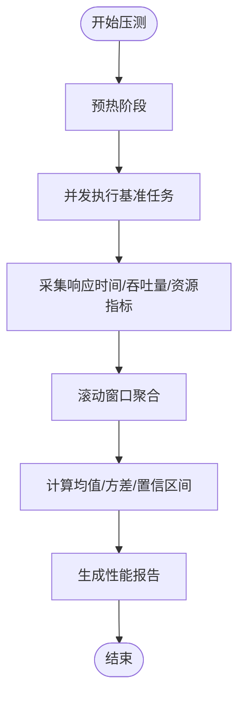
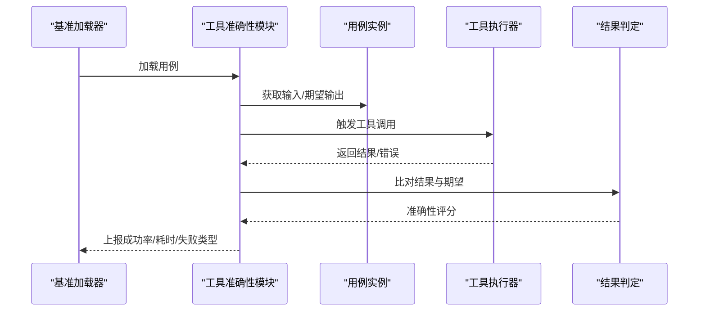
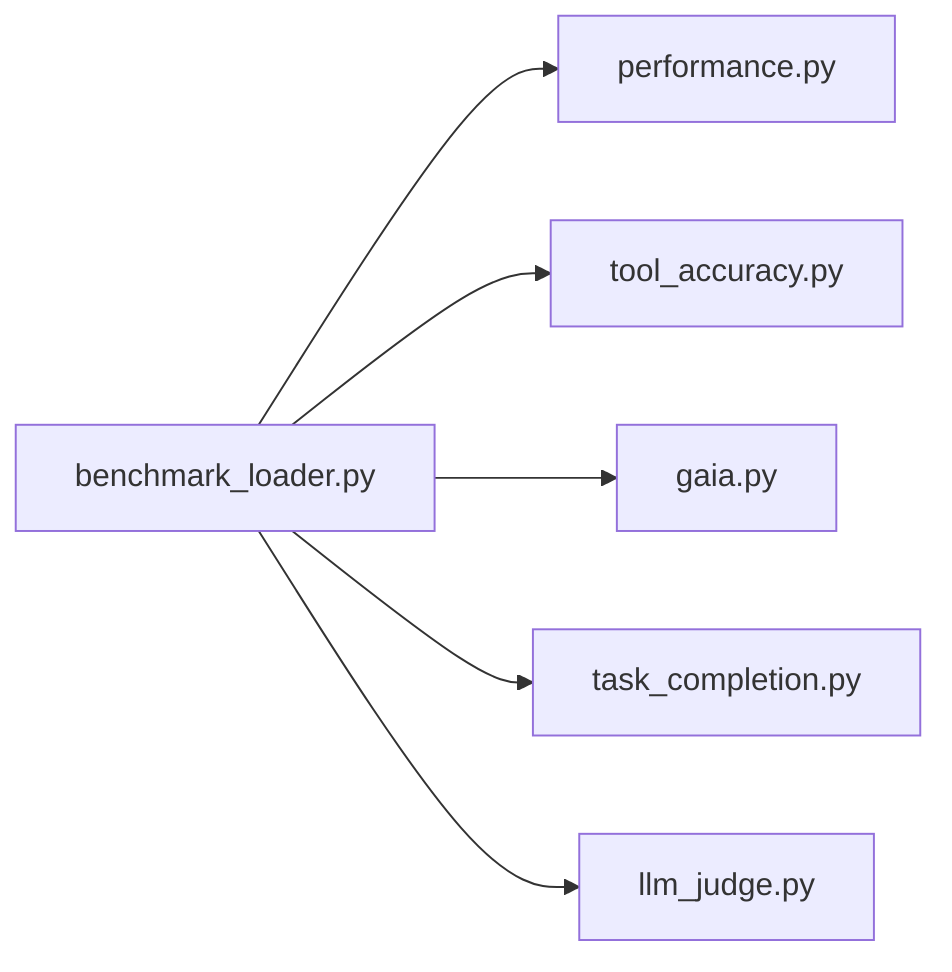

# 评估与基准测试

<cite>
**本文引用的文件**   
- [evaluation/benchmarks/agent_tasks.yaml](file://evaluation/benchmarks/agent_tasks.yaml)
- [evaluation/benchmarks/gaia_sample.yaml](file://evaluation/benchmarks/gaia_sample.yaml)
- [evaluation/benchmarks/tool_accuracy_cases.yaml](file://evaluation/benchmarks/tool_accuracy_cases.yaml)
- [evaluation/benchmark_loader.py](file://evaluation/benchmark_loader.py)
- [evaluation/gaia.py](file://evaluation/gaia.py)
- [evaluation/performance.py](file://evaluation/performance.py)
- [evaluation/task_completion.py](file://evaluation/task_completion.py)
- [evaluation/tool_accuracy.py](file://evaluation/tool_accuracy.py)
- [evaluation/llm_judge.py](file://evaluation/llm_judge.py)
- [tests/evaluation/test_benchmark_loader.py](file://tests/evaluation/test_benchmark_loader.py)
- [tests/evaluation/test_gaia.py](file://tests/evaluation/test_gaia.py)
- [tests/evaluation/test_performance.py](file://tests/evaluation/test_performance.py)
- [tests/evaluation/test_task_evaluator.py](file://tests/evaluation/test_task_evaluator.py)
- [tests/evaluation/test_tool_accuracy.py](file://tests/evaluation/test_tool_accuracy.py)
- [tests/evaluation/test_tool_accuracy_integration.py](file://tests/evaluation/test_tool_accuracy_integration.py)
- [tests/evaluation/test_llm_judge.py](file://tests/evaluation/test_llm_judge.py)
- [.github/workflows/sonar.yml](file://.github/workflows/sonar.yml)
- [scripts/run_sonar_scanner.py](file://scripts/run_sonar_scanner.py)
- [scripts/sonarcloud_api.py](file://scripts/sonarcloud_api.py)
- [README.md](file://README.md)
</cite>

## 目录
1. 引言
2. 项目结构
3. 核心组件
4. 架构总览
5. 详细组件分析
6. 依赖关系分析
7. 性能考量
8. 故障排查指南
9. 结论
10. 附录

## 引言
本指南面向评估工程师与研究人员，系统化阐述AI Agent项目的评估与基准测试实施方法。内容覆盖性能基准（响应时间、吞吐量、资源利用率）、工具准确性（调用成功率、结果准确性、执行效率）、LLM评测（对话质量、推理能力、指令遵循）以及基准数据集管理与使用。同时给出指标计算与统计分析方法、评估报告生成与可视化建议、自动化流程与持续集成策略，帮助在不同阶段高效开展评估工作。

## 项目结构
后端模块中包含独立的评估域与基准数据，位于 backend/evaluation 及其子目录 evaluation/benchmarks。评估域下包含多个评估模块：性能、工具准确性、GAIA评测、任务完成度、LLM评测等；基准数据以YAML形式组织，便于加载与扩展。

图表来源
- [evaluation/benchmark_loader.py](file://evaluation/benchmark_loader.py)
- [evaluation/performance.py](file://evaluation/performance.py)
- [evaluation/tool_accuracy.py](file://evaluation/tool_accuracy.py)
- [evaluation/gaia.py](file://evaluation/gaia.py)
- [evaluation/task_completion.py](file://evaluation/task_completion.py)
- [evaluation/llm_judge.py](file://evaluation/llm_judge.py)
- [evaluation/benchmarks/agent_tasks.yaml](file://evaluation/benchmarks/agent_tasks.yaml)
- [evaluation/benchmarks/gaia_sample.yaml](file://evaluation/benchmarks/gaia_sample.yaml)
- [evaluation/benchmarks/tool_accuracy_cases.yaml](file://evaluation/benchmarks/tool_accuracy_cases.yaml)

章节来源
- [evaluation/benchmark_loader.py](file://evaluation/benchmark_loader.py)
- [evaluation/benchmarks/agent_tasks.yaml](file://evaluation/benchmarks/agent_tasks.yaml)
- [evaluation/benchmarks/gaia_sample.yaml](file://evaluation/benchmarks/gaia_sample.yaml)
- [evaluation/benchmarks/tool_accuracy_cases.yaml](file://evaluation/benchmarks/tool_accuracy_cases.yaml)

## 核心组件
- 基准加载器：负责从YAML加载各类基准任务与用例，统一接口供评估模块消费。
- 性能评估：采集并统计响应时间、吞吐量、资源利用率等指标。
- 工具准确性：评估工具调用成功率、结果准确性与执行效率。
- GAIA评测：基于GAIA样例进行推理与任务完成评测。
- 任务完成度：衡量代理在多轮对话或复杂任务中的完成情况。
- LLM评测：对回复质量、推理能力、指令遵循进行打分与分析。

章节来源
- [evaluation/benchmark_loader.py](file://evaluation/benchmark_loader.py)
- [evaluation/performance.py](file://evaluation/performance.py)
- [evaluation/tool_accuracy.py](file://evaluation/tool_accuracy.py)
- [evaluation/gaia.py](file://evaluation/gaia.py)
- [evaluation/task_completion.py](file://evaluation/task_completion.py)
- [evaluation/llm_judge.py](file://evaluation/llm_judge.py)

## 架构总览
评估域采用“数据加载 + 评估模块 + 统计输出”的分层架构。基准数据通过加载器解析后，交由各评估模块执行具体评测逻辑，并输出标准化指标与报告。

图表来源
- [evaluation/benchmark_loader.py](file://evaluation/benchmark_loader.py)
- [evaluation/performance.py](file://evaluation/performance.py)
- [evaluation/tool_accuracy.py](file://evaluation/tool_accuracy.py)
- [evaluation/gaia.py](file://evaluation/gaia.py)
- [evaluation/task_completion.py](file://evaluation/task_completion.py)
- [evaluation/llm_judge.py](file://evaluation/llm_judge.py)

## 详细组件分析

### 基准数据集与加载
- 代理任务：定义代理在不同场景下的任务目标、输入输出格式与期望行为，用于任务完成度与对话质量评测。
- GAIA样例：包含推理类问题与上下文，用于评估代理的推理与任务执行能力。
- 工具准确性案例：覆盖常见工具调用场景，用于评估工具调用成功率与结果准确性。

加载器负责：
- 解析YAML文件，构建统一的任务/用例对象。
- 提供迭代器或批量接口，支持顺序或并发执行。
- 支持过滤、采样与参数注入，便于快速验证与大规模评测。

章节来源
- [evaluation/benchmarks/agent_tasks.yaml](file://evaluation/benchmarks/agent_tasks.yaml)
- [evaluation/benchmarks/gaia_sample.yaml](file://evaluation/benchmarks/gaia_sample.yaml)
- [evaluation/benchmarks/tool_accuracy_cases.yaml](file://evaluation/benchmarks/tool_accuracy_cases.yaml)
- [evaluation/benchmark_loader.py](file://evaluation/benchmark_loader.py)

### 性能基准测试
目标指标
- 响应时间：单次请求从发送到收到首个字节的时间（P50/P90/P95）。
- 吞吐量：单位时间内处理的请求数（RPS）。
- 资源利用率：CPU、内存、网络带宽、磁盘I/O等。

实现要点
- 使用高精度计时器记录开始/结束时间，避免系统时钟抖动影响。
- 并发压测：通过线程池/异步协程模拟真实负载，控制并发数与预热阶段。
- 指标聚合：按窗口滚动统计，输出均值、标准差、置信区间。
- 资源监控：结合系统监控接口或容器指标导出，统一采集与存储。

图表来源
- [evaluation/performance.py](file://evaluation/performance.py)

章节来源
- [evaluation/performance.py](file://evaluation/performance.py)

### 工具准确性评测
评估维度
- 调用成功率：工具被正确触发且返回非错误状态的比例。
- 结果准确性：工具返回结果与期望答案的匹配度（语义相似度、结构化字段比对等）。
- 执行效率：工具调用耗时、重试次数与失败原因统计。

实现要点
- 将工具调用封装为可重复执行的单元，确保环境一致性。
- 对比基线：提供预期输出模板或参考答案，支持模糊匹配与阈值判定。
- 失败归因：记录超时、参数错误、权限不足、外部服务异常等类型，便于定位问题。
- 指标汇总：输出成功率、准确率、F1分数、平均耗时与失败分布。

图表来源
- [evaluation/benchmark_loader.py](file://evaluation/benchmark_loader.py)
- [evaluation/tool_accuracy.py](file://evaluation/tool_accuracy.py)

章节来源
- [evaluation/tool_accuracy.py](file://evaluation/tool_accuracy.py)
- [evaluation/benchmark_loader.py](file://evaluation/benchmark_loader.py)

### GAIA评测
适用场景
- 推理类任务：需要多步思考、信息检索与综合判断的问题。
- 任务完成度：在给定上下文中完成特定动作（如搜索、导航、决策）。

实现要点
- 读取GAIA样例，构造多轮对话或步骤式任务。
- 记录每一步的中间产物与最终结论，支持人工/自动双轨校验。
- 输出任务是否完成、推理链是否合理、关键事实是否正确等指标。

章节来源
- [evaluation/gaia.py](file://evaluation/gaia.py)
- [evaluation/benchmarks/gaia_sample.yaml](file://evaluation/benchmarks/gaia_sample.yaml)

### 任务完成度评测
关注点
- 多轮对话中的目标达成：是否满足用户意图、是否产生有效输出。
- 步骤完整性：复杂任务是否按计划推进，是否存在遗漏或冗余步骤。
- 上下文一致性：前后回复是否一致、有无矛盾信息。

实现要点
- 定义任务成功标准与失败条件。
- 对话流回放与断言，必要时引入外部验证（如搜索引擎结果比对）。
- 统计完成率、平均步骤数、失败类型分布。

章节来源
- [evaluation/task_completion.py](file://evaluation/task_completion.py)
- [evaluation/benchmarks/agent_tasks.yaml](file://evaluation/benchmarks/agent_tasks.yaml)

### LLM评测
评测维度
- 对话质量：流畅度、相关性、礼貌度、个性化程度。
- 推理能力：数学计算、逻辑推断、事实核查、多跳推理。
- 指令遵循：对复杂指令的理解与执行、边界条件处理。

实现要点
- 使用LLM作为裁判模型（LLM-as-Judge），设计结构化提示词模板。
- 采用多评分维度与一致性检查，减少主观偏差。
- 对比不同模型/提示词/工具组合的效果，形成可复现的评测协议。

章节来源
- [evaluation/llm_judge.py](file://evaluation/llm_judge.py)

## 依赖关系分析
评估域内部模块之间存在清晰的职责划分与依赖方向：加载器为其他模块提供统一的数据源；各评测模块相对独立，仅依赖加载器与通用工具；测试用例覆盖加载器与各评测模块的关键路径。

图表来源
- [evaluation/benchmark_loader.py](file://evaluation/benchmark_loader.py)
- [evaluation/performance.py](file://evaluation/performance.py)
- [evaluation/tool_accuracy.py](file://evaluation/tool_accuracy.py)
- [evaluation/gaia.py](file://evaluation/gaia.py)
- [evaluation/task_completion.py](file://evaluation/task_completion.py)
- [evaluation/llm_judge.py](file://evaluation/llm_judge.py)

章节来源
- [evaluation/benchmark_loader.py](file://evaluation/benchmark_loader.py)
- [evaluation/performance.py](file://evaluation/performance.py)
- [evaluation/tool_accuracy.py](file://evaluation/tool_accuracy.py)
- [evaluation/gaia.py](file://evaluation/gaia.py)
- [evaluation/task_completion.py](file://evaluation/task_completion.py)
- [evaluation/llm_judge.py](file://evaluation/llm_judge.py)

## 性能考量
- 数据加载：YAML解析与对象构建应尽量轻量化，避免在热路径上做昂贵操作。
- 并发安全：性能与工具准确性评测需注意共享状态与资源竞争，必要时使用隔离的执行环境。
- 指标稳定性：采用多次采样与滚动窗口统计，剔除异常值，提高置信区间可靠性。
- 报告一致性：统一输出格式与字段命名，便于横向对比与自动化归档。

## 故障排查指南
- 基准加载失败：检查YAML语法与字段名称，确认加载器对缺失字段的默认处理策略。
- 工具调用异常：核对工具注册表、权限与网络连通性；记录失败类型并分类统计。
- 性能指标异常：检查计时器精度、并发设置与系统资源瓶颈；对比不同配置下的回归情况。
- LLM评测不稳定：固定随机种子、统一提示词模板与评分维度；对极端样本进行抽样复核。

章节来源
- [tests/evaluation/test_benchmark_loader.py](file://tests/evaluation/test_benchmark_loader.py)
- [tests/evaluation/test_performance.py](file://tests/evaluation/test_performance.py)
- [tests/evaluation/test_tool_accuracy.py](file://tests/evaluation/test_tool_accuracy.py)
- [tests/evaluation/test_gaia.py](file://tests/evaluation/test_gaia.py)
- [tests/evaluation/test_llm_judge.py](file://tests/evaluation/test_llm_judge.py)
- [tests/evaluation/test_task_evaluator.py](file://tests/evaluation/test_task_evaluator.py)

## 结论
本指南提供了从数据准备、评测执行到报告生成与持续集成的完整路径。通过标准化的评估模块与严格的统计方法，可在不同阶段稳定地衡量Agent的性能与质量，支撑持续优化与发布决策。

## 附录

### 指标计算与统计分析
- 均值与标准差：对样本序列直接计算，用于描述集中趋势与离散程度。
- 置信区间：基于样本标准误与t分布（或正态近似）计算，反映估计精度。
- 分位数：P50/P90/P95用于刻画尾部行为，尤其适用于延迟与资源使用。
- 回归分析：对比不同配置的指标差异，识别显著变化。

### 评估报告生成与可视化
- 报告内容：包含评测配置、样本规模、关键指标、置信区间、失败分布与改进建议。
- 可视化建议：延迟直方图、吞吐量趋势图、资源使用折线图、对比雷达图、失败类型饼图。

### 自动化流程与持续集成
- 流程建议：本地开发→单元测试→集成测试→基准评测→报告归档→CI告警。
- CI集成：在流水线中运行评估脚本，收集指标与报告，上传Artifacts；对关键指标设置阈值告警。
- 参考工作流：仓库内已提供代码质量扫描工作流，可借鉴其结构与触发机制。

章节来源
- [.github/workflows/sonar.yml](file://.github/workflows/sonar.yml)
- [scripts/run_sonar_scanner.py](file://scripts/run_sonar_scanner.py)
- [scripts/sonarcloud_api.py](file://scripts/sonarcloud_api.py)
- [README.md](file://README.md)