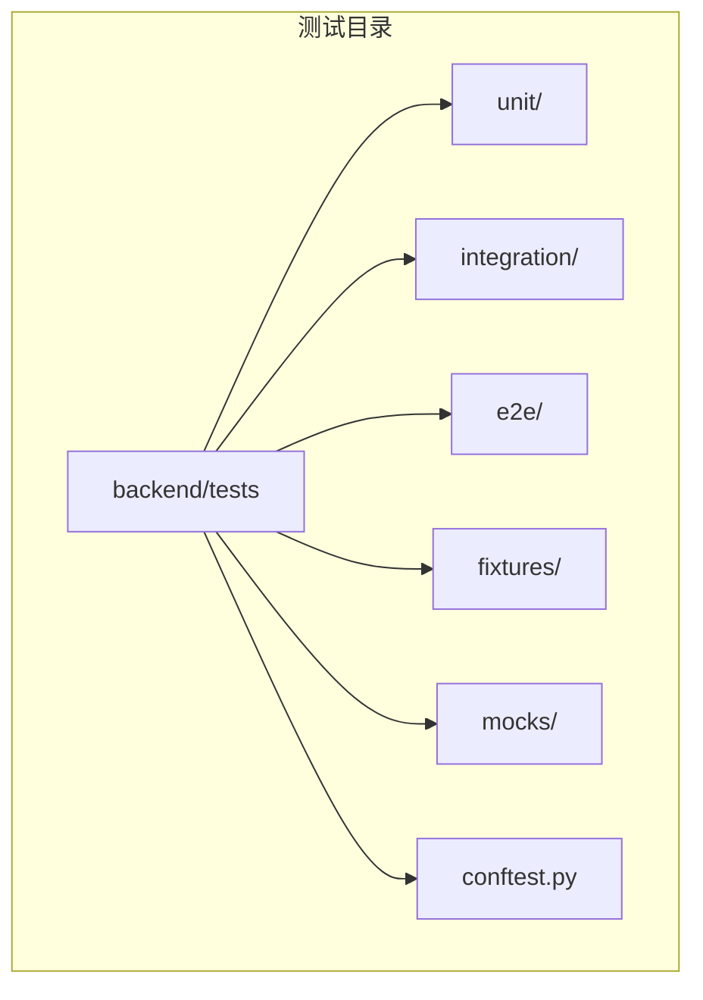
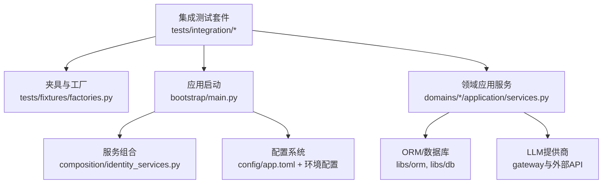
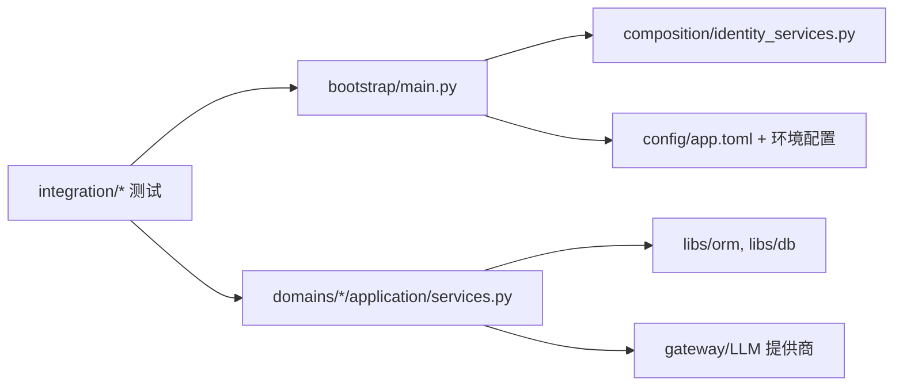

# 集成测试

<cite>
**本文引用的文件**
- [backend/tests/conftest.py](file://backend/tests/conftest.py)
- [backend/tests/e2e/conftest.py](file://backend/tests/e2e/conftest.py)
- [backend/tests/fixtures/factories.py](file://backend/tests/fixtures/factories.py)
- [backend/tests/integration/__init__.py](file://backend/tests/integration/__init__.py)
- [backend/tests/integration/test_llm_providers.py](file://backend/tests/integration/test_llm_providers.py)
- [backend/tests/integration/test_execution_config_integration.py](file://backend/tests/integration/test_execution_config_integration.py)
- [backend/tests/integration/test_memory_checkpoint_integration.py](file://backend/tests/integration/test_memory_checkpoint_integration.py)
- [backend/tests/integration/test_simplemem_integration.py](file://backend/tests/integration/test_simplemem_integration.py)
- [backend/tests/mocks/llm_mock.py](file://backend/tests/mocks/llm_mock.py)
- [backend/bootstrap/main.py](file://backend/bootstrap/main.py)
- [backend/bootstrap/composition/identity_services.py](file://backend/bootstrap/composition/identity_services.py)
- [backend/libs/db/__init__.py](file://backend/libs/db/__init__.py)
- [backend/domains/gateway/application/services.py](file://backend/domains/gateway/application/services.py)
- [backend/domains/agent/application/services.py](file://backend/domains/agent/application/services.py)
- [backend/domains/identity/application/services.py](file://backend/domains/identity/application/services.py)
- [backend/domains/session/application/services.py](file://backend/domains/session/application/services.py)
- [backend/domains/tenancy/application/services.py](file://backend/domains/tenancy/application/services.py)
- [backend/config/environments/local-dev.toml](file://backend/config/environments/local-dev.toml)
- [backend/config/environments/docker-dev.toml](file://backend/config/environments/docker-dev.toml)
- [backend/config/app.toml](file://backend/config/app.toml)
- [backend/scripts/run_dev_server.py](file://backend/scripts/run_dev_server.py)
- [backend/scripts/migrate_test_db.py](file://backend/scripts/migrate_test_db.py)
- [backend/alembic/env.py](file://backend/alembic/env.py)
- [backend/alembic/script.py.mako](file://backend/alembic/script.py.mako)
- [backend/alembic/versions/001_initial.py](file://backend/alembic/versions/001_initial.py)
- [backend/alembic/versions/011_add_anonymous_user_support.py](file://backend/alembic/versions/011_add_anonymous_user_support.py)
- [backend/docs/AUTHENTICATION.md](file://backend/docs/AUTHENTICATION.md)
- [backend/docs/CONFIGURATION.md](file://backend/docs/CONFIGURATION.md)
- [backend/docs/CHAT_MESSAGE_FLOW.md](file://backend/docs/CHAT_MESSAGE_FLOW.md)
- [backend/docs/gateway/GATEWAY_THIRDPARTY_CLIENT_GUIDE.md](file://backend/docs/gateway/GATEWAY_THIRDPARTY_CLIENT_GUIDE.md)
- [backend/docs/gateway/LLM_GATEWAY_ARCHITECTURE.md](file://backend/docs/gateway/LLM_GATEWAY_ARCHITECTURE.md)
- [backend/docs/AGENT_ARCHITECTURE_DESIGN.md](file://backend/docs/AGENT_ARCHITECTURE_DESIGN.md)
- [backend/docs/项目权限规则.md](file://backend/docs/项目权限规则.md)
- [backend/docs/沙箱资源管理设计文档.md](file://backend/docs/沙箱资源管理设计文档.md)
- [backend/libs/middleware/__init__.py](file://backend/libs/middleware/__init__.py)
- [backend/libs/orm/__init__.py](file://backend/libs/orm/__init__.py)
- [backend/libs/crypto.py](file://backend/libs/crypto.py)
- [backend/utils/cache.py](file://backend/utils/cache.py)
- [backend/utils/logging.py](file://backend/utils/logging.py)
- [backend/utils/tokens.py](file://backend/utils/tokens.py)
- [backend/utils/serialization.py](file://backend/utils/serialization.py)
- [backend/utils/model_connectivity.py](file://backend/utils/model_connectivity.py)
- [backend/utils/crypto.py](file://backend/utils/crypto.py)
- [backend/utils/background_tasks.py](file://backend/utils/background_tasks.py)
- [backend/utils/identity_bridge_deps.py](file://backend/utils/identity_bridge_deps.py)
- [backend/utils/cache.py](file://backend/utils/cache.py)
- [backend/utils/serialization.py](file://backend/utils/serialization.py)
- [backend/utils/tokens.py](file://backend/utils/tokens.py)
- [backend/utils/crypto.py](file://backend/utils/crypto.py)
- [backend/utils/model_connectivity.py](file://backend/utils/model_connectivity.py)
- [backend/utils/background_tasks.py](file://backend/utils/background_tasks.py)
- [backend/utils/identity_bridge_deps.py](file://backend/utils/identity_bridge_deps.py)
- [backend/utils/cache.py](file://backend/utils/cache.py)
- [backend/utils/serialization.py](file://backend/utils/serialization.py)
- [backend/utils/tokens.py](file://backend/utils/tokens.py)
- [backend/utils/crypto.py](file://backend/utils/crypto.py)
- [backend/utils/model_connectivity.py](file://backend/utils/model_connectivity.py)
- [backend/utils/background_tasks.py](file://backend/utils/background_tasks.py)
- [backend/utils/identity_bridge_deps.py](file://backend/utils/identity_bridge_deps.py)
</cite>

## 目录
1. [引言](#引言)
2. [项目结构](#项目结构)
3. [核心组件](#核心组件)
4. [架构总览](#架构总览)
5. [详细组件分析](#详细组件分析)
6. [依赖关系分析](#依赖关系分析)
7. [性能考量](#性能考量)
8. [故障排查指南](#故障排查指南)
9. [结论](#结论)
10. [附录](#附录)

## 引言
本指南面向测试工程师，提供AI Agent项目的集成测试实施方法论与实操步骤。内容覆盖REST API集成测试、数据库集成测试（含ORM、事务与一致性）、外部服务集成测试（LLM提供商、第三方网关与网络调用）、认证与授权集成测试（JWT、权限与安全边界）、跨模块集成测试（领域服务交互与业务流程）以及测试环境配置与调试排障。目标是帮助团队建立稳定、可重复、可维护的集成测试体系。

## 项目结构
后端采用分层与领域驱动设计，测试位于backend/tests目录，包含：
- unit：单元测试
- integration：集成测试（按功能域组织）
- e2e：端到端测试
- fixtures：工厂与共享资源
- mocks：模拟对象
- conftest.py：pytest全局配置与夹具

**图表来源**
- [backend/tests/conftest.py](file://backend/tests/conftest.py)
- [backend/tests/integration/__init__.py](file://backend/tests/integration/__init__.py)

**章节来源**
- [backend/tests/conftest.py](file://backend/tests/conftest.py)
- [backend/tests/e2e/conftest.py](file://backend/tests/e2e/conftest.py)
- [backend/tests/fixtures/factories.py](file://backend/tests/fixtures/factories.py)

## 核心组件
- 测试夹具与工厂：通过fixtures/factories.py提供可复用的实体构造器，确保测试数据一致性与隔离。
- 全局配置：tests/conftest.py与e2e/conftest.py定义pytest插件、fixture作用域、会话级资源初始化与清理。
- 应用启动与依赖注入：bootstrap/main.py与composition/identity_services.py负责应用启动、服务组合与身份服务装配。
- 配置与环境：config/app.toml与多环境配置文件（local-dev.toml、docker-dev.toml）控制运行时行为。
- 文档参考：AUTHENTICATION.md、CONFIGURATION.md、CHAT_MESSAGE_FLOW.md等为测试设计提供架构与流程依据。

**章节来源**
- [backend/tests/fixtures/factories.py](file://backend/tests/fixtures/factories.py)
- [backend/tests/conftest.py](file://backend/tests/conftest.py)
- [backend/tests/e2e/conftest.py](file://backend/tests/e2e/conftest.py)
- [backend/bootstrap/main.py](file://backend/bootstrap/main.py)
- [backend/bootstrap/composition/identity_services.py](file://backend/bootstrap/composition/identity_services.py)
- [backend/config/app.toml](file://backend/config/app.toml)
- [backend/config/environments/local-dev.toml](file://backend/config/environments/local-dev.toml)
- [backend/config/environments/docker-dev.toml](file://backend/config/environments/docker-dev.toml)
- [backend/docs/AUTHENTICATION.md](file://backend/docs/AUTHENTICATION.md)
- [backend/docs/CONFIGURATION.md](file://backend/docs/CONFIGURATION.md)
- [backend/docs/CHAT_MESSAGE_FLOW.md](file://backend/docs/CHAT_MESSAGE_FLOW.md)

## 架构总览
下图展示集成测试在系统中的位置与交互关系：测试通过夹具与工厂准备数据，借助应用启动入口与依赖注入容器，访问各领域应用服务，并与数据库、外部网关、LLM提供商进行端到端交互。

**图表来源**
- [backend/tests/integration/__init__.py](file://backend/tests/integration/__init__.py)
- [backend/tests/fixtures/factories.py](file://backend/tests/fixtures/factories.py)
- [backend/bootstrap/main.py](file://backend/bootstrap/main.py)
- [backend/bootstrap/composition/identity_services.py](file://backend/bootstrap/composition/identity_services.py)
- [backend/domains/gateway/application/services.py](file://backend/domains/gateway/application/services.py)
- [backend/domains/agent/application/services.py](file://backend/domains/agent/application/services.py)
- [backend/domains/identity/application/services.py](file://backend/domains/identity/application/services.py)
- [backend/domains/session/application/services.py](file://backend/domains/session/application/services.py)
- [backend/domains/tenancy/application/services.py](file://backend/domains/tenancy/application/services.py)
- [backend/libs/orm/__init__.py](file://backend/libs/orm/__init__.py)
- [backend/libs/db/__init__.py](file://backend/libs/db/__init__.py)
- [backend/config/app.toml](file://backend/config/app.toml)

## 详细组件分析

### REST API 集成测试
- 测试策略
  - 使用HTTP客户端对已部署或本地服务发起请求，覆盖典型业务路径（如聊天、会话、网关凭证探测等）。
  - 对关键端点进行状态码、响应结构、鉴权与权限校验测试。
  - 结合e2e测试配置，确保端到端链路完整。
- 请求模拟与断言
  - 利用夹具构造用户、会话与模型配置，确保每次测试的输入确定且可重复。
  - 断言响应字段、时间戳、分页参数等，避免脆弱断言。
- 示例路径
  - [backend/tests/e2e/test_api_paths_e2e.py](file://backend/tests/e2e/test_api_paths_e2e.py)
  - [backend/tests/e2e/test_chat_api_e2e.py](file://backend/tests/e2e/test_chat_api_e2e.py)

**章节来源**
- [backend/tests/e2e/conftest.py](file://backend/tests/e2e/conftest.py)
- [backend/tests/e2e/test_api_paths_e2e.py](file://backend/tests/e2e/test_api_paths_e2e.py)
- [backend/tests/e2e/test_chat_api_e2e.py](file://backend/tests/e2e/test_chat_api_e2e.py)

### 数据库集成测试
- ORM与事务
  - 使用libs/orm与libs/db提供的ORM接口执行查询、插入、更新与删除，确保SQL语义正确。
  - 在测试中使用事务回滚或专用测试数据库，保证测试隔离与可重复性。
- 迁移与模式
  - 通过alembic版本脚本（如001_initial.py、011_add_anonymous_user_support.py）验证数据库模式演进。
  - 使用scripts/migrate_test_db.py在测试前迁移至最新版本。
- 一致性验证
  - 基于fixtures/factories.py构造关联实体，验证外键约束、索引与默认值。
  - 对关键写入路径进行读后校验，确保数据完整性与一致性。
- 示例路径
  - [backend/libs/orm/__init__.py](file://backend/libs/orm/__init__.py)
  - [backend/libs/db/__init__.py](file://backend/libs/db/__init__.py)
  - [backend/alembic/versions/001_initial.py](file://backend/alembic/versions/001_initial.py)
  - [backend/alembic/versions/011_add_anonymous_user_support.py](file://backend/alembic/versions/011_add_anonymous_user_support.py)
  - [backend/scripts/migrate_test_db.py](file://backend/scripts/migrate_test_db.py)

**章节来源**
- [backend/libs/orm/__init__.py](file://backend/libs/orm/__init__.py)
- [backend/libs/db/__init__.py](file://backend/libs/db/__init__.py)
- [backend/alembic/versions/001_initial.py](file://backend/alembic/versions/001_initial.py)
- [backend/alembic/versions/011_add_anonymous_user_support.py](file://backend/alembic/versions/011_add_anonymous_user_support.py)
- [backend/scripts/migrate_test_db.py](file://backend/scripts/migrate_test_db.py)

### 外部服务集成测试
- LLM提供商与网关
  - 通过domains/gateway/application/services.py与文档GATEWAY_THIRDPARTY_CLIENT_GUIDE.md、LLM_GATEWAY_ARCHITECTURE.md，验证模型选择、凭证校验、请求路由与成本追踪。
  - 使用mocks/llm_mock.py模拟LLM响应，降低对外部API的耦合，同时保留错误场景与超时场景的测试覆盖。
- 第三方服务与网络调用
  - 对需要网络访问的场景，建议使用本地代理或容器化外部服务（如嵌入服务），并在测试中通过环境变量切换。
- 示例路径
  - [backend/tests/integration/test_llm_providers.py](file://backend/tests/integration/test_llm_providers.py)
  - [backend/tests/integration/test_execution_config_integration.py](file://backend/tests/integration/test_execution_config_integration.py)
  - [backend/tests/mocks/llm_mock.py](file://backend/tests/mocks/llm_mock.py)
  - [backend/docs/gateway/GATEWAY_THIRDPARTY_CLIENT_GUIDE.md](file://backend/docs/gateway/GATEWAY_THIRDPARTY_CLIENT_GUIDE.md)
  - [backend/docs/gateway/LLM_GATEWAY_ARCHITECTURE.md](file://backend/docs/gateway/LLM_GATEWAY_ARCHITECTURE.md)

**章节来源**
- [backend/tests/integration/test_llm_providers.py](file://backend/tests/integration/test_llm_providers.py)
- [backend/tests/integration/test_execution_config_integration.py](file://backend/tests/integration/test_execution_config_integration.py)
- [backend/tests/mocks/llm_mock.py](file://backend/tests/mocks/llm_mock.py)
- [backend/domains/gateway/application/services.py](file://backend/domains/gateway/application/services.py)
- [backend/docs/gateway/GATEWAY_THIRDPARTY_CLIENT_GUIDE.md](file://backend/docs/gateway/GATEWAY_THIRDPARTY_CLIENT_GUIDE.md)
- [backend/docs/gateway/LLM_GATEWAY_ARCHITECTURE.md](file://backend/docs/gateway/LLM_GATEWAY_ARCHITECTURE.md)

### 认证与授权集成测试
- JWT令牌与权限
  - 参考AUTHENTICATION.md与项目权限规则，验证登录、令牌刷新、权限上下文设置与资源访问控制。
  - 使用fixtures/factories.py创建不同角色用户，验证越权访问被拒绝。
- 安全边界
  - 覆盖敏感接口的鉴权失败、权限不足、匿名访问等边界条件。
- 示例路径
  - [backend/docs/AUTHENTICATION.md](file://backend/docs/AUTHENTICATION.md)
  - [backend/docs/项目权限规则.md](file://backend/docs/项目权限规则.md)
  - [backend/tests/fixtures/factories.py](file://backend/tests/fixtures/factories.py)

**章节来源**
- [backend/docs/AUTHENTICATION.md](file://backend/docs/AUTHENTICATION.md)
- [backend/docs/项目权限规则.md](file://backend/docs/项目权限规则.md)
- [backend/tests/fixtures/factories.py](file://backend/tests/fixtures/factories.py)

### 跨模块集成测试
- 领域服务交互
  - 通过bootstrap/main.py与composition/identity_services.py装配身份、会话、代理与租户等服务，验证跨模块协作。
  - 使用CHAT_MESSAGE_FLOW.md梳理消息流，确保从用户输入到LLM响应的完整链路。
- 业务流程验证
  - 以test_execution_config_integration.py、test_memory_checkpoint_integration.py、test_simplemem_integration.py为例，验证执行配置、记忆检查点与简单记忆等端到端流程。
- 示例路径
  - [backend/bootstrap/main.py](file://backend/bootstrap/main.py)
  - [backend/bootstrap/composition/identity_services.py](file://backend/bootstrap/composition/identity_services.py)
  - [backend/docs/CHAT_MESSAGE_FLOW.md](file://backend/docs/CHAT_MESSAGE_FLOW.md)
  - [backend/tests/integration/test_execution_config_integration.py](file://backend/tests/integration/test_execution_config_integration.py)
  - [backend/tests/integration/test_memory_checkpoint_integration.py](file://backend/tests/integration/test_memory_checkpoint_integration.py)
  - [backend/tests/integration/test_simplemem_integration.py](file://backend/tests/integration/test_simplemem_integration.py)

**章节来源**
- [backend/bootstrap/main.py](file://backend/bootstrap/main.py)
- [backend/bootstrap/composition/identity_services.py](file://backend/bootstrap/composition/identity_services.py)
- [backend/docs/CHAT_MESSAGE_FLOW.md](file://backend/docs/CHAT_MESSAGE_FLOW.md)
- [backend/tests/integration/test_execution_config_integration.py](file://backend/tests/integration/test_execution_config_integration.py)
- [backend/tests/integration/test_memory_checkpoint_integration.py](file://backend/tests/integration/test_memory_checkpoint_integration.py)
- [backend/tests/integration/test_simplemem_integration.py](file://backend/tests/integration/test_simplemem_integration.py)

## 依赖关系分析
- 组件耦合
  - 测试对应用启动与服务组合存在直接依赖；对ORM与数据库有间接依赖；对外部服务通过网关抽象解耦。
- 外部依赖
  - LLM提供商API、第三方网关、网络环境与配置文件共同决定测试的可执行性与稳定性。
- 依赖可视化

**图表来源**
- [backend/tests/integration/__init__.py](file://backend/tests/integration/__init__.py)
- [backend/bootstrap/main.py](file://backend/bootstrap/main.py)
- [backend/bootstrap/composition/identity_services.py](file://backend/bootstrap/composition/identity_services.py)
- [backend/domains/gateway/application/services.py](file://backend/domains/gateway/application/services.py)
- [backend/libs/orm/__init__.py](file://backend/libs/orm/__init__.py)
- [backend/libs/db/__init__.py](file://backend/libs/db/__init__.py)
- [backend/config/app.toml](file://backend/config/app.toml)

**章节来源**
- [backend/tests/integration/__init__.py](file://backend/tests/integration/__init__.py)
- [backend/bootstrap/main.py](file://backend/bootstrap/main.py)
- [backend/bootstrap/composition/identity_services.py](file://backend/bootstrap/composition/identity_services.py)
- [backend/domains/gateway/application/services.py](file://backend/domains/gateway/application/services.py)
- [backend/libs/orm/__init__.py](file://backend/libs/orm/__init__.py)
- [backend/libs/db/__init__.py](file://backend/libs/db/__init__.py)
- [backend/config/app.toml](file://backend/config/app.toml)

## 性能考量
- 测试并发与隔离
  - 使用独立测试数据库实例或容器，避免并发写入导致的锁争用与数据竞争。
- 外部依赖降噪
  - 通过llm_mock.py与本地网关代理减少真实网络调用，提升测试稳定性与速度。
- 批量与重试
  - 对外部API调用设置合理超时与指数退避，避免单点失败拖垮整个测试套件。
- 日志与可观测性
  - 使用utils/logging.py输出关键阶段日志，便于定位性能瓶颈与异常路径。

[本节为通用指导，不直接分析具体文件]

## 故障排查指南
- 启动与配置
  - 确认app.toml与环境配置一致，必要时使用scripts/run_dev_server.py快速验证本地服务可用性。
- 数据库问题
  - 若迁移失败，使用scripts/migrate_test_db.py回滚并重试；检查alembic版本脚本是否与当前模式匹配。
- 外部服务不可用
  - 使用llm_mock.py替换真实LLM响应，先验证核心流程；再逐步恢复真实调用。
- 权限与认证
  - 对照AUTHENTICATION.md与项目权限规则，确认用户角色、令牌与资源边界。
- 日志与缓存
  - 检查utils/logging.py输出与utils/cache.py缓存状态，排除缓存污染导致的非预期结果。

**章节来源**
- [backend/scripts/run_dev_server.py](file://backend/scripts/run_dev_server.py)
- [backend/scripts/migrate_test_db.py](file://backend/scripts/migrate_test_db.py)
- [backend/tests/mocks/llm_mock.py](file://backend/tests/mocks/llm_mock.py)
- [backend/docs/AUTHENTICATION.md](file://backend/docs/AUTHENTICATION.md)
- [backend/docs/项目权限规则.md](file://backend/docs/项目权限规则.md)
- [backend/utils/logging.py](file://backend/utils/logging.py)
- [backend/utils/cache.py](file://backend/utils/cache.py)

## 结论
通过规范化的夹具与工厂、严谨的配置与环境管理、清晰的领域服务交互与外部依赖解耦，本项目能够构建高可靠性的集成测试体系。建议持续完善mock策略、增强可观测性与日志记录，并定期回归关键业务流程，确保系统在演进过程中保持质量与稳定性。

[本节为总结性内容，不直接分析具体文件]

## 附录
- 快速开始
  - 在本地dev环境中加载配置，启动服务后运行集成测试套件。
- 推荐实践
  - 将测试数据与生产环境隔离；优先使用mock与本地代理；对关键路径增加断言与日志。
- 参考文档
  - CONFIGURATION.md、AUTHENTICATION.md、CHAT_MESSAGE_FLOW.md、GATEWAY_THIRDPARTY_CLIENT_GUIDE.md、LLM_GATEWAY_ARCHITECTURE.md。

[本节为补充信息，不直接分析具体文件]