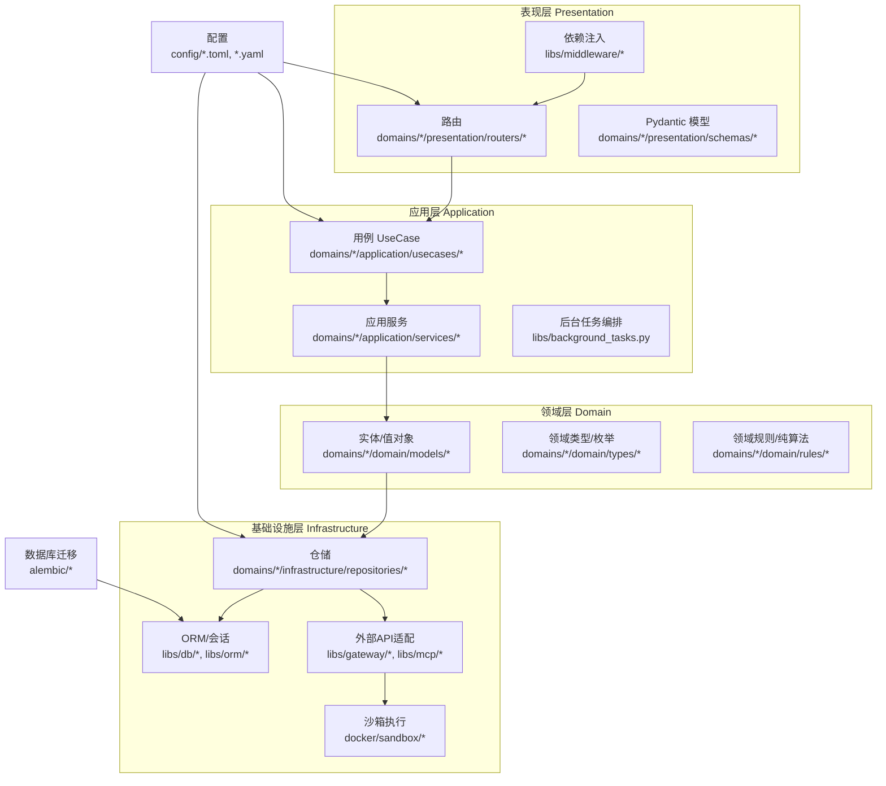
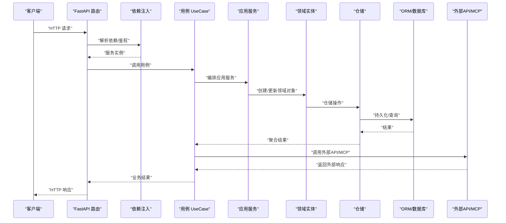
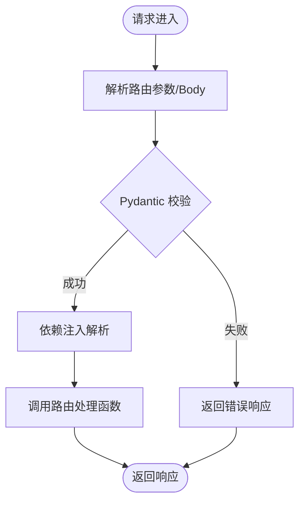
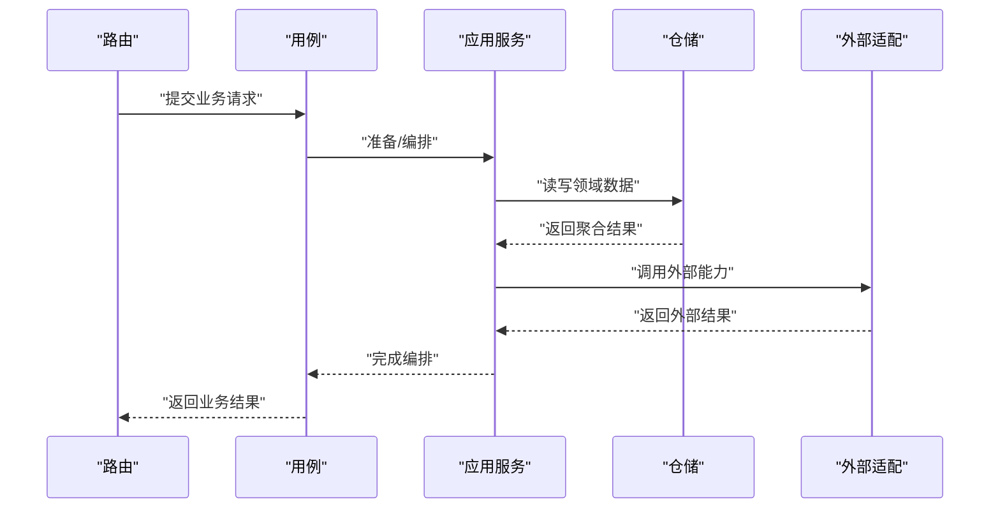
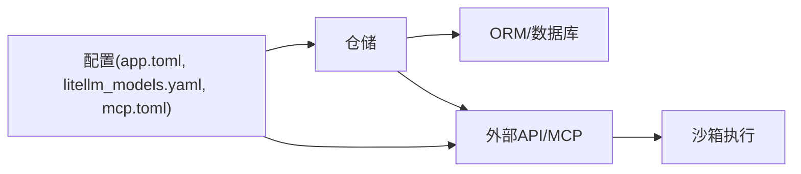
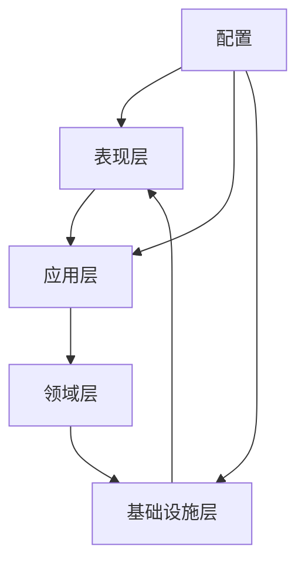

# 分层架构设计

<cite>
**本文引用的文件**
- [backend/pyproject.toml](file://backend/pyproject.toml)
- [backend/README.md](file://backend/README.md)
- [backend/docs/ARCHITECTURE.md](file://backend/docs/ARCHITECTURE.md)
- [backend/docs/AGENT_ARCHITECTURE_DESIGN.md](file://backend/docs/AGENT_ARCHITECTURE_DESIGN.md)
- [backend/docs/CONTEXT_MANAGEMENT_IMPLEMENTATION.md](file://backend/docs/CONTEXT_MANAGEMENT_IMPLEMENTATION.md)
- [backend/docs/LANGGRAPH_ARCHITECTURE_RATIONALE.md](file://backend/docs/LANGGRAPH_ARCHITECTURE_RATIONALE.md)
- [backend/docs/沙箱资源管理设计文档.md](file://backend/docs/沙箱资源管理设计文档.md)
- [backend/domains/agent/presentation/routers/agent.py](file://backend/domains/agent/presentation/routers/agent.py)
- [backend/domains/agent/application/usecases/agent_usecase.py](file://backend/domains/agent/application/usecases/agent_usecase.py)
- [backend/domains/agent/domain/models/agent.py](file://backend/domains/agent/domain/models/agent.py)
- [backend/domains/agent/infrastructure/repositories/agent_repository.py](file://backend/domains/agent/infrastructure/repositories/agent_repository.py)
- [backend/libs/db/__init__.py](file://backend/libs/db/__init__.py)
- [backend/libs/orm/__init__.py](file://backend/libs/orm/__init__.py)
- [backend/libs/middleware/__init__.py](file://backend/libs/middleware/__init__.py)
- [backend/libs/background_tasks.py](file://backend/libs/background_tasks.py)
- [backend/bootstrap/main.py](file://backend/bootstrap/main.py)
- [backend/bootstrap/composition/identity_services.py](file://backend/bootstrap/composition/identity_services.py)
- [backend/bootstrap/event_loop.py](file://backend/bootstrap/event_loop.py)
- [backend/bootstrap/config.py](file://backend/bootstrap/config.py)
- [backend/bootstrap/config_loader.py](file://backend/bootstrap/config_loader.py)
- [backend/alembic/env.py](file://backend/alembic/env.py)
- [backend/alembic/script.py.mako](file://backend/alembic/script.py.mako)
- [backend/config/app.toml](file://backend/config/app.toml)
- [backend/config/execution.toml](file://backend/config/execution.toml)
- [backend/config/litellm_models.yaml](file://backend/config/litellm_models.yaml)
- [backend/config/mcp.toml](file://backend/config/mcp.toml)
- [backend/config/tools.toml](file://backend/config/tools.toml)
- [backend/libs/types/__init__.py](file://backend/libs/types/__init__.py)
- [backend/libs/crypto.py](file://backend/libs/crypto.py)
- [backend/libs/model_connectivity.py](file://backend/libs/model_connectivity.py)
- [backend/utils/logging.py](file://backend/utils/logging.py)
- [backend/utils/cache.py](file://backend/utils/cache.py)
- [backend/utils/tokens.py](file://backend/utils/tokens.py)
- [backend/utils/serialization.py](file://backend/utils/serialization.py)
- [backend/tests/architecture/test_agent_no_gateway_domain_import.py](file://backend/tests/architecture/test_agent_no_gateway_domain_import.py)
- [backend/tests/architecture/test_domain_no_sqlalchemy_import.py](file://backend/tests/architecture/test_domain_no_sqlalchemy_import.py)
- [backend/tests/architecture/test_presentation_no_infrastructure.py](file://backend/tests/architecture/test_presentation_no_infrastructure.py)
- [backend/docker/sandbox/Dockerfile](file://backend/docker/sandbox/Dockerfile)
- [backend/docker/sandbox/build.sh](file://backend/docker/sandbox/build.sh)
- [backend/docker/sandbox/README.md](file://backend/docker/sandbox/README.md)
</cite>

## 目录
1. [引言](#引言)
2. [项目结构](#项目结构)
3. [核心组件](#核心组件)
4. [架构总览](#架构总览)
5. [详细组件分析](#详细组件分析)
6. [依赖分析](#依赖分析)
7. [性能考虑](#性能考虑)
8. [故障排查指南](#故障排查指南)
9. [结论](#结论)
10. [附录](#附录)

## 引言
本设计文档面向AI Agent系统的分层架构，基于领域驱动设计（DDD）理念，明确划分四层：Presentation层（表现层）、Application层（应用层）、Domain层（领域层）、Infrastructure层（基础设施工）。文档从职责边界、数据流、依赖方向、交互流程、依赖关系图与最佳实践等维度，系统化阐述各层如何协同工作，并给出针对FastAPI路由、Pydantic Schema、依赖注入、UseCase、应用服务、后台任务编排、实体与领域类型、ORM与仓储、外部API适配与沙箱等主题的具体落地方法。

## 项目结构
后端采用多域（domain）组织方式，每个域下按分层组织代码：presentation（表现层）、application（应用层）、domain（领域层）、infrastructure（基础设施层）。配置与引导位于bootstrap、config、libs、utils等目录；数据库迁移由alembic管理；测试覆盖架构约束与单元/集成测试。



图表来源
- [backend/domains/agent/presentation/routers/agent.py](file://backend/domains/agent/presentation/routers/agent.py)
- [backend/domains/agent/application/usecases/agent_usecase.py](file://backend/domains/agent/application/usecases/agent_usecase.py)
- [backend/domains/agent/domain/models/agent.py](file://backend/domains/agent/domain/models/agent.py)
- [backend/domains/agent/infrastructure/repositories/agent_repository.py](file://backend/domains/agent/infrastructure/repositories/agent_repository.py)
- [backend/libs/db/__init__.py](file://backend/libs/db/__init__.py)
- [backend/libs/orm/__init__.py](file://backend/libs/orm/__init__.py)
- [backend/libs/middleware/__init__.py](file://backend/libs/middleware/__init__.py)
- [backend/libs/background_tasks.py](file://backend/libs/background_tasks.py)
- [backend/alembic/env.py](file://backend/alembic/env.py)
- [backend/config/app.toml](file://backend/config/app.toml)

章节来源
- [backend/README.md](file://backend/README.md)
- [backend/docs/ARCHITECTURE.md](file://backend/docs/ARCHITECTURE.md)

## 核心组件
- 表现层（Presentation）
  - FastAPI路由：定义HTTP接口、请求/响应模型、中间件与依赖注入。
  - Pydantic Schema：输入校验、输出序列化与字段约束。
  - 依赖注入：通过中间件与依赖工厂向路由注入服务实例。
- 应用层（Application）
  - UseCase：封装业务用例，协调应用服务与外部适配器，保证事务与一致性。
  - 应用服务：跨聚合或跨领域的协调者，处理复杂编排。
  - 后台任务编排：异步任务队列、重试、幂等与可观测性。
- 领域层（Domain）
  - 实体与值对象：不变量与行为封装，领域逻辑内聚。
  - 领域类型：强类型标识符、枚举与领域专用类型。
  - 纯算法：不依赖框架或外部状态的纯函数式规则。
- 基础设施层（Infrastructure）
  - ORM与仓储：数据持久化抽象、查询与索引策略。
  - 外部API适配：网关代理、MCP服务器、LLM提供商对接。
  - 沙箱：受限容器执行工具调用，隔离与安全。

章节来源
- [backend/docs/AGENT_ARCHITECTURE_DESIGN.md](file://backend/docs/AGENT_ARCHITECTURE_DESIGN.md)
- [backend/docs/CONTEXT_MANAGEMENT_IMPLEMENTATION.md](file://backend/docs/CONTEXT_MANAGEMENT_IMPLEMENTATION.md)
- [backend/docs/LANGGRAPH_ARCHITECTURE_RATIONALE.md](file://backend/docs/LANGGRAPH_ARCHITECTURE_RATIONALE.md)

## 架构总览
系统以“路由→用例→应用服务→领域→仓储→ORM/外部适配”的链路流转，遵循“依赖倒置”原则：上层仅依赖抽象，下层实现抽象；配置与引导贯穿全栈，确保环境切换与部署一致性。



图表来源
- [backend/domains/agent/presentation/routers/agent.py](file://backend/domains/agent/presentation/routers/agent.py)
- [backend/domains/agent/application/usecases/agent_usecase.py](file://backend/domains/agent/application/usecases/agent_usecase.py)
- [backend/domains/agent/infrastructure/repositories/agent_repository.py](file://backend/domains/agent/infrastructure/repositories/agent_repository.py)
- [backend/libs/db/__init__.py](file://backend/libs/db/__init__.py)
- [backend/libs/orm/__init__.py](file://backend/libs/orm/__init__.py)

## 详细组件分析

### 表现层（Presentation）
- FastAPI路由
  - 职责：定义REST接口、参数绑定、异常映射、鉴权与限流。
  - 典型位置：domains/*/presentation/routers/*
  - 示例参考：[路由定义](file://backend/domains/agent/presentation/routers/agent.py)
- Pydantic Schema
  - 职责：输入验证、输出序列化、字段默认值与校验规则。
  - 典型位置：domains/*/presentation/schemas/*
  - 参考：与路由配合进行请求/响应建模
- 依赖注入机制
  - 职责：集中管理服务实例生命周期、鉴权上下文、配置注入。
  - 典型位置：libs/middleware/* 与 bootstrap/composition/*
  - 参考：[身份服务组合](file://backend/bootstrap/composition/identity_services.py)



图表来源
- [backend/domains/agent/presentation/routers/agent.py](file://backend/domains/agent/presentation/routers/agent.py)
- [backend/libs/middleware/__init__.py](file://backend/libs/middleware/__init__.py)

章节来源
- [backend/domains/agent/presentation/routers/agent.py](file://backend/domains/agent/presentation/routers/agent.py)
- [backend/bootstrap/composition/identity_services.py](file://backend/bootstrap/composition/identity_services.py)

### 应用层（Application）
- UseCase
  - 职责：封装完整业务场景，协调应用服务与外部适配器，保证业务一致性。
  - 典型位置：domains/*/application/usecases/*
  - 示例参考：[Agent用例](file://backend/domains/agent/application/usecases/agent_usecase.py)
- 应用服务
  - 职责：跨聚合/跨领域的协调者，编排多个实体与仓储。
  - 典型位置：domains/*/application/services/*
- 后台任务编排
  - 职责：异步执行、重试、幂等、可观测性与失败恢复。
  - 典型位置：libs/background_tasks.py
  - 参考：[后台任务](file://backend/libs/background_tasks.py)



图表来源
- [backend/domains/agent/application/usecases/agent_usecase.py](file://backend/domains/agent/application/usecases/agent_usecase.py)
- [backend/libs/background_tasks.py](file://backend/libs/background_tasks.py)

章节来源
- [backend/domains/agent/application/usecases/agent_usecase.py](file://backend/domains/agent/application/usecases/agent_usecase.py)
- [backend/libs/background_tasks.py](file://backend/libs/background_tasks.py)

### 领域层（Domain）
- 实体与值对象
  - 职责：封装不变量、行为与领域知识，避免跨层泄露。
  - 典型位置：domains/*/domain/models/*
  - 示例参考：[Agent实体](file://backend/domains/agent/domain/models/agent.py)
- 领域类型
  - 职责：强类型标识符、枚举与领域专用类型，提升表达力与安全性。
  - 典型位置：domains/*/domain/types/*
- 纯算法
  - 职责：不依赖外部状态的纯函数式规则，便于测试与复用。
  - 典型位置：domains/*/domain/rules/*

```mermaid
classDiagram
class AgentEntity {
"+领域属性"
"+领域行为()"
"+不变量检查()"
}
class AgentUseCase {
"+执行业务场景()"
"+编排应用服务()"
}
class AgentRepository {
"+保存()"
"+查询()"
}
AgentUseCase --> AgentEntity : "创建/更新"
AgentUseCase --> AgentRepository : "读写数据"
AgentRepository --> AgentEntity : "映射持久化"
```

图表来源
- [backend/domains/agent/domain/models/agent.py](file://backend/domains/agent/domain/models/agent.py)
- [backend/domains/agent/application/usecases/agent_usecase.py](file://backend/domains/agent/application/usecases/agent_usecase.py)
- [backend/domains/agent/infrastructure/repositories/agent_repository.py](file://backend/domains/agent/infrastructure/repositories/agent_repository.py)

章节来源
- [backend/domains/agent/domain/models/agent.py](file://backend/domains/agent/domain/models/agent.py)

### 基础设施层（Infrastructure）
- ORM与仓储
  - 职责：抽象数据访问、事务控制、查询优化与索引策略。
  - 典型位置：libs/db/*, libs/orm/*, domains/*/infrastructure/repositories/*
  - 参考：[数据库初始化](file://backend/libs/db/__init__.py), [ORM入口](file://backend/libs/orm/__init__.py)
- 外部API适配
  - 职责：网关代理、MCP服务器、LLM提供商对接，统一错误与重试。
  - 典型位置：libs/gateway/*, libs/mcp/*
  - 参考：[配置模型](file://backend/config/litellm_models.yaml), [MCP配置](file://backend/config/mcp.toml)
- 沙箱
  - 职责：受限容器执行工具调用，隔离与安全。
  - 典型位置：docker/sandbox/*
  - 参考：[沙箱Dockerfile](file://backend/docker/sandbox/Dockerfile)



图表来源
- [backend/libs/db/__init__.py](file://backend/libs/db/__init__.py)
- [backend/libs/orm/__init__.py](file://backend/libs/orm/__init__.py)
- [backend/config/app.toml](file://backend/config/app.toml)
- [backend/config/litellm_models.yaml](file://backend/config/litellm_models.yaml)
- [backend/config/mcp.toml](file://backend/config/mcp.toml)
- [backend/docker/sandbox/Dockerfile](file://backend/docker/sandbox/Dockerfile)

章节来源
- [backend/libs/db/__init__.py](file://backend/libs/db/__init__.py)
- [backend/libs/orm/__init__.py](file://backend/libs/orm/__init__.py)
- [backend/config/app.toml](file://backend/config/app.toml)
- [backend/config/litellm_models.yaml](file://backend/config/litellm_models.yaml)
- [backend/config/mcp.toml](file://backend/config/mcp.toml)
- [backend/docker/sandbox/Dockerfile](file://backend/docker/sandbox/Dockerfile)

## 依赖分析
- 层间依赖方向
  - 上层依赖下层抽象，下层不依赖上层。
  - 配置与引导贯穿全栈，但不反向依赖业务层。
- 关键依赖关系
  - 路由依赖用例；用例依赖应用服务与仓储；仓储依赖ORM与外部适配；外部适配依赖沙箱与配置。
- 架构约束测试
  - 测试确保领域层不直接依赖SQLAlchemy、表现层不直接依赖基础设施等。



图表来源
- [backend/tests/architecture/test_domain_no_sqlalchemy_import.py](file://backend/tests/architecture/test_domain_no_sqlalchemy_import.py)
- [backend/tests/architecture/test_presentation_no_infrastructure.py](file://backend/tests/architecture/test_presentation_no_infrastructure.py)
- [backend/tests/architecture/test_agent_no_gateway_domain_import.py](file://backend/tests/architecture/test_agent_no_gateway_domain_import.py)

章节来源
- [backend/tests/architecture/test_domain_no_sqlalchemy_import.py](file://backend/tests/architecture/test_domain_no_sqlalchemy_import.py)
- [backend/tests/architecture/test_presentation_no_infrastructure.py](file://backend/tests/architecture/test_presentation_no_infrastructure.py)
- [backend/tests/architecture/test_agent_no_gateway_domain_import.py](file://backend/tests/architecture/test_agent_no_gateway_domain_import.py)

## 性能考虑
- 数据库层
  - 使用索引与查询优化，避免N+1查询；分页与缓存结合。
  - 参考：alembic版本脚本中包含索引优化与表结构调整。
- 缓存
  - 利用内存/分布式缓存减少重复计算与IO。
  - 参考：[缓存工具](file://backend/utils/cache.py)
- 异步与并发
  - 后台任务与限流策略，避免阻塞主请求路径。
  - 参考：[后台任务](file://backend/libs/background_tasks.py)
- 日志与可观测性
  - 结构化日志与追踪ID，定位热点与瓶颈。
  - 参考：[日志工具](file://backend/utils/logging.py)

## 故障排查指南
- 配置问题
  - 检查app.toml、litellm_models.yaml、mcp.toml是否正确加载与生效。
  - 参考：[配置加载](file://backend/bootstrap/config_loader.py)
- 数据库迁移
  - 确认alembic版本与目标数据库一致，必要时回滚/升级。
  - 参考：[迁移环境](file://backend/alembic/env.py), [迁移脚本模板](file://backend/alembic/script.py.mako)
- 路由与依赖
  - 排查依赖注入是否正确解析，中间件是否拦截异常。
  - 参考：[中间件](file://backend/libs/middleware/__init__.py)
- 外部适配
  - 检查网关/LLM/MCP连接状态与凭据，关注超时与重试策略。
  - 参考：[模型连通性](file://backend/libs/model_connectivity.py)
- 沙箱执行
  - 查看容器构建与运行日志，确认资源限制与权限。
  - 参考：[沙箱构建脚本](file://backend/docker/sandbox/build.sh), [沙箱说明](file://backend/docker/sandbox/README.md)

章节来源
- [backend/bootstrap/config_loader.py](file://backend/bootstrap/config_loader.py)
- [backend/alembic/env.py](file://backend/alembic/env.py)
- [backend/alembic/script.py.mako](file://backend/alembic/script.py.mako)
- [backend/libs/middleware/__init__.py](file://backend/libs/middleware/__init__.py)
- [backend/libs/model_connectivity.py](file://backend/libs/model_connectivity.py)
- [backend/docker/sandbox/build.sh](file://backend/docker/sandbox/build.sh)
- [backend/docker/sandbox/README.md](file://backend/docker/sandbox/README.md)

## 结论
该分层架构以DDD为核心，清晰划分职责边界，通过依赖注入与配置引导实现松耦合高内聚。表现层专注接口与契约，应用层负责编排与一致性，领域层承载不变量与规则，基础设施层屏蔽技术细节。配合后台任务、缓存与可观测性，系统具备良好的扩展性、可维护性与可测试性。

## 附录
- 快速参考
  - 路由与Schema：domains/*/presentation/routers/* 与 domains/*/presentation/schemas/*
  - 用例与应用服务：domains/*/application/usecases/* 与 domains/*/application/services/*
  - 领域模型与类型：domains/*/domain/models/* 与 domains/*/domain/types/*
  - 仓储与ORM：domains/*/infrastructure/repositories/* 与 libs/db/*, libs/orm/*
  - 配置：config/*.toml, *.yaml
  - 迁移：alembic/*
  - 沙箱：docker/sandbox/*