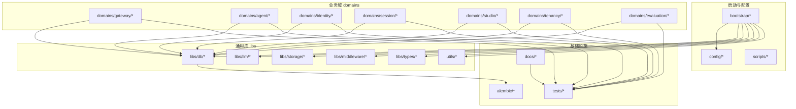
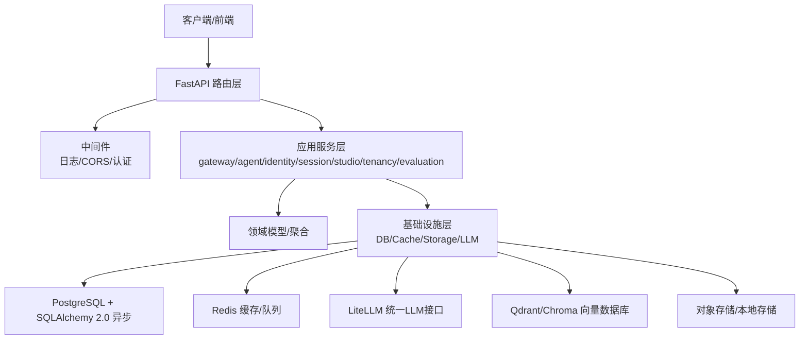
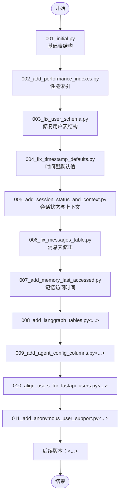
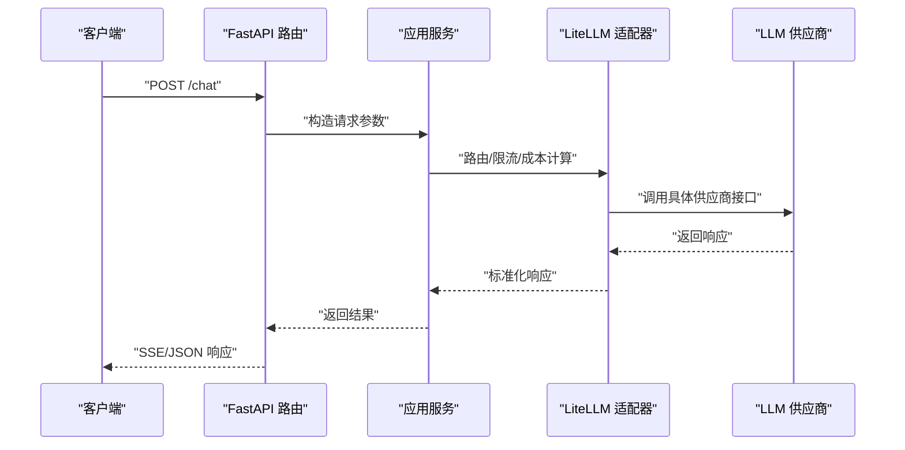
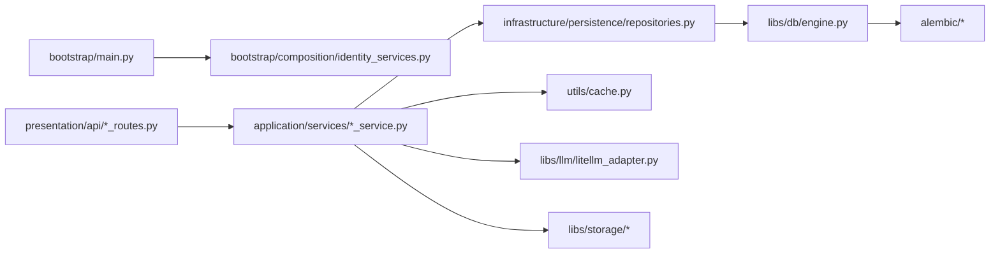

# 技术栈与选型

<cite>
**本文引用的文件**
- [pyproject.toml](file://backend/pyproject.toml)
- [Dockerfile](file://backend/Dockerfile)
- [Dockerfile.base](file://backend/Dockerfile.base)
- [Makefile](file://backend/Makefile)
- [alembic.ini](file://backend/alembic.ini)
- [alembic/env.py](file://backend/alembic/env.py)
- [alembic/script.py.mako](file://backend/alembic/script.py.mako)
- [alembic/versions/001_initial.py](file://backend/alembic/versions/001_initial.py)
- [alembic/versions/002_add_performance_indexes.py](file://backend/alembic/versions/002_add_performance_indexes.py)
- [alembic/versions/003_fix_user_schema.py](file://backend/alembic/versions/003_fix_user_schema.py)
- [alembic/versions/004_fix_timestamp_defaults.py](file://backend/alembic/versions/004_fix_timestamp_defaults.py)
- [alembic/versions/005_add_session_status_and_context.py](file://backend/alembic/versions/005_add_session_status_and_context.py)
- [alembic/versions/006_fix_messages_table.py](file://backend/alembic/versions/006_fix_messages_table.py)
- [alembic/versions/007_add_memory_last_accessed.py](file://backend/alembic/versions/007_add_memory_last_accessed.py)
- [alembic/versions/008_add_langgraph_tables.py](file://backend/alembic/versions/008_add_langgraph_tables.py)
- [alembic/versions/009_add_agent_config_columns.py](file://backend/alembic/versions/009_add_agent_config_columns.py)
- [alembic/versions/010_align_users_for_fastapi_users.py](file://backend/alembic/versions/010_align_users_for_fastapi_users.py)
- [alembic/versions/011_add_anonymous_user_support.py](file://backend/alembic/versions/011_add_anonymous_user_support.py)
- [alembic/versions/20260123_212703_add_config_column_to_sessions.py](file://backend/alembic/versions/20260123_212703_add_config_column_to_sessions.py)
- [alembic/versions/20260127_150000_add_mcp_servers.py](file://backend/alembic/versions/20260127_150000_add_mcp_servers.py)
- [alembic/versions/20260127_160000_add_mcp_connection_status_and_tools.py](file://backend/alembic/versions/20260127_160000_add_mcp_connection_status_and_tools.py)
- [alembic/versions/20260127_170000_add_mcp_description_and_category.py](file://backend/alembic/versions/20260127_170000_add_mcp_description_and_category.py)
- [alembic/versions/20260127_180000_add_api_keys.py](file://backend/alembic/versions/20260127_180000_add_api_keys.py)
- [alembic/versions/20260128_081900_add_updated_at_to_usage_logs.py](file://backend/alembic/versions/20260128_081900_add_updated_at_to_usage_logs.py)
- [alembic/versions/20260128_090000_drop_api_key_foreign_keys.py](file://backend/alembic/versions/20260128_090000_drop_api_key_foreign_keys.py)
- [alembic/versions/20260128_100000_add_llm_key_quota_tables.py](file://backend/alembic/versions/20260128_100000_add_llm_key_quota_tables.py)
- [alembic/versions/20260128_add_encrypted_key.py](file://backend/alembic/versions/20260128_add_encrypted_key.py)
- [alembic/versions/20260129_add_mcp_dynamic_prompts.py](file://backend/alembic/versions/20260129_add_mcp_dynamic_prompts.py)
- [alembic/versions/20260129_add_mcp_dynamic_tools.py](file://backend/alembic/versions/20260129_add_mcp_dynamic_tools.py)
- [alembic/versions/20260129_add_mcp_template_fields.py](file://backend/alembic/versions/20260129_add_mcp_template_fields.py)
- [alembic/versions/20260129_seed_default_mcp_prompts.py](file://backend/alembic/versions/20260129_seed_default_mcp_prompts.py)
- [alembic/versions/20260202_add_video_gen_tasks.py](file://backend/alembic/versions/20260202_add_video_gen_tasks.py)
- [alembic/versions/20260202_agents_tools_jsonb_to_array.py](file://backend/alembic/versions/20260202_agents_tools_jsonb_to_array.py)
- [alembic/versions/20260205_add_session_video_task_count.py](file://backend/alembic/versions/20260205_add_session_video_task_count.py)
- [alembic/versions/20260205_add_user_vendor_creator_id.py](file://backend/alembic/versions/20260205_add_user_vendor_creator_id.py)
- [alembic/versions/20260205_add_video_model_duration.py](file://backend/alembic/versions/20260205_add_video_model_duration.py)
- [alembic/versions/20260209_add_product_info_tables.py](file://backend/alembic/versions/20260209_add_product_info_tables.py)
- [alembic/versions/20260224_add_step_phase_columns.py](file://backend/alembic/versions/20260224_add_step_phase_columns.py)
- [alembic/versions/20260224_add_user_models_table.py](file://backend/alembic/versions/20260224_add_user_models_table.py)
- [alembic/versions/20260508_add_gateway_tables.py](file://backend/alembic/versions/20260508_add_gateway_tables.py)
- [alembic/versions/20260508_add_provider_credentials.py](file://backend/alembic/versions/20260508_add_provider_credentials.py)
- [alembic/versions/20260513_unique_system_vkey_per_team.py](file://backend/alembic/versions/20260513_unique_system_vkey_per_team.py)
- [alembic/versions/20260514_add_model_last_test_reason.py](file://backend/alembic/versions/20260514_add_model_last_test_reason.py)
- [alembic/versions/20260514_add_model_last_test_status.py](file://backend/alembic/versions/20260514_add_model_last_test_status.py)
- [alembic/versions/20260514_drop_studio_workflow_tables.py](file://backend/alembic/versions/20260514_drop_studio_workflow_tables.py)
- [alembic/versions/20260514_gateway_budget_model_name.py](file://backend/alembic/versions/20260514_gateway_budget_model_name.py)
- [alembic/versions/20260514_gateway_log_credential_dim.py](file://backend/alembic/versions/20260514_gateway_log_credential_dim.py)
- [alembic/versions/20260514_gateway_log_deployment_dim.py](file://backend/alembic/versions/20260514_gateway_log_deployment_dim.py)
- [alembic/versions/20260514_unique_active_personal_team_per_owner.py](file://backend/alembic/versions/20260514_unique_active_personal_team_per_owner.py)
- [alembic/versions/20260515_api_key_gateway_grants.py](file://backend/alembic/versions/20260515_api_key_gateway_grants.py)
- [alembic/versions/20260515_drop_gateway_legacy_user_model.py](file://backend/alembic/versions/20260515_drop_gateway_legacy_user_model.py)
- [alembic/versions/20260515_drop_provider_credential_legacy_user_model.py](file://backend/alembic/versions/20260515_drop_provider_credential_legacy_user_model.py)
- [alembic/versions/20260515_drop_user_models.py](file://backend/alembic/versions/20260515_drop_user_models.py)
- [alembic/versions/20260515_gateway_legacy_user_model.py](file://backend/alembic/versions/20260515_gateway_legacy_user_model.py)
- [alembic/versions/20260515_migrate_user_models_data.py](file://backend/alembic/versions/20260515_migrate_user_models_data.py)
- [alembic/versions/20260518_gateway_model_pricing.py](file://backend/alembic/versions/20260518_gateway_model_pricing.py)
- [alembic/versions/20260518_gateway_provider_entitlement_plans.py](file://backend/alembic/versions/20260518_gateway_provider_entitlement_plans.py)
- [alembic/versions/20260519_drop_user_provider_configs.py](file://backend/alembic/versions/20260519_drop_user_provider_configs.py)
- [alembic/versions/20260520_add_system_storage_config.py](file://backend/alembic/versions/20260520_add_system_storage_config.py)
- [alembic/versions/20260520_gateway_request_log_client.py](file://backend/alembic/versions/20260520_gateway_request_log_client.py)
- [alembic/versions/20260520_system_storage_config_single_active.py](file://backend/alembic/versions/20260520_system_storage_config_single_active.py)
- [alembic/versions/20260521_tenant_data_scope.py](file://backend/alembic/versions/20260521_tenant_data_scope.py)
- [alembic/versions/20260522_tenant_phase3.py](file://backend/alembic/versions/20260522_tenant_phase3.py)
- [alembic/versions/20260523_sessions_agents_tenant_id.py](file://backend/alembic/versions/20260523_sessions_agents_tenant_id.py)
- [alembic/versions/20260524_drop_agents_user_id.py](file://backend/alembic/versions/20260524_drop_agents_user_id.py)
- [alembic/versions/20260525_drop_sessions_owner_columns.py](file://backend/alembic/versions/20260525_drop_sessions_owner_columns.py)
- [alembic/versions/20260526_credential_profile_call_shape.py](file://backend/alembic/versions/20260526_credential_profile_call_shape.py)
- [alembic/versions/20260526_provider_credentials_tenant_id.py](file://backend/alembic/versions/20260526_provider_credentials_tenant_id.py)
- [alembic/versions/20260527_193526_merge_gateway_preflight_and_log_heads.py](file://backend/alembic/versions/20260527_193526_merge_gateway_preflight_and_log_heads.py)
- [alembic/versions/20260527_backfill_request_log_provider.py](file://backend/alembic/versions/20260527_backfill_request_log_provider.py)
- [alembic/versions/20260527_credential_api_bases.py](file://backend/alembic/versions/20260527_credential_api_bases.py)
- [alembic/versions/20260527_provider_credentials_scope_nullable.py](file://backend/alembic/versions/20260527_provider_credentials_scope_nullable.py)
- [alembic/versions/20260527_slow_sql_hotpath_indexes.py](file://backend/alembic/versions/20260527_slow_sql_hotpath_indexes.py)
- [alembic/versions/20260528_backfill_request_log_provider_v2.py](file://backend/alembic/versions/20260528_backfill_request_log_provider_v2.py)
- [alembic/versions/20260528_backfill_request_log_user.py](file://backend/alembic/versions/20260528_backfill_request_log_user.py)
- [alembic/versions/20260528_system_gateway_models_credential_fk.py](file://backend/alembic/versions/20260528_system_gateway_models_credential_fk.py)
- [alembic/versions/20260529_gateway_budgets_rename_to_target.py](file://backend/alembic/versions/20260529_gateway_budgets_rename_to_target.py)
- [alembic/versions/20260530_downstream_pricing_scope_tenant.py](file://backend/alembic/versions/20260530_downstream_pricing_scope_tenant.py)
- [alembic/versions/20260531_owned_resources_tenant_id.py](file://backend/alembic/versions/20260531_owned_resources_tenant_id.py)
- [alembic/versions/20260601_drop_legacy_tenant_id_fks.py](file://backend/alembic/versions/20260601_drop_legacy_tenant_id_fks.py)
- [alembic/versions/20260602_drop_all_db_foreign_keys.py](file://backend/alembic/versions/20260602_drop_all_db_foreign_keys.py)
- [alembic/versions/20260603_system_visibility_acl.py](file://backend/alembic/versions/20260603_system_visibility_acl.py)
- [alembic/versions/20260604_api_keys_revoked_at.py](file://backend/alembic/versions/20260604_api_keys_revoked_at.py)
- [alembic/versions/20260605_migrate_system_cred_models.py](file://backend/alembic/versions/20260605_migrate_system_cred_models.py)
- [alembic/versions/20260606_migrate_anonymous_shadow_to_deterministic_tenant.py](file://backend/alembic/versions/20260606_migrate_anonymous_shadow_to_deterministic_tenant.py)
- [alembic/versions/20260607_gateway_preflight_indexes.py](file://backend/alembic/versions/20260607_gateway_preflight_indexes.py)
- [alembic/versions/20260607_gateway_request_log_tenant_route_time.py](file://backend/alembic/versions/20260607_gateway_request_log_tenant_route_time.py)
- [alembic/versions/20260608_provider_credentials_created_by.py](file://backend/alembic/versions/20260608_provider_credentials_created_by.py)
- [alembic/versions/20260609_add_user_giikin_user_id.py](file://backend/alembic/versions/20260609_add_user_giikin_user_id.py)
- [alembic/versions/20260610_delete_unattributed_probe_request_logs.py](file://backend/alembic/versions/20260610_delete_unattributed_probe_request_logs.py)
- [alembic/versions/20260611_gateway_budget_credential.py](file://backend/alembic/versions/20260611_gateway_budget_credential.py)
- [alembic/versions/20260612_gateway_budget_tenant.py](file://backend/alembic/versions/20260612_gateway_budget_tenant.py)
- [alembic/versions/20260613_add_cache_creation_tokens.py](file://backend/alembic/versions/20260613_add_cache_creation_tokens.py)
- [config/app.toml](file://backend/config/app.toml)
- [config/environments/local-dev.toml](file://backend/config/environments/local-dev.toml)
- [config/environments/docker-dev.toml](file://backend/config/environments/docker-dev.toml)
- [config/environments/docker-prod.toml](file://backend/config/environments/docker-prod.toml)
- [config/environments/k8s-prod.toml](file://backend/config/environments/k8s-prod.toml)
- [config/environments/python-dev.toml](file://backend/config/environments/python-dev.toml)
- [config/litellm_models.yaml](file://backend/config/litellm_models.yaml)
- [scripts/run_dev_server.py](file://backend/scripts/run_dev_server.py)
- [scripts/run_server.py](file://backend/scripts/run_server.py)
- [libs/db/__init__.py](file://backend/libs/db/__init__.py)
- [libs/db/sessionmaker.py](file://backend/libs/db/sessionmaker.py)
- [libs/db/engine.py](file://backend/libs/db/engine.py)
- [libs/cache.py](file://backend/utils/cache.py)
- [bootstrap/main.py](file://backend/bootstrap/main.py)
- [bootstrap/composition/identity_services.py](file://backend/bootstrap/composition/identity_services.py)
- [domains/gateway/infrastructure/persistence/models.py](file://backend/domains/gateway/infrastructure/persistence/models.py)
- [domains/gateway/infrastructure/persistence/repositories.py](file://backend/domains/gateway/infrastructure/persistence/repositories.py)
- [domains/gateway/application/services/gateway_service.py](file://backend/domains/gateway/application/services/gateway_service.py)
- [domains/gateway/presentation/api/gateway_routes.py](file://backend/domains/gateway/presentation/api/gateway_routes.py)
- [domains/agent/infrastructure/persistence/models.py](file://backend/domains/agent/infrastructure/persistence/models.py)
- [domains/agent/infrastructure/persistence/repositories.py](file://backend/domains/agent/infrastructure/persistence/repositories.py)
- [domains/agent/application/services/agent_service.py](file://backend/domains/agent/application/services/agent_service.py)
- [domains/agent/presentation/api/agent_routes.py](file://backend/domains/agent/presentation/api/agent_routes.py)
- [domains/identity/infrastructure/persistence/models.py](file://backend/domains/identity/infrastructure/persistence/models.py)
- [domains/identity/infrastructure/persistence/repositories.py](file://backend/domains/identity/infrastructure/persistence/repositories.py)
- [domains/identity/application/services/identity_service.py](file://backend/domains/identity/application/services/identity_service.py)
- [domains/identity/presentation/api/identity_routes.py](file://backend/domains/identity/presentation/api/identity_routes.py)
- [domains/session/presentation/api/session_routes.py](file://backend/domains/session/presentation/api/session_routes.py)
- [domains/studio/infrastructure/persistence/models.py](file://backend/domains/studio/infrastructure/persistence/models.py)
- [domains/studio/infrastructure/persistence/repositories.py](file://backend/domains/studio/infrastructure/persistence/repositories.py)
- [domains/studio/application/services/studio_service.py](file://backend/domains/studio/application/services/studio_service.py)
- [domains/studio/presentation/api/studio_routes.py](file://backend/domains/studio/presentation/api/studio_routes.py)
- [domains/tenancy/presentation/api/tenancy_routes.py](file://backend/domains/tenancy/presentation/api/tenancy_routes.py)
- [domains/evaluation/application/services/eval_service.py](file://backend/domains/evaluation/application/services/eval_service.py)
- [domains/evaluation/presentation/api/eval_routes.py](file://backend/domains/evaluation/presentation/api/eval_routes.py)
- [libs/middleware/__init__.py](file://backend/libs/middleware/__init__.py)
- [libs/middleware/logging_middleware.py](file://backend/libs/middleware/logging_middleware.py)
- [libs/middleware/cors_middleware.py](file://backend/libs/middleware/cors_middleware.py)
- [libs/middleware/auth_middleware.py](file://backend/libs/middleware/auth_middleware.py)
- [libs/llm/__init__.py](file://backend/libs/llm/__init__.py)
- [libs/llm/litellm_adapter.py](file://backend/libs/llm/litellm_adapter.py)
- [libs/llm/providers/openai.py](file://backend/libs/llm/providers/openai.py)
- [libs/llm/providers/anthropic.py](file://backend/libs/llm/providers/anthropic.py)
- [libs/llm/providers/azure.py](file://backend/libs/llm/providers/azure.py)
- [libs/llm/providers/custom.py](file://backend/libs/llm/providers/custom.py)
- [libs/storage/__init__.py](file://backend/libs/storage/__init__.py)
- [libs/storage/s3_storage.py](file://backend/libs/storage/s3_storage.py)
- [libs/storage/local_storage.py](file://backend/libs/storage/local_storage.py)
- [libs/background_tasks.py](file://backend/libs/background_tasks.py)
- [libs/crypto.py](file://backend/libs/crypto.py)
- [libs/types/__init__.py](file://backend/libs/types/__init__.py)
- [libs/types/agent_types.py](file://backend/libs/types/agent_types.py)
- [libs/types/gateway_types.py](file://backend/libs/types/gateway_types.py)
- [libs/types/identity_types.py](file://backend/libs/types/identity_types.py)
- [libs/types/session_types.py](file://backend/libs/types/session_types.py)
- [libs/types/studio_types.py](file://backend/libs/types/studio_types.py)
- [libs/types/tenancy_types.py](file://backend/libs/types/tenancy_types.py)
- [libs/types/evaluation_types.py](file://backend/libs/types/evaluation_types.py)
- [utils/logging.py](file://backend/utils/logging.py)
- [utils/tokens.py](file://backend/utils/tokens.py)
- [utils/serialization.py](file://backend/utils/serialization.py)
- [utils/crypto.py](file://backend/utils/crypto.py)
- [evaluation/benchmarks/agent_tasks.yaml](file://backend/evaluation/benchmarks/agent_tasks.yaml)
- [evaluation/benchmarks/gaia_sample.yaml](file://backend/evaluation/benchmarks/gaia_sample.yaml)
- [evaluation/benchmarks/tool_accuracy_cases.yaml](file://backend/evaluation/benchmarks/tool_accuracy_cases.yaml)
- [evaluation/performance.py](file://backend/evaluation/performance.py)
- [evaluation/task_completion.py](file://backend/evaluation/task_completion.py)
- [evaluation/tool_accuracy.py](file://backend/evaluation/tool_accuracy.py)
- [evaluation/llm_judge.py](file://backend/evaluation/llm_judge.py)
- [tests/unit/gateway/test_gateway_service.py](file://backend/tests/unit/gateway/test_gateway_service.py)
- [tests/unit/agent/test_agent_service.py](file://backend/tests/unit/agent/test_agent_service.py)
- [tests/unit/identity/test_identity_service.py](file://backend/tests/unit/identity/test_identity_service.py)
- [tests/unit/session/test_session_routes.py](file://backend/tests/unit/session/test_session_routes.py)
- [tests/unit/studio/test_studio_service.py](file://backend/tests/unit/studio/test_studio_service.py)
- [tests/unit/tenancy/test_tenancy_routes.py](file://backend/tests/unit/tenancy/test_tenancy_routes.py)
- [tests/unit/evaluation/test_eval_service.py](file://backend/tests/unit/evaluation/test_eval_service.py)
- [tests/integration/api/test_chat_e2e.py](file://backend/tests/integration/api/test_chat_e2e.py)
- [tests/e2e/test_chat_api_e2e.py](file://backend/tests/e2e/test_chat_api_e2e.py)
- [tests/architecture/test_agent_no_gateway_domain_import.py](file://backend/tests/architecture/test_agent_no_gateway_domain_import.py)
- [tests/architecture/test_agent_no_litellm_import.py](file://backend/tests/architecture/test_agent_no_litellm_import.py)
- [tests/architecture/test_agent_no_provider_settings.py](file://backend/tests/architecture/test_agent_no_provider_settings.py)
- [tests/architecture/test_domain_no_sqlalchemy.py](file://backend/tests/architecture/test_domain_no_sqlalchemy.py)
- [tests/architecture/test_gateway_no_agent_import.py](file://backend/tests/architecture/test_gateway_no_agent_import.py)
- [tests/architecture/test_no_router_http_exception.py](file://backend/tests/architecture/test_no_router_http_exception.py)
- [tests/architecture/test_orm_data_conventions.py](file://backend/tests/architecture/test_orm_data_conventions.py)
- [tests/architecture/test_presentation_no_infrastructure.py](file://backend/tests/architecture/test_presentation_no_infrastructure.py)
- [tests/architecture/test_set_permission_context_callers.py](file://backend/tests/architecture/test_set_permission_context_callers.py)
- [docs/ARCHITECTURE.md](file://backend/docs/ARCHITECTURE.md)
- [docs/LANGGRAPH_ARCHITECTURE_RATIONALE.md](file://backend/docs/LANGGRAPH_ARCHITECTURE_RATIONALE.md)
- [docs/AI_GATEWAY_DOMAIN_ARCHITECTURE.md](file://backend/docs/AI_GATEWAY_DOMAIN_ARCHITECTURE.md)
- [docs/gateway/GATEWAY_PRICING_AND_LITELLM_COST.md](file://backend/docs/gateway/GATEWAY_PRICING_AND_LITELLM_COST.md)
- [docs/gateway/LITELLM_CAPABILITY_MATRIX.md](file://backend/docs/gateway/LITELLM_CAPABILITY_MATRIX.md)
- [docs/gateway/LITELLM_SUPPORTED_MODELS.md](file://backend/docs/gateway/LITELLM_SUPPORTED_MODELS.md)
- [docs/CONFIGURATION.md](file://backend/docs/CONFIGURATION.md)
- [docs/CODE_STANDARDS.md](file://backend/docs/CODE_STANDARDS.md)
- [docs/CONTEXT_MANAGEMENT_IMPLEMENTATION.md](file://backend/docs/CONTEXT_MANAGEMENT_IMPLEMENTATION.md)
- [docs/DEVELOPMENT.md](file://backend/docs/DEVELOPMENT.md)
- [docs/AUTHENTICATION.md](file://backend/docs/AUTHENTICATION.md)
- [docs/沙箱资源管理设计文档.md](file://backend/docs/沙箱资源管理设计文档.md)
- [docs/项目权限规则.md](file://backend/docs/项目权限规则.md)
- [docs/AGENT_ARCHITECTURE_DESIGN.md](file://backend/docs/AGENT_ARCHITECTURE_DESIGN.md)
- [docs/README.md](file://backend/docs/README.md)
- [docs/development-production.md](file://backend/docs/development-production.md)
- [docs/DEPLOYMENT.md](file://backend/docs/DEPLOYMENT.md)
- [docs/API_RESPONSE.md](file://backend/docs/API_RESPONSE.md)
- [docs/PAGINATION.md](file://backend/docs/PAGINATION.md)
- [docs/logging.md](file://backend/docs/logging.md)
- [docs/SONARQUBE.md](file://backend/docs/SONARQUBE.md)
- [docs/SSO.md](file://backend/docs/SSO.md)
- [docs/系统可测试性与TDD设计.md](file://backend/docs/系统可测试性与TDD设计.md)
- [docs/开源项目定制开发选型分析.md](file://backend/docs/开源项目定制开发选型分析.md)
- [docs/evaluation/README.md](file://backend/docs/evaluation/README.md)
- [docs/evaluation/README.md](file://backend/docs/evaluation/README.md)
- [docs/evaluation/README.md](file://backend/docs/evaluation/README.md)
- [docs/evaluation/README.md](file://backend/docs/evaluation/README.md)
- [docs/evaluation/README.md](file://backend/docs/evaluation/README.md)
- [docs/evaluation/README.md](file://backend/docs/evaluation/README.md)
- [docs/evaluation/README.md](file://backend/docs/evaluation/README.md)
- [docs/evaluation/README.md](file://backend/docs/evaluation/README.md)
- [docs/evaluation/README.md](file://backend/docs/evaluation/README.md)
- [docs/evaluation/README.md](file://backend/docs/evaluation/README.md)
- [docs/evaluation/README.md](file://backend/docs/evaluation/README.md)
- [docs/evaluation/README.md](file://backend/docs/evaluation/README.md)
- [docs/evaluation/README.md](file://backend/docs/evaluation/README.md)
- [docs/evaluation/README.md](file://backend/docs/evaluation/README.md)
- [docs/evaluation/README.md](file://backend/docs/evaluation/README.md)
- [docs/evaluation/README.md](file://backend/docs/evaluation/README.md)
- [docs/evaluation/README.md](file://backend/docs/evaluation/README.md)
- [docs/evaluation/README.md](file://backend/docs/evaluation/README.md)
- [docs/evaluation/README.md](file://backend/docs/evaluation/README.md)
- [docs/evaluation/README.md](file://backend/docs/evaluation/README.md)
- [docs/evaluation/README.md](file://backend/docs/evaluation/README.md)
- [docs/evaluation/README.md](file://backend/docs/evaluation/README.md)
- [docs/evaluation/README.md](file://backend/docs/evaluation/README.md)
- [docs/evaluation/README.md](file://backend/docs/evaluation/README.md)
- [docs/evaluation/README.md](file://backend/docs/evaluation/README.md)
- [docs/evaluation/README.md](file://backend/docs/evaluation/README.md)
- [docs/evaluation/README.md](file://backend/docs/evaluation/README.md......)
</cite>

## 目录
1. 引言
2. 项目结构
3. 核心组件
4. 架构总览
5. 详细组件分析
6. 依赖关系分析
7. 性能考量
8. 故障排查指南
9. 结论
10. 附录

## 引言
本文件面向AI Agent系统的后端技术栈与选型进行系统化说明，重点覆盖Web技术栈（FastAPI、Uvicorn、SSE）、数据存储（PostgreSQL + SQLAlchemy 2.0异步 + Alembic）、缓存与队列（Redis）、向量数据库（Qdrant/Chroma）、LLM统一接口（LiteLLM）、类型检查与代码质量工具（Pyright、Ruff），并提供版本兼容性与依赖管理策略、迁移与升级指导。

## 项目结构
后端采用分层+领域驱动设计（DDD）组织，核心目录包括：
- bootstrap：应用启动与服务组合
- libs：通用库（数据库、中间件、LLM适配、存储、类型等）
- domains：业务域（gateway、agent、identity、session、studio、tenancy、evaluation）
- alembic：数据库迁移
- config：多环境配置与模型清单
- docs：架构与开发文档
- scripts：开发与部署脚本
- tests：单元、集成、架构测试与基准评估

图表来源
- [bootstrap/main.py](file://backend/bootstrap/main.py)
- [libs/db/engine.py](file://backend/libs/db/engine.py)
- [libs/llm/litellm_adapter.py](file://backend/libs/llm/litellm_adapter.py)
- [domains/gateway/application/services/gateway_service.py](file://backend/domains/gateway/application/services/gateway_service.py)
- [domains/agent/application/services/agent_service.py](file://backend/domains/agent/application/services/agent_service.py)
- [domains/identity/application/services/identity_service.py](file://backend/domains/identity/application/services/identity_service.py)
- [domains/session/presentation/api/session_routes.py](file://backend/domains/session/presentation/api/session_routes.py)
- [domains/studio/application/services/studio_service.py](file://backend/domains/studio/application/services/studio_service.py)
- [domains/tenancy/presentation/api/tenancy_routes.py](file://backend/domains/tenancy/presentation/api/tenancy_routes.py)
- [domains/evaluation/application/services/eval_service.py](file://backend/domains/evaluation/application/services/eval_service.py)
- [alembic/env.py](file://backend/alembic/env.py)
- [tests/unit/gateway/test_gateway_service.py](file://backend/tests/unit/gateway/test_gateway_service.py)
- [docs/ARCHITECTURE.md](file://backend/docs/ARCHITECTURE.md)

章节来源
- [bootstrap/main.py](file://backend/bootstrap/main.py)
- [docs/ARCHITECTURE.md](file://backend/docs/ARCHITECTURE.md)

## 核心组件
- Web框架：FastAPI（异步、类型安全、自动生成OpenAPI）
- ASGI服务器：Uvicorn（高性能ASGI服务器）
- SSE：服务端推送事件，支持流式响应
- 数据库：PostgreSQL（ACID、成熟生态、扩展能力）
- ORM/ODM：SQLAlchemy 2.0（异步引擎与会话）
- 迁移：Alembic（版本化数据库演进）
- 缓存与队列：Redis（键值缓存、发布订阅、任务队列）
- 向量数据库：Qdrant/Chroma（嵌入检索、相似度搜索）
- LLM网关：LiteLLM（统一模型与供应商接口）
- 类型检查与质量：Pyright、Ruff（静态类型检查与代码规范）
- 部署：Docker + 多环境配置（本地、Docker、K8s）

章节来源
- [pyproject.toml](file://backend/pyproject.toml)
- [config/app.toml](file://backend/config/app.toml)
- [config/environments/local-dev.toml](file://backend/config/environments/local-dev.toml)
- [config/environments/docker-dev.toml](file://backend/config/environments/docker-dev.toml)
- [config/environments/docker-prod.toml](file://backend/config/environments/docker-prod.toml)
- [config/environments/k8s-prod.toml](file://backend/config/environments/k8s-prod.toml)
- [config/environments/python-dev.toml](file://backend/config/environments/python-dev.toml)

## 架构总览
系统采用“启动器 + 分层 + 领域服务 + 基础设施”的架构，通过依赖注入与组合模式装配服务；Web层以FastAPI路由承载API，应用层封装业务逻辑，基础设施层负责持久化、缓存与外部服务集成。

图表来源
- [domains/gateway/presentation/api/gateway_routes.py](file://backend/domains/gateway/presentation/api/gateway_routes.py)
- [domains/agent/presentation/api/agent_routes.py](file://backend/domains/agent/presentation/api/agent_routes.py)
- [domains/identity/presentation/api/identity_routes.py](file://backend/domains/identity/presentation/api/identity_routes.py)
- [libs/middleware/logging_middleware.py](file://backend/libs/middleware/logging_middleware.py)
- [libs/middleware/cors_middleware.py](file://backend/libs/middleware/cors_middleware.py)
- [libs/middleware/auth_middleware.py](file://backend/libs/middleware/auth_middleware.py)
- [libs/db/engine.py](file://backend/libs/db/engine.py)
- [libs/cache.py](file://backend/utils/cache.py)
- [libs/llm/litellm_adapter.py](file://backend/libs/llm/litellm_adapter.py)
- [libs/storage/s3_storage.py](file://backend/libs/storage/s3_storage.py)
- [libs/storage/local_storage.py](file://backend/libs/storage/local_storage.py)

## 详细组件分析

### Web技术栈：FastAPI、Uvicorn、SSE
- FastAPI：提供异步路由、自动OpenAPI文档、运行时校验与序列化，结合类型注解实现高可靠性。
- Uvicorn：作为ASGI服务器，具备高性能与低延迟特性，适合高并发请求与长连接场景。
- SSE：用于流式返回LLM输出或后台任务进度，提升用户体验与实时性。

选型优势
- 快速迭代：类型驱动开发，减少运行期错误。
- 生态完善：与Pydantic、SQLAlchemy、Alembic等无缝协作。
- 可观测性：OpenAPI/Swagger自动生成，便于联调与监控。

章节来源
- [domains/gateway/presentation/api/gateway_routes.py](file://backend/domains/gateway/presentation/api/gateway_routes.py)
- [domains/agent/presentation/api/agent_routes.py](file://backend/domains/agent/presentation/api/agent_routes.py)
- [domains/identity/presentation/api/identity_routes.py](file://backend/domains/identity/presentation/api/identity_routes.py)
- [libs/middleware/logging_middleware.py](file://backend/libs/middleware/logging_middleware.py)
- [libs/middleware/cors_middleware.py](file://backend/libs/middleware/cors_middleware.py)
- [libs/middleware/auth_middleware.py](file://backend/libs/middleware/auth_middleware.py)

### 数据存储：PostgreSQL + SQLAlchemy 2.0异步 + Alembic
- PostgreSQL：事务一致性、JSON/JSONB、全文检索、扩展丰富，满足Agent系统复杂数据模型与审计需求。
- SQLAlchemy 2.0异步：异步引擎与会话，降低IO阻塞，提升吞吐。
- Alembic：版本化迁移，确保数据库演进可追踪、可回滚、可复现。

数据库演进示例（迁移版本片段）

图表来源
- [alembic/versions/001_initial.py](file://backend/alembic/versions/001_initial.py)
- [alembic/versions/002_add_performance_indexes.py](file://backend/alembic/versions/002_add_performance_indexes.py)
- [alembic/versions/003_fix_user_schema.py](file://backend/alembic/versions/003_fix_user_schema.py)
- [alembic/versions/004_fix_timestamp_defaults.py](file://backend/alembic/versions/004_fix_timestamp_defaults.py)
- [alembic/versions/005_add_session_status_and_context.py](file://backend/alembic/versions/005_add_session_status_and_context.py)
- [alembic/versions/006_fix_messages_table.py](file://backend/alembic/versions/006_fix_messages_table.py)
- [alembic/versions/007_add_memory_last_accessed.py](file://backend/alembic/versions/007_add_memory_last_accessed.py)
- [alembic/versions/008_add_langgraph_tables.py](file://backend/alembic/versions/008_add_langgraph_tables.py)
- [alembic/versions/009_add_agent_config_columns.py](file://backend/alembic/versions/009_add_agent_config_columns.py)
- [alembic/versions/010_align_users_for_fastapi_users.py](file://backend/alembic/versions/010_align_users_for_fastapi_users.py)
- [alembic/versions/011_add_anonymous_user_support.py](file://backend/alembic/versions/011_add_anonymous_user_support.py)

章节来源
- [libs/db/engine.py](file://backend/libs/db/engine.py)
- [libs/db/sessionmaker.py](file://backend/libs/db/sessionmaker.py)
- [alembic/env.py](file://backend/alembic/env.py)
- [alembic/script.py.mako](file://backend/alembic/script.py.mako)

### 缓存与队列：Redis
- 场景：会话状态缓存、限流令牌桶、LLM调用结果缓存、任务队列（发布/订阅）。
- 架构：与FastAPI路由配合，实现热点数据快速命中与异步任务解耦。

章节来源
- [libs/cache.py](file://backend/utils/cache.py)
- [libs/background_tasks.py](file://backend/libs/background_tasks.py)

### 向量数据库：Qdrant/Chroma
- 选择理由：支持高维向量相似度检索、批量插入、过滤查询、流式检索，适配Agent记忆与知识检索。
- 配置建议：根据数据规模与延迟目标调整向量维度、索引参数与副本/分片策略。

章节来源
- [domains/gateway/infrastructure/persistence/models.py](file://backend/domains/gateway/infrastructure/persistence/models.py)
- [domains/agent/infrastructure/persistence/models.py](file://backend/domains/agent/infrastructure/persistence/models.py)

### LiteLLM统一LLM接口
- 价值：屏蔽不同供应商（OpenAI、Anthropic、Azure等）差异，统一模型列表、成本与配额管理、路由与熔断。
- 配置：通过模型清单与路由策略实现按需切换与灰度发布。

图表来源
- [libs/llm/litellm_adapter.py](file://backend/libs/llm/litellm_adapter.py)
- [libs/llm/providers/openai.py](file://backend/libs/llm/providers/openai.py)
- [libs/llm/providers/anthropic.py](file://backend/libs/llm/providers/anthropic.py)
- [libs/llm/providers/azure.py](file://backend/libs/llm/providers/azure.py)
- [libs/llm/providers/custom.py](file://backend/libs/llm/providers/custom.py)
- [domains/gateway/presentation/api/gateway_routes.py](file://backend/domains/gateway/presentation/api/gateway_routes.py)

章节来源
- [config/litellm_models.yaml](file://backend/config/litellm_models.yaml)
- [docs/gateway/GATEWAY_PRICING_AND_LITELLM_COST.md](file://backend/docs/gateway/GATEWAY_PRICING_AND_LITELLM_COST.md)
- [docs/gateway/LITELLM_CAPABILITY_MATRIX.md](file://backend/docs/gateway/LITELLM_CAPABILITY_MATRIX.md)
- [docs/gateway/LITELLM_SUPPORTED_MODELS.md](file://backend/docs/gateway/LITELLM_SUPPORTED_MODELS.md)

### 类型检查与代码质量：Pyright、Ruff
- Pyright：强类型静态检查，保障接口契约与重构安全性。
- Ruff：代码风格与潜在问题检查，统一团队编码规范。

章节来源
- [pyproject.toml](file://backend/pyproject.toml)
- [docs/CODE_STANDARDS.md](file://backend/docs/CODE_STANDARDS.md)

## 依赖关系分析
- 启动与组合：bootstrap/main.py加载配置、构建服务容器，依赖composition/identity_services.py注入身份相关服务。
- 中间件：logging_middleware、cors_middleware、auth_middleware贯穿所有路由。
- 应用服务：各领域应用服务依赖对应仓储与领域模型，同时可能依赖缓存、LLM与存储。
- 基础设施：DB/Cache/Storage/LLM/VDB通过libs抽象向上提供能力。

图表来源
- [bootstrap/main.py](file://backend/bootstrap/main.py)
- [bootstrap/composition/identity_services.py](file://backend/bootstrap/composition/identity_services.py)
- [domains/gateway/presentation/api/gateway_routes.py](file://backend/domains/gateway/presentation/api/gateway_routes.py)
- [domains/gateway/application/services/gateway_service.py](file://backend/domains/gateway/application/services/gateway_service.py)
- [domains/gateway/infrastructure/persistence/repositories.py](file://backend/domains/gateway/infrastructure/persistence/repositories.py)
- [libs/db/engine.py](file://backend/libs/db/engine.py)
- [libs/cache.py](file://backend/utils/cache.py)
- [libs/llm/litellm_adapter.py](file://backend/libs/llm/litellm_adapter.py)
- [libs/storage/s3_storage.py](file://backend/libs/storage/s3_storage.py)
- [alembic/env.py](file://backend/alembic/env.py)

章节来源
- [bootstrap/main.py](file://backend/bootstrap/main.py)
- [libs/middleware/logging_middleware.py](file://backend/libs/middleware/logging_middleware.py)
- [libs/middleware/cors_middleware.py](file://backend/libs/middleware/cors_middleware.py)
- [libs/middleware/auth_middleware.py](file://backend/libs/middleware/auth_middleware.py)

## 性能考量
- 数据库：通过索引与分区策略优化高频查询；使用异步ORM降低等待时间；定期清理历史数据与归档。
- 缓存：热点数据预热与失效策略；合理设置TTL；避免缓存穿透与雪崩。
- LLM：批量化请求、并发限制与重试退避；成本与延迟权衡；模型路由与降级策略。
- SSE：控制消息大小与频率，避免阻塞事件循环；前端侧断线重连与缓冲区管理。
- 部署：容器资源限制与HPA；CDN与静态资源分离；日志与指标采集。

## 故障排查指南
- 数据库异常：检查迁移是否完整、索引是否缺失、慢查询日志；必要时回滚到上一个稳定版本。
- LLM调用失败：查看LiteLLM路由日志与配额状态；验证供应商密钥与网络连通性。
- 缓存失效：确认Key命名规范与TTL设置；检查Redis内存与淘汰策略。
- SSE中断：检查后端流式写入与心跳机制；前端重连与错误码处理。
- 权限与鉴权：核对中间件顺序与认证头；检查会话与租户上下文。

章节来源
- [tests/architecture/test_agent_no_gateway_domain_import.py](file://backend/tests/architecture/test_agent_no_gateway_domain_import.py)
- [tests/architecture/test_agent_no_litellm_import.py](file://backend/tests/architecture/test_agent_no_litellm_import.py)
- [tests/architecture/test_agent_no_provider_settings.py](file://backend/tests/architecture/test_agent_no_provider_settings.py)
- [tests/architecture/test_domain_no_sqlalchemy.py](file://backend/tests/architecture/test_domain_no_sqlalchemy.py)
- [tests/architecture/test_gateway_no_agent_import.py](file://backend/tests/architecture/test_gateway_no_agent_import.py)
- [tests/architecture/test_no_router_http_exception.py](file://backend/tests/architecture/test_no_router_http_exception.py)
- [tests/architecture/test_orm_data_conventions.py](file://backend/tests/architecture/test_orm_data_conventions.py)
- [tests/architecture/test_presentation_no_infrastructure.py](file://backend/tests/architecture/test_presentation_no_infrastructure.py)
- [tests/architecture/test_set_permission_context_callers.py](file://backend/tests/architecture/test_set_permission_context_callers.py)

## 结论
该技术栈在类型安全、可维护性、可观测性与扩展性方面形成良好平衡。FastAPI/Uvicorn+SSE提供高效Web能力；PostgreSQL+SQLAlchemy 2.0异步+Alembic确保数据一致性与演进可控；Redis支撑高并发缓存与队列；LiteLLM统一LLM接口；Pyright/Ruff保障代码质量。建议在生产中持续完善监控与告警、自动化测试与回滚策略，并制定明确的版本升级与迁移计划。

## 附录

### 版本兼容性与依赖管理策略
- Python：建议使用长期支持版本，配合虚拟环境隔离。
- FastAPI/SQLAlchemy：遵循官方兼容矩阵，关注异步API变更。
- Alembic：每次数据库变更必须配套迁移脚本，禁止直接修改生产库。
- Redis：关注集群/哨兵模式与TLS配置；定期备份RDB/AOF。
- LiteLLM：模型清单与路由策略随供应商能力变化同步更新。
- Pyright/Ruff：CI中强制执行，保持规则一致。

章节来源
- [pyproject.toml](file://backend/pyproject.toml)
- [alembic.ini](file://backend/alembic.ini)
- [docs/CONFIGURATION.md](file://backend/docs/CONFIGURATION.md)

### 迁移与升级指导
- 数据库：先在测试环境验证迁移脚本，再灰度到生产；保留回滚分支。
- LLM：先在测试环境验证模型清单与路由，再逐步放量；记录成本与延迟基线。
- 缓存：升级前预热热点Key，升级后观察命中率与延迟。
- Web：灰度发布路由，监控错误率与P95延迟，准备快速回滚。

章节来源
- [alembic/env.py](file://backend/alembic/env.py)
- [config/litellm_models.yaml](file://backend/config/litellm_models.yaml)
- [docs/DEPLOYMENT.md](file://backend/docs/DEPLOYMENT.md)