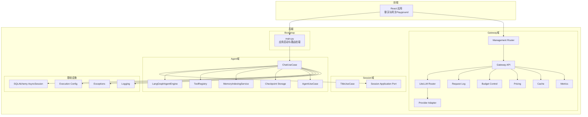
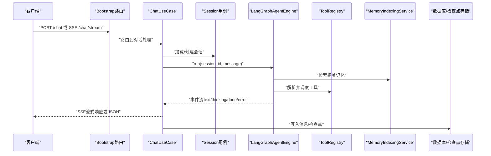
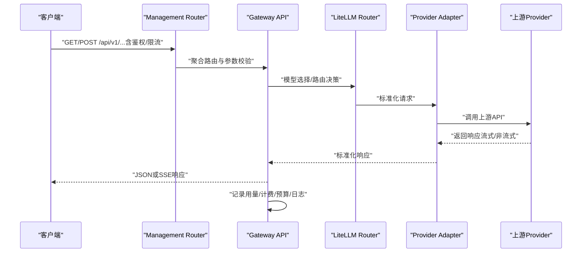
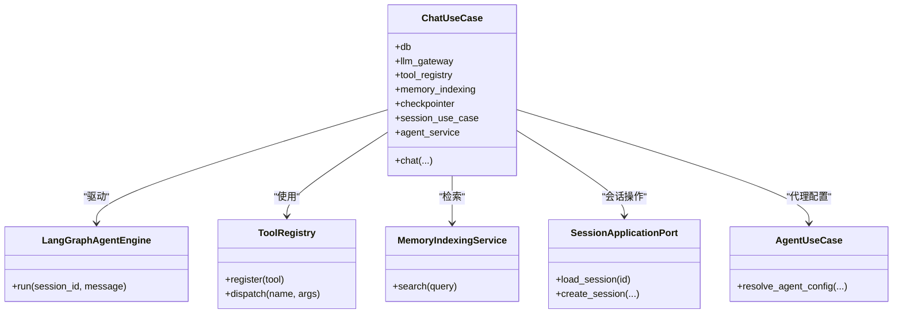
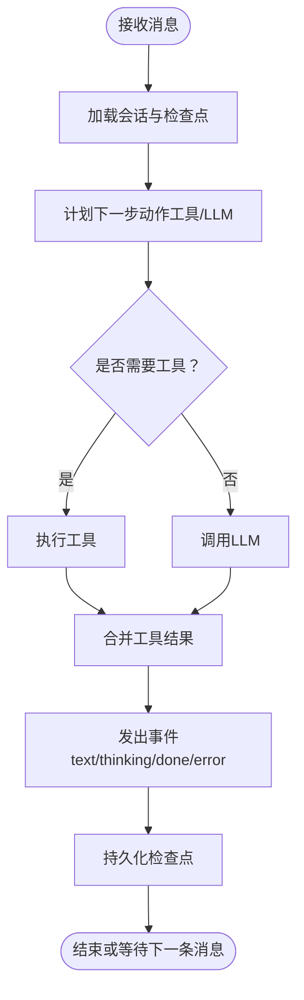
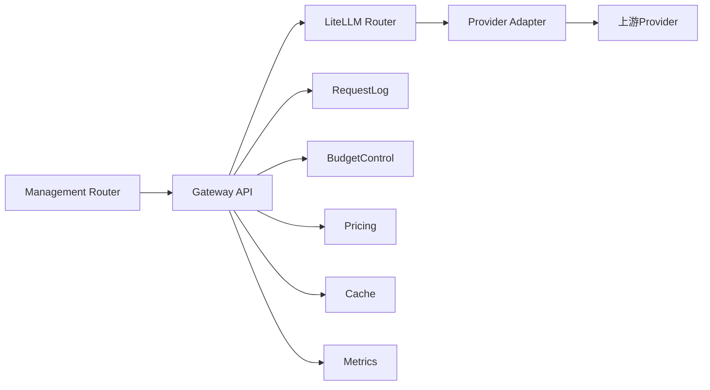
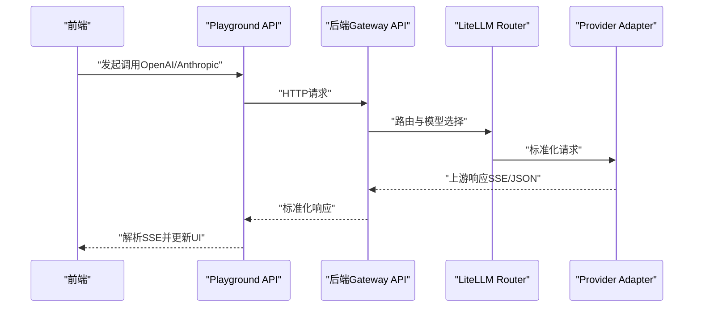
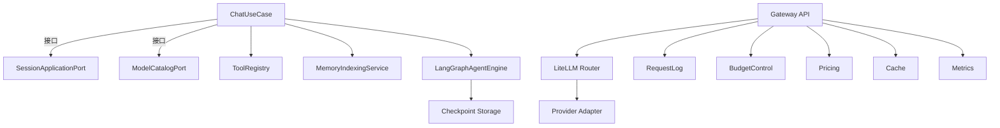

# 数据流与请求处理

<cite>
**本文引用的文件**
- [bootstrap/main.py](file://backend/bootstrap/main.py)
- [domains/agent/application/chat_use_case.py](file://backend/domains/agent/application/chat_use_case.py)
- [domains/session/application/title_use_case.py](file://backend/domains/session/application/title_use_case.py)
- [domains/agent/application/memory_indexing_service.py](file://backend/domains/agent/application/memory_indexing_service.py)
- [libs/db/database.py](file://backend/libs/db/database.py)
- [libs/config.py](file://backend/libs/config.py)
- [domains/gateway/application/internal_bridge_actor.py](file://backend/domains/gateway/application/internal_bridge_actor.py)
- [domains/tenancy/application/team_service.py](file://backend/domains/tenancy/application/team_service.py)
- [domains/agent/application/ports/model_catalog_port.py](file://backend/domains/agent/application/ports/model_catalog_port.py)
- [domains/session/application/ports.py](file://backend/domains/session/application/ports.py)
- [domains/agent/application/chat_engine.py](file://backend/domains/agent/application/chat_engine.py)
- [domains/agent/application/langgraph_agent_engine.py](file://backend/domains/agent/application/langgraph_agent_engine.py)
- [domains/agent/application/tool_registry.py](file://backend/domains/agent/application/tool_registry.py)
- [domains/agent/application/checkpoint_storage.py](file://backend/domains/agent/application/checkpoint_storage.py)
- [domains/agent/application/chat_model_resolution_use_case.py](file://backend/domains/agent/application/chat_model_resolution_use_case.py)
- [domains/agent/application/agent_use_case.py](file://backend/domains/agent/application/agent_use_case.py)
- [domains/gateway/presentation/routers/__init__.py](file://backend/domains/gateway/presentation/routers/__init__.py)
- [domains/gateway/presentation/management_router.py](file://backend/domains/gateway/presentation/management_router.py)
- [libs/gateway/litellm_router.py](file://backend/libs/gateway/litellm_router.py)
- [libs/gateway/provider_adapter.py](file://backend/libs/gateway/provider_adapter.py)
- [libs/gateway/gateway_api.py](file://backend/libs/gateway/gateway_api.py)
- [libs/gateway/request_log.py](file://backend/libs/gateway/request_log.py)
- [libs/gateway/budget_control.py](file://backend/libs/gateway/budget_control.py)
- [libs/gateway/pricing.py](file://backend/libs/gateway/pricing.py)
- [libs/gateway/credential_probe.py](file://backend/libs/gateway/credential_probe.py)
- [libs/gateway/cache.py](file://backend/libs/gateway/cache.py)
- [libs/gateway/metrics.py](file://backend/libs/gateway/metrics.py)
- [libs/exceptions.py](file://backend/libs/exceptions.py)
- [utils/logging.py](file://backend/utils/logging.py)
- [frontend/src/stores/chat.ts](file://frontend/src/stores/chat.ts)
- [frontend/src/features/gateway-playground/use-playground-call.ts](file://frontend/src/features/gateway-playground/use-playground-call.ts)
- [frontend/src/api/gateway/provider-profiles.ts](file://frontend/src/api/gateway/provider-profiles.ts)
- [docs/gateway/LLM_GATEWAY_ARCHITECTURE.md](file://backend/docs/gateway/LLM_GATEWAY_ARCHITECTURE.md)
- [docs/CHAT_MESSAGE_FLOW.md](file://backend/docs/CHAT_MESSAGE_FLOW.md)
- [docs/AI_GATEWAY_DOMAIN_ARCHITECTURE.md](file://backend/docs/AI_GATEWAY_DOMAIN_ARCHITECTURE.md)
- [tests/e2e/test_chat_e2e.py](file://backend/tests/e2e/test_chat_e2e.py)
- [tests/integration/test_chat_e2e.py](file://backend/tests/integration/test_chat_e2e.py)
- [tests/unit/application/test_chat_use_case.py](file://backend/tests/unit/application/test_chat_use_case.py)
- [tests/e2e/test_simplemem_e2e.py](file://backend/tests/e2e/test_simplemem_e2e.py)
</cite>

## 目录
1. [引言](#引言)
2. [项目结构](#项目结构)
3. [核心组件](#核心组件)
4. [架构总览](#架构总览)
5. [详细组件分析](#详细组件分析)
6. [依赖关系分析](#依赖关系分析)
7. [性能考虑](#性能考虑)
8. [故障排查指南](#故障排查指南)
9. [结论](#结论)
10. [附录](#附录)

## 引言
本文件面向AI Agent系统的数据流与请求处理，系统性梳理两类典型场景：
- 典型对话请求：Client → bootstrap挂载的chat路由 → ChatUseCase → Session/Agent仓储与引擎 → LLM/工具 → 流式或JSON响应
- Gateway外部调用：Client → /v1/*或管理API → Gateway应用层与LiteLLM Router → Provider

文档重点阐述：
- 请求在各层之间的数据传递与解耦协议
- 异步处理、并发控制与流式输出机制
- 缓存策略与数据一致性保障
- 错误处理与可观测性
- 性能优化与监控指标建议

## 项目结构
后端采用多域分层架构，前端通过REST/SSE与后端交互。Gateway域负责外部模型供应商接入与路由，Agent域负责对话编排与记忆检索，Session域负责会话生命周期管理。

图表来源
- [bootstrap/main.py](file://backend/bootstrap/main.py)
- [domains/agent/application/chat_use_case.py](file://backend/domains/agent/application/chat_use_case.py)
- [domains/agent/application/langgraph_agent_engine.py](file://backend/domains/agent/application/langgraph_agent_engine.py)
- [domains/agent/application/tool_registry.py](file://backend/domains/agent/application/tool_registry.py)
- [domains/agent/application/memory_indexing_service.py](file://backend/domains/agent/application/memory_indexing_service.py)
- [domains/agent/application/checkpoint_storage.py](file://backend/domains/agent/application/checkpoint_storage.py)
- [domains/agent/application/agent_use_case.py](file://backend/domains/agent/application/agent_use_case.py)
- [domains/session/application/title_use_case.py](file://backend/domains/session/application/title_use_case.py)
- [domains/session/application/ports.py](file://backend/domains/session/application/ports.py)
- [domains/gateway/presentation/management_router.py](file://backend/domains/gateway/presentation/management_router.py)
- [libs/gateway/litellm_router.py](file://backend/libs/gateway/litellm_router.py)
- [libs/gateway/provider_adapter.py](file://backend/libs/gateway/provider_adapter.py)
- [libs/gateway/gateway_api.py](file://backend/libs/gateway/gateway_api.py)
- [libs/gateway/request_log.py](file://backend/libs/gateway/request_log.py)
- [libs/gateway/budget_control.py](file://backend/libs/gateway/budget_control.py)
- [libs/gateway/pricing.py](file://backend/libs/gateway/pricing.py)
- [libs/gateway/cache.py](file://backend/libs/gateway/cache.py)
- [libs/gateway/metrics.py](file://backend/libs/gateway/metrics.py)
- [libs/db/database.py](file://backend/libs/db/database.py)
- [libs/config.py](file://backend/libs/config.py)
- [libs/exceptions.py](file://backend/libs/exceptions.py)
- [utils/logging.py](file://backend/utils/logging.py)

章节来源
- [bootstrap/main.py](file://backend/bootstrap/main.py)
- [domains/gateway/presentation/routers/__init__.py](file://backend/domains/gateway/presentation/routers/__init__.py)

## 核心组件
- ChatUseCase：对话主用例，协调会话、模型选择、工具执行、检查点与记忆索引，驱动LangGraph引擎运行。
- LangGraphAgentEngine：基于LangGraph的状态机引擎，承载Agent状态与工具调用序列。
- ToolRegistry：工具注册表，集中管理可用工具及其执行策略。
- MemoryIndexingService：记忆检索与索引服务，支持上下文增强。
- LiteLLM Router：外部调用路由，负责模型选择、负载均衡与错误回退。
- Provider Adapter：适配不同供应商的API差异，统一流式/非流式响应格式。
- Gateway API：对外HTTP接口，聚合路由、鉴权、限流、计费与日志。
- RequestLog/BudgetControl/Pricing/Cache/Metrics：可观测性与治理组件。

章节来源
- [domains/agent/application/chat_use_case.py](file://backend/domains/agent/application/chat_use_case.py)
- [domains/agent/application/langgraph_agent_engine.py](file://backend/domains/agent/application/langgraph_agent_engine.py)
- [domains/agent/application/tool_registry.py](file://backend/domains/agent/application/tool_registry.py)
- [domains/agent/application/memory_indexing_service.py](file://backend/domains/agent/application/memory_indexing_service.py)
- [libs/gateway/litellm_router.py](file://backend/libs/gateway/litellm_router.py)
- [libs/gateway/provider_adapter.py](file://backend/libs/gateway/provider_adapter.py)
- [libs/gateway/gateway_api.py](file://backend/libs/gateway/gateway_api.py)
- [libs/gateway/request_log.py](file://backend/libs/gateway/request_log.py)
- [libs/gateway/budget_control.py](file://backend/libs/gateway/budget_control.py)
- [libs/gateway/pricing.py](file://backend/libs/gateway/pricing.py)
- [libs/gateway/cache.py](file://backend/libs/gateway/cache.py)
- [libs/gateway/metrics.py](file://backend/libs/gateway/metrics.py)

## 架构总览
本节以两个典型场景展示端到端数据流。

### 场景一：Agent对话请求（流式/JSON）

图表来源
- [bootstrap/main.py](file://backend/bootstrap/main.py)
- [domains/agent/application/chat_use_case.py](file://backend/domains/agent/application/chat_use_case.py)
- [domains/agent/application/langgraph_agent_engine.py](file://backend/domains/agent/application/langgraph_agent_engine.py)
- [domains/agent/application/tool_registry.py](file://backend/domains/agent/application/tool_registry.py)
- [domains/agent/application/memory_indexing_service.py](file://backend/domains/agent/application/memory_indexing_service.py)
- [domains/session/application/ports.py](file://backend/domains/session/application/ports.py)

### 场景二：Gateway外部调用（/v1/*与管理API）

图表来源
- [domains/gateway/presentation/management_router.py](file://backend/domains/gateway/presentation/management_router.py)
- [libs/gateway/gateway_api.py](file://backend/libs/gateway/gateway_api.py)
- [libs/gateway/litellm_router.py](file://backend/libs/gateway/litellm_router.py)
- [libs/gateway/provider_adapter.py](file://backend/libs/gateway/provider_adapter.py)

## 详细组件分析

### 组件A：ChatUseCase（对话主用例）
职责与交互：
- 会话生命周期管理（创建/加载/标题生成）
- 模型解析与选择（结合模型目录与执行配置）
- 工具注册与调度
- 记忆检索与上下文增强
- LangGraph引擎运行与事件流处理
- 检查点持久化与恢复

图表来源
- [domains/agent/application/chat_use_case.py](file://backend/domains/agent/application/chat_use_case.py)
- [domains/agent/application/langgraph_agent_engine.py](file://backend/domains/agent/application/langgraph_agent_engine.py)
- [domains/agent/application/tool_registry.py](file://backend/domains/agent/application/tool_registry.py)
- [domains/agent/application/memory_indexing_service.py](file://backend/domains/agent/application/memory_indexing_service.py)
- [domains/session/application/ports.py](file://backend/domains/session/application/ports.py)
- [domains/agent/application/agent_use_case.py](file://backend/domains/agent/application/agent_use_case.py)

章节来源
- [domains/agent/application/chat_use_case.py](file://backend/domains/agent/application/chat_use_case.py)
- [domains/session/application/title_use_case.py](file://backend/domains/session/application/title_use_case.py)
- [libs/db/database.py](file://backend/libs/db/database.py)
- [libs/config.py](file://backend/libs/config.py)
- [domains/gateway/application/internal_bridge_actor.py](file://backend/domains/gateway/application/internal_bridge_actor.py)
- [domains/tenancy/application/team_service.py](file://backend/domains/tenancy/application/team_service.py)
- [domains/agent/application/ports/model_catalog_port.py](file://backend/domains/agent/application/ports/model_catalog_port.py)

### 组件B：LangGraphAgentEngine（状态机引擎）
- 承载Agent状态与工具调用序列
- 支持事件流（text/thinking/done/error）
- 与检查点存储协作实现断点续跑

图表来源
- [domains/agent/application/langgraph_agent_engine.py](file://backend/domains/agent/application/langgraph_agent_engine.py)
- [domains/agent/application/checkpoint_storage.py](file://backend/domains/agent/application/checkpoint_storage.py)

章节来源
- [domains/agent/application/langgraph_agent_engine.py](file://backend/domains/agent/application/langgraph_agent_engine.py)
- [domains/agent/application/checkpoint_storage.py](file://backend/domains/agent/application/checkpoint_storage.py)

### 组件C：Gateway API与LiteLLM Router
- Management Router：聚合/v1/*与管理API子路由
- Gateway API：鉴权、限流、参数校验、路由转发
- LiteLLM Router：模型选择、负载均衡、错误回退
- Provider Adapter：统一上游响应格式
- RequestLog/BudgetControl/Pricing/Cache/Metrics：治理与可观测性

图表来源
- [domains/gateway/presentation/management_router.py](file://backend/domains/gateway/presentation/management_router.py)
- [libs/gateway/gateway_api.py](file://backend/libs/gateway/gateway_api.py)
- [libs/gateway/litellm_router.py](file://backend/libs/gateway/litellm_router.py)
- [libs/gateway/provider_adapter.py](file://backend/libs/gateway/provider_adapter.py)
- [libs/gateway/request_log.py](file://backend/libs/gateway/request_log.py)
- [libs/gateway/budget_control.py](file://backend/libs/gateway/budget_control.py)
- [libs/gateway/pricing.py](file://backend/libs/gateway/pricing.py)
- [libs/gateway/cache.py](file://backend/libs/gateway/cache.py)
- [libs/gateway/metrics.py](file://backend/libs/gateway/metrics.py)

章节来源
- [domains/gateway/presentation/management_router.py](file://backend/domains/gateway/presentation/management_router.py)
- [libs/gateway/gateway_api.py](file://backend/libs/gateway/gateway_api.py)
- [libs/gateway/litellm_router.py](file://backend/libs/gateway/litellm_router.py)
- [libs/gateway/provider_adapter.py](file://backend/libs/gateway/provider_adapter.py)
- [libs/gateway/request_log.py](file://backend/libs/gateway/request_log.py)
- [libs/gateway/budget_control.py](file://backend/libs/gateway/budget_control.py)
- [libs/gateway/pricing.py](file://backend/libs/gateway/pricing.py)
- [libs/gateway/cache.py](file://backend/libs/gateway/cache.py)
- [libs/gateway/metrics.py](file://backend/libs/gateway/metrics.py)

### 组件D：前端交互与流式处理
- 前端聊天状态管理（会话、消息、输入、流式内容等）
- Playground调用封装（OpenAI兼容/Anthropic），解析SSE并提取token、耗时、费用等元信息
- Provider Profiles查询用于上游方案SSOT

图表来源
- [frontend/src/stores/chat.ts](file://frontend/src/stores/chat.ts)
- [frontend/src/features/gateway-playground/use-playground-call.ts](file://frontend/src/features/gateway-playground/use-playground-call.ts)
- [frontend/src/api/gateway/provider-profiles.ts](file://frontend/src/api/gateway/provider-profiles.ts)
- [libs/gateway/gateway_api.py](file://backend/libs/gateway/gateway_api.py)
- [libs/gateway/litellm_router.py](file://backend/libs/gateway/litellm_router.py)
- [libs/gateway/provider_adapter.py](file://backend/libs/gateway/provider_adapter.py)

章节来源
- [frontend/src/stores/chat.ts](file://frontend/src/stores/chat.ts)
- [frontend/src/features/gateway-playground/use-playground-call.ts](file://frontend/src/features/gateway-playground/use-playground-call.ts)
- [frontend/src/api/gateway/provider-profiles.ts](file://frontend/src/api/gateway/provider-profiles.ts)

## 依赖关系分析
- 松耦合协议：ChatUseCase通过接口（如SessionApplicationPort、ModelCatalogPort）与底层实现解耦
- 外部依赖：LiteLLM Router与Provider Adapter抽象上游差异
- 并发与异步：LangGraph引擎与工具执行均采用异步生成器模式，前端以SSE消费事件流
- 数据一致性：检查点存储确保Agent状态可恢复；Gateway侧通过请求日志与用量统计保障账单一致

图表来源
- [domains/agent/application/chat_use_case.py](file://backend/domains/agent/application/chat_use_case.py)
- [domains/session/application/ports.py](file://backend/domains/session/application/ports.py)
- [domains/agent/application/ports/model_catalog_port.py](file://backend/domains/agent/application/ports/model_catalog_port.py)
- [domains/agent/application/tool_registry.py](file://backend/domains/agent/application/tool_registry.py)
- [domains/agent/application/memory_indexing_service.py](file://backend/domains/agent/application/memory_indexing_service.py)
- [domains/agent/application/langgraph_agent_engine.py](file://backend/domains/agent/application/langgraph_agent_engine.py)
- [domains/agent/application/checkpoint_storage.py](file://backend/domains/agent/application/checkpoint_storage.py)
- [libs/gateway/gateway_api.py](file://backend/libs/gateway/gateway_api.py)
- [libs/gateway/litellm_router.py](file://backend/libs/gateway/litellm_router.py)
- [libs/gateway/provider_adapter.py](file://backend/libs/gateway/provider_adapter.py)
- [libs/gateway/request_log.py](file://backend/libs/gateway/request_log.py)
- [libs/gateway/budget_control.py](file://backend/libs/gateway/budget_control.py)
- [libs/gateway/pricing.py](file://backend/libs/gateway/pricing.py)
- [libs/gateway/cache.py](file://backend/libs/gateway/cache.py)
- [libs/gateway/metrics.py](file://backend/libs/gateway/metrics.py)

## 性能考虑
- 流式输出：优先使用SSE，降低首字节延迟（TTFT）与感知延迟
- 模型选择与缓存：LiteLLM Router结合缓存与预热，减少重复解析成本
- 并发控制：限制每会话并发流数量，避免资源争用；工具执行并发受控于队列与令牌桶
- 检查点策略：定期持久化检查点，缩短恢复时间；冷热分离存储
- 观测性指标：请求延迟、吞吐、错误率、Token用量、费用、上游RTT与成功率
- 前端体验：UI增量渲染、防抖输入、断线重连与事件去重

## 故障排查指南
常见问题与定位要点：
- 对话无响应或卡住
  - 检查LangGraph引擎事件流是否正常发出
  - 查看工具执行日志与超时设置
  - 核对检查点存储是否可读写
- 流式中断或SSE解析失败
  - 前端解析缓冲区与错误事件处理
  - 后端上游响应格式与编码
- Gateway调用失败
  - Provider凭据有效性与探活
  - 费用预算与配额限制
  - 请求日志与错误码映射
- 性能异常
  - 模型选择与路由热点
  - 缓存命中率与过期策略
  - 数据库慢查询与索引

章节来源
- [tests/e2e/test_chat_e2e.py](file://backend/tests/e2e/test_chat_e2e.py)
- [tests/integration/test_chat_e2e.py](file://backend/tests/integration/test_chat_e2e.py)
- [tests/unit/application/test_chat_use_case.py](file://backend/tests/unit/application/test_chat_use_case.py)
- [tests/e2e/test_simplemem_e2e.py](file://backend/tests/e2e/test_simplemem_e2e.py)
- [libs/gateway/credential_probe.py](file://backend/libs/gateway/credential_probe.py)
- [libs/gateway/request_log.py](file://backend/libs/gateway/request_log.py)
- [libs/gateway/budget_control.py](file://backend/libs/gateway/budget_control.py)
- [libs/gateway/cache.py](file://backend/libs/gateway/cache.py)

## 结论
该系统通过清晰的分层与接口解耦，实现了Agent对话与Gateway外部调用两条高内聚、低耦合的数据通路。LangGraph引擎与工具体系支撑复杂推理与工具调用，LiteLLM Router与Provider Adapter统一了外部生态差异。配合完善的可观测性与治理能力，系统在性能、稳定性与可扩展性方面具备良好基础。

## 附录
- 参考文档
  - [CHAT_MESSAGE_FLOW.md](file://backend/docs/CHAT_MESSAGE_FLOW.md)
  - [LLM_GATEWAY_ARCHITECTURE.md](file://backend/docs/gateway/LLM_GATEWAY_ARCHITECTURE.md)
  - [AI_GATEWAY_DOMAIN_ARCHITECTURE.md](file://backend/docs/AI_GATEWAY_DOMAIN_ARCHITECTURE.md)