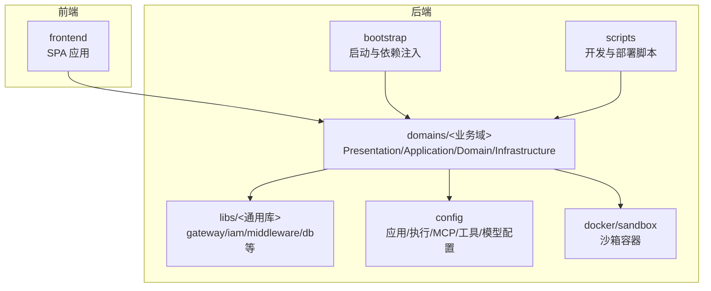
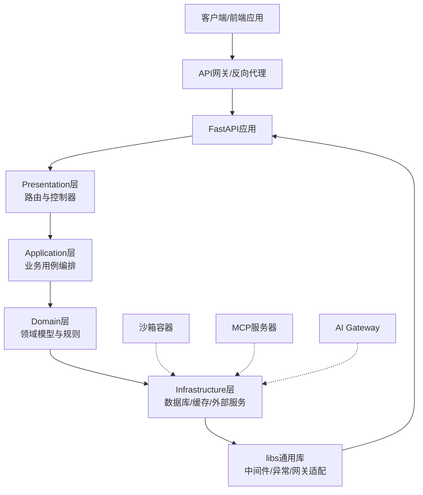
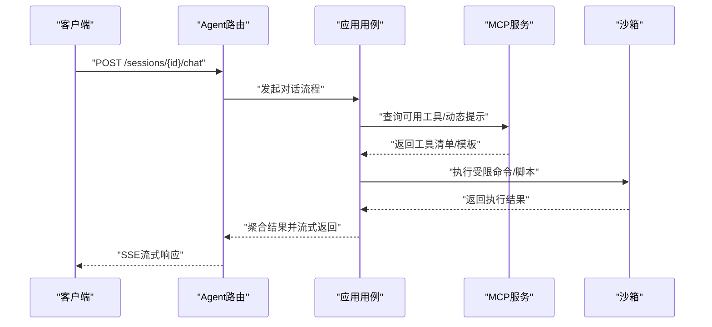
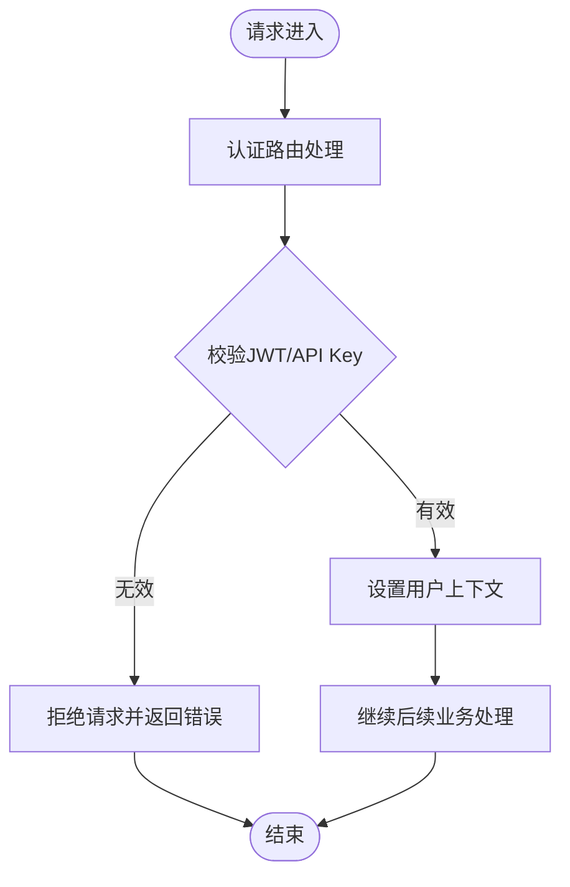
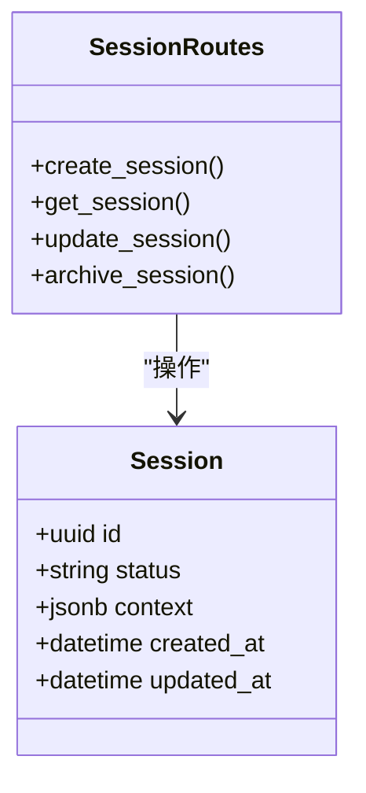
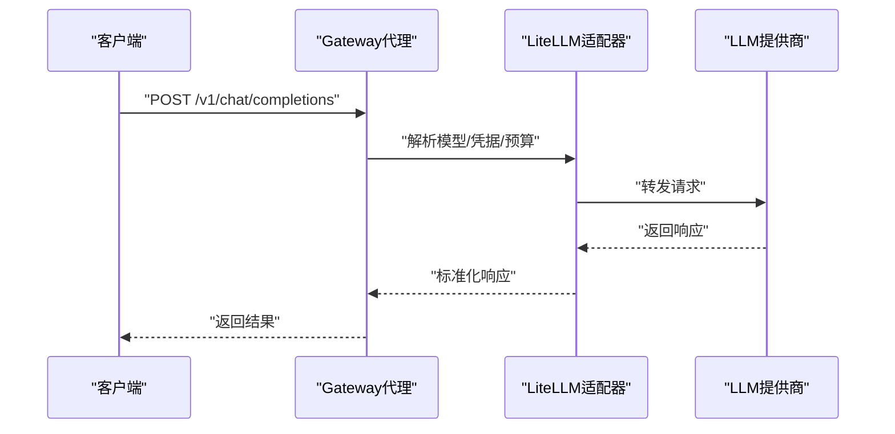
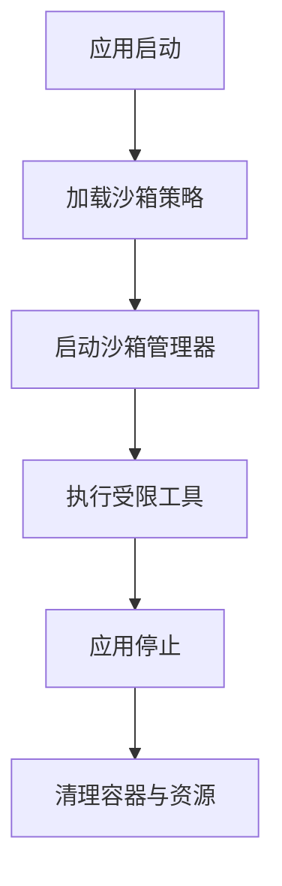
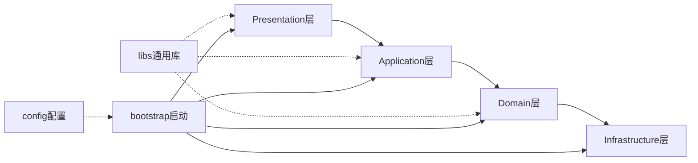

# 整体架构概览

<cite>
**本文档引用的文件**
- [AI Agent 后端架构](file://backend/docs/ARCHITECTURE.md)
- [AI_GATEWAY_DOMAIN_ARCHITECTURE.md](file://backend/docs/AI_GATEWAY_DOMAIN_ARCHITECTURE.md)
- [AGENT_ARCHITECTURE_DESIGN.md](file://backend/docs/AGENT_ARCHITECTURE_DESIGN.md)
- [LANGGRAPH_ARCHITECTURE_RATIONALE.md](file://backend/docs/LANGGRAPH_ARCHITECTURE_RATIONALE.md)
- [CONTEXT_MANAGEMENT_IMPLEMENTATION.md](file://backend/docs/CONTEXT_MANAGEMENT_IMPLEMENTATION.md)
- [bootstrap/main.py](file://backend/bootstrap/main.py)
- [domains/agent/application/startup.py](file://backend/domains/agent/application/startup.py)
- [domains/gateway/domain/use_cases/__init__.py](file://backend/domains/gateway/domain/use_cases/__init__.py)
- [domains/identity/domain/models/user.py](file://backend/domains/identity/domain/models/user.py)
- [domains/session/domain/models/session.py](file://backend/domains/session/domain/models/session.py)
- [domains/agent/infrastructure/mcp_server/servers/llm_server.py](file://backend/domains/agent/infrastructure/mcp_server/servers/llm_server.py)
- [domains/agent/infrastructure/repositories/mcp_dynamic_tool_repository.py](file://backend/domains/agent/infrastructure/repositories/mcp_dynamic_tool_repository.py)
- [domains/agent/application/mcp_use_case.py](file://backend/domains/agent/application/mcp_use_case.py)
- [domains/agent/application/mcp_server_mapper.py](file://backend/domains/agent/application/mcp_server_mapper.py)
- [domains/agent/domain/config/mcp_config.py](file://backend/domains/agent/domain/config/mcp_config.py)
- [domains/agent/domain/policies/mcp_access.py](file://backend/domains/agent/domain/policies/mcp_access.py)
- [domains/gateway/infrastructure/proxy/gateway_proxy.py](file://backend/domains/gateway/infrastructure/proxy/gateway_proxy.py)
- [domains/gateway/application/use_cases/gateway_use_case.py](file://backend/domains/gateway/application/use_cases/gateway_use_case.py)
- [domains/gateway/presentation/api/gateway_routes.py](file://backend/domains/gateway/presentation/api/gateway_routes.py)
- [domains/agent/presentation/api/agent_routes.py](file://backend/domains/agent/presentation/api/agent_routes.py)
- [domains/identity/presentation/api/auth_routes.py](file://backend/domains/identity/presentation/api/auth_routes.py)
- [domains/session/presentation/api/session_routes.py](file://backend/domains/session/presentation/api/session_routes.py)
- [libs/gateway/litellm_adapter.py](file://backend/libs/gateway/litellm_adapter.py)
- [libs/middleware/__init__.py](file://backend/libs/middleware/__init__.py)
- [config/app.toml](file://backend/config/app.toml)
- [config/execution.toml](file://backend/config/execution.toml)
- [config/mcp.toml](file://backend/config/mcp.toml)
- [config/tools.toml](file://backend/config/tools.toml)
- [config/litellm_models.yaml](file://backend/config/litellm_models.yaml)
- [docker/sandbox/Dockerfile](file://backend/docker/sandbox/Dockerfile)
- [docker/sandbox/README.md](file://backend/docker/sandbox/README.md)
- [scripts/run_dev_server.py](file://backend/scripts/run_dev_server.py)
- [scripts/run_server.py](file://backend/scripts/run_server.py)
- [Makefile](file://backend/Makefile)
</cite>

## 目录
1. [引言](#引言)
2. [项目结构](#项目结构)
3. [核心组件](#核心组件)
4. [架构总览](#架构总览)
5. [详细组件分析](#详细组件分析)
6. [依赖分析](#依赖分析)
7. [性能考虑](#性能考虑)
8. [故障排除指南](#故障排除指南)
9. [结论](#结论)
10. [附录](#附录)

## 引言
本文件面向AI Agent系统整体架构概览，重点阐述系统基于FastAPI构建的智能体后端服务的高层设计理念、核心能力与技术定位。系统围绕四大域（Agent、Gateway、Identity、Session）进行分层设计，采用Presentation/Application/Domain/Infrastructure四层架构，强调领域驱动与依赖注入，确保高内聚、低耦合与可扩展性。

系统核心能力包括：
- Agent执行：对话、工具、记忆、检查点、流式输出（SSE）
- 工具与MCP：内置工具、MCP服务与动态工具
- 沙箱：隔离执行环境（Docker等）
- 会话与身份：用户、JWT、API Key、会话归属
- AI Gateway：多模型路由（LiteLLM）、团队/虚拟Key、凭据与预算、根路径/v1/*双协议对外代理（OpenAI兼容+Anthropic）

## 项目结构
系统采用“域驱动 + 分层架构”的组织方式，核心目录如下：
- backend：后端主体代码，包含domains、bootstrap、libs、config、scripts等
- domains：按业务域划分，每个域包含presentation、application、domain、infrastructure四层
- bootstrap：应用启动、依赖注入、配置加载
- libs：跨域通用库（网关适配、中间件、异常、存储等）
- config：运行时配置（应用、执行、MCP、工具、模型清单）
- docker/sandbox：沙箱容器化构建
- docs：架构与设计文档
- frontend：前端单页应用（与后端通过API交互）

**图表来源**
- [bootstrap/main.py](file://backend/bootstrap/main.py)
- [domains/agent/presentation/api/agent_routes.py](file://backend/domains/agent/presentation/api/agent_routes.py)
- [libs/gateway/litellm_adapter.py](file://backend/libs/gateway/litellm_adapter.py)
- [config/app.toml](file://backend/config/app.toml)
- [docker/sandbox/Dockerfile](file://backend/docker/sandbox/Dockerfile)

**章节来源**
- [AI Agent 后端架构](file://backend/docs/ARCHITECTURE.md)
- [Makefile](file://backend/Makefile)

## 核心组件
系统围绕四大域展开，每个域均遵循四层架构职责划分：

- Presentation层：对外暴露API路由与视图，负责请求解析、响应封装与错误处理
- Application层：编排业务用例，协调领域模型与基础设施，实现业务流程
- Domain层：承载核心业务规则与实体模型，定义不变的领域逻辑
- Infrastructure层：提供持久化、网络、外部服务集成等基础设施能力

此外，系统通过bootstrap完成依赖注入与启动初始化，libs提供跨域通用能力，config集中管理运行参数。

**章节来源**
- [AI Agent 后端架构](file://backend/docs/ARCHITECTURE.md)
- [bootstrap/main.py](file://backend/bootstrap/main.py)

## 架构总览
系统采用分层架构与域驱动设计，结合FastAPI构建高性能后端服务。下图展示了系统上下文与主要组件之间的关系：

**图表来源**
- [domains/agent/presentation/api/agent_routes.py](file://backend/domains/agent/presentation/api/agent_routes.py)
- [domains/gateway/presentation/api/gateway_routes.py](file://backend/domains/gateway/presentation/api/gateway_routes.py)
- [domains/identity/presentation/api/auth_routes.py](file://backend/domains/identity/presentation/api/auth_routes.py)
- [domains/session/presentation/api/session_routes.py](file://backend/domains/session/presentation/api/session_routes.py)
- [libs/middleware/__init__.py](file://backend/libs/middleware/__init__.py)
- [docker/sandbox/Dockerfile](file://backend/docker/sandbox/Dockerfile)

## 详细组件分析

### Agent域：智能体执行与工具链
Agent域负责智能体的完整生命周期管理，包括对话、工具调用、记忆与检查点、以及与MCP的集成。

- 启动与沙箱：应用启动时初始化沙箱管理器，确保工具执行的安全隔离
- MCP集成：支持默认MCP服务器初始化与动态工具/提示注册
- 工具与动态能力：通过动态工具仓库与MCP映射器实现工具的动态发现与调用

**图表来源**
- [domains/agent/application/startup.py](file://backend/domains/agent/application/startup.py)
- [domains/agent/application/mcp_use_case.py](file://backend/domains/agent/application/mcp_use_case.py)
- [domains/agent/infrastructure/repositories/mcp_dynamic_tool_repository.py](file://backend/domains/agent/infrastructure/repositories/mcp_dynamic_tool_repository.py)
- [domains/agent/infrastructure/mcp_server/servers/llm_server.py](file://backend/domains/agent/infrastructure/mcp_server/servers/llm_server.py)

**章节来源**
- [domains/agent/application/startup.py](file://backend/domains/agent/application/startup.py)
- [domains/agent/application/mcp_use_case.py](file://backend/domains/agent/application/mcp_use_case.py)
- [domains/agent/application/mcp_server_mapper.py](file://backend/domains/agent/application/mcp_server_mapper.py)
- [domains/agent/domain/config/mcp_config.py](file://backend/domains/agent/domain/config/mcp_config.py)
- [domains/agent/domain/policies/mcp_access.py](file://backend/domains/agent/domain/policies/mcp_access.py)

### Identity域：认证与授权
Identity域提供统一的身份认证与授权能力，支撑JWT、API Key与会话归属管理。

- 用户模型：定义用户实体与属性
- 认证路由：提供登录、登出、令牌刷新等接口
- 权限策略：与Agent域的MCP访问策略协同

**图表来源**
- [domains/identity/presentation/api/auth_routes.py](file://backend/domains/identity/presentation/api/auth_routes.py)
- [domains/identity/domain/models/user.py](file://backend/domains/identity/domain/models/user.py)

**章节来源**
- [domains/identity/presentation/api/auth_routes.py](file://backend/domains/identity/presentation/api/auth_routes.py)
- [domains/identity/domain/models/user.py](file://backend/domains/identity/domain/models/user.py)

### Session域：会话管理
Session域负责会话的创建、维护与状态管理，支撑多轮对话与上下文延续。

- 会话模型：定义会话实体与状态字段
- 会话路由：提供会话查询、更新、归档等接口
- 上下文管理：与Agent域协作，维护消息历史与检查点

**图表来源**
- [domains/session/presentation/api/session_routes.py](file://backend/domains/session/presentation/api/session_routes.py)
- [domains/session/domain/models/session.py](file://backend/domains/session/domain/models/session.py)

**章节来源**
- [domains/session/presentation/api/session_routes.py](file://backend/domains/session/presentation/api/session_routes.py)
- [domains/session/domain/models/session.py](file://backend/domains/session/domain/models/session.py)

### AI Gateway域：多模型路由与预算控制
AI Gateway域提供统一的LLM接入层，支持多供应商、多模型的路由与计费控制，并通过LiteLLM适配不同提供商的API。

- 路由与代理：对/v1/*路径提供OpenAI兼容与Anthropic协议代理
- 凭据与预算：支持团队级凭据、虚拟Key与使用预算
- 模型定价：基于litellm_models.yaml进行成本与限额管理

**图表来源**
- [domains/gateway/presentation/api/gateway_routes.py](file://backend/domains/gateway/presentation/api/gateway_routes.py)
- [domains/gateway/application/use_cases/gateway_use_case.py](file://backend/domains/gateway/application/use_cases/gateway_use_case.py)
- [domains/gateway/infrastructure/proxy/gateway_proxy.py](file://backend/domains/gateway/infrastructure/proxy/gateway_proxy.py)
- [libs/gateway/litellm_adapter.py](file://backend/libs/gateway/litellm_adapter.py)

**章节来源**
- [AI_GATEWAY_DOMAIN_ARCHITECTURE.md](file://backend/docs/AI_GATEWAY_DOMAIN_ARCHITECTURE.md)
- [domains/gateway/presentation/api/gateway_routes.py](file://backend/domains/gateway/presentation/api/gateway_routes.py)
- [domains/gateway/application/use_cases/gateway_use_case.py](file://backend/domains/gateway/application/use_cases/gateway_use_case.py)
- [libs/gateway/litellm_adapter.py](file://backend/libs/gateway/litellm_adapter.py)
- [config/litellm_models.yaml](file://backend/config/litellm_models.yaml)

### 沙箱：隔离执行环境
沙箱通过Docker容器提供受控的执行环境，限制工具执行的资源与权限，保障系统安全。

- 容器构建：Dockerfile定义沙箱镜像
- 策略配置：从执行配置中加载沙箱策略
- 生命周期：应用启动时初始化，关闭时清理

**图表来源**
- [domains/agent/application/startup.py](file://backend/domains/agent/application/startup.py)
- [docker/sandbox/Dockerfile](file://backend/docker/sandbox/Dockerfile)
- [docker/sandbox/README.md](file://backend/docker/sandbox/README.md)

**章节来源**
- [domains/agent/application/startup.py](file://backend/domains/agent/application/startup.py)
- [docker/sandbox/Dockerfile](file://backend/docker/sandbox/Dockerfile)
- [docker/sandbox/README.md](file://backend/docker/sandbox/README.md)

## 依赖分析
系统采用清晰的依赖方向与导入约定，确保层间解耦与可测试性。

- 层内依赖方向：Presentation → Application → Domain → Infrastructure
- 跨域依赖：Domain层避免直接依赖Infrastructure，通过Application层进行编排
- 通用库：libs作为横切关注点，被各域复用
- 配置驱动：config目录集中管理运行参数，bootstrap负责装配

**图表来源**
- [bootstrap/main.py](file://backend/bootstrap/main.py)
- [libs/middleware/__init__.py](file://backend/libs/middleware/__init__.py)
- [config/app.toml](file://backend/config/app.toml)

**章节来源**
- [bootstrap/main.py](file://backend/bootstrap/main.py)
- [config/app.toml](file://backend/config/app.toml)

## 性能考虑
- 流式输出：Agent域支持SSE流式响应，提升用户体验
- 缓存与索引：数据库迁移脚本包含性能索引优化
- 路由与代理：Gateway域通过LiteLLM与代理减少重复适配成本
- 沙箱隔离：容器化执行降低资源争用风险

[本节为通用指导，无需特定文件引用]

## 故障排除指南
- 启动失败：检查bootstrap配置与依赖注入是否正确
- MCP初始化失败：确认MCP配置与默认服务器初始化日志
- 沙箱问题：验证Docker可用性与沙箱策略配置
- Gateway路由异常：核对/v1/*代理与LiteLLM模型配置

**章节来源**
- [domains/agent/application/startup.py](file://backend/domains/agent/application/startup.py)
- [domains/agent/application/mcp_use_case.py](file://backend/domains/agent/application/mcp_use_case.py)
- [config/mcp.toml](file://backend/config/mcp.toml)
- [config/litellm_models.yaml](file://backend/config/litellm_models.yaml)

## 结论
本系统以FastAPI为核心，采用域驱动与分层架构，实现了Agent执行、工具与MCP、沙箱、会话与身份、AI Gateway等核心能力。通过清晰的依赖方向与配置驱动，系统具备良好的可扩展性与可维护性，能够支撑复杂AI Agent场景下的多模型路由、安全执行与统一治理。

[本节为总结，无需特定文件引用]

## 附录
- 技术栈概览：Python、FastAPI、LiteLLM、Alembic、Docker、PostgreSQL
- 核心模块位置：domains/*、bootstrap、libs、config、scripts、docker/sandbox
- 开发与部署：Makefile、run_dev_server.py、run_server.py

**章节来源**
- [Makefile](file://backend/Makefile)
- [scripts/run_dev_server.py](file://backend/scripts/run_dev_server.py)
- [scripts/run_server.py](file://backend/scripts/run_server.py)