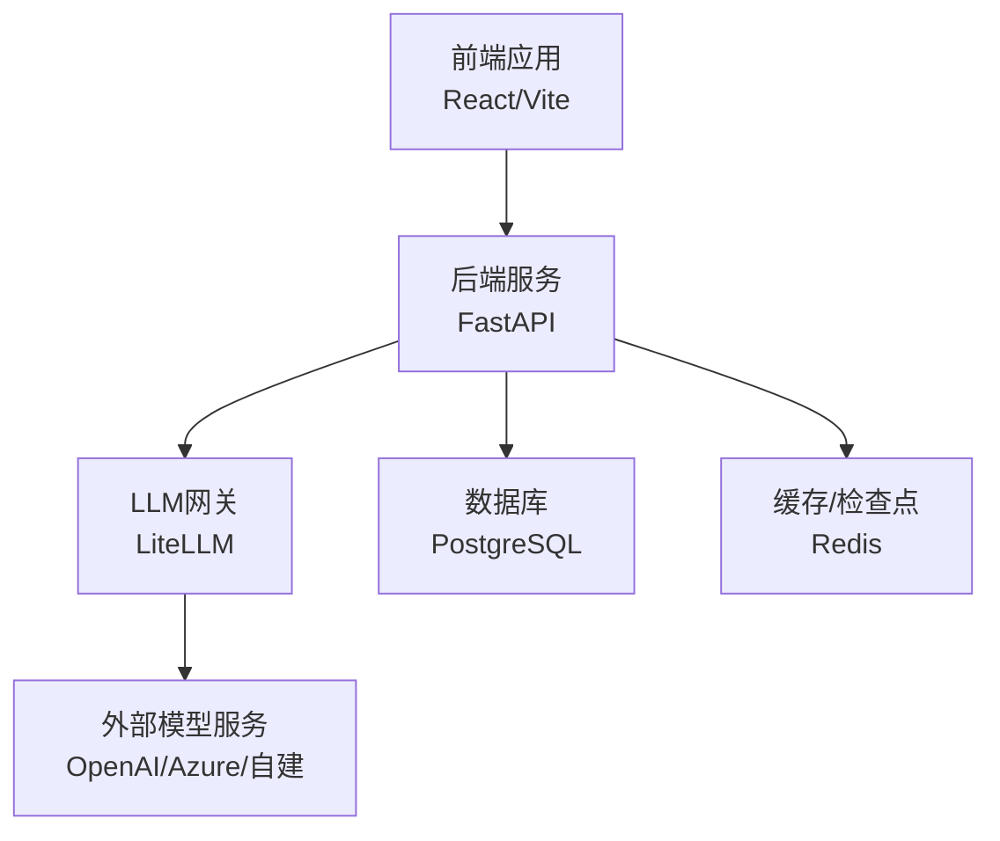
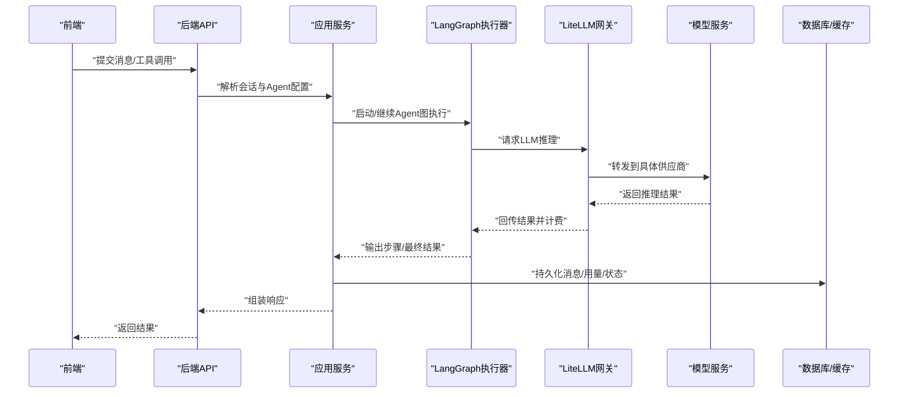
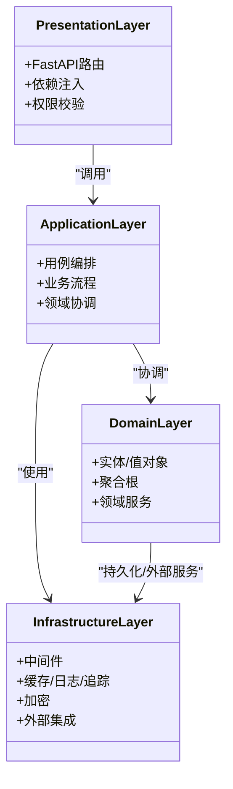
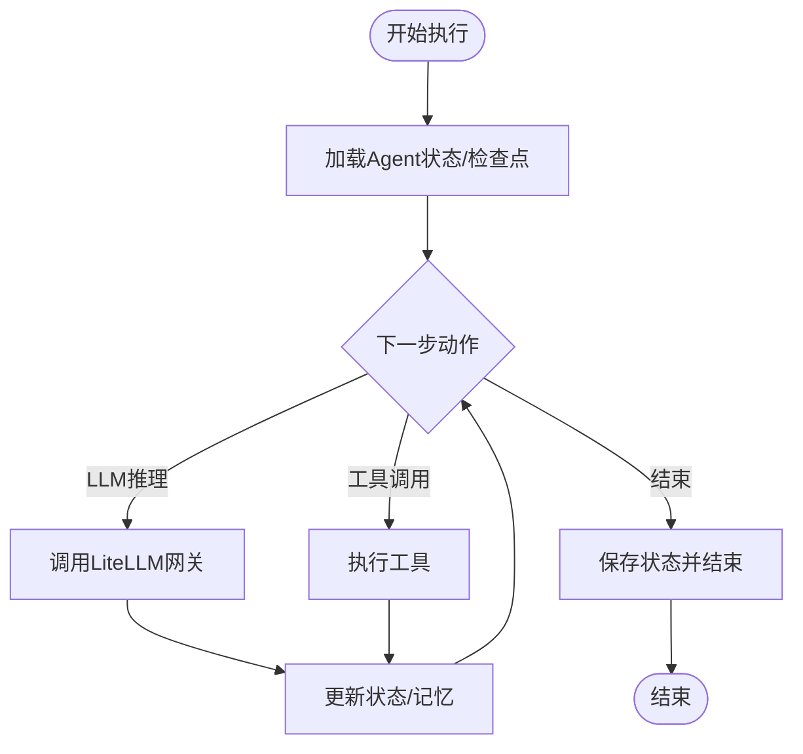
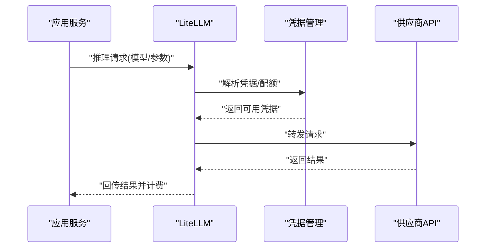
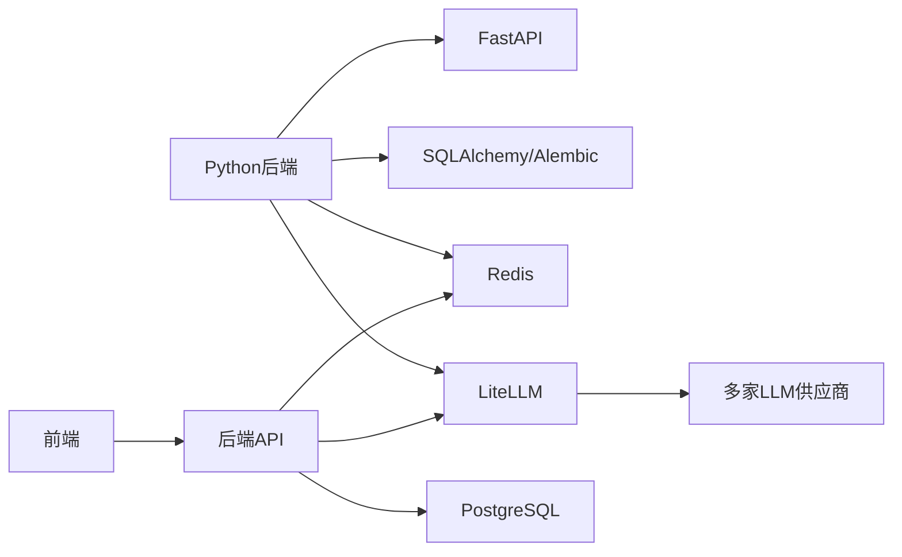
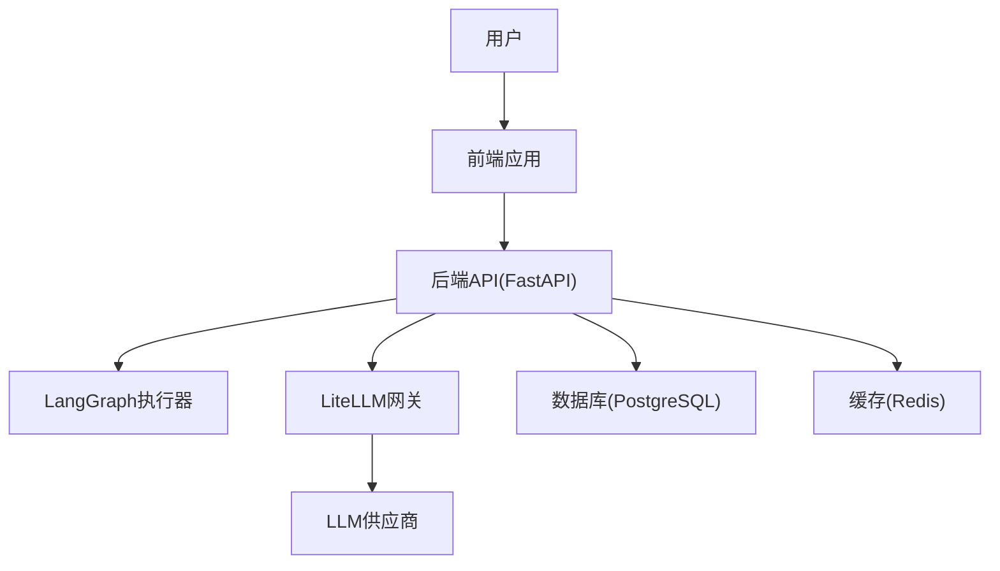

# 系统架构设计

<cite>
**本文档引用的文件**
- [backend/docs/ARCHITECTURE.md](file://backend/docs/ARCHITECTURE.md)
- [backend/docs/AGENT_ARCHITECTURE_DESIGN.md](file://backend/docs/AGENT_ARCHITECTURE_DESIGN.md)
- [backend/docs/LANGGRAPH_ARCHITECTURE_RATIONALE.md](file://backend/docs/LANGGRAPH_ARCHITECTURE_RATIONALE.md)
- [backend/docs/AI_GATEWAY_DOMAIN_ARCHITECTURE.md](file://backend/docs/AI_GATEWAY_DOMAIN_ARCHITECTURE.md)
- [backend/docs/CONTEXT_MANAGEMENT_IMPLEMENTATION.md](file://backend/docs/CONTEXT_MANAGEMENT_IMPLEMENTATION.md)
- [backend/bootstrap/main.py](file://backend/bootstrap/main.py)
- [backend/bootstrap/composition/identity_services.py](file://backend/bootstrap/composition/identity_services.py)
- [backend/config/app.toml](file://backend/config/app.toml)
- [backend/config/litellm_models.yaml](file://backend/config/litellm_models.yaml)
- [backend/config/mcp.toml](file://backend/config/mcp.toml)
- [backend/config/tools.toml](file://backend/config/tools.toml)
- [backend/domains/agent/application/services.py](file://backend/domains/agent/application/services.py)
- [backend/domains/gateway/application/services.py](file://backend/domains/gateway/application/services.py)
- [backend/domains/identity/application/services.py](file://backend/domains/identity/application/services.py)
- [backend/libs/api/deps.py](file://backend/libs/api/deps.py)
- [backend/libs/llm/client.py](file://backend/libs/llm/client.py)
- [backend/libs/gateway/proxy.py](file://backend/libs/gateway/proxy.py)
- [backend/libs/middleware/logging.py](file://backend/libs/middleware/logging.py)
- [backend/libs/observability/tracing.py](file://backend/libs/observability/tracing.py)
- [backend/utils/cache.py](file://backend/utils/cache.py)
- [backend/utils/crypto.py](file://backend/utils/crypto.py)
- [backend/scripts/run_dev_server.py](file://backend/scripts/run_dev_server.py)
- [backend/Dockerfile](file://backend/Dockerfile)
- [backend/pyproject.toml](file://backend/pyproject.toml)
- [deploy/k8s/README.md](file://deploy/k8s/README.md)
- [deploy/nginx/README.md](file://deploy/nginx/README.md)
- [deploy/higress/README.md](file://deploy/higress/README.md)
- [frontend/package.json](file://frontend/package.json)
- [frontend/vite.config.ts](file://frontend/vite.config.ts)
- [Makefile](file://Makefile)
</cite>

## 目录
1. [引言](#引言)
2. [项目结构](#项目结构)
3. [核心组件](#核心组件)
4. [架构总览](#架构总览)
5. [详细组件分析](#详细组件分析)
6. [依赖分析](#依赖分析)
7. [性能考虑](#性能考虑)
8. [故障排查指南](#故障排查指南)
9. [结论](#结论)
10. [附录](#附录)

## 引言
本架构设计文档面向AI Agent系统，目标是提供从高层到实现层面的完整设计视图。系统采用分层架构（表现层、应用层、领域层、基础设施层），结合领域驱动设计（DDD）理念，明确四层职责与交互关系。系统以FastAPI为核心Web框架，LangGraph作为Agent状态机与流程编排引擎，LiteLLM作为统一LLM网关与成本控制工具，形成“前端-后端-网关-模型服务”的完整链路。

## 项目结构
系统采用前后端分离与多域分层的组织方式：
- 后端（Python/ FastAPI）：包含多个业务域（Agent、Gateway、Identity、Session等），每个域按DDD四层组织；bootstrap负责启动与依赖注入组合；config提供运行时配置；libs提供通用能力（API、数据库、中间件、可观测性等）。
- 前端（TypeScript/Vite）：基于React生态，通过API客户端与后端交互。
- 部署（Kubernetes/Nginx/Higress）：支持容器化与云原生部署，具备灰度、WASM插件、SSO桥接等高级特性。

图表来源
- [backend/docs/ARCHITECTURE.md](file://backend/docs/ARCHITECTURE.md)
- [backend/docs/AI_GATEWAY_DOMAIN_ARCHITECTURE.md](file://backend/docs/AI_GATEWAY_DOMAIN_ARCHITECTURE.md)

章节来源
- [backend/docs/ARCHITECTURE.md](file://backend/docs/ARCHITECTURE.md)
- [backend/docs/AGENT_ARCHITECTURE_DESIGN.md](file://backend/docs/AGENT_ARCHITECTURE_DESIGN.md)
- [backend/docs/AI_GATEWAY_DOMAIN_ARCHITECTURE.md](file://backend/docs/AI_GATEWAY_DOMAIN_ARCHITECTURE.md)

## 核心组件
- 表现层（Presentation）
  - 负责HTTP接口定义与请求/响应处理，使用FastAPI进行路由与校验。
  - 提供API依赖注入与权限控制入口。
- 应用层（Application）
  - 编排业务用例，协调领域对象与基础设施，保证用例边界清晰。
  - 示例：Agent执行、会话管理、网关代理调用等。
- 领域层（Domain）
  - 定义核心业务实体、值对象、聚合根与领域服务，确保业务不变量与规则。
  - 示例：Agent、Session、GatewayCredential等。
- 基础设施层（Infrastructure）
  - 提供持久化、缓存、外部服务集成、中间件与可观测性等支撑能力。
  - 示例：数据库ORM、Redis检查点、日志与追踪、加密工具等。

章节来源
- [backend/docs/ARCHITECTURE.md](file://backend/docs/ARCHITECTURE.md)
- [backend/docs/AGENT_ARCHITECTURE_DESIGN.md](file://backend/docs/AGENT_ARCHITECTURE_DESIGN.md)

## 架构总览
系统采用“前端-后端-网关-模型服务”链路，核心交互如下：
- 前端发起聊天或工具调用请求至后端API。
- 后端应用层根据会话与Agent配置选择合适的LangGraph执行路径。
- 执行过程中通过LiteLLM网关统一调度不同供应商模型，并记录用量与成本。
- 执行结果经后端返回前端，同时写入数据库与缓存。

图表来源
- [backend/docs/LANGGRAPH_ARCHITECTURE_RATIONALE.md](file://backend/docs/LANGGRAPH_ARCHITECTURE_RATIONALE.md)
- [backend/docs/AI_GATEWAY_DOMAIN_ARCHITECTURE.md](file://backend/docs/AI_GATEWAY_DOMAIN_ARCHITECTURE.md)

章节来源
- [backend/docs/LANGGRAPH_ARCHITECTURE_RATIONALE.md](file://backend/docs/LANGGRAPH_ARCHITECTURE_RATIONALE.md)
- [backend/docs/AI_GATEWAY_DOMAIN_ARCHITECTURE.md](file://backend/docs/AI_GATEWAY_DOMAIN_ARCHITECTURE.md)

## 详细组件分析

### 分层架构与DDD职责
- 表现层（Presentation）
  - API路由与依赖注入：通过FastAPI路由与依赖注入机制，将认证、权限、租户上下文注入到请求生命周期。
  - 参考：[backend/libs/api/deps.py](file://backend/libs/api/deps.py)
- 应用层（Application）
  - 用例编排：应用服务协调领域对象与基础设施，完成业务流程编排。
  - 参考：[backend/domains/agent/application/services.py](file://backend/domains/agent/application/services.py)，[backend/domains/gateway/application/services.py](file://backend/domains/gateway/application/services.py)，[backend/domains/identity/application/services.py](file://backend/domains/identity/application/services.py)
- 领域层（Domain）
  - 实体与规则：定义Agent、Session、GatewayCredential等核心领域对象及不变量。
  - 参考：各域下的domain目录结构与实体定义
- 基础设施层（Infrastructure）
  - 中间件与可观测性：日志、追踪、缓存、加密等通用能力封装。
  - 参考：[backend/libs/middleware/logging.py](file://backend/libs/middleware/logging.py)，[backend/libs/observability/tracing.py](file://backend/libs/observability/tracing.py)，[backend/utils/cache.py](file://backend/utils/cache.py)，[backend/utils/crypto.py](file://backend/utils/crypto.py)

图表来源
- [backend/docs/ARCHITECTURE.md](file://backend/docs/ARCHITECTURE.md)

章节来源
- [backend/docs/ARCHITECTURE.md](file://backend/docs/ARCHITECTURE.md)

### LangGraph执行器与Agent编排
- 设计理念：以LangGraph作为Agent的状态机与流程编排引擎，支持多步骤推理、工具调用与记忆管理。
- 关键点：检查点（Checkpoint）、状态更新、错误重试与回滚策略。
- 参考：[backend/docs/LANGGRAPH_ARCHITECTURE_RATIONALE.md](file://backend/docs/LANGGRAPH_ARCHITECTURE_RATIONALE.md)

图表来源
- [backend/docs/LANGGRAPH_ARCHITECTURE_RATIONALE.md](file://backend/docs/LANGGRAPH_ARCHITECTURE_RATIONALE.md)

章节来源
- [backend/docs/LANGGRAPH_ARCHITECTURE_RATIONALE.md](file://backend/docs/LANGGRAPH_ARCHITECTURE_RATIONALE.md)

### LiteLLM网关与成本控制
- 统一模型接入：通过配置文件定义模型映射、供应商凭据与路由策略。
- 成本与用量：记录请求/响应token、费用与供应商维度统计。
- 参考：[backend/config/litellm_models.yaml](file://backend/config/litellm_models.yaml)，[backend/docs/AI_GATEWAY_DOMAIN_ARCHITECTURE.md](file://backend/docs/AI_GATEWAY_DOMAIN_ARCHITECTURE.md)

图表来源
- [backend/config/litellm_models.yaml](file://backend/config/litellm_models.yaml)
- [backend/libs/gateway/proxy.py](file://backend/libs/gateway/proxy.py)

章节来源
- [backend/config/litellm_models.yaml](file://backend/config/litellm_models.yaml)
- [backend/libs/gateway/proxy.py](file://backend/libs/gateway/proxy.py)

### 配置与环境管理
- 运行时配置：app.toml集中管理应用行为；环境特定配置（local-dev、docker-dev、k8s-prod等）通过环境变量覆盖。
- 工具与MCP：tools.toml与mcp.toml分别管理工具注册与MCP服务器配置。
- 参考：[backend/config/app.toml](file://backend/config/app.toml)，[backend/config/tools.toml](file://backend/config/tools.toml)，[backend/config/mcp.toml](file://backend/config/mcp.toml)

章节来源
- [backend/config/app.toml](file://backend/config/app.toml)
- [backend/config/tools.toml](file://backend/config/tools.toml)
- [backend/config/mcp.toml](file://backend/config/mcp.toml)

### 启动与依赖注入组合
- 启动入口：bootstrap/main.py负责初始化应用、加载配置与注册依赖。
- 依赖组合：composition/identity_services.py演示了身份相关服务的组合方式。
- 参考：[backend/bootstrap/main.py](file://backend/bootstrap/main.py)，[backend/bootstrap/composition/identity_services.py](file://backend/bootstrap/composition/identity_services.py)

章节来源
- [backend/bootstrap/main.py](file://backend/bootstrap/main.py)
- [backend/bootstrap/composition/identity_services.py](file://backend/bootstrap/composition/identity_services.py)

## 依赖分析
- 技术栈与版本
  - Python后端：FastAPI、SQLAlchemy、Alembic、Pydantic等。
  - 前端：React、Vite、TypeScript。
  - 运行时：PostgreSQL、Redis、Nginx/Kubernetes。
  - 参考：[backend/pyproject.toml](file://backend/pyproject.toml)，[frontend/package.json](file://frontend/package.json)
- 外部依赖与集成
  - LLM供应商：OpenAI、Azure OpenAI、DashScope等通过LiteLLM统一接入。
  - 中间件：日志、追踪、缓存、加密等由libs与utils提供。
- 依赖可视化

图表来源
- [backend/pyproject.toml](file://backend/pyproject.toml)
- [frontend/package.json](file://frontend/package.json)

章节来源
- [backend/pyproject.toml](file://backend/pyproject.toml)
- [frontend/package.json](file://frontend/package.json)

## 性能考虑
- 并发与异步：后端采用异步IO与连接池，减少阻塞；LangGraph执行器支持并发步骤。
- 缓存策略：Redis用于检查点与热点数据缓存，降低重复推理开销。
- 数据库优化：索引与查询优化，避免慢查询；分页与批量操作。
- 网关限流与熔断：LiteLLM提供配额与速率限制，防止供应商过载。
- 前端性能：静态资源缓存、懒加载与CDN加速。

## 故障排查指南
- 日志与追踪
  - 使用中间件记录请求/响应与异常堆栈；追踪ID贯穿全链路定位问题。
  - 参考：[backend/libs/middleware/logging.py](file://backend/libs/middleware/logging.py)，[backend/libs/observability/tracing.py](file://backend/libs/observability/tracing.py)
- 加密与安全
  - 凭据加密存储与传输；敏感字段脱敏输出。
  - 参考：[backend/utils/crypto.py](file://backend/utils/crypto.py)
- 缓存一致性
  - 检查点与内存状态同步；失效与回放策略。
  - 参考：[backend/utils/cache.py](file://backend/utils/cache.py)
- 开发调试
  - 本地开发脚本与热重载；端到端测试与集成测试覆盖。
  - 参考：[backend/scripts/run_dev_server.py](file://backend/scripts/run_dev_server.py)

章节来源
- [backend/libs/middleware/logging.py](file://backend/libs/middleware/logging.py)
- [backend/libs/observability/tracing.py](file://backend/libs/observability/tracing.py)
- [backend/utils/crypto.py](file://backend/utils/crypto.py)
- [backend/utils/cache.py](file://backend/utils/cache.py)
- [backend/scripts/run_dev_server.py](file://backend/scripts/run_dev_server.py)

## 结论
本系统通过分层架构与DDD方法论，实现了高内聚、低耦合的模块化设计；以FastAPI、LangGraph、LiteLLM为核心的技术栈，既满足了Agent复杂流程编排的需求，又提供了统一的LLM网关与成本控制能力。配合完善的可观测性、安全与缓存策略，系统具备良好的可扩展性与可维护性。

## 附录

### 系统上下文图

图表来源
- [backend/docs/ARCHITECTURE.md](file://backend/docs/ARCHITECTURE.md)
- [backend/docs/LANGGRAPH_ARCHITECTURE_RATIONALE.md](file://backend/docs/LANGGRAPH_ARCHITECTURE_RATIONALE.md)
- [backend/docs/AI_GATEWAY_DOMAIN_ARCHITECTURE.md](file://backend/docs/AI_GATEWAY_DOMAIN_ARCHITECTURE.md)

### 部署拓扑与基础设施
- Kubernetes部署：支持滚动升级、灰度发布与自动扩缩容。
- Nginx反向代理：静态资源与健康检查。
- Higress网关：WASM插件、SSO桥接与流量治理。
- 参考：[deploy/k8s/README.md](file://deploy/k8s/README.md)，[deploy/nginx/README.md](file://deploy/nginx/README.md)，[deploy/higress/README.md](file://deploy/higress/README.md)

章节来源
- [deploy/k8s/README.md](file://deploy/k8s/README.md)
- [deploy/nginx/README.md](file://deploy/nginx/README.md)
- [deploy/higress/README.md](file://deploy/higress/README.md)

### 开发与构建
- 后端：Dockerfile与多阶段构建；Makefile提供常用任务。
- 前端：Vite配置与包管理；Dockerfile用于容器化。
- 参考：[backend/Dockerfile](file://backend/Dockerfile)，[frontend/vite.config.ts](file://frontend/vite.config.ts)，[Makefile](file://Makefile)

章节来源
- [backend/Dockerfile](file://backend/Dockerfile)
- [frontend/vite.config.ts](file://frontend/vite.config.ts)
- [Makefile](file://Makefile)