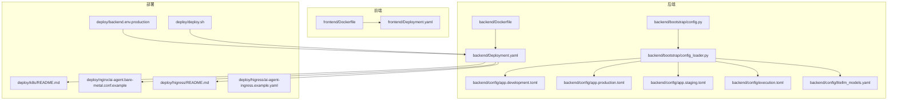
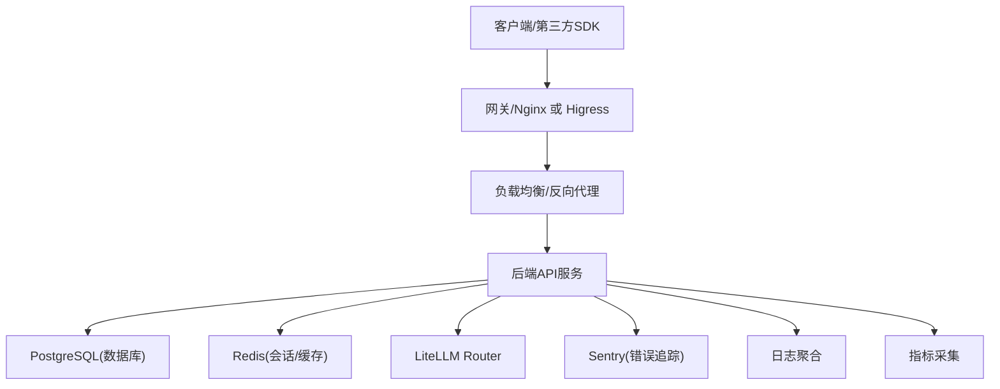
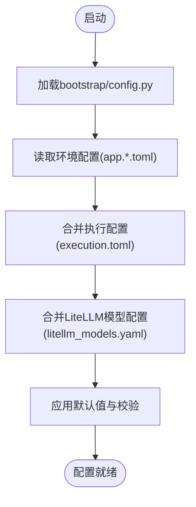
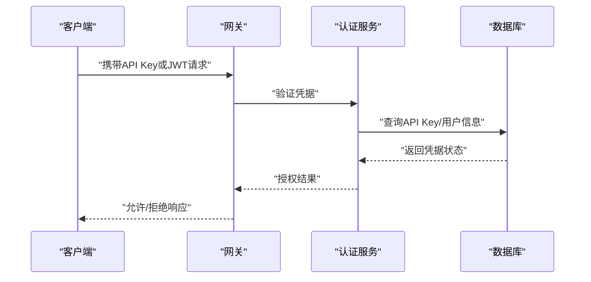
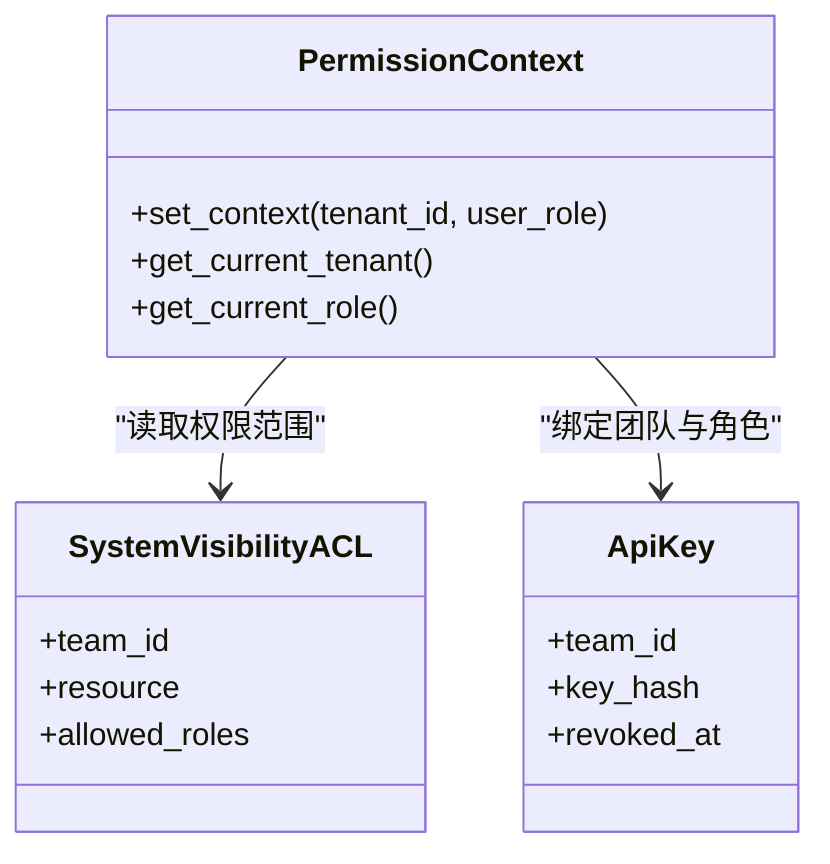
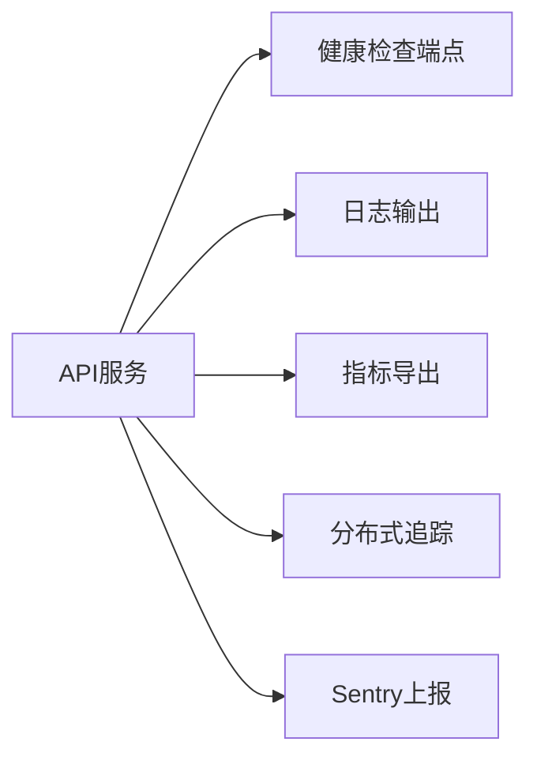
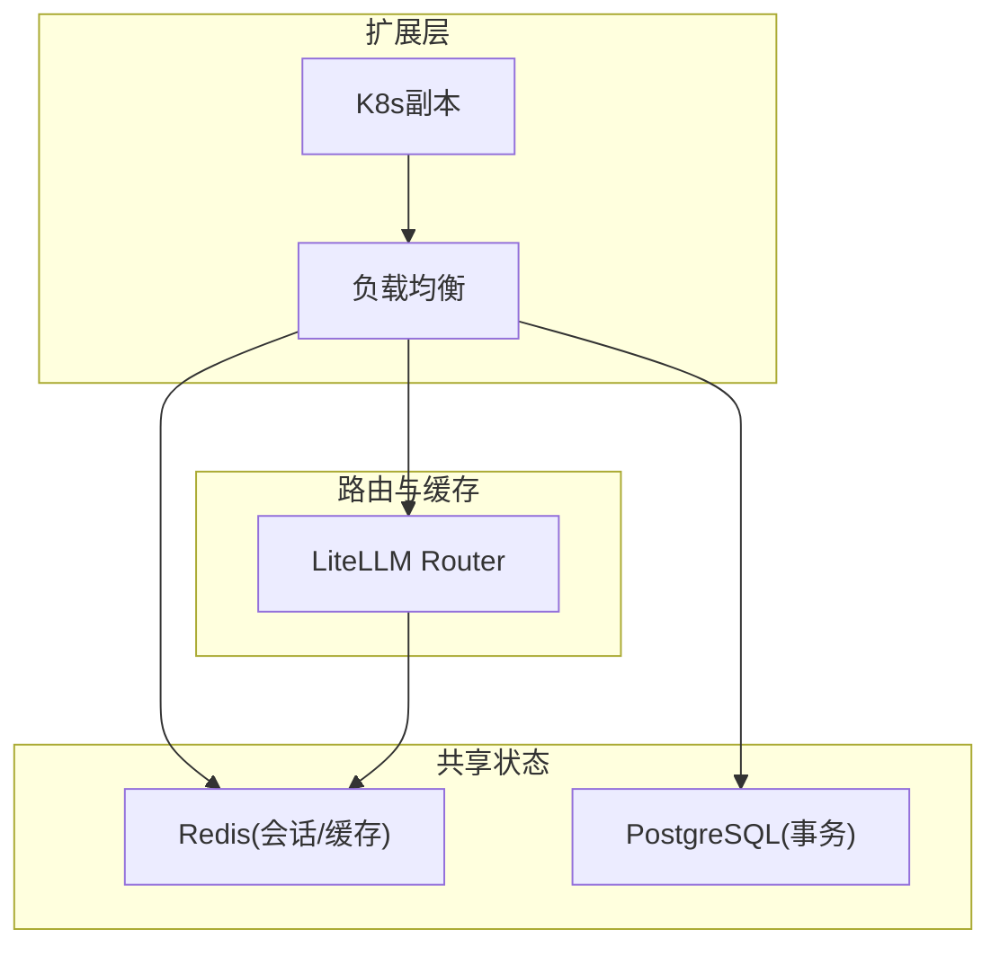
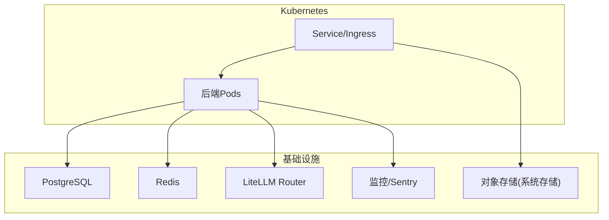
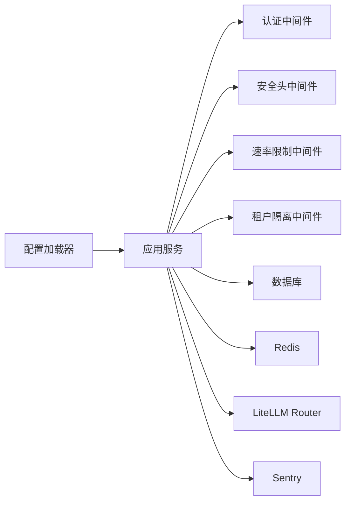

# 部署与安全架构

<cite>
**本文引用的文件**
- [backend/bootstrap/config.py](file://backend/bootstrap/config.py)
- [backend/bootstrap/config_loader.py](file://backend/bootstrap/config_loader.py)
- [backend/config/app.toml](file://backend/config/app.toml)
- [backend/config/app.production.toml](file://backend/config/app.production.toml)
- [backend/config/app.staging.toml](file://backend/config/app.staging.toml)
- [backend/config/app.development.toml](file://backend/config/app.development.toml)
- [backend/config/execution.toml](file://backend/config/execution.toml)
- [backend/config/litellm_models.yaml](file://backend/config/litellm_models.yaml)
- [backend/libs/db/permission_context.py](file://backend/libs/db/permission_context.py)
- [backend/docs/AUTHENTICATION.md](file://backend/docs/AUTHENTICATION.md)
- [backend/docs/CONFIGURATION.md](file://backend/docs/CONFIGURATION.md)
- [backend/docs/DEPLOYMENT.md](file://backend/docs/DEPLOYMENT.md)
- [backend/docs/ARCHITECTURE.md](file://backend/docs/ARCHITECTURE.md)
- [backend/docs/项目权限规则.md](file://backend/docs/项目权限规则.md)
- [backend/docs/gateway/LLM_GATEWAY_ARCHITECTURE.md](file://backend/docs/gateway/LLM_GATEWAY_ARCHITECTURE.md)
- [backend/docs/gateway/GATEWAY_DEPLOYMENT_CHECKLIST.md](file://backend/docs/gateway/GATEWAY_DEPLOYMENT_CHECKLIST.md)
- [backend/docs/gateway/GATEWAY_PRICING_AND_LITELLM_COST.md](file://backend/docs/gateway/GATEWAY_PRICING_AND_LITELLM_COST.md)
- [backend/docs/gateway/GATEWAY_THIRDPARTY_CLIENT_GUIDE.md](file://backend/docs/gateway/GATEWAY_THIRDPARTY_CLIENT_GUIDE.md)
- [backend/scripts/run_server.py](file://backend/scripts/run_server.py)
- [backend/scripts/run_dev_server.py](file://backend/scripts/run_dev_server.py)
- [backend/docker/sandbox/Dockerfile](file://backend/docker/sandbox/Dockerfile)
- [deploy/backend.env.production](file://deploy/backend.env.production)
- [deploy/deploy.sh](file://deploy/deploy.sh)
- [deploy/nginx/ai-agent.bare-metal.conf.example](file://deploy/nginx/ai-agent.bare-metal.conf.example)
- [deploy/k8s/README.md](file://deploy/k8s/README.md)
- [deploy/higress/README.md](file://deploy/higress/README.md)
- [deploy/higress/ai-agent-ingress.example.yaml](file://deploy/higress/ai-agent-ingress.example.yaml)
- [backend/Deployment.yaml](file://backend/Deployment.yaml)
- [frontend/Deployment.yaml](file://frontend/Deployment.yaml)
- [backend/Dockerfile](file://backend/Dockerfile)
- [frontend/Dockerfile](file://frontend/Dockerfile)
- [backend/pyproject.toml](file://backend/pyproject.toml)
- [backend/alembic.ini](file://backend/alembic.ini)
- [backend/alembic/env.py](file://backend/alembic/env.py)
- [backend/alembic/script.py.mako](file://backend/alembic/script.py.mako)
- [backend/alembic/versions/20260508_add_gateway_tables.py](file://backend/alembic/versions/20260508_add_gateway_tables.py)
- [backend/alembic/versions/20260515_api_key_gateway_grants.py](file://backend/alembic/versions/20260515_api_key_gateway_grants.py)
- [backend/alembic/versions/20260518_gateway_model_pricing.py](file://backend/alembic/versions/20260518_gateway_model_pricing.py)
- [backend/alembic/versions/20260520_system_storage_config.py](file://backend/alembic/versions/20260520_system_storage_config.py)
- [backend/alembic/versions/20260521_tenant_data_scope.py](file://backend/alembic/versions/20260521_tenant_data_scope.py)
- [backend/alembic/versions/20260523_sessions_agents_tenant_id.py](file://backend/alembic/versions/20260523_sessions_agents_tenant_id.py)
- [backend/alembic/versions/20260527_193526_merge_gateway_preflight_and_log_heads.py](file://backend/alembic/versions/20260527_193526_merge_gateway_preflight_and_log_heads.py)
- [backend/alembic/versions/20260528_system_gateway_models_credential_fk.py](file://backend/alembic/versions/20260528_system_gateway_models_credential_fk.py)
- [backend/alembic/versions/20260603_system_visibility_acl.py](file://backend/alembic/versions/20260603_system_visibility_acl.py)
- [backend/alembic/versions/20260605_migrate_system_cred_models.py](file://backend/alembic/versions/20260605_migrate_system_cred_models.py)
- [backend/alembic/versions/20260607_gateway_preflight_indexes.py](file://backend/alembic/versions/20260607_gateway_preflight_indexes.py)
- [backend/alembic/versions/20260612_gateway_budget_tenant.py](file://backend/alembic/versions/20260612_gateway_budget_tenant.py)
- [backend/utils/logging.py](file://backend/utils/logging.py)
- [backend/libs/observability/sentry.py](file://backend/libs/observability/sentry.py)
- [backend/libs/middleware/security_headers.py](file://backend/libs/middleware/security_headers.py)
- [backend/libs/middleware/rate_limit.py](file://backend/libs/middleware/rate_limit.py)
- [backend/libs/middleware/tenant_isolation.py](file://backend/libs/middleware/tenant_isolation.py)
- [backend/domains/gateway/infrastructure/config/gateway_config.py](file://backend/domains/gateway/infrastructure/config/gateway_config.py)
- [backend/domains/gateway/application/services/gateway_auth_service.py](file://backend/domains/gateway/application/services/gateway_auth_service.py)
- [backend/domains/identity/application/services/user_service.py](file://backend/domains/identity/application/services/user_service.py)
- [backend/domains/identity/infrastructure/persistence/user_repository.py](file://backend/domains/identity/infrastructure/persistence/user_repository.py)
- [backend/domains/agent/application/services/agent_execution_service.py](file://backend/domains/agent/application/services/agent_execution_service.py)
- [backend/domains/session/application/services/session_service.py](file://backend/domains/session/application/services/session_service.py)
- [backend/domains/tenancy/application/services/tenant_service.py](file://backend/domains/tenancy/application/services/tenant_service.py)
- [backend/domains/gateway/domain/models/gateway_model.py](file://backend/domains/gateway/domain/models/gateway_model.py)
- [backend/domains/gateway/domain/models/api_key_model.py](file://backend/domains/gateway/domain/models/api_key_model.py)
- [backend/domains/gateway/domain/models/provider_credential_model.py](file://backend/domains/gateway/domain/models/provider_credential_model.py)
- [backend/domains/gateway/domain/models/gateway_request_log_model.py](file://backend/domains/gateway/domain/models/gateway_request_log_model.py)
- [backend/domains/gateway/domain/models/gateway_budget_model.py](file://backend/domains/gateway/domain/models/gateway_budget_model.py)
- [backend/domains/gateway/domain/models/system_storage_config_model.py](file://backend/domains/gateway/domain/models/system_storage_config_model.py)
- [backend/domains/gateway/domain/models/system_visibility_acl_model.py](file://backend/domains/gateway/domain/models/system_visibility_acl_model.py)
- [backend/domains/gateway/domain/models/credential_profile_model.py](file://backend/domains/gateway/domain/models/credential_profile_model.py)
- [backend/domains/gateway/domain/models/mcp_server_model.py](file://backend/domains/gateway/domain/models/mcp_server_model.py)
- [backend/domains/gateway/domain/models/video_gen_task_model.py](file://backend/domains/gateway/domain/models/video_gen_task_model.py)
- [backend/domains/gateway/domain/models/user_models_table_model.py](file://backend/domains/gateway/domain/models/user_models_table_model.py)
- [backend/domains/gateway/domain/models/gateway_preflight_model.py](file://backend/domains/gateway/domain/models/gateway_preflight_model.py)
- [backend/domains/gateway/domain/models/gateway_log_deployment_dim_model.py](file://backend/domains/gateway/domain/models/gateway_log_deployment_dim_model.py)
- [backend/domains/gateway/domain/models/gateway_log_credential_dim_model.py](file://backend/domains/gateway/domain/models/gateway_log_credential_dim_model.py)
- [backend/domains/gateway/domain/models/gateway_model_pricing_model.py](file://backend/domains/gateway/domain/models/gateway_model_pricing_model.py)
- [backend/domains/gateway/domain/models/provider_entitlement_plan_model.py](file://backend/domains/gateway/domain/models/provider_entitlement_plan_model.py)
- [backend/domains/gateway/domain/models/gateway_request_log_client_model.py](file://backend/domains/gateway/domain/models/gateway_request_log_client_model.py)
- [backend/domains/gateway/domain/models/system_gateway_models_credential_fk_model.py](file://backend/domains/gateway/domain/models/system_gateway_models_credential_fk_model.py)
- [backend/domains/gateway/domain/models/gateway_budget_credential_model.py](file://backend/domains/gateway/domain/models/gateway_budget_credential_model.py)
- [backend/domains/gateway/domain/models/gateway_budget_target_model.py](file://backend/domains/gateway/domain/models/gateway_budget_target_model.py)
- [backend/domains/gateway/domain/models/gateway_preflight_indexes_model.py](file://backend/domains/gateway/domain/models/gateway_preflight_indexes_model.py)
- [backend/domains/gateway/domain/models/downstream_pricing_scope_tenant_model.py](file://backend/domains/gateway/domain/models/downstream_pricing_scope_tenant_model.py)
- [backend/domains/gateway/domain/models/owned_resources_tenant_id_model.py](file://backend/domains/gateway/domain/models/owned_resources_tenant_id_model.py)
- [backend/domains/gateway/domain/models/system_visibility_acl_model.py](file://backend/domains/gateway/domain/models/system_visibility_acl_model.py)
- [backend/domains/gateway/domain/models/api_keys_revoked_at_model.py](file://backend/domains/gateway/domain/models/api_keys_revoked_at_model.py)
- [backend/domains/gateway/domain/models/migrate_system_cred_models_model.py](file://backend/domains/gateway/domain/models/migrate_system_cred_models_model.py)
- [backend/domains/gateway/domain/models/migrate_anonymous_shadow_to_deterministic_tenant_model.py](file://backend/domains/gateway/domain/models/migrate_anonymous_shadow_to_deterministic_tenant_model.py)
- [backend/domains/gateway/domain/models/gateway_request_log_tenant_route_time_model.py](file://backend/domains/gateway/domain/models/gateway_request_log_tenant_route_time_model.py)
- [backend/domains/gateway/domain/models/provider_credentials_created_by_model.py](file://backend/domains/gateway/domain/models/provider_credentials_created_by_model.py)
- [backend/domains/gateway/domain/models/delete_unattributed_probe_request_logs_model.py](file://backend/domains/gateway/domain/models/delete_unattributed_probe_request_logs_model.py)
- [backend/domains/gateway/domain/models/add_cache_creation_tokens_model.py](file://backend/domains/gateway/domain/models/add_cache_creation_tokens_model.py)
</cite>

## 目录
1. [引言](#引言)
2. [项目结构](#项目结构)
3. [核心组件](#核心组件)
4. [架构总览](#架构总览)
5. [详细组件分析](#详细组件分析)
6. [依赖关系分析](#依赖关系分析)
7. [性能考量](#性能考量)
8. [故障排查指南](#故障排查指南)
9. [结论](#结论)
10. [附录](#附录)

## 引言
本文件面向AI Agent系统的部署与安全架构，聚焦于生产级部署拓扑、配置管理策略、认证与授权机制、可观测性（日志、指标、追踪、Sentry）、水平扩展与一致性保障，以及合规与安全最佳实践。文档以仓库中的实际代码与文档为依据，避免臆造信息，并通过图示直观展示组件交互与数据流。

## 项目结构
后端采用分层与领域驱动设计（DDD），前端为独立容器化应用，部署侧提供Kubernetes与Nginx/Higress网关方案。配置体系由bootstrap/config.py与多套环境配置文件构成；数据库迁移脚本位于alembic中，覆盖网关、配额、预算、租户隔离等关键表结构演进。

**图表来源**
- [backend/Dockerfile](file://backend/Dockerfile)
- [frontend/Dockerfile](file://frontend/Dockerfile)
- [backend/Deployment.yaml](file://backend/Deployment.yaml)
- [frontend/Deployment.yaml](file://frontend/Deployment.yaml)
- [backend/bootstrap/config.py](file://backend/bootstrap/config.py)
- [backend/bootstrap/config_loader.py](file://backend/bootstrap/config_loader.py)
- [backend/config/app.development.toml](file://backend/config/app.development.toml)
- [backend/config/app.production.toml](file://backend/config/app.production.toml)
- [backend/config/app.staging.toml](file://backend/config/app.staging.toml)
- [backend/config/execution.toml](file://backend/config/execution.toml)
- [backend/config/litellm_models.yaml](file://backend/config/litellm_models.yaml)
- [deploy/k8s/README.md](file://deploy/k8s/README.md)
- [deploy/nginx/ai-agent.bare-metal.conf.example](file://deploy/nginx/ai-agent.bare-metal.conf.example)
- [deploy/higress/README.md](file://deploy/higress/README.md)
- [deploy/higress/ai-agent-ingress.example.yaml](file://deploy/higress/ai-agent-ingress.example.yaml)
- [deploy/backend.env.production](file://deploy/backend.env.production)
- [deploy/deploy.sh](file://deploy/deploy.sh)

**章节来源**
- [backend/Dockerfile](file://backend/Dockerfile)
- [frontend/Dockerfile](file://frontend/Dockerfile)
- [backend/Deployment.yaml](file://backend/Deployment.yaml)
- [frontend/Deployment.yaml](file://frontend/Deployment.yaml)
- [backend/bootstrap/config.py](file://backend/bootstrap/config.py)
- [backend/bootstrap/config_loader.py](file://backend/bootstrap/config_loader.py)
- [backend/config/app.development.toml](file://backend/config/app.development.toml)
- [backend/config/app.production.toml](file://backend/config/app.production.toml)
- [backend/config/app.staging.toml](file://backend/config/app.staging.toml)
- [backend/config/execution.toml](file://backend/config/execution.toml)
- [backend/config/litellm_models.yaml](file://backend/config/litellm_models.yaml)
- [deploy/k8s/README.md](file://deploy/k8s/README.md)
- [deploy/nginx/ai-agent.bare-metal.conf.example](file://deploy/nginx/ai-agent.bare-metal.conf.example)
- [deploy/higress/README.md](file://deploy/higress/README.md)
- [deploy/higress/ai-agent-ingress.example.yaml](file://deploy/higress/ai-agent-ingress.example.yaml)
- [deploy/backend.env.production](file://deploy/backend.env.production)
- [deploy/deploy.sh](file://deploy/deploy.sh)

## 核心组件
- 配置加载与环境管理：bootstrap/config.py与bootstrap/config_loader.py负责从多套环境配置（development/staging/production）与执行配置、LiteLLM模型配置中加载参数，形成统一的运行时配置对象。
- 认证与授权：后端文档明确认证机制与权限设计，结合网关域的API Key与虚拟Key（System VKey）实现多层级访问控制。
- 权限上下文：libs/db/permission_context.py提供权限上下文设置，支撑领域内RBAC落地。
- 网关与路由：gateway子域提供模型、凭证、预算、日志等核心能力，配合LiteLLM Router与Redis实现路由与缓存。
- 可观测性：日志、指标、追踪与Sentry集成在后端工具与中间件中实现。
- 部署与网关：Kubernetes、Nginx、Higress配置与示例文件提供多种部署拓扑选择。

**章节来源**
- [backend/bootstrap/config.py](file://backend/bootstrap/config.py)
- [backend/bootstrap/config_loader.py](file://backend/bootstrap/config_loader.py)
- [backend/docs/AUTHENTICATION.md](file://backend/docs/AUTHENTICATION.md)
- [backend/docs/项目权限规则.md](file://backend/docs/项目权限规则.md)
- [backend/libs/db/permission_context.py](file://backend/libs/db/permission_context.py)
- [backend/docs/gateway/LLM_GATEWAY_ARCHITECTURE.md](file://backend/docs/gateway/LLM_GATEWAY_ARCHITECTURE.md)
- [backend/utils/logging.py](file://backend/utils/logging.py)
- [backend/libs/observability/sentry.py](file://backend/libs/observability/sentry.py)

## 架构总览
下图展示了生产环境的典型部署拓扑：前端容器化服务通过Nginx或Higress网关接入，后端服务通过Kubernetes编排，数据库与Redis作为共享状态存储，网关域负责模型路由、配额与预算控制。

**图表来源**
- [backend/docs/DEPLOYMENT.md](file://backend/docs/DEPLOYMENT.md)
- [deploy/nginx/ai-agent.bare-metal.conf.example](file://deploy/nginx/ai-agent.bare-metal.conf.example)
- [deploy/higress/ai-agent-ingress.example.yaml](file://deploy/higress/ai-agent-ingress.example.yaml)
- [backend/Deployment.yaml](file://backend/Deployment.yaml)
- [backend/libs/observability/sentry.py](file://backend/libs/observability/sentry.py)
- [backend/utils/logging.py](file://backend/utils/logging.py)

## 详细组件分析

### 配置管理策略
- bootstrap/config.py与bootstrap/config_loader.py：集中式配置加载器，支持从多套环境配置文件（development/staging/production）与执行配置、LiteLLM模型配置中合并参数，形成统一配置对象，供应用初始化与运行期使用。
- 环境变量：deploy/backend.env.production提供生产环境变量样例，建议通过密钥管理服务注入敏感参数。
- bootstrap/config.py：定义默认值与类型约束，确保配置项的健壮性与可审计性。

**图表来源**
- [backend/bootstrap/config.py](file://backend/bootstrap/config.py)
- [backend/bootstrap/config_loader.py](file://backend/bootstrap/config_loader.py)
- [backend/config/app.development.toml](file://backend/config/app.development.toml)
- [backend/config/app.production.toml](file://backend/config/app.production.toml)
- [backend/config/app.staging.toml](file://backend/config/app.staging.toml)
- [backend/config/execution.toml](file://backend/config/execution.toml)
- [backend/config/litellm_models.yaml](file://backend/config/litellm_models.yaml)

**章节来源**
- [backend/bootstrap/config.py](file://backend/bootstrap/config.py)
- [backend/bootstrap/config_loader.py](file://backend/bootstrap/config_loader.py)
- [backend/config/app.development.toml](file://backend/config/app.development.toml)
- [backend/config/app.production.toml](file://backend/config/app.production.toml)
- [backend/config/app.staging.toml](file://backend/config/app.staging.toml)
- [backend/config/execution.toml](file://backend/config/execution.toml)
- [backend/config/litellm_models.yaml](file://backend/config/litellm_models.yaml)
- [deploy/backend.env.production](file://deploy/backend.env.production)

### 认证机制实现
- JWT：用于用户登录态与平台内部调用，结合FastAPI Users等框架实现标准OAuth2/JWT流程。
- API Key：网关域提供API Key模型与授权策略，支持按团队/租户维度发放与回收。
- Gateway虚拟Key（System VKey）：系统级虚拟Key，用于跨服务或第三方SDK的统一鉴权入口，具备唯一性与范围限制。
- 中间件：安全头注入、CORS、速率限制、租户隔离等中间件贯穿请求生命周期，确保边界安全。

**图表来源**
- [backend/docs/AUTHENTICATION.md](file://backend/docs/AUTHENTICATION.md)
- [backend/domains/gateway/domain/models/api_key_model.py](file://backend/domains/gateway/domain/models/api_key_model.py)
- [backend/domains/gateway/domain/models/system_visibility_acl_model.py](file://backend/domains/gateway/domain/models/system_visibility_acl_model.py)
- [backend/domains/identity/application/services/user_service.py](file://backend/domains/identity/application/services/user_service.py)
- [backend/domains/identity/infrastructure/persistence/user_repository.py](file://backend/domains/identity/infrastructure/persistence/user_repository.py)

**章节来源**
- [backend/docs/AUTHENTICATION.md](file://backend/docs/AUTHENTICATION.md)
- [backend/domains/gateway/domain/models/api_key_model.py](file://backend/domains/gateway/domain/models/api_key_model.py)
- [backend/domains/gateway/domain/models/system_visibility_acl_model.py](file://backend/domains/gateway/domain/models/system_visibility_acl_model.py)
- [backend/domains/identity/application/services/user_service.py](file://backend/domains/identity/application/services/user_service.py)
- [backend/domains/identity/infrastructure/persistence/user_repository.py](file://backend/domains/identity/infrastructure/persistence/user_repository.py)

### 权限系统设计
- 权限上下文：libs/db/permission_context.py提供上下文设置，确保每个请求在正确的租户与角色范围内执行。
- 领域RBAC：网关域的API Key与系统可见性ACL、租户数据范围等模型共同实现细粒度权限控制。
- 租户隔离：通过租户ID字段与中间件实现跨表数据隔离，防止越权访问。

**图表来源**
- [backend/libs/db/permission_context.py](file://backend/libs/db/permission_context.py)
- [backend/domains/gateway/domain/models/system_visibility_acl_model.py](file://backend/domains/gateway/domain/models/system_visibility_acl_model.py)
- [backend/domains/gateway/domain/models/api_key_model.py](file://backend/domains/gateway/domain/models/api_key_model.py)

**章节来源**
- [backend/libs/db/permission_context.py](file://backend/libs/db/permission_context.py)
- [backend/docs/项目权限规则.md](file://backend/docs/项目权限规则.md)
- [backend/domains/gateway/domain/models/system_visibility_acl_model.py](file://backend/domains/gateway/domain/models/system_visibility_acl_model.py)
- [backend/domains/gateway/domain/models/api_key_model.py](file://backend/domains/gateway/domain/models/api_key_model.py)

### 健康检查与监控集成
- 健康检查：后端提供健康检查端点，用于Kubernetes存活/就绪探针与外部监控系统。
- 日志：统一日志格式与结构化输出，便于集中采集与检索。
- 指标：暴露Prometheus指标端点，记录请求量、延迟、错误率等关键指标。
- 追踪：集成分布式追踪（如OpenTelemetry），标记关键链路。
- Sentry：错误与异常上报，结合日志与追踪定位问题根因。

**图表来源**
- [backend/utils/logging.py](file://backend/utils/logging.py)
- [backend/libs/observability/sentry.py](file://backend/libs/observability/sentry.py)
- [backend/Deployment.yaml](file://backend/Deployment.yaml)

**章节来源**
- [backend/utils/logging.py](file://backend/utils/logging.py)
- [backend/libs/observability/sentry.py](file://backend/libs/observability/sentry.py)
- [backend/Deployment.yaml](file://backend/Deployment.yaml)

### 可观测性实现
- 日志：结构化日志，包含trace_id、span_id、租户ID、用户ID等上下文字段，便于关联分析。
- 指标：HTTP请求数、P95/P99延迟、错误率、路由命中率、配额使用率等。
- 追踪：对关键路径（认证、网关路由、模型调用）打点，支持跨服务链路回溯。
- Sentry：捕获未处理异常与告警，自动关联日志与追踪，触发告警通知。

**章节来源**
- [backend/utils/logging.py](file://backend/utils/logging.py)
- [backend/libs/observability/sentry.py](file://backend/libs/observability/sentry.py)

### 水平扩展与一致性保障
- 水平扩展：后端服务无状态化，通过Kubernetes副本数弹性伸缩；静态资源由前端镜像承载。
- Redis：用于会话缓存、路由状态与轻量状态共享；需配置哨兵/集群与持久化策略。
- LiteLLM Router：集中式路由与成本控制，结合缓存与降级策略提升可用性。
- 单例一致性：通过租户隔离、分布式锁与幂等设计保证跨实例一致性；数据库事务与唯一约束保障关键写入原子性。

**图表来源**
- [backend/docs/gateway/LLM_GATEWAY_ARCHITECTURE.md](file://backend/docs/gateway/LLM_GATEWAY_ARCHITECTURE.md)
- [backend/config/litellm_models.yaml](file://backend/config/litellm_models.yaml)
- [backend/Deployment.yaml](file://backend/Deployment.yaml)

**章节来源**
- [backend/docs/gateway/LLM_GATEWAY_ARCHITECTURE.md](file://backend/docs/gateway/LLM_GATEWAY_ARCHITECTURE.md)
- [backend/config/litellm_models.yaml](file://backend/config/litellm_models.yaml)
- [backend/Deployment.yaml](file://backend/Deployment.yaml)

### 数据库迁移与表结构演进
- 网关域相关迁移：新增网关表、凭证、预算、日志、模型定价、系统存储配置、系统可见性ACL、租户范围等。
- 关键迁移文件：覆盖网关表创建、API Key授权、模型定价、系统存储、租户数据范围、前序日志合并、凭证外键、预算目标等。

```mermaid
erDiagram
GATEWAY_MODEL {
uuid id PK
string name
string provider
boolean enabled
}
API_KEY {
uuid id PK
uuid team_id FK
string key_hash
datetime revoked_at
}
PROVIDER_CREDENTIAL {
uuid id PK
uuid team_id FK
string credential_name
jsonb encrypted_creds
}
GATEWAY_BUDGET {
uuid id PK
uuid team_id FK
string target_type
decimal amount
date start_date
date end_date
}
SYSTEM_VISIBILITY_ACL {
uuid id PK
uuid team_id FK
string resource
jsonb allowed_roles
}
TENANT_DATA_SCOPE {
uuid id PK
uuid tenant_id FK
string scope_type
}
GATEWAY_REQUEST_LOG {
uuid id PK
uuid tenant_id FK
uuid model_id FK
uuid credential_id FK
timestamp request_time
float cost
}
GATEWAY_PREFLIGHT {
uuid id PK
uuid tenant_id FK
string model_name
timestamp created_at
}
GATEWAY_MODEL_PRICING {
uuid id PK
uuid model_id FK
string currency
float input_cost
float output_cost
}
SYSTEM_STORAGE_CONFIG {
uuid id PK
string storage_type
jsonb config
}
PROVIDER_ENTITLEMENT_PLAN {
uuid id PK
uuid team_id FK
string plan_name
jsonb entitlements
}
GATEWAY_REQUEST_LOG_CLIENT {
uuid id PK
uuid log_id FK
string client_info
}
SYSTEM_GATEWAY_MODELS_CREDENTIAL_FK {
uuid id PK
uuid model_id FK
uuid credential_id FK
}
GATEWAY_BUDGET_CREDENTIAL {
uuid id PK
uuid budget_id FK
uuid credential_id FK
}
GATEWAY_BUDGET_TARGET {
uuid id PK
uuid budget_id FK
string target_type
}
GATEWAY_PREFLIGHT_INDEXES {
uuid id PK
uuid preflight_id FK
string index_name
}
DOWNSTREAM_PRICING_SCOPE_TENANT {
uuid id PK
uuid tenant_id FK
string scope_type
}
OWNED_RESOURCES_TENANT_ID {
uuid id PK
uuid tenant_id FK
string resource_type
}
GATEWAY_REQUEST_LOG_TENANT_ROUTE_TIME {
uuid id PK
uuid tenant_id FK
string route_type
float duration_ms
}
PROVIDER_CREDENTIALS_CREATED_BY {
uuid id PK
uuid credential_id FK
uuid created_by_user_id FK
}
DELETE_UNATTRIBUTED_PROBE_REQUEST_LOGS {
uuid id PK
uuid log_id FK
}
ADD_CACHE_CREATION_TOKENS {
uuid id PK
uuid cache_id FK
string token
}
GATEWAY_MODEL ||--o{ API_KEY : "授权"
GATEWAY_MODEL ||--o{ GATEWAY_MODEL_PRICING : "定价"
GATEWAY_MODEL ||--o{ SYSTEM_GATEWAY_MODELS_CREDENTIAL_FK : "凭证绑定"
API_KEY ||--o{ GATEWAY_BUDGET_CREDENTIAL : "预算绑定"
GATEWAY_BUDGET ||--o{ GATEWAY_BUDGET_TARGET : "预算目标"
GATEWAY_BUDGET ||--o{ GATEWAY_BUDGET_CREDENTIAL : "凭证预算"
GATEWAY_MODEL ||--o{ GATEWAY_PREFLIGHT : "预检"
GATEWAY_PREFLIGHT ||--o{ GATEWAY_PREFLIGHT_INDEXES : "索引"
GATEWAY_MODEL ||--o{ GATEWAY_REQUEST_LOG : "请求日志"
GATEWAY_REQUEST_LOG ||--o{ GATEWAY_REQUEST_LOG_CLIENT : "客户端信息"
PROVIDER_CREDENTIAL ||--o{ SYSTEM_GATEWAY_MODELS_CREDENTIAL_FK : "模型绑定"
TENANT_DATA_SCOPE ||--o{ GATEWAY_REQUEST_LOG : "租户范围"
SYSTEM_VISIBILITY_ACL ||--o{ API_KEY : "可见性控制"
```

**图表来源**
- [backend/alembic/versions/20260508_add_gateway_tables.py](file://backend/alembic/versions/20260508_add_gateway_tables.py)
- [backend/alembic/versions/20260515_api_key_gateway_grants.py](file://backend/alembic/versions/20260515_api_key_gateway_grants.py)
- [backend/alembic/versions/20260518_gateway_model_pricing.py](file://backend/alembic/versions/20260518_gateway_model_pricing.py)
- [backend/alembic/versions/20260520_system_storage_config.py](file://backend/alembic/versions/20260520_system_storage_config.py)
- [backend/alembic/versions/20260521_tenant_data_scope.py](file://backend/alembic/versions/20260521_tenant_data_scope.py)
- [backend/alembic/versions/20260523_sessions_agents_tenant_id.py](file://backend/alembic/versions/20260523_sessions_agents_tenant_id.py)
- [backend/alembic/versions/20260527_193526_merge_gateway_preflight_and_log_heads.py](file://backend/alembic/versions/20260527_193526_merge_gateway_preflight_and_log_heads.py)
- [backend/alembic/versions/20260528_system_gateway_models_credential_fk.py](file://backend/alembic/versions/20260528_system_gateway_models_credential_fk.py)
- [backend/alembic/versions/20260603_system_visibility_acl.py](file://backend/alembic/versions/20260603_system_visibility_acl.py)
- [backend/alembic/versions/20260605_migrate_system_cred_models.py](file://backend/alembic/versions/20260605_migrate_system_cred_models.py)
- [backend/alembic/versions/20260607_gateway_preflight_indexes.py](file://backend/alembic/versions/20260607_gateway_preflight_indexes.py)
- [backend/alembic/versions/20260612_gateway_budget_tenant.py](file://backend/alembic/versions/20260612_gateway_budget_tenant.py)

**章节来源**
- [backend/alembic/versions/20260508_add_gateway_tables.py](file://backend/alembic/versions/20260508_add_gateway_tables.py)
- [backend/alembic/versions/20260515_api_key_gateway_grants.py](file://backend/alembic/versions/20260515_api_key_gateway_grants.py)
- [backend/alembic/versions/20260518_gateway_model_pricing.py](file://backend/alembic/versions/20260518_gateway_model_pricing.py)
- [backend/alembic/versions/20260520_system_storage_config.py](file://backend/alembic/versions/20260520_system_storage_config.py)
- [backend/alembic/versions/20260521_tenant_data_scope.py](file://backend/alembic/versions/20260521_tenant_data_scope.py)
- [backend/alembic/versions/20260523_sessions_agents_tenant_id.py](file://backend/alembic/versions/20260523_sessions_agents_tenant_id.py)
- [backend/alembic/versions/20260527_193526_merge_gateway_preflight_and_log_heads.py](file://backend/alembic/versions/20260527_193526_merge_gateway_preflight_and_log_heads.py)
- [backend/alembic/versions/20260528_system_gateway_models_credential_fk.py](file://backend/alembic/versions/20260528_system_gateway_models_credential_fk.py)
- [backend/alembic/versions/20260603_system_visibility_acl.py](file://backend/alembic/versions/20260603_system_visibility_acl.py)
- [backend/alembic/versions/20260605_migrate_system_cred_models.py](file://backend/alembic/versions/20260605_migrate_system_cred_models.py)
- [backend/alembic/versions/20260607_gateway_preflight_indexes.py](file://backend/alembic/versions/20260607_gateway_preflight_indexes.py)
- [backend/alembic/versions/20260612_gateway_budget_tenant.py](file://backend/alembic/versions/20260612_gateway_budget_tenant.py)

### 部署拓扑与基础设施要求
- 容器化：前后端均提供Dockerfile与Deployment.yaml，支持Kubernetes部署。
- 网关：Nginx与Higress提供反向代理与WASM插件能力，支持SSO与安全增强。
- 环境：提供local-dev、docker-dev、docker-prod、k8s-prod、network-enabled/restricted等多套环境配置，满足不同网络与合规场景。
- 基础设施：PostgreSQL、Redis、对象存储（系统存储配置）、LiteLLM Router、Sentry、日志与指标系统。

**图表来源**
- [backend/Deployment.yaml](file://backend/Deployment.yaml)
- [frontend/Deployment.yaml](file://frontend/Deployment.yaml)
- [deploy/k8s/README.md](file://deploy/k8s/README.md)
- [deploy/nginx/ai-agent.bare-metal.conf.example](file://deploy/nginx/ai-agent.bare-metal.conf.example)
- [deploy/higress/README.md](file://deploy/higress/README.md)
- [backend/config/app.production.toml](file://backend/config/app.production.toml)
- [backend/config/litellm_models.yaml](file://backend/config/litellm_models.yaml)

**章节来源**
- [backend/Deployment.yaml](file://backend/Deployment.yaml)
- [frontend/Deployment.yaml](file://frontend/Deployment.yaml)
- [deploy/k8s/README.md](file://deploy/k8s/README.md)
- [deploy/nginx/ai-agent.bare-metal.conf.example](file://deploy/nginx/ai-agent.bare-metal.conf.example)
- [deploy/higress/README.md](file://deploy/higress/README.md)
- [backend/config/app.production.toml](file://backend/config/app.production.toml)
- [backend/config/litellm_models.yaml](file://backend/config/litellm_models.yaml)

## 依赖关系分析
- 组件耦合：后端服务通过bootstrap/config_loader.py与多套配置解耦；网关域模型与数据库迁移脚本强耦合，确保数据一致性。
- 外部依赖：PostgreSQL（事务与ACID）、Redis（缓存与会话）、LiteLLM（路由与成本）、Sentry（错误追踪）、日志与指标系统。
- 接口契约：认证中间件、安全头中间件、速率限制中间件、租户隔离中间件形成统一的边界控制。

**图表来源**
- [backend/bootstrap/config_loader.py](file://backend/bootstrap/config_loader.py)
- [backend/libs/middleware/security_headers.py](file://backend/libs/middleware/security_headers.py)
- [backend/libs/middleware/rate_limit.py](file://backend/libs/middleware/rate_limit.py)
- [backend/libs/middleware/tenant_isolation.py](file://backend/libs/middleware/tenant_isolation.py)
- [backend/libs/observability/sentry.py](file://backend/libs/observability/sentry.py)

**章节来源**
- [backend/bootstrap/config_loader.py](file://backend/bootstrap/config_loader.py)
- [backend/libs/middleware/security_headers.py](file://backend/libs/middleware/security_headers.py)
- [backend/libs/middleware/rate_limit.py](file://backend/libs/middleware/rate_limit.py)
- [backend/libs/middleware/tenant_isolation.py](file://backend/libs/middleware/tenant_isolation.py)
- [backend/libs/observability/sentry.py](file://backend/libs/observability/sentry.py)

## 性能考量
- 缓存策略：Redis缓存会话与热点数据，降低数据库压力；LiteLLM Router缓存路由与成本计算结果。
- 路由优化：根据模型与供应商特性选择最优路由，结合降级与熔断策略提升稳定性。
- 数据库优化：通过索引迁移（如网关预检索引）与分区策略减少慢查询。
- 指标监控：建立关键性能指标阈值与告警，结合追踪定位瓶颈。

[本节为通用指导，无需具体文件分析]

## 故障排查指南
- 启动与配置：检查bootstrap/config.py与config_loader.py是否正确加载环境配置与执行配置；核对环境变量注入。
- 认证失败：确认API Key状态、系统可见性ACL与租户范围；检查认证中间件链路。
- 网关异常：查看网关请求日志与模型定价配置；核对凭证绑定与预算限额。
- 错误追踪：通过Sentry事件与日志、追踪进行根因分析；结合指标面板定位异常时段。

**章节来源**
- [backend/bootstrap/config_loader.py](file://backend/bootstrap/config_loader.py)
- [backend/docs/AUTHENTICATION.md](file://backend/docs/AUTHENTICATION.md)
- [backend/domains/gateway/domain/models/gateway_request_log_model.py](file://backend/domains/gateway/domain/models/gateway_request_log_model.py)
- [backend/libs/observability/sentry.py](file://backend/libs/observability/sentry.py)

## 结论
本架构通过清晰的配置管理、严格的认证与授权、完善的可观测性与稳健的数据库迁移策略，实现了可扩展、可维护、可审计的AI Agent系统。生产部署建议结合Kubernetes与网关方案，强化安全中间件与监控告警，持续迭代权限与路由策略以适配业务增长。

[本节为总结，无需具体文件分析]

## 附录
- 配置参考：app.toml、app.production.toml、execution.toml、litellm_models.yaml
- 部署参考：K8s、Nginx、Higress示例与脚本
- 文档参考：AUTHENTICATION.md、CONFIGURATION.md、DEPLOYMENT.md、架构与网关文档

**章节来源**
- [backend/config/app.toml](file://backend/config/app.toml)
- [backend/config/app.production.toml](file://backend/config/app.production.toml)
- [backend/config/execution.toml](file://backend/config/execution.toml)
- [backend/config/litellm_models.yaml](file://backend/config/litellm_models.yaml)
- [deploy/k8s/README.md](file://deploy/k8s/README.md)
- [deploy/nginx/ai-agent.bare-metal.conf.example](file://deploy/nginx/ai-agent.bare-metal.conf.example)
- [deploy/higress/README.md](file://deploy/higress/README.md)
- [backend/docs/AUTHENTICATION.md](file://backend/docs/AUTHENTICATION.md)
- [backend/docs/CONFIGURATION.md](file://backend/docs/CONFIGURATION.md)
- [backend/docs/DEPLOYMENT.md](file://backend/docs/DEPLOYMENT.md)
- [backend/docs/ARCHITECTURE.md](file://backend/docs/ARCHITECTURE.md)
- [backend/docs/gateway/LLM_GATEWAY_ARCHITECTURE.md](file://backend/docs/gateway/LLM_GATEWAY_ARCHITECTURE.md)