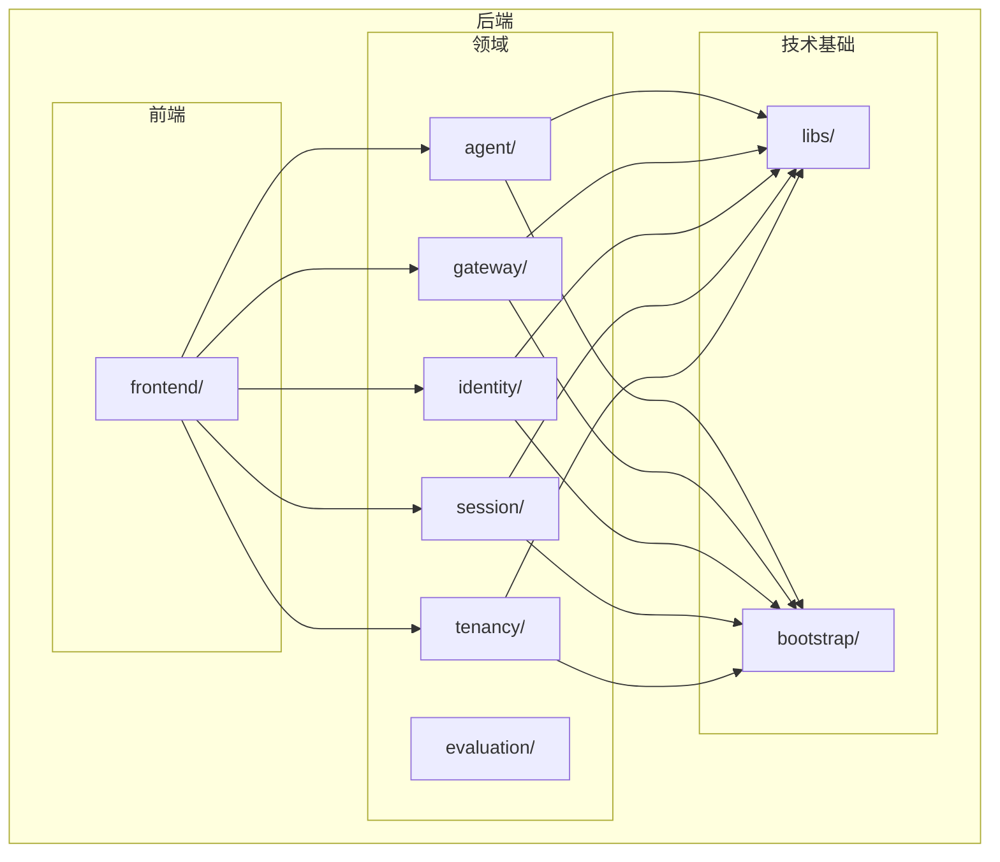
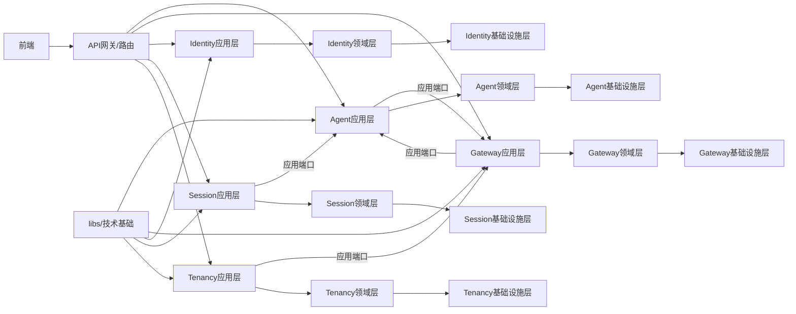
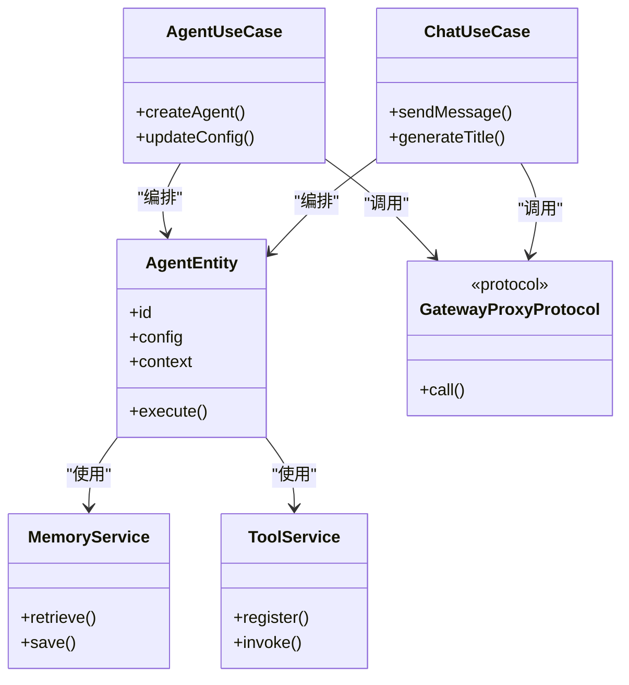
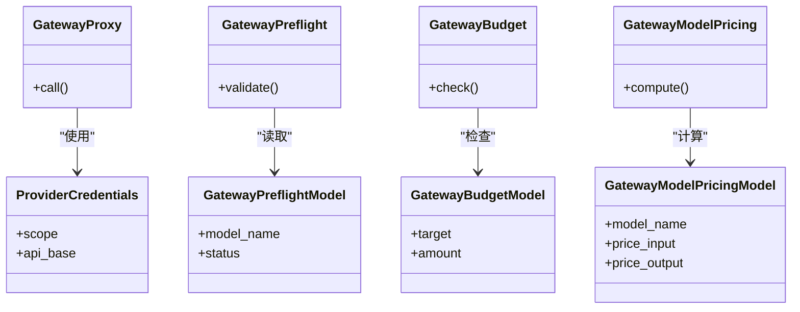
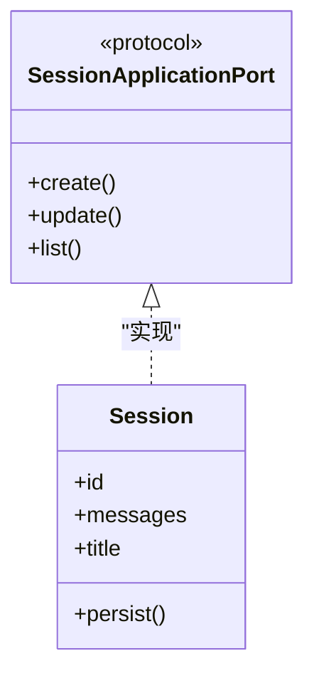
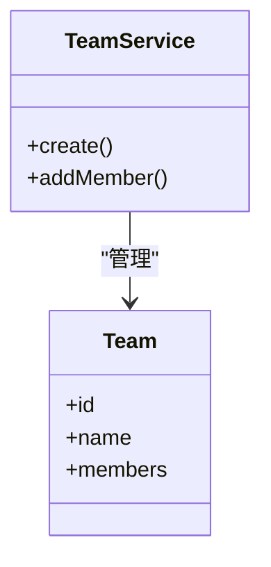
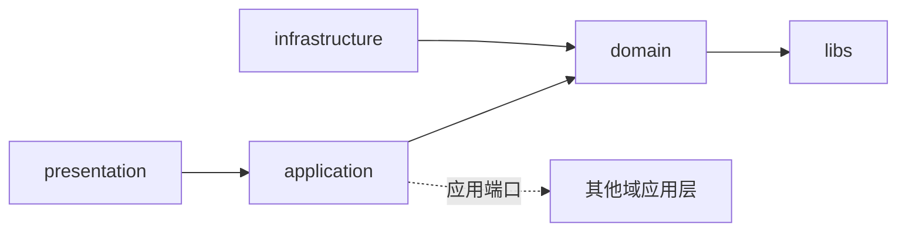

# 领域驱动设计(DDD)

<cite>
**本文引用的文件**
- [AGENTS.md](file://AGENTS.md)
- [CODE_STANDARDS.md](file://backend/docs/CODE_STANDARDS.md)
- [ARCHITECTURE.md](file://backend/docs/ARCHITECTURE.md)
- [AI_GATEWAY_DOMAIN_ARCHITECTURE.md](file://backend/docs/AI_GATEWAY_DOMAIN_ARCHITECTURE.md)
- [LANGGRAPH_ARCHITECTURE_RATIONALE.md](file://backend/docs/LANGGRAPH_ARCHITECTURE_RATIONALE.md)
- [CONTEXT_MANAGEMENT_IMPLEMENTATION.md](file://backend/docs/CONTEXT_MANAGEMENT_IMPLEMENTATION.md)
- [README.md](file://backend/docs/README.md)
- [__init__.py](file://backend/domains/agent/domain/__init__.py)
- [__init__.py](file://backend/domains/gateway/domain/__init__.py)
- [ports.py](file://backend/domains/session/application/ports.py)
- [ports.py](file://backend/domains/gateway/application/ports.py)
- [types.py](file://backend/domains/identity/domain/types.py)
- [types.py](file://backend/domains/agent/domain/types.py)
- [entities.py](file://backend/domains/agent/domain/entities.py)
- [session.py](file://backend/domains/session/domain/entities/session.py)
- [team_service.py](file://backend/domains/tenancy/application/team_service.py)
- [team.py](file://backend/domains/tenancy/domain/team.py)
- [gateway_proxy.py](file://backend/domains/gateway/application/gateway_proxy.py)
- [agent_usecase.py](file://backend/domains/agent/application/agent_usecase.py)
- [chat_usecase.py](file://backend/domains/agent/application/chat_usecase.py)
- [memory_service.py](file://backend/domains/agent/application/memory_service.py)
- [tool_service.py](file://backend/domains/agent/application/tool_service.py)
- [llm_gateway_adapter.py](file://backend/domains/agent/infrastructure/llm/llm_gateway_adapter.py)
- [memory_repository.py](file://backend/domains/agent/infrastructure/memory/memory_repository.py)
- [tool_repository.py](file://backend/domains/agent/infrastructure/tools/tool_repository.py)
- [gateway_preflight.py](file://backend/domains/gateway/application/gateway_preflight.py)
- [gateway_budget.py](file://backend/domains/gateway/application/gateway_budget.py)
- [gateway_model_pricing.py](file://backend/domains/gateway/application/gateway_model_pricing.py)
- [provider_credentials.py](file://backend/domains/gateway/domain/provider_credentials.py)
- [gateway_request_log.py](file://backend/domains/gateway/domain/gateway_request_log.py)
- [gateway_preflight_model.py](file://backend/domains/gateway/domain/gateway_preflight_model.py)
- [gateway_budget_model.py](file://backend/domains/gateway/domain/gateway_budget_model.py)
- [gateway_model_pricing_model.py](file://backend/domains/gateway/domain/gateway_model_pricing_model.py)
- [gateway_preflight_repo.py](file://backend/domains/gateway/infrastructure/gateway_preflight_repo.py)
- [gateway_budget_repo.py](file://backend/domains/gateway/infrastructure/gateway_budget_repo.py)
- [gateway_model_pricing_repo.py](file://backend/domains/gateway/infrastructure/gateway_model_pricing_repo.py)
- [gateway_preflight_orm.py](file://backend/domains/gateway/infrastructure/gateway_preflight_orm.py)
- [gateway_budget_orm.py](file://backend/domains/gateway/infrastructure/gateway_budget_orm.py)
- [gateway_model_pricing_orm.py](file://backend/domains/gateway/infrastructure/gateway_model_pricing_orm.py)
- [session_orm.py](file://backend/domains/session/infrastructure/models/session_orm.py)
- [session_repo.py](file://backend/domains/session/infrastructure/repositories/session_repo.py)
- [team_repo.py](file://backend/domains/tenancy/infrastructure/team_repo.py)
- [team_orm.py](file://backend/domains/tenancy/infrastructure/team_orm.py)
- [identity_types.py](file://backend/libs/iam/types.py)
- [exceptions.py](file://backend/libs/exceptions/exceptions.py)
- [main.py](file://backend/bootstrap/main.py)
- [composition/identity_services.py](file://backend/bootstrap/composition/identity_services.py)
- [config.py](file://backend/bootstrap/config.py)
- [config_loader.py](file://backend/bootstrap/config_loader.py)
- [event_loop.py](file://backend/bootstrap/event_loop.py)
</cite>

## 目录
1. [引言](#引言)
2. [项目结构](#项目结构)
3. [核心领域](#核心领域)
4. [架构总览](#架构总览)
5. [详细领域分析](#详细领域分析)
6. [依赖分析](#依赖分析)
7. [性能考量](#性能考量)
8. [故障排查指南](#故障排查指南)
9. [结论](#结论)
10. [附录](#附录)

## 引言
本文件面向AI Agent系统的领域驱动设计(DDD)实施，系统性阐述四至五个核心领域（Agent域、Gateway域、Identity域、Session域、Tenancy域）的边界、核心概念、实体与聚合根、领域服务与应用服务的协作、领域事件与值对象的使用，并结合仓库中的真实文件路径给出落地实现参考。目标是帮助读者理解如何通过DDD实现业务逻辑的清晰分离与可维护性提升，并总结最佳实践与常见陷阱。

## 项目结构
后端采用“按域分层”的组织方式，每个领域包含presentation（表现层）、application（应用层）、domain（领域层）、infrastructure（基础设施层），并辅以libs（纯技术基础设施）。跨域协议通过应用层端口进行解耦。

图示来源
- [CODE_STANDARDS.md:99-131](file://backend/docs/CODE_STANDARDS.md#L99-L131)
- [AGENTS.md:5-42](file://AGENTS.md#L5-L42)

章节来源
- [CODE_STANDARDS.md:99-131](file://backend/docs/CODE_STANDARDS.md#L99-L131)
- [AGENTS.md:5-42](file://AGENTS.md#L5-L42)

## 核心领域
本系统围绕以下核心领域展开：

- Agent域：负责对话编排、工具调用、记忆与推理，支持通过Gateway或直连LiteLLM执行LLM调用。
- Gateway域：负责多模型路由、虚拟Key、预算控制、日志与护栏，提供统一的代理与计费能力。
- Identity域：负责认证主体、JWT、API Key、用户模型与登录相关HTTP。
- Session域：负责会话生命周期、消息持久化、标题生成，提供对外应用端口。
- Tenancy域：负责团队与成员关系的权威数据与服务，为Gateway管理面提供团队与权限依据。

章节来源
- [AGENTS.md:10-33](file://AGENTS.md#L10-L33)
- [CODE_STANDARDS.md:116-131](file://backend/docs/CODE_STANDARDS.md#L116-L131)

## 架构总览
下图展示核心领域之间的交互关系与依赖方向，强调应用层端口解耦与跨域依赖倒置。

图示来源
- [CODE_STANDARDS.md:99-131](file://backend/docs/CODE_STANDARDS.md#L99-L131)
- [ports.py](file://backend/domains/session/application/ports.py)
- [ports.py](file://backend/domains/gateway/application/ports.py)

## 详细领域分析

### Agent域
- 边界与职责
  - 负责对话编排、工具调用、记忆检索、推理策略选择。
  - 通过应用端口与Gateway域协作，实现LLM调用与成本归因。
- 核心概念与实体
  - 领域类型：消息、工具调用、Agent事件等。
  - 聚合根：Agent实体，封装对话状态与编排规则。
- 领域服务与应用服务
  - 领域服务：工具注册、记忆检索、推理策略。
  - 应用服务：AgentUseCase、ChatUseCase，编排事务与端口调用。
- 值对象与领域事件
  - 值对象：消息内容、工具参数等不可变结构。
  - 领域事件：用于跨聚合的异步通知（如工具调用完成）。
- 代码实现参考
  - 领域层：[types.py](file://backend/domains/agent/domain/types.py)，[entities.py](file://backend/domains/agent/domain/entities.py)
  - 应用层：[agent_usecase.py](file://backend/domains/agent/application/agent_usecase.py)，[chat_usecase.py](file://backend/domains/agent/application/chat_usecase.py)，[memory_service.py](file://backend/domains/agent/application/memory_service.py)，[tool_service.py](file://backend/domains/agent/application/tool_service.py)
  - 基础设施层：[llm_gateway_adapter.py](file://backend/domains/agent/infrastructure/llm/llm_gateway_adapter.py)，[memory_repository.py](file://backend/domains/agent/infrastructure/memory/memory_repository.py)，[tool_repository.py](file://backend/domains/agent/infrastructure/tools/tool_repository.py)

图示来源
- [entities.py](file://backend/domains/agent/domain/entities.py)
- [agent_usecase.py](file://backend/domains/agent/application/agent_usecase.py)
- [chat_usecase.py](file://backend/domains/agent/application/chat_usecase.py)
- [memory_service.py](file://backend/domains/agent/application/memory_service.py)
- [tool_service.py](file://backend/domains/agent/application/tool_service.py)
- [ports.py](file://backend/domains/gateway/application/ports.py)

章节来源
- [__init__.py](file://backend/domains/agent/domain/__init__.py)
- [types.py](file://backend/domains/agent/domain/types.py)
- [entities.py](file://backend/domains/agent/domain/entities.py)
- [agent_usecase.py](file://backend/domains/agent/application/agent_usecase.py)
- [chat_usecase.py](file://backend/domains/agent/application/chat_usecase.py)
- [memory_service.py](file://backend/domains/agent/application/memory_service.py)
- [tool_service.py](file://backend/domains/agent/application/tool_service.py)
- [llm_gateway_adapter.py](file://backend/domains/agent/infrastructure/llm/llm_gateway_adapter.py)

### Gateway域
- 边界与职责
  - 提供统一的LLM路由、虚拟Key、预算控制、请求日志与护栏。
  - 通过应用端口向Agent域提供代理能力，向管理面提供预算与定价模型。
- 核心概念与实体
  - 值对象：供应商凭据、模型定价、预算目标。
  - 聚合根：预检模型、预算模型、定价模型。
- 领域服务与应用服务
  - 领域服务：预检、预算校验、定价计算。
  - 应用服务：GatewayProxy、Preflight、Budget、Pricing。
- 值对象与领域事件
  - 值对象：凭据范围、API Base、限额单位。
  - 领域事件：预算触发告警、模型测试结果。
- 代码实现参考
  - 应用层：[gateway_proxy.py](file://backend/domains/gateway/application/gateway_proxy.py)，[gateway_preflight.py](file://backend/domains/gateway/application/gateway_preflight.py)，[gateway_budget.py](file://backend/domains/gateway/application/gateway_budget.py)，[gateway_model_pricing.py](file://backend/domains/gateway/application/gateway_model_pricing.py)
  - 领域层：[provider_credentials.py](file://backend/domains/gateway/domain/provider_credentials.py)，[gateway_request_log.py](file://backend/domains/gateway/domain/gateway_request_log.py)，[gateway_preflight_model.py](file://backend/domains/gateway/domain/gateway_preflight_model.py)，[gateway_budget_model.py](file://backend/domains/gateway/domain/gateway_budget_model.py)，[gateway_model_pricing_model.py](file://backend/domains/gateway/domain/gateway_model_pricing_model.py)
  - 基础设施层：[gateway_preflight_repo.py](file://backend/domains/gateway/infrastructure/gateway_preflight_repo.py)，[gateway_budget_repo.py](file://backend/domains/gateway/infrastructure/gateway_budget_repo.py)，[gateway_model_pricing_repo.py](file://backend/domains/gateway/infrastructure/gateway_model_pricing_repo.py)，[gateway_preflight_orm.py](file://backend/domains/gateway/infrastructure/gateway_preflight_orm.py)，[gateway_budget_orm.py](file://backend/domains/gateway/infrastructure/gateway_budget_orm.py)，[gateway_model_pricing_orm.py](file://backend/domains/gateway/infrastructure/gateway_model_pricing_orm.py)

图示来源
- [provider_credentials.py](file://backend/domains/gateway/domain/provider_credentials.py)
- [gateway_preflight_model.py](file://backend/domains/gateway/domain/gateway_preflight_model.py)
- [gateway_budget_model.py](file://backend/domains/gateway/domain/gateway_budget_model.py)
- [gateway_model_pricing_model.py](file://backend/domains/gateway/domain/gateway_model_pricing_model.py)
- [gateway_proxy.py](file://backend/domains/gateway/application/gateway_proxy.py)
- [gateway_preflight.py](file://backend/domains/gateway/application/gateway_preflight.py)
- [gateway_budget.py](file://backend/domains/gateway/application/gateway_budget.py)
- [gateway_model_pricing.py](file://backend/domains/gateway/application/gateway_model_pricing.py)

章节来源
- [__init__.py](file://backend/domains/gateway/domain/__init__.py)
- [gateway_proxy.py](file://backend/domains/gateway/application/gateway_proxy.py)
- [gateway_preflight.py](file://backend/domains/gateway/application/gateway_preflight.py)
- [gateway_budget.py](file://backend/domains/gateway/application/gateway_budget.py)
- [gateway_model_pricing.py](file://backend/domains/gateway/application/gateway_model_pricing.py)
- [provider_credentials.py](file://backend/domains/gateway/domain/provider_credentials.py)
- [gateway_preflight_model.py](file://backend/domains/gateway/domain/gateway_preflight_model.py)
- [gateway_budget_model.py](file://backend/domains/gateway/domain/gateway_budget_model.py)
- [gateway_model_pricing_model.py](file://backend/domains/gateway/domain/gateway_model_pricing_model.py)

### Identity域
- 边界与职责
  - 负责认证主体、JWT、API Key、用户模型与登录相关HTTP。
- 核心概念与实体
  - 领域类型：Principal、匿名主体等。
- 代码实现参考
  - 领域层：[types.py](file://backend/domains/identity/domain/types.py)
  - 应用层：[ports.py](file://backend/domains/session/application/ports.py)（会话域对身份的依赖）

章节来源
- [types.py](file://backend/domains/identity/domain/types.py)
- [ports.py](file://backend/domains/session/application/ports.py)

### Session域
- 边界与职责
  - 负责会话生命周期、消息持久化、标题生成，提供对外应用端口。
- 核心概念与实体
  - 聚合根：Session实体。
- 应用端口
  - SessionApplicationPort：对外暴露的会话能力协议。
- 代码实现参考
  - 领域层：[session.py](file://backend/domains/session/domain/entities/session.py)
  - 应用层：[ports.py](file://backend/domains/session/application/ports.py)
  - 基础设施层：[session_orm.py](file://backend/domains/session/infrastructure/models/session_orm.py)，[session_repo.py](file://backend/domains/session/infrastructure/repositories/session_repo.py)

图示来源
- [session.py](file://backend/domains/session/domain/entities/session.py)
- [ports.py](file://backend/domains/session/application/ports.py)

章节来源
- [session.py](file://backend/domains/session/domain/entities/session.py)
- [ports.py](file://backend/domains/session/application/ports.py)
- [session_orm.py](file://backend/domains/session/infrastructure/models/session_orm.py)
- [session_repo.py](file://backend/domains/session/infrastructure/repositories/session_repo.py)

### Tenancy域
- 边界与职责
  - 团队与成员关系的权威数据与服务，Gateway管理面通过TeamService/仓储访问团队，不复制团队规则。
- 核心概念与实体
  - 聚合根：Team、TeamMember。
- 代码实现参考
  - 应用层：[team_service.py](file://backend/domains/tenancy/application/team_service.py)
  - 领域层：[team.py](file://backend/domains/tenancy/domain/team.py)
  - 基础设施层：[team_repo.py](file://backend/domains/tenancy/infrastructure/team_repo.py)，[team_orm.py](file://backend/domains/tenancy/infrastructure/team_orm.py)

图示来源
- [team_service.py](file://backend/domains/tenancy/application/team_service.py)
- [team.py](file://backend/domains/tenancy/domain/team.py)

章节来源
- [team_service.py](file://backend/domains/tenancy/application/team_service.py)
- [team.py](file://backend/domains/tenancy/domain/team.py)
- [team_repo.py](file://backend/domains/tenancy/infrastructure/team_repo.py)
- [team_orm.py](file://backend/domains/tenancy/infrastructure/team_orm.py)

## 依赖分析
- 层内依赖
  - presentation -> application：路由与Schema依赖用例。
  - application -> domain：用例编排领域服务与仓储接口。
  - domain -> libs：仅使用通用类型与工具。
  - infrastructure -> domain：实现仓储与外部适配。
- 跨域依赖
  - 通过应用层端口解耦，消费方导入协议类型，提供方在应用层内部懒加载实现，避免循环依赖。
- 依赖方向示意

图示来源
- [CODE_STANDARDS.md:99-131](file://backend/docs/CODE_STANDARDS.md#L99-L131)

章节来源
- [CODE_STANDARDS.md:99-131](file://backend/docs/CODE_STANDARDS.md#L99-L131)

## 性能考量
- 仓储与查询
  - 使用ORM与索引优化热点查询，避免N+1问题。
- 跨域调用
  - 通过应用端口减少直接导入，降低编译时耦合，利于并行扩展。
- 日志与监控
  - 在Gateway域集中记录请求日志与成本归因，便于追踪与审计。
- 会话与内存
  - Session域的消息持久化与标题生成应避免大对象驻留内存，采用流式处理与分页。

## 故障排查指南
- 异常体系
  - 使用统一的领域异常基类，区分HTTP映射与业务错误，便于前端与运维定位。
- 端口契约
  - 若跨域调用失败，优先检查应用端口实现是否一致、参数序列化是否正确。
- 会话一致性
  - Session持久化失败时，检查仓储实现与事务边界，确保幂等与回滚。
- Gateway护栏
  - 预检失败或预算超支时，核对凭据范围、模型名称与限额配置。

章节来源
- [exceptions.py](file://backend/libs/exceptions/exceptions.py)
- [ports.py](file://backend/domains/session/application/ports.py)
- [ports.py](file://backend/domains/gateway/application/ports.py)

## 结论
通过DDD在AI Agent系统中的实施，实现了业务边界清晰、跨域解耦与可演进的架构。Agent域专注于对话编排，Gateway域提供统一的路由与护栏，Identity域负责认证，Session域管理会话生命周期，Tenancy域提供团队权威数据。应用层端口与libs技术基础共同保证了高内聚低耦合，提升了系统的可维护性与可测试性。

## 附录
- 启动与装配
  - 应用入口与依赖注入装配位于bootstrap目录，确保各域可独立测试与替换。
- 文档与规范
  - 项目提供了架构、代码标准、LangGraph与上下文管理等文档，作为DDD落地的参考依据。

章节来源
- [main.py](file://backend/bootstrap/main.py)
- [composition/identity_services.py](file://backend/bootstrap/composition/identity_services.py)
- [config.py](file://backend/bootstrap/config.py)
- [config_loader.py](file://backend/bootstrap/config_loader.py)
- [event_loop.py](file://backend/bootstrap/event_loop.py)
- [README.md](file://backend/docs/README.md)
- [ARCHITECTURE.md](file://backend/docs/ARCHITECTURE.md)
- [AI_GATEWAY_DOMAIN_ARCHITECTURE.md](file://backend/docs/AI_GATEWAY_DOMAIN_ARCHITECTURE.md)
- [LANGGRAPH_ARCHITECTURE_RATIONALE.md](file://backend/docs/LANGGRAPH_ARCHITECTURE_RATIONALE.md)
- [CONTEXT_MANAGEMENT_IMPLEMENTATION.md](file://backend/docs/CONTEXT_MANAGEMENT_IMPLEMENTATION.md)