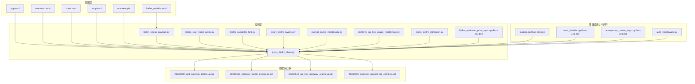
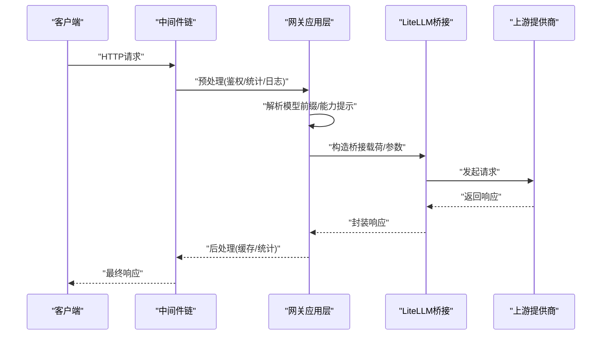
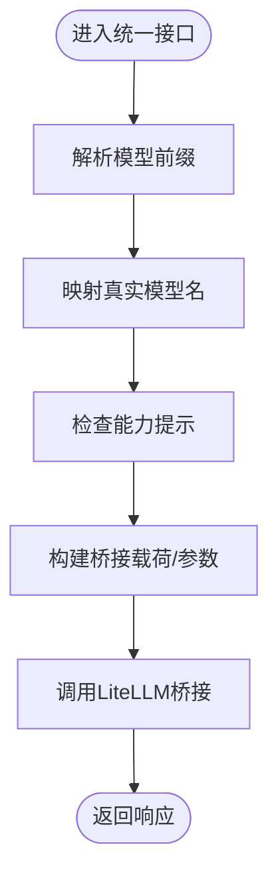
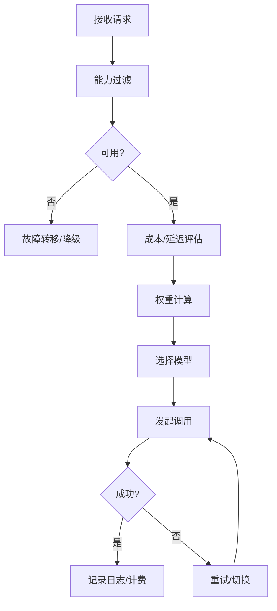
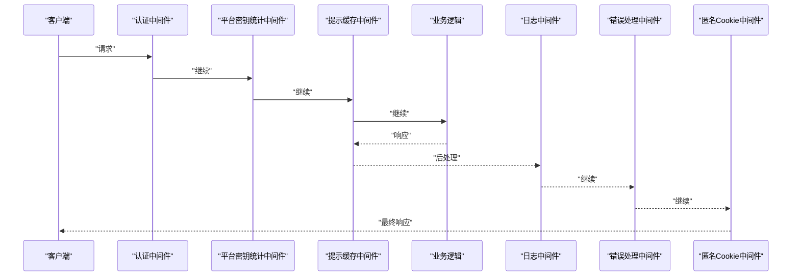
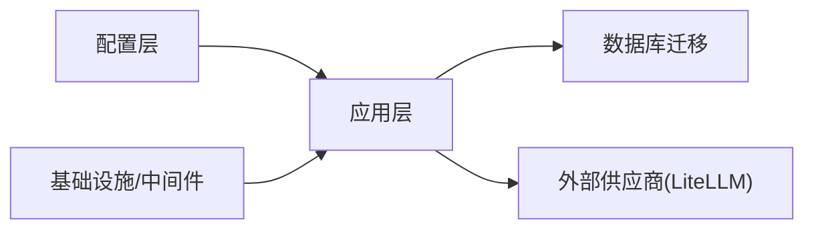

# LLM网关设计

<cite>
**本文引用的文件**
- [litellm_models.yaml](file://backend/config/litellm_models.yaml)
- [litellm_capability_hint.py](file://backend/domains/gateway/application/catalog/litellm_capability_hint.py)
- [litellm_bridge_payload.py](file://backend/domains/gateway/application/litellm_bridge_payload.py)
- [litellm_real_model_prefix.py](file://backend/domains/gateway/application/litellm_real_model_prefix.py)
- [proxy_litellm_client.py](file://backend/domains/gateway/application/proxy_litellm_client.py)
- [proxy_litellm_kwargs.py](file://backend/domains/gateway/application/proxy_litellm_kwargs.py)
- [prompt_cache_middleware.py](file://backend/domains/gateway/application/prompt_cache_middleware.py)
- [platform_api_key_usage_middleware.py](file://backend/domains/gateway/presentation/platform_api_key_usage_middleware.py)
- [auth_middleware.py](file://backend/domains/agent/infrastructure/mcp_server/auth_middleware.py)
- [logging.cpython-313.pyc](file://backend/libs/middleware/__pycache__/logging.cpython-313.pyc)
- [error_handler.cpython-313.pyc](file://backend/libs/middleware/__pycache__/error_handler.cpython-313.pyc)
- [anonymous_cookie_asgi.cpython-313.pyc](file://backend/libs/middleware/__pycache__/anonymous_cookie_asgi.cpython-313.pyc)
- [probe_litellm_attribution.py](file://backend/domains/gateway/application/management/write_modules/probe_litellm_attribution.py)
- [litellm_upstream_price_sync.cpython-313.pyc](file://backend/domains/gateway/application/pricing/__pycache__/litellm_upstream_price_sync.cpython-313.pyc)
- [gateway-catalog.seed.json](file://backend/seeds/gateway-catalog.seed.json)
- [20260508_add_gateway_tables.up.sql](file://backend/alembic/sql/20260508_add_gateway_tables.up.sql)
- [20260518_gateway_model_pricing.up.sql](file://backend/alembic/sql/20260518_gateway_model_pricing.up.sql)
- [20260515_api_key_gateway_grants.up.sql](file://backend/alembic/sql/20260515_api_key_gateway_grants.up.sql)
- [20260520_gateway_request_log_client.up.sql](file://backend/alembic/sql/20260520_gateway_request_log_client.up.sql)
- [LLM_GATEWAY_ARCHITECTURE.md](file://backend/docs/gateway/LLM_GATEWAY_ARCHITECTURE.md)
- [GATEWAY_PRICING_AND_LITELLM_COST.md](file://backend/docs/gateway/GATEWAY_PRICING_AND_LITELLM_COST.md)
- [README.md](file://backend/docs/gateway/README.md)
- [AI_GATEWAY_DOMAIN_ARCHITECTURE.md](file://backend/docs/AI_GATEWAY_DOMAIN_ARCHITECTURE.md)
- [CONFIGURATION.md](file://backend/docs/CONFIGURATION.md)
- [LITELM_SUPPORTED_MODELS.md](file://backend/docs/gateway/LITELM_SUPPORTED_MODELS.md)
- [LITELLM_CAPABILITY_MATRIX.md](file://backend/docs/gateway/LITELM_CAPABILITY_MATRIX.md)
- [GATEWAY_THIRDPARTY_CLIENT_GUIDE.md](file://backend/docs/gateway/GATEWAY_THIRDPARTY_CLIENT_GUIDE.md)
- [GATEWAY_DEPLOYMENT_CHECKLIST.md](file://backend/docs/gateway/GATEWAY_DEPLOYMENT_CHECKLIST.md)
- [app.toml](file://backend/config/app.toml)
- [execution.toml](file://backend/config/execution.toml)
- [tools.toml](file://backend/config/tools.toml)
- [mcp.toml](file://backend/config/mcp.toml)
- [env.example](file://backend/config/env.example)
- [run_server.py](file://backend/scripts/run_server.py)
- [run_dev_server.py](file://backend/scripts/run_dev_server.py)
- [seed_gateway_models.py](file://backend/scripts/seed_gateway_models.py)
- [test_gateway_proxy.py](file://backend/scripts/test_gateway_proxy.py)
- [test_litellm_models.py](file://backend/scripts/test_litellm_models.py)
- [test_network_config.py](file://backend/scripts/test_network_config.py)
- [litellm_test_results_final.json](file://backend/litellm_test_results_final.json)
</cite>

## 目录
1. [引言](#引言)
2. [项目结构](#项目结构)
3. [核心组件](#核心组件)
4. [架构总览](#架构总览)
5. [详细组件分析](#详细组件分析)
6. [依赖关系分析](#依赖关系分析)
7. [性能考虑](#性能考虑)
8. [故障排查指南](#故障排查指南)
9. [结论](#结论)
10. [附录](#附录)

## 引言
本文件面向LLM网关设计，围绕LiteLLM集成、统一模型接口、路由与负载均衡、中间件链、并发与性能优化、扩展性（插件与适配器）、配置最佳实践以及与其他系统组件的集成模式进行系统化说明。目标是帮助技术与非技术读者全面理解网关的架构理念与实现机制。

## 项目结构
网关相关代码主要分布在以下区域：
- 配置层：LiteLLM模型清单、应用配置、环境变量模板
- 应用层：LiteLLM桥接、模型前缀映射、能力提示、价格同步、探测与归属
- 表现层：平台级API密钥使用统计中间件
- 基础设施与中间件：通用ASGI中间件（日志、错误处理、匿名Cookie）
- 文档：架构、定价、部署、第三方客户端指南等
- 数据库迁移：网关表、定价、配额、请求日志等

**图表来源**
- [litellm_models.yaml](file://backend/config/litellm_models.yaml)
- [app.toml](file://backend/config/app.toml)
- [execution.toml](file://backend/config/execution.toml)
- [tools.toml](file://backend/config/tools.toml)
- [mcp.toml](file://backend/config/mcp.toml)
- [env.example](file://backend/config/env.example)
- [litellm_bridge_payload.py](file://backend/domains/gateway/application/litellm_bridge_payload.py)
- [litellm_real_model_prefix.py](file://backend/domains/gateway/application/litellm_real_model_prefix.py)
- [litellm_capability_hint.py](file://backend/domains/gateway/application/catalog/litellm_capability_hint.py)
- [proxy_litellm_client.py](file://backend/domains/gateway/application/proxy_litellm_client.py)
- [proxy_litellm_kwargs.py](file://backend/domains/gateway/application/proxy_litellm_kwargs.py)
- [prompt_cache_middleware.py](file://backend/domains/gateway/application/prompt_cache_middleware.py)
- [platform_api_key_usage_middleware.py](file://backend/domains/gateway/presentation/platform_api_key_usage_middleware.py)
- [probe_litellm_attribution.py](file://backend/domains/gateway/application/management/write_modules/probe_litellm_attribution.py)
- [litellm_upstream_price_sync.cpython-313.pyc](file://backend/domains/gateway/application/pricing/__pycache__/litellm_upstream_price_sync.cpython-313.pyc)
- [logging.cpython-313.pyc](file://backend/libs/middleware/__pycache__/logging.cpython-313.pyc)
- [error_handler.cpython-313.pyc](file://backend/libs/middleware/__pycache__/error_handler.cpython-313.pyc)
- [anonymous_cookie_asgi.cpython-313.pyc](file://backend/libs/middleware/__pycache__/anonymous_cookie_asgi.cpython-313.pyc)
- [auth_middleware.py](file://backend/domains/agent/infrastructure/mcp_server/auth_middleware.py)
- [20260508_add_gateway_tables.up.sql](file://backend/alembic/sql/20260508_add_gateway_tables.up.sql)
- [20260518_gateway_model_pricing.up.sql](file://backend/alembic/sql/20260518_gateway_model_pricing.up.sql)
- [20260515_api_key_gateway_grants.up.sql](file://backend/alembic/sql/20260515_api_key_gateway_grants.up.sql)
- [20260520_gateway_request_log_client.up.sql](file://backend/alembic/sql/20260520_gateway_request_log_client.up.sql)

**章节来源**
- [litellm_models.yaml](file://backend/config/litellm_models.yaml)
- [app.toml](file://backend/config/app.toml)
- [execution.toml](file://backend/config/execution.toml)
- [tools.toml](file://backend/config/tools.toml)
- [mcp.toml](file://backend/config/mcp.toml)
- [env.example](file://backend/config/env.example)

## 核心组件
- LiteLLM桥接与统一模型接口
  - 通过桥接载荷与参数映射，将上游不同供应商的模型接口标准化，形成统一调用入口。
  - 实现模型真实前缀解析与能力提示，支撑路由与选择逻辑。
- 路由与负载均衡
  - 基于模型能力、可用性与成本信息进行选择；结合探测与归属模块实现健康检查与故障转移。
- 中间件链
  - 请求预处理（如平台API密钥使用统计）、响应后处理（如缓存命中率统计）与通用错误处理、日志记录、匿名Cookie等。
- 并发与性能
  - 通过连接池与异步处理机制提升吞吐；配合缓存中间件降低重复计算与网络开销。
- 扩展性
  - 插件与自定义适配器支持，通过配置与桥接参数扩展新供应商或新能力。
- 配置与部署
  - 多环境配置、模型清单、执行策略与工具配置，配套部署检查清单与第三方客户端指南。

**章节来源**
- [litellm_bridge_payload.py](file://backend/domains/gateway/application/litellm_bridge_payload.py)
- [litellm_real_model_prefix.py](file://backend/domains/gateway/application/litellm_real_model_prefix.py)
- [litellm_capability_hint.py](file://backend/domains/gateway/application/catalog/litellm_capability_hint.py)
- [proxy_litellm_client.py](file://backend/domains/gateway/application/proxy_litellm_client.py)
- [proxy_litellm_kwargs.py](file://backend/domains/gateway/application/proxy_litellm_kwargs.py)
- [prompt_cache_middleware.py](file://backend/domains/gateway/application/prompt_cache_middleware.py)
- [platform_api_key_usage_middleware.py](file://backend/domains/gateway/presentation/platform_api_key_usage_middleware.py)
- [probe_litellm_attribution.py](file://backend/domains/gateway/application/management/write_modules/probe_litellm_attribution.py)
- [litellm_upstream_price_sync.cpython-313.pyc](file://backend/domains/gateway/application/pricing/__pycache__/litellm_upstream_price_sync.cpython-313.pyc)

## 架构总览
下图展示从客户端到LiteLLM的端到端调用路径，以及中间件链在请求生命周期中的位置。

**图表来源**
- [proxy_litellm_client.py](file://backend/domains/gateway/application/proxy_litellm_client.py)
- [litellm_bridge_payload.py](file://backend/domains/gateway/application/litellm_bridge_payload.py)
- [litellm_real_model_prefix.py](file://backend/domains/gateway/application/litellm_real_model_prefix.py)
- [litellm_capability_hint.py](file://backend/domains/gateway/application/catalog/litellm_capability_hint.py)
- [prompt_cache_middleware.py](file://backend/domains/gateway/application/prompt_cache_middleware.py)
- [platform_api_key_usage_middleware.py](file://backend/domains/gateway/presentation/platform_api_key_usage_middleware.py)
- [logging.cpython-313.pyc](file://backend/libs/middleware/__pycache__/logging.cpython-313.pyc)
- [error_handler.cpython-313.pyc](file://backend/libs/middleware/__pycache__/error_handler.cpython-313.pyc)
- [anonymous_cookie_asgi.cpython-313.pyc](file://backend/libs/middleware/__pycache__/anonymous_cookie_asgi.cpython-313.pyc)

## 详细组件分析

### LiteLLM集成与统一模型接口
- 设计理念
  - 将不同供应商的模型接口抽象为统一的“模型标识”，通过前缀与能力提示实现路由决策。
  - 使用桥接载荷与参数映射屏蔽供应商差异，确保上层调用一致性。
- 关键实现
  - 模型前缀解析：将统一模型名映射到真实供应商模型名，便于路由与计费。
  - 能力提示：基于模型清单与能力矩阵，决定是否启用某模型或其特定功能。
  - 桥接载荷与参数：规范化请求体与参数，确保与LiteLLM期望格式一致。
- 数据结构与复杂度
  - 前缀映射与能力查询以字典查找为主，时间复杂度O(1)。
  - 模型清单加载与校验在启动时完成，运行时查询为常数时间。
- 错误处理与边界
  - 当模型不存在或能力不匹配时，返回明确的错误码与原因，避免静默失败。
- 性能影响
  - 统一接口减少分支判断与序列化开销，提升整体吞吐。

**图表来源**
- [litellm_real_model_prefix.py](file://backend/domains/gateway/application/litellm_real_model_prefix.py)
- [litellm_capability_hint.py](file://backend/domains/gateway/application/catalog/litellm_capability_hint.py)
- [litellm_bridge_payload.py](file://backend/domains/gateway/application/litellm_bridge_payload.py)
- [proxy_litellm_kwargs.py](file://backend/domains/gateway/application/proxy_litellm_kwargs.py)

**章节来源**
- [litellm_models.yaml](file://backend/config/litellm_models.yaml)
- [litellm_real_model_prefix.py](file://backend/domains/gateway/application/litellm_real_model_prefix.py)
- [litellm_capability_hint.py](file://backend/domains/gateway/application/catalog/litellm_capability_hint.py)
- [litellm_bridge_payload.py](file://backend/domains/gateway/application/litellm_bridge_payload.py)
- [proxy_litellm_kwargs.py](file://backend/domains/gateway/application/proxy_litellm_kwargs.py)

### 路由策略与负载均衡
- 模型选择逻辑
  - 基于能力提示与可用性状态筛选候选模型。
  - 结合成本、延迟与配额信息进行加权选择。
- 错误重试与故障转移
  - 探测模块定期对上游进行健康检查，失败时自动切换至备用模型或供应商。
  - 支持幂等重试与指数退避策略，避免雪崩效应。
- 负载均衡
  - 在同一供应商内按权重分配请求，动态调整权重以应对实时性能变化。
- 数据库支撑
  - 通过网关表、定价表、配额表与请求日志表，记录路由决策依据与历史表现。

**图表来源**
- [probe_litellm_attribution.py](file://backend/domains/gateway/application/management/write_modules/probe_litellm_attribution.py)
- [20260508_add_gateway_tables.up.sql](file://backend/alembic/sql/20260508_add_gateway_tables.up.sql)
- [20260518_gateway_model_pricing.up.sql](file://backend/alembic/sql/20260518_gateway_model_pricing.up.sql)
- [20260515_api_key_gateway_grants.up.sql](file://backend/alembic/sql/20260515_api_key_gateway_grants.up.sql)
- [20260520_gateway_request_log_client.up.sql](file://backend/alembic/sql/20260520_gateway_request_log_client.up.sql)

**章节来源**
- [probe_litellm_attribution.py](file://backend/domains/gateway/application/management/write_modules/probe_litellm_attribution.py)
- [20260508_add_gateway_tables.up.sql](file://backend/alembic/sql/20260508_add_gateway_tables.up.sql)
- [20260518_gateway_model_pricing.up.sql](file://backend/alembic/sql/20260518_gateway_model_pricing.up.sql)
- [20260515_api_key_gateway_grants.up.sql](file://backend/alembic/sql/20260515_api_key_gateway_grants.up.sql)
- [20260520_gateway_request_log_client.up.sql](file://backend/alembic/sql/20260520_gateway_request_log_client.up.sql)

### 中间件架构
- 请求预处理
  - 平台API密钥使用统计中间件：在请求进入业务逻辑前统计用量，用于配额控制与计费。
  - 认证中间件：在Agent/MCP场景中进行身份验证与授权。
- 响应后处理
  - 提示缓存中间件：命中缓存则直接返回，降低重复计算与网络往返。
- 通用中间件
  - 日志中间件：统一记录请求上下文与性能指标。
  - 错误处理中间件：捕获异常并返回标准化错误响应。
  - 匿名Cookie中间件：为匿名用户设置会话标识，便于追踪与审计。
- 执行顺序
  - 鉴权/认证 → 平台密钥统计 → 缓存检查 → 业务处理 → 后处理统计 → 错误捕获 → 响应返回。

**图表来源**
- [platform_api_key_usage_middleware.py](file://backend/domains/gateway/presentation/platform_api_key_usage_middleware.py)
- [prompt_cache_middleware.py](file://backend/domains/gateway/application/prompt_cache_middleware.py)
- [auth_middleware.py](file://backend/domains/agent/infrastructure/mcp_server/auth_middleware.py)
- [logging.cpython-313.pyc](file://backend/libs/middleware/__pycache__/logging.cpython-313.pyc)
- [error_handler.cpython-313.pyc](file://backend/libs/middleware/__pycache__/error_handler.cpython-313.pyc)
- [anonymous_cookie_asgi.cpython-313.pyc](file://backend/libs/middleware/__pycache__/anonymous_cookie_asgi.cpython-313.pyc)

**章节来源**
- [platform_api_key_usage_middleware.py](file://backend/domains/gateway/presentation/platform_api_key_usage_middleware.py)
- [prompt_cache_middleware.py](file://backend/domains/gateway/application/prompt_cache_middleware.py)
- [auth_middleware.py](file://backend/domains/agent/infrastructure/mcp_server/auth_middleware.py)
- [logging.cpython-313.pyc](file://backend/libs/middleware/__pycache__/logging.cpython-313.pyc)
- [error_handler.cpython-313.pyc](file://backend/libs/middleware/__pycache__/error_handler.cpython-313.pyc)
- [anonymous_cookie_asgi.cpython-313.pyc](file://backend/libs/middleware/__pycache__/anonymous_cookie_asgi.cpython-313.pyc)

### 并发处理与性能优化
- 连接池管理
  - 对上游供应商建立连接池，复用TCP连接，减少握手开销。
  - 根据并发峰值与超时阈值动态调整池大小。
- 异步处理
  - 在不影响业务正确性的前提下，采用异步I/O处理非CPU密集型任务。
- 缓存策略
  - 提示缓存中间件命中优先，热点数据驻留内存，降低重复请求。
- 监控与可观测性
  - 通过日志中间件与请求日志表记录关键指标，辅助性能分析与容量规划。

**章节来源**
- [prompt_cache_middleware.py](file://backend/domains/gateway/application/prompt_cache_middleware.py)
- [logging.cpython-313.pyc](file://backend/libs/middleware/__pycache__/logging.cpython-313.pyc)
- [20260520_gateway_request_log_client.up.sql](file://backend/alembic/sql/20260520_gateway_request_log_client.up.sql)

### 扩展性设计
- 插件系统
  - 通过配置文件与桥接参数扩展新的供应商或能力，无需修改核心逻辑。
- 自定义适配器
  - 适配器负责将上游协议转换为LiteLLM期望格式，保持统一接口。
- 模型目录与种子数据
  - 模型目录与种子数据用于初始化可用模型集合，便于快速上线新模型。

**章节来源**
- [litellm_models.yaml](file://backend/config/litellm_models.yaml)
- [gateway-catalog.seed.json](file://backend/seeds/gateway-catalog.seed.json)

### 配置与部署最佳实践
- 配置要点
  - 应用配置：根据环境设置并发、超时、重试策略。
  - 执行配置：定义默认模型、回退策略与成本上限。
  - 工具配置：启用必要的工具与功能开关。
  - MCP配置：在Agent/MCP场景中启用相应中间件与鉴权。
- 部署检查清单
  - 确认模型清单完整、上游凭证有效、连接池参数合理、日志与监控已启用。
- 第三方客户端指南
  - 提供SDK使用示例与注意事项，确保客户端与网关交互稳定。

**章节来源**
- [app.toml](file://backend/config/app.toml)
- [execution.toml](file://backend/config/execution.toml)
- [tools.toml](file://backend/config/tools.toml)
- [mcp.toml](file://backend/config/mcp.toml)
- [env.example](file://backend/config/env.example)
- [GATEWAY_DEPLOYMENT_CHECKLIST.md](file://backend/docs/gateway/GATEWAY_DEPLOYMENT_CHECKLIST.md)
- [GATEWAY_THIRDPARTY_CLIENT_GUIDE.md](file://backend/docs/gateway/GATEWAY_THIRDPARTY_CLIENT_GUIDE.md)

## 依赖关系分析
- 组件耦合
  - 应用层高度依赖配置层提供的模型清单与执行策略。
  - 中间件链独立于业务逻辑，通过标准接口接入。
- 外部依赖
  - LiteLLM作为统一代理，向上游供应商抽象接口。
  - 数据库迁移脚本定义网关所需的数据结构与索引。
- 可能的循环依赖
  - 通过清晰的分层与接口契约避免循环导入。

**图表来源**
- [litellm_models.yaml](file://backend/config/litellm_models.yaml)
- [proxy_litellm_client.py](file://backend/domains/gateway/application/proxy_litellm_client.py)
- [20260508_add_gateway_tables.up.sql](file://backend/alembic/sql/20260508_add_gateway_tables.up.sql)

**章节来源**
- [proxy_litellm_client.py](file://backend/domains/gateway/application/proxy_litellm_client.py)
- [20260508_add_gateway_tables.up.sql](file://backend/alembic/sql/20260508_add_gateway_tables.up.sql)

## 性能考虑
- 模型选择与路由
  - 利用能力提示与成本矩阵进行快速筛选，减少无效调用。
- 缓存与连接池
  - 提示缓存与连接池显著降低延迟与资源消耗。
- 监控与调优
  - 通过请求日志与指标持续观察性能瓶颈，迭代优化参数。

## 故障排查指南
- 常见问题
  - 模型不可用：检查模型清单与能力提示，确认上游状态。
  - 超时与重试：调整超时与重试策略，避免过度重试导致雪崩。
  - 鉴权失败：核对认证中间件配置与凭证有效性。
- 调试工具
  - 使用探测模块与日志中间件定位问题根因。
  - 通过请求日志表回溯请求路径与耗时。

**章节来源**
- [probe_litellm_attribution.py](file://backend/domains/gateway/application/management/write_modules/probe_litellm_attribution.py)
- [logging.cpython-313.pyc](file://backend/libs/middleware/__pycache__/logging.cpython-313.pyc)
- [20260520_gateway_request_log_client.up.sql](file://backend/alembic/sql/20260520_gateway_request_log_client.up.sql)

## 结论
该网关通过LiteLLM实现统一模型接口，结合能力提示、模型前缀映射与桥接参数，形成可路由、可扩展、可观测的推理服务。中间件链保证了请求生命周期的可控性，配合缓存与连接池实现高性能并发。通过完善的配置与部署指南，可快速落地并持续优化。

## 附录
- 相关文档
  - 架构设计、定价与成本、模型支持矩阵、第三方客户端指南、部署检查清单等。
- 测试与验证
  - 提供代理测试、模型清单测试与网络配置测试脚本，确保集成稳定性。

**章节来源**
- [LLM_GATEWAY_ARCHITECTURE.md](file://backend/docs/gateway/LLM_GATEWAY_ARCHITECTURE.md)
- [GATEWAY_PRICING_AND_LITELLM_COST.md](file://backend/docs/gateway/GATEWAY_PRICING_AND_LITELLM_COST.md)
- [README.md](file://backend/docs/gateway/README.md)
- [AI_GATEWAY_DOMAIN_ARCHITECTURE.md](file://backend/docs/AI_GATEWAY_DOMAIN_ARCHITECTURE.md)
- [CONFIGURATION.md](file://backend/docs/CONFIGURATION.md)
- [LITELM_SUPPORTED_MODELS.md](file://backend/docs/gateway/LITELM_SUPPORTED_MODELS.md)
- [LITELLM_CAPABILITY_MATRIX.md](file://backend/docs/gateway/LITELM_CAPABILITY_MATRIX.md)
- [test_gateway_proxy.py](file://backend/scripts/test_gateway_proxy.py)
- [test_litellm_models.py](file://backend/scripts/test_litellm_models.py)
- [test_network_config.py](file://backend/scripts/test_network_config.py)
- [litellm_test_results_final.json](file://backend/litellm_test_results_final.json)